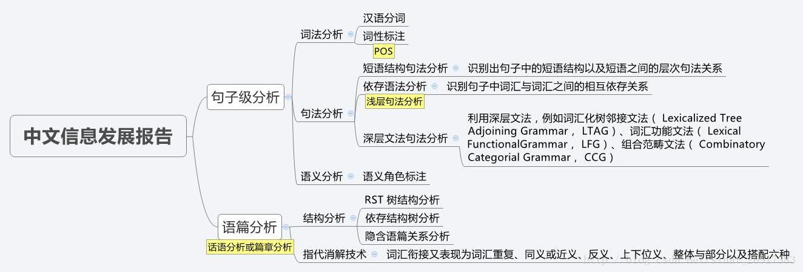
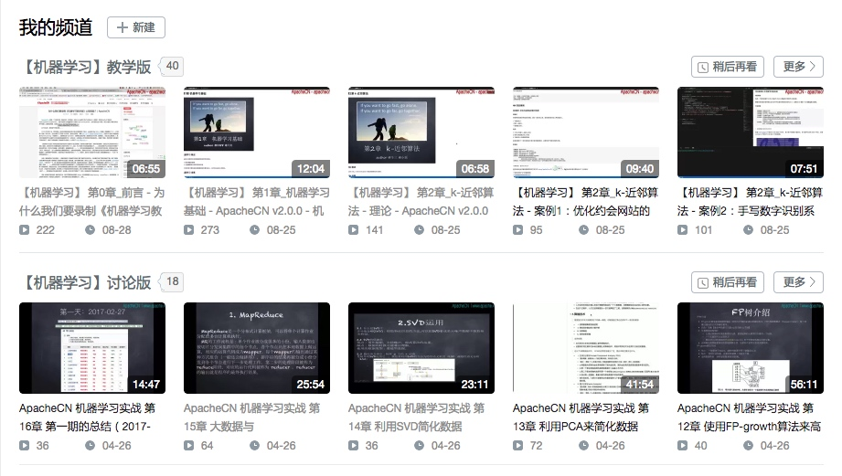
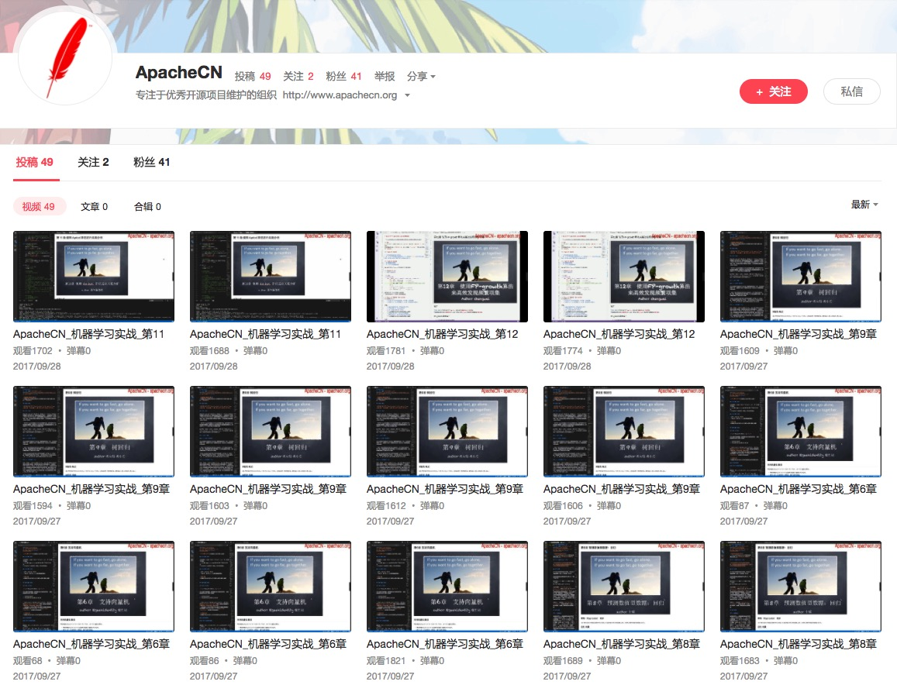
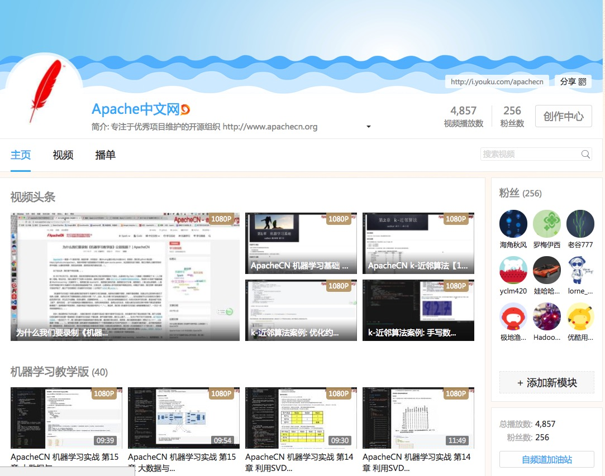
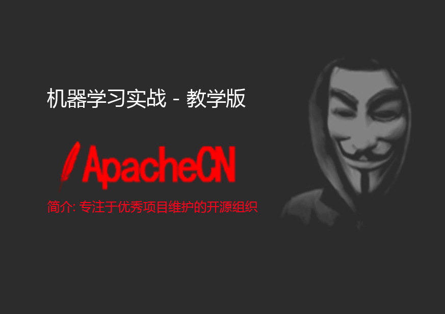

# AI Learning

> 组织介绍

* 首页地址: <http://www.apachecn.org>
* 关于我们: <http://www.apachecn.org/about>
* 我们与Apache没关系，只是Apache狂热的粉丝，才成立中文开源组织！
* 如有侵权，请联系邮箱: 【片刻】 <jiang-s@163.com>  (如果需要合作，也可以私聊我)

> **欢迎任何人参与和完善：一个人可以走的很快，但是一群人却可以走的更远**

* **ApacheCN - 学习机器学习群【629470233】<a target="_blank" href="//shang.qq.com/wpa/qunwpa?idkey=30e5f1123a79867570f665aa3a483ca404b1c3f77737bc01ec520ed5f078ddef"></a>**
* **Machine Learning in Action (机器学习实战) | [ApacheCN(apache中文网)](http://cwiki.apachecn.org/)**
* 电子版书籍：[【机器学习实战-中文版-带目录版.pdf】](https://github.com/apachecn/AiLearning/tree/master/books)  
* -- 感谢 [群小哥哥：Wizard Zhang](https://github.com/wizardforcel) 生成的电子书[《机器学习实战-ApacheCN.pdf》](https://github.com/apachecn/AiLearning/blob/master/books/机器学习实战-ApacheCN.pdf)
* **视频已更新完成，如果你觉得有价值，请帮忙点 Star【后续组织学习活动：sklearn、kaggle、 Pytorch 和 tensorflow】**
* -- 视频网站：优酷 ／bilibili / Acfun / 网易云课堂，可直接在线播放。（最下方有相应链接）
* -- [群小哥哥：红色石头](https://github.com/RedstoneWill): [台湾大学林轩田机器学习笔记](https://github.com/apachecn/ntu-hsuantienlin-ml)
* 推荐一个[机器学习笔记](https://feisky.xyz/machine-learning): https://feisky.xyz/machine-learning
* 推荐一个[liuhuanyong大佬](https://github.com/liuhuanyong)整理的nlp全面知识体系: <https://liuhuanyong.github.io>

<table>
  <tr>
    <th>模块</th>
    <th>章节</th>
    <th>类型</th>
    <th>负责人(GitHub)</th>
    <th>QQ</th>
  </tr>
  <tr>
    <td>机器学习实战</td>
    <td><a href="blog/ml/1.机器学习基础.md"> 第 1 章: 机器学习基础</a></td>
    <td>介绍</td>
    <td><a href="https://github.com/ElmaDavies">@毛红动</a></td>
    <td>1306014226</td>
  </tr>
  <tr>
    <td>机器学习实战</td>
    <td><a href="blog/ml/2.k-近邻算法.md">第 2 章: KNN 近邻算法</a></td>
    <td>分类</td>
    <td><a href="https://github.com/youyj521">@尤永江</a></td>
    <td>279393323</td>
  </tr>
  <tr>
    <td>机器学习实战</td>
    <td><a href="blog/ml/3.决策树.md">第 3 章: 决策树</a></td>
    <td>分类</td>
    <td><a href="https://github.com/jingwangfei">@景涛</a></td>
    <td>844300439</td>
  </tr>
  <tr>
    <td>机器学习实战</td>
    <td><a href="blog/ml/4.朴素贝叶斯.md">第 4 章: 朴素贝叶斯</a></td>
    <td>分类</td>
    <td><a href="https://github.com/wnma3mz">@wnma3mz</a><br/><a href="https://github.com/kailian">@分析</a></td>
    <td>1003324213<br/>244970749</td>
  </tr>
  <tr>
    <td>机器学习实战</td>
    <td><a href="blog/ml/5.Logistic回归.md">第 5 章: Logistic回归</a></td>
    <td>分类</td>
    <td><a href="https://github.com/DataMonk2017">@微光同尘</a></td>
    <td>529925688</td>
  </tr>
  <tr>
    <td>机器学习实战</td>
    <td><a href="blog/ml/6.支持向量机.md">第 6 章: SVM 支持向量机</a></td>
    <td>分类</td>
    <td><a href="https://github.com/VPrincekin">@王德红</a></td>
    <td>934969547</td>
  </tr>
  <tr>
    <td>网上组合内容</td>
    <td><a href="blog/ml/7.集成方法-随机森林和AdaBoost.md">第 7 章: 集成方法（随机森林和 AdaBoost）</a></td>
    <td>分类</td>
    <td><a href="https://github.com/jiangzhonglian">@片刻</a></td>
    <td>529815144</td>
  </tr>
  <tr>
    <td>机器学习实战</td>
    <td><a href="blog/ml/8.回归.md">第 8 章: 回归</a></td>
    <td>回归</td>
    <td><a href="https://github.com/DataMonk2017">@微光同尘</a></td>
    <td>529925688</td>
  </tr>
  <tr>
    <td>机器学习实战</td>
    <td><a href="blog/ml/9.树回归.md">第 9 章: 树回归</a></td>
    <td>回归</td>
    <td><a href="https://github.com/DataMonk2017">@微光同尘</a></td>
    <td>529925688</td>
  </tr>
  <tr>
    <td>机器学习实战</td>
    <td><a href="blog/ml/10.k-means聚类.md">第 10 章: K-Means 聚类</a></td>
    <td>聚类</td>
    <td><a href="https://github.com/xuzhaoqing">@徐昭清</a></td>
    <td>827106588</td>
  </tr>
  <tr>
    <td>机器学习实战</td>
    <td><a href="blog/ml/11.使用Apriori算法进行关联分析.md">第 11 章: 利用 Apriori 算法进行关联分析</a></td>
    <td>频繁项集</td>
    <td><a href="https://github.com/WindZQ">@刘海飞</a></td>
    <td>1049498972</td>
  </tr>
  <tr>
    <td>机器学习实战</td>
    <td><a href="blog/ml/12.使用FP-growth算法来高效发现频繁项集.md">第 12 章: FP-growth 高效发现频繁项集</a></td>
    <td>频繁项集</td>
    <td><a href="https://github.com/mikechengwei">@程威</a></td>
    <td>842725815</td>
  </tr>
  <tr>
    <td>机器学习实战</td>
    <td><a href="blog/ml/13.利用PCA来简化数据.md">第 13 章: 利用 PCA 来简化数据</a></td>
    <td>工具</td>
    <td><a href="https://github.com/lljuan330">@廖立娟</a></td>
    <td>835670618</td>
  </tr>
  <tr>
    <td>机器学习实战</td>
    <td><a href="blog/ml/14.利用SVD简化数据.md">第 14 章: 利用 SVD 来简化数据</a></td>
    <td>工具</td>
    <td><a href="https://github.com/marsjhao">@张俊皓</a></td>
    <td>714974242</td>
  </tr>
  <tr>
    <td>机器学习实战</td>
    <td><a href="blog/ml/15.大数据与MapReduce.md">第 15 章: 大数据与 MapReduce</a></td>
    <td>工具</td>
    <td>空缺 - 有兴趣私聊片刻</td>
    <td>529815144</td>
  </tr>
  <tr>
    <td>Ml项目实战</td>
    <td><a href="blog/ml/16.推荐系统.md">第 16 章: 推荐系统</a></td>
    <td>项目</td>
    <td>空缺 - 有兴趣私聊片刻</td>
    <td>529815144</td>
  </tr>
  <tr>
    <td>第一期的总结</td>
    <td><a href="report/2017-04-08_第一期的总结.md">2017-04-08: 第一期的总结</a></td>
    <td>总结</td>
    <td>总结</td>
    <td>529815144</td>
  </tr>
</table>

# 深度学习 DeepLearning

* 1.) [入门介绍](/blog/dl/1.入门介绍.md)
* 2.） 代码位置：src/py2.x or py3.x/DL

# 自然语言处理 NLP

## 百度公开课（使用场景了解）

> 第一部分 入门介绍

* 1.) [自然语言处理入门介绍](/blog/nlp/1.自然语言处理入门介绍.md)

> 第二部分 机器翻译

* 2.) [机器翻译](/blog/nlp/2.机器翻译.md)

> 第三部分 篇章分析

* 3.1.) [篇章分析-内容概述](/blog/nlp/3.1.篇章分析-内容概述.md)
* 3.2.) [篇章分析-内容标签](/blog/nlp/3.2.篇章分析-内容标签.md)
* 3.3.) [篇章分析-情感分析](/blog/nlp/3.3.篇章分析-情感分析.md)
* 3.4.) [篇章分析-自动摘要](/blog/nlp/3.4.篇章分析-自动摘要.md)

> 第四部分 UNIT-语言理解与交互技术

* 4.) [UNIT-语言理解与交互技术](/blog/nlp/4.UNIT-语言理解与交互技术.md)

## 自然语言处理(NLP) - 相关项目

学习过程中-内心复杂的变化！！！

```python
自从学习NLP以后，才发现国内与国外的典型区别:
1. 对资源的态度是完全相反的:
  1) 国内：就好像为了名气，举办工作装逼的会议，就是没有干货，全部都是象征性的PPT介绍，不是针对在做的各位
  2）国外：就好像是为了推动nlp进步一样，分享者各种干货资料和具体的实现。（特别是: python自然语言处理）
2. 论文的实现：
  1) 各种高大上的论文实现，却还是没看到一个像样的GitHub项目！（可能我的搜索能力差了点，一直没找到）
  2）国外就不举例了，我看不懂！
3. 开源的框架
  1）国外的开源框架： tensorflow/pytorch 文档+教程+视频（官方提供）
  2) 国内的开源框架: 额额，还真举例不出来！但是牛逼吹得不比国外差！（好像 MXNet 是沐神弄的？？ 文档+教程+视频）
每一次深入都要去翻墙，每一次深入都要Google，每一次看着国内的说：哈工大、讯飞、中科大、百度、阿里 多牛逼，但是资料还是得国外去找！
有时候真的挺狠的！真的有点瞧不起自己国内的技术环境！

当然谢谢国内很多博客大佬，特别是一些入门的Demo和基本概念。【深入的水平有限，没看懂】
```



* 入门教程需看资料【添加比赛链接】: https://github.com/apachecn/AiLearning/tree/dev/blog/nlp
* Python 自然语言处理 第二版: https://usyiyi.github.io/nlp-py-2e-zh

### 中文分词：

* 构建DAG图
* 动态规划查找，综合正反向（正向加权反向输出）求得DAG最大概率路径
* 使用了SBME语料训练了一套 HMM + Viterbi 模型，解决未登录词问题

### 1.文本分类（Text Classification）

文本分类是指标记句子或文档，例如电子邮件垃圾邮件分类和情感分析。

下面是一些很好的初学者文本分类数据集。

1. [路透社Newswire主题分类](http://kdd.ics.uci.edu/databases/reuters21578/reuters21578.html)（路透社-21578）。1987年路透社出现的一系列新闻文件，按类别编制索引。[另见RCV1，RCV2和TRC2](http://trec.nist.gov/data/reuters/reuters.html)。
2. [IMDB电影评论情感分类（斯坦福）](http://ai.stanford.edu/~amaas/data/sentiment)。来自网站imdb.com的一系列电影评论及其积极或消极的情绪。
3. [新闻组电影评论情感分类（康奈尔）](http://www.cs.cornell.edu/people/pabo/movie-review-data/)。来自网站imdb.com的一系列电影评论及其积极或消极的情绪。

有关更多信息，请参阅帖子：
[单标签文本分类的数据集](http://ana.cachopo.org/datasets-for-single-label-text-categorization)。

> 情感分析

比赛地址: https://www.kaggle.com/c/word2vec-nlp-tutorial

* 方案一(0.86)：WordCount + 朴素 Bayes
* 方案二(0.94)：LDA + 分类模型（knn/决策树/逻辑回归/svm/xgboost/随机森林）
  * a) 决策树效果不是很好，这种连续特征不太适合的
  * b) 通过参数调整 200 个topic，信息量保存效果较优（计算主题）
* 方案三(0.72)：word2vec + CNN
  * 说实话：没有一个好的机器，是调不出来一个好的结果 (: 逃

**通过AUC 来评估模型的效果**

### 2.语言模型（Language Modeling）

语言建模涉及开发一种统计模型，用于预测句子中的下一个单词或一个单词中的下一个单词。它是语音识别和机器翻译等任务中的前置任务。

它是语音识别和机器翻译等任务中的前置任务。

下面是一些很好的初学者语言建模数据集。

1. [古腾堡项目](https://www.gutenberg.org/)，一系列免费书籍，可以用纯文本检索各种语言。
2. 还有更多正式的语料库得到了很好的研究; 例如：
    [布朗大学现代美国英语标准语料库](https://en.wikipedia.org/wiki/Brown_Corpus)。大量英语单词样本。
    [谷歌10亿字语料库](https://github.com/ciprian-chelba/1-billion-word-language-modeling-benchmark)。

> 新词发现

* 中文分词新词发现
* python3利用互信息和左右信息熵的中文分词新词发现
* <https://github.com/zhanzecheng/Chinese_segment_augment>

> 句子相似度识别

* 项目地址: https://www.kaggle.com/c/quora-question-pairs
* 解决方案: word2vec + Bi-GRU

> 文本纠错

* bi-gram + levenshtein

### 3.图像字幕（Image Captioning）

mage字幕是为给定图像生成文本描述的任务。

下面是一些很好的初学者图像字幕数据集。

1. [上下文中的公共对象（COCO）](http://mscoco.org/dataset/#overview)。包含超过12万张带描述的图像的集合
2. [Flickr 8K](http://nlp.cs.illinois.edu/HockenmaierGroup/8k-pictures.html)。从flickr.com获取的8千个描述图像的集合。
3. [Flickr 30K](http://shannon.cs.illinois.edu/DenotationGraph/)。从flickr.com获取的3万个描述图像的集合。
    欲了解更多，请看帖子：

[探索图像字幕数据集，2016年](http://sidgan.me/technical/2016/01/09/Exploring-Datasets)

### 4.机器翻译（Machine Translation）

机器翻译是将文本从一种语言翻译成另一种语言的任务。

下面是一些很好的初学者机器翻译数据集。

1. [加拿大第36届议会的协调国会议员](https://www.isi.edu/natural-language/download/hansard/)。成对的英语和法语句子。
2. [欧洲议会诉讼平行语料库1996-2011](http://www.statmt.org/europarl/)。句子对一套欧洲语言。
    有大量标准数据集用于年度机器翻译挑战; 看到：

[统计机器翻译](http://www.statmt.org/)

> 机器翻译

* Encoder + Decoder(Attention)
* 参考案例: http://pytorch.apachecn.org/cn/tutorials/intermediate/seq2seq_translation_tutorial.html

### 5.问答系统（Question Answering）

问答是一项任务，其中提供了一个句子或文本样本，从中提出问题并且必须回答问题。

下面是一些很好的初学者问题回答数据集。

1. [斯坦福问题回答数据集（SQuAD）](https://rajpurkar.github.io/SQuAD-explorer/)。回答有关维基百科文章的问题。
2. [Deepmind问题回答语料库](https://github.com/deepmind/rc-data)。从每日邮报回答有关新闻文章的问题。
3. [亚马逊问答数据](http://jmcauley.ucsd.edu/data/amazon/qa/)。回答有关亚马逊产品的问题。
    有关更多信息，请参阅帖子：

[数据集：我如何获得问答网站的语料库，如Quora或Yahoo Answers或Stack Overflow来分析答案质量？](https://www.quora.com/Datasets-How-can-I-get-corpus-of-a-question-answering-website-like-Quora-or-Yahoo-Answers-or-Stack-Overflow-for-analyzing-answer-quality)

### 6.语音识别（Speech Recognition）

语音识别是将口语的音频转换为人类可读文本的任务。

下面是一些很好的初学者语音识别数据集。

1. [TIMIT声学 - 语音连续语音语料库](https://catalog.ldc.upenn.edu/LDC93S1)。不是免费的，但因其广泛使用而上市。口语美国英语和相关的转录。
2. [VoxForge](http://voxforge.org/)。用于构建用于语音识别的开源数据库的项目。
3. [LibriSpeech ASR语料库](http://www.openslr.org/12/)。从LibriVox收集的大量英语有声读物。

### 7.自动文摘（Document Summarization）

文档摘要是创建较大文档的简短有意义描述的任务。

下面是一些很好的初学者文档摘要数据集。

1. [法律案例报告数据集](https://archive.ics.uci.edu/ml/datasets/Legal+Case+Reports)。收集了4000份法律案件及其摘要。
2. [TIPSTER文本摘要评估会议语料库](http://www-nlpir.nist.gov/related_projects/tipster_summac/cmp_lg.html)。收集了近200份文件及其摘要。
3. [英语新闻文本的AQUAINT语料库](https://catalog.ldc.upenn.edu/LDC2002T31)。不是免费的，而是广泛使用的。新闻文章的语料库。
    欲了解更多信息：

[文档理解会议（DUC）任务](http://www-nlpir.nist.gov/projects/duc/data.html)。
[在哪里可以找到用于文本摘要的良好数据集？](https://www.quora.com/Where-can-I-find-good-data-sets-for-text-summarization)

> 命名实体识别

* Bi-LSTM CRF
* 参考案例: http://pytorch.apachecn.org/cn/tutorials/beginner/nlp/advanced_tutorial.html
* CRF推荐文档: https://www.jianshu.com/p/55755fc649b1

> 文本摘要

* **抽取式**
* word2vec + textrank
* word2vec推荐文档: https://www.zhihu.com/question/44832436/answer/266068967
* textrank推荐文档: https://blog.csdn.net/BaiHuaXiu123/article/details/77847232

### 进一步阅读

如果您希望更深入，本节提供了其他数据集列表。

1. [维基百科研究中使用的文本数据集](https://en.wikipedia.org/wiki/List_of_datasets_for_machine_learning_research#Text_data)
2. [数据集：计算语言学家和自然语言处理研究人员使用的主要文本语料库是什么？](https://www.quora.com/Datasets-What-are-the-major-text-corpora-used-by-computational-linguists-and-natural-language-processing-researchers-and-what-are-the-characteristics-biases-of-each-corpus)
3. [斯坦福统计自然语言处理语料库](https://nlp.stanford.edu/links/statnlp.html#Corpora)
4. [按字母顺序排列的NLP数据集列表](https://github.com/niderhoff/nlp-datasets)
5. [该机构NLTK](http://www.nltk.org/nltk_data/)
6. [在DL4J上打开深度学习数据](https://deeplearning4j.org/opendata)
7. [NLP数据集](https://github.com/caesar0301/awesome-public-datasets#natural-language)
8. 国内开放数据集: https://bosonnlp.com/dev/resource

## 网站视频

> [知乎问答-爆炸啦-机器学习该怎么入门？](https://www.zhihu.com/question/20691338/answer/248678328)

当然我知道，第一句就会被吐槽，因为科班出身的人，不屑的吐了一口唾沫，说傻X，还评论 Andrew Ng 的视频。。

我还知道还有一部分人，看 Andrew Ng 的视频就是看不懂，那神秘的数学推导，那迷之微笑的英文版的教学，我何尝又不是这样走过来的？？ 我的心可能比你们都痛，因为我在网上收藏过上10部《机器学习》相关视频，外加国内本土风格的教程：7月+小象 等等，我都很难去听懂，直到有一天，被一个百度的高级算法分析师推荐说：《机器学习实战》还不错，通俗易懂，你去试试？？

我试了试，还好我的Python基础和调试能力还不错，基本上代码都调试过一遍，很多高大上的 "理论+推导"，在我眼中变成了几个 "加减乘除+循环"，我想这不就是像我这样的程序员想要的入门教程么？

很多程序员说机器学习 TM 太难学了，是的，真 TM 难学，我想最难的是：没有一本像《机器学习实战》那样的作者愿意以程序员 Coding 角度去给大家讲解！！

最近几天，GitHub 涨了 300颗 star，加群的200人， 现在还在不断的增加++，我想大家可能都是感同身受吧！

很多想入门新手就是被忽悠着收藏收藏再收藏，但是最后还是什么都没有学到，也就是"资源收藏家"，也许新手要的就是 [MachineLearning(机器学习) 学习路线图](http://www.apachecn.org/map/145.html)。没错，我可以给你们的一份，因为我们还通过视频记录下来我们的学习过程。水平当然也有限，不过对于新手入门，绝对没问题，如果你还不会，那算我输！！

> 视频怎么看？



1. 理论科班出身-建议去学习 Andrew Ng 的视频（Ng 的视频绝对是权威，这个毋庸置疑）
2. 编码能力强 - 建议看我们的[《机器学习实战-教学版》](https://space.bilibili.com/97678687/#!/channel/detail?cid=22486)
3. 编码能力弱 - 建议看我们的[《机器学习实战-讨论版》](https://space.bilibili.com/97678687/#!/channel/detail?cid=13045)，不过在看理论的时候，看 教学版-理论部分；讨论版的废话太多，不过在讲解代码的时候是一行一行讲解的；所以，根据自己的需求，自由的组合。

循序渐进大体介绍：[机器学习初学者建议 | ApacheCN](http://www.apachecn.org/map/179.html)

干货内容实际操作：[MachineLearning(机器学习) 学习路线图](http://www.apachecn.org/map/145.html)

> 【免费】数学教学视频 - 可汗学院 入门篇

* [@于振梓]() 推荐: 可汗学院-网易公开课

| 概率 | 统计 | 线性代数 |
| - | - | - |
| [可汗学院(概率)](http://open.163.com/special/Khan/probability.html)  | [可汗学院(统计学)](http://open.163.com/special/Khan/khstatistics.html)| [可汗学院(线性代数)](http://open.163.com/special/Khan/linearalgebra.html)

> 机器学习视频 - ApacheCN 教学版

|||
| - | - |
| AcFun | B站 |
| <a title="AcFun（机器学习视频）" href="http://www.acfun.cn/u/12540256.aspx#page=1" target="_blank"></a> | <a title="bilibili（机器学习视频）" href="https://space.bilibili.com/97678687/#!/channel/index" target="_blank"></a> |
| 优酷 | 网易云课堂 |
| <a title="YouKu（机器学习视频）" href="http://i.youku.com/apachecn" target="_blank"></a> | <a title="WangYiYunKeTang（机器学习视频）" href="http://study.163.com/course/courseMain.htm?courseId=1004582003" target="_blank"></a> |

> 【免费】机器/深度学习视频 - 吴恩达

| 机器学习 | 深度学习 |
| - | - |
| [吴恩达机器学习](http://study.163.com/course/courseMain.htm?courseId=1004570029) | [神经网络和深度学习](http://mooc.study.163.com/course/2001281002?tid=2001392029) |

## 项目负责人

> Ml 第一期 (2017-02-27)

* [@片刻](https://github.com/jiangzhonglian)
* [@那伊抹微笑](https://github.com/wangyangting)
* [@瑶妹](https://github.com/chenyyx)
* [2017-04-08_第一期的总结](/report/2017-04-08_第一期的总结.md)

> Ml 第二期 (2017-08-14)

* [@片刻](https://github.com/jiangzhonglian)
* [@那伊抹微笑](https://github.com/wangyangting)
* [@瑶妹](https://github.com/chenyyx)
* [@Mike](https://github.com/mikechengwei)

> Ml 第三期 (2018-04-16)

## 项目贡献者

> Ml 第一期 (2017-02-27)

* [@侯法超](https://github.com/geekidentity)
* [@hello19883](https://github.com/hello19883)
* [@徐鑫](https://github.com/sheepmen)
* [@ibe](https://github.com/highfei2011)

> Ml 第二期 (2017-08-14)

* [@Arithmetic](https://github.com/LeeMoonCh)
* [@Veyron C](https://github.com/caopeirui)
* [@Cugtyt](https://github.com/Cugtyt)
* [@BBruceyuan](https://github.com/hey-bruce)

> Ml 第三期 (2018-04-16)

## 群管理员换届

* [@瑶妹](https://github.com/chenyyx)
* [@飞龙](https://github.com/wizardforcel)
* [@片刻](https://github.com/jiangzhonglian)
* [@伪文艺.](https://github.com/Watermelon233)
* [@那伊抹微笑](https://github.com/wangyangting)
* [@LAMDA-健忘症]() 永久留任-非常感谢对群的贡献

> Ml 第一届 (2017-09-01)

* [@易漠]()
* [@Mike](https://github.com/mikechengwei)
* [@Books]()
* [@李孟禹]()
* [@张假飞]()
* [@Glassy]()
* [@红色石头]()
* [@微光同尘]()

> Ml 第二届 (2018-07-04)

* [@张假飞]()
* [@李孟禹]()
* [@小明教主]()
* [@平淡的天]()
* [@凌少skierゞ]()
* [@じ☆νЁ坐看云起]()
* [古柳-DesertsX]()
* [woodchuck]()
* [自由精灵]()

**欢迎贡献者不断的追加**

> 加入方式

* 企鹅: 529815144(片刻) 1042658081(那伊抹微笑) 190442212(瑶妹)
* [ApacheCN(apache中文网) 维护更新](http://www.apachecn.org) : [关于我们](http://cwiki.apachecn.org/pages/viewpage.action?pageId=2887240) && [加入我们](http://cwiki.apachecn.org/pages/viewpage.action?pageId=2887239)

## 免责声明 - 【只供学习参考】

* ApacheCN 纯粹出于学习目的与个人兴趣翻译本书
* ApacheCN 保留对此版本译文的署名权及其它相关权利

---

资料来源:

* 【比赛收集平台】: https://github.com/iphysresearch/DataSciComp
* https://github.com/pbharrin/machinelearninginaction
* https://machinelearningmastery.com/datasets-natural-language-processing

## 赞助我们


## License

GPL-3.0 © [ApacheCN](https://github.com/apachecn)

## Organization

* ApacheCN 组织资源: <https://github.com/apachecn/home>

> 欢迎任何人参与和完善：一个人可以走的很快，但是一群人却可以走的更远
