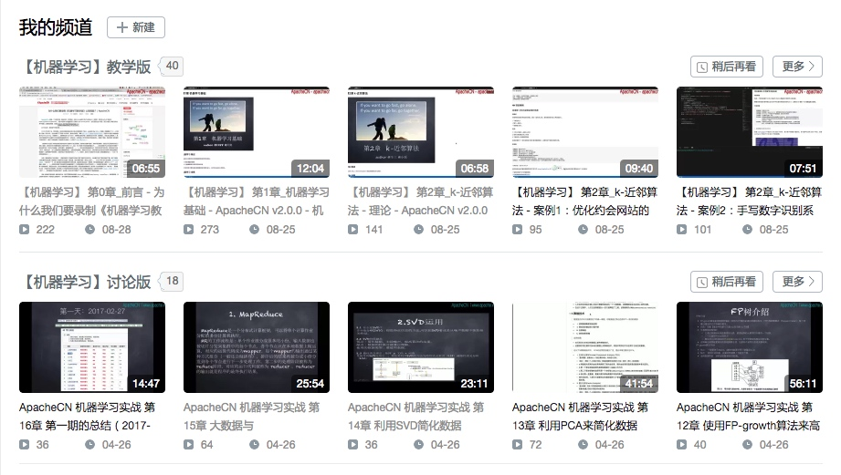
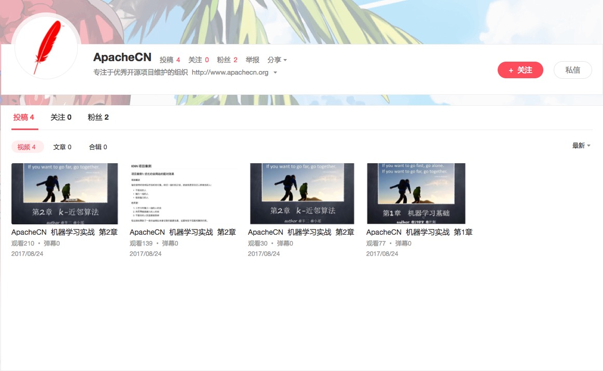
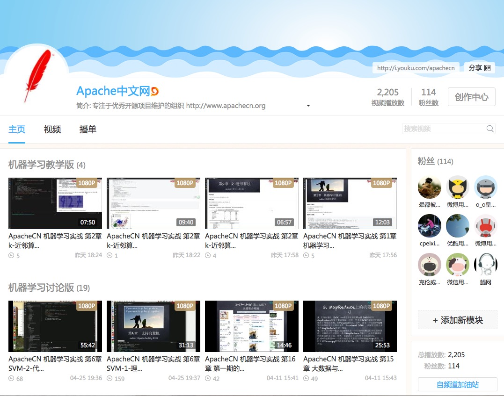

# MachineLearning

> **欢迎任何人参与和完善：一个人可以走的很快，但是一群人却可以走的更远**

* **ApacheCN - 学习机器学习群【629470233】**
* **Machine Learning in Action (机器学习实战) | [ApacheCN(apache中文网)](http://cwiki.apachecn.org/)**
* 电子版书籍：[【机器学习实战-中文版-带目录版.pdf】](https://github.com/apachecn/MachineLearning/tree/master/books)  
* -- 感谢 大佬 [Wizard Zhang](https://github.com/wizardforcel) 生成的电子书[《机器学习实战-ApacheCN.pdf》](https://github.com/apachecn/MachineLearning/blob/master/books/机器学习实战-ApacheCN.pdf)
* **视频已更新完成，如果你觉得有价值，请帮忙点 Star【后续组织学习活动：sklearn、kaggle 和 tensorflow】**
* -- 视频网站：优酷／bilibili / Acfun ，可直接在线播放。（最下方有相应链接）
* -- 对于帮忙转发 [MachineLearning(机器学习) 学习路线图](http://www.apachecn.org/map/145.html) 的朋友，可以加群后私聊 瑶妹 企鹅 赠送《机器学习实战》百度云视频一套，谢谢

## 第一部分  分类

* 1.) [机器学习基础](./docs/1.机器学习基础.md)
* 2.) [k-近邻算法](./docs/2.k-近邻算法.md)
* 3.) [决策树](./docs/3.决策树.md)
* 4.) [基于概率论的分类方法：朴素贝叶斯](./docs/4.朴素贝叶斯.md)
* 5.) [Logistic回归](./docs/5.Logistic回归.md)
* 6.) [支持向量机](./docs/6.支持向量机.md)
* 7.) [集成方法-随机森林和AdaBoost](./docs/7.集成方法-随机森林和AdaBoost.md)

## 第二部分  利用回归预测数值型数据

* 8.) [预测数值型数据：回归](./docs/8.预测数值型数据：回归.md)
* 9.) [树回归](./docs/9.树回归.md)

## 第三部分  无监督学习

* 10.) [使用K-均值聚类算法对未标注数据分组:k-means聚类](./docs/10.k-means聚类.md)
* 11.) [使用Apriori算法进行关联分析](./docs/11.使用Apriori算法进行关联分析.md)
* 12.) [使用FP-growth算法来高效发现频繁项集](./docs/12.使用FP-growth算法来高效发现频繁项集.md )

## 第四部分  其他工具

* 13.) [利用PCA来简化数据](./docs/13.利用PCA来简化数据.md)
* 14.) [利用SVD简化数据](./docs/14.利用SVD简化数据.md)
* 15.) [大数据与MapReduce](./docs/15.大数据与MapReduce.md)

## 第五部分  项目实战(非课本内容)

* 16.) [推荐系统](/docs/16.推荐系统.md)

## 阶段性总结

* [2017-04-08_第一期的总结](/report/2017-04-08_第一期的总结.md)

## 联系方式

> 项目负责人

* [@jiangzhonglian](https://github.com/jiangzhonglian)（片刻）

> 项目贡献者

* [@jiangzhonglian](https://github.com/jiangzhonglian)（片刻）
* [@wangyangting](https://github.com/wangyangting)（那伊抹微笑）
* [@chenyyx](https://github.com/chenyyx)（瑶妹）
* [@geekidentity](https://github.com/geekidentity)（侯法超）
* [@mikechengwei](https://github.com/mikechengwei)（Mike）
* [@hello19883](https://github.com/hello19883)（hello19883）
* [@sheepmen](https://github.com/sheepmen)（徐鑫）
* [@highfei2011](https://github.com/highfei2011)（ibe）
* [@LeeMoonCh](https://github.com/LeeMoonCh)（Arithmetic）
* [@caopeirui](https://github.com/caopeirui)（Veyron C）
* [@Cugtyt](https://github.com/Cugtyt)（Cugtyt）

> 加入方式

* 企鹅: 529815144(片刻) 1042658081(那伊抹微笑) 190442212(瑶妹)

* [ApacheCN(apache中文网) 维护更新](http://www.apachecn.org)
    * [关于我们](http://cwiki.apachecn.org/pages/viewpage.action?pageId=2887240)
    * [加入我们](http://cwiki.apachecn.org/pages/viewpage.action?pageId=2887239)

## 网站视频

> [知乎问答-爆炸啦-机器学习该怎么入门？](https://www.zhihu.com/question/20691338/answer/248678328)

当然我知道，第一句就会被吐槽，因为科班出身的人，不屑的吐了一口唾沫，说傻X，还评论 Andrew Ng 的视频。。

我还知道还有一部分人，看 Andrew Ng 的视频就是看不懂，那神秘的数学推导，那迷之微笑的英文版的教学，我何尝又不是这样走过来的？？ 我的心可能比你们都痛，因为我在网上收藏过上10部《机器学习》相关视频，外加国内本土风格的教程：7月+小象 等等，我都很难去听懂，直到有一天，被一个百度的高级算法分析师推荐说：《机器学习实战》还不错，通俗易懂，你去试试？？

我试了试，还好我的Python基础和调试能力还不错，基本上代码都调试过一遍，很多高大上的 "理论+推导"，在我眼中变成了几个 "加减乘除+循环"，我想这不就是像我这样的程序员想要的入门教程么？

很多程序员说机器学习 TM 太难学了，是的，真 TM 难学，我想最难的是：没有一本像《机器学习实战》那样的作者愿意以程序员 Coding 角度去给大家讲解！！

最近几天，GitHub 涨了 300颗 star，加群的200人， 现在还在不断的增加++，我想大家可能都是感同身受吧！

很多想入门新手就是被忽悠着收藏收藏再收藏，但是最后还是什么都没有学到，也就是"资源收藏家"，也许新手要的就是 [MachineLearning(机器学习) 学习路线图](http://www.apachecn.org/map/145.html)。没错，我可以给你们的一份，因为我们还通过视频记录下来我们的学习过程。水平当然也有限，不过对于新手入门，绝对没问题，如果你还不会，那算我输！！

> 视频怎么看？

1. 理论科班出身-建议去学习 Andrew Ng 的视频（Ng 的视频绝对是权威，这个毋庸置疑）
2. 编码能力强 - 建议看我们的[《机器学习实战-教学版》](https://space.bilibili.com/97678687/#!/channel/detail?cid=22486)
3. 编码能力弱 - 建议看我们的[《机器学习实战-讨论版》](https://space.bilibili.com/97678687/#!/channel/detail?cid=13045)，不过在看理论的时候，看 教学版-理论部分；讨论版的废话太多，不过在讲解代码的时候是一行一行讲解的；所以，根据自己的需求，自由的组合。

循序渐进大体介绍：[机器学习初学者建议 | ApacheCN](http://www.apachecn.org/map/179.html)

干货内容实际操作：[MachineLearning(机器学习) 学习路线图](http://www.apachecn.org/map/145.html)

> 机器学习视频-教学版

|||
| - | - |
| AcFun | B站 |
|  |  |
| 优酷 | 网易云课堂 |
|  |  |

## [ApacheCN 组织翻译](http://www.apachecn.org/)

> [kaggle: 机器学习竞赛](https://github.com/apachecn/kaggle)

| 深度学习 | 机器学习  | 大数据 | 运维工具 |
| --- | --- | --- | --- |
| [TensorFlow R1.2 中文文档](http://cwiki.apachecn.org/pages/viewpage.action?pageId=10030122) | [Sklearn 0.19 中文文档](http://sklearn.apachecn.org/) | [Spark 2.2.0和2.0.2 中文文档](http://spark.apachecn.org/) | [Zeppelin 0.7.2 中文文档](http://cwiki.apachecn.org/pages/viewpage.action?pageId=10030467) |
| pytorch 计划中 | [机器学习实战-教学版](https://github.com/apachecn/MachineLearning) | [Storm 1.1.0和1.0.1 中文文档](http://storm.apachecn.org/) | [Kibana 5.2 中文文档](http://cwiki.apachecn.org/pages/viewpage.action?pageId=8159377) |
| | [Beam 中文文档](http://beam.apachecn.org/) | [Kudu 1.4.0 中文文档](http://cwiki.apachecn.org/pages/viewpage.action?pageId=10813594) | |
| | | [Elasticsearch 5.4 中文文档](http://cwiki.apachecn.org/pages/viewpage.action?pageId=4260364) | |
