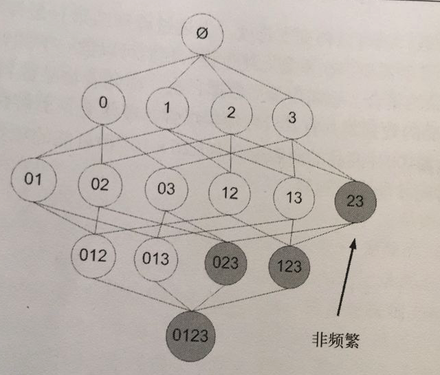

# 11) 使用Apriori算法进行关联分析

* 使用场景：
    * 目的：商店希望从客户身上获取尽可能多的利润。
    * 忠诚度计划： 通过顾客的会员卡可获取已定的折扣，商店也可以了解客户购买的商品; 不买会员卡，商店也可以查用顾客一起购买的物品，找出商品之间的关系。
    * 例如： 尿布和啤酒的故事
* 关联关系(associati analysis) 或 关联规则学习(association rule learning)
    * 从大规模数据集中寻找物品间的隐含关系呗称作关联关系。
* 关联分析：
    * 优点：易编码实现
    * 缺点：在大数据集上可能较慢
    * 适用数据类型：数值型 或者 标称型数据。
* 关联分析有2种形式：
    * 1.频繁项集(frequent item sets): 经常出现在一块的物品集合
    * 2.关联规则(association rules): 暗示两种物品之间可能存在很强的关系
    * 总结：首先需要找到频繁项集，才能找到关联规则。
    * 如下图：
    * 
* 支持度(support)
    * 数据集中包含该项集的记录所占的比例
    * 例如上图中：{豆奶}的支持度=4/5， {豆奶，尿布}的支持度=3/5
* 置信度（confidence)
    * 置信度({A}->{B}) = 支持度{A,B}/支持度{A} 
    * 例如上图中：{尿布，葡萄酒}的支持度=3/5， {尿布}的支持度=4/5， 所以 尿布->葡萄酒的可信度=3/4
* Apriori原理
    * 如果某个项集是频繁的，那么它的所有子集也是频繁的，反之，一个项集是非频繁的，那么它的所有超集也是非频繁的。
    * 例如： 我们假设知道{2, 3}是非频繁项，那么{0, 2, 3}, {1, 2, 3}, {0, 1, 2, 3}都是非频繁项。
    * 如下图：
    * 
