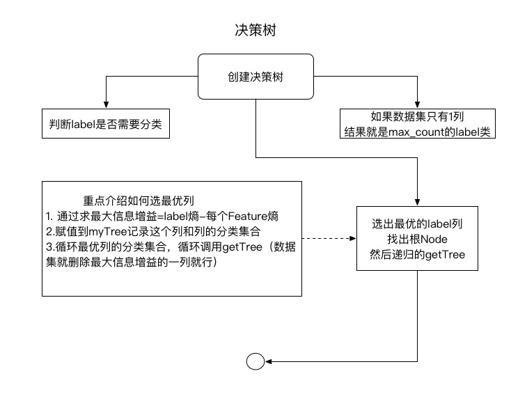

# 3) 决策树

* 决策树是什么？
    * 顾名思义，是一种树，一种依托于策略抉择而建立起来的树。
    * 从数据产生决策树的机器学习技术叫做决策树学习, 通俗点说就是决策树。
* 决策数目前的情况：
    * 1.最经常使用的数据挖掘算法。(流行的原因：不需要了解机器学习的知识，就能搞明白决策树是如何工作的)
    * 2.数据形式[决策过程只有：是／否]和数据内在含义非常容易理解。
    * 3.决策树给出的结果往往可以匹敌在当前领域具有几十年工作经验的人类专家。
* 决策树的构造：
    * 优点：计算复杂度不高，输出结果易于理解，对中间值的缺失不敏感，可以处理不相关特征数据。
    * 缺点：可能会产生过度匹配问题。
    * 适用数据类型：数值型和标称型[标称型:其实就是离散型数据，变量的结果只在`有限`目标集中取值(例如：分类特征 A/B/C类其中一种)]。
* 如何找出第一个分支点呢？
    * 信息增益： 
        * 划分数据集的最大原则是：将无序的数据变得更加有序。
        * 集合信息的度量称为`香农熵`或者简称`熵`(名字来源于信息论之父`克劳德·香农`)
        * 公式： 
            * \\(p(x_i)\\) 表示该label分类的概率
            * \\(l(x_i) = - \log_2p(x_i)\\) 表示符号\\(x_i\\)的信息定义
            * \\(H = -\sum_{i=0}^np(x_i)\log_2p(x_i)\\) 表示香农熵，用于计算信息熵
    * 基尼不纯度(Gini impurity)  [本书不做过多的介绍]
        * 简单来说：就是从一个数据集中随机选取子项，度量其被错误分类到其他分组里的概率。
* 流程介绍图
* 
