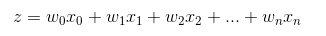
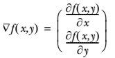
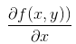
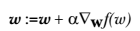
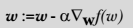

# 第5章 Logistic回归
<script type="text/javascript" src="http://cdn.mathjax.org/mathjax/latest/MathJax.js?config=default"></script>


## Logistic 回归 概述

`Logistic 回归虽然名字叫回归，但是它是用来做分类的。其主要思想是: 根据现有数据对分类边界线建立回归公式，以此进行分类。`

## 须知概念

### Sigmoid 函数

我们想要的函数应该是: 能接受所有的输入然后预测出类别。例如，在两个类的情况下，上述函数输出 0 或 1.或许你之前接触过具有这种性质的函数，该函数称为 `海维塞得阶跃函数(Heaviside step function)`，或者直接称为 `单位阶跃函数`。然而，海维塞得阶跃函数的问题在于: 该函数在跳跃点上从 0 瞬间跳跃到 1，这个瞬间跳跃过程有时很难处理。幸好，另一个函数也有类似的性质（可以输出 0 或者 1 的性质），且数学上更易处理，这就是 Sigmoid 函数。 Sigmoid 函数具体的计算公式如下: 


下图给出了 Sigmoid 函数在不同坐标尺度下的两条曲线图。当 x 为 0 时，Sigmoid 函数值为 0.5 。随着 x 的增大，对应的 Sigmoid 值将逼近于 1 ; 而随着 x 的减小， Sigmoid 值将逼近于 0 。如果横坐标刻度足够大， Sigmoid 函数看起来很像一个阶跃函数。


因此，为了实现 Logistic 回归分类器，我们可以在每个特征上都乘以一个回归系数，然后把所有结果值相加，将这个总和代入 Sigmoid 函数中，进而得到一个范围在 0~1 之间的数值。任何大于 0.5 的数据被分入 1 类，小于 0.5 即被归入 0 类。所以， Logistic 回归也可以被看成是一种概率估计。

### 基于最优化方法的回归系数确定

Sigmoid 函数的输入记为 z ，由下面公式得到: 



如果采用向量的写法，上述公式可以写成  ，它表示将这两个数值向量对应元素相乘然后全部加起来即得到 z 值。其中的向量 x 是分类器的输入数据，向量 w 也就是我们要找到的最佳参数（系数），从而使得分类器尽可能地精确。为了寻找该最佳参数，需要用到最优化理论的一些知识。我们这里使用的是——梯度上升法。

### 梯度上升法

梯度上升法基于的思想是: 要找到某函数的最大值，最好的方法是沿着该函数的梯度方向探寻。如果梯度记为 ▽ ，则函数 f(x, y) 的梯度由下式表示: 



这个梯度意味着要沿 x 的方向移动  ，沿 y 的方向移动  。其中，函数f(x, y) 必须要在待计算的点上有定义并且可微。下图是一个具体的例子。


上图展示的，梯度上升算法到达每个点后都会重新估计移动的方向。从 P0 开始，计算完该点的梯度，函数就根据梯度移动到下一点 P1。在 P1 点，梯度再次被重新计算，并沿着新的梯度方向移动到 P2 。如此循环迭代，直到满足停止条件。迭代过程中，梯度算子总是保证我们能选取到最佳的移动方向。

上图中的梯度上升算法沿梯度方向移动了一步。可以看到，梯度算子总是指向函数值增长最快的方向。这里所说的是移动方向，而未提到移动量的大小。该量值称为步长，记作 α 。用向量来表示的话，梯度上升算法的迭代公式如下: 



该公式将一直被迭代执行，直至达到某个停止条件为止，比如迭代次数达到某个指定值或者算法达到某个可以允许的误差范围。

**Note:** 我们常听到的是梯度下降算法，它与这里的梯度上升算法是一样的，只是公式中的加法需要变成减法。因此，对应的公式可以写成



梯度上升算法用来求函数的最大值，而梯度下降算法用来求函数的最小值。


## Logistic 回归 原理

### Logistic 回归 工作原理

```
每个回归系数初始化为 1
重复 R 次:
    计算整个数据集的梯度
    使用 alpha x gradient 更新回归系数的向量
返回回归系数
```

### Logistic 回归 开发流程

```
收集数据: 采用任意方法收集数据
准备数据: 由于需要进行距离计算，因此要求数据类型为数值型。另外，结构化数据格式则最佳。
分析数据: 采用任意方法对数据进行分析。
训练算法: 大部分时间将用于训练，训练的目的是为了找到最佳的分类回归系数。
测试算法: 一旦训练步骤完成，分类将会很快。
使用算法: 首先，我们需要输入一些数据，并将其转换成对应的结构化数值；接着，基于训练好的回归系数就可以对这些数值进行简单的回归计算，判定它们属于哪个类别；在这之后，我们就可以在输出的类别上做一些其他分析工作。
```

### Logistic 回归 算法特点

```
优点: 计算代价不高，易于理解和实现。
缺点: 容易欠拟合，分类精度可能不高。
适用数据类型: 数值型和标称型数据。
```

## Logistic 回归 项目案例

### 项目案例1: 使用 Logistic 回归在简单数据集上的分类

#### 项目概述

在一个简单的数据集上，采用梯度上升法找到 Logistic 回归分类器在此数据集上的最佳回归系数

#### 开发流程

```
收集数据: 可以使用任何方法
准备数据: 由于需要进行距离计算，因此要求数据类型为数值型。另外，结构化数据格式则最佳
分析数据: 画出决策边界
训练算法: 使用梯度上升找到最佳参数
测试算法: 使用 Logistic 回归进行分类
使用算法: 对简单数据集中数据进行分类
```

> 收集数据: 可以使用任何方法

我们采用存储在 TestSet.txt 文本文件中的数据，存储格式如下: 

```
-0.017612	14.053064	0
-1.395634	4.662541	1
-0.752157	6.538620	0
-1.322371	7.152853	0
0.423363	11.054677	0
```

绘制在图中，如下图所示: 


> 准备数据: 由于需要进行距离计算，因此要求数据类型为数值型。另外，结构化数据格式则最佳

> 分析数据: 画出决策边界

画出数据集和 Logistic 回归最佳拟合直线的函数

```python
def plotBestFit(dataArr, labelMat, weights):
    '''
        Desc:
            将我们得到的数据可视化展示出来
        Args:
            dataArr:样本数据的特征
            labelMat:样本数据的类别标签，即目标变量
            weights:回归系数
        Returns:
            None
    '''
    
    n = shape(dataArr)[0]
    xcord1 = []; ycord1 = []
    xcord2 = []; ycord2 = []
    for i in range(n):
        if int(labelMat[i])== 1:
            xcord1.append(dataArr[i,1]); ycord1.append(dataArr[i,2])
        else:
            xcord2.append(dataArr[i,1]); ycord2.append(dataArr[i,2])
    fig = plt.figure()
    ax = fig.add_subplot(111)
    ax.scatter(xcord1, ycord1, s=30, c='red', marker='s')
    ax.scatter(xcord2, ycord2, s=30, c='green')
    x = arange(-3.0, 3.0, 0.1)
    """
    y的由来，卧槽，是不是没看懂？
    首先理论上是这个样子的。
    dataMat.append([1.0, float(lineArr[0]), float(lineArr[1])])
    w0*x0+w1*x1+w2*x2=f(x)
    x0最开始就设置为1叻， x2就是我们画图的y值，而f(x)被我们磨合误差给算到w0,w1,w2身上去了
    所以： w0+w1*x+w2*y=0 => y = (-w0-w1*x)/w2   
    """
    y = (-weights[0]-weights[1]*x)/weights[2]
    ax.plot(x, y)
    plt.xlabel('X'); plt.ylabel('Y')
    plt.show()
```

> 训练算法: 使用梯度上升找到最佳参数

Logistic 回归梯度上升优化算法

```python
# 正常的处理方案
# 两个参数：第一个参数==> dataMatIn 是一个2维NumPy数组，每列分别代表每个不同的特征，每行则代表每个训练样本。
# 第二个参数==> classLabels 是类别标签，它是一个 1*100 的行向量。为了便于矩阵计算，需要将该行向量转换为列向量，做法是将原向量转置，再将它赋值给labelMat。
def gradAscent(dataMatIn, classLabels):
    # 转化为矩阵[[1,1,2],[1,1,2]....]
    dataMatrix = mat(dataMatIn)             # 转换为 NumPy 矩阵
    # 转化为矩阵[[0,1,0,1,0,1.....]]，并转制[[0],[1],[0].....]
    # transpose() 行列转置函数
    # 将行向量转化为列向量   =>  矩阵的转置
    labelMat = mat(classLabels).transpose() # 首先将数组转换为 NumPy 矩阵，然后再将行向量转置为列向量
    # m->数据量，样本数 n->特征数
    m,n = shape(dataMatrix)
    # print m, n, '__'*10, shape(dataMatrix.transpose()), '__'*100
    # alpha代表向目标移动的步长
    alpha = 0.001
    # 迭代次数
    maxCycles = 500
    # 生成一个长度和特征数相同的矩阵，此处n为3 -> [[1],[1],[1]]
    # weights 代表回归系数， 此处的 ones((n,1)) 创建一个长度和特征数相同的矩阵，其中的数全部都是 1
    weights = ones((n,1))
    for k in range(maxCycles):              #heavy on matrix operations
        # m*3 的矩阵 * 3*1 的单位矩阵 ＝ m*1的矩阵
        # 那么乘上单位矩阵的意义，就代表：通过公式得到的理论值
        # 参考地址： 矩阵乘法的本质是什么？ https://www.zhihu.com/question/21351965/answer/31050145
        # print 'dataMatrix====', dataMatrix 
        # print 'weights====', weights
        # n*3   *  3*1  = n*1
        h = sigmoid(dataMatrix*weights)     # 矩阵乘法
        # print 'hhhhhhh====', h
        # labelMat是实际值
        error = (labelMat - h)              # 向量相减
        # 0.001* (3*m)*(m*1) 表示在每一个列上的一个误差情况，最后得出 x1,x2,xn的系数的偏移量
        weights = weights + alpha * dataMatrix.transpose() * error # 矩阵乘法，最后得到回归系数
    return array(weights)
```

> 测试算法: 使用 Logistic 回归进行分类

```python
def testLR():
    # 1.收集并准备数据
    dataMat, labelMat = loadDataSet("input/5.Logistic/TestSet.txt")

    # print dataMat, '---\n', labelMat
    # 2.训练模型，  f(x)=a1*x1+b2*x2+..+nn*xn中 (a1,b2, .., nn).T的矩阵值
    # 因为数组没有是复制n份， array的乘法就是乘法
    dataArr = array(dataMat)
    # print dataArr
    weights = gradAscent(dataArr, labelMat)
    # weights = stocGradAscent0(dataArr, labelMat)
    # weights = stocGradAscent1(dataArr, labelMat)
    # print '*'*30, weights

    # 数据可视化
    plotBestFit(dataArr, labelMat, weights)
```

> 使用算法: 对简单数据集中数据进行分类

#### 注意

梯度上升算法在每次更新回归系数时都需要遍历整个数据集，该方法在处理 100 个左右的数据集时尚可，但如果有数十亿样本和成千上万的特征，那么该方法的计算复杂度就太高了。一种改进方法是一次仅用一个样本点来更新回归系数，该方法称为 `随机梯度上升算法`。由于可以在新样本到来时对分类器进行增量式更新，因而随机梯度上升算法是一个在线学习算法。与 “在线学习” 相对应，一次处理所有数据被称作是 “批处理”。

随机梯度上升算法可以写成如下的伪代码: 

```
所有回归系数初始化为 1
对数据集中每个样本
    计算该样本的梯度
    使用 alpha x gradient 更新回归系数值
返回回归系数值
```

以下是随机梯度上升算法的实现代码: 

```python
# 随机梯度上升
# 梯度上升优化算法在每次更新数据集时都需要遍历整个数据集，计算复杂都较高
# 随机梯度上升一次只用一个样本点来更新回归系数
def stocGradAscent0(dataMatrix, classLabels):
    m,n = shape(dataMatrix)
    alpha = 0.01
    # n*1的矩阵
    # 函数ones创建一个全1的数组
    weights = ones(n)   # 初始化长度为n的数组，元素全部为 1
    for i in range(m):
        # sum(dataMatrix[i]*weights)为了求 f(x)的值， f(x)=a1*x1+b2*x2+..+nn*xn,此处求出的 h 是一个具体的数值，而不是一个矩阵
        h = sigmoid(sum(dataMatrix[i]*weights))
        # print 'dataMatrix[i]===', dataMatrix[i]
        # 计算真实类别与预测类别之间的差值，然后按照该差值调整回归系数
        error = classLabels[i] - h
        # 0.01*(1*1)*(1*n)
        print weights, "*"*10 , dataMatrix[i], "*"*10 , error
        weights = weights + alpha * error * dataMatrix[i]
    return weights
```


介绍一下几个相关的概念：
```
    例如：y = w1x1 + w2x2 + ... + wnxn
    梯度：参考上图的例子，二维图像，x方向是代表第一个系数，也就是w1，y方向代表第二个系数也就是w2，这样的向量就是梯度。
    α：上面的梯度算法的迭代公式中的阿尔法，这个代表的是移动步长。移动步长会影响最终结果的拟合程度，最好的方法就是随着迭代次数更改移动步长。
        步长通俗的理解，100米，如果我一步走10米，我需要走10步；如果一步走20米，我只需要走5步。这里的一步走多少米就是步长的意思。
    ▽f(w)：代表沿着梯度变化的方向。
```

拟合程度简介
参考： http://blog.csdn.net/willduan1/article/details/53070777

下面是原始数据集：


下面是拟合程度较好的：


欠拟合：模型没有很好地捕捉到数据特征，不能很好地拟合数据。


过拟合：模型把数据学习的太彻底了，以至于把噪声数据的特征也学习到了，这样就会导致在后期测试的时候不能够很好地识别数据，即不能正确地分类，模型泛化能力太差。


梯度上升法的伪代码如下：
```
    某个回归系数初始化为1
    重复R次：
        计算整个数据集的梯度
        使用 alpha X grandient 更新回归系数的向量
    返回回归系数
```


梯度上升算法在每次回归系数时都需要遍历整个数据集，该方法在处理100个左右的数据集时尚可，但如果有数十亿样本和成千上万的特征，
那么该方法的计算复杂度就太高了。一种改进方法是一次仅用一个样本点来更新回归系数，该方法称为随机梯度上升算法。
由于可以在新样本到来时对分类器进行增量式更新，因而随机梯度上升算法是一个在线学习算法。与“在线学习”相对应，
一次处理所有数据被称作是“批处理”。
    随机梯度上升算法可以写成如下的伪代码：

    所有回归系数初始化为1
    对数据集中每个样本
        计算该样本的梯度
        使用 alpha X gradient 更新回归系数值
    返回回归系数值

## 梯度下降最优化算法

你最经常听到的应该是梯度下降算法，它与这里的梯度上升算法是一样的，只是公式中的加法需要变成减法。因此，对应的公式可以写成：
    w:=w-a▽f(w)
梯度上升算法用来求函数的最大值，而梯度下降算法用来求函数的最小值。

## 数据中的缺失项处理

数据中的缺失值是个非常棘手的问题，有很多文献都致力于解决这个问题。这个问题没有标准答案，取决于实际应用中的需求。
那么，数据缺失究竟带来了什么问题？假设有100个样本和20个特征，
这些数据都是机器手机回来的。若机器上的某个传感器损坏导致一个特征无效时该怎么办？此时是否要扔掉整个数据？这种情况下，另外19个特征怎么办？
它们是否还可以用？答案是肯定的。因为有时候数据相当昂贵，扔掉和重新获取都是不可取的，所以必须采用一些方法来解决这个问题。
* 下面给出了一些可选的做法：
    * 使用可用特征的均值来填补缺失值；
    * 使用特殊值来填补缺失值，如 -1；
    * 忽略有缺失值的样本；
    * 使用有相似样本的均值添补缺失值；
    * 使用另外的机器学习算法预测缺失值。

## Logistic 回归总结

* 逻辑回归(Logistic Regression)
    * 5.1 分类问题
        * 在分类问题中，尝试预测的是结果是否属于某一个类（例如正确或错误）。
        * 分类问题的例子有：
            * 判断一封电子邮件是否是垃圾邮件；
            * 判断一次金融交易是否是欺诈等等。
        * 从二元的分类问题开始讨论:
             将因变量(dependant variable)可能属于的两个类分别称为负向类（negative class）和正向类（positive class），则因变量
             y属于{0，1}
             注：其中 0 表示负向类，1 表示正向类。
    * 5.2 假说表示

    * 5.3 判定边界
        * 在逻辑回归中，我们预测：
        
             当 hθ 大于等于 0.5 时，预测 y=1
             当 hθ 小于 0.5 时，预测 y=0
        * 根据上面绘制出的 S 形函数图像，我们知道当
             z=0时 ，g(z)=0.5
             z>0时 ，g(z)>0.5
             z<0时 ，g(z)<0.5
             又z=θ的T次方与X的积，即：
               z大于等于0时，预测：y=1
               z小于0时，预测：y=0
        * 现在假设我们有一个模型：Hθ(x)=g(θ0+θ1*x1+θ2*x2)
             并且参数θ是向量[-3 1 1]。则当-3+x1+x2大于等于0，即x1+x2大于等于3时，模型将预测y=1。
             我们可以绘制直线x1+x2=3，这条线便是我们模型的分界线，将预测为1的区域和预测为0的区域分隔开。
        * 假使我们的数据呈现这样的分布情况，怎样的模型才能适合呢？
          因为需要用曲线才能分隔 y=0 的区域和 y=1 的区域，我们需要二次方特征： 假设参数是Hθ(x)=g(θ0+θ1*x1+θ2*x2+θ3*(x1^2)+θ4*(x2^2)+θ4*(x2^2))
          是[-1 0 0 1 1]，则我们得到的判定边界恰好是圆点在原点且半径为 1 的圆形。可以用非常复杂的模型来适应非常复杂形状的判定边界。
    * 5.4 代价函数
    * 5.5 简化的成本函数和梯度下降
    * 5.6 高级优化

## Logistic 本章小结

```
    Logistic回归的目的是寻找一个非线性函数 Sigmoid 的最佳拟合参数，求解过程可以由最优化算法来完成。
    在最优化算法中，最常用的就是梯度上升算法，而梯度上升算法又可以简化为随机梯度上升算法。
    随机梯度上升算法与梯度上升算法的效果相当，但占用更少的计算资源。
    此外，随机梯度上升是一个在线算法，它可以在新数据到来时就完成参数更新，而不需要重新读取整个数据集来进行批处理运算。
```

* * *

* **作者：[羊三](http://www.apache.wiki/display/~xuxin) [小瑶](http://www.apache.wiki/display/~chenyao)**
* [GitHub地址](https://github.com/apachecn/MachineLearning): <https://github.com/apachecn/MachineLearning>
* **版权声明：欢迎转载学习 => 请标注信息来源于 [ApacheCN](http://www.apachecn.org/)**
