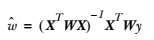
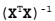
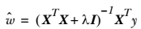

# 第8章 预测数值型数据：回归
<script type="text/javascript" src="http://cdn.mathjax.org/mathjax/latest/MathJax.js?config=default"></script>


## 回归（Regression） 概述

`我们前边提到的分类的目标变量是标称型数据，而回归则是对连续型的数据做出处理，回归的目的是预测数值型数据的目标值。`

## 回归 场景

回归的目的是预测数值型的目标值。最直接的办法是依据输入写出一个目标值的计算公式。

假如你想要预测姐姐男友汽车的功率大小，可能会这样计算:

HorsePower = 0.0015 * annualSalary - 0.99 * hoursListeningToPublicRadio

这就是所谓的 `回归方程(regression equation)`，其中的 0.0015 和 -0.99 称作 `回归系数（regression weights）`，求这些回归系数的过程就是回归。一旦有了这些回归系数，再给定输入，做预测就非常容易了。具体的做法是用回归系数乘以输入值，再将结果全部加在一起，就得到了预测值。我们这里所说的，回归系数是一个向量，输入也是向量，这些运算也就是求出二者的内积。

说到回归，一般都是指 `线性回归(linear regression)`。线性回归意味着可以将输入项分别乘以一些常量，再将结果加起来得到输出。

## 回归 原理

### 1、线性回归

#### 1.1、线性回归 须知概念

##### 1.1.1、矩阵求逆

因为我们在计算回归方程的回归系数时，用到的计算公式如下: 


需要对矩阵求逆，因此这个方程只在逆矩阵存在的时候适用，我们在程序代码中对此作出判断。
判断矩阵是否可逆的一个可选方案是: 

判断矩阵的行列式是否为 0，若为 0 ，矩阵就不存在逆矩阵，不为 0 的话，矩阵才存在逆矩阵。

##### 1.1.2、最小二乘法

最小二乘法（又称最小平方法）是一种数学优化技术。它通过最小化误差的平方和寻找数据的最佳函数匹配。

#### 1.2、线性回归 工作原理

```
读入数据，将数据特征想、特征标签y存储在矩阵x、y中
验证 x^Tx 矩阵是否可逆
使用最小二乘法求得 回归系数 w 的最佳估计
```

#### 1.3、线性回归 开发流程

```
收集数据: 采用任意方法收集数据
准备数据: 回归需要数值型数据，标称型数据将被转换成二值型数据
分析数据: 绘出数据的可视化二维图将有助于对数据做出理解和分析，在采用缩减法求得新回归系数之后，可以将新拟合线绘在图上作为对比
训练算法: 找到回归系数
测试算法: 使用 R^2 或者预测值和数据的拟合度，来分析模型的效果
使用算法: 使用回归，可以在给定输入的时候预测出一个数值，这是对分类方法的提升，因为这样可以预测连续型数据而不仅仅是离散的类别标签
```

#### 1.4、线性回归 算法特点

```
优点：结果易于理解，计算上不复杂。
缺点：对非线性的数据拟合不好。
适用于数据类型：数值型和标称型数据。
```

#### 1.5、线性回归 项目案例

##### 1.5.1、线性回归 项目概述

根据下图中的点，找出该数据的最佳拟合直线。


数据格式为: 

```
1.000000	0.067732	3.176513
1.000000	0.427810	3.816464
1.000000	0.995731	4.550095
1.000000	0.738336	4.256571
```

##### 1.5.2、线性回归 编写代码

```python
def loadDataSet(fileName):                 
    """ 加载数据
        解析以tab键分隔的文件中的浮点数
    Returns：
        dataMat ：  feature 对应的数据集
        labelMat ： feature 对应的分类标签，即类别标签

    """
    # 获取样本特征的总数，不算最后的目标变量 
    numFeat = len(open(fileName).readline().split('\t')) - 1 
    dataMat = []
    labelMat = []
    fr = open(fileName)
    for line in fr.readlines():
        # 读取每一行
        lineArr =[]
        # 删除一行中以tab分隔的数据前后的空白符号
        curLine = line.strip().split('\t')
        # i 从0到2，不包括2 
        for i in range(numFeat):
            # 将数据添加到lineArr List中，每一行数据测试数据组成一个行向量           
            lineArr.append(float(curLine[i]))
            # 将测试数据的输入数据部分存储到dataMat 的List中
        dataMat.append(lineArr)
        # 将每一行的最后一个数据，即类别，或者叫目标变量存储到labelMat List中
        labelMat.append(float(curLine[-1]))
    return dataMat,labelMat


def standRegres(xArr,yArr):
    '''
    Description：
        线性回归
    Args:
        xArr ：输入的样本数据，包含每个样本数据的 feature
        yArr ：对应于输入数据的类别标签，也就是每个样本对应的目标变量
    Returns:
        ws：回归系数
    '''

    # mat()函数将xArr，yArr转换为矩阵 mat().T 代表的是对矩阵进行转置操作
    xMat = mat(xArr)
    yMat = mat(yArr).T
    # 矩阵乘法的条件是左矩阵的列数等于右矩阵的行数
    xTx = xMat.T*xMat
    # 因为要用到xTx的逆矩阵，所以事先需要确定计算得到的xTx是否可逆，条件是矩阵的行列式不为0
    # linalg.det() 函数是用来求得矩阵的行列式的，如果矩阵的行列式为0，则这个矩阵是不可逆的，就无法进行接下来的运算                   
    if linalg.det(xTx) == 0.0:
        print "This matrix is singular, cannot do inverse" 
        return
    # 最小二乘法
    # http://www.apache.wiki/pages/viewpage.action?pageId=5505133
    # 书中的公式，求得w的最优解
    ws = xTx.I * (xMat.T*yMat)            
    return ws


def regression1():
    xArr, yArr = loadDataSet("input/8.Regression/data.txt")
    xMat = mat(xArr)
    yMat = mat(yArr)
    ws = standRegres(xArr, yArr)
    fig = plt.figure()
    ax = fig.add_subplot(111)               #add_subplot(349)函数的参数的意思是，将画布分成3行4列图像画在从左到右从上到下第9块
    ax.scatter(xMat[:, 1].flatten(), yMat.T[:, 0].flatten().A[0]) #scatter 的x是xMat中的第二列，y是yMat的第一列
    xCopy = xMat.copy() 
    xCopy.sort(0)
    yHat = xCopy * ws
    ax.plot(xCopy[:, 1], yHat)
    plt.show()
```

##### 1.5.3、线性回归 拟合效果


### 2、局部加权线性回归

线性回归的一个问题是有可能出现欠拟合现象，因为它求的是具有最小均方差的无偏估计。显而易见，如果模型欠拟合将不能取得最好的预测效果。所以有些方法允许在估计中引入一些偏差，从而降低预测的均方误差。

一个方法是局部加权线性回归（Locally Weighted Linear Regression，LWLR）。在这个算法中，我们给预测点附近的每个点赋予一定的权重，然后与 线性回归 类似，在这个子集上基于最小均方误差来进行普通的回归。与 kNN 一样，这种算法每次预测均需要事先选取出对应的数据子集。该算法解出回归系数 w 的形式如下: 



其中 w 是一个矩阵，用来给每个数据点赋予权重。

LWLR 使用 “核”（与支持向量机中的核类似）来对附近的点赋予更高的权重。核的类型可以自由选择，最常用的核就是高斯核，高斯核对应的权重如下: 


这样就构建了一个只含对角元素的权重矩阵 **w**，并且点 x 与 x(i) 越近，w(i, i) 将会越大。上述公式中包含一个需要用户指定的参数 k，它决定了对附近的点赋予多大的权重，这也是使用 LWLR 时唯一需要考虑的参数，下面的图给出了参数 k 与权重的关系。


上面的图是 每个点的权重图（假定我们正预测的点是 x = 0.5），最上面的图是原始数据集，第二个图显示了当 k = 0.5 时，大部分的数据都用于训练回归模型；而最下面的图显示当 k=0.01 时，仅有很少的局部点被用于训练回归模型。

#### 2.1、局部加权线性回归 工作原理

```
读入数据，将数据特征想、特征标签y存储在矩阵x、y中
利用高斯核构造一个权重矩阵 W，对预测点附近的点施加权重
验证 X^TWX 矩阵是否可逆
使用最小二乘法求得 回归系数 w 的最佳估计
```

#### 2.2、局部加权线性回归 项目案例

##### 2.2.1、局部加权线性回归 项目概述

我们仍然使用上面 线性回归 的数据集，对这些点进行一个 局部加权线性回归 的拟合。


数据格式为: 

```
1.000000	0.067732	3.176513
1.000000	0.427810	3.816464
1.000000	0.995731	4.550095
1.000000	0.738336	4.256571
```

##### 2.2.2、局部加权线性回归 编写代码

```python
    # 局部加权线性回归
def lwlr(testPoint,xArr,yArr,k=1.0):
    '''
        Description：
            局部加权线性回归，在待预测点附近的每个点赋予一定的权重，在子集上基于最小均方差来进行普通的回归。
        Args：
            testPoint：样本点
            xArr：样本的特征数据，即 feature
            yArr：每个样本对应的类别标签，即目标变量
            k:关于赋予权重矩阵的核的一个参数，与权重的衰减速率有关
        Returns:
            testPoint * ws：数据点与具有权重的系数相乘得到的预测点
        Notes:
            这其中会用到计算权重的公式，w = e^((x^((i))-x) / -2k^2)
            理解：x为某个预测点，x^((i))为样本点，样本点距离预测点越近，贡献的误差越大（权值越大），越远则贡献的误差越小（权值越小）。
            关于预测点的选取，在我的代码中取的是样本点。其中k是带宽参数，控制w（钟形函数）的宽窄程度，类似于高斯函数的标准差。
            算法思路：假设预测点取样本点中的第i个样本点（共m个样本点），遍历1到m个样本点（含第i个），算出每一个样本点与预测点的距离，
            也就可以计算出每个样本贡献误差的权值，可以看出w是一个有m个元素的向量（写成对角阵形式）。
    '''
    # mat() 函数是将array转换为矩阵的函数， mat().T 是转换为矩阵之后，再进行转置操作
    xMat = mat(xArr)
    yMat = mat(yArr).T
    # 获得xMat矩阵的行数
    m = shape(xMat)[0]
    # eye()返回一个对角线元素为1，其他元素为0的二维数组，创建权重矩阵weights，该矩阵为每个样本点初始化了一个权重                   
    weights = mat(eye((m)))
    for j in range(m):
        # testPoint 的形式是 一个行向量的形式
        # 计算 testPoint 与输入样本点之间的距离，然后下面计算出每个样本贡献误差的权值
        diffMat = testPoint - xMat[j,:]
        # k控制衰减的速度
        weights[j,j] = exp(diffMat*diffMat.T/(-2.0*k**2))
    # 根据矩阵乘法计算 xTx ，其中的 weights 矩阵是样本点对应的权重矩阵
    xTx = xMat.T * (weights * xMat)
    if linalg.det(xTx) == 0.0:
        print ("This matrix is singular, cannot do inverse")
        return
    # 计算出回归系数的一个估计
    ws = xTx.I * (xMat.T * (weights * yMat))
    return testPoint * ws

def lwlrTest(testArr,xArr,yArr,k=1.0):
    '''
        Description：
            测试局部加权线性回归，对数据集中每个点调用 lwlr() 函数
        Args：
            testArr：测试所用的所有样本点
            xArr：样本的特征数据，即 feature
            yArr：每个样本对应的类别标签，即目标变量
            k：控制核函数的衰减速率
        Returns：
            yHat：预测点的估计值
    '''
    # 得到样本点的总数
    m = shape(testArr)[0]
    # 构建一个全部都是 0 的 1 * m 的矩阵
    yHat = zeros(m)
    # 循环所有的数据点，并将lwlr运用于所有的数据点 
    for i in range(m):
        yHat[i] = lwlr(testArr[i],xArr,yArr,k)
    # 返回估计值
    return yHat

def lwlrTestPlot(xArr,yArr,k=1.0):  
    '''
        Description:
            首先将 X 排序，其余的都与lwlrTest相同，这样更容易绘图
        Args：
            xArr：样本的特征数据，即 feature
            yArr：每个样本对应的类别标签，即目标变量，实际值
            k：控制核函数的衰减速率的有关参数，这里设定的是常量值 1
        Return：
            yHat：样本点的估计值
            xCopy：xArr的复制
    '''
    # 生成一个与目标变量数目相同的 0 向量
    yHat = zeros(shape(yArr))
    # 将 xArr 转换为 矩阵形式
    xCopy = mat(xArr)
    # 排序
    xCopy.sort(0)
    # 开始循环，为每个样本点进行局部加权线性回归，得到最终的目标变量估计值
    for i in range(shape(xArr)[0]):
        yHat[i] = lwlr(xCopy[i],xArr,yArr,k)
    return yHat,xCopy


#test for LWLR
def regression2():
    xArr, yArr = loadDataSet("input/8.Regression/data.txt")
    yHat = lwlrTest(xArr, xArr, yArr, 0.003)
    xMat = mat(xArr)
    srtInd = xMat[:,1].argsort(0)           #argsort()函数是将x中的元素从小到大排列，提取其对应的index(索引)，然后输出
    xSort=xMat[srtInd][:,0,:]
    fig = plt.figure()
    ax = fig.add_subplot(111)
    ax.plot(xSort[:,1], yHat[srtInd])
    ax.scatter(xMat[:,1].flatten().A[0], mat(yArr).T.flatten().A[0] , s=2, c='red')
    plt.show()
```

##### 2.2.3、局部加权线性回归 拟合效果


上图使用了 3 种不同平滑值绘出的局部加权线性回归的结果。上图中的平滑系数 k =1.0，中图 k = 0.01，下图 k = 0.003 。可以看到，k = 1.0 时的模型效果与最小二乘法差不多，k=0.01时该模型可以挖出数据的潜在规律，而 k=0.003时则考虑了太多的噪声，进而导致了过拟合现象。

#### 2.3、局部加权线性回归 注意事项

局部加权线性回归也存在一个问题，即增加了计算量，因为它对每个点做预测时都必须使用整个数据集。


### 3、线性回归 & 局部加权线性回归 项目案例

到此为止，我们已经介绍了找出最佳拟合直线的两种方法，下面我们用这些技术来预测鲍鱼的年龄。

#### 3.1、项目概述

我们有一份来自 UCI 的数据集合的数据，记录了鲍鱼（一种介壳类水生动物）的年龄。鲍鱼年龄可以从鲍鱼壳的层数推算得到。

#### 3.2、开发流程

```
收集数据: 采用任意方法收集数据
准备数据: 回归需要数值型数据，标称型数据将被转换成二值型数据
分析数据: 绘出数据的可视化二维图将有助于对数据做出理解和分析，在采用缩减法求得新回归系数之后，可以将新拟合线绘在图上作为对比
训练算法: 找到回归系数
测试算法: 使用 rssError()函数 计算预测误差的大小，来分析模型的效果
使用算法: 使用回归，可以在给定输入的时候预测出一个数值，这是对分类方法的提升，因为这样可以预测连续型数据而不仅仅是离散的类别标签
```

> 收集数据: 采用任意方法收集数据

> 准备数据: 回归需要数值型数据，标称型数据将被转换成二值型数据

数据存储格式:

```
1	0.455	0.365	0.095	0.514	0.2245	0.101	0.15	15
1	0.35	0.265	0.09	0.2255	0.0995	0.0485	0.07	7
-1	0.53	0.42	0.135	0.677	0.2565	0.1415	0.21	9
1	0.44	0.365	0.125	0.516	0.2155	0.114	0.155	10
0	0.33	0.255	0.08	0.205	0.0895	0.0395	0.055	7
```

> 分析数据: 绘出数据的可视化二维图将有助于对数据做出理解和分析，在采用缩减法求得新回归系数之后，可以将新拟合线绘在图上作为对比

> 训练算法: 找到回归系数

使用上面我们讲到的 局部加权线性回归 训练算法，求出回归系数

> 测试算法: 使用 rssError()函数 计算预测误差的大小，来分析模型的效果

```python
# test for abloneDataSet
def abaloneTest():
    '''
    Desc:
        预测鲍鱼的年龄
    Args:
        None
    Returns:
        None
    '''
    # 加载数据
    abX, abY = loadDataSet("input/8.Regression/abalone.txt")
    # 使用不同的核进行预测
    oldyHat01 = lwlrTest(abX[0:99], abX[0:99], abY[0:99], 0.1)
    oldyHat1 = lwlrTest(abX[0:99], abX[0:99], abY[0:99], 1)
    oldyHat10 = lwlrTest(abX[0:99], abX[0:99], abY[0:99], 10)   
    # 打印出不同的核预测值与训练数据集上的真实值之间的误差大小
    print "old yHat01 error Size is :" , rssError(abY[0:99], oldyHat01.T)
    print "old yHat1 error Size is :" , rssError(abY[0:99], oldyHat1.T)
    print "old yHat10 error Size is :" , rssError(abY[0:99], oldyHat10.T)

    # 打印出 不同的核预测值 与 新数据集（测试数据集）上的真实值之间的误差大小
    newyHat01 = lwlrTest(abX[100:199], abX[0:99], abY[0:99], 0.1)
    print "new yHat01 error Size is :" , rssError(abY[0:99], yHat01.T)
    newyHat1 = lwlrTest(abX[100:199], abX[0:99], abY[0:99], 1)
    print "new yHat1 error Size is :" , rssError(abY[0:99], yHat1.T)
    newyHat10 = lwlrTest(abX[100:199], abX[0:99], abY[0:99], 10)
    print "new yHat10 error Size is :" , rssError(abY[0:99], yHat10.T)

    # 使用简单的 线性回归 进行预测，与上面的计算进行比较
    standWs = standRegres(abX[0:99], abY[0:99])
    standyHat = mat(abx[100:199]) * standWs
    print "standRegress error Size is:", rssError(abY[100:199], standyHat.T.A)
```

根据我们上边的测试，可以看出: 

简单线性回归达到了与局部加权现行回归类似的效果。这也说明了一点，必须在未知数据上比较效果才能选取到最佳模型。那么最佳的核大小是 10 吗？或许是，但如果想得到更好的效果，应该用 10 个不同的样本集做 10 次测试来比较结果。

> 使用算法: 使用回归，可以在给定输入的时候预测出一个数值，这是对分类方法的提升，因为这样可以预测连续型数据而不仅仅是离散的类别标签


### 4、缩减系数来 “理解” 数据

如果数据的特征比样本点还多应该怎么办？是否还可以使用线性回归和之前的方法来做预测？答案是否定的，即我们不能再使用前面介绍的方法。这是因为在计算  的时候会出错。

如果特征比样本点还多(n > m)，也就是说输入数据的矩阵 x 不是满秩矩阵。非满秩矩阵求逆时会出现问题。

为了解决这个问题，我们引入了 `岭回归（ridge regression）` 这种缩减方法。接着是 `lasso法`，最后介绍 `前向逐步回归`。

#### 4.1、岭回归

简单来说，岭回归就是在矩阵  上加一个 λI 从而使得矩阵非奇异，进而能对  求逆。其中矩阵I是一个 m * m 的单位矩阵，
对角线上元素全为1，其他元素全为0。而λ是一个用户定义的数值，后面会做介绍。在这种情况下，回归系数的计算公式将变成：



岭回归最先用来处理特征数多于样本数的情况，现在也用于在估计中加入偏差，从而得到更好的估计。这里通过引入 λ 来限制了所有 w 之和，通过引入该惩罚项，能够减少不重要的参数，这个技术在统计学中也叫作 `缩减(shrinkage)`。

缩减方法可以去掉不重要的参数，因此能更好地理解数据。此外，与简单的线性回归相比，缩减法能取得更好的预测效果。

这里通过预测误差最小化得到 λ: 数据获取之后，首先抽一部分数据用于测试，生育的作为训练集用于训练参数 w。训练完毕后在测试集上测试预测性能。通过选取不同的 λ 来重复上述测试过程，最终得到一个使预测误差最小的 λ 。

##### 4.1.1、岭回归 原始代码

```python
def ridgeRegres(xMat,yMat,lam=0.2):
    '''
        Desc：
            这个函数实现了给定 lambda 下的岭回归求解。
            如果数据的特征比样本点还多，就不能再使用上面介绍的的线性回归和局部现行回归了，因为计算 (xTx)^(-1)会出现错误。
            如果特征比样本点还多（n > m），也就是说，输入数据的矩阵x不是满秩矩阵。非满秩矩阵在求逆时会出现问题。
            为了解决这个问题，我们下边讲一下：岭回归，这是我们要讲的第一种缩减方法。
        Args：
            xMat：样本的特征数据，即 feature
            yMat：每个样本对应的类别标签，即目标变量，实际值
            lam：引入的一个λ值，使得矩阵非奇异
        Returns：
            经过岭回归公式计算得到的回归系数
    '''

    xTx = xMat.T*xMat
    # 岭回归就是在矩阵 xTx 上加一个 λI 从而使得矩阵非奇异，进而能对 xTx + λI 求逆
    denom = xTx + eye(shape(xMat)[1])*lam
    # 检查行列式是否为零，即矩阵是否可逆，行列式为0的话就不可逆，不为0的话就是可逆。
    if linalg.det(denom) == 0.0:
        print ("This matrix is singular, cannot do inverse")
        return
    ws = denom.I * (xMat.T*yMat)
    return ws


def ridgeTest(xArr,yArr):
    '''
        Desc：
            函数 ridgeTest() 用于在一组 λ 上测试结果
        Args：
            xArr：样本数据的特征，即 feature
            yArr：样本数据的类别标签，即真实数据
        Returns：
            wMat：将所有的回归系数输出到一个矩阵并返回
    '''

    xMat = mat(xArr)
    yMat=mat(yArr).T
    # 计算Y的均值
    yMean = mean(yMat,0)
    # Y的所有的特征减去均值
    yMat = yMat - yMean
    # 标准化 x，计算 xMat 平均值
    xMeans = mean(xMat,0)
    # 然后计算 X的方差
    xVar = var(xMat,0)
    # 所有特征都减去各自的均值并除以方差
    xMat = (xMat - xMeans)/xVar
    # 可以在 30 个不同的 lambda 下调用 ridgeRegres() 函数。
    numTestPts = 30
    # 创建30 * m 的全部数据为0 的矩阵
    wMat = zeros((numTestPts,shape(xMat)[1]))
    for i in range(numTestPts):
        # exp() 返回 e^x 
        ws = ridgeRegres(xMat,yMat,exp(i-10))
        wMat[i,:]=ws.T
    return wMat


#test for ridgeRegression
def regression3():
    abX,abY = loadDataSet("input/8.Regression/abalone.txt")
    ridgeWeights = ridgeTest(abX, abY)
    fig = plt.figure()
    ax = fig.add_subplot(111)
    ax.plot(ridgeWeights)
    plt.show()
```

##### 4.1.2、岭回归在鲍鱼数据集上的运行效果


上图绘制除了回归系数与 log(λ) 的关系。在最左边，即 λ 最小时，可以得到所有系数的原始值（与线性回归一致）；而在右边，系数全部缩减为0；在中间部分的某值将可以取得最好的预测效果。为了定量地找到最佳参数值，还需要进行交叉验证。另外，要判断哪些变量对结果预测最具有影响力，在上图中观察它们对应的系数大小就可以了。


#### 4.2、lasso

在增加如下约束时，普通的最小二乘法回归会得到与岭回归一样的公式: 


上式限定了所有回归系数的平方和不能大于 λ 。使用普通的最小二乘法回归在当两个或更多的特征相关时，可能会得到一个很大的正系数和一个很大的负系数。正式因为上述限制条件的存在，使用岭回归可以避免这个问题。

与岭回归类似，另一个缩减方法lasso也对回归系数做了限定，对应的约束条件如下: 


## 岭回归和逐步线性回归

> 缩减系数来“理解”数据

```
    如果数据的特征比样本点还多应该怎么办？是否还可以使用线性回归和之前的方法来做预测？答案是否定的，即不能再使用前面介绍的方法。
这是因为在计算 (x^TX)^(-1) 的时候会出错。
    如果特征比样本点还多(n > m)，也就是说输入数据的矩阵X不是满秩矩阵。非满秩矩阵在求逆时会出现问题。
    为了解决这个问题，统计学家引入了岭回归(ridge regression)的概念，这就是本节将要介绍的第一种缩减方法。
```

> 岭回归

```
    简单来说，岭回归就是在矩阵 X^TX 上加一个 λI 从而使得矩阵非奇异，进而能对 X^TX+λI 求逆。其中矩阵I是一个 m*m 的单位矩阵，
    对角线上元素全为1，其他元素全为0。而λ是一个用户定义的数值，后面会做介绍。在这种情况下，回归系数的计算公式将变成：
        w = (X^TX + λI)^(-1)X^Ty
    岭回归最先用来处理特征数多于样本数的情况，现在也用于在估计中加入偏差，从而得到更好的估计。这里通过引入λ来限制了所有w之和，通过引入该惩罚项，
    能够减少不重要的参数，这个技术在统计学中也叫作缩减(shrinkage)。
```

> 岭回归中的岭是什么

```
    岭回归使用了单位矩阵乘以常量λ，我们观察其中的单位矩阵I，可以看到值1贯穿整个对角线，其余元素全是0.形象地，在0构成的平面上有一条1组成的“岭”，
    这就是岭回归中的“岭”的由来。
```
> 岭回归示例图


> 前向逐步回归简介

```
    前向逐步回归算法可以得到与 lasso 差不多的效果，但更加简单。它属于一种贪心算法，即每一步都尽可能减少误差。
    一开始，所有的权重都设为1，然后每一步所做的决策是对某个权重增加或减少一个很小的值。
```

> 前向逐步回归伪代码

```
    数据标准化，使其分布满足0均值和单位方差
    在每轮迭代过程中：
        设置当前最小误差lowestError为正无穷
        对每个特征：
            增大或缩小：
                改变一个系数得到一个新的w
                计算新w下的误差
                如果误差Error小于当前最小误差lowestError：设置Wbest等于当前的w
            将W设置为新的Wbest
```

```
    贪心算法在所有特征上运行两次for循环，分别计算增加或减少该特征对误差的影响。这里使用的是平方误差，通过之前的函数rssError()得到。
    该误差初始值设为正无穷，经过与所有的误差比较后取最小的误差。整个过程循环迭代进行。
```

> 逐步线性回归示例图


## 预测鲍鱼年龄和玩具售价

> 示例：预测鲍鱼的年龄

```
    鲍鱼年龄可以从鲍鱼壳的层数推算得到。
    为了分析预测误差的大小，可以用函数rssError()计算出这一指标，下面是三种不同的预测误差：
    >>> regression.rssError(abY[0:99],yHat01.T)
    56.842594430533545
    >>> regression.rssError(abY[0:99],yHat1.T)
    429.89056187006685
    >>> regression.rssError(abY[0:99],yHat10.T)
    549.11817088257692
    可以看到，使用较小的核将得到较低的误差。那么，为什么不在所有数据集上都使用最小的核呢？
    这是因为使用最小的核将造成过拟合，对新数据不一定能达到最好的预测效果。

    简单线性回归达到了与局部线性回归类似的效果。这也表明一点，必须在未知数据上比较效果才能选取到最佳模型。那么最佳的核大小是10吗？
    或许是，但如果想得到最好的效果，应该用10个不同的样本集做10次测试来比较结果。
```

> 示例：预测乐高玩具套装的价格

> 用回归法预测乐高套装的价格的一般过程

```
    (1) 收集数据：用 Google Shopping 的API收集数据。
    (2) 准备数据：从返回的JSON数据中抽取价格。
    (3) 分析数据：可视化并观察数据。
    (4) 训练算法：构建不同的模型，采用逐步线性回归和直接的线性回归模型。
    (5) 测试算法：使用交叉验证来测试不同的模型，分析哪个效果最好。
    (6) 使用算法：这次练习的目标就是生成数据模型。
```

## 预测数值型数据：回归 小结

    与分类一样，回归也是预测目标值的过程。回归与分类的不同点在于，前者预测连续型变量，而后者预测离散型变量。回归是统计学中最有力的的工具之一。
在回归方程里，求得特征对应的最佳回归系数的方法是最小化误差的平方和。给定输入矩阵x，如果 x^Tx的逆存在并可以求得的话，回归法都可以直接使用。
数据集上计算出的回归方程并不一定意味着它是最佳的，可以使用预测值yHat和原始值y的相关性来度量回归方程的好坏。
    当数据的样本数比特征数还少的时候，矩阵x^Tx的逆不能直接计算。即便当样本数比特征数多时，x^Tx的逆仍有可能无法直接计算，这是因为特征有可能高度相关。
这时可以考虑使用岭回归，因为当x^Tx的逆不能计算时，它仍保证能求得回归系数。
    岭回归是缩减法的一种，相当于对回归系数的大小施加了限制。另一种很好的缩减法是lasso。Lasso难以理解，但可以使用计算简便的逐步线性回归方法来求得近似结果。
    缩减法还可以看做是对一个模型增加偏差的同时减少方差。偏差方差折中是一个重要的概念，可以帮助我们理解现有模型并做出改进，从而得到最好的模型。

* * *

* **作者：[小瑶](http://www.apache.wiki/display/~chenyao) [片刻](http://www.apache.wiki/display/~jiangzhonglian)**
* [GitHub地址](https://github.com/apachecn/MachineLearning): <https://github.com/apachecn/MachineLearning>
* **版权声明：欢迎转载学习 => 请标注信息来源于 [ApacheCN](http://www.apachecn.org/)**