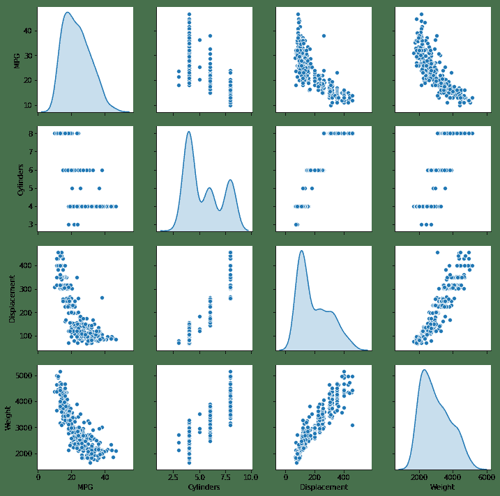
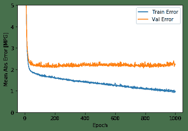
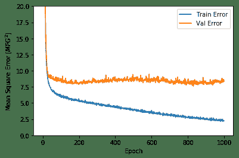
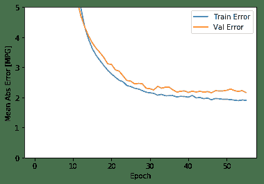
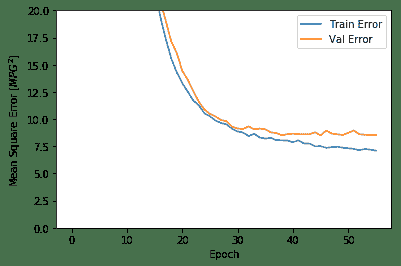
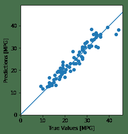
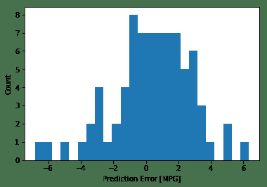

# 实战项目 2 汽车燃油效率

Note: 我们的 TensorFlow 社区翻译了这些文档。因为社区翻译是尽力而为， 所以无法保证它们是最准确的，并且反映了最新的
[官方英文文档](https://www.tensorflow.org/?hl=en)。如果您有改进此翻译的建议， 请提交 pull request 到
[tensorflow/docs](https://github.com/tensorflow/docs) GitHub 仓库。要志愿地撰写或者审核译文，请加入
[docs-zh-cn@tensorflow.org Google Group](https://groups.google.com/a/tensorflow.org/forum/#!forum/docs-zh-cn)。

在 *回归 (regression)* 问题中，我们的目的是预测出如价格或概率这样连续值的输出。相对于*分类(classification)* 问题，*分类(classification)* 的目的是从一系列的分类出选择出一个分类 （如，给出一张包含苹果或橘子的图片，识别出图片中是哪种水果）。

本 notebook 使用经典的 [Auto MPG](https://archive.ics.uci.edu/ml/datasets/auto+mpg) 数据集，构建了一个用来预测70年代末到80年代初汽车燃油效率的模型。为了做到这一点，我们将为该模型提供许多那个时期的汽车描述。这个描述包含: 气缸数，排量，马力以及重量。

本示例使用 `tf.keras` API，相关细节请参阅 [本指南](https://tensorflow.google.cn/guide/keras)。


```python
# 使用 seaborn 绘制矩阵图 (pairplot)
$ pip install seaborn
```

    Requirement already satisfied: seaborn in /usr/local/lib/python3.6/dist-packages (0.9.0)
    Requirement already satisfied: scipy>=0.14.0 in /usr/local/lib/python3.6/dist-packages (from seaborn) (1.3.1)
    Requirement already satisfied: numpy>=1.9.3 in /usr/local/lib/python3.6/dist-packages (from seaborn) (1.16.5)
    Requirement already satisfied: matplotlib>=1.4.3 in /usr/local/lib/python3.6/dist-packages (from seaborn) (3.0.3)
    Requirement already satisfied: pandas>=0.15.2 in /usr/local/lib/python3.6/dist-packages (from seaborn) (0.24.2)
    Requirement already satisfied: pyparsing!=2.0.4,!=2.1.2,!=2.1.6,>=2.0.1 in /usr/local/lib/python3.6/dist-packages (from matplotlib>=1.4.3->seaborn) (2.4.2)
    Requirement already satisfied: kiwisolver>=1.0.1 in /usr/local/lib/python3.6/dist-packages (from matplotlib>=1.4.3->seaborn) (1.1.0)
    Requirement already satisfied: cycler>=0.10 in /usr/local/lib/python3.6/dist-packages (from matplotlib>=1.4.3->seaborn) (0.10.0)
    Requirement already satisfied: python-dateutil>=2.1 in /usr/local/lib/python3.6/dist-packages (from matplotlib>=1.4.3->seaborn) (2.5.3)
    Requirement already satisfied: pytz>=2011k in /usr/local/lib/python3.6/dist-packages (from pandas>=0.15.2->seaborn) (2018.9)
    Requirement already satisfied: setuptools in /usr/local/lib/python3.6/dist-packages (from kiwisolver>=1.0.1->matplotlib>=1.4.3->seaborn) (41.4.0)
    Requirement already satisfied: six in /usr/local/lib/python3.6/dist-packages (from cycler>=0.10->matplotlib>=1.4.3->seaborn) (1.12.0)


```python
from __future__ import absolute_import, division, print_function, unicode_literals

import pathlib

import matplotlib.pyplot as plt
import pandas as pd
import seaborn as sns

try:
  # %tensorflow_version only exists in Colab.
  %tensorflow_version 2.x
except Exception:
  pass
import tensorflow as tf

from tensorflow import keras
from tensorflow.keras import layers

print(tf.__version__)
```

    TensorFlow 2.x selected.
    2.0.0


## Auto MPG 数据集

该数据集可以从 [UCI机器学习库](https://archive.ics.uci.edu/ml/) 中获取.


### 获取数据
首先下载数据集。


```python
dataset_path = keras.utils.get_file("auto-mpg.data", "http://archive.ics.uci.edu/ml/machine-learning-databases/auto-mpg/auto-mpg.data")
dataset_path
```

    Downloading data from http://archive.ics.uci.edu/ml/machine-learning-databases/auto-mpg/auto-mpg.data
    32768/30286 [================================] - 0s 4us/step


    '/root/.keras/datasets/auto-mpg.data'


使用 pandas 导入数据集。


```python
column_names = ['MPG','Cylinders','Displacement','Horsepower','Weight',
                'Acceleration', 'Model Year', 'Origin']
raw_dataset = pd.read_csv(dataset_path, names=column_names,
                      na_values = "?", comment='\t',
                      sep=" ", skipinitialspace=True)

dataset = raw_dataset.copy()
dataset.tail()
```

<table border="1" class="dataframe">
  <thead>
    <tr style="text-align: right;">
      <th></th>
      <th>MPG</th>
      <th>Cylinders</th>
      <th>Displacement</th>
      <th>Horsepower</th>
      <th>Weight</th>
      <th>Acceleration</th>
      <th>Model Year</th>
      <th>Origin</th>
    </tr>
  </thead>
  <tbody>
    <tr>
      <th>393</th>
      <td>27.0</td>
      <td>4</td>
      <td>140.0</td>
      <td>86.0</td>
      <td>2790.0</td>
      <td>15.6</td>
      <td>82</td>
      <td>1</td>
    </tr>
    <tr>
      <th>394</th>
      <td>44.0</td>
      <td>4</td>
      <td>97.0</td>
      <td>52.0</td>
      <td>2130.0</td>
      <td>24.6</td>
      <td>82</td>
      <td>2</td>
    </tr>
    <tr>
      <th>395</th>
      <td>32.0</td>
      <td>4</td>
      <td>135.0</td>
      <td>84.0</td>
      <td>2295.0</td>
      <td>11.6</td>
      <td>82</td>
      <td>1</td>
    </tr>
    <tr>
      <th>396</th>
      <td>28.0</td>
      <td>4</td>
      <td>120.0</td>
      <td>79.0</td>
      <td>2625.0</td>
      <td>18.6</td>
      <td>82</td>
      <td>1</td>
    </tr>
    <tr>
      <th>397</th>
      <td>31.0</td>
      <td>4</td>
      <td>119.0</td>
      <td>82.0</td>
      <td>2720.0</td>
      <td>19.4</td>
      <td>82</td>
      <td>1</td>
    </tr>
  </tbody>
</table>

### 数据清洗

数据集中包括一些未知值。


```python
dataset.isna().sum()
```


    MPG             0
    Cylinders       0
    Displacement    0
    Horsepower      6
    Weight          0
    Acceleration    0
    Model Year      0
    Origin          0
    dtype: int64


为了保证这个初始示例的简单性，删除这些行。


```python
dataset = dataset.dropna()
```

`"Origin"` 列实际上代表分类，而不仅仅是一个数字。所以把它转换为独热码 （one-hot）:


```python
origin = dataset.pop('Origin')
```


```python
dataset['USA'] = (origin == 1)*1.0
dataset['Europe'] = (origin == 2)*1.0
dataset['Japan'] = (origin == 3)*1.0
dataset.tail()
```


<table border="1" class="dataframe">
  <thead>
    <tr style="text-align: right;">
      <th></th>
      <th>MPG</th>
      <th>Cylinders</th>
      <th>Displacement</th>
      <th>Horsepower</th>
      <th>Weight</th>
      <th>Acceleration</th>
      <th>Model Year</th>
      <th>USA</th>
      <th>Europe</th>
      <th>Japan</th>
    </tr>
  </thead>
  <tbody>
    <tr>
      <th>393</th>
      <td>27.0</td>
      <td>4</td>
      <td>140.0</td>
      <td>86.0</td>
      <td>2790.0</td>
      <td>15.6</td>
      <td>82</td>
      <td>1.0</td>
      <td>0.0</td>
      <td>0.0</td>
    </tr>
    <tr>
      <th>394</th>
      <td>44.0</td>
      <td>4</td>
      <td>97.0</td>
      <td>52.0</td>
      <td>2130.0</td>
      <td>24.6</td>
      <td>82</td>
      <td>0.0</td>
      <td>1.0</td>
      <td>0.0</td>
    </tr>
    <tr>
      <th>395</th>
      <td>32.0</td>
      <td>4</td>
      <td>135.0</td>
      <td>84.0</td>
      <td>2295.0</td>
      <td>11.6</td>
      <td>82</td>
      <td>1.0</td>
      <td>0.0</td>
      <td>0.0</td>
    </tr>
    <tr>
      <th>396</th>
      <td>28.0</td>
      <td>4</td>
      <td>120.0</td>
      <td>79.0</td>
      <td>2625.0</td>
      <td>18.6</td>
      <td>82</td>
      <td>1.0</td>
      <td>0.0</td>
      <td>0.0</td>
    </tr>
    <tr>
      <th>397</th>
      <td>31.0</td>
      <td>4</td>
      <td>119.0</td>
      <td>82.0</td>
      <td>2720.0</td>
      <td>19.4</td>
      <td>82</td>
      <td>1.0</td>
      <td>0.0</td>
      <td>0.0</td>
    </tr>
  </tbody>
</table>


### 拆分训练数据集和测试数据集

现在需要将数据集拆分为一个训练数据集和一个测试数据集。

我们最后将使用测试数据集对模型进行评估。


```python
train_dataset = dataset.sample(frac=0.8,random_state=0)
test_dataset = dataset.drop(train_dataset.index)
```

### 数据检查

快速查看训练集中几对列的联合分布。


```python
sns.pairplot(train_dataset[["MPG", "Cylinders", "Displacement", "Weight"]], diag_kind="kde")
```


    <seaborn.axisgrid.PairGrid at 0x7f3d9243a6a0>





也可以查看总体的数据统计:


```python
train_stats = train_dataset.describe()
train_stats.pop("MPG")
train_stats = train_stats.transpose()
train_stats
```


<div>
<table border="1" class="dataframe">
  <thead>
    <tr style="text-align: right;">
      <th></th>
      <th>count</th>
      <th>mean</th>
      <th>std</th>
      <th>min</th>
      <th>25%</th>
      <th>50%</th>
      <th>75%</th>
      <th>max</th>
    </tr>
  </thead>
  <tbody>
    <tr>
      <th>Cylinders</th>
      <td>314.0</td>
      <td>5.477707</td>
      <td>1.699788</td>
      <td>3.0</td>
      <td>4.00</td>
      <td>4.0</td>
      <td>8.00</td>
      <td>8.0</td>
    </tr>
    <tr>
      <th>Displacement</th>
      <td>314.0</td>
      <td>195.318471</td>
      <td>104.331589</td>
      <td>68.0</td>
      <td>105.50</td>
      <td>151.0</td>
      <td>265.75</td>
      <td>455.0</td>
    </tr>
    <tr>
      <th>Horsepower</th>
      <td>314.0</td>
      <td>104.869427</td>
      <td>38.096214</td>
      <td>46.0</td>
      <td>76.25</td>
      <td>94.5</td>
      <td>128.00</td>
      <td>225.0</td>
    </tr>
    <tr>
      <th>Weight</th>
      <td>314.0</td>
      <td>2990.251592</td>
      <td>843.898596</td>
      <td>1649.0</td>
      <td>2256.50</td>
      <td>2822.5</td>
      <td>3608.00</td>
      <td>5140.0</td>
    </tr>
    <tr>
      <th>Acceleration</th>
      <td>314.0</td>
      <td>15.559236</td>
      <td>2.789230</td>
      <td>8.0</td>
      <td>13.80</td>
      <td>15.5</td>
      <td>17.20</td>
      <td>24.8</td>
    </tr>
    <tr>
      <th>Model Year</th>
      <td>314.0</td>
      <td>75.898089</td>
      <td>3.675642</td>
      <td>70.0</td>
      <td>73.00</td>
      <td>76.0</td>
      <td>79.00</td>
      <td>82.0</td>
    </tr>
    <tr>
      <th>USA</th>
      <td>314.0</td>
      <td>0.624204</td>
      <td>0.485101</td>
      <td>0.0</td>
      <td>0.00</td>
      <td>1.0</td>
      <td>1.00</td>
      <td>1.0</td>
    </tr>
    <tr>
      <th>Europe</th>
      <td>314.0</td>
      <td>0.178344</td>
      <td>0.383413</td>
      <td>0.0</td>
      <td>0.00</td>
      <td>0.0</td>
      <td>0.00</td>
      <td>1.0</td>
    </tr>
    <tr>
      <th>Japan</th>
      <td>314.0</td>
      <td>0.197452</td>
      <td>0.398712</td>
      <td>0.0</td>
      <td>0.00</td>
      <td>0.0</td>
      <td>0.00</td>
      <td>1.0</td>
    </tr>
  </tbody>
</table>
</div>


### 从标签中分离特征

将特征值从目标值或者"标签"中分离。 这个标签是你使用训练模型进行预测的值。


```python
train_labels = train_dataset.pop('MPG')
test_labels = test_dataset.pop('MPG')
```

### 数据规范化

再次审视下上面的 `train_stats` 部分，并注意每个特征的范围有什么不同。

使用不同的尺度和范围对特征归一化是好的实践。尽管模型*可能* 在没有特征归一化的情况下收敛，它会使得模型训练更加复杂，并会造成生成的模型依赖输入所使用的单位选择。

注意: 尽管我们仅仅从训练集中有意生成这些统计数据，但是这些统计信息也会用于归一化的测试数据集。我们需要这样做，将测试数据集放入到与已经训练过的模型相同的分布中。


```python
def norm(x):
  return (x - train_stats['mean']) / train_stats['std']
normed_train_data = norm(train_dataset)
normed_test_data = norm(test_dataset)
```

我们将会使用这个已经归一化的数据来训练模型。

警告: 用于归一化输入的数据统计（均值和标准差）需要反馈给模型从而应用于任何其他数据，以及我们之前所获得独热码。这些数据包含测试数据集以及生产环境中所使用的实时数据。

## 模型

### 构建模型

让我们来构建我们自己的模型。这里，我们将会使用一个“顺序”模型，其中包含两个紧密相连的隐藏层，以及返回单个、连续值得输出层。模型的构建步骤包含于一个名叫 'build_model' 的函数中，稍后我们将会创建第二个模型。 两个密集连接的隐藏层。


```python
def build_model():
  model = keras.Sequential([
    layers.Dense(64, activation='relu', input_shape=[len(train_dataset.keys())]),
    layers.Dense(64, activation='relu'),
    layers.Dense(1)
  ])

  optimizer = tf.keras.optimizers.RMSprop(0.001)

  model.compile(loss='mse',
                optimizer=optimizer,
                metrics=['mae', 'mse'])
  return model
```


```python
model = build_model()
```

### 检查模型

使用 `.summary` 方法来打印该模型的简单描述。


```python
model.summary()
```

    Model: "sequential"
    _________________________________________________________________
    Layer (type)                 Output Shape              Param #   
    =================================================================
    dense (Dense)                (None, 64)                640       
    _________________________________________________________________
    dense_1 (Dense)              (None, 64)                4160      
    _________________________________________________________________
    dense_2 (Dense)              (None, 1)                 65        
    =================================================================
    Total params: 4,865
    Trainable params: 4,865
    Non-trainable params: 0
    _________________________________________________________________


现在试用下这个模型。从训练数据中批量获取‘10’条例子并对这些例子调用 `model.predict` 。


```python
example_batch = normed_train_data[:10]
example_result = model.predict(example_batch)
example_result
```

    WARNING:tensorflow:Falling back from v2 loop because of error: Failed to find data adapter that can handle input: <class 'pandas.core.frame.DataFrame'>, <class 'NoneType'>


    array([[ 0.37002987],
           [ 0.22292587],
           [ 0.7729857 ],
           [ 0.22504307],
           [-0.01411032],
           [ 0.25664118],
           [ 0.05221634],
           [-0.0256409 ],
           [ 0.23223272],
           [-0.00434934]], dtype=float32)


它似乎在工作，并产生了预期的形状和类型的结果

### 训练模型

对模型进行1000个周期的训练，并在 `history` 对象中记录训练和验证的准确性。


```python
# 通过为每个完成的时期打印一个点来显示训练进度
class PrintDot(keras.callbacks.Callback):
  def on_epoch_end(self, epoch, logs):
    if epoch % 100 == 0: print('')
    print('.', end='')

EPOCHS = 1000

history = model.fit(
  normed_train_data, train_labels,
  epochs=EPOCHS, validation_split = 0.2, verbose=0,
  callbacks=[PrintDot()])
```

    WARNING:tensorflow:Falling back from v2 loop because of error: Failed to find data adapter that can handle input: <class 'pandas.core.frame.DataFrame'>, <class 'NoneType'>
    
    ....................................................................................................
    ....................................................................................................
    ....................................................................................................
    ....................................................................................................
    ....................................................................................................
    ....................................................................................................
    ....................................................................................................
    ....................................................................................................
    ....................................................................................................
    ....................................................................................................

使用 `history` 对象中存储的统计信息可视化模型的训练进度。


```python
hist = pd.DataFrame(history.history)
hist['epoch'] = history.epoch
hist.tail()
```


<table border="1" class="dataframe">
  <thead>
    <tr style="text-align: right;">
      <th></th>
      <th>loss</th>
      <th>mae</th>
      <th>mse</th>
      <th>val_loss</th>
      <th>val_mae</th>
      <th>val_mse</th>
      <th>epoch</th>
    </tr>
  </thead>
  <tbody>
    <tr>
      <th>995</th>
      <td>2.278429</td>
      <td>0.968291</td>
      <td>2.278429</td>
      <td>8.645883</td>
      <td>2.228030</td>
      <td>8.645884</td>
      <td>995</td>
    </tr>
    <tr>
      <th>996</th>
      <td>2.300897</td>
      <td>0.955693</td>
      <td>2.300897</td>
      <td>8.526561</td>
      <td>2.254299</td>
      <td>8.526561</td>
      <td>996</td>
    </tr>
    <tr>
      <th>997</th>
      <td>2.302505</td>
      <td>0.937035</td>
      <td>2.302505</td>
      <td>8.662312</td>
      <td>2.204857</td>
      <td>8.662312</td>
      <td>997</td>
    </tr>
    <tr>
      <th>998</th>
      <td>2.265367</td>
      <td>0.942647</td>
      <td>2.265367</td>
      <td>8.319109</td>
      <td>2.224138</td>
      <td>8.319109</td>
      <td>998</td>
    </tr>
    <tr>
      <th>999</th>
      <td>2.224938</td>
      <td>0.985029</td>
      <td>2.224938</td>
      <td>8.404006</td>
      <td>2.241303</td>
      <td>8.404006</td>
      <td>999</td>
    </tr>
  </tbody>
</table>


```python
def plot_history(history):
  hist = pd.DataFrame(history.history)
  hist['epoch'] = history.epoch

  plt.figure()
  plt.xlabel('Epoch')
  plt.ylabel('Mean Abs Error [MPG]')
  plt.plot(hist['epoch'], hist['mae'],
           label='Train Error')
  plt.plot(hist['epoch'], hist['val_mae'],
           label = 'Val Error')
  plt.ylim([0,5])
  plt.legend()

  plt.figure()
  plt.xlabel('Epoch')
  plt.ylabel('Mean Square Error [$MPG^2$]')
  plt.plot(hist['epoch'], hist['mse'],
           label='Train Error')
  plt.plot(hist['epoch'], hist['val_mse'],
           label = 'Val Error')
  plt.ylim([0,20])
  plt.legend()
  plt.show()


plot_history(history)
```








该图表显示在约100个 epochs 之后误差非但没有改进，反而出现恶化。 让我们更新 `model.fit` 调用，当验证值没有提高上是自动停止训练。
我们将使用一个 *EarlyStopping callback* 来测试每个 epoch 的训练条件。如果经过一定数量的 epochs 后没有改进，则自动停止训练。

你可以从[这里](https://tensorflow.google.cn/versions/master/api_docs/python/tf/keras/callbacks/EarlyStopping)学习到更多的回调。


```python
model = build_model()

# patience 值用来检查改进 epochs 的数量
early_stop = keras.callbacks.EarlyStopping(monitor='val_loss', patience=10)

history = model.fit(normed_train_data, train_labels, epochs=EPOCHS,
                    validation_split = 0.2, verbose=0, callbacks=[early_stop, PrintDot()])

plot_history(history)
```

    WARNING:tensorflow:Falling back from v2 loop because of error: Failed to find data adapter that can handle input: <class 'pandas.core.frame.DataFrame'>, <class 'NoneType'>
    
    ........................................................








如图所示，验证集中的平均的误差通常在 +/- 2 MPG左右。 这个结果好么？ 我们将决定权留给你。

让我们看看通过使用 **测试集** 来泛化模型的效果如何，我们在训练模型时没有使用测试集。这告诉我们，当我们在现实世界中使用这个模型时，我们可以期望它预测得有多好。


```python
loss, mae, mse = model.evaluate(normed_test_data, test_labels, verbose=2)

print("Testing set Mean Abs Error: {:5.2f} MPG".format(mae))
```

    WARNING:tensorflow:Falling back from v2 loop because of error: Failed to find data adapter that can handle input: <class 'pandas.core.frame.DataFrame'>, <class 'NoneType'>
    78/78 - 0s - loss: 5.8737 - mae: 1.8844 - mse: 5.8737
    Testing set Mean Abs Error:  1.88 MPG


### 做预测
 
最后，使用测试集中的数据预测 MPG 值:


```python
test_predictions = model.predict(normed_test_data).flatten()

plt.scatter(test_labels, test_predictions)
plt.xlabel('True Values [MPG]')
plt.ylabel('Predictions [MPG]')
plt.axis('equal')
plt.axis('square')
plt.xlim([0,plt.xlim()[1]])
plt.ylim([0,plt.ylim()[1]])
_ = plt.plot([-100, 100], [-100, 100])

```

    WARNING:tensorflow:Falling back from v2 loop because of error: Failed to find data adapter that can handle input: <class 'pandas.core.frame.DataFrame'>, <class 'NoneType'>





这看起来我们的模型预测得相当好。我们来看下误差分布。


```python
error = test_predictions - test_labels
plt.hist(error, bins = 25)
plt.xlabel("Prediction Error [MPG]")
_ = plt.ylabel("Count")
```





它不是完全的高斯分布，但我们可以推断出，这是因为样本的数量很小所导致的。

## 结论

本笔记本 (notebook) 介绍了一些处理回归问题的技术。

* 均方误差（MSE）是用于回归问题的常见损失函数（分类问题中使用不同的损失函数）。
* 类似的，用于回归的评估指标与分类不同。 常见的回归指标是平均绝对误差（MAE）。
* 当数字输入数据特征的值存在不同范围时，每个特征应独立缩放到相同范围。
* 如果训练数据不多，一种方法是选择隐藏层较少的小网络，以避免过度拟合。
* 早期停止是一种防止过度拟合的有效技术。
