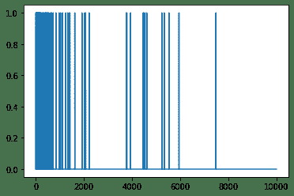
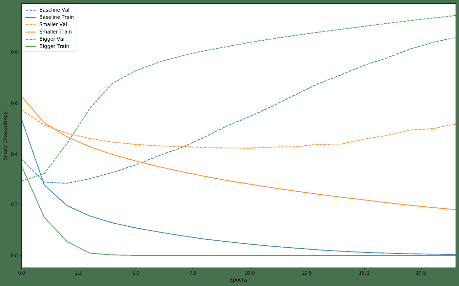
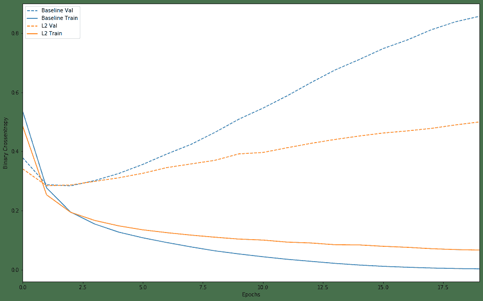
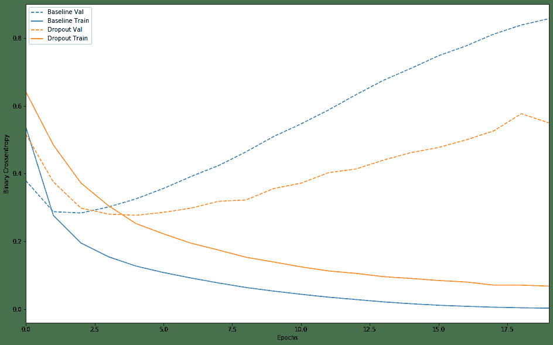

# 探索过拟合和欠拟合

与往常一样，此示例中的代码将使用 `tf.keras` API，您可以在TensorFlow [Keras 指南](https://www.tensorflow.org/guide/keras)中了解更多信息。

在前面的两个示例（对电影评论进行分类和预测燃油效率）中，我们看到了在验证数据上的模型的准确性在经过多个时期的训练后将达到峰值，然后开始下降。

换句话说，我们的模型将 *过拟合* 训练数据。学习如何应对过拟合很重要。尽管通常可以在*训练集*上达到高精度，但我们真正想要的是开发能够很好地推广到*测试集*（或之前未见的数据）的模型。

过拟合的反面是*欠拟合*。当测试数据仍有改进空间时，就会发生欠拟合。发生这种情况的原因有很多: 如果模型不够强大，模型过于规范化，或者仅仅是没有经过足够长时间的训练。这意味着网络尚未学习训练数据中的相关模式。

但是，如果训练时间过长，则模型将开始过拟合并从训练数据中学习无法推广到测试数据的模式。我们需要保持平衡。如下所述，了解如何训练适当的时期是一项有用的技能。

为了防止过拟合，最好的解决方案是使用更多的训练数据。经过更多数据训练的模型自然会更好地推广。当这不再可能时，下一个最佳解决方案是使用正则化之类的技术。这些因素限制了模型可以存储的信息的数量和类型。如果一个网络只能存储少量模式，那么优化过程将迫使它专注于最突出的模式，这些模式有更好的概括机会。

在本笔记本中，我们将探讨两种常见的正则化技术（权重正则化和 dropout），并使用它们来改进我们的IMDB电影评论分类笔记本。

```python
from __future__ import absolute_import, division, print_function, unicode_literals

try:
  # %tensorflow_version only exists in Colab.
  %tensorflow_version 2.x
except Exception:
  pass
import tensorflow as tf
from tensorflow import keras

import numpy as np
import matplotlib.pyplot as plt

print(tf.__version__)
```

## 下载IMDB数据集

而不是像以前的笔记本中那样使用embedding，这里我们将对句子进行 multi-hot 编码。 该模型将很快适合训练集。 它将用于演示何时发生过拟合以及如何应对。

对列表进行 multi-hot 编码意味着将它们变成0和1的向量。 具体来说，这意味着例如将序列 `[3, 5]` 变成10,000维向量，该向量除了索引3和5将是1，其他将是全为零。


```python
NUM_WORDS = 10000

(train_data, train_labels), (test_data, test_labels) = keras.datasets.imdb.load_data(num_words=NUM_WORDS)

def multi_hot_sequences(sequences, dimension):
    # Create an all-zero matrix of shape (len(sequences), dimension)
    results = np.zeros((len(sequences), dimension))
    for i, word_indices in enumerate(sequences):
        results[i, word_indices] = 1.0  # set specific indices of results[i] to 1s
    return results


train_data = multi_hot_sequences(train_data, dimension=NUM_WORDS)
test_data = multi_hot_sequences(test_data, dimension=NUM_WORDS)
```

让我们看一下产生的 multi-hot 向量之一。 单词索引按频率排序，因此可以预期在索引零附近有更多的1值，如我们在该图中所看到的: 

```python
plt.plot(train_data[0])
```



## 证明过拟合

防止过拟合的最简单方法是减小模型的大小，即减小模型中可学习的参数的数量（由层数和每层单元数确定）。在深度学习中，模型中可学习参数的数量通常称为模型的“容量”。直观地讲，具有更多参数的模型将具有更多的“记忆能力”，因此将能够轻松学习训练样本与其目标之间的完美的字典式映射，这种映射没有任何泛化能力，但是在进行预测时这将是无用的根据以前看不见的数据。

始终牢记这一点: 深度学习模型往往擅长拟合训练数据，但真正的挑战是泛化而不是拟合。

另一方面，如果网络的存储资源有限，则将无法轻松地学习映射。为了最大程度地减少损失，它必须学习具有更强预测能力的压缩表示形式。同时，如果您使模型过小，将难以拟合训练数据。 “容量过多”和“容量不足”之间存在平衡。

不幸的是，没有神奇的公式来确定模型的正确大小或体系结构（根据层数或每层的正确大小）。您将不得不尝试使用一系列不同的体系结构。

为了找到合适的模型大小，最好从相对较少的图层和参数开始，然后开始增加图层的大小或添加新的图层，直到看到验证损失的收益递减为止。让我们在电影评论分类网络上尝试一下。

我们将仅使用 `Dense` 层作为基准来创建一个简单的模型，然后创建较小和较大的版本并进行比较。


### Create a baseline model


```python
baseline_model = keras.Sequential([
    # `input_shape` is only required here so that `.summary` works.
    keras.layers.Dense(16, activation='relu', input_shape=(NUM_WORDS,)),
    keras.layers.Dense(16, activation='relu'),
    keras.layers.Dense(1, activation='sigmoid')
])

baseline_model.compile(optimizer='adam',
                       loss='binary_crossentropy',
                       metrics=['accuracy', 'binary_crossentropy'])

baseline_model.summary()
```


```python
baseline_history = baseline_model.fit(train_data,
                                      train_labels,
                                      epochs=20,
                                      batch_size=512,
                                      validation_data=(test_data, test_labels),
                                      verbose=2)
```

```
Train on 25000 samples, validate on 25000 samples
Epoch 1/20
25000/25000 - 4s - loss: 0.5372 - accuracy: 0.7976 - binary_crossentropy: 0.5372 - val_loss: 0.3794 - val_accuracy: 0.8722 - val_binary_crossentropy: 0.3794
Epoch 2/20
25000/25000 - 2s - loss: 0.2769 - accuracy: 0.9060 - binary_crossentropy: 0.2769 - val_loss: 0.2880 - val_accuracy: 0.8878 - val_binary_crossentropy: 0.2880
Epoch 3/20
25000/25000 - 2s - loss: 0.1955 - accuracy: 0.9320 - binary_crossentropy: 0.1955 - val_loss: 0.2840 - val_accuracy: 0.8882 - val_binary_crossentropy: 0.2840
Epoch 4/20
25000/25000 - 2s - loss: 0.1551 - accuracy: 0.9480 - binary_crossentropy: 0.1551 - val_loss: 0.3017 - val_accuracy: 0.8818 - val_binary_crossentropy: 0.3017
Epoch 5/20
25000/25000 - 2s - loss: 0.1277 - accuracy: 0.9577 - binary_crossentropy: 0.1277 - val_loss: 0.3257 - val_accuracy: 0.8770 - val_binary_crossentropy: 0.3257
Epoch 6/20
25000/25000 - 2s - loss: 0.1086 - accuracy: 0.9659 - binary_crossentropy: 0.1086 - val_loss: 0.3563 - val_accuracy: 0.8730 - val_binary_crossentropy: 0.3563
Epoch 7/20
25000/25000 - 2s - loss: 0.0925 - accuracy: 0.9713 - binary_crossentropy: 0.0925 - val_loss: 0.3914 - val_accuracy: 0.8676 - val_binary_crossentropy: 0.3914
Epoch 8/20
25000/25000 - 2s - loss: 0.0779 - accuracy: 0.9776 - binary_crossentropy: 0.0779 - val_loss: 0.4238 - val_accuracy: 0.8672 - val_binary_crossentropy: 0.4238
Epoch 9/20
25000/25000 - 2s - loss: 0.0645 - accuracy: 0.9832 - binary_crossentropy: 0.0645 - val_loss: 0.4644 - val_accuracy: 0.8634 - val_binary_crossentropy: 0.4644
Epoch 10/20
25000/25000 - 2s - loss: 0.0540 - accuracy: 0.9874 - binary_crossentropy: 0.0540 - val_loss: 0.5092 - val_accuracy: 0.8596 - val_binary_crossentropy: 0.5092
Epoch 11/20
25000/25000 - 2s - loss: 0.0445 - accuracy: 0.9906 - binary_crossentropy: 0.0445 - val_loss: 0.5465 - val_accuracy: 0.8575 - val_binary_crossentropy: 0.5465
Epoch 12/20
25000/25000 - 2s - loss: 0.0360 - accuracy: 0.9936 - binary_crossentropy: 0.0360 - val_loss: 0.5877 - val_accuracy: 0.8549 - val_binary_crossentropy: 0.5877
Epoch 13/20
25000/25000 - 2s - loss: 0.0290 - accuracy: 0.9953 - binary_crossentropy: 0.0290 - val_loss: 0.6328 - val_accuracy: 0.8545 - val_binary_crossentropy: 0.6328
Epoch 14/20
25000/25000 - 2s - loss: 0.0222 - accuracy: 0.9970 - binary_crossentropy: 0.0222 - val_loss: 0.6753 - val_accuracy: 0.8525 - val_binary_crossentropy: 0.6753
Epoch 15/20
25000/25000 - 2s - loss: 0.0166 - accuracy: 0.9984 - binary_crossentropy: 0.0166 - val_loss: 0.7104 - val_accuracy: 0.8519 - val_binary_crossentropy: 0.7104
Epoch 16/20
25000/25000 - 2s - loss: 0.0122 - accuracy: 0.9991 - binary_crossentropy: 0.0122 - val_loss: 0.7475 - val_accuracy: 0.8507 - val_binary_crossentropy: 0.7475
Epoch 17/20
25000/25000 - 2s - loss: 0.0091 - accuracy: 0.9994 - binary_crossentropy: 0.0091 - val_loss: 0.7765 - val_accuracy: 0.8511 - val_binary_crossentropy: 0.7765
Epoch 18/20
25000/25000 - 2s - loss: 0.0065 - accuracy: 0.9995 - binary_crossentropy: 0.0065 - val_loss: 0.8110 - val_accuracy: 0.8502 - val_binary_crossentropy: 0.8110
Epoch 19/20
25000/25000 - 2s - loss: 0.0048 - accuracy: 0.9999 - binary_crossentropy: 0.0048 - val_loss: 0.8378 - val_accuracy: 0.8506 - val_binary_crossentropy: 0.8378
Epoch 20/20
25000/25000 - 2s - loss: 0.0036 - accuracy: 0.9999 - binary_crossentropy: 0.0036 - val_loss: 0.8565 - val_accuracy: 0.8504 - val_binary_crossentropy: 0.8565
```

### 创建 smaller model

让我们创建一个隐藏单元更少的模型，以与我们刚刚创建的基线模型进行比较: 


```python
smaller_model = keras.Sequential([
    keras.layers.Dense(4, activation='relu', input_shape=(NUM_WORDS,)),
    keras.layers.Dense(4, activation='relu'),
    keras.layers.Dense(1, activation='sigmoid')
])

smaller_model.compile(optimizer='adam',
                      loss='binary_crossentropy',
                      metrics=['accuracy', 'binary_crossentropy'])

smaller_model.summary()
```

并使用相同的数据训练模型: 


```python
smaller_history = smaller_model.fit(train_data,
                                    train_labels,
                                    epochs=20,
                                    batch_size=512,
                                    validation_data=(test_data, test_labels),
                                    verbose=2)
```

```
Train on 25000 samples, validate on 25000 samples
Epoch 1/20
25000/25000 - 3s - loss: 0.6257 - accuracy: 0.6366 - binary_crossentropy: 0.6257 - val_loss: 0.5723 - val_accuracy: 0.7452 - val_binary_crossentropy: 0.5723
Epoch 2/20
25000/25000 - 2s - loss: 0.5220 - accuracy: 0.8021 - binary_crossentropy: 0.5220 - val_loss: 0.5128 - val_accuracy: 0.8185 - val_binary_crossentropy: 0.5128
Epoch 3/20
25000/25000 - 2s - loss: 0.4661 - accuracy: 0.8674 - binary_crossentropy: 0.4661 - val_loss: 0.4799 - val_accuracy: 0.8497 - val_binary_crossentropy: 0.4799
Epoch 4/20
25000/25000 - 2s - loss: 0.4271 - accuracy: 0.8999 - binary_crossentropy: 0.4271 - val_loss: 0.4595 - val_accuracy: 0.8634 - val_binary_crossentropy: 0.4595
Epoch 5/20
25000/25000 - 2s - loss: 0.3967 - accuracy: 0.9178 - binary_crossentropy: 0.3967 - val_loss: 0.4454 - val_accuracy: 0.8721 - val_binary_crossentropy: 0.4454
Epoch 6/20
25000/25000 - 2s - loss: 0.3715 - accuracy: 0.9320 - binary_crossentropy: 0.3715 - val_loss: 0.4366 - val_accuracy: 0.8744 - val_binary_crossentropy: 0.4366
Epoch 7/20
25000/25000 - 2s - loss: 0.3494 - accuracy: 0.9433 - binary_crossentropy: 0.3494 - val_loss: 0.4306 - val_accuracy: 0.8765 - val_binary_crossentropy: 0.4306
Epoch 8/20
25000/25000 - 2s - loss: 0.3294 - accuracy: 0.9515 - binary_crossentropy: 0.3294 - val_loss: 0.4292 - val_accuracy: 0.8751 - val_binary_crossentropy: 0.4292
Epoch 9/20
25000/25000 - 2s - loss: 0.3115 - accuracy: 0.9585 - binary_crossentropy: 0.3115 - val_loss: 0.4238 - val_accuracy: 0.8772 - val_binary_crossentropy: 0.4238
Epoch 10/20
25000/25000 - 2s - loss: 0.2948 - accuracy: 0.9648 - binary_crossentropy: 0.2948 - val_loss: 0.4226 - val_accuracy: 0.8767 - val_binary_crossentropy: 0.4226
Epoch 11/20
25000/25000 - 2s - loss: 0.2802 - accuracy: 0.9698 - binary_crossentropy: 0.2802 - val_loss: 0.4219 - val_accuracy: 0.8752 - val_binary_crossentropy: 0.4219
Epoch 12/20
25000/25000 - 2s - loss: 0.2658 - accuracy: 0.9741 - binary_crossentropy: 0.2658 - val_loss: 0.4264 - val_accuracy: 0.8728 - val_binary_crossentropy: 0.4264
Epoch 13/20
25000/25000 - 2s - loss: 0.2527 - accuracy: 0.9772 - binary_crossentropy: 0.2527 - val_loss: 0.4275 - val_accuracy: 0.8717 - val_binary_crossentropy: 0.4275
Epoch 14/20
25000/25000 - 2s - loss: 0.2408 - accuracy: 0.9800 - binary_crossentropy: 0.2408 - val_loss: 0.4370 - val_accuracy: 0.8712 - val_binary_crossentropy: 0.4370
Epoch 15/20
25000/25000 - 2s - loss: 0.2294 - accuracy: 0.9824 - binary_crossentropy: 0.2294 - val_loss: 0.4381 - val_accuracy: 0.8706 - val_binary_crossentropy: 0.4381
Epoch 16/20
25000/25000 - 2s - loss: 0.2184 - accuracy: 0.9852 - binary_crossentropy: 0.2184 - val_loss: 0.4574 - val_accuracy: 0.8676 - val_binary_crossentropy: 0.4574
Epoch 17/20
25000/25000 - 2s - loss: 0.2076 - accuracy: 0.9862 - binary_crossentropy: 0.2076 - val_loss: 0.4715 - val_accuracy: 0.8676 - val_binary_crossentropy: 0.4715
Epoch 18/20
25000/25000 - 2s - loss: 0.1972 - accuracy: 0.9881 - binary_crossentropy: 0.1972 - val_loss: 0.4931 - val_accuracy: 0.8667 - val_binary_crossentropy: 0.4931
Epoch 19/20
25000/25000 - 2s - loss: 0.1884 - accuracy: 0.9892 - binary_crossentropy: 0.1884 - val_loss: 0.4986 - val_accuracy: 0.8675 - val_binary_crossentropy: 0.4986
Epoch 20/20
25000/25000 - 2s - loss: 0.1799 - accuracy: 0.9902 - binary_crossentropy: 0.1799 - val_loss: 0.5162 - val_accuracy: 0.8664 - val_binary_crossentropy: 0.5162
```

### 创建 bigger model

作为练习，您可以创建一个更大的模型，并查看它开始过拟合的速度。 接下来，让我们将具有更大容量的网络添加到此基准网络中，远远超出问题所能保证的范围: 


```python
bigger_model = keras.models.Sequential([
    keras.layers.Dense(512, activation='relu', input_shape=(NUM_WORDS,)),
    keras.layers.Dense(512, activation='relu'),
    keras.layers.Dense(1, activation='sigmoid')
])

bigger_model.compile(optimizer='adam',
                     loss='binary_crossentropy',
                     metrics=['accuracy','binary_crossentropy'])

bigger_model.summary()
```

再次，使用相同的数据训练模型: 


```python
bigger_history = bigger_model.fit(train_data, train_labels,
                                  epochs=20,
                                  batch_size=512,
                                  validation_data=(test_data, test_labels),
                                  verbose=2)
```

```
Train on 25000 samples, validate on 25000 samples
Epoch 1/20
25000/25000 - 3s - loss: 0.3532 - accuracy: 0.8450 - binary_crossentropy: 0.3532 - val_loss: 0.2926 - val_accuracy: 0.8806 - val_binary_crossentropy: 0.2926
Epoch 2/20
25000/25000 - 3s - loss: 0.1497 - accuracy: 0.9452 - binary_crossentropy: 0.1497 - val_loss: 0.3216 - val_accuracy: 0.8748 - val_binary_crossentropy: 0.3216
Epoch 3/20
25000/25000 - 3s - loss: 0.0543 - accuracy: 0.9832 - binary_crossentropy: 0.0543 - val_loss: 0.4412 - val_accuracy: 0.8673 - val_binary_crossentropy: 0.4412
Epoch 4/20
25000/25000 - 3s - loss: 0.0090 - accuracy: 0.9984 - binary_crossentropy: 0.0090 - val_loss: 0.5789 - val_accuracy: 0.8673 - val_binary_crossentropy: 0.5789
Epoch 5/20
25000/25000 - 3s - loss: 0.0020 - accuracy: 0.9999 - binary_crossentropy: 0.0020 - val_loss: 0.6779 - val_accuracy: 0.8697 - val_binary_crossentropy: 0.6779
Epoch 6/20
25000/25000 - 3s - loss: 2.8322e-04 - accuracy: 1.0000 - binary_crossentropy: 2.8322e-04 - val_loss: 0.7258 - val_accuracy: 0.8700 - val_binary_crossentropy: 0.7258
Epoch 7/20
25000/25000 - 3s - loss: 1.5209e-04 - accuracy: 1.0000 - binary_crossentropy: 1.5209e-04 - val_loss: 0.7596 - val_accuracy: 0.8701 - val_binary_crossentropy: 0.7596
Epoch 8/20
25000/25000 - 3s - loss: 1.0533e-04 - accuracy: 1.0000 - binary_crossentropy: 1.0533e-04 - val_loss: 0.7842 - val_accuracy: 0.8703 - val_binary_crossentropy: 0.7842
Epoch 9/20
25000/25000 - 3s - loss: 7.9425e-05 - accuracy: 1.0000 - binary_crossentropy: 7.9425e-05 - val_loss: 0.8044 - val_accuracy: 0.8705 - val_binary_crossentropy: 0.8044
Epoch 10/20
25000/25000 - 3s - loss: 6.2468e-05 - accuracy: 1.0000 - binary_crossentropy: 6.2468e-05 - val_loss: 0.8212 - val_accuracy: 0.8710 - val_binary_crossentropy: 0.8212
Epoch 11/20
25000/25000 - 3s - loss: 5.0610e-05 - accuracy: 1.0000 - binary_crossentropy: 5.0610e-05 - val_loss: 0.8377 - val_accuracy: 0.8707 - val_binary_crossentropy: 0.8377
Epoch 12/20
25000/25000 - 3s - loss: 4.1791e-05 - accuracy: 1.0000 - binary_crossentropy: 4.1791e-05 - val_loss: 0.8515 - val_accuracy: 0.8708 - val_binary_crossentropy: 0.8515
Epoch 13/20
25000/25000 - 3s - loss: 3.4956e-05 - accuracy: 1.0000 - binary_crossentropy: 3.4956e-05 - val_loss: 0.8652 - val_accuracy: 0.8708 - val_binary_crossentropy: 0.8652
Epoch 14/20
25000/25000 - 3s - loss: 2.9664e-05 - accuracy: 1.0000 - binary_crossentropy: 2.9664e-05 - val_loss: 0.8777 - val_accuracy: 0.8708 - val_binary_crossentropy: 0.8777
Epoch 15/20
25000/25000 - 3s - loss: 2.5332e-05 - accuracy: 1.0000 - binary_crossentropy: 2.5332e-05 - val_loss: 0.8893 - val_accuracy: 0.8706 - val_binary_crossentropy: 0.8893
Epoch 16/20
25000/25000 - 3s - loss: 2.1888e-05 - accuracy: 1.0000 - binary_crossentropy: 2.1888e-05 - val_loss: 0.9009 - val_accuracy: 0.8708 - val_binary_crossentropy: 0.9009
Epoch 17/20
25000/25000 - 3s - loss: 1.9007e-05 - accuracy: 1.0000 - binary_crossentropy: 1.9007e-05 - val_loss: 0.9121 - val_accuracy: 0.8706 - val_binary_crossentropy: 0.9121
Epoch 18/20
25000/25000 - 3s - loss: 1.6598e-05 - accuracy: 1.0000 - binary_crossentropy: 1.6598e-05 - val_loss: 0.9229 - val_accuracy: 0.8708 - val_binary_crossentropy: 0.9229
Epoch 19/20
25000/25000 - 3s - loss: 1.4588e-05 - accuracy: 1.0000 - binary_crossentropy: 1.4588e-05 - val_loss: 0.9331 - val_accuracy: 0.8707 - val_binary_crossentropy: 0.9331
Epoch 20/20
25000/25000 - 3s - loss: 1.2884e-05 - accuracy: 1.0000 - binary_crossentropy: 1.2884e-05 - val_loss: 0.9433 - val_accuracy: 0.8707 - val_binary_crossentropy: 0.9433
```

### 绘制训练和验证损失

<!--TODO(markdaoust): This should be a one-liner with tensorboard -->

实线表示训练损失，而虚线表示验证损失（请记住: 验证损失越小表示模型越好）。 在这里，较小的网络比基准模型开始过度拟合（在6个时期而不是4个周期之后），并且一旦开始过度拟合，其性能下降的速度就会慢得多。

```python
def plot_history(histories, key='binary_crossentropy'):
  plt.figure(figsize=(16,10))

  for name, history in histories:
    val = plt.plot(history.epoch, history.history['val_'+key],
                   '--', label=name.title()+' Val')
    plt.plot(history.epoch, history.history[key], color=val[0].get_color(),
             label=name.title()+' Train')

  plt.xlabel('Epochs')
  plt.ylabel(key.replace('_',' ').title())
  plt.legend()

  plt.xlim([0,max(history.epoch)])


plot_history([('baseline', baseline_history),
              ('smaller', smaller_history),
              ('bigger', bigger_history)])
```



请注意，较大的网络仅在一个时期后就开始过拟合，而且过拟合严重。网络的容量越多，将能够更快地对训练数据进行建模（导致较低的训练损失），但网络越容易过拟合（导致训练和验证损失之间存在较大差异）。

## 防止过度拟合的策略

### 添加权重正则化

您可能熟悉Occam的Razor原理: 给某事两种解释，最可能正确的解释是“最简单”的解释，即假设最少的一种。这也适用于通过神经网络学习的模型: 给定一些训练数据和网络体系结构，可以使用多组权重值（多个模型）来解释数据，并且较简单的模型比复杂的模型不太可能过拟合。

在这种情况下，“简单模型”是参数值的分布具有较小熵的模型（或如上节所述，具有总共较少参数的模型）。因此，减轻过拟合的一种通用方法是通过仅将网络的权重强制取小的值来对网络的复杂性施加约束，这使得权重值的分布更加“规则”。这称为“权重调整”，它是通过向网络的损失函数中添加与权重较大相关的成本来完成的。以下有两种形式: 

* [L1正则化](https://developers.google.com/machine-learning/glossary/#L1_regularization)，其中增加的成本与权重系数的绝对值成正比（即所谓的“ L1规范” ”）。

* [L2正则化](https://developers.google.com/machine-learning/glossary/#L2_regularization)，其中增加的成本与权重系数的值的平方成正比（即与平方的平方成正比）权重的“ L2规范”。 L2正则化在神经网络中也称为权重衰减。不要让其他名称使您感到困惑: 权重衰减在数学上与L2正则化完全相同。

L1正则化引入稀疏性，以使您的某些权重参数为零。 L2正则化将惩罚权重参数而不使其稀疏，这是L2更为常见的原因之一。

在 `tf.keras` 中，通过将权重正则化器实例作为关键字参数传递给图层来添加权重正则化。让我们现在添加L2权重正则化。


```python
l2_model = keras.models.Sequential([
    keras.layers.Dense(16, kernel_regularizer=keras.regularizers.l2(0.001),
                       activation='relu', input_shape=(NUM_WORDS,)),
    keras.layers.Dense(16, kernel_regularizer=keras.regularizers.l2(0.001),
                       activation='relu'),
    keras.layers.Dense(1, activation='sigmoid')
])

l2_model.compile(optimizer='adam',
                 loss='binary_crossentropy',
                 metrics=['accuracy', 'binary_crossentropy'])

l2_model_history = l2_model.fit(train_data, train_labels,
                                epochs=20,
                                batch_size=512,
                                validation_data=(test_data, test_labels),
                                verbose=2)
```

```
Train on 25000 samples, validate on 25000 samples
Epoch 1/20
25000/25000 - 3s - loss: 0.5267 - accuracy: 0.7989 - binary_crossentropy: 0.4870 - val_loss: 0.3816 - val_accuracy: 0.8753 - val_binary_crossentropy: 0.3416
Epoch 2/20
25000/25000 - 2s - loss: 0.2978 - accuracy: 0.9096 - binary_crossentropy: 0.2536 - val_loss: 0.3314 - val_accuracy: 0.8883 - val_binary_crossentropy: 0.2842
Epoch 3/20
25000/25000 - 2s - loss: 0.2444 - accuracy: 0.9324 - binary_crossentropy: 0.1947 - val_loss: 0.3386 - val_accuracy: 0.8860 - val_binary_crossentropy: 0.2869
Epoch 4/20
25000/25000 - 2s - loss: 0.2207 - accuracy: 0.9419 - binary_crossentropy: 0.1671 - val_loss: 0.3539 - val_accuracy: 0.8802 - val_binary_crossentropy: 0.2991
Epoch 5/20
25000/25000 - 2s - loss: 0.2049 - accuracy: 0.9501 - binary_crossentropy: 0.1489 - val_loss: 0.3682 - val_accuracy: 0.8790 - val_binary_crossentropy: 0.3111
Epoch 6/20
25000/25000 - 2s - loss: 0.1938 - accuracy: 0.9557 - binary_crossentropy: 0.1354 - val_loss: 0.3854 - val_accuracy: 0.8758 - val_binary_crossentropy: 0.3263
Epoch 7/20
25000/25000 - 2s - loss: 0.1857 - accuracy: 0.9567 - binary_crossentropy: 0.1259 - val_loss: 0.4061 - val_accuracy: 0.8716 - val_binary_crossentropy: 0.3456
Epoch 8/20
25000/25000 - 2s - loss: 0.1791 - accuracy: 0.9622 - binary_crossentropy: 0.1176 - val_loss: 0.4199 - val_accuracy: 0.8684 - val_binary_crossentropy: 0.3579
Epoch 9/20
25000/25000 - 2s - loss: 0.1732 - accuracy: 0.9634 - binary_crossentropy: 0.1105 - val_loss: 0.4332 - val_accuracy: 0.8682 - val_binary_crossentropy: 0.3701
Epoch 10/20
25000/25000 - 2s - loss: 0.1676 - accuracy: 0.9660 - binary_crossentropy: 0.1042 - val_loss: 0.4559 - val_accuracy: 0.8614 - val_binary_crossentropy: 0.3919
Epoch 11/20
25000/25000 - 2s - loss: 0.1656 - accuracy: 0.9666 - binary_crossentropy: 0.1009 - val_loss: 0.4620 - val_accuracy: 0.8618 - val_binary_crossentropy: 0.3967
Epoch 12/20
25000/25000 - 2s - loss: 0.1599 - accuracy: 0.9692 - binary_crossentropy: 0.0940 - val_loss: 0.4786 - val_accuracy: 0.8634 - val_binary_crossentropy: 0.4125
Epoch 13/20
25000/25000 - 2s - loss: 0.1575 - accuracy: 0.9696 - binary_crossentropy: 0.0910 - val_loss: 0.4944 - val_accuracy: 0.8600 - val_binary_crossentropy: 0.4275
Epoch 14/20
25000/25000 - 2s - loss: 0.1520 - accuracy: 0.9718 - binary_crossentropy: 0.0851 - val_loss: 0.5079 - val_accuracy: 0.8562 - val_binary_crossentropy: 0.4406
Epoch 15/20
25000/25000 - 2s - loss: 0.1521 - accuracy: 0.9719 - binary_crossentropy: 0.0845 - val_loss: 0.5203 - val_accuracy: 0.8586 - val_binary_crossentropy: 0.4521
Epoch 16/20
25000/25000 - 2s - loss: 0.1481 - accuracy: 0.9737 - binary_crossentropy: 0.0798 - val_loss: 0.5309 - val_accuracy: 0.8576 - val_binary_crossentropy: 0.4623
Epoch 17/20
25000/25000 - 2s - loss: 0.1452 - accuracy: 0.9754 - binary_crossentropy: 0.0764 - val_loss: 0.5384 - val_accuracy: 0.8567 - val_binary_crossentropy: 0.4694
Epoch 18/20
25000/25000 - 2s - loss: 0.1408 - accuracy: 0.9775 - binary_crossentropy: 0.0718 - val_loss: 0.5470 - val_accuracy: 0.8565 - val_binary_crossentropy: 0.4780
Epoch 19/20
25000/25000 - 2s - loss: 0.1376 - accuracy: 0.9773 - binary_crossentropy: 0.0687 - val_loss: 0.5587 - val_accuracy: 0.8554 - val_binary_crossentropy: 0.4896
Epoch 20/20
25000/25000 - 2s - loss: 0.1362 - accuracy: 0.9787 - binary_crossentropy: 0.0671 - val_loss: 0.5690 - val_accuracy: 0.8556 - val_binary_crossentropy: 0.4997
```

`l2(0.001)` 表示该层权重矩阵中的每个系数将为网络的总损耗增加 `0.001 * weight_coefficient_value**2`。 请注意，由于此惩罚仅在训练时增加，因此在训练时此网络的损失将比在测试时高得多。

这是我们的L2正则化惩罚的影响: 

```python
plot_history([('baseline', baseline_history),
              ('l2', l2_model_history)])
```



如您所见，即使两个模型具有相同数量的参数，L2正则化模型也比基线模型具有更高的抗过度拟合能力。

### 添加 dropout

dropout 是 Hinton 和他在多伦多大学的学生开发的最有效，最常用的神经网络正则化技术之一。应用于图层的辍学包括在训练过程中随机“dropping out”（即设置为零）该图层的许多输出特征。假设在训练过程中，给定的图层通常会为给定的输入样本返回向量  [0.2, 0.5, 1.3, 0.8, 1.1]；应用删除后，此向量将有一些零个条目随机分布，例如 [0, 0.5, 1.3, 0, 1.1]。 “dropout 率”是被清零的特征的一部分。通常设置在0.2到0.5之间。在测试时，不会丢失任何单元，而是将图层的输出值按等于丢失率的比例缩小，以平衡一个活跃的单元（而不是训练时）的事实。

在tf.keras中，您可以通过Dropout层在网络中引入Dropout，该层将立即应用于该层的输出。

让我们在IMDB网络中添加两个Dropout层，看看它们在减少过拟合方面的表现如何: 


```python
dpt_model = keras.models.Sequential([
    keras.layers.Dense(16, activation='relu', input_shape=(NUM_WORDS,)),
    keras.layers.Dropout(0.5),
    keras.layers.Dense(16, activation='relu'),
    keras.layers.Dropout(0.5),
    keras.layers.Dense(1, activation='sigmoid')
])

dpt_model.compile(optimizer='adam',
                  loss='binary_crossentropy',
                  metrics=['accuracy','binary_crossentropy'])

dpt_model_history = dpt_model.fit(train_data, train_labels,
                                  epochs=20,
                                  batch_size=512,
                                  validation_data=(test_data, test_labels),
                                  verbose=2)
```

```
Train on 25000 samples, validate on 25000 samples
Epoch 1/20
25000/25000 - 3s - loss: 0.6413 - accuracy: 0.6321 - binary_crossentropy: 0.6413 - val_loss: 0.5159 - val_accuracy: 0.8523 - val_binary_crossentropy: 0.5159
Epoch 2/20
25000/25000 - 2s - loss: 0.4843 - accuracy: 0.7935 - binary_crossentropy: 0.4843 - val_loss: 0.3755 - val_accuracy: 0.8818 - val_binary_crossentropy: 0.3755
Epoch 3/20
25000/25000 - 2s - loss: 0.3726 - accuracy: 0.8626 - binary_crossentropy: 0.3726 - val_loss: 0.2985 - val_accuracy: 0.8888 - val_binary_crossentropy: 0.2985
Epoch 4/20
25000/25000 - 2s - loss: 0.3056 - accuracy: 0.8994 - binary_crossentropy: 0.3056 - val_loss: 0.2808 - val_accuracy: 0.8894 - val_binary_crossentropy: 0.2808
Epoch 5/20
25000/25000 - 2s - loss: 0.2530 - accuracy: 0.9180 - binary_crossentropy: 0.2530 - val_loss: 0.2771 - val_accuracy: 0.8883 - val_binary_crossentropy: 0.2771
Epoch 6/20
25000/25000 - 2s - loss: 0.2226 - accuracy: 0.9316 - binary_crossentropy: 0.2226 - val_loss: 0.2860 - val_accuracy: 0.8859 - val_binary_crossentropy: 0.2860
Epoch 7/20
25000/25000 - 2s - loss: 0.1951 - accuracy: 0.9422 - binary_crossentropy: 0.1951 - val_loss: 0.2983 - val_accuracy: 0.8855 - val_binary_crossentropy: 0.2983
Epoch 8/20
25000/25000 - 2s - loss: 0.1748 - accuracy: 0.9478 - binary_crossentropy: 0.1748 - val_loss: 0.3184 - val_accuracy: 0.8828 - val_binary_crossentropy: 0.3184
Epoch 9/20
25000/25000 - 2s - loss: 0.1537 - accuracy: 0.9533 - binary_crossentropy: 0.1537 - val_loss: 0.3224 - val_accuracy: 0.8822 - val_binary_crossentropy: 0.3224
Epoch 10/20
25000/25000 - 2s - loss: 0.1397 - accuracy: 0.9580 - binary_crossentropy: 0.1397 - val_loss: 0.3558 - val_accuracy: 0.8811 - val_binary_crossentropy: 0.3558
Epoch 11/20
25000/25000 - 2s - loss: 0.1253 - accuracy: 0.9623 - binary_crossentropy: 0.1253 - val_loss: 0.3720 - val_accuracy: 0.8783 - val_binary_crossentropy: 0.3720
Epoch 12/20
25000/25000 - 2s - loss: 0.1132 - accuracy: 0.9674 - binary_crossentropy: 0.1132 - val_loss: 0.4028 - val_accuracy: 0.8787 - val_binary_crossentropy: 0.4028
Epoch 13/20
25000/25000 - 2s - loss: 0.1061 - accuracy: 0.9681 - binary_crossentropy: 0.1061 - val_loss: 0.4139 - val_accuracy: 0.8790 - val_binary_crossentropy: 0.4139
Epoch 14/20
25000/25000 - 2s - loss: 0.0964 - accuracy: 0.9708 - binary_crossentropy: 0.0964 - val_loss: 0.4399 - val_accuracy: 0.8772 - val_binary_crossentropy: 0.4399
Epoch 15/20
25000/25000 - 2s - loss: 0.0911 - accuracy: 0.9712 - binary_crossentropy: 0.0911 - val_loss: 0.4620 - val_accuracy: 0.8785 - val_binary_crossentropy: 0.4620
Epoch 16/20
25000/25000 - 2s - loss: 0.0851 - accuracy: 0.9734 - binary_crossentropy: 0.0851 - val_loss: 0.4771 - val_accuracy: 0.8786 - val_binary_crossentropy: 0.4771
Epoch 17/20
25000/25000 - 2s - loss: 0.0807 - accuracy: 0.9750 - binary_crossentropy: 0.0807 - val_loss: 0.4997 - val_accuracy: 0.8773 - val_binary_crossentropy: 0.4997
Epoch 18/20
25000/25000 - 2s - loss: 0.0715 - accuracy: 0.9767 - binary_crossentropy: 0.0715 - val_loss: 0.5260 - val_accuracy: 0.8758 - val_binary_crossentropy: 0.5260
Epoch 19/20
25000/25000 - 2s - loss: 0.0714 - accuracy: 0.9766 - binary_crossentropy: 0.0714 - val_loss: 0.5766 - val_accuracy: 0.8744 - val_binary_crossentropy: 0.5766
Epoch 20/20
25000/25000 - 2s - loss: 0.0687 - accuracy: 0.9772 - binary_crossentropy: 0.0687 - val_loss: 0.5498 - val_accuracy: 0.8754 - val_binary_crossentropy: 0.5498
```


```python
plot_history([('baseline', baseline_history),
              ('dropout', dpt_model_history)])
```



添加 dropout 是对基线模型的明显改进。

回顾一下: 以下是防止神经网络过拟合的最常用方法: 

* 获取更多训练数据
* 减少网络容量
* 添加权重调整
* 添加 dropout

本指南未涵盖的两个重要方法是数据增强和批处理规范化。
