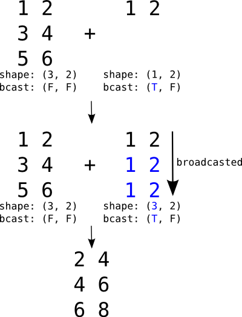

# Theano tensor 模块：操作符和逐元素操作

## 操作符

In [1]:

```py
import theano
from theano import tensor as T

```

```py
Using gpu device 1: Tesla C2075 (CNMeM is disabled)

```

`tensor` 类型支持很多基本的操作：

In [2]:

```py
# 两个整形三维张量

a, b = T.itensor3("a"), T.itensor3("b")

```

### 算术操作

In [3]:

```py
print theano.pp(a + 3)      # T.add(a, 3) -> itensor3
print theano.pp(3 - a)      # T.sub(3, a)
print theano.pp(a * 3.5)    # T.mul(a, 3.5) -> ftensor3 or dtensor3 (depending on casting)
print theano.pp(2.2 / a)    # T.truediv(2.2, a)
print theano.pp(2.2 // a)   # T.intdiv(2.2, a)
print theano.pp(2.2**a)     # T.pow(2.2, a)
print theano.pp(b % a)      # T.mod(b, a)

```

```py
(a + TensorConstant{3})
(TensorConstant{3} - a)
(a * TensorConstant{3.5})
(TensorConstant{2.20000004768} / a)
(TensorConstant{2.20000004768} // a)
(TensorConstant{2.20000004768} ** a)
mod(b, a)

```

### 比特操作

In [4]:

```py
print theano.pp(a & b)      # T.and_(a,b)    bitwise and (alias T.bitwise_and)
print theano.pp(a ^ 1)      # T.xor(a,1)     bitwise xor (alias T.bitwise_xor)
print theano.pp(a | b)      # T.or_(a,b)     bitwise or (alias T.bitwise_or)
print theano.pp(~a)         # T.invert(a)    bitwise invert (alias T.bitwise_not)

```

```py
and_(a, b)
xor(a, TensorConstant{1})
or_(a, b)
invert(a)

```

### 原地操作

`Theano` 不支持原地操作如 `+=` 等，`Theano` 的图优化解构会自动决定是否使用原地操作。如果需要更新变量的值，可以考虑使用共享变量 `theano.shared`。

## 逐元素操作

### 类型转换

`T.cast(x, dtype)` 用于类型转换：

In [5]:

```py
x = T.matrix()
x_as_int = T.cast(x, 'int32')

```

`T.cast(x, dtype)` 的机制与 `numpy.asarray(x, dtype)` 的机制类似，只有 `dtype` 不同时才会创建新的变量：

In [6]:

```py
print x_as_int is x
print T.cast(x, theano.config.floatX) is x

```

```py
False
True

```

复数取实部，虚部，角度，模：

*   `T.real(a)`
*   `T.imag(a)`
*   `T.angle(a)`
*   `T.abs_(a)`

### 比较

`Theano` 的比较操作也是逐元素的：

*   `T.lt(a, b)` : <
*   `T.gt(a, b)` : >
*   `T.le(a, b)` : <=
*   `T.ge(a, b)` : >=
*   `T.eq(a, b)` : ==
*   `T.neq(a, b)` : !=

`Theano` 中没有 `bool` 类型，所有的 `bool` 类型都用 `int8` 表示。

In [7]:

```py
x, y = T.dmatrices('x','y')

print theano.pp(T.le(x, y))

```

```py
le(x, y)

```

除此之外，还有另一些与 `numpy` 类似的用法：

*   `T.isnan(a)` : 是否 NAN
*   `T.isinf(a)` : 是否 INF
*   `T.isclose(a, b)` ：浮点数是否接近
*   `T.allclose(a, b)` ：浮点数是否很接近

### 条件

`T.switch(cond, ift, iff)` 选择 `ift (if ture)` 和 `iff (if false)`。

`T.where(cond, ift, iff)` 与 `switch` 一致。

`T.clip(x, min, max)` 低于 `min` 的部分变成 `min`，超过 `max` 的部分变成 `max`。

### 数学操作

In [8]:

```py
a, b = T.matrices("a", "b")

print theano.pp(T.maximum(a, b))  # max(a, b)
print theano.pp(T.minimum(a, b))  # min(a, b)

print theano.pp(T.neg(a)) # -a
print theano.pp(T.inv(a)) # 1.0/a

print theano.pp(T.exp(a)) 
print theano.pp(T.log(a)), theano.pp(T.log2(a)), theano.pp(T.log10(a))       # log10(a)

print theano.pp(T.sgn(a))       # sgn(a)
print theano.pp(T.floor(a))     # floor(a)
print theano.pp(T.ceil(a))      # ceil(a)
print theano.pp(T.round(a))     # round(a)
print theano.pp(T.iround(a))    # iround(a)

print theano.pp(T.sqr(a))   # sqr(a)
print theano.pp(T.sqrt(a))  # sqrt(a)

print theano.pp(T.cos(a)), theano.pp(T.sin(a)), theano.pp(T.tan(a))
print theano.pp(T.cosh(a)), theano.pp(T.sinh(a)), theano.pp(T.tanh(a))         # tan(a)

print theano.pp(T.erf(a)), theano.pp(T.erfc(a)) # erf(a), erfc(a)
print theano.pp(T.erfinv(a)), theano.pp(T.erfcinv(a))

print theano.pp(T.gamma(a))    # gamma(a)
print theano.pp(T.gammaln(a))  # log(gamma(a))
print theano.pp(T.psi(a))      # digamma(a)

```

```py
maximum(a, b)
minimum(a, b)
(-a)
inv(a)
exp(a)
log(a) log2(a) log10(a)
sgn(a)
floor(a)
ceil(a)
round_half_away_from_zero(a)
int64(round_half_away_from_zero(a))
sqr(a)
sqrt(a)
cos(a) sin(a) tan(a)
cosh(a) sinh(a) tanh(a)
erf(a) erfc(a)
erfinv(a) erfcinv(a)
gamma(a)
gammaln(a)
psi(a)

```

其中 `erf, erfc` 定义如下： [https://en.wikipedia.org/wiki/Error_function](https://en.wikipedia.org/wiki/Error_function)

$$ \operatorname{erf}(x) = \frac{2}{\sqrt\pi} \int_0^x e^{-t^2} dt $$$$ \begin{align} \operatorname{erfc}(x) & = 1-\operatorname{erf}(x) \\ & = \frac{2}{\sqrt\pi} \int_x^{\infty} e^{-t^2}\,\mathrm dt \\ & = e^{-x^2} \operatorname{erfcx}(x) \end{align} $$

`erfinv, erfcinv` 为其反函数：1 [https://en.wikipedia.org/wiki/Error_function#Inverse_functions](https://en.wikipedia.org/wiki/Error_function#Inverse_functions)

### Broadcasting



图示如上。

## 线性代数

矩阵乘法：`T.dot(x, y)`

向量外积：`T.outer(x, y)`

张量乘法：`tensordot(a, b, axes=2)`

`axes` 参数表示 `a` `b` 对应要去掉的维度。

In [9]:

```py
import numpy as np

a = np.random.random((2,3,4))
b = np.random.random((5,6,4,3))

#tensordot
c = np.tensordot(a, b, [[1,2],[3,2]])

#loop replicating tensordot
a0, a1, a2 = a.shape
b0, b1, _, _ = b.shape
cloop = np.zeros((a0,b0,b1))

#loop over non-summed indices -- these exist
#in the tensor product.
for i in range(a0):
    for j in range(b0):
        for k in range(b1):
            #loop over summed indices -- these don't exist
            #in the tensor product.
            for l in range(a1):
                for m in range(a2):
                    cloop[i,j,k] += a[i,l,m] * b[j,k,m,l]

assert np.allclose(c, cloop)

print a.shape, b.shape
print c.shape

```

```py
(2, 3, 4) (5, 6, 4, 3)
(2, 5, 6)

```