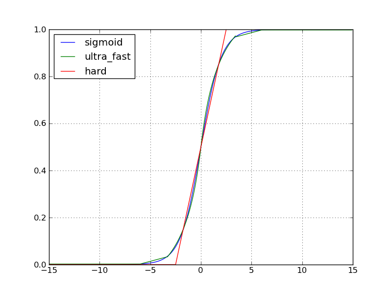

# Theano tensor 模块：nnet 子模块

`nnet` 是 `tensor` 模块中与神经网络 `Neural Networks` 相关的子模块。

In [1]:

```py
import theano
from theano import tensor as T

```

```py
Using gpu device 1: Tesla C2075 (CNMeM is disabled)

```

## Sigmoid 函数

共有三种 `sigmoid`：

*   `T.nnet.sigmoid(x)`
*   `T.nnet.ultra_sigmoid(x)`
*   `T.nnet.hard_sigmoid(x)`

精度和时间：

`sigmoid > ultra_fast_sigmoid > hard_sigmoid`

函数图像：



In [2]:

```py
x, y, b = T.dvectors('x', 'y', 'b')
W = T.dmatrix('W')
y = T.nnet.sigmoid(T.dot(W, x) + b)

print theano.pprint(y)

```

```py
sigmoid(((W \dot x) + b))

```

## 其他

`T.nnet.softplus(x)` 返回

$$\operatorname{softplus}(x) = \log_e{\left(1 + \exp(x)\right)}$$

会解决在 1 附近自定义函数值不准的问题。

In [3]:

```py
x,y,b = T.dvectors('x','y','b')
W = T.dmatrix('W')
y = T.nnet.softplus(T.dot(W,x) + b)

print theano.pprint(y)

```

```py
softplus(((W \dot x) + b))

```

`T.nnet.softplus(x)` 返回

$$ \operatorname{softmax}_{ij}(x) = \frac{\exp{x_{ij}}}{\sum_k\exp(x_{ik})} $$

当 `softmax` 作用到矩阵时，它会按照行进行计算。

不过，下面 的代码计算性能上更加稳定：

```py
e_x = exp(x - x.max(axis=1, keepdims=True))
out = e_x / e_x.sum(axis=1, keepdims=True)
```

In [4]:

```py
x,y,b = T.dvectors('x','y','b')
W = T.dmatrix('W')
y = T.nnet.softmax(T.dot(W,x) + b)

print theano.pprint(y)

```

```py
Softmax(((W \dot x) + b))

```

`T.nnet.relu(x, alpha=0)` 返回这样一个函数：

$$ f(x_i) = \left\{ \begin{aligned} x_i, & \ x_i > 0 \\ \alpha x_i, & \ otherwise \end{aligned}\right. $$

## 损失函数

`T.nnet.binary_crossentropy(output, target)` 二类交叉熵：

$$ \text{crossentropy}(t,o) = -(t\cdot log(o) + (1 - t) \cdot log(1 - o)) $$In [5]:

```py
x, y, b, c = T.dvectors('x', 'y', 'b', 'c')
W = T.dmatrix('W')
V = T.dmatrix('V')
h = T.nnet.sigmoid(T.dot(W, x) + b)
x_recons = T.nnet.sigmoid(T.dot(V, h) + c)
recon_cost = T.nnet.binary_crossentropy(x_recons, x).mean()

```

`T.nnet.categorical_crossentropy(coding_dist, true_dist)` 多类交叉熵

$$ H(p,q) = - \sum_x p(x) \log(q(x)) $$