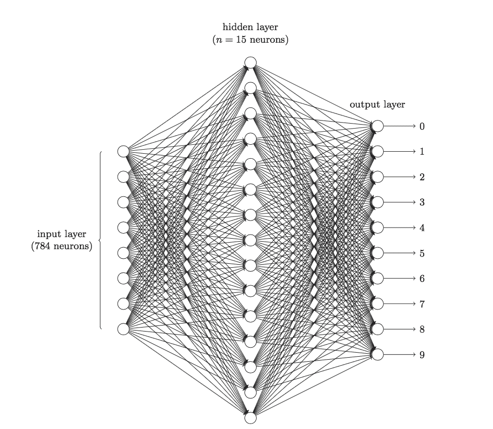

# CNN原理

> 建议: 看懂原理就行

# [【深度学习系列】卷积神经网络CNN原理详解(一)——基本原理](https://www.cnblogs.com/charlotte77/p/7759802.html)

　　上篇文章我们给出了用paddlepaddle来做手写数字识别的示例，并对网络结构进行到了调整，提高了识别的精度。有的同学表示不是很理解原理，为什么传统的机器学习算法，简单的神经网络(如多层感知机)都可以识别手写数字，我们要采用卷积神经网络CNN来进行别呢？CNN到底是怎么识别的？用CNN有哪些优势呢？我们下面就来简单分析一下。在讲CNN之前，为避免完全零基础的人看不懂后面的讲解，我们先简单回顾一下传统的神经网络的基本知识。

* * *

　　**神经网络的预备知识**

**     为什么要用神经网络？**

* 特征提取的高效性。

大家可能会疑惑，对于同一个分类任务，我们可以用机器学习的算法来做，为什么要用神经网络呢？大家回顾一下，一个分类任务，我们在用机器学习算法来做时，首先要明确feature和label，然后把这个数据"灌"到算法里去训练，最后保存模型，再来预测分类的准确性。但是这就有个问题，即我们需要实现确定好特征，每一个特征即为一个维度，特征数目过少，我们可能无法精确的分类出来，即我们所说的欠拟合，如果特征数目过多，可能会导致我们在分类过程中过于注重某个特征导致分类错误，即过拟合。

　　举个简单的例子，现在有一堆数据集，让我们分类出西瓜和冬瓜，如果只有两个特征: 形状和颜色，可能没法分区来；如果特征的维度有: 形状、颜色、瓜瓤颜色、瓜皮的花纹等等，可能很容易分类出来；如果我们的特征是: 形状、颜色、瓜瓤颜色、瓜皮花纹、瓜蒂、瓜籽的数量，瓜籽的颜色、瓜籽的大小、瓜籽的分布情况、瓜籽的XXX等等，很有可能会过拟合，譬如有的冬瓜的瓜籽数量和西瓜的类似，模型训练后这类特征的权重较高，就很容易分错。这就导致我们在特征工程上需要花很多时间和精力，才能使模型训练得到一个好的效果。然而神经网络的出现使我们不需要做大量的特征工程，譬如提前设计好特征的内容或者说特征的数量等等，我们可以直接把数据灌进去，让它自己训练，自我“修正”，即可得到一个较好的效果。

* 数据格式的简易性

　　在一个传统的机器学习分类问题中，我们“灌”进去的数据是不能直接灌进去的，需要对数据进行一些处理，譬如量纲的归一化，格式的转化等等，不过在神经网络里我们不需要额外的对数据做过多的处理，具体原因可以看后面的详细推导。

* 参数数目的少量性

　　在面对一个分类问题时，如果用SVM来做，我们需要调整的参数需要调整核函数，惩罚因子，松弛变量等等，不同的参数组合对于模型的效果也不一样，想要迅速而又准确的调到最适合模型的参数需要对背后理论知识的深入了解(当然，如果你说全部都试一遍也是可以的，但是花的时间可能会更多),对于一个基本的三层神经网络来说(输入-隐含-输出)，我们只需要初始化时给每一个神经元上随机的赋予一个权重w和偏置项b，在训练过程中，这两个参数会不断的修正，调整到最优质，使模型的误差最小。所以从这个角度来看，我们对于调参的背后理论知识并不需要过于精通(只不过做多了之后可能会有一些经验，在初始值时赋予的值更科学，收敛的更快罢了)

**   有哪些应用？**

　　应用非常广，不过大家注意一点，我们现在所说的神经网络，并不能称之为深度学习，神经网络很早就出现了，只不过现在因为不断的加深了网络层，复杂化了网络结构，才成为深度学习，并在图像识别、图像检测、语音识别等等方面取得了不错的效果。

    **基本网络结构**

　　一个神经网络最简单的结构包括输入层、隐含层和输出层，每一层网络有多个神经元，上一层的神经元通过激活函数映射到下一层神经元，每个神经元之间有相对应的权值，输出即为我们的分类类别。

**　详细数学推导**

　　去年中旬我参考吴恩达的UFLDL和mattmazur的博客写了篇文章详细讲解了一个最简单的神经网络从前向传播到反向传播的直观推导，大家可以先看看这篇文章--[一文弄懂神经网络中的反向传播法--BackPropagation](http://www.cnblogs.com/charlotte77/p/5629865.html)。

**　优缺点**

　　前面说了很多优点，这里就不多说了，简单说说缺点吧。我们试想一下如果加深我们的网络层，每一个网络层增加神经元的数量，那么参数的个数将是M*N（m为网络层数，N为每层神经元个数），所需的参数会非常多，参数一多，模型就复杂了，越是复杂的模型就越不好调参，也越容易过拟合。此外我们从神经网络的反向传播的过程来看，梯度在反向传播时，不断的迭代会导致梯度越来越小，即梯度消失的情况，梯度一旦趋于0，那么权值就无法更新，这个神经元相当于是不起作用了，也就很难导致收敛。尤其是在图像领域，用最基本的神经网络，是不太合适的。后面我们会详细讲讲为啥不合适。

* * *

　　**为什么要用卷积神经网络？**

**　  传统神经网络的劣势**

　　前面说到在图像领域，用传统的神经网络并不合适。我们知道，图像是由一个个像素点构成，每个像素点有三个通道，分别代表RGB颜色，那么，如果一个图像的尺寸是（28，28，1），即代表这个图像的是一个长宽均为28，channel为1的图像（channel也叫depth,此处1代表灰色图像）。如果使用全连接的网络结构，即，网络中的神经与与相邻层上的每个神经元均连接，那就意味着我们的网络有 `28 * 28 =784` 个神经元，hidden层采用了15个神经元，那么简单计算一下，我们需要的参数个数(w和b)就有:  `784*15*10+15+10=117625` 个，这个参数太多了，随便进行一次反向传播计算量都是巨大的，从计算资源和调参的角度都不建议用传统的神经网络。(评论中有同学对这个参数计算不太理解，我简单说一下: 图片是由像素点组成的，用矩阵表示的， `28*28` 的矩阵，肯定是没法直接放到神经元里的，我们得把它“拍平”，变成一个`28*28=784` 的一列向量，这一列向量和隐含层的15个神经元连接，就有 `784*15=11760` 个权重w，隐含层和最后的输出层的10个神经元连接，就有 `11760*10=117600` 个权重w，再加上隐含层的偏置项15个和输出层的偏置项10个，就是: 117625个参数了)



　　　　　　　　　　　　　　　　　　　　　　　　　　　　　　　　　　　　图1 三层神经网络识别手写数字

**　　卷积神经网络是什么？**

**　　三个基本层**

*  **卷积层（Convolutional Layer）**

　　上文提到我们用传统的三层神经网络需要大量的参数，原因在于每个神经元都和相邻层的神经元相连接，但是思考一下，这种连接方式是必须的吗？全连接层的方式对于图像数据来说似乎显得不这么友好，因为图像本身具有“二维空间特征”，通俗点说就是局部特性。譬如我们看一张猫的图片，可能看到猫的眼镜或者嘴巴就知道这是张猫片，而不需要说每个部分都看完了才知道，啊，原来这个是猫啊。所以如果我们可以用某种方式对一张图片的某个典型特征识别，那么这张图片的类别也就知道了。这个时候就产生了卷积的概念。举个例子，现在有一个4*4的图像，我们设计两个卷积核，看看运用卷积核后图片会变成什么样。


 图2　4*4 image与两个2*2的卷积核操作结果

　　由上图可以看到，原始图片是一张灰度图片,每个位置表示的是像素值，0表示白色，1表示黑色，（0，1）区间的数值表示灰色。对于这个4*4的图像，我们采用两个2*2的卷积核来计算。设定步长为1，即每次以2*2的固定窗口往右滑动一个单位。以第一个卷积核filter1为例，计算过程如下: 

```python
feature_map1(1,1) = 1*1 + 0*(-1) + 1*1 + 1*(-1) = 1 
feature_map1(1,2) = 0*1 + 1*(-1) + 1*1 + 1*(-1) = -1 
...
feature_map1(3,3) = 1*1 + 0*(-1) + 1*1 + 0*(-1) = 2
```

　　可以看到这就是最简单的内积公式。feature_map1(1,1)表示在通过第一个卷积核计算完后得到的feature_map的第一行第一列的值，随着卷积核的窗口不断的滑动，我们可以计算出一个3\*3的feature_map1;同理可以计算通过第二个卷积核进行卷积运算后的feature_map2，那么这一层卷积操作就完成了。feature_map尺寸计算公式: [ (原图片尺寸 -卷积核尺寸)/ 步长 ] + 1。这一层我们设定了两个2\*2的卷积核，在paddlepaddle里是这样定义的: 


```python
conv_pool_1 = paddle.networks.simple_img_conv_pool(
        input=img,
        filter_size=3,
        num_filters=2,
        num_channel=1,
        pool_stride=1,
        act=paddle.activation.Relu())
```


　　这里调用了networks里simple_img_conv_pool函数，激活函数是Relu(修正线性单元)，我们来看一看源码里外层接口是如何定义的: 


```python
def simple_img_conv_pool(input,
                         filter_size,
                         num_filters,
                         pool_size,
                         name=None,
                         pool_type=None,
                         act=None,
                         groups=1,
                         conv_stride=1,
                         conv_padding=0,
                         bias_attr=None,
                         num_channel=None,
                         param_attr=None,
                         shared_bias=True,
                         conv_layer_attr=None,
                         pool_stride=1,
                         pool_padding=0,
                         pool_layer_attr=None):
    """
    Simple image convolution and pooling group.
    Img input => Conv => Pooling => Output.
    :param name: group name.
    :type name: basestring
    :param input: input layer.
    :type input: LayerOutput
    :param filter_size: see img_conv_layer for details.
    :type filter_size: int
    :param num_filters: see img_conv_layer for details.
    :type num_filters: int
    :param pool_size: see img_pool_layer for details.
    :type pool_size: int
    :param pool_type: see img_pool_layer for details.
    :type pool_type: BasePoolingType
    :param act: see img_conv_layer for details.
    :type act: BaseActivation
    :param groups: see img_conv_layer for details.
    :type groups: int
    :param conv_stride: see img_conv_layer for details.
    :type conv_stride: int
    :param conv_padding: see img_conv_layer for details.
    :type conv_padding: int
    :param bias_attr: see img_conv_layer for details.
    :type bias_attr: ParameterAttribute
    :param num_channel: see img_conv_layer for details.
    :type num_channel: int
    :param param_attr: see img_conv_layer for details.
    :type param_attr: ParameterAttribute
    :param shared_bias: see img_conv_layer for details.
    :type shared_bias: bool
    :param conv_layer_attr: see img_conv_layer for details.
    :type conv_layer_attr: ExtraLayerAttribute
    :param pool_stride: see img_pool_layer for details.
    :type pool_stride: int
    :param pool_padding: see img_pool_layer for details.
    :type pool_padding: int
    :param pool_layer_attr: see img_pool_layer for details.
    :type pool_layer_attr: ExtraLayerAttribute
    :return: layer's output
    :rtype: LayerOutput
    """
    _conv_ = img_conv_layer(
        name="%s_conv" % name,
        input=input,
        filter_size=filter_size,
        num_filters=num_filters,
        num_channels=num_channel,
        act=act,
        groups=groups,
        stride=conv_stride,
        padding=conv_padding,
        bias_attr=bias_attr,
        param_attr=param_attr,
        shared_biases=shared_bias,
        layer_attr=conv_layer_attr)
    return img_pool_layer(
        name="%s_pool" % name,
        input=_conv_,
        pool_size=pool_size,
        pool_type=pool_type,
        stride=pool_stride,
        padding=pool_padding,
        layer_attr=pool_layer_attr)
```

我们在 [Paddle/python/paddle/v2/framework/nets.py](https://github.com/PaddlePaddle/Paddle/blob/develop/python/paddle/v2/framework/nets.py) 里可以看到simple_img_conv_pool这个函数的定义: 

```python
def simple_img_conv_pool(input,
                         num_filters,
                         filter_size,
                         pool_size,
                         pool_stride,
                         act,
                         pool_type='max',
                         main_program=None,
                         startup_program=None):
    conv_out = layers.conv2d(
        input=input,
        num_filters=num_filters,
        filter_size=filter_size,
        act=act,
        main_program=main_program,
        startup_program=startup_program)

    pool_out = layers.pool2d(
        input=conv_out,
        pool_size=pool_size,
        pool_type=pool_type,
        pool_stride=pool_stride,
        main_program=main_program,
        startup_program=startup_program)
    return pool_out
```

　　可以看到这里面有两个输出，conv_out是卷积输出值，pool_out是池化输出值，最后只返回池化输出的值。conv_out和pool_out分别又调用了layers.py的conv2d和pool2d，去layers.py里我们可以看到conv2d和pool2d是如何实现的: 

　　conv2d:

```python
def conv2d(input,
           num_filters,
           name=None,
           filter_size=[1, 1],
           act=None,
           groups=None,
           stride=[1, 1],
           padding=None,
           bias_attr=None,
           param_attr=None,
           main_program=None,
           startup_program=None):
    helper = LayerHelper('conv2d', **locals())
    dtype = helper.input_dtype()

    num_channels = input.shape[1]
    if groups is None:
        num_filter_channels = num_channels
    else:
        if num_channels % groups is not 0:
            raise ValueError("num_channels must be divisible by groups.")
        num_filter_channels = num_channels / groups

    if isinstance(filter_size, int):
        filter_size = [filter_size, filter_size]
    if isinstance(stride, int):
        stride = [stride, stride]
    if isinstance(padding, int):
        padding = [padding, padding]

    input_shape = input.shape
    filter_shape = [num_filters, num_filter_channels] + filter_size

    std = (2.0 / (filter_size[0]**2 * num_channels))**0.5
    filter = helper.create_parameter(
        attr=helper.param_attr,
        shape=filter_shape,
        dtype=dtype,
        initializer=NormalInitializer(0.0, std, 0))
    pre_bias = helper.create_tmp_variable(dtype)

    helper.append_op(
        type='conv2d',
        inputs={
            'Input': input,
            'Filter': filter,
        },
        outputs={"Output": pre_bias},
        attrs={'strides': stride,
               'paddings': padding,
               'groups': groups})

    pre_act = helper.append_bias_op(pre_bias, 1)

    return helper.append_activation(pre_act)
```

　　pool2d:

```python
def pool2d(input,
           pool_size,
           pool_type,
           pool_stride=[1, 1],
           pool_padding=[0, 0],
           global_pooling=False,
           main_program=None,
           startup_program=None):
    if pool_type not in ["max", "avg"]:
        raise ValueError(
            "Unknown pool_type: '%s'. It can only be 'max' or 'avg'.",
            str(pool_type))
    if isinstance(pool_size, int):
        pool_size = [pool_size, pool_size]
    if isinstance(pool_stride, int):
        pool_stride = [pool_stride, pool_stride]
    if isinstance(pool_padding, int):
        pool_padding = [pool_padding, pool_padding]

    helper = LayerHelper('pool2d', **locals())
    dtype = helper.input_dtype()
    pool_out = helper.create_tmp_variable(dtype)

    helper.append_op(
        type="pool2d",
        inputs={"X": input},
        outputs={"Out": pool_out},
        attrs={
            "poolingType": pool_type,
            "ksize": pool_size,
            "globalPooling": global_pooling,
            "strides": pool_stride,
            "paddings": pool_padding
        })

    return pool_out
```

　　大家可以看到，具体的实现方式还调用了[layers_helper.py](https://github.com/PaddlePaddle/Paddle/blob/develop/python/paddle/v2/framework/layer_helper.py):

```python
import copy
import itertools

from paddle.v2.framework.framework import Variable, g_main_program, \
    g_startup_program, unique_name, Program
from paddle.v2.framework.initializer import ConstantInitializer, \
    UniformInitializer


class LayerHelper(object):
    def __init__(self, layer_type, **kwargs):
        self.kwargs = kwargs
        self.layer_type = layer_type
        name = self.kwargs.get('name', None)
        if name is None:
            self.kwargs['name'] = unique_name(self.layer_type)

    @property
    def name(self):
        return self.kwargs['name']

    @property
    def main_program(self):
        prog = self.kwargs.get('main_program', None)
        if prog is None:
            return g_main_program
        else:
            return prog

    @property
    def startup_program(self):
        prog = self.kwargs.get('startup_program', None)
        if prog is None:
            return g_startup_program
        else:
            return prog

    def append_op(self, *args, **kwargs):
        return self.main_program.current_block().append_op(*args, **kwargs)

    def multiple_input(self, input_param_name='input'):
        inputs = self.kwargs.get(input_param_name, [])
        type_error = TypeError(
            "Input of {0} layer should be Variable or sequence of Variable".
            format(self.layer_type))
        if isinstance(inputs, Variable):
            inputs = [inputs]
        elif not isinstance(inputs, list) and not isinstance(inputs, tuple):
            raise type_error
        else:
            for each in inputs:
                if not isinstance(each, Variable):
                    raise type_error
        return inputs

    def input(self, input_param_name='input'):
        inputs = self.multiple_input(input_param_name)
        if len(inputs) != 1:
            raise "{0} layer only takes one input".format(self.layer_type)
        return inputs[0]

    @property
    def param_attr(self):
        default = {'name': None, 'initializer': UniformInitializer()}
        actual = self.kwargs.get('param_attr', None)
        if actual is None:
            actual = default
        for default_field in default.keys():
            if default_field not in actual:
                actual[default_field] = default[default_field]
        return actual

    def bias_attr(self):
        default = {'name': None, 'initializer': ConstantInitializer()}
        bias_attr = self.kwargs.get('bias_attr', None)
        if bias_attr is True:
            bias_attr = default

        if isinstance(bias_attr, dict):
            for default_field in default.keys():
                if default_field not in bias_attr:
                    bias_attr[default_field] = default[default_field]
        return bias_attr

    def multiple_param_attr(self, length):
        param_attr = self.param_attr
        if isinstance(param_attr, dict):
            param_attr = [param_attr]

        if len(param_attr) != 1 and len(param_attr) != length:
            raise ValueError("parameter number mismatch")
        elif len(param_attr) == 1 and length != 1:
            tmp = [None] * length
            for i in xrange(length):
                tmp[i] = copy.deepcopy(param_attr[0])
            param_attr = tmp
        return param_attr

    def iter_inputs_and_params(self, input_param_name='input'):
        inputs = self.multiple_input(input_param_name)
        param_attrs = self.multiple_param_attr(len(inputs))
        for ipt, param_attr in itertools.izip(inputs, param_attrs):
            yield ipt, param_attr

    def input_dtype(self, input_param_name='input'):
        inputs = self.multiple_input(input_param_name)
        dtype = None
        for each in inputs:
            if dtype is None:
                dtype = each.data_type
            elif dtype != each.data_type:
                raise ValueError("Data Type mismatch")
        return dtype

    def create_parameter(self, attr, shape, dtype, suffix='w',
                         initializer=None):
        # Deepcopy the attr so that parameters can be shared in program
        attr_copy = copy.deepcopy(attr)
        if initializer is not None:
            attr_copy['initializer'] = initializer
        if attr_copy['name'] is None:
            attr_copy['name'] = unique_name(".".join([self.name, suffix]))
        self.startup_program.global_block().create_parameter(
            dtype=dtype, shape=shape, **attr_copy)
        return self.main_program.global_block().create_parameter(
            name=attr_copy['name'], dtype=dtype, shape=shape)

    def create_tmp_variable(self, dtype):
        return self.main_program.current_block().create_var(
            name=unique_name(".".join([self.name, 'tmp'])),
            dtype=dtype,
            persistable=False)

    def create_variable(self, *args, **kwargs):
        return self.main_program.current_block().create_var(*args, **kwargs)

    def create_global_variable(self, persistable=False, *args, **kwargs):
        return self.main_program.global_block().create_var(
            *args, persistable=persistable, **kwargs)

    def set_variable_initializer(self, var, initializer):
        assert isinstance(var, Variable)
        self.startup_program.global_block().create_var(
            name=var.name,
            type=var.type,
            dtype=var.data_type,
            shape=var.shape,
            persistable=True,
            initializer=initializer)

    def append_bias_op(self, input_var, num_flatten_dims=None):
        """
        Append bias operator and return its output. If the user does not set 
        bias_attr, append_bias_op will return input_var
         
        :param input_var: the input variable. The len(input_var.shape) is larger
        or equal than 2.
        :param num_flatten_dims: The input tensor will be flatten as a matrix 
        when adding bias.
        `matrix.shape = product(input_var.shape[0:num_flatten_dims]), product(
                input_var.shape[num_flatten_dims:])`
        """
        if num_flatten_dims is None:
            num_flatten_dims = self.kwargs.get('num_flatten_dims', None)
            if num_flatten_dims is None:
                num_flatten_dims = 1

        size = list(input_var.shape[num_flatten_dims:])
        bias_attr = self.bias_attr()
        if not bias_attr:
            return input_var

        b = self.create_parameter(
            attr=bias_attr, shape=size, dtype=input_var.data_type, suffix='b')
        tmp = self.create_tmp_variable(dtype=input_var.data_type)
        self.append_op(
            type='elementwise_add',
            inputs={'X': [input_var],
                    'Y': [b]},
            outputs={'Out': [tmp]})
        return tmp

    def append_activation(self, input_var):
        act = self.kwargs.get('act', None)
        if act is None:
            return input_var
        if isinstance(act, basestring):
            act = {'type': act}
        tmp = self.create_tmp_variable(dtype=input_var.data_type)
        act_type = act.pop('type')
        self.append_op(
            type=act_type,
            inputs={"X": [input_var]},
            outputs={"Y": [tmp]},
            attrs=act)
        return tmp
```

　　详细的源码细节我们下一节会讲这里指写一下实现的方式和调用的函数。

　　所以这个卷积过程就完成了。从上文的计算中我们可以看到，同一层的神经元可以共享卷积核，那么对于高位数据的处理将会变得非常简单。并且使用卷积核后图片的尺寸变小，方便后续计算，并且我们不需要手动去选取特征，只用设计好卷积核的尺寸，数量和滑动的步长就可以让它自己去训练了，省时又省力啊。

　　**为什么卷积核有效？**

　　那么问题来了，虽然我们知道了卷积核是如何计算的，但是为什么使用卷积核计算后分类效果要由于普通的神经网络呢？我们仔细来看一下上面计算的结果。通过第一个卷积核计算后的feature_map是一个三维数据，在第三列的绝对值最大，说明原始图片上对应的地方有一条垂直方向的特征，即像素数值变化较大；而通过第二个卷积核计算后，第三列的数值为0，第二行的数值绝对值最大，说明原始图片上对应的地方有一条水平方向的特征。

　　仔细思考一下，这个时候，我们设计的两个卷积核分别能够提取，或者说检测出原始图片的特定的特征。此时我们其实就可以把卷积核就理解为特征提取器啊！现在就明白了，为什么我们只需要把图片数据灌进去，设计好卷积核的尺寸、数量和滑动的步长就可以让自动提取出图片的某些特征，从而达到分类的效果啊！

　　**注**: 1.此处的卷积运算是两个卷积核大小的矩阵的内积运算，不是矩阵乘法。即相同位置的数字相乘再相加求和。不要弄混淆了。

　　　　2.卷积核的公式有很多，这只是最简单的一种。我们所说的卷积核在数字信号处理里也叫滤波器，那滤波器的种类就多了，均值滤波器，高斯滤波器，拉普拉斯滤波器等等，不过，不管是什么滤波器，都只是一种数学运算，无非就是计算更复杂一点。

            3.每一层的卷积核大小和个数可以自己定义，不过一般情况下，根据实验得到的经验来看，会在越靠近输入层的卷积层设定少量的卷积核，越往后，卷积层设定的卷积核数目就越多。具体原因大家可以先思考一下，小结里会解释原因。

* **池化层（Pooling Layer）**

　　通过上一层2*2的卷积核操作后，我们将原始图像由4*4的尺寸变为了3*3的一个新的图片。池化层的主要目的是通过降采样的方式，在不影响图像质量的情况下，压缩图片，减少参数。简单来说，假设现在设定池化层采用MaxPooling，大小为2*2，步长为1，取每个窗口最大的数值重新，那么图片的尺寸就会由3*3变为2*2: (3-2)+1=2。从上例来看，会有如下变换: 


 　　　　　　图3 Max Pooling结果

     通常来说，池化方法一般有一下两种: 

* MaxPooling: 取滑动窗口里最大的值
* AveragePooling: 取滑动窗口内所有值的平均值

　 为什么采用Max Pooling？

　　从计算方式来看，算是最简单的一种了，取max即可，但是这也引发一个思考，为什么需要Max Pooling，意义在哪里？如果我们只取最大值，那其他的值被舍弃难道就没有影响吗？不会损失这部分信息吗？如果认为这些信息是可损失的，那么是否意味着我们在进行卷积操作后仍然产生了一些不必要的冗余信息呢？

　　其实从上文分析卷积核为什么有效的原因来看，每一个卷积核可以看做一个特征提取器，不同的卷积核负责提取不同的特征，我们例子中设计的第一个卷积核能够提取出“垂直”方向的特征，第二个卷积核能够提取出“水平”方向的特征，那么我们对其进行Max Pooling操作后，提取出的是真正能够识别特征的数值，其余被舍弃的数值，对于我提取特定的特征并没有特别大的帮助。那么在进行后续计算使，减小了feature map的尺寸，从而减少参数，达到减小计算量，缺不损失效果的情况。

　　不过并不是所有情况Max Pooling的效果都很好，有时候有些周边信息也会对某个特定特征的识别产生一定效果，那么这个时候舍弃这部分“不重要”的信息，就不划算了。所以具体情况得具体分析，如果加了Max Pooling后效果反而变差了，不如把卷积后不加Max Pooling的结果与卷积后加了Max Pooling的结果输出对比一下，看看Max Pooling是否对卷积核提取特征起了反效果。

     Zero Padding

      所以到现在为止，我们的图片由4*4，通过卷积层变为3*3，再通过池化层变化2*2，如果我们再添加层，那么图片岂不是会越变越小？这个时候我们就会引出“Zero Padding”（补零），它可以帮助我们保证每次经过卷积或池化输出后图片的大小不变，如，上述例子我们如果加入Zero Padding，再采用3*3的卷积核，那么变换后的图片尺寸与原图片尺寸相同，如下图所示: 


　　图4 zero padding结果

 　　通常情况下，我们希望图片做完卷积操作后保持图片大小不变，所以我们一般会选择尺寸为3*3的卷积核和1的zero padding，或者5*5的卷积核与2的zero padding，这样通过计算后，可以保留图片的原始尺寸。那么加入zero padding后的feature_map尺寸 =( width + 2 * padding_size - filter_size )/stride + 1

　　注: 这里的width也可换成height，此处是默认正方形的卷积核，weight = height，如果两者不相等，可以分开计算，分别补零。

* **Flatten层 & Fully Connected Layer**

到这一步，其实我们的一个完整的“卷积部分”就算完成了，如果想要叠加层数，一般也是叠加“Conv-MaxPooing",通过不断的设计卷积核的尺寸，数量，提取更多的特征，最后识别不同类别的物体。做完Max Pooling后，我们就会把这些数据“拍平”，丢到Flatten层，然后把Flatten层的output放到full connected Layer里，采用softmax对其进行分类。


　　　　图5 Flatten过程

　　

* **小结**

　　这一节我们介绍了最基本的卷积神经网络的基本层的定义，计算方式和起的作用。有几个小问题可以供大家思考一下: 　

1.卷积核的尺寸必须为正方形吗？可以为长方形吗？如果是长方形应该怎么计算？

2.卷积核的个数如何确定？每一层的卷积核的个数都是相同的吗？ 

3.步长的向右和向下移动的幅度必须是一样的吗？

　　如果对上面的讲解真的弄懂了的话，其实这几个问题并不难回答。下面给出我的想法，可以作为参考: 

　　1.卷积核的尺寸不一定非得为正方形。长方形也可以，只不过通常情况下为正方形。如果要设置为长方形，那么首先得保证这层的输出形状是整数，不能是小数。如果你的图像是边长为 28 的正方形。那么卷积层的输出就满足 [ (28 - kernel_size)/ stride ] + 1 ，这个数值得是整数才行，否则没有物理意义。譬如，你算得一个边长为 3.6 的 feature map 是没有物理意义的。 pooling 层同理。FC 层的输出形状总是满足整数，其唯一的要求就是整个训练过程中 FC 层的输入得是定长的。如果你的图像不是正方形。那么在制作数据时，可以缩放到统一大小（非正方形），再使用非正方形的 kernel_size 来使得卷积层的输出依然是整数。总之，撇开网络结果设定的好坏不谈，其本质上就是在做算术应用题: 如何使得各层的输出是整数。


　　2.由经验确定。通常情况下，靠近输入的卷积层，譬如第一层卷积层，会找出一些共性的特征，如手写数字识别中第一层我们设定卷积核个数为5个，一般是找出诸如"横线"、“竖线”、“斜线”等共性特征，我们称之为basic feature，经过max pooling后，在第二层卷积层，设定卷积核个数为20个，可以找出一些相对复杂的特征，如“横折”、“左半圆”、“右半圆”等特征，越往后，卷积核设定的数目越多，越能体现label的特征就越细致，就越容易分类出来，打个比方，如果你想分类出“0”的数字，你看到这个特征，能推测是什么数字呢？只有越往后，检测识别的特征越多，试过能识别这几个特征，那么我就能够确定这个数字是“0”。


　　3.有stride_w和stride_h，后者表示的就是上下步长。如果用stride，则表示stride_h=stride_w=stride。

* * *

*　　***手写数字识别的CNN网络结构**

　　上面我们了解了卷积神经网络的基本结构后，现在来具体看一下在实际数据---手写数字识别中是如何操作的。上文中我定义了一个最基本的CNN网络。如下(代码详见[github](https://github.com/huxiaoman7/PaddlePaddle_code))


```python
def convolutional_neural_network_org(img):
    # first conv layer
    conv_pool_1 = paddle.networks.simple_img_conv_pool(
        input=img,
        filter_size=3,
        num_filters=20,
        num_channel=1,
        pool_size=2,
        pool_stride=2,
        act=paddle.activation.Relu())
    # second conv layer
    conv_pool_2 = paddle.networks.simple_img_conv_pool(
        input=conv_pool_1,
        filter_size=5,
        num_filters=50,
        num_channel=20,
        pool_size=2,
        pool_stride=2,
        act=paddle.activation.Relu())
    # fully-connected layer
    predict = paddle.layer.fc(
        input=conv_pool_2, size=10, act=paddle.activation.Softmax())
    return predict
```

　　那么它的网络结构是: 

　　conv1----> conv2---->fully Connected layer

　　非常简单的网络结构。第一层我们采取的是 `3*3` 的正方形卷积核，个数为20个，深度为1，stride为2，pooling尺寸为 `2*2`，激活函数采取的为RELU；第二层只对卷积核的尺寸、个数和深度做了些变化，分别为 `5*5` ，50个和20；最后链接一层全连接，设定10个label作为输出，采用Softmax函数作为分类器，输出每个label的概率。

　　那么这个时候我考虑的问题是，既然上面我们已经了解了卷积核，改变卷积核的大小是否会对我的结果造成影响？增多卷积核的数目能够提高准确率？于是我做了个实验: 


* 第一次改进: 仅改变第一层与第二层的卷积核数目的大小，其他保持不变。可以看到结果提升了0.06%
* 　第二次改进: 保持3*3的卷积核大小，仅改变第二层的卷积核数目，其他保持不变，可以看到结果相较于原始参数提升了0.08%

　　由以上结果可以看出，改变卷积核的大小与卷积核的数目会对结果产生一定影响，在目前手写数字识别的项目中，缩小卷积核尺寸，增加卷积核数目都会提高准确率。不过以上实验只是一个小测试，有兴趣的同学可以多做几次实验，看看参数带来的具体影响，下篇文章我们会着重分析参数的影响。

　　这篇文章主要介绍了神经网络的预备知识，卷积神经网络的常见的层及基本的计算过程，看完后希望大家明白以下几个知识点: 

> * 为什么卷积神经网络更适合于图像分类？相比于传统的神经网络优势在哪里？
> * 卷积层中的卷积过程是如何计算的？为什么卷积核是有效的？
> * 卷积核的个数如何确定？应该选择多大的卷积核对于模型来说才是有效的？尺寸必须为正方形吗？如果是长方形因该怎么做？
> * 步长的大小会对模型的效果产生什么样的影响？垂直方向和水平方向的步长是否得设定为相同的？
> * 为什么要采用池化层，Max Pooling有什么好处？
> * Zero Padding有什么作用？如果已知一个feature map的尺寸，如何确定zero padding的数目？

    上面的问题，有些在文章中已经详细讲过，有些大家可以根据文章的内容多思考一下。最后给大家留几个问题思考一下: 

> * 为什么改变卷积核的大小能够提高结果的准确率？卷积核大小对于分类结果是如何影响的？
> * 卷积核的参数是怎么求的？一开始随机定义一个，那么后来是如何训练才能使这个卷积核识别某些特定的特征呢？
> * 1*1的卷积核有意义吗？为什么有些网络层结构里会采用1*1的卷积核？

　　

　　下篇文章我们会着重讲解以下几点: 

> * 卷积核的参数如何确定？随机初始化一个数值后，是如何训练得到一个能够识别某些特征的卷积核的？
> * CNN是如何进行反向传播的？
> * 如何调整CNN里的参数？
> * 如何设计最适合的CNN网络结构？
> * 能够不用调用框架的api，手写一个CNN，并和paddlepaddle里的实现过程做对比，看看有哪些可以改进的？

ps: 本篇文章是基于个人对CNN的理解来写的，本人能力有限，有些地方可能写的不是很严谨，如有错误或疏漏之处，请留言给我，我一定会仔细核实并修改的^_^！不接受无脑喷哦~此外，文中的图表结构均为自己所做，希望不要被人随意抄袭，可以进行非商业性质的转载，需要转载留言或发邮件即可，希望能够尊重劳动成果，谢谢！有不懂的也请留言给我，我会尽力解答的哈~

---

* 作者: Charlotte77 
* 出处: http://www.cnblogs.com/charlotte77/ 
* 本文以学习、研究和分享为主，如需转载，请联系本人，标明作者和出处，非商业用途！ 
