# RNN原理

# 循环神经网络（RNN）原理通俗解释

## 1.RNN怎么来的？

循环神经网络的应用场景比较多，比如暂时能写论文，写程序，写诗，但是，（总是会有但是的），但是他们现在还不能正常使用，学习出来的东西没有逻辑，所以要想真正让它更有用，路还很远。

这是一般的神经网络应该有的结构:  
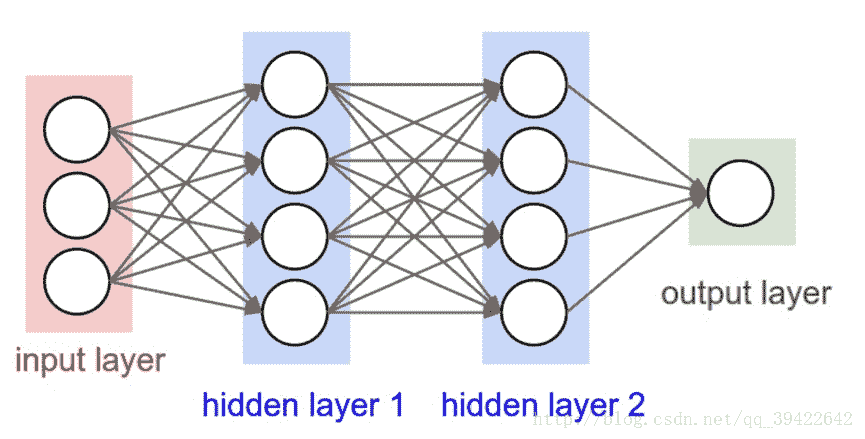

既然我们已经有了人工神经网络和卷积神经网络，为什么还要循环神经网络？ 
原因很简单，无论是卷积神经网络，还是人工神经网络，他们的前提假设都是: 元素之间是相互独立的，**输入与输出也是独立的**，比如猫和狗。 
但现实世界中，很多元素都是相互连接的，比如股票随时间的变化，一个人说了: 我喜欢旅游，其中最喜欢的地方是云南，以后有机会一定要去___这里填空，人应该都知道是填“云南“。因为我们是根据上下文的内容推断出来的，但机会要做到这一步就相当得难了。因此，就有了现在的循环神经网络，他的本质是**: 像人一样拥有记忆的能力。**因此，他的输出就依赖于当前的输入和记忆。

## 2.RNN的网络结构及原理

它的网络结构如下:  
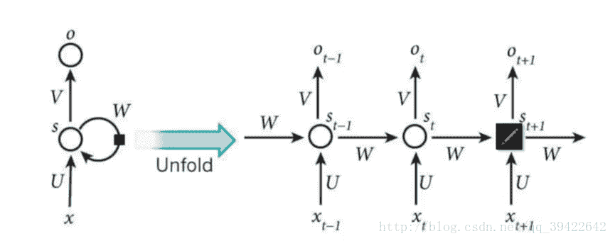
其中每个圆圈可以看作是一个单元，而且每个单元做的事情也是一样的，因此可以折叠呈左半图的样子。用一句话解释RNN，就是**一个单元结构重复使用**。

RNN是一个序列到序列的模型，假设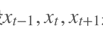是一个输入: “我是中国“，那么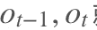就应该对应”是”，”中国”这两个，预测下一个词最有可能是什么？就是应该是”人”的概率比较大。

因此，我们可以做这样的定义: 

。因为我们当前时刻的输出是由记忆和当前时刻的输入决定的，就像你现在大四，你的知识是由大四学到的知识（当前输入）和大三以及大三以前学到的东西的（记忆）的结合，RNN在这点上也类似，神经网络最擅长做的就是通过一系列参数把很多内容整合到一起，然后学习这个参数，因此就定义了RNN的基础: 

大家可能会很好奇，为什么还要加一个f()函数，其实这个函数是神经网络中的激活函数，但为什么要加上它呢？ 
举个例子，假如你在大学学了非常好的解题方法，那你初中那时候的解题方法还要用吗？显然是不用了的。RNN的想法也一样，既然我能记忆了，那我当然是只记重要的信息啦，其他不重要的，就肯定会忘记，是吧。但是在神经网络中什么最适合过滤信息呀？肯定是激活函数嘛，因此在这里就套用一个激活函数，来做一个非线性映射，来过滤信息，这个激活函数可能为tanh，也可为其他。

假设你大四快毕业了，要参加考研，请问你参加考研是不是先记住你学过的内容然后去考研，还是直接带几本书去参加考研呢？很显然嘛，那RNN的想法就是预测的时候带着当前时刻的记忆
去预测。假如你要预测“我是中国“的下一个词出现的概率，这里已经很显然了，运用softmax来预测每个词出现的概率再合适不过了，但预测不能直接带用一个矩阵来预测呀，所有预测的时候还要带一个权重矩阵V,用公式表示为:

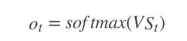

其中就表示时刻t的输出。

RNN中的结构细节:  
1.可以把St当作隐状态，捕捉了之前时间点上的信息。就像你去考研一样，考的时候记住了你能记住的所有信息。 
2.Ot是由当前时间以及之前所有的记忆得到的。就是你考研之后做的考试卷子，是用你的记忆得到的。 
3.很可惜的是，St并不能捕捉之前所有时间点的信息。就像你考研不能记住所有的英语单词一样。 
4.和卷积神经网络一样，这里的网络中每个cell都共享了一组参数（U，V，W）,这样就能极大的降低计算量了。 
5.Ot在很多情况下都是不存在的，因为很多任务，比如文本情感分析，都是只关注最后的结果的。就像考研之后选择学校，学校不会管你到底怎么努力，怎么心酸的准备考研，而只关注你最后考了多少分。

## 3.RNN的改进1: 双向RNN

在有些情况，比如有一部电视剧，在第三集的时候才出现的人物，现在让预测一下在第三集中出现的人物名字，你用前面两集的内容是预测不出来的，所以你需要用到第四，第五集的内容来预测第三集的内容，这就是双向RNN的想法。如图是双向RNN的图解:  
 

这里的做的是一个拼接，如果他们都是1000x1维的，拼接在一起就是1000x2维的了。

双向RNN需要的内存是单向RNN的两倍，因为在同一时间点，双向RNN需要保存两个方向上的权重参数，在分类的时候，需要同时输入两个隐藏层输出的信息。

## 4.RNN的改进2: 深层双向RNN

深层双向RNN 与双向RNN相比，多了几个隐藏层，因为他的想法是很多信息记一次记不下来，比如你去考研，复习考研英语的时候，背英语单词一定不会就看一次就记住了所有要考的考研单词吧，你应该也是带着先前几次背过的单词，然后选择那些背过，但不熟的内容，或者没背过的单词来背吧。

深层双向RNN就是基于这么一个想法，他的输入有两方面，第一就是前一时刻的隐藏层传过来的信息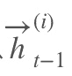，和当前时刻上一隐藏层传过来的信息，包括前向和后向的。 
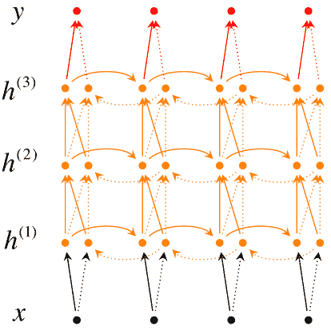

我们用公式来表示是这样的: 
 
然后再利用最后一层来进行分类，分类公式如下:  
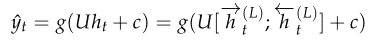

### 4.1 Pyramidal RNN

其他类似的网络还有Pyramidal RNN:  
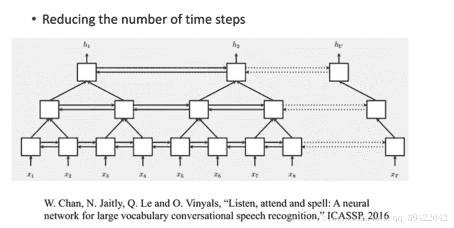
我们现在有一个很长的输入序列，可以看到这是一个双向的RNN，上图是谷歌的W.Chan做的一个测试，它原先要做的是语音识别，他要用序列到序列的模型做语音识别，序列到序列就是说，输入一个序列然后就输出一个序列。

由图我们发现，上一层的两个输出，作为当前层的输入，如果是非常长的序列的话，这样做的话，每一层的序列都比上一层要短，但当前层的输入f(x)也会随之增多，貌似看一起相互抵消，运算量并没有什么改进。

但我们知道，对于一层来说，它是从前往后转的，比如要预测一个股市的变化，以天为单位，假如要预测明天的股市变化，你就要用今天，以及今天之前的所有数据，我们暂时无法只用昨天的数据，不用今天的数据，预测明天的数据，也即是说，预测必须具有连续性。 
但每一层的f运算是可以并行的，从这个角度来看，运算量还是可以接受的，特别是在原始输入序列较短的时候还是有优势的。

## 5.RNN的训练-BPTT

如前面我们讲的，如果要预测t时刻的输出，我们必须先利用上一时刻（t-1）的记忆和当前时刻的输入，得到t时刻的记忆: 

然后利用当前时刻的记忆，通过softmax分类器输出每个词出现的概率: 

为了找出模型最好的参数，U，W，V，我们就要知道当前参数得到的结果怎么样，因此就要定义我们的损失函数，用交叉熵损失函数: 

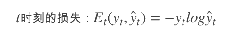

其中
 t时刻的标准答案，是一个只有一个是1，其他都是0的向量； 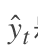是我们预测出来的结果，与
的维度一样，但它是一个概率向量，里面是每个词出现的概率。因为对结果的影响，肯定不止一个时刻，因此需要把所有时刻的造成的损失都加起来: 

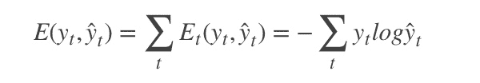

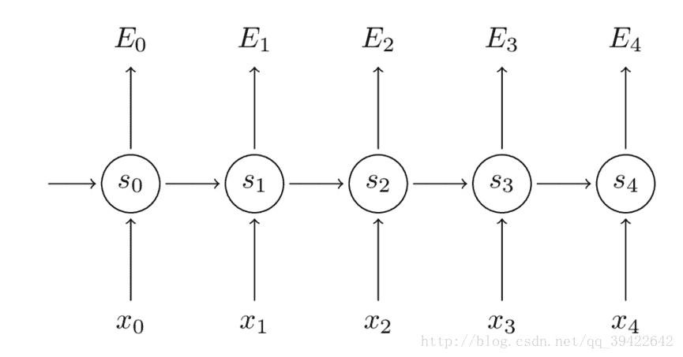

如图所示，你会发现每个cell都会有一个损失，我们已经定义好了损失函数，接下来就是熟悉的一步了，那就是根据损失函数利用SGD来求解最优参数，在CNN中使用反向传播BP算法来求解最优参数，但在RNN就要用到BPTT，它和BP算法的本质区别，也是CNN和RNN的本质区别: CNN没有记忆功能，它的输出仅依赖与输入，但RNN有记忆功能，它的输出不仅依赖与当前输入，还依赖与当前的记忆。这个记忆是序列到序列的，也就是当前时刻收到上一时刻的影响，比如股市的变化。

因此，在对参数求偏导的时候，对当前时刻求偏导，一定会涉及前一时刻，我们用例子看一下: 

假设我们对E3的W求偏导: 它的损失首先来源于预测的输出
，预测的输出又是来源于当前时刻的记忆s3,当前的记忆又是来源于当前的输出和截止到上一时刻的记忆: 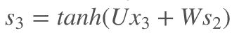
因此，根据链式法则可以有:
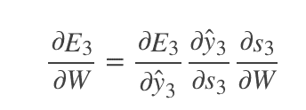

但是，你会发现，
，也就是s2里面的函数还包含了W，因此，这个链式法则还没到底，就像图上画的那样，所以真正的链式法则是这样的:  
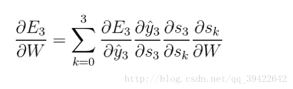 
我们要把当前时刻造成的损失，和以往每个时刻造成的损失加起来，因为我们每一个时刻都用到了权重参数W。和以往的网络不同，一般的网络，比如人工神经网络，参数是不同享的，但在循环神经网络，和CNN一样，设立了参数共享机制，来降低模型的计算量。

## 6.RNN与CNN的结合应用: 看图说话

在图像处理中，目前做的最好的是CNN，而自然语言处理中，表现比较好的是RNN，因此，我们能否把他们结合起来，一起用呢？那就是看图说话了，这个原理也比较简单，举个小栗子: 假设我们有CNN的模型训练了一个网络结构，比如是这个

最后我们不是要分类嘛，那在分类前，是不是已经拿到了图像的特征呀，那我们能不能把图像的特征拿出来，放到RNN的输入里，让他学习呢？

之前的RNN是这样的: 

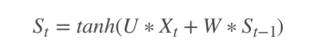

我们把图像的特征加在里面，可以得到: 

其中的X就是图像的特征。如果用的是上面的CNN网络，X应该是一个4096X1的向量。

注: 这个公式只在第一步做，后面每次更新就没有V了，因为给RNN数据只在第一次迭代的时候给。

## 7.RNN项目练手

RNN可以写歌词，写诗等，这有个项目可以玩玩，还不错。 
[Tensorflow实现RNN](https://github.com/hzy46/Char-RNN-TensorFlow)
