# LSTM原理

# 长短期记忆网络（Long Short-Term Memory，LSTM）及其变体双向LSTM和GRU

**LSTM**（Long Short-Term Memory）长短期记忆网络，是一种时间递归神经网络，**适合于处理和预测时间序列中间隔和延迟相对较长的重要事件**。LSTM是解决循环神经网络RNN结构中存在的“梯度消失”问题而提出的，是一种特殊的循环神经网络。最常见的一个例子就是: 当我们要预测“the clouds are in the (...)"的时候, 这种情况下，相关的信息和预测的词位置之间的间隔很小，RNN会使用先前的信息预测出词是”sky“。但是如果想要预测”I grew up in France ... I speak fluent (...)”，语言模型推测下一个词可能是一种语言的名字，但是具体是什么语言，需要用到间隔很长的前文中France，在这种情况下，RNN因为“梯度消失”的问题，并不能利用间隔很长的信息，然而，LSTM在设计上明确避免了长期依赖的问题，这主要归功于LSTM精心设计的“门”结构(输入门、遗忘门和输出门)消除或者增加信息到细胞状态的能力，使得LSTM能够记住长期的信息。

  vs     

标准的RNN结构都具有一种重复神经网络模块的链式形式，一般是一个tanh层进行重复的学习（如上图左边图），而在LSTM中（上图右边图），重复的模块中有四个特殊的结构。**贯穿在图上方的水平线为细胞状态（cell），黄色的矩阵是学习得到的神经网络层，粉色的圆圈表示运算操作，黑色的箭头表示向量的传输**，整体看来，不仅仅是h在随着时间流动，细胞状态c也在随着时间流动，细胞状态c代表着长期记忆。

上面我们提到LSTM之所以能够记住长期的信息，在于设计的“门”结构，“门”结构是一种让信息选择式通过的方法，包括一个sigmoid神经网络层和一个pointwise乘法操作，如下图所示结构。复习一下sigmoid函数，，sigmoid输出为0到1之间的数组，一般用在二分类问题，输出值接近0代表“不允许通过”，趋向1代表“允许通过”。

**在LSTM中，第一阶段是遗忘门，遗忘层决定哪些信息需要从细胞状态中被遗忘，下一阶段是输入门，输入门确定哪些新信息能够被存放到细胞状态中，最后一个阶段是输出门，输出门确定输出什么值**。下面我们把LSTM就着各个门的子结构和数学表达式进行分析。

* 遗忘门: 遗忘门是以上一层的输出和本层要输入的序列数据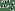作为输入，通过一个激活函数sigmoid，得到输出为。的输出取值在[0,1]区间，表示上一层细胞状态被遗忘的概率，1是“完全保留”，0是“完全舍弃”

* 输入门: 输入门包含两个部分，第一部分使用sigmoid激活函数，输出为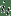，第二部分使用tanh激活函数，输出为。**【个人通俗理解: 在RNN网络中就是本层的输出，是在[0,1]区间取值，表示中的信息被保留的程度，表示该层被保留的新信息】**

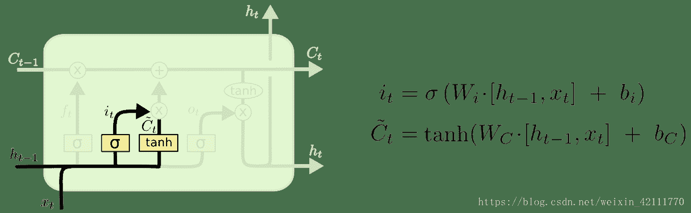

到目前为止，是遗忘门的输出，控制着上一层细胞状态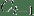被遗忘的程度，为输入门的两个输出乘法运算，表示有多少新信息被保留，基于此，我们就可以把新信息更新这一层的细胞状态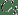。

* 输出门: 输出门用来控制该层的细胞状态有多少被过滤。首先使用sigmoid激活函数得到一个[0,1]区间取值的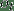，接着将细胞状态通过tanh激活函数处理后与相乘，即是本层的输出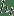。

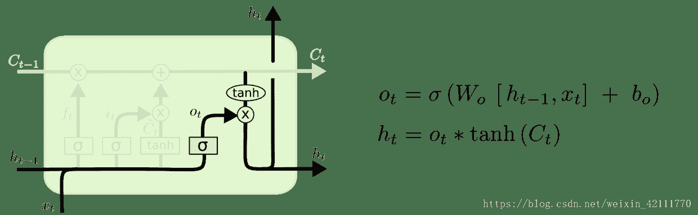

至此，终于将LSTM的结构理解了，现在有很多LSTM结构的变形，只要把这个母体结构理解了，再去理解变形的结构应该不会再有多麻烦了。

**双向LSTM**

双向RNN由两个普通的RNN所组成，一个正向的RNN，利用过去的信息，一个逆序的RNN，利用未来的信息，这样在时刻t，既能够使用t-1时刻的信息，又能够利用到t+1时刻的信息。一般来说，由于双向LSTM能够同时利用过去时刻和未来时刻的信息，会比单向LSTM最终的预测更加准确。下图为双向LSTM的结构。

* 为正向的RNN，参与正向计算，t时刻的输入为t时刻的序列数据和t-1时刻的输出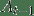
* 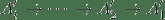为逆向的RNN，参与反向计算，t时刻的输入为t时刻的序列数据和t+1时刻的输出
* t时刻的最终输出值取决于和

**GRU（Gated Recurrent Unit）**是LSTM最流行的一个变体，比LSTM模型要简单

GRU包括两个门，一个重置门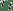和更新门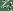。这两个门的激活函数为sigmoid函数，在[0,1]区间取值。

候选隐含状态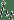使用重置门来控制t-1时刻信息的输入，如果结果为0，那么上一个隐含状态的输出信息将被丢弃。也就是说，**重置门决定过去有多少信息被遗忘，有助于捕捉时序数据中短期的依赖关系**。

隐含状态使用更新门对上一时刻隐含状态和候选隐含状态进行更新。更新门控制过去的隐含状态在当前时刻的重要性，**如果更新门一直趋近于1，t时刻之前的隐含状态将一直保存下来并全传递到t时刻，****更新门有助于捕捉时序数据中中长期的依赖关系**。
