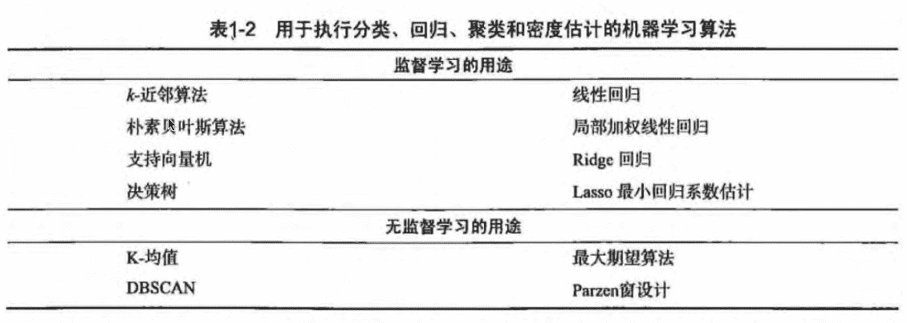
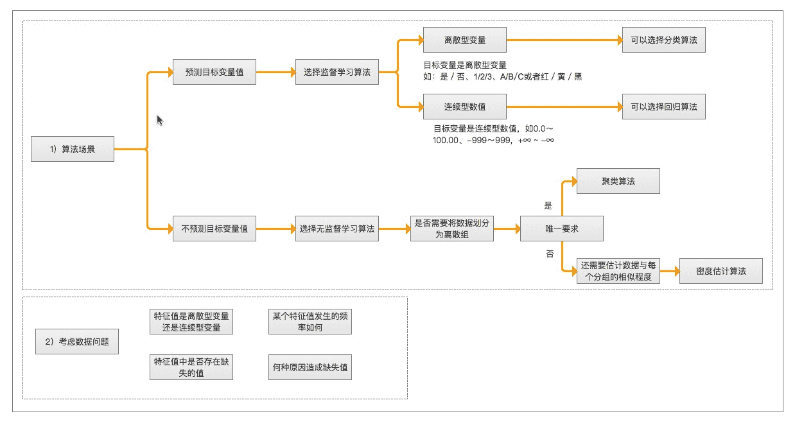
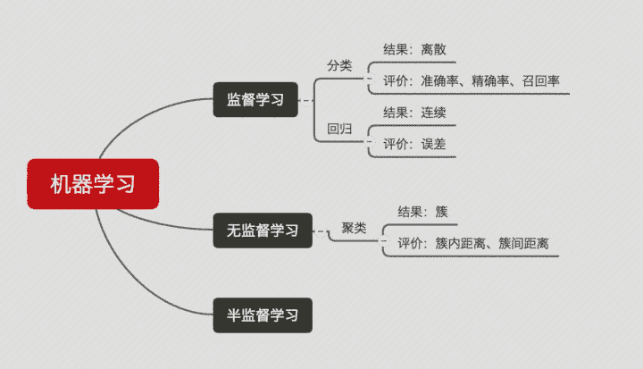
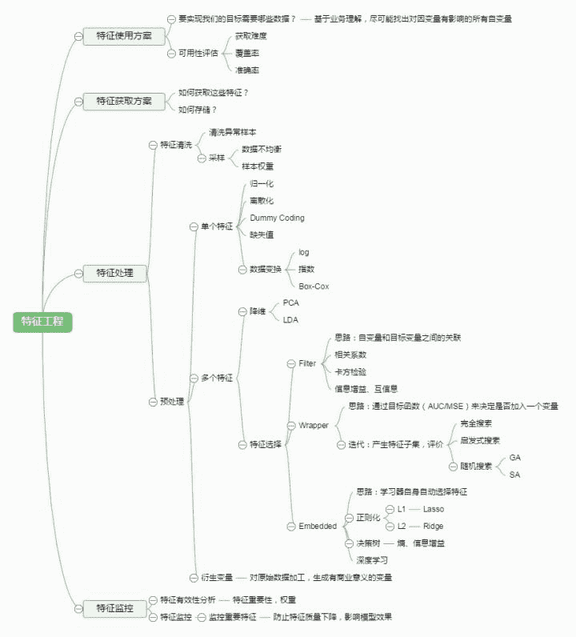

# 第1章 机器学习基础

## 机器学习 概述

`机器学习(Machine Learning,ML)` 是使用计算机来彰显数据背后的真实含义，它为了把无序的数据转换成有用的信息。是一门多领域交叉学科，涉及概率论、统计学、逼近论、凸分析、算法复杂度理论等多门学科。专门研究计算机怎样模拟或实现人类的学习行为，以获取新的知识或技能，重新组织已有的知识结构使之不断改善自身的性能。
它是人工智能的核心，是使计算机具有智能的根本途径，其应用遍及人工智能的各个领域，它主要使用归纳、综合而不是演绎。

1. 海量的数据
2. 获取有用的信息

## 机器学习 研究意义

机器学习是一门人工智能的科学，该领域的主要研究对象是人工智能，特别是如何在经验学习中改善具体算法的性能”。 “机器学习是对能通过经验自动改进的计算机算法的研究”。 “机器学习是用数据或以往的经验，以此优化计算机程序的性能标准。” 一种经常引用的英文定义是: A computer program is said to learn from experience E with respect to some class of tasks T and performance measure P, if its performance at tasks in T, as measured by P, improves with experience E.

机器学习已经有了十分广泛的应用，例如: 数据挖掘、计算机视觉、自然语言处理、生物特征识别、搜索引擎、医学诊断、检测信用卡欺诈、证券市场分析、DNA序列测序、语音和手写识别、战略游戏和机器人运用。
## 机器学习 场景

* 例如: 识别动物猫
   * 模式识别（官方标准）: 人们通过大量的经验，得到结论，从而判断它就是猫。
   * 机器学习（数据学习）: 人们通过阅读进行学习，观察它会叫、小眼睛、两只耳朵、四条腿、一条尾巴，得到结论，从而判断它就是猫。
   * 深度学习（深入数据）: 人们通过深入了解它，发现它会'喵喵'的叫、与同类的猫科动物很类似，得到结论，从而判断它就是猫。（深度学习常用领域: 语音识别、图像识别）

* 模式识别（pattern recognition）: 模式识别是最古老的（作为一个术语而言，可以说是很过时的）。
    * 我们把环境与客体统称为“模式”，识别是对模式的一种认知，是如何让一个计算机程序去做一些看起来很“智能”的事情。
    * 通过融于智慧和直觉后，通过构建程序，识别一些事物，而不是人，例如: 识别数字。
* 机器学习（machine learning）: 机器学习是最基础的（当下初创公司和研究实验室的热点领域之一）。
    * 在90年代初，人们开始意识到一种可以更有效地构建模式识别算法的方法，那就是用数据（可以通过廉价劳动力采集获得）去替换专家（具有很多图像方面知识的人）。
    * “机器学习”强调的是，在给计算机程序（或者机器）输入一些数据后，它必须做一些事情，那就是学习这些数据，而这个学习的步骤是明确的。
    * 机器学习（Machine Learning）是一门专门研究计算机怎样模拟或实现人类的学习行为，以获取新的知识或技能，重新组织已有的知识结构使之不断改善自身性能的学科。
* 深度学习（deep learning）: 深度学习是非常崭新和有影响力的前沿领域，我们甚至不会去思考-后深度学习时代。
    * 深度学习是机器学习研究中的一个新的领域，其动机在于建立、模拟人脑进行分析学习的神经网络，它模仿人脑的机制来解释数据，例如图像，声音和文本。

* 参考地址:  
    * [深度学习 vs 机器学习 vs 模式识别](http://www.csdn.net/article/2015-03-24/2824301)
    * [深度学习 百科资料](http://baike.baidu.com/link?url=76P-uA4EBrC3G-I__P1tqeO7eoDS709Kp4wYuHxc7GNkz_xn0NxuAtEohbpey7LUa2zUQLJxvIKUx4bnrEfOmsWLKbDmvG1PCoRkJisMTQka6-QReTrIxdYY3v93f55q)

> 机器学习已应用于多个领域，远远超出大多数人的想象，横跨: 计算机科学、工程技术和统计学等多个学科。

* 搜索引擎: 根据你的搜索点击，优化你下次的搜索结果,是机器学习来帮助搜索引擎判断哪个结果更适合你（也判断哪个广告更适合你）。
* 垃圾邮件: 会自动的过滤垃圾广告邮件到垃圾箱内。
* 超市优惠券: 你会发现，你在购买小孩子尿布的时候，售货员会赠送你一张优惠券可以兑换6罐啤酒。
* 邮局邮寄: 手写软件自动识别寄送贺卡的地址。
* 申请贷款: 通过你最近的金融活动信息进行综合评定，决定你是否合格。

## 机器学习 组成

### 主要任务

* 分类（classification）: 将实例数据划分到合适的类别中。
   * 应用实例: 判断网站是否被黑客入侵（二分类 ），手写数字的自动识别（多分类）
* 回归（regression）: 主要用于预测数值型数据。
   * 应用实例: 股票价格波动的预测，房屋价格的预测等。

### 监督学习（supervised learning）

* 必须确定目标变量的值，以便机器学习算法可以发现特征和目标变量之间的关系。在监督学习中，给定一组数据，我们知道正确的输出结果应该是什么样子，并且知道在输入和输出之间有着一个特定的关系。 (包括: 分类和回归)
* 样本集: 训练数据 + 测试数据
    * 训练样本 = 特征(feature) + 目标变量(label: 分类-离散值/回归-连续值)
    * 特征通常是训练样本集的列，它们是独立测量得到的。
    * 目标变量: 目标变量是机器学习预测算法的测试结果。
        * 在分类算法中目标变量的类型通常是标称型(如: 真与假)，而在回归算法中通常是连续型(如: 1~100)。
* 监督学习需要注意的问题: 
    * 偏置方差权衡
    * 功能的复杂性和数量的训练数据
    * 输入空间的维数
    * 噪声中的输出值
* `知识表示`: 
    * 可以采用规则集的形式【例如: 数学成绩大于90分为优秀】
    * 可以采用概率分布的形式【例如: 通过统计分布发现，90%的同学数学成绩，在70分以下，那么大于70分定为优秀】
    * 可以使用训练样本集中的一个实例【例如: 通过样本集合，我们训练出一个模型实例，得出 年轻，数学成绩中高等，谈吐优雅，我们认为是优秀】

### 非监督学习（unsupervised learning）

* 在机器学习，无监督学习的问题是，在未加标签的数据中，试图找到隐藏的结构。因为提供给学习者的实例是未标记的，因此没有错误或报酬信号来评估潜在的解决方案。
* 无监督学习是密切相关的统计数据密度估计的问题。然而无监督学习还包括寻求，总结和解释数据的主要特点等诸多技术。在无监督学习使用的许多方法是基于用于处理数据的数据挖掘方法。
* 数据没有类别信息，也不会给定目标值。
* 非监督学习包括的类型: 
  * 聚类: 在无监督学习中，将数据集分成由类似的对象组成多个类的过程称为聚类。
  * 密度估计: 通过样本分布的紧密程度，来估计与分组的相似性。
  * 此外，无监督学习还可以减少数据特征的维度，以便我们可以使用二维或三维图形更加直观地展示数据信息。
### 强化学习
这个算法可以训练程序做出某一决定。程序在某一情况下尝试所有的可能行动，记录不同行动的结果并试着找出最好的一次尝试来做决定。 属于这一类算法的有马尔可夫决策过程。
### 训练过程

### 算法汇总

## 机器学习 使用

> 选择算法需要考虑的两个问题

1. 算法场景
    * 预测明天是否下雨，因为可以用历史的天气情况做预测，所以选择监督学习算法
    * 给一群陌生的人进行分组，但是我们并没有这些人的类别信息，所以选择无监督学习算法、通过他们身高、体重等特征进行处理。
2. 需要收集或分析的数据是什么

> 举例

> 机器学习 开发流程

1. 收集数据: 收集样本数据
2. 准备数据: 注意数据的格式
3. 分析数据: 为了确保数据集中没有垃圾数据；
    * 如果是算法可以处理的数据格式或可信任的数据源，则可以跳过该步骤；
    * 另外该步骤需要人工干预，会降低自动化系统的价值。
4. 训练算法: [机器学习算法核心]如果使用无监督学习算法，由于不存在目标变量值，则可以跳过该步骤
5. 测试算法: [机器学习算法核心]评估算法效果
6. 使用算法: 将机器学习算法转为应用程序

## 机器学习 数学基础
* 微积分
* 统计学/概率论
* 线性代数
## 机器学习 工具

### Python语言 

1. 可执行伪代码
2. Python比较流行: 使用广泛、代码范例多、丰富模块库，开发周期短
3. Python语言的特色: 清晰简练、易于理解
4. Python语言的缺点: 唯一不足的是性能问题
5. Python相关的库
    * 科学函数库: `SciPy`、`NumPy`(底层语言: C和Fortran)
    * 绘图工具库: `Matplotlib`
    * 数据分析库 `Pandas`
### 数学工具
* Matlab
## 附: 机器学习专业术语
* 模型（model）: 计算机层面的认知
* 学习算法（learning algorithm），从数据中产生模型的方法
* 数据集（data set）: 一组记录的合集
* 示例（instance）: 对于某个对象的描述
* 样本（sample）: 也叫示例
* 属性（attribute）: 对象的某方面表现或特征
* 特征（feature）: 同属性
* 属性值（attribute value）: 属性上的取值
* 属性空间（attribute space）: 属性张成的空间
* 样本空间/输入空间（samplespace）: 同属性空间
* 特征向量（feature vector）: 在属性空间里每个点对应一个坐标向量，把一个示例称作特征向量
* 维数（dimensionality）: 描述样本参数的个数（也就是空间是几维的）
* 学习（learning）/训练（training）: 从数据中学得模型
* 训练数据（training data）: 训练过程中用到的数据
* 训练样本（training sample）:训练用到的每个样本
* 训练集（training set）: 训练样本组成的集合
* 假设（hypothesis）: 学习模型对应了关于数据的某种潜在规则
* 真相（ground-truth）:真正存在的潜在规律
* 学习器（learner）: 模型的另一种叫法，把学习算法在给定数据和参数空间的实例化
* 预测（prediction）: 判断一个东西的属性
* 标记（label）: 关于示例的结果信息，比如我是一个“好人”。
* 样例（example）: 拥有标记的示例
* 标记空间/输出空间（label space）: 所有标记的集合
* 分类（classification）: 预测是离散值，比如把人分为好人和坏人之类的学习任务
* 回归（regression）: 预测值是连续值，比如你的好人程度达到了0.9，0.6之类的
* 二分类（binary classification）: 只涉及两个类别的分类任务
* 正类（positive class）: 二分类里的一个
* 反类（negative class）: 二分类里的另外一个
* 多分类（multi-class classification）: 涉及多个类别的分类
* 测试（testing）: 学习到模型之后对样本进行预测的过程
* 测试样本（testing sample）: 被预测的样本
* 聚类（clustering）: 把训练集中的对象分为若干组
* 簇（cluster）: 每一个组叫簇
* 监督学习（supervised learning）: 典范--分类和回归
* 无监督学习（unsupervised learning）: 典范--聚类
* 未见示例（unseen instance）: “新样本“，没训练过的样本
* 泛化（generalization）能力: 学得的模型适用于新样本的能力
* 分布（distribution）: 样本空间的全体样本服从的一种规律
* 独立同分布（independent and identically distributed，简称i,i,d.）:获得的每个样本都是独立地从这个分布上采样获得的。

## 机器学习基础补充

### 数据集的划分

 * 训练集（Training set） —— 学习样本数据集，通过匹配一些参数来建立一个模型，主要用来训练模型。类比考研前做的解题大全。
 * 验证集（validation set） —— 对学习出来的模型，调整模型的参数，如在神经网络中选择隐藏单元数。验证集还用来确定网络结构或者控制模型复杂程度的参数。类比 考研之前做的模拟考试。
 * 测试集（Test set） —— 测试训练好的模型的分辨能力。类比 考研。这次真的是一考定终身。

### 模型拟合程度

 * 欠拟合（Underfitting）: 模型没有很好地捕捉到数据特征，不能够很好地拟合数据，对训练样本的一般性质尚未学好。类比，光看书不做题觉得自己什么都会了，上了考场才知道自己啥都不会。
 * 过拟合（Overfitting）: 模型把训练样本学习“太好了”，可能把一些训练样本自身的特性当做了所有潜在样本都有的一般性质，导致泛化能力下降。类比，做课后题全都做对了，超纲题也都认为是考试必考题目，上了考场还是啥都不会。 

通俗来说，欠拟合和过拟合都可以用一句话来说，欠拟合就是: “你太天真了！”，过拟合就是: “你想太多了！”。

### 常见的模型指标

 * 正确率 —— 提取出的正确信息条数 / 提取出的信息条数
 * 召回率 —— 提取出的正确信息条数 / 样本中的信息条数
 * F 值 —— 正确率 * 召回率 * 2 / （正确率 + 召回率）（F值即为正确率和召回率的调和平均值）

举个例子如下: 

举个例子如下: 
某池塘有 1400 条鲤鱼，300 只虾，300 只乌龟。现在以捕鲤鱼为目的。撒了一张网，逮住了 700 条鲤鱼，200 只
虾， 100 只乌龟。那么这些指标分别如下: 
正确率 = 700 / (700 + 200 + 100) = 70%
召回率 = 700 / 1400 = 50%
F 值 = 70% * 50% * 2 / (70% + 50%) = 58.3%

### 模型

 * 分类问题 —— 说白了就是将一些未知类别的数据分到现在已知的类别中去。比如，根据你的一些信息，判断你是高富帅，还是穷屌丝。评判分类效果好坏的三个指标就是上面介绍的三个指标: 正确率，召回率，F值。
 * 回归问题 —— 对数值型连续随机变量进行预测和建模的监督学习算法。回归往往会通过计算 误差（Error）来确定模型的精确性。
 * 聚类问题 —— 聚类是一种无监督学习任务，该算法基于数据的内部结构寻找观察样本的自然族群（即集群）。聚类问题的标准一般基于距离: 簇内距离（Intra-cluster Distance） 和 簇间距离（Inter-cluster Distance） 。簇内距离是越小越好，也就是簇内的元素越相似越好；而簇间距离越大越好，也就是说簇间（不同簇）元素越不相同越好。一般的，衡量聚类问题会给出一个结合簇内距离和簇间距离的公式。

下面这个图可以比较直观地展示出来: 

### 特征工程的一些小东西

 * 特征选择 —— 也叫特征子集选择（FSS，Feature Subset Selection）。是指从已有的 M 个特征（Feature）中选择 N 个特征使得系统的特定指标最优化，是从原始特征中选择出一些最有效特征以降低数据集维度的过程，是提高算法性能的一个重要手段，也是模式识别中关键的数据预处理步骤。

 * 特征提取 —— 特征提取是计算机视觉和图像处理中的一个概念。它指的是使用计算机提取图像信息，决定每个图像的点是否属于一个图像特征。特征提取的结果是把图像上的点分为不同的子集，这些子集往往属于孤立的点，连续的曲线或者连续的区域。

下面给出一个特征工程的图: 

### 其他

 * Learning rate —— 学习率，通俗地理解，可以理解为步长，步子大了，很容易错过最佳结果。就是本来目标尽在咫尺，可是因为我迈的步子很大，却一下子走过了。步子小了呢，就是同样的距离，我却要走很多很多步，这样导致训练的耗时费力还不讨好。
 * 一个总结的知识点很棒的链接 : https://zhuanlan.zhihu.com/p/25197792

* * *

* **作者: [片刻](http://cwiki.apachecn.org/display/~jiangzhonglian) [1988](http://cwiki.apachecn.org/display/~lihuisong)**
* [GitHub地址](https://github.com/apachecn/AiLearning): <https://github.com/apachecn/AiLearning>
* **版权声明: 欢迎转载学习 => 请标注信息来源于 [ApacheCN](http://www.apachecn.org/)**
