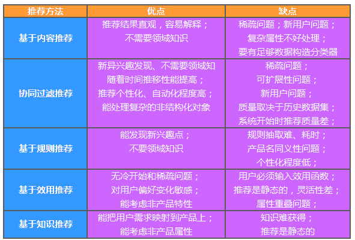

# 第16章 推荐系统

## 背景与挖掘目标

随着互联网的快速发展，用户很难快速从海量信息中寻找到自己感兴趣的信息。因此诞生了: 搜索引擎+推荐系统

本章节-推荐系统: 

1. 帮助用户发现其感兴趣和可能感兴趣的信息。
2. 让网站价值信息脱颖而出，得到广大用户的认可。
3. 提高用户对网站的忠诚度和关注度，建立稳固用户群体。

## 分析方法与过程

本案例的目标是对用户进行推荐，即以一定的方式将用户与物品（本次指网页）之间建立联系。

由于用户访问网站的数据记录很多，如果不对数据进行分类处理，对所有的记录直接采用推荐系统进行推荐，这样会存在一下问题。

1. 数据量太大意味着物品数与用户数很多，在模型构建用户与物品稀疏矩阵时，出现设备内存空间不够的情况，并且模型计算需要消耗大量的时间。
2. 用户区别很大，不同的用户关注的信息不一样，因此，即使能够得到推荐结果，其效果也会不好。

为了避免出现上述问题，需要进行分类处理与分析。

正常的情况下，需要对用户的兴趣爱好以及需求进行分类。
因为在用户访问记录中，没有记录用户访问页面时间的长短，因此不容易判断用户兴趣爱好。
因此，本文根据用户浏览的网页信息进行分析处理，主要采用以下方法处理: 以用户浏览网页的类型进行分类，然后对每个类型中的内容进行推荐。

分析过程如下: 

* 从系统中获取用户访问网站的原始记录。
* 对数据进行多维分析，包括用户访问内容，流失用户分析以及用户分类等分析。
* 对数据进行预处理，包含数据去重、数据变换和数据分类鞥处理过程。
* 以用户访问html后缀的页面为关键条件，对数据进行处理。
* 对比多种推荐算法进行推荐，通过模型评价，得到比较好的智能推荐模型。通过模型对样本数据进行预测，获得推荐结果。

## 主流推荐算法

| 推荐方法 | 描述 |
| --- | --- |
| 基于内容推荐  |   |
| 协同过滤推荐  |   |
| 基于规则推荐  |   |
| 基于效用推荐  |   |
| 基于知识推荐  |   |
| 组合推荐     |   |

### 基于知识推荐

基于知识的推荐（Knowledge-based Recommendation）在某种程度是可以看成是一种推理（Inference）技术，它不是建立在用户需要和偏好基础上推荐的。基于知识的方法因它们所用的功能知识不同而有明显区别。效用知识（Functional Knowledge）是一种关于一个项目如何满足某一特定用户的知识，因此能解释需要和推荐的关系，所以用户资料可以是任何能支持推理的知识结构，它可以是用户已经规范化的查询，也可以是一个更详细的用户需要的表示。

### 协同过滤推荐

* memory-based推荐
    * Item-based方法
    * User-based方法
    * Memory-based推荐方法通过执行最近邻搜索，把每一个Item或者User看成一个向量，计算其他所有Item或者User与它的相似度。有了Item或者User之间的两两相似度之后，就可以进行预测与推荐了。 
* model-based推荐
    * Model-based推荐最常见的方法为Matrix factorization.
    * 矩阵分解通过把原始的评分矩阵R分解为两个矩阵相乘，并且只考虑有评分的值，训练时不考虑missing项的值。R矩阵分解成为U与V两个矩阵后，评分矩阵R中missing的值就可以通过U矩阵中的某列和V矩阵的某行相乘得到
    * 矩阵分解的目标函数: U矩阵与V矩阵的可以通过梯度下降(gradient descent)算法求得，通过交替更新u与v多次迭代收敛之后可求出U与V。 
    * 矩阵分解背后的核心思想，找到两个矩阵，它们相乘之后得到的那个矩阵的值，与评分矩阵R中有值的位置中的值尽可能接近。这样一来，分解出来的两个矩阵相乘就尽可能还原了评分矩阵R，因为有值的地方，值都相差得尽可能地小，那么missing的值通过这样的方式计算得到，比较符合趋势。 
* 协同过滤中主要存在如下两个问题: 稀疏性与冷启动问题。已有的方案通常会通过引入多个不同的数据源或者辅助信息(Side information)来解决这些问题，用户的Side information可以是用户的基本个人信息、用户画像信息等，而Item的Side information可以是物品的content信息等。

## 效果评估

1. 召回率和准确率 【人为统计分析】
2. F值(P-R曲线) 【偏重: 非均衡问题】
3. ROC和AUC  【偏重: 不同结果的对比】

* * *

* **作者: [片刻](https://github.com/jiangzhonglian)**
* [GitHub地址](https://github.com/apachecn/AiLearning): <https://github.com/apachecn/AiLearning>
* **版权声明: 欢迎转载学习 => 请标注信息来源于 [ApacheCN](http://www.apachecn.org/)**

> 摘录的原文地址: 

* [推荐系统中常用算法 以及优点缺点对比](http://www.36dsj.com/archives/9519)
* [推荐算法的基于知识推荐](https://zhidao.baidu.com/question/2013524494179442228.html)
* [推荐系统中基于深度学习的混合协同过滤模型](http://www.iteye.com/news/32100)
