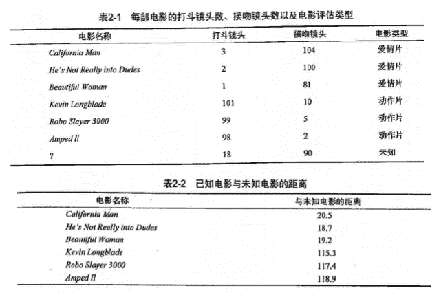
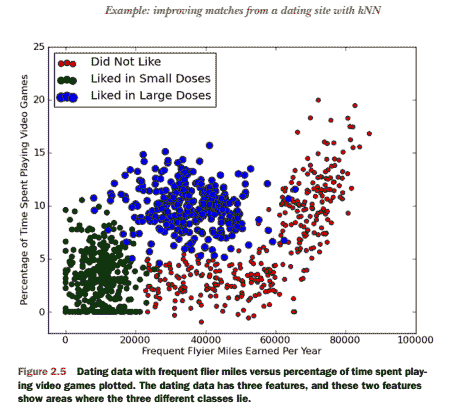
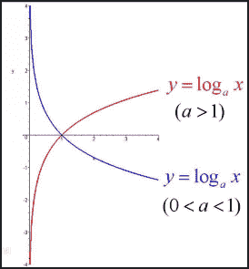
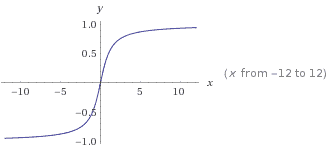
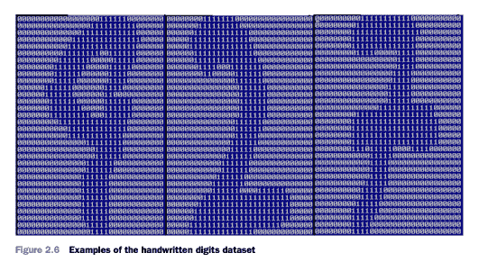

# 第2章 k-近邻算法
<script type="text/javascript" src="http://cdn.mathjax.org/mathjax/latest/MathJax.js?config=default"></script>


## KNN 概述

`k-近邻（kNN, k-NearestNeighbor）算法是一种基本分类与回归方法，我们这里只讨论分类问题中的 k-近邻算法。`

**一句话总结: 近朱者赤近墨者黑！** 

`k 近邻算法的输入为实例的特征向量，对应于特征空间的点；输出为实例的类别，可以取多类。k 近邻算法假设给定一个训练数据集，其中的实例类别已定。分类时，对新的实例，根据其 k 个最近邻的训练实例的类别，通过多数表决等方式进行预测。因此，k近邻算法不具有显式的学习过程。`

`k 近邻算法实际上利用训练数据集对特征向量空间进行划分，并作为其分类的“模型”。 k值的选择、距离度量以及分类决策规则是k近邻算法的三个基本要素。`

## KNN 场景

电影可以按照题材分类，那么如何区分 `动作片` 和 `爱情片` 呢？<br/>
1. 动作片: 打斗次数更多
2. 爱情片: 亲吻次数更多

基于电影中的亲吻、打斗出现的次数，使用 k-近邻算法构造程序，就可以自动划分电影的题材类型。



```
现在根据上面我们得到的样本集中所有电影与未知电影的距离，按照距离递增排序，可以找到 k 个距离最近的电影。
假定 k=3，则三个最靠近的电影依次是， He's Not Really into Dudes 、 Beautiful Woman 和 California Man。
knn 算法按照距离最近的三部电影的类型，决定未知电影的类型，而这三部电影全是爱情片，因此我们判定未知电影是爱情片。
```

## KNN 原理

> KNN 工作原理

1. 假设有一个带有标签的样本数据集（训练样本集），其中包含每条数据与所属分类的对应关系。
2. 输入没有标签的新数据后，将新数据的每个特征与样本集中数据对应的特征进行比较。
    1. 计算新数据与样本数据集中每条数据的距离。
    2. 对求得的所有距离进行排序（从小到大，越小表示越相似）。
    3. 取前 k （k 一般小于等于 20 ）个样本数据对应的分类标签。
3. 求 k 个数据中出现次数最多的分类标签作为新数据的分类。

> KNN 通俗理解

给定一个训练数据集，对新的输入实例，在训练数据集中找到与该实例最邻近的 k 个实例，这 k 个实例的多数属于某个类，就把该输入实例分为这个类。

> KNN 开发流程

```
收集数据: 任何方法
准备数据: 距离计算所需要的数值，最好是结构化的数据格式
分析数据: 任何方法
训练算法: 此步骤不适用于 k-近邻算法
测试算法: 计算错误率
使用算法: 输入样本数据和结构化的输出结果，然后运行 k-近邻算法判断输入数据分类属于哪个分类，最后对计算出的分类执行后续处理
```

> KNN 算法特点

```
优点: 精度高、对异常值不敏感、无数据输入假定
缺点: 计算复杂度高、空间复杂度高
适用数据范围: 数值型和标称型
```

## KNN 项目案例

### 项目案例1: 优化约会网站的配对效果

[完整代码地址](/src/py2.x/ml/2.KNN/kNN.py): <https://github.com/apachecn/AiLearning/blob/master/src/py2.x/ml/2.KNN/kNN.py>

#### 项目概述

海伦使用约会网站寻找约会对象。经过一段时间之后，她发现曾交往过三种类型的人:
* 不喜欢的人
* 魅力一般的人
* 极具魅力的人

她希望: 
1. 工作日与魅力一般的人约会
2. 周末与极具魅力的人约会
3. 不喜欢的人则直接排除掉

现在她收集到了一些约会网站未曾记录的数据信息，这更有助于匹配对象的归类。

#### 开发流程

```
收集数据: 提供文本文件
准备数据: 使用 Python 解析文本文件
分析数据: 使用 Matplotlib 画二维散点图
训练算法: 此步骤不适用于 k-近邻算法
测试算法: 使用海伦提供的部分数据作为测试样本。
        测试样本和非测试样本的区别在于: 
            测试样本是已经完成分类的数据，如果预测分类与实际类别不同，则标记为一个错误。
使用算法: 产生简单的命令行程序，然后海伦可以输入一些特征数据以判断对方是否为自己喜欢的类型。
```

> 收集数据: 提供文本文件

海伦把这些约会对象的数据存放在文本文件 [datingTestSet2.txt](/data/2.KNN/datingTestSet2.txt) 中，总共有 1000 行。海伦约会的对象主要包含以下 3 种特征: 

* 每年获得的飞行常客里程数
* 玩视频游戏所耗时间百分比
* 每周消费的冰淇淋公升数

文本文件数据格式如下: 
```
40920	8.326976	0.953952	3
14488	7.153469	1.673904	2
26052	1.441871	0.805124	1
75136	13.147394	0.428964	1
38344	1.669788	0.134296	1
```
> 准备数据: 使用 Python 解析文本文件

将文本记录转换为 NumPy 的解析程序
 
 ```python
def file2matrix(filename):
    """
    Desc:
        导入训练数据
    parameters:
        filename: 数据文件路径
    return: 
        数据矩阵 returnMat 和对应的类别 classLabelVector
    """
    fr = open(filename)
    # 获得文件中的数据行的行数
    numberOfLines = len(fr.readlines())
    # 生成对应的空矩阵
    # 例如: zeros(2，3)就是生成一个 2*3的矩阵，各个位置上全是 0 
    returnMat = zeros((numberOfLines, 3))  # prepare matrix to return
    classLabelVector = []  # prepare labels return
    fr = open(filename)
    index = 0
    for line in fr.readlines():
        # str.strip([chars]) --返回已移除字符串头尾指定字符所生成的新字符串
        line = line.strip()
        # 以 '\t' 切割字符串
        listFromLine = line.split('\t')
        # 每列的属性数据
        returnMat[index, :] = listFromLine[0:3]
        # 每列的类别数据，就是 label 标签数据
        classLabelVector.append(int(listFromLine[-1]))
        index += 1
    # 返回数据矩阵returnMat和对应的类别classLabelVector
    return returnMat, classLabelVector
```

> 分析数据: 使用 Matplotlib 画二维散点图

```python
import matplotlib
import matplotlib.pyplot as plt
fig = plt.figure()
ax = fig.add_subplot(111)
ax.scatter(datingDataMat[:, 0], datingDataMat[:, 1], 15.0*array(datingLabels), 15.0*array(datingLabels))
plt.show()
```

下图中采用矩阵的第一和第二列属性得到很好的展示效果，清晰地标识了三个不同的样本分类区域，具有不同爱好的人其类别区域也不同。



* 归一化数据 （归一化是一个让权重变为统一的过程，更多细节请参考:  https://www.zhihu.com/question/19951858 ）

| 序号 | 玩视频游戏所耗时间百分比 | 每年获得的飞行常客里程数  | 每周消费的冰淇淋公升数  | 样本分类 |
| ------------- |:-------------:| -----:| -----:| -----:|
| 1 | 0.8 | 400     | 0.5 | 1 |
| 2 | 12  | 134 000 | 0.9 | 3 |
| 3 | 0   | 20 000  | 1.1 | 2 |
| 4 | 67  | 32 000  | 0.1 | 2 |

样本3和样本4的距离: 
$$\sqrt{(0-67)^2 + (20000-32000)^2 + (1.1-0.1)^2 }$$

归一化特征值，消除特征之间量级不同导致的影响

**归一化定义: ** 我是这样认为的，归一化就是要把你需要处理的数据经过处理后（通过某种算法）限制在你需要的一定范围内。首先归一化是为了后面数据处理的方便，其次是保正程序运行时收敛加快。 方法有如下: 

1) 线性函数转换，表达式如下: 　　
    
    y=(x-MinValue)/(MaxValue-MinValue)　　

    说明: x、y分别为转换前、后的值，MaxValue、MinValue分别为样本的最大值和最小值。　　

2) 对数函数转换，表达式如下: 　　

    y=log10(x)　　

    说明: 以10为底的对数函数转换。

    如图: 
    
    

3) 反余切函数转换，表达式如下: 

    y=arctan(x)*2/PI　

    如图: 
    
    

4) 式(1)将输入值换算为[-1,1]区间的值，在输出层用式(2)换算回初始值，其中和分别表示训练样本集中负荷的最大值和最小值。　
    

在统计学中，归一化的具体作用是归纳统一样本的统计分布性。归一化在0-1之间是统计的概率分布，归一化在-1--+1之间是统计的坐标分布。


```python
def autoNorm(dataSet):
    """
    Desc:
        归一化特征值，消除特征之间量级不同导致的影响
    parameter:
        dataSet: 数据集
    return:
        归一化后的数据集 normDataSet. ranges和minVals即最小值与范围，并没有用到

    归一化公式: 
        Y = (X-Xmin)/(Xmax-Xmin)
        其中的 min 和 max 分别是数据集中的最小特征值和最大特征值。该函数可以自动将数字特征值转化为0到1的区间。
    """
    # 计算每种属性的最大值、最小值、范围
    minVals = dataSet.min(0)
    maxVals = dataSet.max(0)
    # 极差
    ranges = maxVals - minVals
    normDataSet = zeros(shape(dataSet))
    m = dataSet.shape[0]
    # 生成与最小值之差组成的矩阵
    normDataSet = dataSet - tile(minVals, (m, 1))
    # 将最小值之差除以范围组成矩阵
    normDataSet = normDataSet / tile(ranges, (m, 1))  # element wise divide
    return normDataSet, ranges, minVals
```

> 训练算法: 此步骤不适用于 k-近邻算法

因为测试数据每一次都要与全量的训练数据进行比较，所以这个过程是没有必要的。

kNN 算法伪代码: 

    对于每一个在数据集中的数据点: 
        计算目标的数据点（需要分类的数据点）与该数据点的距离
        将距离排序: 从小到大
        选取前K个最短距离
        选取这K个中最多的分类类别
        返回该类别来作为目标数据点的预测值
```python
def classify0(inX, dataSet, labels, k):
    dataSetSize = dataSet.shape[0]
    #距离度量 度量公式为欧氏距离
    diffMat = tile(inX, (dataSetSize,1)) – dataSet
    sqDiffMat = diffMat**2
    sqDistances = sqDiffMat.sum(axis=1)
    distances = sqDistances**0.5
    
    #将距离排序: 从小到大
    sortedDistIndicies = distances.argsort()
    #选取前K个最短距离， 选取这K个中最多的分类类别
    classCount={}
    for i in range(k): 
        voteIlabel = labels[sortedDistIndicies[i]]
        classCount[voteIlabel] = classCount.get(voteIlabel,0) + 1 
    sortedClassCount = sorted(classCount.iteritems(), key=operator.itemgetter(1), reverse=True)
    return sortedClassCount[0][0]
```


> 测试算法: 使用海伦提供的部分数据作为测试样本。如果预测分类与实际类别不同，则标记为一个错误。

kNN 分类器针对约会网站的测试代码

```python
def datingClassTest():
    """
    Desc:
        对约会网站的测试方法
    parameters:
        none
    return:
        错误数
    """
    # 设置测试数据的的一个比例（训练数据集比例=1-hoRatio）
    hoRatio = 0.1  # 测试范围,一部分测试一部分作为样本
    # 从文件中加载数据
    datingDataMat, datingLabels = file2matrix('data/2.KNN/datingTestSet2.txt')  # load data setfrom file
    # 归一化数据
    normMat, ranges, minVals = autoNorm(datingDataMat)
    # m 表示数据的行数，即矩阵的第一维
    m = normMat.shape[0]
    # 设置测试的样本数量， numTestVecs:m表示训练样本的数量
    numTestVecs = int(m * hoRatio)
    print 'numTestVecs=', numTestVecs
    errorCount = 0.0
    for i in range(numTestVecs):
        # 对数据测试
        classifierResult = classify0(normMat[i, :], normMat[numTestVecs:m, :], datingLabels[numTestVecs:m], 3)
        print "the classifier came back with: %d, the real answer is: %d" % (classifierResult, datingLabels[i])
        if (classifierResult != datingLabels[i]): errorCount += 1.0
    print "the total error rate is: %f" % (errorCount / float(numTestVecs))
    print errorCount
```

> 使用算法: 产生简单的命令行程序，然后海伦可以输入一些特征数据以判断对方是否为自己喜欢的类型。

约会网站预测函数

```python
def classifyPerson():
    resultList = ['not at all', 'in small doses', 'in large doses']
    percentTats = float(raw_input("percentage of time spent playing video games ?"))
    ffMiles = float(raw_input("frequent filer miles earned per year?"))
    iceCream = float(raw_input("liters of ice cream consumed per year?"))
    datingDataMat, datingLabels = file2matrix('datingTestSet2.txt')
    normMat, ranges, minVals = autoNorm(datingDataMat)
    inArr = array([ffMiles, percentTats, iceCream])
    classifierResult = classify0((inArr-minVals)/ranges,normMat,datingLabels, 3)
    print "You will probably like this person: ", resultList[classifierResult - 1]
```

实际运行效果如下: 

```python
>>> classifyPerson()
percentage of time spent playing video games?10
frequent flier miles earned per year?10000
liters of ice cream consumed per year?0.5
You will probably like this person: in small doses
```


### 项目案例2: 手写数字识别系统

[完整代码地址](/src/py2.x/ml/2.KNN/kNN.py): <https://github.com/apachecn/AiLearning/blob/master/src/py2.x/ml/2.KNN/kNN.py>

#### 项目概述

构造一个能识别数字 0 到 9 的基于 KNN 分类器的手写数字识别系统。

需要识别的数字是存储在文本文件中的具有相同的色彩和大小: 宽高是 32 像素 * 32 像素的黑白图像。

#### 开发流程

```
收集数据: 提供文本文件。
准备数据: 编写函数 img2vector(), 将图像格式转换为分类器使用的向量格式
分析数据: 在 Python 命令提示符中检查数据，确保它符合要求
训练算法: 此步骤不适用于 KNN
测试算法: 编写函数使用提供的部分数据集作为测试样本，测试样本与非测试样本的
         区别在于测试样本是已经完成分类的数据，如果预测分类与实际类别不同，
         则标记为一个错误
使用算法: 本例没有完成此步骤，若你感兴趣可以构建完整的应用程序，从图像中提取
         数字，并完成数字识别，美国的邮件分拣系统就是一个实际运行的类似系统
```

> 收集数据: 提供文本文件

目录 [trainingDigits](/data/2.KNN/trainingDigits) 中包含了大约 2000 个例子，每个例子内容如下图所示，每个数字大约有 200 个样本；目录 [testDigits](/data/2.KNN/testDigits) 中包含了大约 900 个测试数据。



> 准备数据: 编写函数 img2vector(), 将图像文本数据转换为分类器使用的向量

将图像文本数据转换为向量

```python
def img2vector(filename):
    returnVect = zeros((1,1024))
    fr = open(filename)
    for i in range(32):
        lineStr = fr.readline()
        for j in range(32):
            returnVect[0,32*i+j] = int(lineStr[j])
    return returnVect
```

> 分析数据: 在 Python 命令提示符中检查数据，确保它符合要求

在 Python 命令行中输入下列命令测试 img2vector 函数，然后与文本编辑器打开的文件进行比较: 

```python
>>> testVector = kNN.img2vector('testDigits/0_13.txt')
>>> testVector[0,0:32]
array([0., 0., 0., 0., 0., 0., 0., 0., 0., 0., 0., 0., 0., 0., 1., 1., 1., 1., 0., 0., 0., 0., 0., 0., 0., 0., 0., 0., 0., 0., 0.])
>>> testVector[0,32:64]
array([0., 0., 0., 0., 0., 0., 0., 0., 0., 0., 0., 0., 1., 1., 1., 1., 1., 1., 1., 0., 0., 0., 0., 0., 0., 0., 0., 0., 0., 0., 0.])
```

> 训练算法: 此步骤不适用于 KNN

因为测试数据每一次都要与全量的训练数据进行比较，所以这个过程是没有必要的。

> 测试算法: 编写函数使用提供的部分数据集作为测试样本，如果预测分类与实际类别不同，则标记为一个错误

```python
def handwritingClassTest():
    # 1. 导入训练数据
    hwLabels = []
    trainingFileList = listdir('data/2.KNN/trainingDigits')  # load the training set
    m = len(trainingFileList)
    trainingMat = zeros((m, 1024))
    # hwLabels存储0～9对应的index位置， trainingMat存放的每个位置对应的图片向量
    for i in range(m):
        fileNameStr = trainingFileList[i]
        fileStr = fileNameStr.split('.')[0]  # take off .txt
        classNumStr = int(fileStr.split('_')[0])
        hwLabels.append(classNumStr)
        # 将 32*32的矩阵->1*1024的矩阵
        trainingMat[i, :] = img2vector('data/2.KNN/trainingDigits/%s' % fileNameStr)

    # 2. 导入测试数据
    testFileList = listdir('data/2.KNN/testDigits')  # iterate through the test set
    errorCount = 0.0
    mTest = len(testFileList)
    for i in range(mTest):
        fileNameStr = testFileList[i]
        fileStr = fileNameStr.split('.')[0]  # take off .txt
        classNumStr = int(fileStr.split('_')[0])
        vectorUnderTest = img2vector('data/2.KNN/testDigits/%s' % fileNameStr)
        classifierResult = classify0(vectorUnderTest, trainingMat, hwLabels, 3)
        print "the classifier came back with: %d, the real answer is: %d" % (classifierResult, classNumStr)
        if (classifierResult != classNumStr): errorCount += 1.0
    print "\nthe total number of errors is: %d" % errorCount
    print "\nthe total error rate is: %f" % (errorCount / float(mTest))
```

> 使用算法: 本例没有完成此步骤，若你感兴趣可以构建完整的应用程序，从图像中提取数字，并完成数字识别，美国的邮件分拣系统就是一个实际运行的类似系统。

## KNN 小结

KNN 是什么？定义:  监督学习？ 非监督学习？

KNN 是一个简单的无显示学习过程，非泛化学习的监督学习模型。在分类和回归中均有应用。

### 基本原理

简单来说:  通过距离度量来计算查询点（query point）与每个训练数据点的距离，然后选出与查询点（query point）相近的K个最邻点（K nearest neighbors），使用分类决策来选出对应的标签来作为该查询点的标签。

### KNN 三要素
    
>K, K的取值

>>>>对查询点标签影响显著（效果拔群）。k值小的时候 近似误差小，估计误差大。 k值大 近似误差大，估计误差小。

>>>>如果选择较小的 k 值，就相当于用较小的邻域中的训练实例进行预测，“学习”的近似误差（approximation error）会减小，只有与输入实例较近的（相似的）训练实例才会对预测结果起作用。但缺点是“学习”的估计误差（estimation error）会增大，预测结果会对近邻的实例点非常敏感。如果邻近的实例点恰巧是噪声，预测就会出错。换句话说，k 值的减小就意味着整体模型变得复杂，容易发生过拟合。
        
>>>>如果选择较大的 k 值，就相当于用较大的邻域中的训练实例进行预测。其优点是可以减少学习的估计误差。但缺点是学习的近似误差会增大。这时与输入实例较远的（不相似的）训练实例也会对预测起作用，使预测发生错误。 k 值的增大就意味着整体的模型变得简单。
        
>>>>太大太小都不太好，可以用交叉验证（cross validation）来选取适合的k值。
    
>>>>近似误差和估计误差，请看这里: https://www.zhihu.com/question/60793482
        
>距离度量 Metric/Distance Measure 
        
>>>>距离度量 通常为 欧式距离（Euclidean distance），还可以是 Minkowski 距离 或者 曼哈顿距离。也可以是 地理空间中的一些距离公式。（更多细节可以参看 sklearn 中 valid_metric 部分）

>分类决策 （decision rule）

>>>>分类决策 在 分类问题中 通常为通过少数服从多数 来选取票数最多的标签，在回归问题中通常为 K个最邻点的标签的平均值。

### 算法: （sklearn 上有三种）
    
>Brute Force 暴力计算/线性扫描 
    
>KD Tree 使用二叉树根据数据维度来平分参数空间。
    
>Ball Tree 使用一系列的超球体来平分训练数据集。

>树结构的算法都有建树和查询两个过程。Brute Force 没有建树的过程。

>算法特点:    
        
>>>>优点:  High Accuracy， No Assumption on data， not sensitive to outliers
        
>>>>缺点: 时间和空间复杂度 高
        
>>>>适用范围:  continuous values and nominal values

>相似同源产物:  
        
>>>>radius neighbors 根据制定的半径来找寻邻点

>影响算法因素: 

>>>>N 数据集样本数量(number of samples)， D 数据维度 (number of features)

>总消耗: 

>>>>Brute Force:  O[DN^2] 
            
>>>>此处考虑的是最蠢的方法: 把所有训练的点之间的距离都算一遍。当然有更快的实现方式, 比如 O(ND + kN)  和  O(NDK) , 最快的是 O[DN] 。感兴趣的可以阅读这个链接:  [k-NN computational complexity](https://stats.stackexchange.com/questions/219655/k-nn-computational-complexity)
        
>>>>KD Tree: O[DN log(N)] 

>>>>Ball Tree: O[DN log(N)] 跟 KD Tree 处于相同的数量级，虽然建树时间会比 KD Tree 久一点，但是在高结构的数据，甚至是高纬度的数据中，查询速度有很大的提升。

>查询所需消耗:
        
>>>>Brute Force:  O[DN] 

>>>>KD Tree: 当维度比较小的时候， 比如 D<20,  O[Dlog(N)] 。相反，将会趋向于 O[DN] 

>>>>Ball Tree: O[Dlog(N)] 

>>>>当数据集比较小的时候，比如 N<30的时候，Brute Force 更有优势。

>Intrinsic Dimensionality(本征维数) 和 Sparsity（稀疏度）
        
>>>>数据的 intrinsic dimensionality 是指数据所在的流形的维数 d < D , 在参数空间可以是线性或非线性的。稀疏度指的是数据填充参数空间的程度(这与“稀疏”矩阵中使用的概念不同, 数据矩阵可能没有零项, 但是从这个意义上来讲,它的结构 仍然是 "稀疏" 的)。
        
>>>>Brute Force 的查询时间不受影响。
        
>>>>对于 KD Tree 和 Ball Tree的查询时间, 较小本征维数且更稀疏的数据集的查询时间更快。KD Tree 的改善由于通过坐标轴来平分参数空间的自身特性 没有Ball Tree 显著。
        
>k的取值 (k 个邻点)

>>>>Brute Force 的查询时间基本不受影响。
        
>>>>但是对于 KD Tree 和 Ball Tree , k越大，查询时间越慢。

>>>>k 在N的占比较大的时候，使用 Brute Force 比较好。

>Number of Query Points （查询点数量， 即测试数据的数量）
        
>>>>查询点较少的时候用Brute Force。查询点较多的时候可以使用树结构算法。

>关于 sklearn 中模型的一些额外干货: 

>>>>如果KD Tree，Ball Tree 和Brute Force 应用场景傻傻分不清楚，可以直接使用 含有algorithm='auto'的模组。 algorithm='auto' 自动为您选择最优算法。
>>>>有 regressor 和 classifier 可以来选择。
        
>>>>metric/distance measure 可以选择。 另外距离 可以通过weight 来加权。

>leaf size 对KD Tree 和 Ball Tree 的影响
            
>>>>建树时间: leaf size 比较大的时候，建树时间也就快点。
            
>>>>查询时间:  leaf size 太大太小都不太好。如果leaf size 趋向于 N（训练数据的样本数量），算法其实就是 brute force了。如果leaf size 太小了，趋向于1，那查询的时候 遍历树的时间就会大大增加。leaf size 建议的数值是 30，也就是默认值。
            
>>>>内存:  leaf size 变大，存树结构的内存变小。
    
>Nearest Centroid Classifier
        
>>>>分类决策是哪个标签的质心与测试点最近，就选哪个标签。
        
>>>>该模型假设在所有维度中方差相同。 是一个很好的base line。

>进阶版:  Nearest Shrunken Centroid 
        
>>>>可以通过shrink_threshold来设置。
        
>>>>作用:  可以移除某些影响分类的特征，例如移除噪音特征的影响


* * *

* **作者: [羊三](http://cwiki.apachecn.org/display/~xuxin) [小瑶](http://cwiki.apachecn.org/display/~chenyao)**
* [GitHub地址](https://github.com/apachecn/AiLearning): <https://github.com/apachecn/AiLearning>
* **版权声明: 欢迎转载学习 => 请标注信息来源于 [ApacheCN](http://www.apachecn.org/)**
