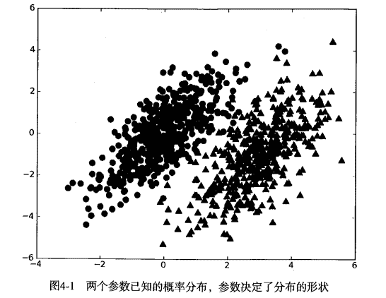
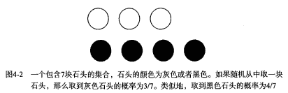
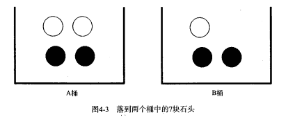
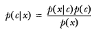
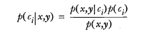
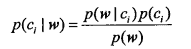
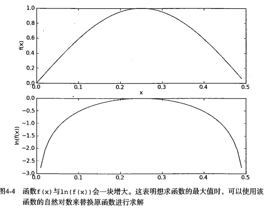

   
# 第4章 基于概率论的分类方法: 朴素贝叶斯
<script type="text/javascript" src="http://cdn.mathjax.org/mathjax/latest/MathJax.js?config=default"></script>


## 朴素贝叶斯 概述 

`贝叶斯分类是一类分类算法的总称，这类算法均以贝叶斯定理为基础，故统称为贝叶斯分类。本章首先介绍贝叶斯分类算法的基础——贝叶斯定理。最后，我们通过实例来讨论贝叶斯分类的中最简单的一种: 朴素贝叶斯分类。`

## 贝叶斯理论 & 条件概率

### 贝叶斯理论

我们现在有一个数据集，它由两类数据组成，数据分布如下图所示: 



我们现在用 p1(x,y) 表示数据点 (x,y) 属于类别 1（图中用圆点表示的类别）的概率，用 p2(x,y) 表示数据点 (x,y) 属于类别 2（图中三角形表示的类别）的概率，那么对于一个新数据点 (x,y)，可以用下面的规则来判断它的类别: 
* 如果 p1(x,y) > p2(x,y) ，那么类别为1
* 如果 p2(x,y) > p1(x,y) ，那么类别为2

也就是说，我们会选择高概率对应的类别。这就是贝叶斯决策理论的核心思想，即选择具有最高概率的决策。

### 条件概率

如果你对 p(x,y|c1) 符号很熟悉，那么可以跳过本小节。

有一个装了 7 块石头的罐子，其中 3 块是白色的，4 块是黑色的。如果从罐子中随机取出一块石头，那么是白色石头的可能性是多少？由于取石头有 7 种可能，其中 3 种为白色，所以取出白色石头的概率为 3/7 。那么取到黑色石头的概率又是多少呢？很显然，是 4/7 。我们使用 P(white) 来表示取到白色石头的概率，其概率值可以通过白色石头数目除以总的石头数目来得到。



如果这 7 块石头如下图所示，放在两个桶中，那么上述概率应该如何计算？



计算 P(white) 或者 P(black) ，如果事先我们知道石头所在桶的信息是会改变结果的。这就是所谓的条件概率（conditional probablity）。假定计算的是从 B 桶取到白色石头的概率，这个概率可以记作 P(white|bucketB) ，我们称之为“在已知石头出自 B 桶的条件下，取出白色石头的概率”。很容易得到，P(white|bucketA) 值为 2/4 ，P(white|bucketB) 的值为 1/3 。

条件概率的计算公式如下: 

P(white|bucketB) = P(white and bucketB) / P(bucketB)

首先，我们用 B 桶中白色石头的个数除以两个桶中总的石头数，得到 P(white and bucketB) = 1/7 .其次，由于 B 桶中有 3 块石头，而总石头数为 7 ，于是 P(bucketB) 就等于 3/7 。于是又 P(white|bucketB) = P(white and bucketB) / P(bucketB) = (1/7) / (3/7) = 1/3 。

另外一种有效计算条件概率的方法称为贝叶斯准则。贝叶斯准则告诉我们如何交换条件概率中的条件与结果，即如果已知 P(x|c)，要求 P(c|x)，那么可以使用下面的计算方法: 



### 使用条件概率来分类

上面我们提到贝叶斯决策理论要求计算两个概率 p1(x, y) 和 p2(x, y):
* 如果 p1(x, y) > p2(x, y), 那么属于类别 1;
* 如果 p2(x, y) > p1(X, y), 那么属于类别 2.

这并不是贝叶斯决策理论的所有内容。使用 p1() 和 p2() 只是为了尽可能简化描述，而真正需要计算和比较的是 p(c1|x, y) 和 p(c2|x, y) .这些符号所代表的具体意义是: 给定某个由 x、y 表示的数据点，那么该数据点来自类别 c1 的概率是多少？数据点来自类别 c2 的概率又是多少？注意这些概率与概率 p(x, y|c1) 并不一样，不过可以使用贝叶斯准则来交换概率中条件与结果。具体地，应用贝叶斯准则得到: 



使用上面这些定义，可以定义贝叶斯分类准则为:
* 如果 P(c1|x, y) > P(c2|x, y), 那么属于类别 c1;
* 如果 P(c2|x, y) > P(c1|x, y), 那么属于类别 c2.

在文档分类中，整个文档（如一封电子邮件）是实例，而电子邮件中的某些元素则构成特征。我们可以观察文档中出现的词，并把每个词作为一个特征，而每个词的出现或者不出现作为该特征的值，这样得到的特征数目就会跟词汇表中的词的数目一样多。

我们假设特征之间  **相互独立** 。所谓 <b>独立(independence)</b> 指的是统计意义上的独立，即一个特征或者单词出现的可能性与它和其他单词相邻没有关系，比如说，“我们”中的“我”和“们”出现的概率与这两个字相邻没有任何关系。这个假设正是朴素贝叶斯分类器中 朴素(naive) 一词的含义。朴素贝叶斯分类器中的另一个假设是，<b>每个特征同等重要</b>。

<b>Note:</b> 朴素贝叶斯分类器通常有两种实现方式: 一种基于伯努利模型实现，一种基于多项式模型实现。这里采用前一种实现方式。该实现方式中并不考虑词在文档中出现的次数，只考虑出不出现，因此在这个意义上相当于假设词是等权重的。

## 朴素贝叶斯 场景

机器学习的一个重要应用就是文档的自动分类。

在文档分类中，整个文档（如一封电子邮件）是实例，而电子邮件中的某些元素则构成特征。我们可以观察文档中出现的词，并把每个词作为一个特征，而每个词的出现或者不出现作为该特征的值，这样得到的特征数目就会跟词汇表中的词的数目一样多。

朴素贝叶斯是上面介绍的贝叶斯分类器的一个扩展，是用于文档分类的常用算法。下面我们会进行一些朴素贝叶斯分类的实践项目。

## 朴素贝叶斯 原理

### 朴素贝叶斯 工作原理

```
提取所有文档中的词条并进行去重
获取文档的所有类别
计算每个类别中的文档数目
对每篇训练文档: 
    对每个类别: 
        如果词条出现在文档中-->增加该词条的计数值（for循环或者矩阵相加）
        增加所有词条的计数值（此类别下词条总数）
对每个类别: 
    对每个词条: 
        将该词条的数目除以总词条数目得到的条件概率（P(词条|类别)）
返回该文档属于每个类别的条件概率（P(类别|文档的所有词条)）
```

### 朴素贝叶斯 开发流程

```
收集数据: 可以使用任何方法。
准备数据: 需要数值型或者布尔型数据。
分析数据: 有大量特征时，绘制特征作用不大，此时使用直方图效果更好。
训练算法: 计算不同的独立特征的条件概率。
测试算法: 计算错误率。
使用算法: 一个常见的朴素贝叶斯应用是文档分类。可以在任意的分类场景中使用朴素贝叶斯分类器，不一定非要是文本。
```

### 朴素贝叶斯 算法特点

```
优点: 在数据较少的情况下仍然有效，可以处理多类别问题。
缺点: 对于输入数据的准备方式较为敏感。
适用数据类型: 标称型数据。
```

## 朴素贝叶斯 项目案例

### 项目案例1: 屏蔽社区留言板的侮辱性言论

[完整代码地址](/src/py2.x/ml/4.NaiveBayes/bayes.py): <https://github.com/apachecn/AiLearning/blob/master/src/py2.x/ml/4.NaiveBayes/bayes.py>

#### 项目概述

构建一个快速过滤器来屏蔽在线社区留言板上的侮辱性言论。如果某条留言使用了负面或者侮辱性的语言，那么就将该留言标识为内容不当。对此问题建立两个类别: 侮辱类和非侮辱类，使用 1 和 0 分别表示。

#### 开发流程

```
收集数据: 可以使用任何方法
准备数据: 从文本中构建词向量
分析数据: 检查词条确保解析的正确性
训练算法: 从词向量计算概率
测试算法: 根据现实情况修改分类器
使用算法: 对社区留言板言论进行分类
```

> 收集数据: 可以使用任何方法

本例是我们自己构造的词表:

```python
def loadDataSet():
    """
    创建数据集
    :return: 单词列表postingList, 所属类别classVec
    """
    postingList = [['my', 'dog', 'has', 'flea', 'problems', 'help', 'please'], #[0,0,1,1,1......]
                   ['maybe', 'not', 'take', 'him', 'to', 'dog', 'park', 'stupid'],
                   ['my', 'dalmation', 'is', 'so', 'cute', 'I', 'love', 'him'],
                   ['stop', 'posting', 'stupid', 'worthless', 'garbage'],
                   ['mr', 'licks', 'ate', 'my', 'steak', 'how', 'to', 'stop', 'him'],
                   ['quit', 'buying', 'worthless', 'dog', 'food', 'stupid']]
    classVec = [0, 1, 0, 1, 0, 1]  # 1 is abusive, 0 not
    return postingList, classVec
```

> 准备数据: 从文本中构建词向量

```python
def createVocabList(dataSet):
    """
    获取所有单词的集合
    :param dataSet: 数据集
    :return: 所有单词的集合(即不含重复元素的单词列表)
    """
    vocabSet = set([])  # create empty set
    for document in dataSet:
        # 操作符 | 用于求两个集合的并集
        vocabSet = vocabSet | set(document)  # union of the two sets
    return list(vocabSet)


def setOfWords2Vec(vocabList, inputSet):
    """
    遍历查看该单词是否出现，出现该单词则将该单词置1
    :param vocabList: 所有单词集合列表
    :param inputSet: 输入数据集
    :return: 匹配列表[0,1,0,1...]，其中 1与0 表示词汇表中的单词是否出现在输入的数据集中
    """
    # 创建一个和词汇表等长的向量，并将其元素都设置为0
    returnVec = [0] * len(vocabList)# [0,0......]
    # 遍历文档中的所有单词，如果出现了词汇表中的单词，则将输出的文档向量中的对应值设为1
    for word in inputSet:
        if word in vocabList:
            returnVec[vocabList.index(word)] = 1
        else:
            print "the word: %s is not in my Vocabulary!" % word
    return returnVec
```

> 分析数据: 检查词条确保解析的正确性

检查函数执行情况，检查词表，不出现重复单词，需要的话，可以对其进行排序。

```python
>>> listOPosts, listClasses = bayes.loadDataSet()
>>> myVocabList = bayes.createVocabList(listOPosts)
>>> myVocabList
['cute', 'love', 'help', 'garbage', 'quit', 'I', 'problems', 'is', 'park', 
'stop', 'flea', 'dalmation', 'licks', 'food', 'not', 'him', 'buying', 'posting', 'has', 'worthless', 'ate', 'to', 'maybe', 'please', 'dog', 'how', 
'stupid', 'so', 'take', 'mr', 'steak', 'my']
```

检查函数有效性。例如: myVocabList 中索引为 2 的元素是什么单词？应该是是 help 。该单词在第一篇文档中出现了，现在检查一下看看它是否出现在第四篇文档中。

```python
>>> bayes.setOfWords2Vec(myVocabList, listOPosts[0])
[0, 0, 1, 0, 0, 0, 1, 0, 0, 0, 1, 0, 0, 0, 0, 0, 0, 0, 1, 0, 0, 0, 0, 1, 1, 0, 0, 0, 0, 0, 0, 1]

>>> bayes.setOfWords2Vec(myVocabList, listOPosts[3])
[0, 0, 0, 1, 0, 0, 0, 0, 0, 1, 0, 0, 0, 0, 0, 0, 0, 1, 0, 1, 0, 0, 0, 0, 0, 0, 1, 0, 0, 0, 0, 0]
```

> 训练算法: 从词向量计算概率

现在已经知道了一个词是否出现在一篇文档中，也知道该文档所属的类别。接下来我们重写贝叶斯准则，将之前的 x, y 替换为 <b>w</b>. 粗体的 <b>w</b> 表示这是一个向量，即它由多个值组成。在这个例子中，数值个数与词汇表中的词个数相同。



我们使用上述公式，对每个类计算该值，然后比较这两个概率值的大小。

问: 上述代码实现中，为什么没有计算P(w)？

答: 根据上述公式可知，我们右边的式子等同于左边的式子，由于对于每个ci，P(w)是固定的。并且我们只需要比较左边式子值的大小来决策分类，那么我们就可以简化为通过比较右边分子值得大小来做决策分类。

首先可以通过类别 i (侮辱性留言或者非侮辱性留言)中的文档数除以总的文档数来计算概率 p(ci) 。接下来计算 p(<b>w</b> | ci) ，这里就要用到朴素贝叶斯假设。如果将 w 展开为一个个独立特征，那么就可以将上述概率写作 p(w0, w1, w2...wn | ci) 。这里假设所有词都互相独立，该假设也称作条件独立性假设（例如 A 和 B 两个人抛骰子，概率是互不影响的，也就是相互独立的，A 抛 2点的同时 B 抛 3 点的概率就是 1/6 * 1/6），它意味着可以使用 p(w0 | ci)p(w1 | ci)p(w2 | ci)...p(wn | ci) 来计算上述概率，这样就极大地简化了计算的过程。

朴素贝叶斯分类器训练函数

```python
def _trainNB0(trainMatrix, trainCategory):
    """
    训练数据原版
    :param trainMatrix: 文件单词矩阵 [[1,0,1,1,1....],[],[]...]
    :param trainCategory: 文件对应的类别[0,1,1,0....]，列表长度等于单词矩阵数，其中的1代表对应的文件是侮辱性文件，0代表不是侮辱性矩阵
    :return:
    """
    # 文件数
    numTrainDocs = len(trainMatrix)
    # 单词数
    numWords = len(trainMatrix[0])
    # 侮辱性文件的出现概率，即trainCategory中所有的1的个数，
    # 代表的就是多少个侮辱性文件，与文件的总数相除就得到了侮辱性文件的出现概率
    pAbusive = sum(trainCategory) / float(numTrainDocs)
    # 构造单词出现次数列表
    p0Num = zeros(numWords) # [0,0,0,.....]
    p1Num = zeros(numWords) # [0,0,0,.....]

    # 整个数据集单词出现总数
    p0Denom = 0.0
    p1Denom = 0.0
    for i in range(numTrainDocs):
        # 是否是侮辱性文件
        if trainCategory[i] == 1:
            # 如果是侮辱性文件，对侮辱性文件的向量进行加和
            p1Num += trainMatrix[i] #[0,1,1,....] + [0,1,1,....]->[0,2,2,...]
            # 对向量中的所有元素进行求和，也就是计算所有侮辱性文件中出现的单词总数
            p1Denom += sum(trainMatrix[i])
        else:
            p0Num += trainMatrix[i]
            p0Denom += sum(trainMatrix[i])
    # 类别1，即侮辱性文档的[P(F1|C1),P(F2|C1),P(F3|C1),P(F4|C1),P(F5|C1)....]列表
    # 即 在1类别下，每个单词出现的概率
    p1Vect = p1Num / p1Denom# [1,2,3,5]/90->[1/90,...]
    # 类别0，即正常文档的[P(F1|C0),P(F2|C0),P(F3|C0),P(F4|C0),P(F5|C0)....]列表
    # 即 在0类别下，每个单词出现的概率
    p0Vect = p0Num / p0Denom
    return p0Vect, p1Vect, pAbusive
```

> 测试算法: 根据现实情况修改分类器

在利用贝叶斯分类器对文档进行分类时，要计算多个概率的乘积以获得文档属于某个类别的概率，即计算 p(w0|1) * p(w1|1) * p(w2|1)。如果其中一个概率值为 0，那么最后的乘积也为 0。为降低这种影响，可以将所有词的出现数初始化为 1，并将分母初始化为 2 （取1 或 2 的目的主要是为了保证分子和分母不为0，大家可以根据业务需求进行更改）。

另一个遇到的问题是下溢出，这是由于太多很小的数相乘造成的。当计算乘积 p(w0|ci) * p(w1|ci) * p(w2|ci)... p(wn|ci) 时，由于大部分因子都非常小，所以程序会下溢出或者得到不正确的答案。（用 Python 尝试相乘许多很小的数，最后四舍五入后会得到 0）。一种解决办法是对乘积取自然对数。在代数中有 ln(a * b) = ln(a) + ln(b), 于是通过求对数可以避免下溢出或者浮点数舍入导致的错误。同时，采用自然对数进行处理不会有任何损失。

下图给出了函数 f(x) 与 ln(f(x)) 的曲线。可以看出，它们在相同区域内同时增加或者减少，并且在相同点上取到极值。它们的取值虽然不同，但不影响最终结果。



```python
def trainNB0(trainMatrix, trainCategory):
    """
    训练数据优化版本
    :param trainMatrix: 文件单词矩阵
    :param trainCategory: 文件对应的类别
    :return:
    """
    # 总文件数
    numTrainDocs = len(trainMatrix)
    # 总单词数
    numWords = len(trainMatrix[0])
    # 侮辱性文件的出现概率
    pAbusive = sum(trainCategory) / float(numTrainDocs)
    # 构造单词出现次数列表
    # p0Num 正常的统计
    # p1Num 侮辱的统计
    p0Num = ones(numWords)#[0,0......]->[1,1,1,1,1.....]
    p1Num = ones(numWords)

    # 整个数据集单词出现总数，2.0根据样本/实际调查结果调整分母的值（2主要是避免分母为0，当然值可以调整）
    # p0Denom 正常的统计
    # p1Denom 侮辱的统计
    p0Denom = 2.0
    p1Denom = 2.0
    for i in range(numTrainDocs):
        if trainCategory[i] == 1:
            # 累加辱骂词的频次
            p1Num += trainMatrix[i]
            # 对每篇文章的辱骂的频次 进行统计汇总
            p1Denom += sum(trainMatrix[i])
        else:
            p0Num += trainMatrix[i]
            p0Denom += sum(trainMatrix[i])
    # 类别1，即侮辱性文档的[log(P(F1|C1)),log(P(F2|C1)),log(P(F3|C1)),log(P(F4|C1)),log(P(F5|C1))....]列表
    p1Vect = log(p1Num / p1Denom)
    # 类别0，即正常文档的[log(P(F1|C0)),log(P(F2|C0)),log(P(F3|C0)),log(P(F4|C0)),log(P(F5|C0))....]列表
    p0Vect = log(p0Num / p0Denom)
    return p0Vect, p1Vect, pAbusive

```


> 使用算法: 对社区留言板言论进行分类

朴素贝叶斯分类函数

```python
def classifyNB(vec2Classify, p0Vec, p1Vec, pClass1):
    """
    使用算法: 
        # 将乘法转换为加法
        乘法: P(C|F1F2...Fn) = P(F1F2...Fn|C)P(C)/P(F1F2...Fn)
        加法: P(F1|C)*P(F2|C)....P(Fn|C)P(C) -> log(P(F1|C))+log(P(F2|C))+....+log(P(Fn|C))+log(P(C))
    :param vec2Classify: 待测数据[0,1,1,1,1...]，即要分类的向量
    :param p0Vec: 类别0，即正常文档的[log(P(F1|C0)),log(P(F2|C0)),log(P(F3|C0)),log(P(F4|C0)),log(P(F5|C0))....]列表
    :param p1Vec: 类别1，即侮辱性文档的[log(P(F1|C1)),log(P(F2|C1)),log(P(F3|C1)),log(P(F4|C1)),log(P(F5|C1))....]列表
    :param pClass1: 类别1，侮辱性文件的出现概率
    :return: 类别1 or 0
    """
    # 计算公式  log(P(F1|C))+log(P(F2|C))+....+log(P(Fn|C))+log(P(C))
    # 大家可能会发现，上面的计算公式，没有除以贝叶斯准则的公式的分母，也就是 P(w) （P(w) 指的是此文档在所有的文档中出现的概率）就进行概率大小的比较了，
    # 因为 P(w) 针对的是包含侮辱和非侮辱的全部文档，所以 P(w) 是相同的。
    # 使用 NumPy 数组来计算两个向量相乘的结果，这里的相乘是指对应元素相乘，即先将两个向量中的第一个元素相乘，然后将第2个元素相乘，以此类推。
    # 我的理解是: 这里的 vec2Classify * p1Vec 的意思就是将每个词与其对应的概率相关联起来
    p1 = sum(vec2Classify * p1Vec) + log(pClass1) # P(w|c1) * P(c1) ，即贝叶斯准则的分子
    p0 = sum(vec2Classify * p0Vec) + log(1.0 - pClass1) # P(w|c0) * P(c0) ，即贝叶斯准则的分子·
    if p1 > p0:
        return 1
    else:
        return 0


def testingNB():
    """
    测试朴素贝叶斯算法
    """
    # 1. 加载数据集
    listOPosts, listClasses = loadDataSet()
    # 2. 创建单词集合
    myVocabList = createVocabList(listOPosts)
    # 3. 计算单词是否出现并创建数据矩阵
    trainMat = []
    for postinDoc in listOPosts:
        # 返回m*len(myVocabList)的矩阵， 记录的都是0，1信息
        trainMat.append(setOfWords2Vec(myVocabList, postinDoc))
    # 4. 训练数据
    p0V, p1V, pAb = trainNB0(array(trainMat), array(listClasses))
    # 5. 测试数据
    testEntry = ['love', 'my', 'dalmation']
    thisDoc = array(setOfWords2Vec(myVocabList, testEntry))
    print testEntry, 'classified as: ', classifyNB(thisDoc, p0V, p1V, pAb)
    testEntry = ['stupid', 'garbage']
    thisDoc = array(setOfWords2Vec(myVocabList, testEntry))
    print testEntry, 'classified as: ', classifyNB(thisDoc, p0V, p1V, pAb)
``` 


### 项目案例2: 使用朴素贝叶斯过滤垃圾邮件

[完整代码地址](/src/py2.x/ml/4.NaiveBayes/bayes.py): <https://github.com/apachecn/AiLearning/blob/master/src/py2.x/ml/4.NaiveBayes/bayes.py>

#### 项目概述

完成朴素贝叶斯的一个最著名的应用: 电子邮件垃圾过滤。

#### 开发流程

使用朴素贝叶斯对电子邮件进行分类

```
收集数据: 提供文本文件
准备数据: 将文本文件解析成词条向量
分析数据: 检查词条确保解析的正确性
训练算法: 使用我们之前建立的 trainNB() 函数
测试算法: 使用朴素贝叶斯进行交叉验证
使用算法: 构建一个完整的程序对一组文档进行分类，将错分的文档输出到屏幕上
```

> 收集数据: 提供文本文件

文本文件内容如下: 

```
Hi Peter,

With Jose out of town, do you want to
meet once in a while to keep things
going and do some interesting stuff?

Let me know
Eugene
```

> 准备数据: 将文本文件解析成词条向量

使用正则表达式来切分文本

```python
>>> mySent = 'This book is the best book on Python or M.L. I have ever laid eyes upon.'
>>> import re
>>> regEx = re.compile('\\W*')
>>> listOfTokens = regEx.split(mySent)
>>> listOfTokens
['This', 'book', 'is', 'the', 'best', 'book', 'on', 'Python', 'or', 'M.L.', 'I', 'have', 'ever', 'laid', 'eyes', 'upon', '']
```

> 分析数据: 检查词条确保解析的正确性

> 训练算法: 使用我们之前建立的 trainNB0() 函数

```python
def trainNB0(trainMatrix, trainCategory):
    """
    训练数据优化版本
    :param trainMatrix: 文件单词矩阵
    :param trainCategory: 文件对应的类别
    :return:
    """
    # 总文件数
    numTrainDocs = len(trainMatrix)
    # 总单词数
    numWords = len(trainMatrix[0])
    # 侮辱性文件的出现概率
    pAbusive = sum(trainCategory) / float(numTrainDocs)
    # 构造单词出现次数列表
    # p0Num 正常的统计
    # p1Num 侮辱的统计
    p0Num = ones(numWords)#[0,0......]->[1,1,1,1,1.....]
    p1Num = ones(numWords)

    # 整个数据集单词出现总数，2.0根据样本/实际调查结果调整分母的值（2主要是避免分母为0，当然值可以调整）
    # p0Denom 正常的统计
    # p1Denom 侮辱的统计
    p0Denom = 2.0
    p1Denom = 2.0
    for i in range(numTrainDocs):
        if trainCategory[i] == 1:
            # 累加辱骂词的频次
            p1Num += trainMatrix[i]
            # 对每篇文章的辱骂的频次 进行统计汇总
            p1Denom += sum(trainMatrix[i])
        else:
            p0Num += trainMatrix[i]
            p0Denom += sum(trainMatrix[i])
    # 类别1，即侮辱性文档的[log(P(F1|C1)),log(P(F2|C1)),log(P(F3|C1)),log(P(F4|C1)),log(P(F5|C1))....]列表
    p1Vect = log(p1Num / p1Denom)
    # 类别0，即正常文档的[log(P(F1|C0)),log(P(F2|C0)),log(P(F3|C0)),log(P(F4|C0)),log(P(F5|C0))....]列表
    p0Vect = log(p0Num / p0Denom)
    return p0Vect, p1Vect, pAbusive
```

> 测试算法: 使用朴素贝叶斯进行交叉验证

文件解析及完整的垃圾邮件测试函数

```python
# 切分文本
def textParse(bigString):
    '''
    Desc:
        接收一个大字符串并将其解析为字符串列表
    Args:
        bigString -- 大字符串
    Returns:
        去掉少于 2 个字符的字符串，并将所有字符串转换为小写，返回字符串列表
    '''
    import re
    # 使用正则表达式来切分句子，其中分隔符是除单词、数字外的任意字符串
    listOfTokens = re.split(r'\W*', bigString)
    return [tok.lower() for tok in listOfTokens if len(tok) > 2]

def spamTest():
    '''
    Desc:
        对贝叶斯垃圾邮件分类器进行自动化处理。
    Args:
        none
    Returns:
        对测试集中的每封邮件进行分类，若邮件分类错误，则错误数加 1，最后返回总的错误百分比。
    '''
    docList = []
    classList = []
    fullText = []
    for i in range(1, 26):
        # 切分，解析数据，并归类为 1 类别
        wordList = textParse(open('data/4.NaiveBayes/email/spam/%d.txt' % i).read())
        docList.append(wordList)
        classList.append(1)
        # 切分，解析数据，并归类为 0 类别
        wordList = textParse(open('data/4.NaiveBayes/email/ham/%d.txt' % i).read())
        docList.append(wordList)
        fullText.extend(wordList)
        classList.append(0)
    # 创建词汇表    
    vocabList = createVocabList(docList)
    trainingSet = range(50)
    testSet = []
    # 随机取 10 个邮件用来测试
    for i in range(10):
        # random.uniform(x, y) 随机生成一个范围为 x ~ y 的实数
        randIndex = int(random.uniform(0, len(trainingSet)))
        testSet.append(trainingSet[randIndex])
        del(trainingSet[randIndex])
    trainMat = []
    trainClasses = []
    for docIndex in trainingSet:
        trainMat.append(setOfWords2Vec(vocabList, docList[docIndex]))
        trainClasses.append(classList[docIndex])
    p0V, p1V, pSpam = trainNB0(array(trainMat), array(trainClasses))
    errorCount = 0
    for docIndex in testSet:
        wordVector = setOfWords2Vec(vocabList, docList[docIndex])
        if classifyNB(array(wordVector), p0V, p1V, pSpam) != classList[docIndex]:
            errorCount += 1
    print 'the errorCount is: ', errorCount
    print 'the testSet length is :', len(testSet)
    print 'the error rate is :', float(errorCount)/len(testSet)
```

> 使用算法: 构建一个完整的程序对一组文档进行分类，将错分的文档输出到屏幕上


### 项目案例3: 使用朴素贝叶斯分类器从个人广告中获取区域倾向

[完整代码地址](/src/py2.x/ml/4.NaiveBayes/bayes.py): <https://github.com/apachecn/AiLearning/blob/master/src/py2.x/ml/4.NaiveBayes/bayes.py>

#### 项目概述

广告商往往想知道关于一个人的一些特定人口统计信息，以便能更好地定向推销广告。

我们将分别从美国的两个城市中选取一些人，通过分析这些人发布的信息，来比较这两个城市的人们在广告用词上是否不同。如果结论确实不同，那么他们各自常用的词是哪些，从人们的用词当中，我们能否对不同城市的人所关心的内容有所了解。

#### 开发流程

```
收集数据: 从 RSS 源收集内容，这里需要对 RSS 源构建一个接口
准备数据: 将文本文件解析成词条向量
分析数据: 检查词条确保解析的正确性
训练算法: 使用我们之前建立的 trainNB0() 函数
测试算法: 观察错误率，确保分类器可用。可以修改切分程序，以降低错误率，提高分类结果
使用算法: 构建一个完整的程序，封装所有内容。给定两个 RSS 源，改程序会显示最常用的公共词
```

> 收集数据: 从 RSS 源收集内容，这里需要对 RSS 源构建一个接口

也就是导入 RSS 源，我们使用 python 下载文本，在http://code.google.com/p/feedparser/ 下浏览相关文档，安装 feedparse，首先解压下载的包，并将当前目录切换到解压文件所在的文件夹，然后在 python 提示符下输入: 

```python
>>> python setup.py install
```

> 准备数据: 将文本文件解析成词条向量

文档词袋模型

我们将每个词的出现与否作为一个特征，这可以被描述为 <b>词集模型(set-of-words model)</b>。如果一个词在文档中出现不止一次，这可能意味着包含该词是否出现在文档中所不能表达的某种信息，这种方法被称为 <b>词袋模型(bag-of-words model)</b>。在词袋中，每个单词可以出现多次，而在词集中，每个词只能出现一次。为适应词袋模型，需要对函数 setOfWords2Vec() 稍加修改，修改后的函数为 bagOfWords2Vec() 。

如下给出了基于词袋模型的朴素贝叶斯代码。它与函数 setOfWords2Vec() 几乎完全相同，唯一不同的是每当遇到一个单词时，它会增加词向量中的对应值，而不只是将对应的数值设为 1 。

```python
def bagOfWords2VecMN(vocaList, inputSet):
    returnVec = [0] * len(vocabList)
    for word in inputSet:
        if word in vocaList:
            returnVec[vocabList.index(word)] += 1
    return returnVec
```

```python
#创建一个包含在所有文档中出现的不重复词的列表
def createVocabList(dataSet):
    vocabSet=set([])    #创建一个空集
    for document in dataSet:
        vocabSet=vocabSet|set(document)   #创建两个集合的并集
    return list(vocabSet)
def setOfWords2VecMN(vocabList,inputSet):
    returnVec=[0]*len(vocabList)  #创建一个其中所含元素都为0的向量
    for word in inputSet:
        if word in vocabList:
                returnVec[vocabList.index(word)]+=1
    return returnVec

#文件解析
def textParse(bigString):
    import re
    listOfTokens=re.split(r'\W*',bigString)
    return [tok.lower() for tok in listOfTokens if len(tok)>2]
```

> 分析数据: 检查词条确保解析的正确性

> 训练算法: 使用我们之前建立的 trainNB0() 函数

```python
def trainNB0(trainMatrix, trainCategory):
    """
    训练数据优化版本
    :param trainMatrix: 文件单词矩阵
    :param trainCategory: 文件对应的类别
    :return:
    """
    # 总文件数
    numTrainDocs = len(trainMatrix)
    # 总单词数
    numWords = len(trainMatrix[0])
    # 侮辱性文件的出现概率
    pAbusive = sum(trainCategory) / float(numTrainDocs)
    # 构造单词出现次数列表
    # p0Num 正常的统计
    # p1Num 侮辱的统计 
    # 避免单词列表中的任何一个单词为0，而导致最后的乘积为0，所以将每个单词的出现次数初始化为 1
    p0Num = ones(numWords)#[0,0......]->[1,1,1,1,1.....]
    p1Num = ones(numWords)

    # 整个数据集单词出现总数，2.0根据样本/实际调查结果调整分母的值（2主要是避免分母为0，当然值可以调整）
    # p0Denom 正常的统计
    # p1Denom 侮辱的统计
    p0Denom = 2.0
    p1Denom = 2.0
    for i in range(numTrainDocs):
        if trainCategory[i] == 1:
            # 累加辱骂词的频次
            p1Num += trainMatrix[i]
            # 对每篇文章的辱骂的频次 进行统计汇总
            p1Denom += sum(trainMatrix[i])
        else:
            p0Num += trainMatrix[i]
            p0Denom += sum(trainMatrix[i])
    # 类别1，即侮辱性文档的[log(P(F1|C1)),log(P(F2|C1)),log(P(F3|C1)),log(P(F4|C1)),log(P(F5|C1))....]列表
    p1Vect = log(p1Num / p1Denom)
    # 类别0，即正常文档的[log(P(F1|C0)),log(P(F2|C0)),log(P(F3|C0)),log(P(F4|C0)),log(P(F5|C0))....]列表
    p0Vect = log(p0Num / p0Denom)
    return p0Vect, p1Vect, pAbusive
```

> 测试算法: 观察错误率，确保分类器可用。可以修改切分程序，以降低错误率，提高分类结果

```python
#RSS源分类器及高频词去除函数
def calcMostFreq(vocabList,fullText):
    import operator
    freqDict={}
    for token in vocabList:  #遍历词汇表中的每个词
        freqDict[token]=fullText.count(token)  #统计每个词在文本中出现的次数
    sortedFreq=sorted(freqDict.iteritems(),key=operator.itemgetter(1),reverse=True)  #根据每个词出现的次数从高到底对字典进行排序
    return sortedFreq[:30]   #返回出现次数最高的30个单词
def localWords(feed1,feed0):
    import feedparser
    docList=[];classList=[];fullText=[]
    minLen=min(len(feed1['entries']),len(feed0['entries']))
    for i in range(minLen):
        wordList=textParse(feed1['entries'][i]['summary'])   #每次访问一条RSS源
        docList.append(wordList)
        fullText.extend(wordList)
        classList.append(1)
        wordList=textParse(feed0['entries'][i]['summary'])
        docList.append(wordList)
        fullText.extend(wordList)
        classList.append(0)
    vocabList=createVocabList(docList)
    top30Words=calcMostFreq(vocabList,fullText)
    for pairW in top30Words:
        if pairW[0] in vocabList:vocabList.remove(pairW[0])    #去掉出现次数最高的那些词
    trainingSet=range(2*minLen);testSet=[]
    for i in range(20):
        randIndex=int(random.uniform(0,len(trainingSet)))
        testSet.append(trainingSet[randIndex])
        del(trainingSet[randIndex])
    trainMat=[];trainClasses=[]
    for docIndex in trainingSet:
        trainMat.append(bagOfWords2VecMN(vocabList,docList[docIndex]))
        trainClasses.append(classList[docIndex])
    p0V,p1V,pSpam=trainNBO(array(trainMat),array(trainClasses))
    errorCount=0
    for docIndex in testSet:
        wordVector=bagOfWords2VecMN(vocabList,docList[docIndex])
        if classifyNB(array(wordVector),p0V,p1V,pSpam)!=classList[docIndex]:
            errorCount+=1
    print 'the error rate is:',float(errorCount)/len(testSet)
    return vocabList,p0V,p1V

#朴素贝叶斯分类函数
def classifyNB(vec2Classify,p0Vec,p1Vec,pClass1):
    p1=sum(vec2Classify*p1Vec)+log(pClass1)
    p0=sum(vec2Classify*p0Vec)+log(1.0-pClass1)
    if p1>p0:
        return 1
    else:
        return 0
```

> 使用算法: 构建一个完整的程序，封装所有内容。给定两个 RSS 源，改程序会显示最常用的公共词

函数 localWords() 使用了两个 RSS 源作为参数，RSS 源要在函数外导入，这样做的原因是 RSS 源会随时间而改变，重新加载 RSS 源就会得到新的数据

```python
>>> reload(bayes)
<module 'bayes' from 'bayes.pyc'>
>>> import feedparser
>>> ny=feedparser.parse('http://newyork.craigslist.org/stp/index.rss')
>>> sy=feedparser.parse('http://sfbay.craigslist.org/stp/index.rss')
>>> vocabList,pSF,pNY=bayes.localWords(ny,sf)
the error rate is: 0.2
>>> vocabList,pSF,pNY=bayes.localWords(ny,sf)
the error rate is: 0.3
>>> vocabList,pSF,pNY=bayes.localWords(ny,sf)
the error rate is: 0.55
```
为了得到错误率的精确估计，应该多次进行上述实验，然后取平均值

接下来，我们要分析一下数据，显示地域相关的用词

可以先对向量pSF与pNY进行排序，然后按照顺序打印出来，将下面的代码添加到文件中: 

```python
#最具表征性的词汇显示函数
def getTopWords(ny,sf):
    import operator
    vocabList,p0V,p1V=localWords(ny,sf)
    topNY=[];topSF=[]
    for i in range(len(p0V)):
        if p0V[i]>-6.0:topSF.append((vocabList[i],p0V[i]))
        if p1V[i]>-6.0:topNY.append((vocabList[i],p1V[i]))
    sortedSF=sorted(topSF,key=lambda pair:pair[1],reverse=True)
    print "SF**SF**SF**SF**SF**SF**SF**SF**SF**SF**SF**SF**SF**SF**"
    for item in sortedSF:
        print item[0]
    sortedNY=sorted(topNY,key=lambda pair:pair[1],reverse=True)
    print "NY**NY**NY**NY**NY**NY**NY**NY**NY**NY**NY**NY**NY**NY**"
    for item in sortedNY:
        print item[0]
```

函数 getTopWords() 使用两个 RSS 源作为输入，然后训练并测试朴素贝叶斯分类器，返回使用的概率值。然后创建两个列表用于元组的存储，与之前返回排名最高的 X 个单词不同，这里可以返回大于某个阈值的所有词，这些元组会按照它们的条件概率进行排序。

保存 bayes.py 文件，在python提示符下输入: 

```python
>>> reload(bayes)
<module 'bayes' from 'bayes.pyc'>
>>> bayes.getTopWords(ny,sf)
the error rate is: 0.55
SF**SF**SF**SF**SF**SF**SF**SF**SF**SF**SF**SF**SF**SF**
how
last
man
...
veteran
still
ends
late
off
own
know
NY**NY**NY**NY**NY**NY**NY**NY**NY**NY**NY**NY**NY**NY**
someone
meet
...
apparel
recalled
starting
strings
```

当注释掉用于移除高频词的三行代码，然后比较注释前后的分类性能，去掉这几行代码之后，错误率为54%，，而保留这些代码得到的错误率为70%。这里观察到，这些留言中出现次数最多的前30个词涵盖了所有用词的30%，vocabList的大小约为3000个词，也就是说，词汇表中的一小部分单词却占据了所有文本用词的一大部分。产生这种现象的原因是因为语言中大部分都是冗余和结构辅助性内容。另一个常用的方法是不仅移除高频词，同时从某个预定高频词中移除结构上的辅助词，该词表称为停用词表。

从最后输出的单词，可以看出程序输出了大量的停用词，可以移除固定的停用词看看结果如何，这样做的话，分类错误率也会降低。


***

* **作者: [羊三](http://cwiki.apachecn.org/display/~xuxin) [小瑶](http://cwiki.apachecn.org/display/~chenyao)**
* [GitHub地址](https://github.com/apachecn/AiLearning): <https://github.com/apachecn/AiLearning>
* **版权声明: 欢迎转载学习 => 请标注信息来源于 [ApacheCN](http://www.apachecn.org/)**

