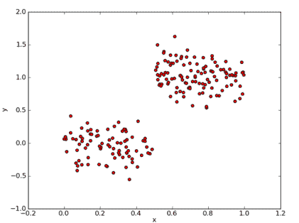
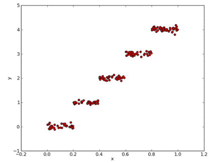
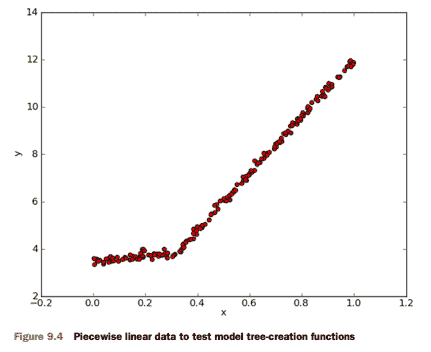
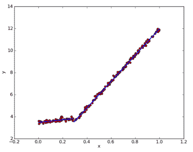
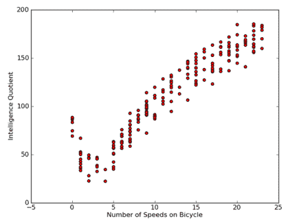
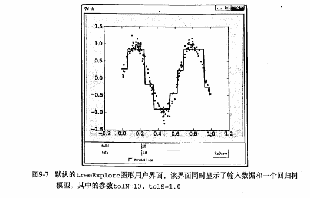
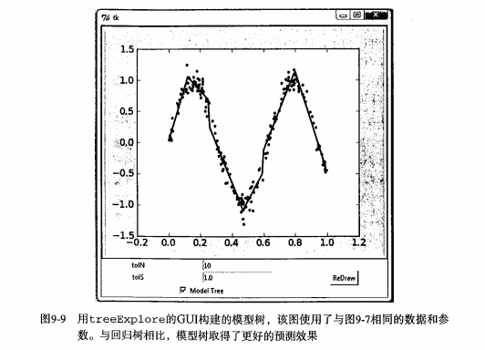

# 第9章 树回归
<script type="text/javascript" src="http://cdn.mathjax.org/mathjax/latest/MathJax.js?config=default"></script>


## 树回归 概述

`我们本章介绍 CART(Classification And Regression Trees， 分类回归树) 的树构建算法。该算法既可以用于分类还可以用于回归。`

## 树回归 场景

我们在第 8 章中介绍了线性回归的一些强大的方法，但这些方法创建的模型需要拟合所有的样本点（局部加权线性回归除外）。当数据拥有众多特征并且特征之间关系十分复杂时，构建全局模型的想法就显得太难了，也略显笨拙。而且，实际生活中很多问题都是非线性的，不可能使用全局线性模型来拟合任何数据。

一种可行的方法是将数据集切分成很多份易建模的数据，然后利用我们的线性回归技术来建模。如果首次切分后仍然难以拟合线性模型就继续切分。在这种切分方式下，树回归和回归法就相当有用。

除了我们在 第3章 中介绍的 决策树算法，我们介绍一个新的叫做 CART(Classification And Regression Trees, 分类回归树) 的树构建算法。该算法既可以用于分类还可以用于回归。

## 1、树回归 原理

### 1.1、树回归 原理概述

为成功构建以分段常数为叶节点的树，需要度量出数据的一致性。第3章使用树进行分类，会在给定节点时计算数据的混乱度。那么如何计算连续型数值的混乱度呢？

在这里，计算连续型数值的混乱度是非常简单的。首先计算所有数据的均值，然后计算每条数据的值到均值的差值。为了对正负差值同等看待，一般使用绝对值或平方值来代替上述差值。

上述做法有点类似于前面介绍过的统计学中常用的方差计算。唯一不同就是，方差是平方误差的均值(均方差)，而这里需要的是平方误差的总值(总方差)。总方差可以通过均方差乘以数据集中样本点的个数来得到。

### 1.2、树构建算法 比较

我们在 第3章 中使用的树构建算法是 ID3 。ID3 的做法是每次选取当前最佳的特征来分割数据，并按照该特征的所有可能取值来切分。也就是说，如果一个特征有 4 种取值，那么数据将被切分成 4 份。一旦按照某特征切分后，该特征在之后的算法执行过程中将不会再起作用，所以有观点认为这种切分方式过于迅速。另外一种方法是二元切分法，即每次把数据集切分成两份。如果数据的某特征值等于切分所要求的值，那么这些数据就进入树的左子树，反之则进入树的右子树。

除了切分过于迅速外， ID3 算法还存在另一个问题，它不能直接处理连续型特征。只有事先将连续型特征转换成离散型，才能在 ID3 算法中使用。但这种转换过程会破坏连续型变量的内在性质。而使用二元切分法则易于对树构造过程进行调整以处理连续型特征。具体的处理方法是: 如果特征值大于给定值就走左子树，否则就走右子树。另外，二元切分法也节省了树的构建时间，但这点意义也不是特别大，因为这些树构建一般是离线完成，时间并非需要重点关注的因素。

CART 是十分著名且广泛记载的树构建算法，它使用二元切分来处理连续型变量。对 CART 稍作修改就可以处理回归问题。第 3 章中使用香农熵来度量集合的无组织程度。如果选用其他方法来代替香农熵，就可以使用树构建算法来完成回归。

回归树与分类树的思路类似，但是叶节点的数据类型不是离散型，而是连续型。

#### 1.2.1、附加 各常见树构造算法的划分分支方式

还有一点要说明，构建决策树算法，常用到的是三个方法: ID3, C4.5, CART.  
三种方法区别是划分树的分支的方式:
1. ID3 是信息增益分支
2. C4.5 是信息增益率分支
3. CART 做分类工作时，采用 GINI 值作为节点分裂的依据；回归时，采用样本的最小方差作为节点的分裂依据。

工程上总的来说: 

CART 和 C4.5 之间主要差异在于分类结果上，CART 可以回归分析也可以分类，C4.5 只能做分类；C4.5 子节点是可以多分的，而 CART 是无数个二叉子节点；

以此拓展出以 CART 为基础的 “树群” Random forest ， 以 回归树 为基础的 “树群” GBDT 。

###  1.3、树回归 工作原理

1、找到数据集切分的最佳位置，函数 chooseBestSplit() 伪代码大致如下:

```
对每个特征:
    对每个特征值: 
        将数据集切分成两份（小于该特征值的数据样本放在左子树，否则放在右子树）
        计算切分的误差
        如果当前误差小于当前最小误差，那么将当前切分设定为最佳切分并更新最小误差
返回最佳切分的特征和阈值
```
2、树构建算法，函数 createTree() 伪代码大致如下:   

```
找到最佳的待切分特征:
    如果该节点不能再分，将该节点存为叶节点
    执行二元切分
    在右子树调用 createTree() 方法
    在左子树调用 createTree() 方法
```

### 1.4、树回归 开发流程

```
(1) 收集数据: 采用任意方法收集数据。
(2) 准备数据: 需要数值型数据，标称型数据应该映射成二值型数据。
(3) 分析数据: 绘出数据的二维可视化显示结果，以字典方式生成树。
(4) 训练算法: 大部分时间都花费在叶节点树模型的构建上。
(5) 测试算法: 使用测试数据上的R^2值来分析模型的效果。
(6) 使用算法: 使用训练处的树做预测，预测结果还可以用来做很多事情。
```

### 1.5、树回归 算法特点

```
优点: 可以对复杂和非线性的数据建模。
缺点: 结果不易理解。
适用数据类型: 数值型和标称型数据。
```

### 1.6、回归树 项目案例

#### 1.6.1、项目概述

在简单数据集上生成一棵回归树。

#### 1.6.2、开发流程

```
收集数据: 采用任意方法收集数据
准备数据: 需要数值型数据，标称型数据应该映射成二值型数据
分析数据: 绘出数据的二维可视化显示结果，以字典方式生成树
训练算法: 大部分时间都花费在叶节点树模型的构建上
测试算法: 使用测试数据上的R^2值来分析模型的效果
使用算法: 使用训练出的树做预测，预测结果还可以用来做很多事情
```

> 收集数据: 采用任意方法收集数据

data1.txt 文件中存储的数据格式如下:

```
0.036098	0.155096
0.993349	1.077553
0.530897	0.893462
0.712386	0.564858
0.343554	-0.371700
0.098016	-0.332760
```
> 准备数据: 需要数值型数据，标称型数据应该映射成二值型数据

> 分析数据: 绘出数据的二维可视化显示结果，以字典方式生成树

基于 CART 算法构建回归树的简单数据集  
  

用于测试回归树的分段常数数据集  
  


> 训练算法: 构造树的数据结构

```python
def binSplitDataSet(dataSet, feature, value):
    """binSplitDataSet(将数据集，按照feature列的value进行 二元切分)
        Description: 在给定特征和特征值的情况下，该函数通过数组过滤方式将上述数据集合切分得到两个子集并返回。
    Args:
        dataMat 数据集
        feature 待切分的特征列
        value 特征列要比较的值
    Returns:
        mat0 小于等于 value 的数据集在左边
        mat1 大于 value 的数据集在右边
    Raises:
    """
    # # 测试案例
    # print 'dataSet[:, feature]=', dataSet[:, feature]
    # print 'nonzero(dataSet[:, feature] > value)[0]=', nonzero(dataSet[:, feature] > value)[0]
    # print 'nonzero(dataSet[:, feature] <= value)[0]=', nonzero(dataSet[:, feature] <= value)[0]

    # dataSet[:, feature] 取去每一行中，第1列的值(从0开始算)
    # nonzero(dataSet[:, feature] > value)  返回结果为true行的index下标
    mat0 = dataSet[nonzero(dataSet[:, feature] <= value)[0], :]
    mat1 = dataSet[nonzero(dataSet[:, feature] > value)[0], :]
    return mat0, mat1


# 1.用最佳方式切分数据集
# 2.生成相应的叶节点
def chooseBestSplit(dataSet, leafType=regLeaf, errType=regErr, ops=(1, 4)):
    """chooseBestSplit(用最佳方式切分数据集 和 生成相应的叶节点)

    Args:
        dataSet   加载的原始数据集
        leafType  建立叶子点的函数
        errType   误差计算函数(求总方差)
        ops       [容许误差下降值，切分的最少样本数]。
    Returns:
        bestIndex feature的index坐标
        bestValue 切分的最优值
    Raises:
    """

    # ops=(1,4)，非常重要，因为它决定了决策树划分停止的threshold值，被称为预剪枝（prepruning），其实也就是用于控制函数的停止时机。
    # 之所以这样说，是因为它防止决策树的过拟合，所以当误差的下降值小于tolS，或划分后的集合size小于tolN时，选择停止继续划分。
    # 最小误差下降值，划分后的误差减小小于这个差值，就不用继续划分
    tolS = ops[0]
    # 划分最小 size 小于，就不继续划分了
    tolN = ops[1]
    # 如果结果集(最后一列为1个变量)，就返回退出
    # .T 对数据集进行转置
    # .tolist()[0] 转化为数组并取第0列
    if len(set(dataSet[:, -1].T.tolist()[0])) == 1: # 如果集合size为1，不用继续划分。
        #  exit cond 1
        return None, leafType(dataSet)
    # 计算行列值
    m, n = shape(dataSet)
    # 无分类误差的总方差和
    # the choice of the best feature is driven by Reduction in RSS error from mean
    S = errType(dataSet)
    # inf 正无穷大
    bestS, bestIndex, bestValue = inf, 0, 0
    # 循环处理每一列对应的feature值
    for featIndex in range(n-1): # 对于每个特征
        # [0]表示这一列的[所有行]，不要[0]就是一个array[[所有行]]
        for splitVal in set(dataSet[:, featIndex].T.tolist()[0]):
            # 对该列进行分组，然后组内的成员的val值进行 二元切分
            mat0, mat1 = binSplitDataSet(dataSet, featIndex, splitVal)
            # 判断二元切分的方式的元素数量是否符合预期
            if (shape(mat0)[0] < tolN) or (shape(mat1)[0] < tolN):
                continue
            newS = errType(mat0) + errType(mat1)
            # 如果二元切分，算出来的误差在可接受范围内，那么就记录切分点，并记录最小误差
            # 如果划分后误差小于 bestS，则说明找到了新的bestS
            if newS < bestS:
                bestIndex = featIndex
                bestValue = splitVal
                bestS = newS
    # 判断二元切分的方式的元素误差是否符合预期
    # if the decrease (S-bestS) is less than a threshold don't do the split
    if (S - bestS) < tolS:
        return None, leafType(dataSet)
    mat0, mat1 = binSplitDataSet(dataSet, bestIndex, bestValue)
    # 对整体的成员进行判断，是否符合预期
    # 如果集合的 size 小于 tolN 
    if (shape(mat0)[0] < tolN) or (shape(mat1)[0] < tolN): # 当最佳划分后，集合过小，也不划分，产生叶节点
        return None, leafType(dataSet)
    return bestIndex, bestValue


# assume dataSet is NumPy Mat so we can array filtering
# 假设 dataSet 是 NumPy Mat 类型的，那么我们可以进行 array 过滤
def createTree(dataSet, leafType=regLeaf, errType=regErr, ops=(1, 4)):
    """createTree(获取回归树)
        Description: 递归函数: 如果构建的是回归树，该模型是一个常数，如果是模型树，其模型师一个线性方程。
    Args:
        dataSet      加载的原始数据集
        leafType     建立叶子点的函数
        errType      误差计算函数
        ops=(1, 4)   [容许误差下降值，切分的最少样本数]
    Returns:
        retTree    决策树最后的结果
    """
    # 选择最好的切分方式:  feature索引值，最优切分值
    # choose the best split
    feat, val = chooseBestSplit(dataSet, leafType, errType, ops)
    # if the splitting hit a stop condition return val
    # 如果 splitting 达到一个停止条件，那么返回 val
    if feat is None:
        return val
    retTree = {}
    retTree['spInd'] = feat
    retTree['spVal'] = val
    # 大于在右边，小于在左边，分为2个数据集
    lSet, rSet = binSplitDataSet(dataSet, feat, val)
    # 递归的进行调用，在左右子树中继续递归生成树
    retTree['left'] = createTree(lSet, leafType, errType, ops)
    retTree['right'] = createTree(rSet, leafType, errType, ops)
    return retTree
```
[完整代码地址](https://github.com/apachecn/AiLearning/blob/master/src/py2.x/ml/9.RegTrees/regTrees.py): <https://github.com/apachecn/AiLearning/blob/master/src/py2.x/ml/9.RegTrees/regTrees.py>

> 测试算法: 使用测试数据上的R^2值来分析模型的效果

> 使用算法: 使用训练出的树做预测，预测结果还可以用来做很多事情

## 2、树剪枝

一棵树如果节点过多，表明该模型可能对数据进行了 “过拟合”。

通过降低决策树的复杂度来避免过拟合的过程称为 `剪枝（pruning）`。在函数 chooseBestSplit() 中提前终止条件，实际上是在进行一种所谓的 `预剪枝（prepruning）`操作。另一个形式的剪枝需要使用测试集和训练集，称作 `后剪枝（postpruning）`。

### 2.1、预剪枝(prepruning)

顾名思义，预剪枝就是及早的停止树增长，在构造决策树的同时进行剪枝。

所有决策树的构建方法，都是在无法进一步降低熵的情况下才会停止创建分支的过程，为了避免过拟合，可以设定一个阈值，熵减小的数量小于这个阈值，即使还可以继续降低熵，也停止继续创建分支。但是这种方法实际中的效果并不好。

### 2.2、后剪枝(postpruning)

决策树构造完成后进行剪枝。剪枝的过程是对拥有同样父节点的一组节点进行检查，判断如果将其合并，熵的增加量是否小于某一阈值。如果确实小，则这一组节点可以合并一个节点，其中包含了所有可能的结果。合并也被称作 `塌陷处理` ，在回归树中一般采用取需要合并的所有子树的平均值。后剪枝是目前最普遍的做法。

后剪枝 prune() 的伪代码如下:

```
基于已有的树切分测试数据:
    如果存在任一子集是一棵树，则在该子集递归剪枝过程
    计算将当前两个叶节点合并后的误差
    计算不合并的误差
    如果合并会降低误差的话，就将叶节点合并
```

### 2.3、剪枝 代码

回归树剪枝函数

```python
# 判断节点是否是一个字典
def isTree(obj):
    """
    Desc:
        测试输入变量是否是一棵树,即是否是一个字典
    Args:
        obj -- 输入变量
    Returns:
        返回布尔类型的结果。如果 obj 是一个字典，返回true，否则返回 false
    """
    return (type(obj).__name__ == 'dict')


# 计算左右枝丫的均值
def getMean(tree):
    """
    Desc:
        从上往下遍历树直到叶节点为止，如果找到两个叶节点则计算它们的平均值。
        对 tree 进行塌陷处理，即返回树平均值。
    Args:
        tree -- 输入的树
    Returns:
        返回 tree 节点的平均值
    """
    if isTree(tree['right']):
        tree['right'] = getMean(tree['right'])
    if isTree(tree['left']):
        tree['left'] = getMean(tree['left'])
    return (tree['left']+tree['right'])/2.0


# 检查是否适合合并分枝
def prune(tree, testData):
    """
    Desc:
        从上而下找到叶节点，用测试数据集来判断将这些叶节点合并是否能降低测试误差
    Args:
        tree -- 待剪枝的树
        testData -- 剪枝所需要的测试数据 testData 
    Returns:
        tree -- 剪枝完成的树
    """
    # 判断是否测试数据集没有数据，如果没有，就直接返回tree本身的均值
    if shape(testData)[0] == 0:
        return getMean(tree)

    # 判断分枝是否是dict字典，如果是就将测试数据集进行切分
    if (isTree(tree['right']) or isTree(tree['left'])):
        lSet, rSet = binSplitDataSet(testData, tree['spInd'], tree['spVal'])
    # 如果是左边分枝是字典，就传入左边的数据集和左边的分枝，进行递归
    if isTree(tree['left']):
        tree['left'] = prune(tree['left'], lSet)
    # 如果是右边分枝是字典，就传入左边的数据集和左边的分枝，进行递归
    if isTree(tree['right']):
        tree['right'] = prune(tree['right'], rSet)

    # 上面的一系列操作本质上就是将测试数据集按照训练完成的树拆分好，对应的值放到对应的节点

    # 如果左右两边同时都不是dict字典，也就是左右两边都是叶节点，而不是子树了，那么分割测试数据集。
    # 1. 如果正确 
    #   * 那么计算一下总方差 和 该结果集的本身不分枝的总方差比较
    #   * 如果 合并的总方差 < 不合并的总方差，那么就进行合并
    # 注意返回的结果:  如果可以合并，原来的dict就变为了 数值
    if not isTree(tree['left']) and not isTree(tree['right']):
        lSet, rSet = binSplitDataSet(testData, tree['spInd'], tree['spVal'])
        # power(x, y)表示x的y次方
        errorNoMerge = sum(power(lSet[:, -1] - tree['left'], 2)) + sum(power(rSet[:, -1] - tree['right'], 2))
        treeMean = (tree['left'] + tree['right'])/2.0
        errorMerge = sum(power(testData[:, -1] - treeMean, 2))
        # 如果 合并的总方差 < 不合并的总方差，那么就进行合并
        if errorMerge < errorNoMerge:
            print "merging"
            return treeMean
        else:
            return tree
    else:
        return tree
```
[完整代码地址](https://github.com/apachecn/AiLearning/blob/master/src/py2.x/ml/9.RegTrees/regTrees.py): <https://github.com/apachecn/AiLearning/blob/master/src/py2.x/ml/9.RegTrees/regTrees.py>

## 3、模型树

### 3.1、模型树 简介
用树来对数据建模，除了把叶节点简单地设定为常数值之外，还有一种方法是把叶节点设定为分段线性函数，这里所谓的 `分段线性（piecewise linear）` 是指模型由多个线性片段组成。

我们看一下图 9-4 中的数据，如果使用两条直线拟合是否比使用一组常数来建模好呢？答案显而易见。可以设计两条分别从 0.0~0.3、从 0.3~1.0 的直线，于是就可以得到两个线性模型。因为数据集里的一部分数据（0.0~0.3）以某个线性模型建模，而另一部分数据（0.3~1.0）则以另一个线性模型建模，因此我们说采用了所谓的分段线性模型。

决策树相比于其他机器学习算法的优势之一在于结果更易理解。很显然，两条直线比很多节点组成一棵大树更容易解释。模型树的可解释性是它优于回归树的特点之一。另外，模型树也具有更高的预测准确度。



将之前的回归树的代码稍作修改，就可以在叶节点生成线性模型而不是常数值。下面将利用树生成算法对数据进行划分，且每份切分数据都能很容易被线性模型所表示。这个算法的关键在于误差的计算。

那么为了找到最佳切分，应该怎样计算误差呢？前面用于回归树的误差计算方法这里不能再用。稍加变化，对于给定的数据集，应该先用模型来对它进行拟合，然后计算真实的目标值与模型预测值间的差值。最后将这些差值的平方求和就得到了所需的误差。

### 3.2、模型树 代码

模型树的叶节点生成函数

```python
# 得到模型的ws系数: f(x) = x0 + x1*featrue1+ x3*featrue2 ...
# create linear model and return coeficients
def modelLeaf(dataSet):
    """
    Desc:
        当数据不再需要切分的时候，生成叶节点的模型。
    Args:
        dataSet -- 输入数据集
    Returns:
        调用 linearSolve 函数，返回得到的 回归系数ws
    """
    ws, X, Y = linearSolve(dataSet)
    return ws


# 计算线性模型的误差值
def modelErr(dataSet):
    """
    Desc:
        在给定数据集上计算误差。
    Args:
        dataSet -- 输入数据集
    Returns:
        调用 linearSolve 函数，返回 yHat 和 Y 之间的平方误差。
    """
    ws, X, Y = linearSolve(dataSet)
    yHat = X * ws
    # print corrcoef(yHat, Y, rowvar=0)
    return sum(power(Y - yHat, 2))


 # helper function used in two places
def linearSolve(dataSet):
    """
    Desc:
        将数据集格式化成目标变量Y和自变量X，执行简单的线性回归，得到ws
    Args:
        dataSet -- 输入数据
    Returns:
        ws -- 执行线性回归的回归系数 
        X -- 格式化自变量X
        Y -- 格式化目标变量Y
    """
    m, n = shape(dataSet)
    # 产生一个关于1的矩阵
    X = mat(ones((m, n)))
    Y = mat(ones((m, 1)))
    # X的0列为1，常数项，用于计算平衡误差
    X[:, 1: n] = dataSet[:, 0: n-1]
    Y = dataSet[:, -1]

    # 转置矩阵*矩阵
    xTx = X.T * X
    # 如果矩阵的逆不存在，会造成程序异常
    if linalg.det(xTx) == 0.0:
        raise NameError('This matrix is singular, cannot do inverse,\ntry increasing the second value of ops')
    # 最小二乘法求最优解:  w0*1+w1*x1=y
    ws = xTx.I * (X.T * Y)
    return ws, X, Y
```
[完整代码地址](https://github.com/apachecn/AiLearning/blob/master/src/py2.x/ml/9.RegTrees/regTrees.py): <https://github.com/apachecn/AiLearning/blob/master/src/py2.x/ml/9.RegTrees/regTrees.py>

### 3.3、模型树 运行结果




## 4、树回归 项目案例

### 4.1、项目案例1: 树回归与标准回归的比较

#### 4.1.1、项目概述

前面介绍了模型树、回归树和一般的回归方法，下面测试一下哪个模型最好。

这些模型将在某个数据上进行测试，该数据涉及人的智力水平和自行车的速度的关系。当然，数据是假的。

#### 4.1.2、开发流程

```
收集数据: 采用任意方法收集数据
准备数据: 需要数值型数据，标称型数据应该映射成二值型数据
分析数据: 绘出数据的二维可视化显示结果，以字典方式生成树
训练算法: 模型树的构建
测试算法: 使用测试数据上的R^2值来分析模型的效果
使用算法: 使用训练出的树做预测，预测结果还可以用来做很多事情
```

> 收集数据: 采用任意方法收集数据

> 准备数据: 需要数值型数据，标称型数据应该映射成二值型数据

数据存储格式:
```
3.000000	46.852122
23.000000	178.676107
0.000000	86.154024
6.000000	68.707614
15.000000	139.737693
```

> 分析数据: 绘出数据的二维可视化显示结果，以字典方式生成树



> 训练算法: 模型树的构建

用树回归进行预测的代码
```python
# 回归树测试案例
# 为了和 modelTreeEval() 保持一致，保留两个输入参数
def regTreeEval(model, inDat):
    """
    Desc:
        对 回归树 进行预测
    Args:
        model -- 指定模型，可选值为 回归树模型 或者 模型树模型，这里为回归树
        inDat -- 输入的测试数据
    Returns:
        float(model) -- 将输入的模型数据转换为 浮点数 返回
    """
    return float(model)


# 模型树测试案例
# 对输入数据进行格式化处理，在原数据矩阵上增加第0列，元素的值都是1，
# 也就是增加偏移值，和我们之前的简单线性回归是一个套路，增加一个偏移量
def modelTreeEval(model, inDat):
    """
    Desc:
        对 模型树 进行预测
    Args:
        model -- 输入模型，可选值为 回归树模型 或者 模型树模型，这里为模型树模型
        inDat -- 输入的测试数据
    Returns:
        float(X * model) -- 将测试数据乘以 回归系数 得到一个预测值 ，转化为 浮点数 返回
    """
    n = shape(inDat)[1]
    X = mat(ones((1, n+1)))
    X[:, 1: n+1] = inDat
    # print X, model
    return float(X * model)


# 计算预测的结果
# 在给定树结构的情况下，对于单个数据点，该函数会给出一个预测值。
# modelEval是对叶节点进行预测的函数引用，指定树的类型，以便在叶节点上调用合适的模型。
# 此函数自顶向下遍历整棵树，直到命中叶节点为止，一旦到达叶节点，它就会在输入数据上
# 调用modelEval()函数，该函数的默认值为regTreeEval()
def treeForeCast(tree, inData, modelEval=regTreeEval):
    """
    Desc:
        对特定模型的树进行预测，可以是 回归树 也可以是 模型树
    Args:
        tree -- 已经训练好的树的模型
        inData -- 输入的测试数据
        modelEval -- 预测的树的模型类型，可选值为 regTreeEval（回归树） 或 modelTreeEval（模型树），默认为回归树
    Returns:
        返回预测值
    """
    if not isTree(tree):
        return modelEval(tree, inData)
    if inData[tree['spInd']] <= tree['spVal']:
        if isTree(tree['left']):
            return treeForeCast(tree['left'], inData, modelEval)
        else:
            return modelEval(tree['left'], inData)
    else:
        if isTree(tree['right']):
            return treeForeCast(tree['right'], inData, modelEval)
        else:
            return modelEval(tree['right'], inData)


# 预测结果
def createForeCast(tree, testData, modelEval=regTreeEval):
    """
    Desc:
        调用 treeForeCast ，对特定模型的树进行预测，可以是 回归树 也可以是 模型树
    Args:
        tree -- 已经训练好的树的模型
        inData -- 输入的测试数据
        modelEval -- 预测的树的模型类型，可选值为 regTreeEval（回归树） 或 modelTreeEval（模型树），默认为回归树
    Returns:
        返回预测值矩阵
    """
    m = len(testData)
    yHat = mat(zeros((m, 1)))
    # print yHat
    for i in range(m):
        yHat[i, 0] = treeForeCast(tree, mat(testData[i]), modelEval)
        # print "yHat==>", yHat[i, 0]
    return yHat
```
[完整代码地址](https://github.com/apachecn/AiLearning/blob/master/src/py2.x/ml/9.RegTrees/regTrees.py): <https://github.com/apachecn/AiLearning/blob/master/src/py2.x/ml/9.RegTrees/regTrees.py>

> 测试算法: 使用测试数据上的R^2值来分析模型的效果

R^2 判定系数就是拟合优度判定系数，它体现了回归模型中自变量的变异在因变量的变异中所占的比例。如 R^2=0.99999 表示在因变量 y 的变异中有 99.999% 是由于变量 x 引起。当 R^2=1 时表示，所有观测点都落在拟合的直线或曲线上；当 R^2=0 时，表示自变量与因变量不存在直线或曲线关系。

所以我们看出， R^2 的值越接近 1.0 越好。

> 使用算法: 使用训练出的树做预测，预测结果还可以用来做很多事情


## 5、附加 Python 中 GUI 的使用

### 5.1、使用 Python 的 Tkinter 库创建 GUI

如果能让用户不需要任何指令就可以按照他们自己的方式来分析数据，就不需要对数据做出过多解释。其中一个能同时支持数据呈现和用户交互的方式就是构建一个图形用户界面(GUI，Graphical User Interface)，如图9-7所示。



### 5.2、用 Tkinter 创建 GUI

Python 有很多 GUI 框架，其中一个易于使用的 Tkinter，是随 Python 的标准版编译版本发布的。Tkinter 可以在 Windows、Mac OS和大多数的 Linux 平台上使用。


### 5.3、集成 Matplotlib 和 Tkinter

MatPlotlib 的构建程序包含一个前端，也就是面向用户的一些代码，如 plot() 和 scatter() 方法等。事实上，它同时创建了一个后端，用于实现绘图和不同应用之间接口。

通过改变后端可以将图像绘制在PNG、PDF、SVG等格式的文件上。下面将设置后端为 TkAgg (Agg 是一个 C++ 的库，可以从图像创建光栅图)。TkAgg可以在所选GUI框架上调用Agg，把 Agg 呈现在画布上。我们可以在Tk的GUI上放置一个画布，并用 .grid()来调整布局。

### 5.4、用treeExplore 的GUI构建的模型树示例图



[完整代码地址](https://github.com/apachecn/AiLearning/blob/master/src/py2.x/ml/9.RegTrees/treeExplore.py): <https://github.com/apachecn/AiLearning/blob/master/src/py2.x/ml/9.RegTrees/treeExplore.py>


## 6、树回归 小结

数据集中经常包含一些复杂的相关关系，使得输入数据和目标变量之间呈现非线性关系。对这些复杂的关系建模，一种可行的方式是使用树来对预测值分段，包括分段常数或分段直线。一般采用树结构来对这种数据建模。相应地，若叶节点使用的模型是分段常数则称为回归树，若叶节点使用的模型师线性回归方程则称为模型树。
    
CART 算法可以用于构建二元树并处理离散型或连续型数据的切分。若使用不同的误差准则，就可以通过CART 算法构建模型树和回归树。该算法构建出的树会倾向于对数据过拟合。一棵过拟合的树常常十分复杂，剪枝技术的出现就是为了解决这个问题。两种剪枝方法分别是预剪枝（在树的构建过程中就进行剪枝）和后剪枝（当树构建完毕再进行剪枝），预剪枝更有效但需要用户定义一些参数。

Tkinter 是 Python 的一个 GUI 工具包。虽然并不是唯一的包，但它最常用。利用 Tkinter ，我们可以轻轻松松绘制各种部件并安排它们的位置。另外，可以为 Tkinter 构造一个特殊的部件来显示 Matplotlib 绘出的图。所以，Matplotlib 和 Tkinter 的集成可以构建出更强大的 GUI ，用户可以以更自然的方式来探索机器学习算法的奥妙。

* * *

* **作者: [片刻](https://github.com/jiangzhonglian) [小瑶](http://cwiki.apachecn.org/display/~chenyao)**
* [GitHub地址](https://github.com/apachecn/AiLearning): <https://github.com/apachecn/AiLearning>
* **版权声明: 欢迎转载学习 => 请标注信息来源于 [ApacheCN](http://www.apachecn.org/)**
