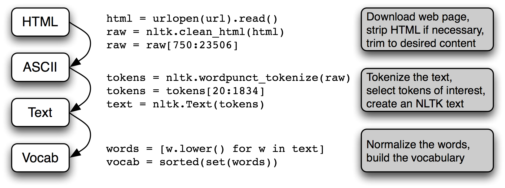
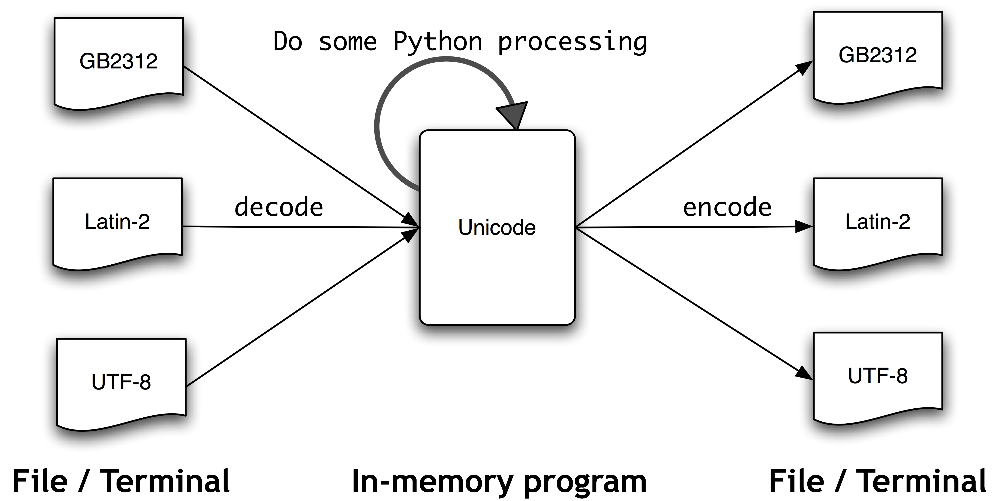
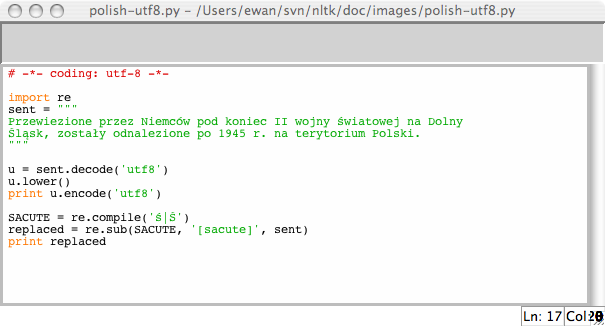
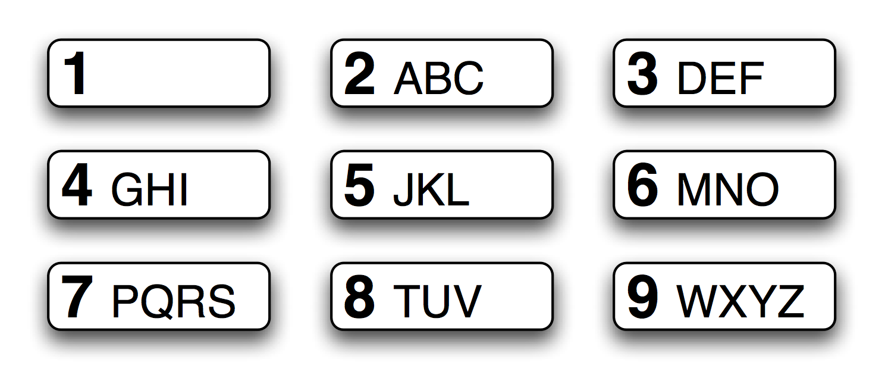
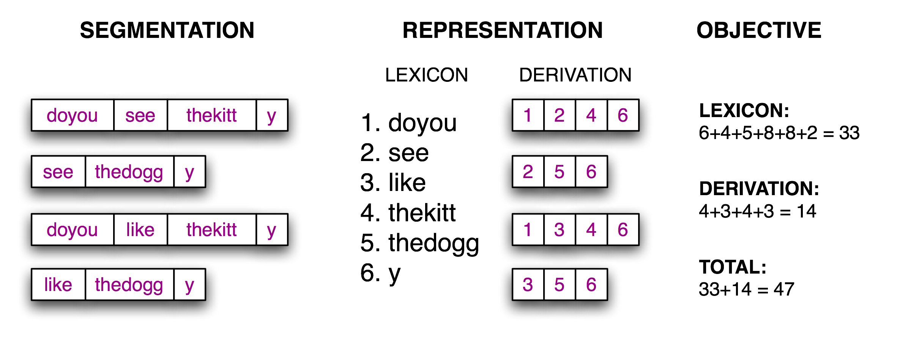

# 3 处理原始文本

文本的最重要来源无疑是网络。探索现成的文本集合，如我们在前面章节中看到的语料库，是很方便的。然而，在你心中可能有你自己的文本来源，需要学习如何访问它们。

本章的目的是要回答下列问题：

1.  我们怎样才能编写程序访问本地和网络上的文件，从而获得无限的语言材料？
2.  我们如何把文档分割成单独的词和标点符号，这样我们就可以开始像前面章节中在文本语料上做的那样的分析？
3.  我们怎样编程程序产生格式化的输出，并把结果保存在一个文件中？

为了解决这些问题，我们将讲述 NLP 中的关键概念，包括分词和词干提取。在此过程中，你会巩固你的 Python 知识并且了解关于字符串、文件和正则表达式知识。既然这些网络上的文本都是 HTML 格式的，我们也将看到如何去除 HTML 标记。

注意

**重点**：从本章开始往后我们的例子程序将假设你以下面的导入语句开始你的交互式会话或程序：

```py
>>> from __future__ import division  # Python 2 users only
>>> import nltk, re, pprint
>>> from nltk import word_tokenize
```

## 3.1 从网络和硬盘访问文本

### 电子书

NLTK 语料库集合中有古腾堡项目的一小部分样例文本。然而，你可能对分析古腾堡项目的其它文本感兴趣。你可以在`http://www.gutenberg.org/catalog/`上浏览 25,000 本免费在线书籍的目录，获得 ASCII 码文本文件的 URL。虽然 90% 的古腾堡项目的文本是英语的，它还包括超过 50 种语言的材料，包括加泰罗尼亚语、中文、荷兰语、芬兰语、法语、德语、意大利语、葡萄牙语和西班牙语（每种语言都有超过 100 个文本）。

编号 2554 的文本是《罪与罚》的英文翻译，我们可以如下方式访问它。

```py
>>> from urllib import request
>>> url = "http://www.gutenberg.org/files/2554/2554.txt"
>>> response = request.urlopen(url)
>>> raw = response.read().decode('utf8')
>>> type(raw)
<class 'str'>
>>> len(raw)
1176893
>>> raw[:75]
'The Project Gutenberg EBook of Crime and Punishment, by Fyodor Dostoevsky\r\n'
```

注意

`read()`过程将需要几秒钟来下载这本大书。如果你使用的互联网代理 Python 不能正确检测出来，你可能需要在使用`urlopen`之前用下面的方法手动指定代理：

```py
>>> proxies = {'http': 'http://www.someproxy.com:3128'}
>>> request.ProxyHandler(proxies)
```

变量`raw`包含一个有 1,176,893 个字符的字符串。（我们使用`type(raw)`可以看到它是一个字符串。）这是这本书原始的内容，包括很多我们不感兴趣的细节，如空格、换行符和空行。请注意，文件中行尾的`\r`和`\n`，这是 Python 用来显示特殊的回车和换行字符的方式（这个文件一定是在 Windows 机器上创建的）。对于语言处理，我们要将字符串分解为词和标点符号，正如我们在 1 中所看到的。这一步被称为分词，它产生我们所熟悉的结构，一个词汇和标点符号的列表。

```py
>>> tokens = word_tokenize(raw)
>>> type(tokens)
<class 'list'>
>>> len(tokens)
254354
>>> tokens[:10]
['The', 'Project', 'Gutenberg', 'EBook', 'of', 'Crime', 'and', 'Punishment', ',', 'by']
```

请注意，分词需要 NLTK，但所有前面的打开一个 URL 以及读入一个字符串的任务都不需要。如果我们现在采取进一步的步骤从这个列表创建一个 NLTK 文本，我们可以进行我们在 1 中看到的所有的其他语言的处理，也包括常规的列表操作例如切片：

```py
>>> text = nltk.Text(tokens)
>>> type(text)
<class 'nltk.text.Text'>
>>> text[1024:1062]
['CHAPTER', 'I', 'On', 'an', 'exceptionally', 'hot', 'evening', 'early', 'in',
 'July', 'a', 'young', 'man', 'came', 'out', 'of', 'the', 'garret', 'in',
 'which', 'he', 'lodged', 'in', 'S.', 'Place', 'and', 'walked', 'slowly',
 ',', 'as', 'though', 'in', 'hesitation', ',', 'towards', 'K.', 'bridge', '.']
>>> text.collocations()
Katerina Ivanovna; Pyotr Petrovitch; Pulcheria Alexandrovna; Avdotya
Romanovna; Rodion Romanovitch; Marfa Petrovna; Sofya Semyonovna; old
woman; Project Gutenberg-tm; Porfiry Petrovitch; Amalia Ivanovna;
great deal; Nikodim Fomitch; young man; Ilya Petrovitch; n't know;
Project Gutenberg; Dmitri Prokofitch; Andrey Semyonovitch; Hay Market
```

请注意，`Project Gutenberg`以一个搭配出现。这是因为从古腾堡项目下载的每个文本都包含一个首部，里面有文本的名称、作者、扫描和校对文本的人的名字、许可证等信息。有时这些信息出现在文件末尾页脚处。我们不能可靠地检测出文本内容的开始和结束，因此在从`原始`文本中挑出正确内容且没有其它内容之前，我们需要手工检查文件以发现标记内容开始和结尾的独特的字符串：

```py
>>> raw.find("PART I")
5338
>>> raw.rfind("End of Project Gutenberg's Crime")
1157743
>>> raw = raw[5338:1157743] ❶
>>> raw.find("PART I")
0
```

方法`find()`和`rfind()`（反向查找）帮助我们得到字符串切片需要用到的正确的索引值❶。我们用这个切片重新给`raw`赋值，所以现在它以`PART I`开始一直到（但不包括）标记内容结尾的句子。

这是我们第一次接触到网络的实际内容：在网络上找到的文本可能含有不必要的内容，并没有一个自动的方法来去除它。但只需要少量的额外工作，我们就可以提取出我们需要的材料。

### 处理 HTML

网络上的文本大部分是 HTML 文件的形式。你可以使用网络浏览器将网页作为文本保存为本地文件，然后按照下面关于文件的小节描述的那样来访问它。不过，如果你要经常这样做，最简单的办法是直接让 Python 来做这份工作。第一步是像以前一样使用`urlopen`。为了好玩，我们将挑选一个被称为《Blondes to die out in 200 years》的 BBC 新闻故事，一个都市传奇被 BBC 作为确立的科学事实流传下来：

```py
>>> url = "http://news.bbc.co.uk/2/hi/health/2284783.stm"
>>> html = request.urlopen(url).read().decode('utf8')
>>> html[:60]
'<!doctype html public "-//W3C//DTD HTML 4.0 Transitional//EN'
```

你可以输入`print(html)`来查看 HTML 的全部内容，包括元标签、图像标签、`map`标签、JavaScript、表单和表格。

要得到 HTML 的文本，我们将使用一个名为 *BeautifulSoup* 的 Python 库，可从`http://www.crummy.com/software/BeautifulSoup/`访问：

```py
>>> from bs4 import BeautifulSoup
>>> raw = BeautifulSoup(html).get_text()
>>> tokens = word_tokenize(raw)
>>> tokens
['BBC', 'NEWS', '|', 'Health', '|', 'Blondes', "'to", 'die', 'out', ...]
```

它仍然含有不需要的内容，包括网站导航及有关报道等。通过一些尝试和出错你可以找到内容索引的开始和结尾，并选择你感兴趣的词符，按照前面讲的那样初始化一个文本。

```py
>>> tokens = tokens[110:390]
>>> text = nltk.Text(tokens)
>>> text.concordance('gene')
Displaying 5 of 5 matches:
hey say too few people now carry the gene for blondes to last beyond the next
blonde hair is caused by a recessive gene . In order for a child to have blond
have blonde hair , it must have the gene on both sides of the family in the g
ere is a disadvantage of having that gene or by chance . They do n't disappear
des would disappear is if having the gene was a disadvantage and I do not thin
```

### 处理搜索引擎的结果

网络可以被看作未经标注的巨大的语料库。网络搜索引擎提供了一个有效的手段，搜索大量文本作为有关的语言学的例子。搜索引擎的主要优势是规模：因为你正在寻找这样庞大的一个文件集，会更容易找到你感兴趣语言模式。而且，你可以使用非常具体的模式，仅仅在较小的范围匹配一两个例子，但在网络上可能匹配成千上万的例子。网络搜索引擎的第二个优势是非常容易使用。因此，它是一个非常方便的工具，可以快速检查一个理论是否合理。

表 3.1：

搭配的谷歌命中次数：`absolutely`或`definitely`后面跟着`adore`, `love`, `like`或 `prefer`的搭配的命中次数。（Liberman, in *LanguageLog*, 2005）。

```py
>>> import feedparser
>>> llog = feedparser.parse("http://languagelog.ldc.upenn.edu/nll/?feed=atom")
>>> llog['feed']['title']
'Language Log'
>>> len(llog.entries)
15
>>> post = llog.entries[2]
>>> post.title
"He's My BF"
>>> content = post.content[0].value
>>> content[:70]
'<p>Today I was chatting with three of our visiting graduate students f'
>>> raw = BeautifulSoup(content).get_text()
>>> word_tokenize(raw)
['Today', 'I', 'was', 'chatting', 'with', 'three', 'of', 'our', 'visiting',
'graduate', 'students', 'from', 'the', 'PRC', '.', 'Thinking', 'that', 'I',
'was', 'being', 'au', 'courant', ',', 'I', 'mentioned', 'the', 'expression',
'DUI4XIANG4', '\u5c0d\u8c61', '("', 'boy', '/', 'girl', 'friend', '"', ...]
```

伴随着一些更深入的工作，我们可以编写程序创建一个博客帖子的小语料库，并以此作为我们 NLP 的工作基础。

### 读取本地文件

为了读取本地文件，我们需要使用 Python 内置的`open()`函数，然后是`read()`方法。假设你有一个文件`document.txt`，你可以像这样加载它的内容：

```py
>>> f = open('document.txt')
>>> raw = f.read()
```

注意

**轮到你来**：使用文本编辑器创建一个名为`document.txt`的文件，然后输入几行文字，保存为纯文本。如果你使用 IDLE，在`File`菜单中选择`New Window`命令，在新窗口中输入所需的文本，然后在 IDLE 提供的弹出式对话框中的文件夹内保存文件为`document.txt`。然后在 Python 解释器中使用`f = open('document.txt')`打开这个文件，并使用`print(f.read())`检查其内容。

当你尝试这样做时可能会出各种各样的错误。如果解释器无法找到你的文件，你会看到类似这样的错误：

```py
>>> f = open('document.txt')
Traceback (most recent call last):
File "<pyshell#7>", line 1, in -toplevel-
f = open('document.txt')
IOError: [Errno 2] No such file or directory: 'document.txt'
```

要检查你正试图打开的文件是否在正确的目录中，使用 IDLE `File`菜单上的`Open`命令；另一种方法是在 Python 中检查当前目录：

```py
>>> import os
>>> os.listdir('.')
```

另一个你在访问一个文本文件时可能遇到的问题是换行的约定，这个约定因操作系统不同而不同。内置的`open()`函数的第二个参数用于控制如何打开文件：`open('document.txt', 'rU')` —— `'r'`意味着以只读方式打开文件（默认），`'U'`表示“通用”，它让我们忽略不同的换行约定。

假设你已经打开了该文件，有几种方法可以阅读此文件。`read()`方法创建了一个包含整个文件内容的字符串：

```py
>>> f.read()
'Time flies like an arrow.\nFruit flies like a banana.\n'
```

回想一`'\n'`字符是换行符；这相当于按键盘上的`Enter`开始一个新行。

我们也可以使用一个`for`循环一次读文件中的一行：

```py
>>> f = open('document.txt', 'rU')
>>> for line in f:
...     print(line.strip())
Time flies like an arrow.
Fruit flies like a banana.
```

在这里，我们使用`strip()`方法删除输入行结尾的换行符。

NLTK 中的语料库文件也可以使用这些方法来访问。我们只需使用`nltk.data.find()`来获取语料库项目的文件名。然后就可以使用我们刚才讲的方式打开和阅读它：

```py
>>> path = nltk.data.find('corpora/gutenberg/melville-moby_dick.txt')
>>> raw = open(path, 'rU').read()
```

### 从 PDF、MS Word 及其他二进制格式中提取文本

ASCII 码文本和 HTML 文本是人可读的格式。文字常常以二进制格式出现，如 PDF 和 MSWord，只能使用专门的软件打开。第三方函数库如`pypdf`和`pywin32`提供了对这些格式的访问。从多列文档中提取文本是特别具有挑战性的。一次性转换几个文件，会比较简单些，用一个合适的应用程序打开文件，以文本格式保存到本地驱动器，然后以如下所述的方式访问它。如果该文档已经在网络上，你可以在 Google 的搜索框输入它的 URL。搜索结果通常包括这个文档的 HTML 版本的链接，你可以将它保存为文本。

### 捕获用户输入

有时我们想捕捉用户与我们的程序交互时输入的文本。调用 Python 函数`input()`提示用户输入一行数据。保存用户输入到一个变量后，我们可以像其他字符串那样操纵它。

```py
>>> s = input("Enter some text: ")
Enter some text: On an exceptionally hot evening early in July
>>> print("You typed", len(word_tokenize(s)), "words.")
You typed 8 words.
```

### NLP 的流程

3.1 总结了我们在本节涵盖的内容，包括我们在第一章中所看到的建立一个词汇表的过程。（其中一个步骤，规范化，将在 3.6 讨论。）



图 3.1：处理流程：打开一个 URL，读里面 HTML 格式的内容，去除标记，并选择字符的切片；然后分词，是否转换为`nltk.Text`对象是可选择的；我们也可以将所有词汇小写并提取词汇表。

在这条流程后面还有很多操作。要正确理解它，这样有助于明确其中提到的每个变量的类型。使用`type(x)`我们可以找出任一 Python 对象`x`的类型，如`type(1)`是`<int>`因为`1`是一个整数。

当我们载入一个 URL 或文件的内容时，或者当我们去掉 HTML 标记时，我们正在处理字符串，也就是 Python 的`<str>`数据类型。（在 3.2 节，我们将学习更多有关字符串的内容）：

```py
>>> raw = open('document.txt').read()
>>> type(raw)
<class 'str'>
```

当我们将一个字符串分词，会产生一个（词的）列表，这是 Python 的`<list>`类型。规范化和排序列表产生其它列表：

```py
>>> tokens = word_tokenize(raw)
>>> type(tokens)
<class 'list'>
>>> words = [w.lower() for w in tokens]
>>> type(words)
<class 'list'>
>>> vocab = sorted(set(words))
>>> type(vocab)
<class 'list'>
```

一个对象的类型决定了它可以执行哪些操作。比如我们可以追加一个链表，但不能追加一个字符串：

```py
>>> vocab.append('blog')
>>> raw.append('blog')
Traceback (most recent call last):
 File "<stdin>", line 1, in <module>
AttributeError: 'str' object has no attribute 'append'
```

同样的，我们可以连接字符串与字符串，列表与列表，但我们不能连接字符串与列表：

```py
>>> query = 'Who knows?'
>>> beatles = ['john', 'paul', 'george', 'ringo']
>>> query + beatles
Traceback (most recent call last):
 File "<stdin>", line 1, in <module>
TypeError: cannot concatenate 'str' and 'list' objects
```

## 3.2 字符串：最底层的文本处理

现在是时候研究一个之前我们一直故意避开的基本数据类型了。在前面的章节中，我们侧重于将文本作为一个词列表。我们并没有细致的探讨词汇以及它们是如何在编程语言中被处理的。通过使用 NLTK 中的语料库接口，我们可以忽略这些文本所在的文件。一个词的内容，一个文件的内容在编程语言中是由一个叫做字符串的基本数据类型来表示的。在本节中，我们将详细探讨字符串，并展示字符串与词汇、文本和文件之间的联系。

### 字符串的基本操作

可以使用单引号❶或双引号❷来指定字符串，如下面的例子代码所示。如果一个字符串中包含一个单引号，我们必须在单引号前加反斜杠❸让 Python 知道这是字符串中的单引号，或者也可以将这个字符串放入双引号中❷。否则，字符串内的单引号❹将被解释为字符串结束标志，Python 解释器会报告一个语法错误：

```py
>>> monty = 'Monty Python' ❶
>>> monty
'Monty Python'
>>> circus = "Monty Python's Flying Circus" ❷
>>> circus
"Monty Python's Flying Circus"
>>> circus = 'Monty Python\'s Flying Circus' ❸
>>> circus
"Monty Python's Flying Circus"
>>> circus = 'Monty Python's Flying Circus' ❹
 File "<stdin>", line 1
 circus = 'Monty Python's Flying Circus'
 ^
SyntaxError: invalid syntax
```

有时字符串跨好几行。Python 提供了多种方式表示它们。在下面的例子中，一个包含两个字符串的序列被连接为一个字符串。我们需要使用反斜杠❶或者括号❷，这样解释器就知道第一行的表达式不完整。

```py
>>> couplet = "Shall I compare thee to a Summer's day?"\
...           "Thou are more lovely and more temperate:" ❶
>>> print(couplet)
Shall I compare thee to a Summer's day?Thou are more lovely and more temperate:
>>> couplet = ("Rough winds do shake the darling buds of May,"
...           "And Summer's lease hath all too short a date:") ❷
>>> print(couplet)
Rough winds do shake the darling buds of May,And Summer's lease hath all too short a date:
```

不幸的是，这些方法并没有展现给我们十四行诗的两行之间的换行。为此，我们可以使用如下所示的三重引号的字符串：

```py
>>> couplet = """Shall I compare thee to a Summer's day?
... Thou are more lovely and more temperate:"""
>>> print(couplet)
Shall I compare thee to a Summer's day?
Thou are more lovely and more temperate:
>>> couplet = '''Rough winds do shake the darling buds of May,
... And Summer's lease hath all too short a date:'''
>>> print(couplet)
Rough winds do shake the darling buds of May,
And Summer's lease hath all too short a date:
```

现在我们可以定义字符串，也可以在上面尝试一些简单的操作。首先，让我们来看看`+`操作，被称为连接❶。此操作产生一个新字符串，它是两个原始字符串首尾相连粘贴在一起而成。请注意，连接不会做一些比较聪明的事，例如在词汇之间插入空格。我们甚至可以对字符串用乘法❷：

```py
>>> 'very' + 'very' + 'very' ❶
'veryveryvery'
>>> 'very' * 3 ❷
'veryveryvery'
```

注意

**轮到你来**：试运行下面的代码，然后尝试使用你对字符串`+`和`*`操作的理解，弄清楚它是如何运作的。要小心区分字符串`' '`，这是一个空格符，和字符串`''`，这是一个空字符串。

```py
>>> a = [1, 2, 3, 4, 5, 6, 7, 6, 5, 4, 3, 2, 1]
>>> b = [' ' * 2 * (7 - i) + 'very' * i for i in a]
>>> for line in b:
...     print(line)
```

我们已经看到加法和乘法运算不仅仅适用于数字也适用于字符串。但是，请注意，我们不能对字符串用减法或除法：

```py
>>> 'very' - 'y'
Traceback (most recent call last):
 File "<stdin>", line 1, in <module>
TypeError: unsupported operand type(s) for -: 'str' and 'str'
>>> 'very' / 2
Traceback (most recent call last):
 File "<stdin>", line 1, in <module>
TypeError: unsupported operand type(s) for /: 'str' and 'int'
```

这些错误消息是 Python 的另一个例子，告诉我们的数据类型混乱。第一种情况告诉我们减法操作（即`-`) 不能适用于`str`（字符串）对象类型，而第二种情况告诉我们除法的两个操作数不能分别为`str`和`int`。

### 输出字符串

到目前为止，当我们想看看变量的内容或想看到计算的结果，我们就把变量的名称输入到解释器。我们还可以使用`print`语句来看一个变量的内容：

```py
>>> print(monty)
Monty Python
```

请注意这次是没有引号的。当我们通过输入变量的名字到解释器中来检查它时，解释器输出 Python 中的变量的值。因为它是一个字符串，结果被引用。然而，当我们告诉解释器`print`这个变量时，我们没有看到引号字符，因为字符串的内容里面没有引号。

`print`语句可以多种方式将多个元素显示在一行，就像这样：

```py
>>> grail = 'Holy Grail'
>>> print(monty + grail)
Monty PythonHoly Grail
>>> print(monty, grail)
Monty Python Holy Grail
>>> print(monty, "and the", grail)
Monty Python and the Holy Grail
```

### 访问单个字符

正如我们在 2 看到的列表，字符串也是被索引的，从零开始。当我们索引一个字符串时，我们得到它的一个字符（或字母）。一个单独的字符并没有什么特别，它只是一个长度为`1`的字符串。

```py
>>> monty[0]
'M'
>>> monty[3]
't'
>>> monty[5]
' '
```

与列表一样，如果我们尝试访问一个超出字符串范围的索引时，会得到了一个错误：

```py
>>> monty[20]
Traceback (most recent call last):
 File "<stdin>", line 1, in ?
IndexError: string index out of range
```

也与列表一样，我们可以使用字符串的负数索引，其中`-1`是最后一个字符的索引❶。正数和负数的索引给我们两种方式指示一个字符串中的任何位置。在这种情况下，当一个字符串长度为 12 时，索引`5`和`-7`都指示相同的字符（一个空格）。（请注意，`5 = len(monty) - 7`。）

```py
>>> monty[-1] ❶
'n'
>>> monty[5]
' '
>>> monty[-7]
' '
```

我们可以写一个`for`循环，遍历字符串中的字符。`print`函数包含可选的`end=' '`参数，这是为了告诉 Python 不要在行尾输出换行符。

```py
>>> sent = 'colorless green ideas sleep furiously'
>>> for char in sent:
...     print(char, end=' ')
...
c o l o r l e s s   g r e e n   i d e a s   s l e e p   f u r i o u s l y
```

我们也可以计数单个字符。通过将所有字符小写来忽略大小写的区分，并过滤掉非字母字符。

```py
>>> from nltk.corpus import gutenberg
>>> raw = gutenberg.raw('melville-moby_dick.txt')
>>> fdist = nltk.FreqDist(ch.lower() for ch in raw if ch.isalpha())
>>> fdist.most_common(5)
[('e', 117092), ('t', 87996), ('a', 77916), ('o', 69326), ('n', 65617)]
>>> [char for (char, count) in fdist.most_common()]
['e', 't', 'a', 'o', 'n', 'i', 's', 'h', 'r', 'l', 'd', 'u', 'm', 'c', 'w',
'f', 'g', 'p', 'b', 'y', 'v', 'k', 'q', 'j', 'x', 'z']
```

```py
>>> monty[6:10]
'Pyth'
```

在这里，我们看到的字符是`'P'`, `'y'`, `'t'`和`'h'`，它们分别对应于`monty[6]` ... `monty[9]`而不包括`monty[10]`。这是因为切片开始于第一个索引，但结束于最后一个索引的前一个。

我们也可以使用负数索引切片——也是同样的规则，从第一个索引开始到最后一个索引的前一个结束；在这里是在空格字符前结束。

```py
>>> monty[-12:-7]
'Monty'
```

与列表切片一样，如果我们省略了第一个值，子字符串将从字符串的开头开始。如果我们省略了第二个值，则子字符串直到字符串的结尾结束：

```py
>>> monty[:5]
'Monty'
>>> monty[6:]
'Python'
```

我们使用`in`操作符测试一个字符串是否包含一个特定的子字符串，如下所示：

```py
>>> phrase = 'And now for something completely different'
>>> if 'thing' in phrase:
...     print('found "thing"')
found "thing"
```

我们也可以使用`find()`找到一个子字符串在字符串内的位置：

```py
>>> monty.find('Python')
6
```

注意

**轮到你来**：造一句话，将它分配给一个变量， 例如，`sent = 'my sentence...'`。写切片表达式抽取个别词。（这显然不是一种方便的方式来处理文本中的词！）

### 更多的字符串操作

Python 对处理字符串的支持很全面。3.2.所示是一个总结，其中包括一些我们还没有看到的操作。关于字符串的更多信息，可在 Python 提示符下输入`help(str)`。

表 3.2：

有用的字符串方法：4.2 中字符串测试之外的字符串上的操作；所有的方法都产生一个新的字符串或列表

```py
>>> query = 'Who knows?'
>>> beatles = ['John', 'Paul', 'George', 'Ringo']
>>> query[2]
'o'
>>> beatles[2]
'George'
>>> query[:2]
'Wh'
>>> beatles[:2]
['John', 'Paul']
>>> query + " I don't"
"Who knows? I don't"
>>> beatles + 'Brian'
Traceback (most recent call last):
 File "<stdin>", line 1, in <module>
TypeError: can only concatenate list (not "str") to list
>>> beatles + ['Brian']
['John', 'Paul', 'George', 'Ringo', 'Brian']
```

当我们在一个 Python 程序中打开并读入一个文件，我们得到一个对应整个文件内容的字符串。如果我们使用一个`for`循环来处理这个字符串元素，所有我们可以挑选出的只是单个的字符——我们不选择粒度。相比之下，列表中的元素可以很大也可以很小，只要我们喜欢：例如，它们可能是段落、句子、短语、单词、字符。所以，列表的优势是我们可以灵活的决定它包含的元素，相应的后续的处理也变得灵活。因此，我们在一段 NLP 代码中可能做的第一件事情就是将一个字符串分词放入一个字符串列表中`(3.7)`。相反，当我们要将结果写入到一个文件或终端，我们通常会将它们格式化为一个字符串`(3.9)`。

列表与字符串没有完全相同的功能。列表具有增强的能力使你可以改变其中的元素：

```py
>>> beatles[0] = "John Lennon"
>>> del beatles[-1]
>>> beatles
['John Lennon', 'Paul', 'George']
```

另一方面，如果我们尝试在一个*字符串*上这么做——将`query`的第 0 个字符修改为`'F'`——我们得到：

```py
>>> query[0] = 'F'
Traceback (most recent call last):
 File "<stdin>", line 1, in ?
TypeError: object does not support item assignment
```

这是因为字符串是不可变的：一旦你创建了一个字符串，就不能改变它。然而，列表是可变的，其内容可以随时修改。作为一个结论，列表支持修改原始值的操作，而不是产生一个新的值。

注意

**轮到你来**：通过尝试本章结尾的一些练习，巩固你的字符串知识。

## 3.3 使用 Unicode 进行文字处理

我们的程序经常需要处理不同的语言和不同的字符集。“纯文本”的概念是虚构的。如果你住在讲英语国家，你可能在使用 ASCII 码而没有意识到这一点。如果你住在欧洲，你可能使用一种扩展拉丁字符集，包含丹麦语和挪威语中的`ø`，匈牙利语中的`ő`，西班牙和布列塔尼语中的`ñ`，捷克语和斯洛伐克语中的`ň`。在本节中，我们将概述如何使用 Unicode 处理使用非 ASCII 字符集的文本。

### 什么是 Unicode？

Unicode 支持超过一百万种字符。每个字符分配一个编号，称为编码点。在 Python 中，编码点写作`\u*XXXX*`的形式，其中`*XXXX*`是四位十六进制形式数。

在一个程序中，我们可以像普通字符串那样操纵 Unicode 字符串。然而，当 Unicode 字符被存储在文件或在终端上显示，它们必须被编码为字节流。一些编码（如 ASCII 和 Latin-2）中每个编码点使用单字节，所以它们可以只支持 Unicode 的一个小的子集，足够单个语言使用了。其它的编码（如 UTF-8）使用多个字节，可以表示全部的 Unicode 字符。

文件中的文本都是有特定编码的，所以我们需要一些机制来将文本翻译成 Unicode——翻译成 Unicode 叫做解码。相对的，要将 Unicode 写入一个文件或终端，我们首先需要将 Unicode 转化为合适的编码——这种将 Unicode 转化为其它编码的过程叫做编码，如 3.3 所示。



图 3.3：Unicode 解码和编码

从 Unicode 的角度来看，字符是可以实现一个或多个字形的抽象的实体。只有字形可以出现在屏幕上或被打印在纸上。一个字体是一个字符到字形映射。

### 从文件中提取已编码文本

假设我们有一个小的文本文件，我们知道它是如何编码的。例如，`polish-lat2.txt`顾名思义是波兰语的文本片段（来源波兰语 Wikipedia；可以在`http://pl.wikipedia.org/wiki/Biblioteka_Pruska`中看到）。此文件是 Latin-2 编码的，也称为 ISO-8859-2。`nltk.data.find()`函数为我们定位文件。

```py
>>> path = nltk.data.find('corpora/unicode_samples/polish-lat2.txt')
```

Python 的`open()`函数可以读取编码的数据为 Unicode 字符串，并写出 Unicode 字符串的编码形式。它采用一个参数来指定正在读取或写入的文件的编码。因此，让我们使用编码`'latin2'`打开我们波兰语文件，并检查该文件的内容：

```py
>>> f = open(path, encoding='latin2')
>>> for line in f:
...    line = line.strip()
...    print(line)
Pruska Biblioteka Państwowa. Jej dawne zbiory znane pod nazwą
"Berlinka" to skarb kultury i sztuki niemieckiej. Przewiezione przez
Niemców pod koniec II wojny światowej na Dolny Śląsk, zostały
odnalezione po 1945 r. na terytorium Polski. Trafiły do Biblioteki
Jagiellońskiej w Krakowie, obejmują ponad 500 tys. zabytkowych
archiwaliów, m.in. manuskrypty Goethego, Mozarta, Beethovena, Bacha.
```

如果这不能在你的终端正确显示，或者我们想要看到字符的底层数值（或“代码点”），那么我们可以将所有的非 ASCII 字符转换成它们两位数`\x*XX*`和四位数`\u*XXXX*`表示法：

```py
>>> f = open(path, encoding='latin2')
>>> for line in f:
...     line = line.strip()
...     print(line.encode('unicode_escape'))
b'Pruska Biblioteka Pa\\u0144stwowa. Jej dawne zbiory znane pod nazw\\u0105'
b'"Berlinka" to skarb kultury i sztuki niemieckiej. Przewiezione przez'
b'Niemc\\xf3w pod koniec II wojny \\u015bwiatowej na Dolny \\u015al\\u0105sk, zosta\\u0142y'
b'odnalezione po 1945 r. na terytorium Polski. Trafi\\u0142y do Biblioteki'
b'Jagiello\\u0144skiej w Krakowie, obejmuj\\u0105 ponad 500 tys. zabytkowych'
b'archiwali\\xf3w, m.in. manuskrypty Goethego, Mozarta, Beethovena, Bacha.'
```

上面输出的第一行有一个以`\u`转义字符串开始的 Unicode 转义字符串，即`\u0144`。相关的 Unicode 字符在屏幕上将显示为字形`ń`。在前面例子中的第三行中，我们看到`\xf3`，对应字形为ó，在 128-255 的范围内。

在 Python 3 中，源代码默认使用 UTF-8 编码，如果你使用的 IDLE 或另一个支持 Unicode 的程序编辑器，你可以在字符串中包含 Unicode 字符。可以使用`\u*XXXX*`转义序列包含任意的 Unicode 字符。我们使用`ord()`找到一个字符的整数序数。例如：

```py
>>> ord('ń')
324
```

324 的 4 位十六进制数字的形式是 0144（输入`hex(324)`可以发现这点），我们可以定义一个具有适当转义序列的字符串。

```py
>>> nacute = '\u0144'
>>> nacute
'ń'
```

注意

决定屏幕上显示的字形的因素很多。如果你确定你的编码正确但你的 Python 代码仍然未能显示出你预期的字形，你应该检查你的系统上是否安装了所需的字体。可能需要配置你的区域设置来渲染 UTF-8 编码的字符，然后使用`print(nacute.encode('utf8'))`才能在你的终端看到ń显示。

我们还可以看到这个字符在一个文本文件内是如何表示为字节序列的：

```py
>>> nacute.encode('utf8')
b'\xc5\x84'
```

`unicodedata`模块使我们可以检查 Unicode 字符的属性。在下面的例子中，我们选择超出 ASCII 范围的波兰语文本的第三行中的所有字符，输出它们的 UTF-8 转义值，然后是使用标准 Unicode 约定的它们的编码点整数（即以`U+`为前缀的十六进制数字），随后是它们的 Unicode 名称。

```py
>>> import unicodedata
>>> lines = open(path, encoding='latin2').readlines()
>>> line = lines[2]
>>> print(line.encode('unicode_escape'))
b'Niemc\\xf3w pod koniec II wojny \\u015bwiatowej na Dolny \\u015al\\u0105sk, zosta\\u0142y\\n'
>>> for c in line: ❶
...     if ord(c) > 127:
...         print('{} U+{:04x} {}'.format(c.encode('utf8'), ord(c), unicodedata.name(c)))
b'\xc3\xb3' U+00f3 LATIN SMALL LETTER O WITH ACUTE
b'\xc5\x9b' U+015b LATIN SMALL LETTER S WITH ACUTE
b'\xc5\x9a' U+015a LATIN CAPITAL LETTER S WITH ACUTE
b'\xc4\x85' U+0105 LATIN SMALL LETTER A WITH OGONEK
b'\xc5\x82' U+0142 LATIN SMALL LETTER L WITH STROKE
```

如果你使用`c`替换掉❶中的`c.encode('utf8')`，如果你的系统支持 UTF-8，你应该看到类似下面的输出：

ó U+00f3 LATIN SMALL LETTER O WITH ACUTEś U+015b LATIN SMALL LETTER S WITH ACUTEŚ U+015a LATIN CAPITAL LETTER S WITH ACUTEą U+0105 LATIN SMALL LETTER A WITH OGONEKł U+0142 LATIN SMALL LETTER L WITH STROKE

另外，根据你的系统的具体情况，你可能需要用`'latin2'`替换示例中的编码`'utf8'`。

下一个例子展示 Python 字符串函数和`re`模块是如何能够与 Unicode 字符一起工作的。（我们会在下面一节中仔细看看`re`模块。`\w`匹配一个“单词字符”，参见 3.4）。

```py
>>> line.find('zosta\u0142y')
54
>>> line = line.lower()
>>> line
'niemców pod koniec ii wojny światowej na dolny śląsk, zostały\n'
>>> line.encode('unicode_escape')
b'niemc\\xf3w pod koniec ii wojny \\u015bwiatowej na dolny \\u015bl\\u0105sk, zosta\\u0142y\\n'
>>> import re
>>> m = re.search('\u015b\w*', line)
>>> m.group()
'\u015bwiatowej'
```

NLTK 分词器允许 Unicode 字符串作为输入，并输出相应地 Unicode 字符串。

```py
>>> word_tokenize(line)
['niemców', 'pod', 'koniec', 'ii', 'wojny', 'światowej', 'na', 'dolny', 'śląsk', ',', 'zostały']
```

### 在 Python 中使用本地编码

如果你习惯了使用特定的本地编码字符，你可能希望能够在一个 Python 文件中使用你的字符串输入及编辑的标准方法。为了做到这一点，你需要在你的文件的第一行或第二行中包含字符串：`'# -*- coding: >coding> -*-'`。请注意`<coding>`必须是像`'latin-1'`, `'big5'`或`'utf-8'`这样的字符串 （见 3.4）。



图 3.4：Unicode 与 IDLE：IDLE 编辑器中 UTF-8 编码的字符串字面值；这需要在 IDLE 属性中设置了相应的字体；这里我们选择 Courier CE。

上面的例子还说明了正规表达式是如何可以使用编码的字符串的。

## 3.4 使用正则表达式检测词组搭配

许多语言处理任务都涉及模式匹配。例如：我们可以使用`endswith('ed')`找到以`ed`结尾的词。在 4.2 中我们看到过各种这样的“词测试”。正则表达式给我们一个更加强大和灵活的方法描述我们感兴趣的字符模式。

注意

介绍正则表达式的其他出版物有很多，它们围绕正则表达式的语法组织，应用于搜索文本文件。我们不再赘述这些，只专注于在语言处理的不同阶段如何使用正则表达式。像往常一样，我们将采用基于问题的方式，只在解决实际问题需要时才介绍新特性。在我们的讨论中，我们将使用箭头来表示正则表达式，就像这样：`patt`。

在 Python 中使用正则表达式，需要使用`import re`导入`re`库。我们还需要一个用于搜索的词汇列表；我们再次使用词汇语料库`(4)`。我们将对它进行预处理消除某些名称。

```py
>>> import re
>>> wordlist = [w for w in nltk.corpus.words.words('en') if w.islower()]
```

### 使用基本的元字符

让我们使用正则表达式`'ed$'`，我们将使用函数`re.search(p, s)`检查字符串`s`中是否有模式`p`。我们需要指定感兴趣的字符，然后使用美元符号，它是正则表达式中有特殊用途的符号，用来匹配单词的末尾：

```py
>>> [w for w in wordlist if re.search('ed$', w)]
['abaissed', 'abandoned', 'abased', 'abashed', 'abatised', 'abed', 'aborted', ...]
```

`.`通配符匹配任何单个字符。假设我们有一个 8 个字母组成的词的字谜室，`j`是其第三个字母，`t`是其第六个字母。空白单元格中的每个地方，我们用一个句点：

```py
>>> [w for w in wordlist if re.search('^..j..t..$', w)]
['abjectly', 'adjuster', 'dejected', 'dejectly', 'injector', 'majestic', ...]
```

注意

**轮到你来**：驼字符`^`匹配字符串的开始，就像如果我们不用这两个符号而使用`..j..t..`搜索，刚才例子中我们会得到什么样的结果？

最后，`?`符号表示前面的字符是可选的。因此我们可以使用`sum(1 for w in text if re.search('^e-?mail', w))`计数一个文本中这个词（任一拼写形式）出现的总次数。

### 范围与闭包



图 3.5：T9：9 个键上的文本

T9 系统用于在手机上输入文本（见 3.5)）。两个或两个以上以相同击键顺序输入的词汇，叫做 textonyms。例如，`hole`和`golf`都是通过序列 4653 输入。还有哪些其它词汇由相同的序列产生？这里我们使用正则表达式`'^[ghi][mno][jlk][def]$'`。

```py
>>> [w for w in wordlist if re.search('^[ghi][mno][jlk][def]$', w)]
['gold', 'golf', 'hold', 'hole']
```

表达式的第一部分`^[ghi]`匹配以`g, h, i`开始的词。表达式的下一部分，`[mno]`限制了第二个字符是`m, n, o`。第三部分和第四部分同样被限制。只有 4 个单词满足这些限制。注意，方括号内的字符的顺序是没有关系的，所以我们可以写成`^[hig][nom][ljk][fed]$`

注意

**轮到你来**：来看一些“手指绕口令”，只用一部分数字键盘搜索词汇。例如`^[ghijklmno]+`的`+`表示什么意思？

让我们进一步探索`+`符号。请注意，它可以适用于单个字母或括号内的字母集：

```py
>>> chat_words = sorted(set(w for w in nltk.corpus.nps_chat.words()))
>>> [w for w in chat_words if re.search('^m+i+n+e+$', w)]
['miiiiiiiiiiiiinnnnnnnnnnneeeeeeeeee', 'miiiiiinnnnnnnnnneeeeeeee', 'mine',
'mmmmmmmmiiiiiiiiinnnnnnnnneeeeeeee']
>>> [w for w in chat_words if re.search('^[ha]+$', w)]
['a', 'aaaaaaaaaaaaaaaaa', 'aaahhhh', 'ah', 'ahah', 'ahahah', 'ahh',
'ahhahahaha', 'ahhh', 'ahhhh', 'ahhhhhh', 'ahhhhhhhhhhhhhh', 'h', 'ha', 'haaa',
'hah', 'haha', 'hahaaa', 'hahah', 'hahaha', 'hahahaa', 'hahahah', 'hahahaha', ...]
```

很显然，`+`简单地表示“前面的项目的一个或多个实例”，它可以是单独的字母如`m`，可以是一个集合如`[fed]`或者一个范围如`[d-f]`。现在让我们用`*`替换`+`，它表示“前面的项目的零个或多个实例”。正则表达式`^m*i*n*e*`匹配`me`, `min`和`mmmmm`。请注意`+`和`*`符号有时被称为的 Kleene 闭包，或者干脆闭包。

运算符`^`当它出现在方括号内的第一个字符位置时有另外的功能。例如，`[^aeiouAEIOU]`匹配除元音字母之外的所有字母。我们可以搜索 NPS 聊天语料库中完全由非元音字母组成的词汇，使用`^[^aeiouAEIOU]+`。请注意其中包含非字母字符。

下面是另外一些正则表达式的例子，用来寻找匹配特定模式的词符，这些例子演示如何使用一些新的符号：`\`, `{}`, `()`和`|`。

```py
>>> wsj = sorted(set(nltk.corpus.treebank.words()))
>>> [w for w in wsj if re.search('^[0-9]+\.[0-9]+$', w)]
['0.0085', '0.05', '0.1', '0.16', '0.2', '0.25', '0.28', '0.3', '0.4', '0.5',
'0.50', '0.54', '0.56', '0.60', '0.7', '0.82', '0.84', '0.9', '0.95', '0.99',
'1.01', '1.1', '1.125', '1.14', '1.1650', '1.17', '1.18', '1.19', '1.2', ...]
>>> [w for w in wsj if re.search('^[A-Z]+\$$', w)]
['C$', 'US$']
>>> [w for w in wsj if re.search('^[0-9]{4}$', w)]
['1614', '1637', '1787', '1901', '1903', '1917', '1925', '1929', '1933', ...]
>>> [w for w in wsj if re.search('^[0-9]+-[a-z]{3,5}$', w)]
['10-day', '10-lap', '10-year', '100-share', '12-point', '12-year', ...]
>>> [w for w in wsj if re.search('^[a-z]{5,}-[a-z]{2,3}-[a-z]{,6}$', w)]
['black-and-white', 'bread-and-butter', 'father-in-law', 'machine-gun-toting',
'savings-and-loan']
>>> [w for w in wsj if re.search('(ed|ing)$', w)]
['62%-owned', 'Absorbed', 'According', 'Adopting', 'Advanced', 'Advancing', ...]
```

注意

**轮到你来**：研究前面的例子，在你继续阅读之前尝试弄清楚`\`, `{}`, `()`和`|`这些符号的功能。

你可能已经知道反斜杠表示其后面的字母不再有特殊的含义而是按照字面的表示匹配词中特定的字符。因此，虽然`.`很特别，但是`\.`只匹配一个句号。大括号表达式，如`{3,5}`, 表示前面的项目重复指定次数。管道字符表示从其左边的内容和右边的内容中选择一个。圆括号表示一个操作符的范围，它们可以与管道（或叫析取）符号一起使用，如`w(i|e|ai|oo)t`，匹配`wit`, `wet`, `wait`和`woot`。你可以省略这个例子里的最后一个表达式中的括号，使用`ed|ing`。

我们已经看到的元字符总结在 3.3 中：

表 3.3：

正则表达式基本元字符，其中包括通配符，范围和闭包

```py
>>> word = 'supercalifragilisticexpialidocious'
>>> re.findall(r'[aeiou]', word)
['u', 'e', 'a', 'i', 'a', 'i', 'i', 'i', 'e', 'i', 'a', 'i', 'o', 'i', 'o', 'u']
>>> len(re.findall(r'[aeiou]', word))
16
```

让我们来看看一些文本中的两个或两个以上的元音序列，并确定它们的相对频率：

```py
>>> wsj = sorted(set(nltk.corpus.treebank.words()))
>>> fd = nltk.FreqDist(vs for word in wsj
...                       for vs in re.findall(r'[aeiou]{2,}', word))
>>> fd.most_common(12)
[('io', 549), ('ea', 476), ('ie', 331), ('ou', 329), ('ai', 261), ('ia', 253),
('ee', 217), ('oo', 174), ('ua', 109), ('au', 106), ('ue', 105), ('ui', 95)]
```

注意

**轮到你来**：在 W3C 日期时间格式中，日期像这样表示：2009-12-31。将以下 Python 代码中的`?`替换为正则表达式, 以便将字符串`'2009-12-31'`转换为整数列表`[2009, 12, 31]`：

`[int(n) for n in re.findall(?, '2009-12-31')]`

### 在单词片段上做更多事情

一旦我们会使用`re.findall()`从单词中提取素材，就可以在这些片段上做一些有趣的事情，例如将它们粘贴在一起或用它们绘图。

英文文本是高度冗余的，忽略掉词内部的元音仍然可以很容易的阅读，有些时候这很明显。例如，`declaration`变成`dclrtn`，`inalienable`变成`inlnble`，保留所有词首或词尾的元音序列。在我们的下一个例子中，正则表达式匹配词首元音序列，词尾元音序列和所有的辅音；其它的被忽略。这三个析取从左到右处理，如果词匹配三个部分中的一个，正则表达式后面的部分将被忽略。我们使用`re.findall()`提取所有匹配的词中的字符，然后使`''.join()`将它们连接在一起（更多连接操作参见 3.9）。

```py
>>> regexp = r'^[AEIOUaeiou]+|[AEIOUaeiou]+$|[^AEIOUaeiou]'
>>> def compress(word):
...     pieces = re.findall(regexp, word)
...     return ''.join(pieces)
...
>>> english_udhr = nltk.corpus.udhr.words('English-Latin1')
>>> print(nltk.tokenwrap(compress(w) for w in english_udhr[:75]))
Unvrsl Dclrtn of Hmn Rghts Prmble Whrs rcgntn of the inhrnt dgnty and
of the eql and inlnble rghts of all mmbrs of the hmn fmly is the fndtn
of frdm , jstce and pce in the wrld , Whrs dsrgrd and cntmpt fr hmn
rghts hve rsltd in brbrs acts whch hve outrgd the cnscnce of mnknd ,
and the advnt of a wrld in whch hmn bngs shll enjy frdm of spch and
```

接下来，让我们将正则表达式与条件频率分布结合起来。在这里，我们将从罗托卡特语词汇中提取所有辅音-元音序列，如`ka`和`si`。因为每部分都是成对的，它可以被用来初始化一个条件频率分布。然后我们为每对的频率画出表格：

```py
>>> rotokas_words = nltk.corpus.toolbox.words('rotokas.dic')
>>> cvs = [cv for w in rotokas_words for cv in re.findall(r'[ptksvr][aeiou]', w)]
>>> cfd = nltk.ConditionalFreqDist(cvs)
>>> cfd.tabulate()
 a    e    i    o    u
k  418  148   94  420  173
p   83   31  105   34   51
r  187   63   84   89   79
s    0    0  100    2    1
t   47    8    0  148   37
v   93   27  105   48   49
```

考查`s`行和`t`行，我们看到它们是部分的“互补分布”，这个证据表明它们不是这种语言中的独特音素。从而我们可以令人信服的从罗托卡特语字母表中去除`s`，简单加入一个发音规则：当字母`t`跟在`i`后面时发`s`的音。（注意单独的条目`su`即`kasuari`，`cassowary`是从英语中借来的）。

如果我们想要检查表格中数字背后的词汇，有一个索引允许我们迅速找到包含一个给定的辅音-元音对的单词的列表将会有帮助，例如，`cv_index['su']`应该给我们所有含有`su`的词汇。下面是我们如何能做到这一点：

```py
>>> cv_word_pairs = [(cv, w) for w in rotokas_words
...                          for cv in re.findall(r'[ptksvr][aeiou]', w)]
>>> cv_index = nltk.Index(cv_word_pairs)
>>> cv_index['su']
['kasuari']
>>> cv_index['po']
['kaapo', 'kaapopato', 'kaipori', 'kaiporipie', 'kaiporivira', 'kapo', 'kapoa',
'kapokao', 'kapokapo', 'kapokapo', 'kapokapoa', 'kapokapoa', 'kapokapora', ...]
```

这段代码依次处理每个词`w`，对每一个词找出匹配正则表达式`[ptksvr][aeiou]`的所有子字符串。对于词`kasuari`，它找到`ka`, `su`和`ri`。因此，`cv_word_pairs`将包含`('ka', 'kasuari')`, `('su', 'kasuari')`和`('ri', 'kasuari')`。更进一步使用`nltk.Index()`转换成有用的索引。

### 查找词干

在使用网络搜索引擎时，我们通常不介意（甚至没有注意到）文档中的词汇与我们的搜索条件的后缀形式是否相同。查询`laptops`会找到含有`laptop`的文档，反之亦然。事实上，`laptop`与`laptops`只是词典中的同一个词（或词条）的两种形式。对于一些语言处理任务，我们想忽略词语结尾，只是处理词干。

抽出一个词的词干的方法有很多种。这里的是一种简单直观的方法，直接去掉任何看起来像一个后缀的字符：

```py
>>> def stem(word):
...     for suffix in ['ing', 'ly', 'ed', 'ious', 'ies', 'ive', 'es', 's', 'ment']:
...         if word.endswith(suffix):
...             return word[:-len(suffix)]
...     return word
```

虽然我们最终将使用 NLTK 中内置的词干提取器，看看我们如何能够使用正则表达式处理这个任务是有趣的。我们的第一步是建立一个所有后缀的连接。我们需要把它放在括号内以限制这个析取的范围。

```py
>>> re.findall(r'^.*(ing|ly|ed|ious|ies|ive|es|s|ment)$', 'processing')
['ing']
```

在这里，尽管正则表达式匹配整个单词，`re.findall()`只是给我们后缀。这是因为括号有第二个功能：选择要提取的子字符串。如果我们要使用括号来指定析取的范围，但不想选择要输出的字符串，必须添加`?:`，它是正则表达式许多神秘奥妙的地方之一。下面是改进后的版本。

```py
>>> re.findall(r'^.*(?:ing|ly|ed|ious|ies|ive|es|s|ment)$', 'processing')
['processing']
```

然而，实际上，我们会想将词分成词干和后缀。所以，我们应该用括号括起正则表达式的这两个部分：

```py
>>> re.findall(r'^(.*)(ing|ly|ed|ious|ies|ive|es|s|ment)$', 'processing')
[('process', 'ing')]
```

这看起来很有用途，但仍然有一个问题。让我们来看看另外的词，`processes`：

```py
>>> re.findall(r'^(.*)(ing|ly|ed|ious|ies|ive|es|s|ment)$', 'processes')
[('processe', 's')]
```

正则表达式错误地找到了后缀`-s`，而不是后缀`-es`。这表明另一个微妙之处：星号操作符是“贪婪的”，所以表达式的`.*`部分试图尽可能多的匹配输入的字符串。如果我们使用“非贪婪”版本的`*`操作符，写成`*?`，我们就得到我们想要的：

```py
>>> re.findall(r'^(.*?)(ing|ly|ed|ious|ies|ive|es|s|ment)$', 'processes')
[('process', 'es')]
```

我们甚至可以通过使第二个括号中的内容变成可选，来得到空后缀：

```py
>>> re.findall(r'^(.*?)(ing|ly|ed|ious|ies|ive|es|s|ment)?$', 'language')
[('language', '')]
```

这种方法仍然有许多问题，（你能发现它们吗？）但我们仍将继续定义一个函数来获取词干，并将它应用到整个文本：

```py
>>> def stem(word):
...     regexp = r'^(.*?)(ing|ly|ed|ious|ies|ive|es|s|ment)?$'
...     stem, suffix = re.findall(regexp, word)[0]
...     return stem
...
>>> raw = """DENNIS: Listen, strange women lying in ponds distributing swords
... is no basis for a system of government.  Supreme executive power derives from
... a mandate from the masses, not from some farcical aquatic ceremony."""
>>> tokens = word_tokenize(raw)
>>> [stem(t) for t in tokens]
['DENNIS', ':', 'Listen', ',', 'strange', 'women', 'ly', 'in', 'pond', 'distribut',
'sword', 'i', 'no', 'basi', 'for', 'a', 'system', 'of', 'govern', '.', 'Supreme',
'execut', 'power', 'deriv', 'from', 'a', 'mandate', 'from', 'the', 'mass', ',',
'not', 'from', 'some', 'farcical', 'aquatic', 'ceremony', '.']
```

请注意我们的正则表达式不但将`ponds`的`s`删除，也将`is`和`basis`的删除。它产生一些非词如`distribut`和`deriv`，但这些在一些应用中是可接受的词干。

### 搜索已分词文本

你可以使用一种特殊的正则表达式搜索一个文本中多个词（这里的文本是一个词符列表）。例如，`">a> >man>"`找出文本中所有`a man`的实例。尖括号用于标记词符的边界，尖括号之间的所有空白都被忽略（这只对 NLTK 中的`findall()`方法处理文本有效）。在下面的例子中，我们使用`<.*>`❶，它将匹配所有单个词符，将它括在括号里，于是只匹配词（例如`monied`）而不匹配短语（例如，`a monied man`）会生成。第二个例子找出以词`bro`结尾的三个词组成的短语❷。最后一个例子找出以字母`l`开始的三个或更多词组成的序列❸。

```py
>>> from nltk.corpus import gutenberg, nps_chat
>>> moby = nltk.Text(gutenberg.words('melville-moby_dick.txt'))
>>> moby.findall(r"<a> (<.*>) <man>") ❶
monied; nervous; dangerous; white; white; white; pious; queer; good;
mature; white; Cape; great; wise; wise; butterless; white; fiendish;
pale; furious; better; certain; complete; dismasted; younger; brave;
brave; brave; brave
>>> chat = nltk.Text(nps_chat.words())
>>> chat.findall(r"<.*> <.*> <bro>") ❷
you rule bro; telling you bro; u twizted bro
>>> chat.findall(r"<l.*>{3,}") ❸
lol lol lol; lmao lol lol; lol lol lol; la la la la la; la la la; la
la la; lovely lol lol love; lol lol lol.; la la la; la la la
```

注意

**轮到你来**：巩固你对正则表达式模式与替换的理解，使用`nltk.re_show(p, s)`，它能标注字符串`s`中所有匹配模式`p`的地方，以及`nltk.app.nemo()`，它能提供一个探索正则表达式的图形界面。更多的练习，可以尝试本章尾的正则表达式的一些练习。

当我们研究的语言现象与特定词语相关时建立搜索模式是很容易的。在某些情况下，一个小小的创意可能会花很大功夫。例如，在大型文本语料库中搜索`x and other ys`形式的表达式能让我们发现上位词（见 5）：

```py
>>> from nltk.corpus import brown
>>> hobbies_learned = nltk.Text(brown.words(categories=['hobbies', 'learned']))
>>> hobbies_learned.findall(r"<\w*> <and> <other> <\w*s>")
speed and other activities; water and other liquids; tomb and other
landmarks; Statues and other monuments; pearls and other jewels;
charts and other items; roads and other features; figures and other
objects; military and other areas; demands and other factors;
abstracts and other compilations; iron and other metals
```

只要有足够多的文本，这种做法会给我们一整套有用的分类标准信息，而不需要任何手工劳动。然而，我们的搜索结果中通常会包含误报，即我们想要排除的情况。例如，结果`demands and other factors`暗示`demand`是类型`factor`的一个实例，但是这句话实际上是关于要求增加工资的。尽管如此，我们仍可以通过手工纠正这些搜索的结果来构建自己的英语概念的本体。

注意

这种自动和人工处理相结合的方式是最常见的建造新的语料库的方式。我们将在 11 继续讲述这些。

搜索语料也会有遗漏的问题，即漏掉了我们想要包含的情况。仅仅因为我们找不到任何一个搜索模式的实例，就断定一些语言现象在一个语料库中不存在，是很冒险的。也许我们只是没有足够仔细的思考合适的模式。

注意

**轮到你来**：查找模式`as x as y`的实例以发现实体及其属性信息。

## 3.6 规范化文本

在前面的程序例子中，我们在处理文本词汇前经常要将文本转换为小写，即`set(w.lower() for w in text)`。通过使用`lower()`我们将文本规范化为小写，这样一来`The`与`the`的区别被忽略。我们常常想比这走得更远，去掉所有的词缀以及提取词干的任务等。更进一步的步骤是确保结果形式是字典中确定的词，即叫做词形归并的任务。我们依次讨论这些。首先，我们需要定义我们将在本节中使用的数据：

```py
>>> raw = """DENNIS: Listen, strange women lying in ponds distributing swords
... is no basis for a system of government.  Supreme executive power derives from
... a mandate from the masses, not from some farcical aquatic ceremony."""
>>> tokens = word_tokenize(raw)
```

### 词干提取器

NLTK 中包括几个现成的词干提取器，如果你需要一个词干提取器，你应该优先使用它们中的一个，而不是使用正则表达式制作自己的词干提取器，因为 NLTK 中的词干提取器能处理的不规则的情况很广泛。`Porter`和`Lancaster`词干提取器按照它们自己的规则剥离词缀。请看`Porter`词干提取器正确处理了词`lying`（将它映射为`lie`），而`Lancaster`词干提取器并没有处理好。

```py
>>> porter = nltk.PorterStemmer()
>>> lancaster = nltk.LancasterStemmer()
>>> [porter.stem(t) for t in tokens]
['DENNI', ':', 'Listen', ',', 'strang', 'women', 'lie', 'in', 'pond',
'distribut', 'sword', 'is', 'no', 'basi', 'for', 'a', 'system', 'of', 'govern',
'.', 'Suprem', 'execut', 'power', 'deriv', 'from', 'a', 'mandat', 'from',
'the', 'mass', ',', 'not', 'from', 'some', 'farcic', 'aquat', 'ceremoni', '.']
>>> [lancaster.stem(t) for t in tokens]
['den', ':', 'list', ',', 'strange', 'wom', 'lying', 'in', 'pond', 'distribut',
'sword', 'is', 'no', 'bas', 'for', 'a', 'system', 'of', 'govern', '.', 'suprem',
'execut', 'pow', 'der', 'from', 'a', 'mand', 'from', 'the', 'mass', ',', 'not',
'from', 'som', 'farc', 'aqu', 'ceremony', '.']
```

词干提取过程没有明确定义，我们通常选择心目中最适合我们的应用的词干提取器。如果你要索引一些文本和使搜索支持不同词汇形式的话，`Porter`词干提取器是一个很好的选择（3.6 所示，它采用*面向对象*编程技术，这超出了本书的范围，字符串格式化技术将在 3.9 讲述，`enumerate()`函数将在 4.2 解释）。

```py
class IndexedText(object):

    def __init__(self, stemmer, text):
        self._text = text
        self._stemmer = stemmer
        self._index = nltk.Index((self._stem(word), i)
                                 for (i, word) in enumerate(text))

    def concordance(self, word, width=40):
        key = self._stem(word)
        wc = int(width/4)                # words of context
        for i in self._index[key]:
            lcontext = ' '.join(self._text[i-wc:i])
            rcontext = ' '.join(self._text[i:i+wc])
            ldisplay = '{:>{width}}'.format(lcontext[-width:], width=width)
            rdisplay = '{:{width}}'.format(rcontext[:width], width=width)
            print(ldisplay, rdisplay)

    def _stem(self, word):
        return self._stemmer.stem(word).lower()
```

### 词形归并

WordNet 词形归并器只在产生的词在它的词典中时才删除词缀。这个额外的检查过程使词形归并器比刚才提到的词干提取器要慢。请注意，它并没有处理`lying`，但它将`women`转换为`woman`。

```py
>>> wnl = nltk.WordNetLemmatizer()
>>> [wnl.lemmatize(t) for t in tokens]
['DENNIS', ':', 'Listen', ',', 'strange', 'woman', 'lying', 'in', 'pond',
'distributing', 'sword', 'is', 'no', 'basis', 'for', 'a', 'system', 'of',
'government', '.', 'Supreme', 'executive', 'power', 'derives', 'from', 'a',
'mandate', 'from', 'the', 'mass', ',', 'not', 'from', 'some', 'farcical',
'aquatic', 'ceremony', '.']
```

如果你想编译一些文本的词汇，或者想要一个有效词条（或中心词）列表，WordNet 词形归并器是一个不错的选择。

注意

另一个规范化任务涉及识别非标准词，包括数字、缩写、日期以及映射任何此类词符到一个特殊的词汇。例如，每一个十进制数可以被映射到一个单独的标识符`0.0`，每首字母缩写可以映射为`AAA`。这使词汇量变小，提高了许多语言建模任务的准确性。

## 3.7 用正则表达式为文本分词

分词是将字符串切割成可识别的构成一块语言数据的语言单元。虽然这是一项基础任务，我们能够一直拖延到现在为止才讲，是因为许多语料库已经分过词了，也因为 NLTK 中包括一些分词器。现在你已经熟悉了正则表达式，你可以学习如何使用它们来为文本分词，并对此过程中有更多的掌控权。

### 分词的简单方法

文本分词的一种非常简单的方法是在空格符处分割文本。考虑以下摘自《爱丽丝梦游仙境》中的文本：

```py
>>> raw = """'When I'M a Duchess,' she said to herself, (not in a very hopeful tone
... though), 'I won't have any pepper in my kitchen AT ALL. Soup does very
... well without--Maybe it's always pepper that makes people hot-tempered,'..."""
```

我们可以使用`raw.split()`在空格符处分割原始文本。使用正则表达式能做同样的事情，匹配字符串中的所有空格符❶是不够的，因为这将导致分词结果包含`\n`换行符；我们需要匹配任何数量的空格符、制表符或换行符❷：

```py
>>> re.split(r' ', raw) ❶
["'When", "I'M", 'a', "Duchess,'", 'she', 'said', 'to', 'herself,', '(not', 'in',
'a', 'very', 'hopeful', 'tone\nthough),', "'I", "won't", 'have', 'any', 'pepper',
'in', 'my', 'kitchen', 'AT', 'ALL.', 'Soup', 'does', 'very\nwell', 'without--Maybe',
"it's", 'always', 'pepper', 'that', 'makes', 'people', "hot-tempered,'..."]
>>> re.split(r'[ \t\n]+', raw) ❷
["'When", "I'M", 'a', "Duchess,'", 'she', 'said', 'to', 'herself,', '(not', 'in',
'a', 'very', 'hopeful', 'tone', 'though),', "'I", "won't", 'have', 'any', 'pepper',
'in', 'my', 'kitchen', 'AT', 'ALL.', 'Soup', 'does', 'very', 'well', 'without--Maybe',
"it's", 'always', 'pepper', 'that', 'makes', 'people', "hot-tempered,'..."]
```

正则表达式`[ \t\n]+`匹配一个或多个空格、制表符（`\t`）或换行符（`\n`）。其他空白字符，如回车和换页符，实际上应该也包含。于是，我们将使用一个`re`库内置的缩写`\s`，它表示匹配所有空白字符。前面的例子中第二条语句可以改写为`re.split(r'\s+', raw)`。

注意

**要点**：记住在正则表达式前加字母`r`（表示“原始的”），它告诉 Python 解释器按照字面表示对待字符串，而不去处理正则表达式中包含的反斜杠字符。

在空格符处分割文本给我们如`'(not'`和`'herself,'`这样的词符。另一种方法是使用 Python 提供给我们的字符类`\w`匹配词中的字符，相当于`[a-zA-Z0-9_]`。它还定义了这个类的补集`\W`，即所有字母、数字和下划线以外的字符。我们可以在一个简单的正则表达式中用`\W`来分割所有单词字符*以外*的输入：

```py
>>> re.split(r'\W+', raw)
['', 'When', 'I', 'M', 'a', 'Duchess', 'she', 'said', 'to', 'herself', 'not', 'in',
'a', 'very', 'hopeful', 'tone', 'though', 'I', 'won', 't', 'have', 'any', 'pepper',
'in', 'my', 'kitchen', 'AT', 'ALL', 'Soup', 'does', 'very', 'well', 'without',
'Maybe', 'it', 's', 'always', 'pepper', 'that', 'makes', 'people', 'hot', 'tempered',
'']
```

可以看到，在开始和结尾都给了我们一个空字符串（要了解原因请尝试`'xx'.split('x')`）。通过`re.findall(r'\w+', raw)`使用模式匹配词汇而不是空白符号，我们得到相同的标识符，但没有空字符串。现在，我们正在匹配词汇，我们处在扩展正则表达式覆盖更广泛的情况的位置。正则表达式`\w+|\S\w*`将首先尝试匹配词中字符的所有序列。如果没有找到匹配的，它会尝试匹配后面跟着词中字符的任何*非*空白字符（`\S`是`\s`的补）。这意味着标点会与跟在后面的字母（如`'s`）在一起，但两个或两个以上的标点字符序列会被分割。

```py
>>> re.findall(r'\w+|\S\w*', raw)
["'When", 'I', "'M", 'a', 'Duchess', ',', "'", 'she', 'said', 'to', 'herself', ',',
'(not', 'in', 'a', 'very', 'hopeful', 'tone', 'though', ')', ',', "'I", 'won', "'t",
'have', 'any', 'pepper', 'in', 'my', 'kitchen', 'AT', 'ALL', '.', 'Soup', 'does',
'very', 'well', 'without', '-', '-Maybe', 'it', "'s", 'always', 'pepper', 'that',
'makes', 'people', 'hot', '-tempered', ',', "'", '.', '.', '.']
```

让我们扩展前面表达式中的`\w+`，允许连字符和撇号：`\w+([-']\w+)*`。这个表达式表示`\w+`后面跟零个或更多`[-']\w+`的实例；它会匹配`hot-tempered`和`it's`。（我们需要在这个表达式中包含`?:`，原因前面已经讨论过。）我们还将添加一个模式来匹配引号字符，让它们与它们包括的文字分开。

```py
>>> print(re.findall(r"\w+(?:[-']\w+)*|'|[-.(]+|\S\w*", raw))
["'", 'When', "I'M", 'a', 'Duchess', ',', "'", 'she', 'said', 'to', 'herself', ',',
'(', 'not', 'in', 'a', 'very', 'hopeful', 'tone', 'though', ')', ',', "'", 'I',
"won't", 'have', 'any', 'pepper', 'in', 'my', 'kitchen', 'AT', 'ALL', '.', 'Soup',
'does', 'very', 'well', 'without', '--', 'Maybe', "it's", 'always', 'pepper',
'that', 'makes', 'people', 'hot-tempered', ',', "'", '...']
```

上面的表达式也包括`[-.(]+`，这会使双连字符、省略号和左括号被单独分词。

3.4 列出了我们已经在本节中看到的正则表达式字符类符号，以及一些其他有用的符号。

表 3.4：

正则表达式符号

```py
>>> text = 'That U.S.A. poster-print costs $12.40...'
>>> pattern = r'''(?x)    # set flag to allow verbose regexps
...     ([A-Z]\.)+        # abbreviations, e.g. U.S.A.
...   | \w+(-\w+)*        # words with optional internal hyphens
...   | \$?\d+(\.\d+)?%?  # currency and percentages, e.g. $12.40, 82%
...   | \.\.\.            # ellipsis
...   | [][.,;"'?():-_`]  # these are separate tokens; includes ], [
... '''
>>> nltk.regexp_tokenize(text, pattern)
['That', 'U.S.A.', 'poster-print', 'costs', '$12.40', '...']
```

使用 verbose 标志时，不可以再使用`' '`来匹配一个空格字符；使用`\s`代替。`regexp_tokenize()`函数有一个可选的`gaps`参数。设置为`True`时，正则表达式指定标识符间的距离，就像使用`re.split()`一样。

注意

我们可以使用`set(tokens).difference(wordlist)`通过比较分词结果与一个词表，然后报告任何没有在词表出现的标识符，来评估一个分词器。你可能想先将所有标记变成小写。

### 分词的进一步问题

分词是一个比你可能预期的要更为艰巨的任务。没有单一的解决方案能在所有领域都行之有效，我们必须根据应用领域的需要决定那些是词符。

在开发分词器时，访问已经手工分词的原始文本是有益的，这可以让你的分词器的输出结果与高品质（或称“黄金标准”）的词符进行比较。NLTK 语料库集合包括宾州树库的数据样本，包括《华尔街日报》原始文本（`nltk.corpus.treebank_raw.raw()`）和分好词的版本（`nltk.corpus.treebank.words()`）。

分词的最后一个问题是缩写的存在，如`didn't`。如果我们想分析一个句子的意思，将这种形式规范化为两个独立的形式：`did`和`n't`（或`not`）可能更加有用。我们可以通过查表来做这项工作。

## 3.8 分割

本节将讨论更高级的概念，你在第一次阅读本章时可能更愿意跳过本节。

分词是一个更普遍的分割问题的一个实例。在本节中，我们将看到这个问题的另外两个实例，它们使用与到目前为止我们已经在本章看到的完全不同的技术。

### 断句

在词级水平处理文本通常假定能够将文本划分成单个句子。正如我们已经看到，一些语料库已经提供句子级别的访问。在下面的例子中，我们计算布朗语料库中每个句子的平均词数：

```py
>>> len(nltk.corpus.brown.words()) / len(nltk.corpus.brown.sents())
20.250994070456922
```

在其他情况下，文本可能只是作为一个字符流。在将文本分词之前，我们需要将它分割成句子。NLTK 通过包含`Punkt`句子分割器（Kiss & Strunk, 2006）使得这个功能便于使用。这里是使用它为一篇小说文本断句的例子。（请注意，如果在你读到这篇文章时分割器内部数据已经更新过，你会看到不同的输出）：

```py
>>> text = nltk.corpus.gutenberg.raw('chesterton-thursday.txt')
>>> sents = nltk.sent_tokenize(text)
>>> pprint.pprint(sents[79:89])
['"Nonsense!"',
 'said Gregory, who was very rational when anyone else\nattempted paradox.',
 '"Why do all the clerks and navvies in the\n'
 'railway trains look so sad and tired, so very sad and tired?',
 'I will\ntell you.',
 'It is because they know that the train is going right.',
 'It\n'
 'is because they know that whatever place they have taken a ticket\n'
 'for that place they will reach.',
 'It is because after they have\n'
 'passed Sloane Square they know that the next station must be\n'
 'Victoria, and nothing but Victoria.',
 'Oh, their wild rapture!',
 'oh,\n'
 'their eyes like stars and their souls again in Eden, if the next\n'
 'station were unaccountably Baker Street!"',
 '"It is you who are unpoetical," replied the poet Syme.']
```

请注意，这个例子其实是一个单独的句子，报道 Lucian Gregory 先生的演讲。然而，引用的演讲包含几个句子，这些已经被分割成几个单独的字符串。这对于大多数应用程序是合理的行为。

断句是困难的，因为句号会被用来标记缩写而另一些句号同时标记缩写和句子结束，就像发生在缩写如`U.S.A.`上的那样。

断句的另一种方法见 2 节。

### 分词

对于一些书写系统，由于没有词的可视边界表示这一事实，文本分词变得更加困难。例如，在中文中，三个字符的字符串：爱国人`(ai4 "love" [verb], guo3 "country", ren2 "person")` 可以被分词为“爱国/人”，`country-loving person`，或者“爱/国人”，`love country-person`。

类似的问题在口语语言处理中也会出现，听者必须将连续的语音流分割成单个的词汇。当我们事先不认识这些词时，这个问题就演变成一个特别具有挑战性的版本。语言学习者会面对这个问题，例如小孩听父母说话。考虑下面的人为构造的例子，单词的边界已被去除：

```py
>>> text = "doyouseethekittyseethedoggydoyoulikethekittylikethedoggy"
>>> seg1 = "0000000000000001000000000010000000000000000100000000000"
>>> seg2 = "0100100100100001001001000010100100010010000100010010000"
```

观察由 0 和 1 组成的分词表示字符串。它们比源文本短一个字符，因为长度为`n`文本可以在`n-1`个地方被分割。3.7 中的`segment()`函数演示了我们可以从这个表示回到初始分词的文本。

```py
def segment(text, segs):
    words = []
    last = 0
    for i in range(len(segs)):
        if segs[i] == '1':
            words.append(text[last:i+1])
            last = i+1
    words.append(text[last:])
    return words
```

现在分词的任务变成了一个搜索问题：找到将文本字符串正确分割成词汇的字位串。我们假定学习者接收词，并将它们存储在一个内部词典中。给定一个合适的词典，是能够由词典中的词的序列来重构源文本的。根据（Brent, 1995），我们可以定义一个目标函数，一个打分函数，我们将基于词典的大小和从词典中重构源文本所需的信息量尽力优化它的值。我们在 3.8 中说明了这些。



图 3.8：计算目标函数：给定一个假设的源文本的分词（左），推导出一个词典和推导表，它能让源文本重构，然后合计每个词项（包括边界标志）与推导表的字符数，作为分词质量的得分；得分值越小表明分词越好。

实现这个目标函数是很简单的，如例子 3.9 所示。

```py
def evaluate(text, segs):
    words = segment(text, segs)
    text_size = len(words)
    lexicon_size = sum(len(word) + 1 for word in set(words))
    return text_size + lexicon_size
```

最后一步是寻找最小化目标函数值的 0 和 1 的模式，如 3.10 所示。请注意，最好的分词包括像`thekitty`这样的“词”，因为数据中没有足够的证据进一步分割这个词。

```py
from random import randint

def flip(segs, pos):
    return segs[:pos] + str(1-int(segs[pos])) + segs[pos+1:]

def flip_n(segs, n):
    for i in range(n):
        segs = flip(segs, randint(0, len(segs)-1))
    return segs

def anneal(text, segs, iterations, cooling_rate):
    temperature = float(len(segs))
    while temperature > 0.5:
        best_segs, best = segs, evaluate(text, segs)
        for i in range(iterations):
            guess = flip_n(segs, round(temperature))
            score = evaluate(text, guess)
            if score < best:
                best, best_segs = score, guess
        score, segs = best, best_segs
        temperature = temperature / cooling_rate
        print(evaluate(text, segs), segment(text, segs))
    print()
    return segs
```

有了足够的数据，就可能以一个合理的准确度自动将文本分割成词汇。这种方法可用于为那些词的边界没有任何视觉表示的书写系统分词。

## 3.9 格式化：从列表到字符串

我们经常会写程序来汇报一个单独的数据项例如一个语料库中满足一些复杂的标准的特定的元素，或者一个单独的总数统计例如一个词计数器或一个标注器的性能。更多的时候，我们写程序来产生一个结构化的结果；例如：一个数字或语言形式的表格，或原始数据的格式变换。当要表示的结果是语言时，文字输出通常是最自然的选择。然而当结果是数值时，可能最好是图形输出。在本节中，你将会学到呈现程序输出的各种方式。

### 从列表到字符串

我们用于文本处理的最简单的一种结构化对象是词列表。当我们希望把这些输出到显示器或文件时，必须把这些词列表转换成字符串。在 Python 做这些，我们使用`join()`方法，并指定字符串作为使用的“胶水”。

```py
>>> silly = ['We', 'called', 'him', 'Tortoise', 'because', 'he', 'taught', 'us', '.']
>>> ' '.join(silly)
'We called him Tortoise because he taught us .'
>>> ';'.join(silly)
'We;called;him;Tortoise;because;he;taught;us;.'
>>> ''.join(silly)
'WecalledhimTortoisebecausehetaughtus.'
```

所以`' '.join(silly)`的意思是：取出`silly`中的所有项目，将它们连接成一个大的字符串，使用`' '`作为项目之间的间隔符。即`join()`是一个你想要用来作为胶水的字符串的一个方法。（许多人感到`join()`的这种表示方法是违反直觉的。）`join()`方法只适用于一个字符串的列表——我们一直把它叫做一个文本——在 Python 中享有某些特权的一个复杂类型。

### 字符串与格式

我们已经看到了有两种方式显示一个对象的内容：

```py
>>> word = 'cat'
>>> sentence = """hello
... world"""
>>> print(word)
cat
>>> print(sentence)
hello
world
>>> word
'cat'
>>> sentence
'hello\nworld'
```

`print`命令让 Python 努力以人最可读的形式输出的一个对象的内容。第二种方法——叫做变量提示——向我们显示可用于重新创建该对象的字符串。重要的是要记住这些都仅仅是字符串，为了你用户的方便而显示的。它们并不会给我们实际对象的内部表示的任何线索。

还有许多其他有用的方法来将一个对象作为字符串显示。这可能是为了人阅读的方便，或是因为我们希望导出我们的数据到一个特定的能被外部程序使用的文件格式。

格式化输出通常包含变量和预先指定的字符串的一个组合，例如给定一个频率分布`fdist`，我们可以这样做：

```py
>>> fdist = nltk.FreqDist(['dog', 'cat', 'dog', 'cat', 'dog', 'snake', 'dog', 'cat'])
>>> for word in sorted(fdist):
...     print(word, '->', fdist[word], end='; ')
cat -> 3; dog -> 4; snake -> 1;
```

输出包含变量和常量交替出现的表达式是难以阅读和维护的。一个更好的解决办法是使用字符串格式化表达式。

```py
>>> for word in sorted(fdist):
...    print('{}->{};'.format(word, fdist[word]), end=' ')
cat->3; dog->4; snake->1;
```

要了解这里发生了什么事情，让我们在字符串格式化表达式上面测试一下。（现在，这将是你探索新语法的常用方法。）

```py
>>> '{}->{};'.format ('cat', 3)
'cat->3;'
```

花括号`'{}'`标记一个替换字段的出现：它作为传递给`str.format()`方法的对象的字符串值的占位符。我们可以将`'{}'`嵌入到一个字符串的内部，然后以适当的参数调用`format()`来让字符串替换它们。包含替换字段的字符串叫做格式字符串。

让我们更深入的解开这段代码，以便更仔细的观察它的行为：

```py
>>> '{}->'.format('cat')
'cat->'
>>> '{}'.format(3)
'3'
>>> 'I want a {} right now'.format('coffee')
'I want a coffee right now'
```

我们可以有任意个数目的占位符，但`str.format`方法必须以数目完全相同的参数来调用。

```py
>>> '{} wants a {} {}'.format ('Lee', 'sandwich', 'for lunch')
'Lee wants a sandwich for lunch'
>>> '{} wants a {} {}'.format ('sandwich', 'for lunch')
Traceback (most recent call last):
...
 '{} wants a {} {}'.format ('sandwich', 'for lunch')
IndexError: tuple index out of range
```

从左向右取用给`format()`的参数，任何多余的参数都会被简单地忽略。


Unexpected indentation.

```py
>>> '{} wants a {}'.format ('Lee', 'sandwich', 'for lunch')
'Lee wants a sandwich'
```

格式字符串中的替换字段可以以一个数值开始，它表示`format()`的位置参数。`'from {} to {}'`这样的语句等同于`'from {0} to {1}'`，但是我们使用数字来得到非默认的顺序：

```py
>>> 'from {1} to {0}'.format('A', 'B')
'from B to A'
```

我们还可以间接提供值给占位符。下面是使用`for`循环的一个例子：

```py
>>> template = 'Lee wants a {} right now'
>>> menu = ['sandwich', 'spam fritter', 'pancake']
>>> for snack in menu:
...     print(template.format(snack))
...
Lee wants a sandwich right now
Lee wants a spam fritter right now
Lee wants a pancake right now
```

### 对齐

到目前为止，我们的格式化字符串可以在页面（或屏幕）上输出任意的宽度。我们可以通过插入一个冒号`':'`跟随一个整数来添加空白以获得指定宽带的输出。所以`{:6}`表示我们想让字符串对齐到宽度 6。数字默认表示右对齐❶，单我们可以在宽度指示符前面加上`'>'`对齐选项来让数字左对齐❷。

```py
>>> '{:6}'.format(41) ❶
'    41'
>>> '{:<6}' .format(41) ❷
'41    '
```

字符串默认是左对齐，但可以通过`'>'`对齐选项右对齐。


Unexpected indentation.

```py
>>> '{:6}'.format('dog') ❶
'dog   '
>>> '{:>6}'.format('dog') ❷
 '   dog'
```

其它控制字符可以用于指定浮点数的符号和精度；例如`{:.4f}`表示浮点数的小数点后面应该显示 4 个数字。

```py
>>> import math
>>> '{:.4f}'.format(math.pi)
'3.1416'
```

字符串格式化很聪明，能够知道如果你包含一个`'%'`在你的格式化字符串中，那么你想表示这个值为百分数；不需要乘以 100。

```py
>>> count, total = 3205, 9375
>>> "accuracy for {} words: {:.4%}".format(total, count / total)
'accuracy for 9375 words: 34.1867%'
```

格式化字符串的一个重要用途是用于数据制表。回想一下，在 1 中，我们看到从条件频率分布中制表的数据。让我们自己来制表，行使对标题和列宽的完全控制，如 3.11 所示。注意语言处理工作与结果制表之间是明确分离的。

```py
def tabulate(cfdist, words, categories):
    print('{:16}'.format('Category'), end=' ')                    # column headings
    for word in words:
        print('{:>6}'.format(word), end=' ')
    print()
    for category in categories:
        print('{:16}'.format(category), end=' ')                  # row heading
        for word in words:                                        # for each word
            print('{:6}'.format(cfdist[category][word]), end=' ') # print table cell
        print()                                                   # end the row

>>> from nltk.corpus import brown
>>> cfd = nltk.ConditionalFreqDist(
...           (genre, word)
...           for genre in brown.categories()
...           for word in brown.words(categories=genre))
>>> genres = ['news', 'religion', 'hobbies', 'science_fiction', 'romance', 'humor']
>>> modals = ['can', 'could', 'may', 'might', 'must', 'will']
>>> tabulate(cfd, modals, genres)
Category            can  could    may  might   must   will
news                 93     86     66     38     50    389
religion             82     59     78     12     54     71
hobbies             268     58    131     22     83    264
science_fiction      16     49      4     12      8     16
romance              74    193     11     51     45     43
humor                16     30      8      8      9     13
```

回想一下 3.6 中的列表， 我们使用格式字符串`'{:{width}}'`并绑定一个值给`format()`中的`width`参数。这我们使用变量知道字段的宽度。

```py
>>> '{:{width}}' % ("Monty Python", width=15)
'Monty Python   '
```

我们可以使用`width = max(len(w) for w in words)`自动定制列的宽度，使其足够容纳所有的词。

### 将结果写入文件

我们已经看到了如何读取文本文件`(3.1)`。将输出写入文件往往也很有用。下面的代码打开可写文件`output.txt`，将程序的输出保存到文件。

```py
>>> output_file = open('output.txt', 'w')
>>> words = set(nltk.corpus.genesis.words('english-kjv.txt'))
>>> for word in sorted(words):
...     print(word, file=output_file)
```

当我们将非文本数据写入文件时，我们必须先将它转换为字符串。正如我们前面所看到的，可以使用格式化字符串来做这一转换。让我们把总词数写入我们的文件：

```py
>>> len(words)
2789
>>> str(len(words))
'2789'
>>> print(str(len(words)), file=output_file)
```

小心！

你应该避免包含空格字符的文件名例如`output file.txt`，和除了大小写外完全相同的文件名，例如`Output.txt`和`output.TXT`。

### 文本换行

当程序的输出是文档式的而不是像表格时，通常会有必要包装一下以便可以方便地显示它。考虑下面的输出，它的行尾溢出了，且使用了一个复杂的`print`语句：

```py
>>> saying = ['After', 'all', 'is', 'said', 'and', 'done', ',',
...           'more', 'is', 'said', 'than', 'done', '.']
>>> for word in saying:
...     print(word, '(' + str(len(word)) + '),', end=' ')
After (5), all (3), is (2), said (4), and (3), done (4), , (1), more (4), is (2), said (4), than (4), done (4), . (1),
```

我们可以在 Python 的`textwrap`模块的帮助下采取换行。为了最大程度的清晰，我们将每一个步骤分在一行：

```py
>>> from textwrap import fill
>>> format = '%s (%d),'
>>> pieces = [format % (word, len(word)) for word in saying]
>>> output = ' '.join(pieces)
>>> wrapped = fill(output)
>>> print(wrapped)
After (5), all (3), is (2), said (4), and (3), done (4), , (1), more
(4), is (2), said (4), than (4), done (4), . (1),
```

请注意，在`more`与其下面的数字之间有一个换行符。如果我们希望避免这种情况，可以重新定义格式化字符串，使它不包含空格（例如`'%s_(%d),'`，然后不输出`wrapped`的值，我们可以输出`wrapped.replace('_', ' ')`。

## 3.10 小结

*   在本书中，我们将文本作为一个单词列表。“原始文本”是一个潜在的长字符串，其中包含文字和用于设置格式的空白字符，也是我们通常存储和可视化文本的方式。
*   在 Python 中指定一个字符串使用单引号或双引号：`'Monty Python'`，`"Monty Python"`。
*   字符串中的字符是使用索引来访问的，索引从零计数：`'Monty Python'[0]`给出的值是`M`。字符串的长度使用`len()`得到。
*   子字符串使用切片符号来访问： `'Monty Python'[1:5]`给出的值是`onty`。如果省略起始索引，子字符串从字符串的开始处开始；如果省略结尾索引，切片会一直到字符串的结尾处结束。
*   字符串可以被分割成列表：`'Monty Python'.split()`给出`['Monty', 'Python']`。列表可以连接成字符串：`'/'.join(['Monty', 'Python'])`给出`'Monty/Python'`。
*   我们可以使用`text = open('input.txt').read()`从一个文件`input.txt`读取文本。可以使用`text = request.urlopen(url).read().decode('utf8')`从一个`url`读取文本。我们可以使用`for line in open(f)`遍历一个文本文件的每一行。
*   我们可以通过打开一个用于写入的文件`output_file = open('output.txt', 'w')`来向文件写入文本，然后添加内容到文件中`print("Monty Python", file=output_file)`。
*   在网上找到的文本可能包含不需要的内容（如页眉、页脚和标记），在我们做任何语言处理之前需要去除它们。
*   分词是将文本分割成基本单位或词符，例如词和标点符号等。基于空格符的分词对于许多应用程序都是不够的，因为它会捆绑标点符号和词。NLTK 提供了一个现成的分词器`nltk.word_tokenize()`。
*   词形归并是一个过程，将一个词的各种形式（如`appeared`，`appears`）映射到这个词标准的或引用的形式，也称为词位或词元（如`appear`）。
*   正则表达式是用来指定模式的一种强大而灵活的方法。一旦我们导入`re`模块，我们就可以使用`re.findall()`来找到一个字符串中匹配一个模式的所有子字符串。
*   如果一个正则表达式字符串包含一个反斜杠，你应该使用带有一个`r`前缀的原始字符串：`r'regexp'`，来告诉 Python 不要预处理这个字符串。
*   当某些字符前使用了反斜杠时，例如`\n`， 处理时会有特殊的含义（换行符）；然而，当反斜杠用于正则表达式通配符和操作符之前时，如`\.`, `\|`, `\
*   一个字符串格式化表达式`template % arg_tuple`包含一个格式字符串`template`，它由如`%-6s`和`%0.2d`这样的转换标识符符组成。

## 7 深入阅读

本章的附加材料发布在`http://nltk.org/`，包括网络上免费提供的资源的链接。记得咨询`http://docs.python.org/`上的的参考材料。（例如：此文档涵盖“通用换行符支持”，解释了各种操作系统如何规定不同的换行符。）

更多的使用 NLTK 处理词汇的例子请参阅`http://nltk.org/howto`上的分词、词干提取以及语料库 HOWTO 文档。（Jurafsky & Martin, 2008）的第 2、3 章包含正则表达式和形态学的更高级的材料。Python 文本处理更广泛的讨论请参阅（Mertz, 2003）。规范非标准词的信息请参阅（Sproat et al, 2001）

关于正则表达式的参考材料很多，无论是理论的还是实践的。在 Python 中使用正则表达式的一个入门教程，请参阅 Kuchling 的《Regular Expression HOWTO》，`http://www.amk.ca/python/howto/regex/`。关于使用正则表达式的全面而详细的手册，请参阅（Friedl, 2002），其中涵盖包括 Python 在内大多数主要编程语言的语法。其他材料还包括（Jurafsky & Martin, 2008）的第 2.1 节，（Mertz, 2003）的第 3 章。

网上有许多关于 Unicode 的资源。以下是与处理 Unicode 的 Python 的工具有关的有益的讨论：

+   `Ned Batchelder, Pragmatic Unicode, http://nedbatchelder.com/text/unipain.html`
+   `Unicode HOWTO, Python Documentation, http://docs.python.org/3/howto/unicode.html`
+   `David Beazley, Mastering Python 3 I/O, http://pyvideo.org/video/289/pycon-2010--mastering-python-3-i-o`
+   `Joel Spolsky, The Absolute Minimum Every Software Developer Absolutely, Positively Must Know About Unicode and Character Sets (No Excuses!), http://www.joelonsoftware.com/articles/Unicode.html`

SIGHAN，ACL 中文语言处理特别兴趣小组`http://sighan.org/`，重点关注中文文本分词的问题。我们分割英文文本的方法依据（Brent, 1995）；这项工作属于语言获取领域（Niyogi, 2006）。

搭配是多词表达式的一种特殊情况。一个多词表达式是一个小短语，仅从它的词汇不能预测它的意义和其他属性，例如词性（Baldwin & Kim, 2010）。

模拟退火是一种启发式算法，找寻在一个大型的离散的搜索空间上的一个函数的最佳值的最好近似，基于对金属冶炼中的退火的模拟。该技术在许多人工智能文本中都有描述。

（Hearst, 1992）描述了使用如 x and other ys 的搜索模式发现文本中下位词的方法。

## 3.12 练习

1.  ☼ 定义一个字符串`s = 'colorless'`。写一个 Python 语句将其变为`colourless`，只使用切片和连接操作。

2.  ☼ 我们可以使用切片符号删除词汇形态上的结尾。例如，`'dogs'[:-1]`删除了`dogs`的最后一个字符，留下`dog`。使用切片符号删除下面这些词的词缀（我们插入了一个连字符指示词缀的边界，请在你的字符串中省略掉连字符）： `dish-es`, `run-ning`, `nation-ality`, `un-do`, `pre-heat`。

3.  ☼ 我们看到如何通过索引超出一个字符串的末尾产生一个`IndexError`。构造一个向左走的太远走到字符串的前面的索引，这有可能吗？

4.  ☼ 我们可以为分片指定一个“步长”。下面的表达式间隔一个字符返回一个片内字符：`monty[6:11:2]`。也可以反向进行：`monty[10:5:-2]`。自己尝试一下，然后实验不同的步长。

5.  ☼ 如果你让解释器处理`monty[::-1]`会发生什么？解释为什么这是一个合理的结果。

6.  ☼ 说明以下的正则表达式匹配的字符串类。

    1.  `[a-zA-Z]+`
    2.  `[A-Z][a-z]*`
    3.  `p[aeiou]{,2}t`
    4.  `\d+(\.\d+)?`
    5.  `([^aeiou][aeiou][^aeiou])*`
    6.  `\w+|[^\w\s]+`

    使用`nltk.re_show()`测试你的答案。

7.  ☼ 写正则表达式匹配下面字符串类：

    1.  一个单独的限定符（假设只有`a, an, the`为限定符）。
    2.  整数加法和乘法的算术表达式，如`2*3+8`。 
8.  ☼ 写一个工具函数以 URL 为参数，返回删除所有的 HTML 标记的 URL 的内容。使用`from urllib import request`和`request.urlopen('http://nltk.org/').read().decode('utf8')`来访问 URL 的内容。

9.  ☼ 将一些文字保存到文件`corpus.txt`。定义一个函数`load(f)`以要读取的文件名为其唯一参数，返回包含文件中文本的字符串。

    1.  使用`nltk.regexp_tokenize()`创建一个分词器分割这个文本中的各种标点符号。使用一个多行的正则表达式，使用 verbose 标志`(?x)`带有行内注释。
    2.  使用`nltk.regexp_tokenize()`创建一个分词器分割以下几种表达式：货币金额；日期；个人和组织的名称。
10.  ☼ 将下面的循环改写为列表推导：

    ```py
    >>> sent = ['The', 'dog', 'gave', 'John', 'the', 'newspaper']
    >>> result = []
    >>> for word in sent:
    ...     word_len = (word, len(word))
    ...     result.append(word_len)
    >>> result
    [('The', 3), ('dog', 3), ('gave', 4), ('John', 4), ('the', 3), ('newspaper', 9)]
    ```

11.  ☼ 定义一个字符串`raw`包含你自己选择的句子。现在，以空格以外的其它字符例如`'s'`分割`raw`。

12.  ☼ 写一个`for`循环输出一个字符串的字符，每行一个。

13.  ☼ 在字符串上调用不带参数的`split`与以`' '`作为参数的区别是什么，即`sent.split()`与`sent.split(' ')`相比？当被分割的字符串包含制表符、连续的空格或一个制表符与空格的序列会发生什么？（在 IDLE 中你将需要使用`'\t'`来输入制表符。）

14.  ☼ 创建一个变量`words`，包含一个词列表。实验`words.sort()`和`sorted(words)`。它们有什么区别？

15.  ☼ 通过在 Python 提示符输入以下表达式，探索字符串和整数的区别：`"3" * 7`和`3 * 7`。尝试使用`int("3")`和`str(3)`进行字符串和整数之间的转换。

16.  ☼ 使用文本编辑器创建一个文件`prog.py`，包含单独的一行`monty = 'Monty Python'`。接下来，打开一个新的 Python 会话，并在提示符下输入表达式`monty`。你会从解释器得到一个错误。现在，请尝试以下代码（注意你要丢弃文件名中的`.py`）：

    ```py
    >>> from prog import monty
    >>> monty
    ```

    这一次，Python 应该返回一个值。你也可以尝试`import prog`，在这种情况下，Python 应该能够处理提示符处的表达式`prog.monty`。

17.  ☼ 格式化字符串`%6s`与`%-6s`用来显示长度大于 6 个字符的字符串时，会发生什么？

18.  ◑ 阅读语料库中的一些文字，为它们分词，输出其中出现的所有`wh-`类型词的列表。（英语中的`wh-`类型词被用在疑问句，关系从句和感叹句：`who, which, what`等。）按顺序输出它们。在这个列表中有因为有大小写或标点符号的存在而重复的词吗？

19.  ◑ 创建一个文件，包含词汇和（任意指定）频率，其中每行包含一个词，一个空格和一个正整数，如`fuzzy 53`。使用`open(filename).readlines()`将文件读入一个 Python 列表。接下来，使用`split()`将每一行分成两个字段，并使用`int()`将其中的数字转换为一个整数。结果应该是一个列表形式：`[['fuzzy', 53], ...]`。

20.  ◑ 编写代码来访问喜爱的网页，并从中提取一些文字。例如，访问一个天气网站，提取你所在的城市今天的最高温度预报。

21.  ◑ 写一个函数`unknown()`，以一个 URL 为参数，返回一个那个网页出现的未知词列表。为了做到这一点，请提取所有由小写字母组成的子字符串（使用`re.findall()`），并去除所有在 Words 语料库（`nltk.corpus.words`）中出现的项目。尝试手动分类这些词，并讨论你的发现。

22.  ◑ 使用上面建议的正则表达式处理网址`http://news.bbc.co.uk/`，检查处理结果。你会看到那里仍然有相当数量的非文本数据，特别是 JavaScript 命令。你可能还会发现句子分割没有被妥善保留。定义更深入的正则表达式，改善此网页文本的提取。

23.  ◑ 你能写一个正则表达式以这样的方式来分词吗，将词`don't`分为`do`和`n't`？解释为什么这个正则表达式无法正常工作：`n't|\w+`。

24.  ◑ 尝试编写代码将文本转换成`hAck3r`，使用正则表达式和替换，其中`e` → `3`, `i` → `1`, `o` → `0`, `l` → `|`, `s` → `5`, `.`→ `5w33t!`, `ate` → `8`。在转换之前将文本规范化为小写。自己添加更多的替换。现在尝试将`s`映射到两个不同的值：词开头的`s`映射为`

25.  ◑ *Pig Latin* 是英语文本的一个简单的变换。文本中每个词的按如下方式变换：将出现在词首的所有辅音（或辅音群）移到词尾，然后添加`ay`，例如`string → ingstray`, `idle → idleay`。`http://en.wikipedia.org/wiki/Pig_Latin`

    1.  写一个函数转换一个词为 Pig Latin。
    2.  写代码转换文本而不是单个的词。
    3.  进一步扩展它，保留大写字母，将`qu`保持在一起（例如这样`quiet`会变成`ietquay`），并检测`y`是作为一个辅音（如`yellow`）还是一个元音（如`style`）。
26.  ◑ 下载一种包含元音和谐的语言（如匈牙利语）的一些文本，提取词汇的元音序列，并创建一个元音二元语法表。

27.  ◑ Python 的`random`模块包括函数`choice()`，它从一个序列中随机选择一个项目，例如`choice("aehh ")`会产生四种可能的字符中的一个，字母`h`的几率是其它字母的两倍。写一个表达式产生器，从字符串`"aehh "`产生 500 个随机选择的字母的序列，并将这个表达式写入函数`''.join()`调用中，将它们连接成一个长字符串。你得到的结果应该看起来像失去控制的喷嚏或狂笑：`he haha ee heheeh eha`。使用`split()`和`join()`再次规范化这个字符串中的空格。

28.  ◑ 考虑下面的摘自 MedLine 语料库的句子中的数字表达式：`The corresponding free cortisol fractions in these sera were 4.53 +/- 0.15% and 8.16 +/- 0.23%, respectively.`。我们应该说数字表达式`4.53 +/- 0.15%`是三个词吗？或者我们应该说它是一个单独的复合词？或者我们应该说它实际上是*九*个词，因为它读作`four point five three,plus or minus fifteen percent`？或者我们应该说这不是一个“真正的”词，因为它不会出现在任何词典中？讨论这些不同的可能性。你能想出产生这些答案中至少两个以上可能性的应用领域吗？

29.  ◑ 可读性测量用于为一个文本的阅读难度打分，给语言学习者挑选适当难度的文本。在一个给定的文本中，让我们定义`μ[w]`为每个词的平均字母数，`μ[s]`为每个句子的平均词数。文本自动可读性指数（ARI）被定义为：`4.71 * μ[w] + 0.5 μ[s] - 21.43`。计算布朗语料库各部分的 ARI 得分，包括`f`（lore）和`j`（learned）部分。利用`nltk.corpus.brown.words()`产生一个词汇序列，`nltk.corpus.brown.sents()`产生一个句子的序列的事实。

30.  ◑ 使用`Porter`词干提取器规范化一些已标注的文本，对每个词调用提取词干器。用`Lancaster`词干提取器做同样的事情，看看你是否能观察到一些差别。

31.  ◑ 定义变量`saying`包含列表`['After', 'all', 'is', 'said', 'and', 'done', ',', 'more', 'is', 'said', 'than', 'done', '.']`。使用`for`循环处理这个列表，并将结果存储在一个新的链表`lengths`中。提示：使用`lengths = []`，从分配一个空列表给`lengths`开始。然后每次循环中用`append()`添加另一个长度值到列表中。现在使用列表推导做同样的事情。

32.  ◑ 定义一个变量`silly`包含字符串：`'newly formed bland ideas are inexpressible in an infuriating way'`。（这碰巧是合法的解释，讲英语西班牙语双语者可以适用于乔姆斯基著名的无意义短语，`colorless green ideas sleep furiously`，来自维基百科）。编写代码执行以下任务：

    1.  分割`silly`为一个字符串列表，每一个词一个字符串，使用 Python 的`split()`操作，并保存到叫做`bland`的变量中。
    2.  提取`silly`中每个词的第二个字母，将它们连接成一个字符串，得到`'eoldrnnnna'`。
    3.  使用`join()`将`bland`中的词组合回一个单独的字符串。确保结果字符串中的词以空格隔开。
    4.  按字母顺序输出`silly`中的词，每行一个。
33.  ◑ `index()`函数可用于查找序列中的项目。例如，`'inexpressible'.index('e')`告诉我们字母`e`的第一个位置的索引值。

    1.  当你查找一个子字符串会发生什么，如`'inexpressible'.index('re')`？
    2.  定义一个变量`words`，包含一个词列表。现在使用`words.index()`来查找一个单独的词的位置。
    3.  定义上一个练习中的变量`silly`。使用`index()`函数结合列表切片，建立一个包括`silly`中`in`之前（但不包括）的所有的词的列表`phrase`。
34.  ◑ 编写代码，将国家的形容词转换为它们对应的名词形式，如将`Canadian`和`Australian`转换为`Canada`和`Australia`（见`http://en.wikipedia.org/wiki/List_of_adjectival_forms_of_place_names`）。

35.  ◑ 阅读 LanguageLog 中关于短语的`as best as p can`和`as best p can`形式的帖子，其中`p`是一个代名词。在一个语料库和 3.5 中描述的搜索已标注的文本的`findall()`方法的帮助下，调查这一现象。`http://itre.cis.upenn.edu/~myl/languagelog/archives/002733.html`

36.  ◑ 研究《创世记》的 lolcat 版本，使用`nltk.corpus.genesis.words('lolcat.txt')`可以访问，和`http://www.lolcatbible.com/index.php?title=How_to_speak_lolcat`上将文本转换为 lolspeak 的规则。定义正则表达式将英文词转换成相应的 lolspeak 词。

37.  ◑ 使用`help(re.sub)`和参照本章的深入阅读，阅读有关`re.sub()`函数来使用正则表达式进行字符串替换。使用`re.sub`编写代码从一个 HTML 文件中删除 HTML 标记，规范化空格。

38.  ★ 分词的一个有趣的挑战是已经被分割的跨行的词。例如如果`long-term`被分割，我们就得到字符串`long-\nterm`。

    1.  写一个正则表达式，识别连字符连结的跨行处的词汇。这个表达式将需要包含`\n`字符。
    2.  使用`re.sub()`从这些词中删除`\n`字符。
    3.  你如何确定一旦换行符被删除后不应该保留连字符的词汇，如`'encyclo-\npedia'`？
39.  ★ 阅读维基百科 *Soundex* 条目。用 Python 实现这个算法。

40.  ★ 获取两个或多个文体的原始文本，计算它们各自的在前面关于阅读难度的练习中描述的阅读难度得分。例如，比较 ABC 农村新闻和 ABC 科学新闻（`nltk.corpus.abc`）。使用`Punkt`处理句子分割。

41.  ★ 将下面的嵌套循环重写为嵌套列表推导：

    ```py
    >>> words = ['attribution', 'confabulation', 'elocution',
    ...          'sequoia', 'tenacious', 'unidirectional']
    >>> vsequences = set()
    >>> for word in words:
    ...     vowels = []
    ...     for char in word:
    ...         if char in 'aeiou':
    ...             vowels.append(char)
    ...     vsequences.add(''.join(vowels))
    >>> sorted(vsequences)
    ['aiuio', 'eaiou', 'eouio', 'euoia', 'oauaio', 'uiieioa']
    ```

42.  ★ 使用 WordNet 为一个文本集合创建语义索引。扩展例 3.6 中的一致性搜索程序，使用它的第一个同义词集偏移索引每个词，例如`wn.synsets('dog')[0].offset`（或者使用上位词层次中的一些祖先的偏移，这是可选的）。

43.  ★ 在多语言语料库如世界人权宣言语料库（`nltk.corpus.udhr`），和 NLTK 的频率分布和关系排序的功能（`nltk.FreqDist`, `nltk.spearman_correlation`）的帮助下，开发一个系统，猜测未知文本。为简单起见，使用一个单一的字符编码和少几种语言。

44.  ★ 写一个程序处理文本，发现一个词以一种新的意义被使用的情况。对于每一个词计算这个词所有同义词集与这个词的上下文的所有同义词集之间的 WordNet 相似性。（请注意，这是一个粗略的办法；要做的很好是困难的，开放性研究问题。）

45.  ★ 阅读关于规范化非标准词的文章（Sproat et al, 2001），实现一个类似的文字规范系统。

## 关于本文档...

针对 NLTK 3.0 作出更新。本章来自于《Python 自然语言处理》，[Steven Bird](http://estive.net/), [Ewan Klein](http://homepages.inf.ed.ac.uk/ewan/) 和 [Edward Loper](http://ed.loper.org/)，Copyright © 2014 作者所有。本章依据 [*Creative Commons Attribution-Noncommercial-No Derivative Works 3\.0 United States License*](http://creativecommons.org/licenses/by-nc-nd/3.0/us/) 条款，与[*自然语言工具包*](http://nltk.org/) 3.0 版一起发行。

本文档构建于星期三 2015 年 7 月 1 日 12:30:05 AEST