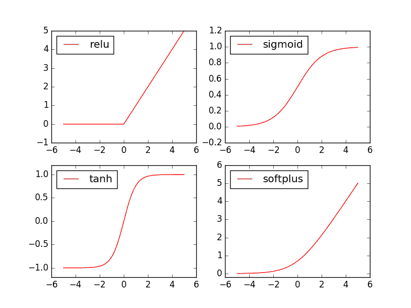

# 2.3 – 激励函数 (Activation)

## 什么是 Activation

一句话概括 Activation: 就是让神经网络可以描述非线性问题的步骤, 是神经网络变得更强大. 如果还不是特别了解, 我有制作一个动画短片（如下）, 浅显易懂的阐述了激励函数的作用. 包懂.

## Torch 中的激励函数

Torch 中的激励函数有很多, 不过我们平时要用到的就这几个.  relu, sigmoid, tanh, softplus . 那我们就看看他们各自长什么样啦.

```py
import torch
import torch.nn.functional as F     # 激励函数都在这
from torch.autograd import Variable

# 做一些假数据来观看图像
x = torch.linspace(-5, 5, 200)  # x data (tensor), shape=(100, 1)
x = Variable(x)
```

接着就是做生成不同的激励函数数据:

```py
x_np = x.data.numpy()   # 换成 numpy array, 出图时用

# 几种常用的 激励函数
y_relu = F.relu(x).data.numpy()
y_sigmoid = F.sigmoid(x).data.numpy()
y_tanh = F.tanh(x).data.numpy()
y_softplus = F.softplus(x).data.numpy()
# y_softmax = F.softmax(x)  softmax 比较特殊, 不能直接显示, 不过他是关于概率的, 用于分类
```

接着我们开始画图, 画图的代码也在下面:



```py
import matplotlib.pyplot as plt  # python 的可视化模块, 我有教程 (https://morvanzhou.github.io/tutorials/data-manipulation/plt/)

plt.figure(1, figsize=(8, 6))
plt.subplot(221)
plt.plot(x_np, y_relu, c=\'red\', label=\'relu\')
plt.ylim((-1, 5))
plt.legend(loc=\'best\')

plt.subplot(222)
plt.plot(x_np, y_sigmoid, c=\'red\', label=\'sigmoid\')
plt.ylim((-0.2, 1.2))
plt.legend(loc=\'best\')

plt.subplot(223)
plt.plot(x_np, y_tanh, c=\'red\', label=\'tanh\')
plt.ylim((-1.2, 1.2))
plt.legend(loc=\'best\')

plt.subplot(224)
plt.plot(x_np, y_softplus, c=\'red\', label=\'softplus\')
plt.ylim((-0.2, 6))
plt.legend(loc=\'best\')

plt.show()
```

文章来源：[莫烦](https://morvanzhou.github.io/)