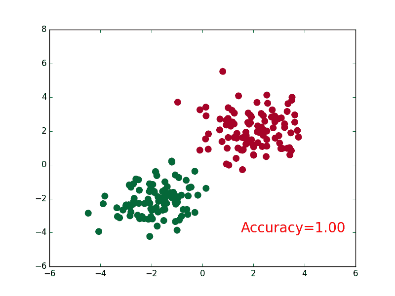

# 3.2 – 区分类型 (分类 Classification)

这次我们也是用最简单的途径来看看神经网络是怎么进行事物的分类.


## 建立数据集

我们创建一些假数据来模拟真实的情况. 比如两个二次分布的数据, 不过他们的均值都不一样.

```py
import torch
from torch.autograd import Variable
import matplotlib.pyplot as plt

# 假数据
n_data = torch.ones(100, 2)         # 数据的基本形态
x0 = torch.normal(2*n_data, 1)      # 类型0 x data (tensor), shape=(100, 2)
y0 = torch.zeros(100)               # 类型0 y data (tensor), shape=(100, 1)
x1 = torch.normal(-2*n_data, 1)     # 类型1 x data (tensor), shape=(100, 1)
y1 = torch.ones(100)                # 类型1 y data (tensor), shape=(100, 1)

# 注意 x, y 数据的数据形式是一定要像下面一样 (torch.cat 是在合并数据)
x = torch.cat((x0, x1), 0).type(torch.FloatTensor)  # FloatTensor = 32-bit floating
y = torch.cat((y0, y1), ).type(torch.LongTensor)    # LongTensor = 64-bit integer

# torch 只能在 Variable 上训练, 所以把它们变成 Variable
x, y = Variable(x), Variable(y)

# plt.scatter(x.data.numpy()[:, 0], x.data.numpy()[:, 1], c=y.data.numpy(), s=100, lw=0, cmap=\'RdYlGn\')
# plt.show()

# 画图
plt.scatter(x.data.numpy(), y.data.numpy())
plt.show()
```

## 建立神经网络

建立一个神经网络我们可以直接运用 torch 中的体系. 先定义所有的层属性( __init__() ), 然后再一层层搭建( forward(x) )层于层的关系链接. 这个和我们在前面 regression 的时候的神经网络基本没差. 建立关系的时候, 我们会用到激励函数.

```py
import torch
import torch.nn.functional as F     # 激励函数都在这

class Net(torch.nn.Module):     # 继承 torch 的 Module
    def __init__(self, n_feature, n_hidden, n_output):
        super(Net, self).__init__()     # 继承 __init__ 功能
        self.hidden = torch.nn.Linear(n_feature, n_hidden)   # 隐藏层线性输出
        self.out = torch.nn.Linear(n_hidden, n_output)       # 输出层线性输出

    def forward(self, x):
        # 正向传播输入值, 神经网络分析出输出值
        x = F.relu(self.hidden(x))      # 激励函数(隐藏层的线性值)
        x = self.out(x)                 # 输出值, 但是这个不是预测值, 预测值还需要再另外计算
        return x

net = Net(n_feature=2, n_hidden=10, n_output=2) # 几个类别就几个 output

print(net)  # net 的结构
"""
Net (
  (hidden): Linear (2 -> 10)
  (out): Linear (10 -> 2)
)
"""
```

## 训练网络

训练的步骤很简单, 如下:

```py
# optimizer 是训练的工具
optimizer = torch.optim.SGD(net.parameters(), lr=0.02)  # 传入 net 的所有参数, 学习率
# 算误差的时候, 注意真实值!不是! one-hot 形式的, 而是1D Tensor, (batch,)
# 但是预测值是2D tensor (batch, n_classes)
loss_func = torch.nn.CrossEntropyLoss()

for t in range(100):
    out = net(x)     # 喂给 net 训练数据 x, 输出分析值

    loss = loss_func(out, y)     # 计算两者的误差

    optimizer.zero_grad()   # 清空上一步的残余更新参数值
    loss.backward()         # 误差反向传播, 计算参数更新值
    optimizer.step()        # 将参数更新值施加到 net 的 parameters 上
```

## 可视化训练过程

为了可视化整个训练的过程, 更好的理解是如何训练, 我们如下操作:

```py
import matplotlib.pyplot as plt

plt.ion()   # 画图
plt.show()

for t in range(100):

    ...
    loss.backward()
    optimizer.step()

    # 接着上面来
    if t % 2 == 0:
        plt.cla()
        # 过了一道 softmax 的激励函数后的最大概率才是预测值
        prediction = torch.max(F.softmax(out), 1)[1]
        pred_y = prediction.data.numpy().squeeze()
        target_y = y.data.numpy()
        plt.scatter(x.data.numpy()[:, 0], x.data.numpy()[:, 1], c=pred_y, s=100, lw=0, cmap=\'RdYlGn\')
        accuracy = sum(pred_y == target_y)/200  # 预测中有多少和真实值一样
        plt.text(1.5, -4, \'Accuracy=%.2f\' % accuracy, fontdict={\'size\': 20, \'color\':  \'red\'})
        plt.pause(0.1)

plt.ioff()  # 停止画图
plt.show()
```



所以这也就是在我 [github 代码](https://github.com/MorvanZhou/PyTorch-Tutorial/blob/master/tutorial-contents/302_classification.py) 中的每一步的意义啦.

文章来源：[莫烦](https://morvanzhou.github.io/)