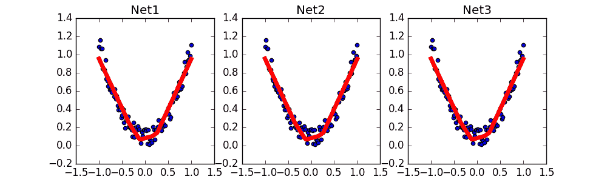

# 3.4 – 保存和恢复模型

训练好了一个模型, 我们当然想要保存它, 留到下次要用的时候直接提取直接用, 这就是这节的内容啦. 我们用回归的神经网络举例实现保存提取.

## 保存

我们快速地建造数据, 搭建网络:

```py
torch.manual_seed(1)    # reproducible

# 假数据
x = torch.unsqueeze(torch.linspace(-1, 1, 100), dim=1)  # x data (tensor), shape=(100, 1)
y = x.pow(2)   0.2*torch.rand(x.size())  # noisy y data (tensor), shape=(100, 1)
x, y = Variable(x, requires_grad=False), Variable(y, requires_grad=False)

def save():
    # 建网络
    net1 = torch.nn.Sequential(
        torch.nn.Linear(1, 10),
        torch.nn.ReLU(),
        torch.nn.Linear(10, 1)
    )
    optimizer = torch.optim.SGD(net1.parameters(), lr=0.5)
    loss_func = torch.nn.MSELoss()

    # 训练
    for t in range(100):
        prediction = net1(x)
        loss = loss_func(prediction, y)
        optimizer.zero_grad()
        loss.backward()
        optimizer.step()
```

接下来我们有两种途径来保存

```py
torch.save(net1, \'net.pkl\')  # 保存整个网络
torch.save(net1.state_dict(), \'net_params.pkl\')   # 只保存网络中的参数 (速度快, 占内存少)
```

## 提取网络

这种方式将会提取整个神经网络, 网络大的时候可能会比较慢.

```py
def restore_net():
    # restore entire net1 to net2
    net2 = torch.load(\'net.pkl\')
    prediction = net2(x)
```

## 只提取网络参数

这种方式将会提取所有的参数, 然后再放到你的新建网络中.

```py
def restore_params():
    # 新建 net3
    net3 = torch.nn.Sequential(
        torch.nn.Linear(1, 10),
        torch.nn.ReLU(),
        torch.nn.Linear(10, 1)
    )

    # 将保存的参数复制到 net3
    net3.load_state_dict(torch.load(\'net_params.pkl\'))
    prediction = net3(x)
```

## 显示结果

调用上面建立的几个功能, 然后出图.



这样我们就能看出三个网络完全一模一样啦.

所以这也就是在我 [github 代码](https://github.com/MorvanZhou/PyTorch-Tutorial/blob/master/tutorial-contents/304_save_reload.py) 中的每一步的意义啦.

文章来源：[莫烦](https://morvanzhou.github.io/)