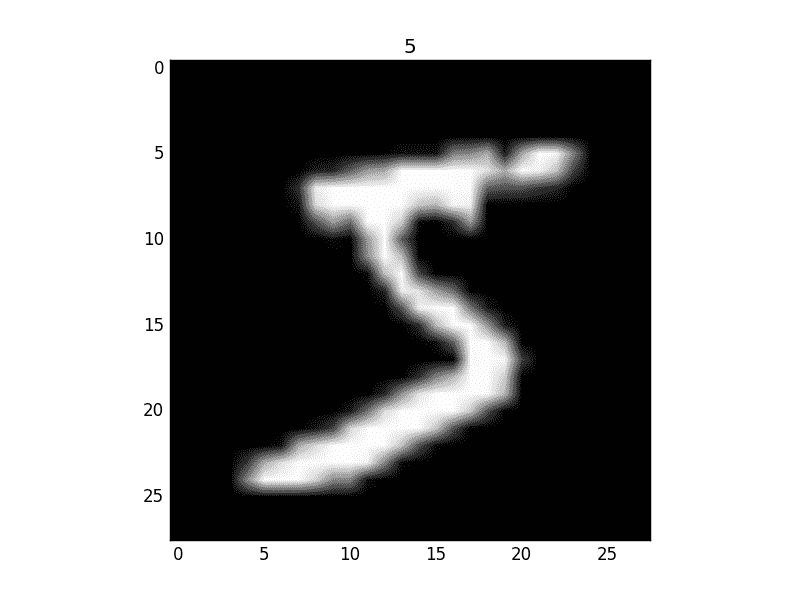

# 4.2 – RNN 循环神经网络 (分类 Classification)

循环神经网络让神经网络有了记忆, 对于序列话的数据,循环神经网络能达到更好的效果. 如果你对循环神经网络还没有特别了解, 请观看几分钟的短动画, RNN 动画简介（如下） 和 LSTM（如下） 动画简介 能让你生动理解 RNN. 接着我们就一步一步做一个分析手写数字的 RNN 吧.

## RNN 简介

## LSTM 简介

## MNIST手写数据

```py
import torch
from torch import nn
from torch.autograd import Variable
import torchvision.datasets as dsets
import torchvision.transforms as transforms
import matplotlib.pyplot as plt

torch.manual_seed(1)    # reproducible

# Hyper Parameters
EPOCH = 1           # 训练整批数据多少次, 为了节约时间, 我们只训练一次
BATCH_SIZE = 64
TIME_STEP = 28      # rnn 时间步数 / 图片高度
INPUT_SIZE = 28     # rnn 每步输入值 / 图片每行像素
LR = 0.01           # learning rate
DOWNLOAD_MNIST = True  # 如果你已经下载好了mnist数据就写上 Fasle

# Mnist 手写数字
train_data = torchvision.datasets.MNIST(
    root=\\'./mnist/\\',    # 保存或者提取位置
    train=True,  # this is training data
    transform=torchvision.transforms.ToTensor(),    # 转换 PIL.Image or numpy.ndarray 成
                                                    # torch.FloatTensor (C x H x W), 训练的时候 normalize 成 [0.0, 1.0] 区间
    download=DOWNLOAD_MNIST,          # 没下载就下载, 下载了就不用再下了
)
```



黑色的地方的值都是0, 白色的地方值大于0.

同样, 我们除了训练数据, 还给一些测试数据, 测试看看它有没有训练好.

```py
test_data = torchvision.datasets.MNIST(root=\\'./mnist/\\', train=False)

# 批训练 50samples, 1 channel, 28x28 (50, 1, 28, 28)
train_loader = Data.DataLoader(dataset=train_data, batch_size=BATCH_SIZE, shuffle=True)

# 为了节约时间, 我们测试时只测试前2000个
test_x = Variable(torch.unsqueeze(test_data.test_data, dim=1), volatile=True).type(torch.FloatTensor)[:2000]/255\.   # shape from (2000, 28, 28) to (2000, 1, 28, 28), value in range(0,1)
test_y = test_data.test_labels[:2000]
```

#### RNN模型

和以前一样, 我们用一个 class 来建立 RNN 模型. 这个 RNN 整体流程是

1.  (input0,  state0) -> LSTM -> (output0,  state1) ;
2.  (input1,  state1) -> LSTM -> (output1,  state2) ;
3.  …
4.  (inputN,  stateN)-> LSTM -> (outputN,  stateN  1) ;
5.  outputN -> Linear -> prediction . 通过LSTM分析每一时刻的值, 并且将这一时刻和前面时刻的理解合并在一起, 生成当前时刻对前面数据的理解或记忆. 传递这种理解给下一时刻分析.

```py
class RNN(nn.Module):
    def __init__(self):
        super(RNN, self).__init__()

        self.rnn = nn.LSTM(     # LSTM 效果要比 nn.RNN() 好多了
            input_size=28,      # 图片每行的数据像素点
            hidden_size=64,     # rnn hidden unit
            num_layers=1,       # 有几层 RNN layers
            batch_first=True,   # input & output 会是以 batch size 为第一维度的特征集 e.g. (batch, time_step, input_size)
        )

        self.out = nn.Linear(64, 10)    # 输出层

    def forward(self, x):
        # x shape (batch, time_step, input_size)
        # r_out shape (batch, time_step, output_size)
        # h_n shape (n_layers, batch, hidden_size)   LSTM 有两个 hidden states, h_n 是分线, h_c 是主线
        # h_c shape (n_layers, batch, hidden_size)
        r_out, (h_n, h_c) = self.rnn(x, None)   # None 表示 hidden state 会用全0的 state

        # 选取最后一个时间点的 r_out 输出
        # 这里 r_out[:, -1, :] 的值也是 h_n 的值
        out = self.out(r_out[:, -1, :])
        return out

rnn = RNN()
print(rnn)
"""
RNN (
  (rnn): LSTM(28, 64, batch_first=True)
  (out): Linear (64 -> 10)
)
"""
```

#### 训练

我们将图片数据看成一个时间上的连续数据, 每一行的像素点都是这个时刻的输入, 读完整张图片就是从上而下的读完了每行的像素点. 然后我们就可以拿出 RNN 在最后一步的分析值判断图片是哪一类了. 下面的代码省略了计算 accuracy 的部分, 你可以在我的 github 中看到全部代码.

```py
optimizer = torch.optim.Adam(rnn.parameters(), lr=LR)   # optimize all parameters
loss_func = nn.CrossEntropyLoss()   # the target label is not one-hotted

# training and testing
for epoch in range(EPOCH):
    for step, (x, y) in enumerate(train_loader):   # gives batch data
        b_x = Variable(x.view(-1, 28, 28))   # reshape x to (batch, time_step, input_size)
        b_y = Variable(y)   # batch y

        output = rnn(b_x)               # rnn output
        loss = loss_func(output, b_y)   # cross entropy loss
        optimizer.zero_grad()           # clear gradients for this training step
        loss.backward()                 # backpropagation, compute gradients
        optimizer.step()                # apply gradients
"""
...
Epoch:  0 | train loss: 0.0945 | test accuracy: 0.94
Epoch:  0 | train loss: 0.0984 | test accuracy: 0.94
Epoch:  0 | train loss: 0.0332 | test accuracy: 0.95
Epoch:  0 | train loss: 0.1868 | test accuracy: 0.96
"""
```

最后我们再来取10个数据, 看看预测的值到底对不对:

```py
test_output = rnn(test_x[:10].view(-1, 28, 28))
pred_y = torch.max(test_output, 1)[1].data.numpy().squeeze()
print(pred_y, \\'prediction number\\')
print(test_y[:10], \\'real number\\')
"""
[7 2 1 0 4 1 4 9 5 9] prediction number
[7 2 1 0 4 1 4 9 5 9] real number
"""
```

所以这也就是在我 [github 代码](https://github.com/MorvanZhou/PyTorch-Tutorial/blob/master/tutorial-contents/402_RNN_classifier.py) 中的每一步的意义啦.

文章来源：[莫烦](https://morvanzhou.github.io/)