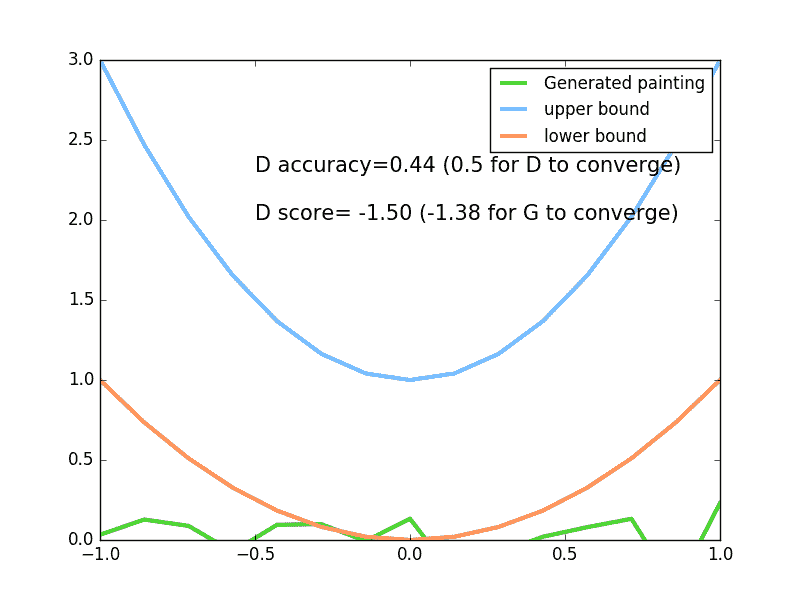
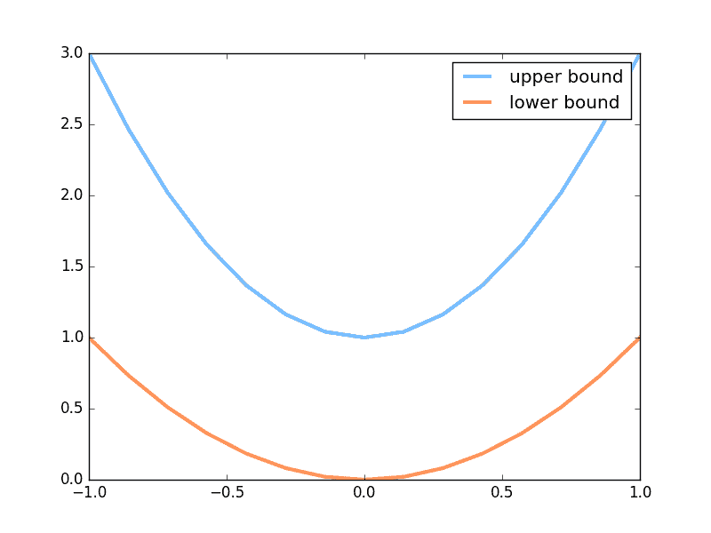
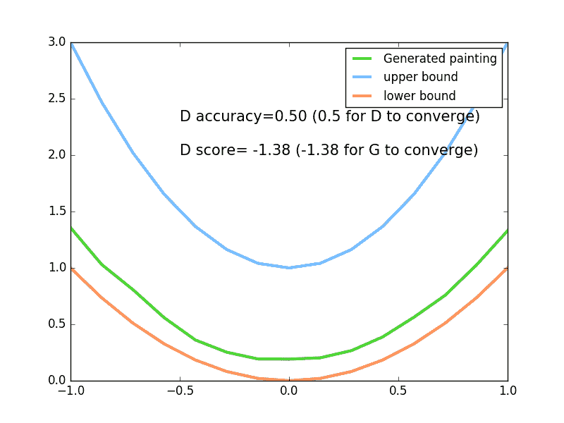

# 4.6 – GAN (Generative Adversarial Nets 生成对抗网络)

GAN 是一个近几年比较流行的生成网络形式. 对比起传统的生成模型, 他减少了模型限制和生成器限制, 他具有有更好的生成能力. 人们常用假钞鉴定者和假钞制造者来打比喻, 但是我不喜欢这个比喻, 觉得没有真实反映出 GAN 里面的机理.

所以我的一句话介绍 GAN 就是: Generator 是新手画家, Discriminator 是新手鉴赏家, 你是高级鉴赏家. 你将著名画家的品和新手画家的作品都给新手鉴赏家评定, 并告诉新手鉴赏家哪些是新手画家画的, 哪些是著名画家画的, 新手鉴赏家就慢慢学习怎么区分新手画家和著名画家的画, 但是新手画家和新手鉴赏家是好朋友, 新手鉴赏家会告诉新手画家要怎么样画得更像著名画家, 新手画家就能将自己的突然来的灵感 (random noise) 画得更像著名画家. 我用一个短动画形式来诠释了整个过程 (GAN 动画简介) (如下).

下面是本节内容的效果, 绿线的变化是新手画家慢慢学习如何踏上画家之路的过程. 而能被认定为著名的画作在 upper bound  和 lower bound  之间.



## 超参数设置

新手画家 (Generator) 在作画的时候需要有一些灵感 (random noise), 我们这些灵感的个数定义为 N_IDEAS . 而一幅画需要有一些规格, 我们将这幅画的画笔数定义一下, N_COMPONENTS  就是一条一元二次曲线(这幅画画)上的点个数. 为了进行批训练, 我们将一整批话的点都规定一下( PAINT_POINTS ).

```py
import torch
import torch.nn as nn
from torch.autograd import Variable
import numpy as np
import matplotlib.pyplot as plt

torch.manual_seed(1)    # reproducible
np.random.seed(1)

# 超参数
BATCH_SIZE = 64
LR_G = 0.0001           # learning rate for generator
LR_D = 0.0001           # learning rate for discriminator
N_IDEAS = 5             # think of this as number of ideas for generating an art work (Generator)
ART_COMPONENTS = 15     # it could be total point G can draw in the canvas
PAINT_POINTS = np.vstack([np.linspace(-1, 1, ART_COMPONENTS) for _ in range(BATCH_SIZE)])
```

## 著名画家的画

我们需要有很多画是来自著名画家的(real data), 将这些著名画家的画, 和新手画家的画都传给新手鉴赏家, 让鉴赏家来区分哪些是著名画家, 哪些是新手画家的画. 如何区分我们在后面呈现. 这里我们生成一些著名画家的画 (batch 条不同的一元二次方程曲线).

```py
def artist_works():     # painting from the famous artist (real target)
    a = np.random.uniform(1, 2, size=BATCH_SIZE)[:, np.newaxis]
    paintings = a * np.power(PAINT_POINTS, 2)   (a-1)
    paintings = torch.from_numpy(paintings).float()
    return Variable(paintings)
```

下面就是会产生曲线的一个上限和下限.



## 神经网络

这里会创建两个神经网络, 分别是 Generator (新手画家), Discriminator(新手鉴赏家). G 会拿着自己的一些灵感当做输入, 输出一元二次曲线上的点 (G 的画).

D 会接收一幅画作 (一元二次曲线), 输出这幅画作到底是不是著名画家的画(是著名画家的画的概率).

```py
G = nn.Sequential(                      # Generator
    nn.Linear(N_IDEAS, 128),            # random ideas (could from normal distribution)
    nn.ReLU(),
    nn.Linear(128, ART_COMPONENTS),     # making a painting from these random ideas
)

D = nn.Sequential(                      # Discriminator
    nn.Linear(ART_COMPONENTS, 128),     # receive art work either from the famous artist or a newbie like G
    nn.ReLU(),
    nn.Linear(128, 1),
    nn.Sigmoid(),                       # tell the probability that the art work is made by artist
)
```

## 训练

接着我们来同时训练 D 和 G. 训练之前, 我们来看看G作画的原理. G 首先会有些灵感, G_ideas 就会拿到这些随机灵感 (可以是正态分布的随机数), 然后 G 会根据这些灵感画画. 接着我们拿着著名画家的画和 G 的画, 让 D 来判定这两批画作是著名画家画的概率.

```py
for step in range(10000):
    artist_paintings = artist_works()           # real painting from artist
    G_ideas = Variable(torch.randn(BATCH_SIZE, N_IDEAS))    # random ideas
    G_paintings = G(G_ideas())                  # fake painting from G (random ideas)

    prob_artist0 = D(artist_paintings)          # D try to increase this prob
    prob_artist1 = D(G_paintings)               # D try to reduce this prob
```

然后计算有多少来之画家的画猜对了, 有多少来自 G 的画猜对了, 我们想最大化这些猜对的次数. 这也就是 log(D(x))  log(1-D(G(z))  在[论文](https://arxiv.org/abs/1406.2661)中的形式. 而因为 torch 中提升参数的形式是最小化误差, 那我们把最大化 score 转换成最小化 loss, 在两个 score 的合的地方加一个符号就好. 而 G 的提升就是要减小 D 猜测 G 生成数据的正确率, 也就是减小 D_score1.

```py
    D_loss = - torch.mean(torch.log(prob_artist0)   torch.log(1\. - prob_artist1))
    G_loss = torch.mean(torch.log(1\. - prob_artist1))
```

最后我们在根据 loss  提升神经网络就好了.

```py
    opt_D.zero_grad()
    D_loss.backward(retain_variables=True)      # retain_variables 这个参数是为了再次使用计算图纸
    opt_D.step()

    opt_G.zero_grad()
    G_loss.backward()
    opt_G.step()
```

上面的全部代码内容在我的 [github](https://github.com/MorvanZhou/PyTorch-Tutorial/blob/master/tutorial-contents/406_GAN.py).

## 可视化训练过程

可视化的代码很简单, 在这里就不会意义叙说了, 大家直接看[代码](https://github.com/MorvanZhou/PyTorch-Tutorial/blob/master/tutorial-contents/406_GAN.py) 吧. 在本节的最上面就是这次的动图效果, 最后达到收敛时, 下过如下, G 能成功的根据自己的”灵感”, 产生出一条很像 artist画出的曲线, 而 D 再也没有能力猜出这到底是 G 的画作还是 artist 的画作, 他只能一半时间猜是 G 的, 一半时间猜是 artist的.



文章来源：[莫烦](https://morvanzhou.github.io/)