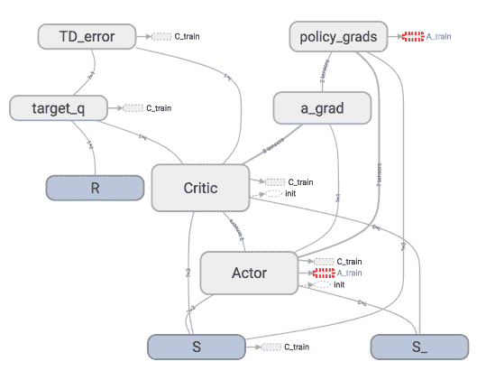

# 5.1 – 为什么 Torch 是动态的

听说过 Torch 的人都听说了 torch 是动态的, 那他的动态到底是什么呢? 我们用一个 RNN 的例子来展示一下动态计算到底长什么样.

## 动态?静态?

对比静态动态, 我们就得知道谁是静态的. 在流行的神经网络模块中, Tensorflow 就是最典型的静态计算模块. 下图是一种我在强化学习教程中的 Tensorflow 计算图. 也就是说, 大部分时候, 用 Tensorflow 是先搭建好这样一个计算系统, 一旦搭建好了, 就不能改动了 (也有例外, 比如 dynamic_rnn() , 但是总体来说他还是运用了一个静态思维), 所有的计算都会在这种图中流动, 当然很多情况, 这样就够了, 我们不需要改动什么结构. 不动结构当然可以提高效率. 但是一旦计算流程不是静态的, 计算图要变动. 最典型的例子就是 RNN, 有时候 RNN 的 time step 不会一样, 或者在 training 和 testing 的时候, batch_size  和 time_step  也不一样, 这时, Tensorflow 就头疼了, Tensorflow 的人也头疼了. 哈哈, 如果用一个动态计算图的 Torch, 我们就好理解多了, 写起来也简单多了.



## 动态RNN

我们拿 [这一节内容的 RNN](https://www.pytorchtutorial.com/4-3-rnn-for-regression/) 来解释动态计算图. 那节内容的[代码在这](https://github.com/MorvanZhou/PyTorch-Tutorial/blob/master/tutorial-contents/11_RNN_regressor.py).

```py
..

######################## 前面代码都一样, 下面开始不同 #########################

################ 那节内容的代码结构 (静态 time step) ##########
for step in range(60):
    start, end = step * np.pi, (step 1)*np.pi   # time steps 都是一样长的
    # use sin predicts cos
    steps = np.linspace(start, end, 10, dtype=np.float32)
    ...

################ 这节内容修改代码 (动态 time step) #########
step = 0
for i in range(60):
    dynamic_steps = np.random.randint(1, 4)  # 随机 time step 长度
    start, end = step * np.pi, (step   dynamic_steps) * np.pi  # different time steps length
    step  = dynamic_steps

    # use sin predicts cos
    steps = np.linspace(start, end, 10 * dynamic_steps, dtype=np.float32)

#######################  这下面又一样了 ###########################
    print(len(steps))   # print how many time step feed to RNN

    x_np = np.sin(steps)    # float32 for converting torch FloatTensor
    y_np = np.cos(steps)
    ...

"""
输出的动态time step 长
30
30
10
30
20
30
"""
```

有人会说了, Tensorflow 也有类似的功能呀, 比如说 dynamic_rnn(). 对的, 没错, 不过大家是否想过, 如果我在 Tensorflow 当中定义一个 input 的 placeholder, 这个 placeholder 将会有 (batch, time step, input size) 这几个维度, batch 好说, 随便什么大小都可以, 可是 time step 可是固定的呀, 这可不好改, 或者说改起来很麻烦. 那 PyTorch 中又可以变 batch 又可以变 time step, 这不是很方便吗. 这就体现了动态神经网络的好处.

经过这样的折腾, torch 还能 handle 住, 已经很不容易啦. 所以当你想要处理这些动态计算图的时候, Torch 还是你首选的神经网络模块.

所以这也就是在我 [github 代码](https://github.com/MorvanZhou/PyTorch-Tutorial/blob/master/tutorial-contents/501_why_torch_dynamic_graph.py) 中的每一步的意义啦.

文章来源：[莫烦](https://morvanzhou.github.io/)