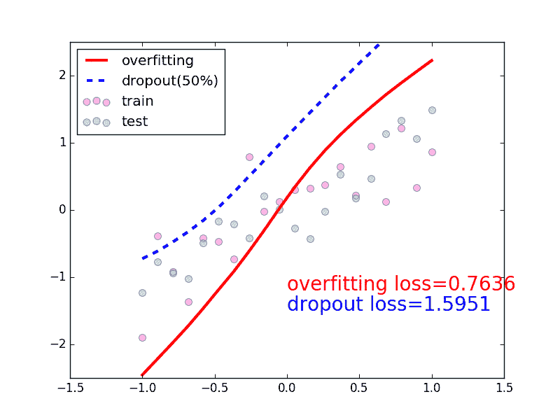
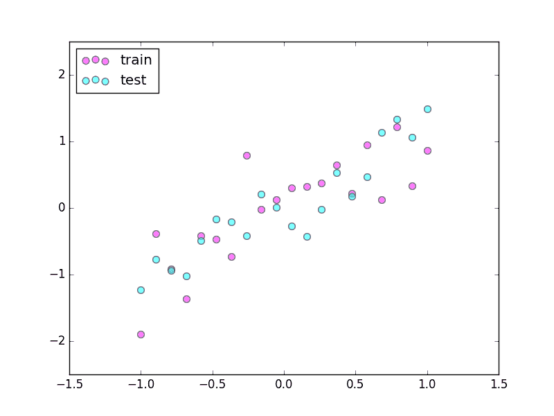
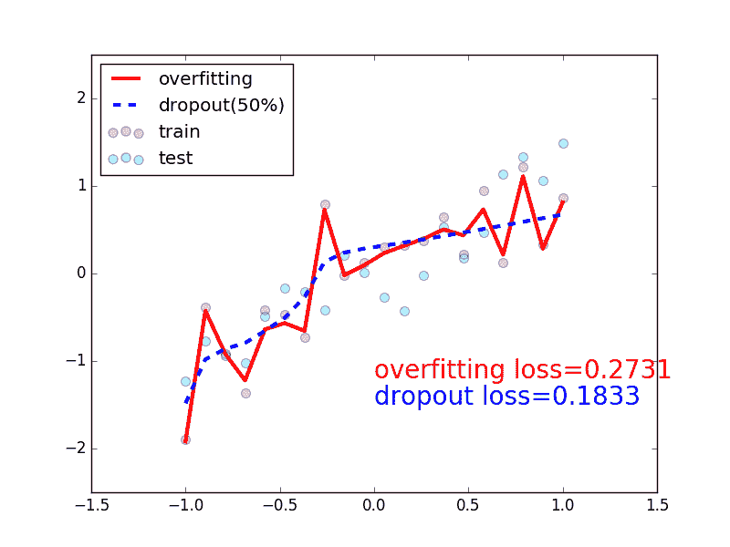

# 5.3 – Dropout 防止过拟合

过拟合让人头疼, 明明训练时误差已经降得足够低, 可是测试的时候误差突然飙升. 这很有可能就是出现了过拟合现象. 强烈推荐通过（下面）这个动画的形式短时间了解什么是过拟合, 怎么解决过拟合. 下面动图就显示了我们成功缓解了过拟合现象.



## 做点数据

自己做一些伪数据, 用来模拟真实情况. 数据少, 才能凸显过拟合问题, 所以我们就做10个数据点.



```py
import torch
from torch.autograd import Variable
import matplotlib.pyplot as plt

torch.manual_seed(1)    # reproducible

N_SAMPLES = 20
N_HIDDEN = 300

# training data
x = torch.unsqueeze(torch.linspace(-1, 1, N_SAMPLES), 1)
y = x   0.3*torch.normal(torch.zeros(N_SAMPLES, 1), torch.ones(N_SAMPLES, 1))
x, y = Variable(x, requires_grad=False), Variable(y, requires_grad=False)

# test data
test_x = torch.unsqueeze(torch.linspace(-1, 1, N_SAMPLES), 1)
test_y = test_x   0.3*torch.normal(torch.zeros(N_SAMPLES, 1), torch.ones(N_SAMPLES, 1))
test_x, test_y = Variable(test_x, requires_grad=False), Variable(test_y, requires_grad=False)

# show data
plt.scatter(x.data.numpy(), y.data.numpy(), c=\'magenta\', s=50, alpha=0.5, label=\'train\')
plt.scatter(test_x.data.numpy(), test_y.data.numpy(), c=\'cyan\', s=50, alpha=0.5, label=\'test\')
plt.legend(loc=\'upper left\')
plt.ylim((-2.5, 2.5))
plt.show()
```

## 搭建神经网络

我们在这里搭建两个神经网络, 一个没有 dropout, 一个有 dropout. 没有 dropout 的容易出现 过拟合, 那我们就命名为 net_overfitting, 另一个就是 net_dropped.  torch.nn.Dropout(0.5)  这里的 0.5 指的是随机有 50% 的神经元会被关闭/丢弃.

```py
net_overfitting = torch.nn.Sequential(
    torch.nn.Linear(1, N_HIDDEN),
    torch.nn.ReLU(),
    torch.nn.Linear(N_HIDDEN, N_HIDDEN),
    torch.nn.ReLU(),
    torch.nn.Linear(N_HIDDEN, 1),
)

net_dropped = torch.nn.Sequential(
    torch.nn.Linear(1, N_HIDDEN),
    torch.nn.Dropout(0.5),  # drop 50% of the neuron
    torch.nn.ReLU(),
    torch.nn.Linear(N_HIDDEN, N_HIDDEN),
    torch.nn.Dropout(0.5),  # drop 50% of the neuron
    torch.nn.ReLU(),
    torch.nn.Linear(N_HIDDEN, 1),
)
```

## 训练

训练的时候, 这两个神经网络分开训练. 训练的环境都一样.

```py
optimizer_ofit = torch.optim.Adam(net_overfitting.parameters(), lr=0.01)
optimizer_drop = torch.optim.Adam(net_dropped.parameters(), lr=0.01)
loss_func = torch.nn.MSELoss()

for t in range(500):
    pred_ofit = net_overfitting(x)
    pred_drop = net_dropped(x)

    loss_ofit = loss_func(pred_ofit, y)
    loss_drop = loss_func(pred_drop, y)

    optimizer_ofit.zero_grad()
    optimizer_drop.zero_grad()
    loss_ofit.backward()
    loss_drop.backward()
    optimizer_ofit.step()
    optimizer_drop.step()
```

## 对比测试结果

在这个 for  循环里, 我们加上画测试图的部分. 注意在测试时, 要将网络改成 eval()  形式, 特别是 net_dropped , net_overfitting  改不改其实无所谓. 画好图再改回 train()  模式.


```py
...

    optimizer_ofit.step()
    optimizer_drop.step()

    # 接着上面来
    if t % 10 == 0:     # 每 10 步画一次图
        # 将神经网络转换成测试形式, 画好图之后改回 训练形式
        net_overfitting.eval()
        net_dropped.eval()  # 因为 drop 网络在 train 的时候和 test 的时候参数不一样.

        ...
        test_pred_ofit = net_overfitting(test_x)
        test_pred_drop = net_dropped(test_x)
        ...

        # 将两个网络改回 训练形式
        net_overfitting.train()
        net_dropped.train()
```



所以这也就是在我 [github 代码](https://github.com/MorvanZhou/PyTorch-Tutorial/blob/master/tutorial-contents/503_dropout.py) 中的每一步的意义啦.

文章来源：[莫烦](https://morvanzhou.github.io/)