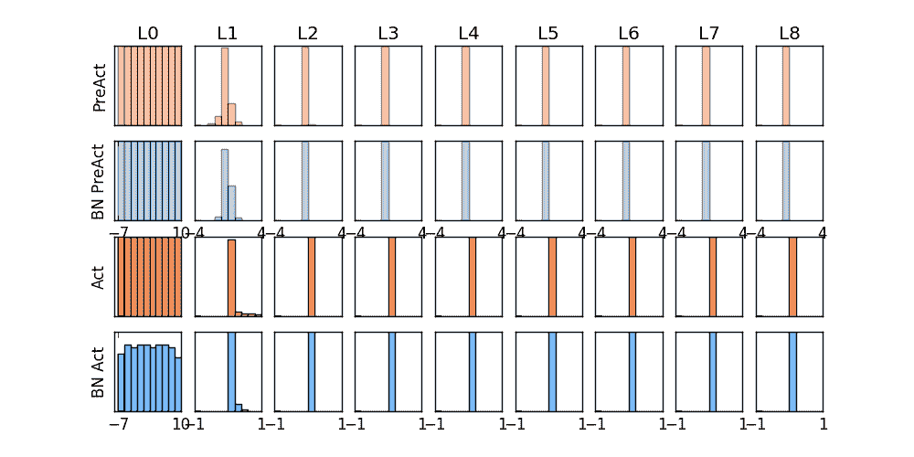
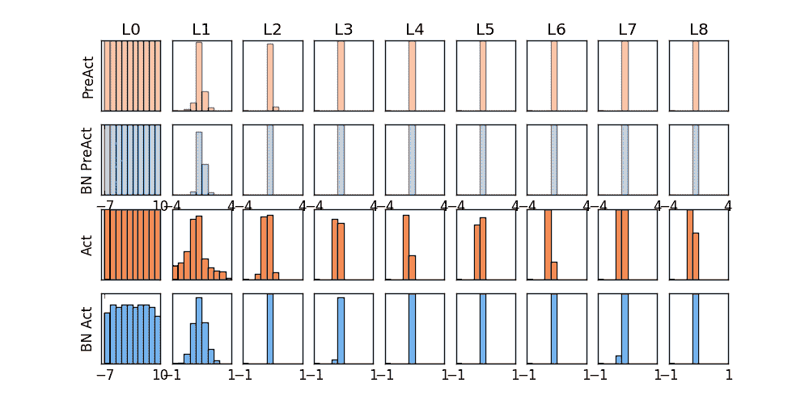
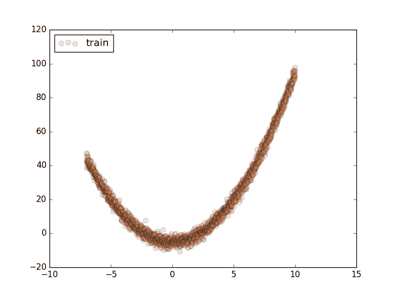
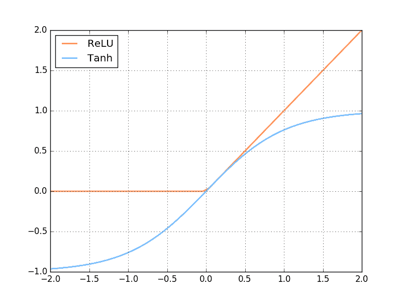
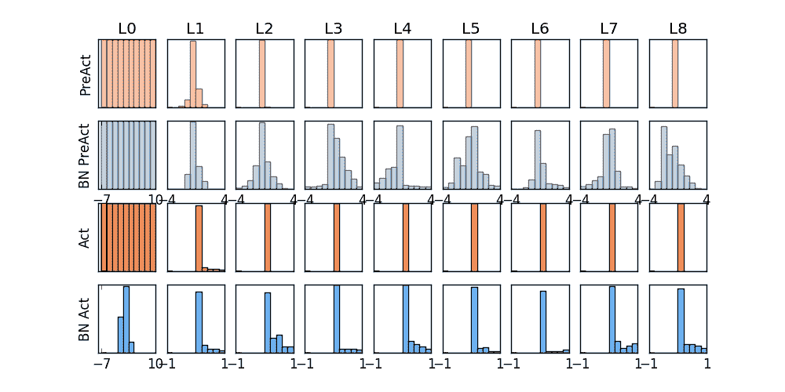
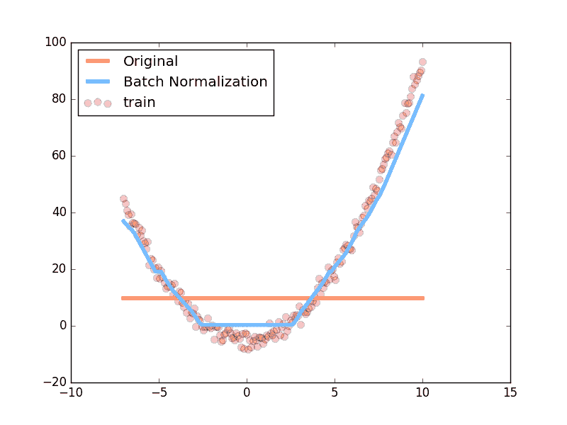
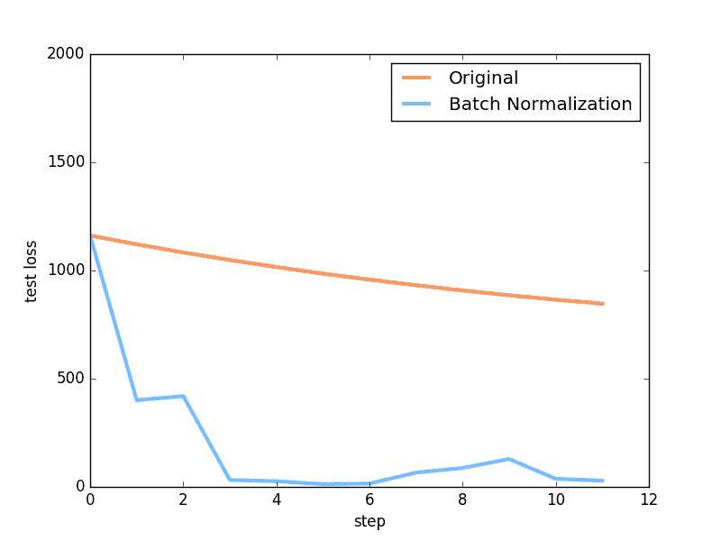
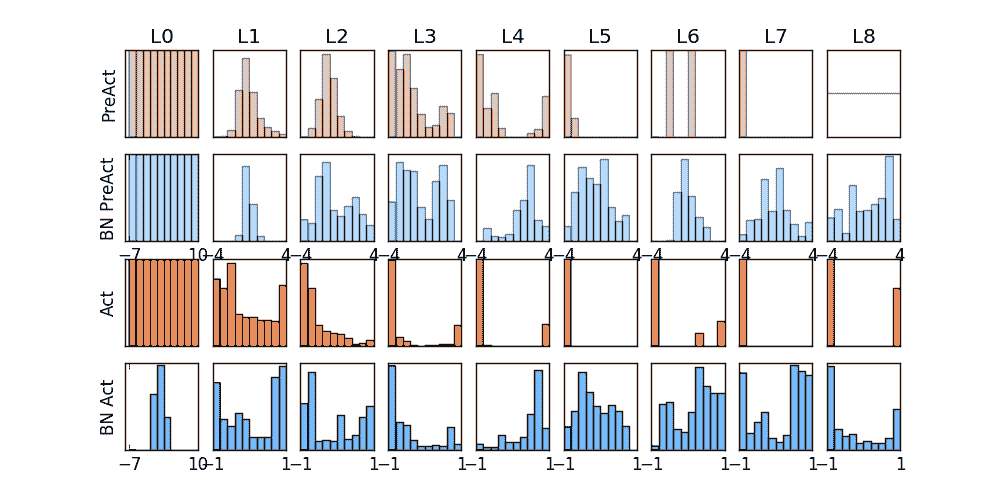
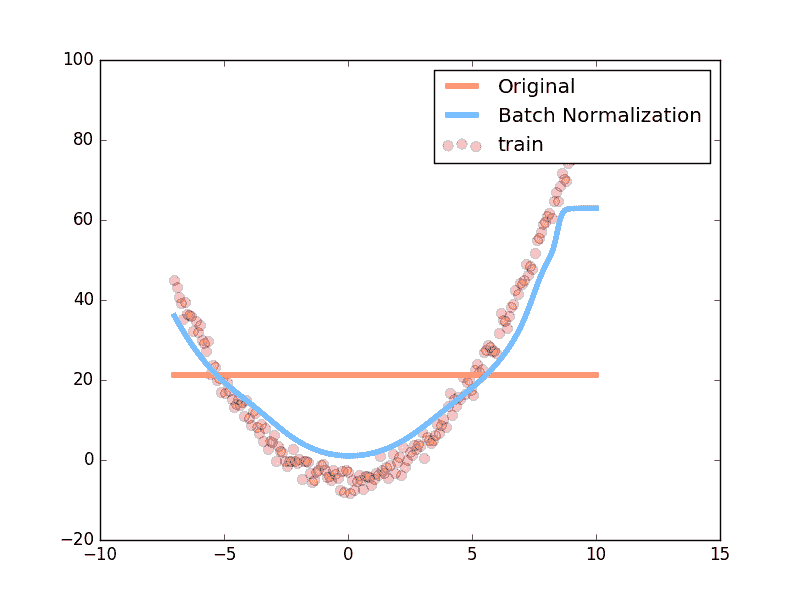
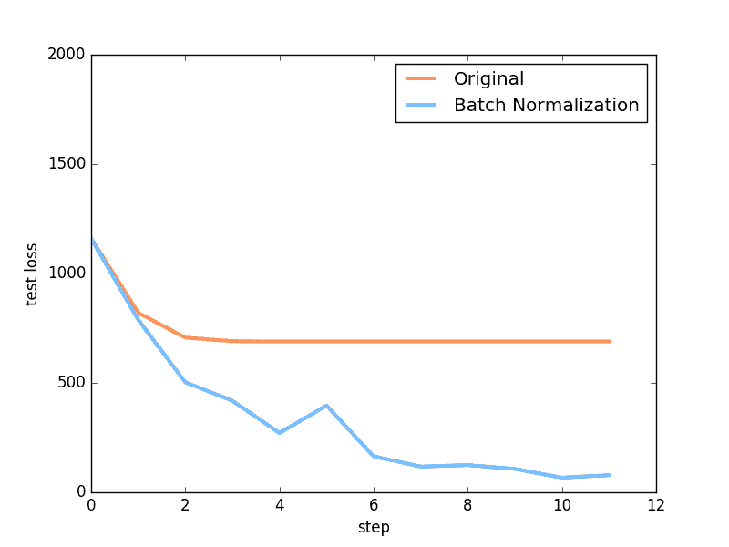

# 5.4 – Batch Normalization 批标准化

批标准化通俗来说就是对每一层神经网络进行标准化 (normalize) 处理, 我们知道对输入数据进行标准化能让机器学习有效率地学习. 如果把每一层后看成这种接受输入数据的模式, 那我们何不 “批标准化” 所有的层呢? 具体而且清楚的解释请看到 我（原作者）制作的 什么批标准化 动画简介(推荐)（如下）.

那我们就看看下面的两个动图, 这就是在每层神经网络有无 batch normalization 的区别啦.





## 做点数据

自己做一些伪数据, 用来模拟真实情况. 而且 Batch Normalization (之后都简称BN) 还能有效的控制坏的参数初始化 (initialization), 比如说 ReLU  这种激励函数最怕所有的值都落在附属区间, 那我们就将所有的参数都水平移动一个 -0.2 ( bias_initialization  =  -0.2 , 来看看 BN 的实力.



```py
import torch
from torch.autograd import Variable
from torch import nn
from torch.nn import init
import torch.utils.data as Data
import torch.nn.functional as F
import matplotlib.pyplot as plt
import numpy as np

# 超参数
N_SAMPLES = 2000
BATCH_SIZE = 64
EPOCH = 12
LR = 0.03
N_HIDDEN = 8
ACTIVATION = F.tanh     # 你可以换 relu 试试
B_INIT = -0.2   # 模拟不好的 参数初始化

# training data
x = np.linspace(-7, 10, N_SAMPLES)[:, np.newaxis]
noise = np.random.normal(0, 2, x.shape)
y = np.square(x) - 5   noise

# test data
test_x = np.linspace(-7, 10, 200)[:, np.newaxis]
noise = np.random.normal(0, 2, test_x.shape)
test_y = np.square(test_x) - 5   noise

train_x, train_y = torch.from_numpy(x).float(), torch.from_numpy(y).float()
test_x = Variable(torch.from_numpy(test_x).float(), volatile=True)  # volatile=True 不进行梯度计算
test_y = Variable(torch.from_numpy(test_y).float(), volatile=True)

train_dataset = Data.TensorDataset(data_tensor=train_x, target_tensor=train_y)
train_loader = Data.DataLoader(dataset=train_dataset, batch_size=BATCH_SIZE, shuffle=True, num_workers=2,)

# show data
plt.scatter(train_x.numpy(), train_y.numpy(), c=\'#FF9359\', s=50, alpha=0.2, label=\'train\')
plt.legend(loc=\'upper left\')
plt.show()
```

## 搭建神经网络

这里就教你如何构建带有 BN 的神经网络的. BN 其实可以看做是一个 layer ( BN layer ). 我们就像平时加层一样加 BN layer  就好了. 注意, 我还对输入数据进行了一个 BN 处理, 因为如果你把输入数据看出是 从前面一层来的输出数据, 我们同样也能对她进行 BN.

```py
class Net(nn.Module):
    def __init__(self, batch_normalization=False):
        super(Net, self).__init__()
        self.do_bn = batch_normalization
        self.fcs = []   # 太多层了, 我们用 for loop 建立
        self.bns = []
        self.bn_input = nn.BatchNorm1d(1, momentum=0.5)   # 给 input 的 BN

        for i in range(N_HIDDEN):               # 建层
            input_size = 1 if i == 0 else 10
            fc = nn.Linear(input_size, 10)
            setattr(self, \'fc%i\' % i, fc)       # 注意! pytorch 一定要你将层信息变成 class 的属性! 我在这里花了2天时间发现了这个 bug
            self._set_init(fc)                  # 参数初始化
            self.fcs.append(fc)
            if self.do_bn:
                bn = nn.BatchNorm1d(10, momentum=0.5)
                setattr(self, \'bn%i\' % i, bn)   # 注意! pytorch 一定要你将层信息变成 class 的属性! 我在这里花了2天时间发现了这个 bug
                self.bns.append(bn)

        self.predict = nn.Linear(10, 1)         # output layer
        self._set_init(self.predict)            # 参数初始化

    def _set_init(self, layer):     # 参数初始化
        init.normal(layer.weight, mean=0., std=.1)
        init.constant(layer.bias, B_INIT)

    def forward(self, x):
        pre_activation = [x]
        if self.do_bn: x = self.bn_input(x)    # 判断是否要加 BN
        layer_input = [x]
        for i in range(N_HIDDEN):
            x = self.fcs[i](x)
            pre_activation.append(x)    # 为之后出图
            if self.do_bn: x = self.bns[i](x)  # 判断是否要加 BN
            x = ACTIVATION(x)
            layer_input.append(x)       # 为之后出图
        out = self.predict(x)
        return out, layer_input, pre_activation

# 建立两个 net, 一个有 BN, 一个没有
nets = [Net(batch_normalization=False), Net(batch_normalization=True)]
```

## 训练

训练的时候, 这两个神经网络分开训练. 训练的环境都一样.

```py
opts = [torch.optim.Adam(net.parameters(), lr=LR) for net in nets]

loss_func = torch.nn.MSELoss()

losses = [[], []]  # 每个网络一个 list 来记录误差
for epoch in range(EPOCH):
    print(\'Epoch: \', epoch)
    for step, (b_x, b_y) in enumerate(train_loader):
        b_x, b_y = Variable(b_x), Variable(b_y)
        for net, opt in zip(nets, opts):     # 训练两个网络
            pred, _, _ = net(b_x)
            loss = loss_func(pred, b_y)
            opt.zero_grad()
            loss.backward()
            opt.step()    # 这也会训练 BN 里面的参数
```

## 画图

这个教程有几张图要画, 首先我们画训练时的动态图. 我单独定义了一个画动图的功能 plot_histogram() , 因为不是重点, 所以代码的具体细节请看我的 [github](https://github.com/MorvanZhou/PyTorch-Tutorial/blob/master/tutorial-contents/504_batch_normalization.py),


```py
f, axs = plt.subplots(4, N_HIDDEN 1, figsize=(10, 5))

def plot_histogram(l_in, l_in_bn, pre_ac, pre_ac_bn):
    ...

for epoch in range(EPOCH):
    layer_inputs, pre_acts = [], []
    for net, l in zip(nets, losses):
        # 一定要把 net 的设置成 eval 模式, eval下的 BN 参数会被固定
        net.eval()
        pred, layer_input, pre_act = net(test_x)
        l.append(loss_func(pred, test_y).data[0])
        layer_inputs.append(layer_input)
        pre_acts.append(pre_act)
        # 收集好信息后将 net 设置成 train 模式, 继续训练
        net.train()
    plot_histogram(*layer_inputs, *pre_acts)     # plot histogram

    # 后面接着之前 for loop 中的代码来
    for step, (b_x, b_y) in enumerate(train_loader):
    ...
```

后面还有两张图, 一张是预测曲线, 一张是误差变化曲线, 具体代码不在这里呈现, 想知道如何画图的朋友, 请参考我的 [github](https://github.com/MorvanZhou/PyTorch-Tutorial/blob/master/tutorial-contents/504_batch_normalization.py)

## 对比结果

首先来看看这次对比的两个激励函数是长什么样:



然后我们来对比使用不同激励函数的结果.







上面是使用 relu  激励函数的结果, 我们可以看到, 没有使用 BN 的误差要高, 线条不能拟合数据, 原因是我们有一个 “Bad initialization”, 初始 bias  =  -0.2 , 这一招, 让 relu  无法捕捉到在负数区间的输入值. 而有了 BN, 这就不成问题了.







上面结果是使用 tanh  作为激励函数的结果, 可以看出, 不好的初始化, 让输入数据在激活前分散得非常离散, 而有了 BN, 数据都被收拢了. 收拢的数据再放入激励函数就能很好地利用激励函数的非线性. 而且可以看出没有 BN 的数据让激活后的结果都分布在 tanh  的两端, 而这两端的梯度又非常的小, 是的后面的误差都不能往前传, 导致神经网络死掉了.

所以这也就是在我 [github 代码](https://github.com/MorvanZhou/PyTorch-Tutorial/blob/master/tutorial-contents/504_batch_normalization.py) 中的每一步的意义啦.

文章来源：[莫烦](https://morvanzhou.github.io/)