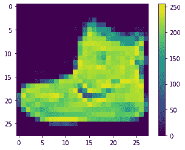
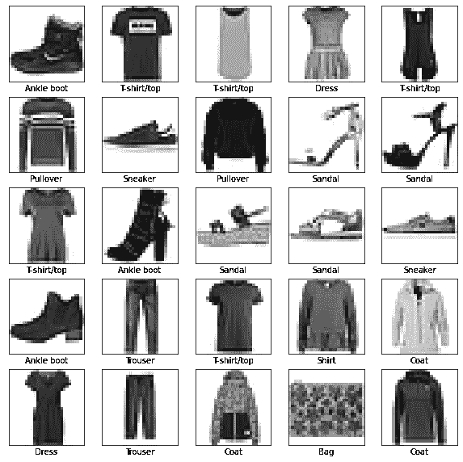
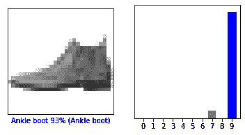
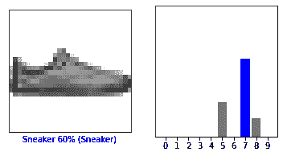
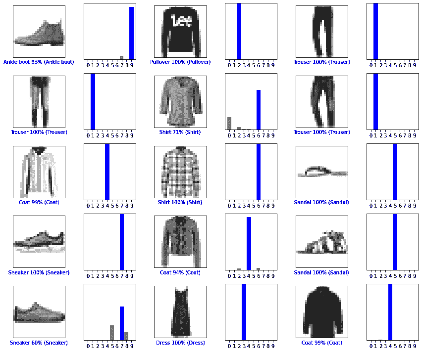
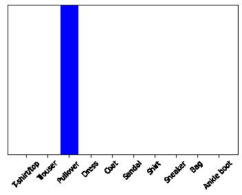

# 基本分类：对服装图像进行分类

> 原文：[https://tensorflow.google.cn/tutorials/keras/classification](https://tensorflow.google.cn/tutorials/keras/classification)

本指南将训练一个神经网络模型，对运动鞋和衬衫等服装图像进行分类。即使您不理解所有细节也没关系；这只是对完整 TensorFlow 程序的快速概述，详细内容会在您实际操作的同时进行介绍。

本指南使用了 [tf.keras](https://tensorflow.google.cn/guide/keras)，它是 TensorFlow 中用来构建和训练模型的高级 API。

```py
# TensorFlow and tf.keras
import tensorflow as tf
from tensorflow import keras

# Helper libraries
import numpy as np
import matplotlib.pyplot as plt

print(tf.__version__) 
```

```py
2.3.0

```

## 导入 Fashion MNIST 数据集

本指南使用 [Fashion MNIST](https://github.com/zalandoresearch/fashion-mnist) 数据集，该数据集包含 10 个类别的 70,000 个灰度图像。这些图像以低分辨率（28x28 像素）展示了单件衣物，如下所示：

|  |
| **图 1.** [Fashion-MNIST 样本](https://github.com/zalandoresearch/fashion-mnist)（由 Zalando 提供，MIT 许可）。
 |

Fashion MNIST 旨在临时替代经典 [MNIST](http://yann.lecun.com/exdb/mnist/) 数据集，后者常被用作计算机视觉机器学习程序的“Hello, World”。MNIST 数据集包含手写数字（0、1、2 等）的图像，其格式与您将使用的衣物图像的格式相同。

本指南使用 Fashion MNIST 来实现多样化，因为它比常规 MNIST 更具挑战性。这两个数据集都相对较小，都用于验证某个算法是否按预期工作。对于代码的测试和调试，它们都是很好的起点。

在本指南中，我们使用 60,000 个图像来训练网络，使用 10,000 个图像来评估网络学习对图像分类的准确率。您可以直接从 TensorFlow 访问 Fashion MNIST。请运行以下代码，直接从 TensorFlow 中导入和加载 Fashion MNIST 数据：

```py
fashion_mnist = keras.datasets.fashion_mnist

(train_images, train_labels), (test_images, test_labels) = fashion_mnist.load_data() 
```

加载数据集会返回四个 NumPy 数组：

*   `train_images` 和 `train_labels` 数组是*训练集*，即模型用于学习的数据。
*   *测试集*、`test_images` 和 `test_labels` 数组会被用来对模型进行测试。

图像是 28x28 的 NumPy 数组，像素值介于 0 到 255 之间。*标签*是整数数组，介于 0 到 9 之间。这些标签对应于图像所代表的服装*类*：

| 标签 | 类 |
| 0 | T 恤/上衣 |
| 1 | 裤子 |
| 2 | 套头衫 |
| 3 | 连衣裙 |
| 4 | 外套 |
| 5 | 凉鞋 |
| 6 | 衬衫 |
| 7 | 运动鞋 |
| 8 | 包 |
| 9 | 短靴 |

每个图像都会被映射到一个标签。由于数据集不包括*类名称*，请将它们存储在下方，供稍后绘制图像时使用：

```py
class_names = ['T-shirt/top', 'Trouser', 'Pullover', 'Dress', 'Coat',
               'Sandal', 'Shirt', 'Sneaker', 'Bag', 'Ankle boot'] 
```

## 浏览数据

在训练模型之前，我们先浏览一下数据集的格式。以下代码显示训练集中有 60,000 个图像，每个图像由 28 x 28 的像素表示：

```py
train_images.shape 
```

```py
(60000, 28, 28)

```

同样，训练集中有 60,000 个标签：

```py
len(train_labels) 
```

```py
60000

```

每个标签都是一个 0 到 9 之间的整数：

```py
train_labels 
```

```py
array([9, 0, 0, ..., 3, 0, 5], dtype=uint8)

```

测试集中有 10,000 个图像。同样，每个图像都由 28x28 个像素表示：

```py
test_images.shape 
```

```py
(10000, 28, 28)

```

测试集包含 10,000 个图像标签：

```py
len(test_labels) 
```

```py
10000

```

## 预处理数据

在训练网络之前，必须对数据进行预处理。如果您检查训练集中的第一个图像，您会看到像素值处于 0 到 255 之间：

```py
plt.figure()
plt.imshow(train_images[0])
plt.colorbar()
plt.grid(False)
plt.show() 
```



将这些值缩小至 0 到 1 之间，然后将其馈送到神经网络模型。为此，请将这些值除以 255。请务必以相同的方式对*训练集*和*测试集*进行预处理：

```py
train_images = train_images / 255.0

test_images = test_images / 255.0 
```

为了验证数据的格式是否正确，以及您是否已准备好构建和训练网络，让我们显示*训练集*中的前 25 个图像，并在每个图像下方显示类名称。

```py
plt.figure(figsize=(10,10))
for i in range(25):
    plt.subplot(5,5,i+1)
    plt.xticks([])
    plt.yticks([])
    plt.grid(False)
    plt.imshow(train_images[i], cmap=plt.cm.binary)
    plt.xlabel(class_names[train_labels[i]])
plt.show() 
```



## 构建模型

构建神经网络需要先配置模型的层，然后再编译模型。

### 设置层

神经网络的基本组成部分是*层*。层会从向其馈送的数据中提取表示形式。希望这些表示形式有助于解决手头上的问题。

大多数深度学习都包括将简单的层链接在一起。大多数层（如 [`tf.keras.layers.Dense`](https://tensorflow.google.cn/api_docs/python/tf/keras/layers/Dense)）都具有在训练期间才会学习的参数。

```py
model = keras.Sequential([
    keras.layers.Flatten(input_shape=(28, 28)),
    keras.layers.Dense(128, activation='relu'),
    keras.layers.Dense(10)
]) 
```

该网络的第一层 [`tf.keras.layers.Flatten`](https://tensorflow.google.cn/api_docs/python/tf/keras/layers/Flatten) 将图像格式从二维数组（28 x 28 像素）转换成一维数组（28 x 28 = 784 像素）。将该层视为图像中未堆叠的像素行并将其排列起来。该层没有要学习的参数，它只会重新格式化数据。

展平像素后，网络会包括两个 [`tf.keras.layers.Dense`](https://tensorflow.google.cn/api_docs/python/tf/keras/layers/Dense) 层的序列。它们是密集连接或全连接神经层。第一个 `Dense` 层有 128 个节点（或神经元）。第二个（也是最后一个）层会返回一个长度为 10 的 logits 数组。每个节点都包含一个得分，用来表示当前图像属于 10 个类中的哪一类。

### 编译模型

在准备对模型进行训练之前，还需要再对其进行一些设置。以下内容是在模型的*编译*步骤中添加的：

*   *损失函数* - 用于测量模型在训练期间的准确率。您会希望最小化此函数，以便将模型“引导”到正确的方向上。
*   *优化器* - 决定模型如何根据其看到的数据和自身的损失函数进行更新。
*   *指标* - 用于监控训练和测试步骤。以下示例使用了*准确率*，即被正确分类的图像的比率。

```py
model.compile(optimizer='adam',
              loss=tf.keras.losses.SparseCategoricalCrossentropy(from_logits=True),
              metrics=['accuracy']) 
```

## 训练模型

训练神经网络模型需要执行以下步骤：

1.  将训练数据馈送给模型。在本例中，训练数据位于 `train_images` 和 `train_labels` 数组中。
2.  模型学习将图像和标签关联起来。
3.  要求模型对测试集（在本例中为 `test_images` 数组）进行预测。
4.  验证预测是否与 `test_labels` 数组中的标签相匹配。

### 向模型馈送数据

要开始训练，请调用 `model.fit` 方法，这样命名是因为该方法会将模型与训练数据进行“拟合”：

```py
model.fit(train_images, train_labels, epochs=10) 
```

```py
Epoch 1/10
1875/1875 [==============================] - 3s 1ms/step - loss: 0.4924 - accuracy: 0.8265
Epoch 2/10
1875/1875 [==============================] - 3s 1ms/step - loss: 0.3698 - accuracy: 0.8669
Epoch 3/10
1875/1875 [==============================] - 3s 1ms/step - loss: 0.3340 - accuracy: 0.8781
Epoch 4/10
1875/1875 [==============================] - 3s 1ms/step - loss: 0.3110 - accuracy: 0.8863
Epoch 5/10
1875/1875 [==============================] - 3s 1ms/step - loss: 0.2924 - accuracy: 0.8936
Epoch 6/10
1875/1875 [==============================] - 3s 1ms/step - loss: 0.2776 - accuracy: 0.8972
Epoch 7/10
1875/1875 [==============================] - 3s 1ms/step - loss: 0.2659 - accuracy: 0.9021
Epoch 8/10
1875/1875 [==============================] - 3s 1ms/step - loss: 0.2543 - accuracy: 0.9052
Epoch 9/10
1875/1875 [==============================] - 3s 1ms/step - loss: 0.2453 - accuracy: 0.9084
Epoch 10/10
1875/1875 [==============================] - 3s 1ms/step - loss: 0.2366 - accuracy: 0.9122

<tensorflow.python.keras.callbacks.History at 0x7fc85fa4f2e8>

```

在模型训练期间，会显示损失和准确率指标。此模型在训练数据上的准确率达到了 0.91（或 91%）左右。

### 评估准确率

接下来，比较模型在测试数据集上的表现：

```py
test_loss, test_acc = model.evaluate(test_images,  test_labels, verbose=2)

print('\nTest accuracy:', test_acc) 
```

```py
313/313 - 0s - loss: 0.3726 - accuracy: 0.8635

Test accuracy: 0.8634999990463257

```

结果表明，模型在测试数据集上的准确率略低于训练数据集。训练准确率和测试准确率之间的差距代表*过拟合*。过拟合是指机器学习模型在新的、以前未曾见过的输入上的表现不如在训练数据上的表现。过拟合的模型会“记住”训练数据集中的噪声和细节，从而对模型在新数据上的表现产生负面影响。有关更多信息，请参阅以下内容：

*   [演示过拟合](https://tensorflow.google.cn/tutorials/keras/overfit_and_underfit#demonstrate_overfitting)
*   [避免过拟合的策略](https://tensorflow.google.cn/tutorials/keras/overfit_and_underfit#strategies_to_prevent_overfitting)

### 进行预测

在模型经过训练后，您可以使用它对一些图像进行预测。模型具有线性输出，即 [logits](https://developers.google.cn/machine-learning/glossary#logits)。您可以附加一个 softmax 层，将 logits 转换成更容易理解的概率。

```py
probability_model = tf.keras.Sequential([model, 
                                         tf.keras.layers.Softmax()]) 
```

```py
predictions = probability_model.predict(test_images) 
```

在上例中，模型预测了测试集中每个图像的标签。我们来看看第一个预测结果：

```py
predictions[0] 
```

```py
array([6.9982241e-07, 5.5403369e-08, 1.8353174e-07, 1.4761626e-07,
       2.4380807e-07, 1.9273469e-04, 1.8122660e-06, 6.5027133e-02,
       1.7891599e-06, 9.3477517e-01], dtype=float32)

```

预测结果是一个包含 10 个数字的数组。它们代表模型对 10 种不同服装中每种服装的“置信度”。您可以看到哪个标签的置信度值最大：

```py
np.argmax(predictions[0]) 
```

```py
9

```

因此，该模型非常确信这个图像是短靴，或 `class_names[9]`。通过检查测试标签发现这个分类是正确的：

```py
test_labels[0] 
```

```py
9

```

您可以将其绘制成图表，看看模型对于全部 10 个类的预测。

```py
def plot_image(i, predictions_array, true_label, img):
  predictions_array, true_label, img = predictions_array, true_label[i], img[i]
  plt.grid(False)
  plt.xticks([])
  plt.yticks([])

  plt.imshow(img, cmap=plt.cm.binary)

  predicted_label = np.argmax(predictions_array)
  if predicted_label == true_label:
    color = 'blue'
  else:
    color = 'red'

  plt.xlabel("{} {:2.0f}% ({})".format(class_names[predicted_label],
                                100*np.max(predictions_array),
                                class_names[true_label]),
                                color=color)

def plot_value_array(i, predictions_array, true_label):
  predictions_array, true_label = predictions_array, true_label[i]
  plt.grid(False)
  plt.xticks(range(10))
  plt.yticks([])
  thisplot = plt.bar(range(10), predictions_array, color="#777777")
  plt.ylim([0, 1])
  predicted_label = np.argmax(predictions_array)

  thisplot[predicted_label].set_color('red')
  thisplot[true_label].set_color('blue') 
```

### 验证预测结果

在模型经过训练后，您可以使用它对一些图像进行预测。

我们来看看第 0 个图像、预测结果和预测数组。正确的预测标签为蓝色，错误的预测标签为红色。数字表示预测标签的百分比（总计为 100）。

```py
i = 0
plt.figure(figsize=(6,3))
plt.subplot(1,2,1)
plot_image(i, predictions[i], test_labels, test_images)
plt.subplot(1,2,2)
plot_value_array(i, predictions[i],  test_labels)
plt.show() 
```



```py
i = 12
plt.figure(figsize=(6,3))
plt.subplot(1,2,1)
plot_image(i, predictions[i], test_labels, test_images)
plt.subplot(1,2,2)
plot_value_array(i, predictions[i],  test_labels)
plt.show() 
```



让我们用模型的预测绘制几张图像。请注意，即使置信度很高，模型也可能出错。

```py
# Plot the first X test images, their predicted labels, and the true labels.
# Color correct predictions in blue and incorrect predictions in red.
num_rows = 5
num_cols = 3
num_images = num_rows*num_cols
plt.figure(figsize=(2*2*num_cols, 2*num_rows))
for i in range(num_images):
  plt.subplot(num_rows, 2*num_cols, 2*i+1)
  plot_image(i, predictions[i], test_labels, test_images)
  plt.subplot(num_rows, 2*num_cols, 2*i+2)
  plot_value_array(i, predictions[i], test_labels)
plt.tight_layout()
plt.show() 
```



## 使用训练好的模型

最后，使用训练好的模型对单个图像进行预测。

```py
# Grab an image from the test dataset.
img = test_images[1]

print(img.shape) 
```

```py
(28, 28)

```

[`tf.keras`](https://tensorflow.google.cn/api_docs/python/tf/keras) 模型经过了优化，可同时对一个*批*或一组样本进行预测。因此，即便您只使用一个图像，您也需要将其添加到列表中：

```py
# Add the image to a batch where it's the only member.
img = (np.expand_dims(img,0))

print(img.shape) 
```

```py
(1, 28, 28)

```

现在预测这个图像的正确标签：

```py
predictions_single = probability_model.predict(img)

print(predictions_single) 
```

```py
[[1.0675135e-05 2.4023437e-12 9.9772269e-01 1.3299730e-09 1.2968916e-03
  8.7469149e-14 9.6970733e-04 5.4669354e-19 2.4514609e-11 1.8405429e-12]]

```

```py
plot_value_array(1, predictions_single[0], test_labels)
_ = plt.xticks(range(10), class_names, rotation=45) 
```



[`keras.Model.predict`](https://tensorflow.google.cn/api_docs/python/tf/keras/Model#predict) 会返回一组列表，每个列表对应一批数据中的每个图像。在批次中获取对我们（唯一）图像的预测：

```py
np.argmax(predictions_single[0]) 
```

```py
2

```

该模型会按照预期预测标签。

```py
# MIT License
#
# Copyright (c) 2017 François Chollet
#
# Permission is hereby granted, free of charge, to any person obtaining a
# copy of this software and associated documentation files (the "Software"),
# to deal in the Software without restriction, including without limitation
# the rights to use, copy, modify, merge, publish, distribute, sublicense,
# and/or sell copies of the Software, and to permit persons to whom the
# Software is furnished to do so, subject to the following conditions:
#
# The above copyright notice and this permission notice shall be included in
# all copies or substantial portions of the Software.
#
# THE SOFTWARE IS PROVIDED "AS IS", WITHOUT WARRANTY OF ANY KIND, EXPRESS OR
# IMPLIED, INCLUDING BUT NOT LIMITED TO THE WARRANTIES OF MERCHANTABILITY,
# FITNESS FOR A PARTICULAR PURPOSE AND NONINFRINGEMENT. IN NO EVENT SHALL
# THE AUTHORS OR COPYRIGHT HOLDERS BE LIABLE FOR ANY CLAIM, DAMAGES OR OTHER
# LIABILITY, WHETHER IN AN ACTION OF CONTRACT, TORT OR OTHERWISE, ARISING
# FROM, OUT OF OR IN CONNECTION WITH THE SOFTWARE OR THE USE OR OTHER
# DEALINGS IN THE SOFTWARE. 
```