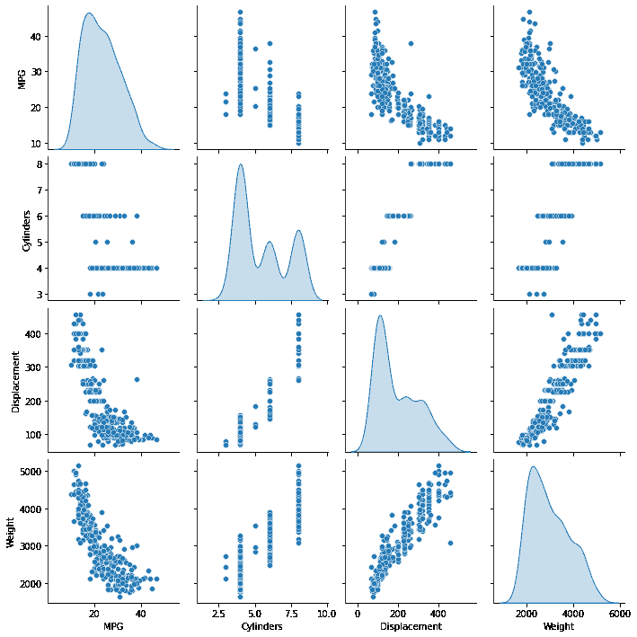
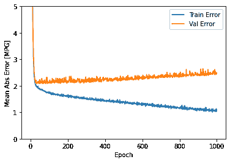
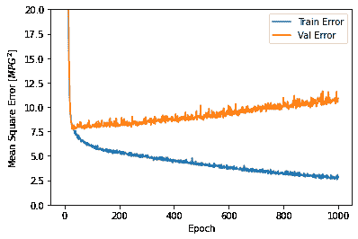
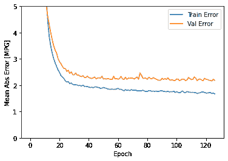
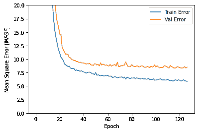
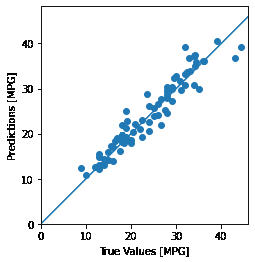
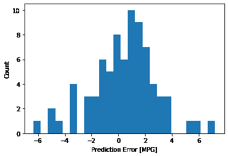

# Basic regression: Predict fuel efficiency

> 原文：[https://tensorflow.google.cn/tutorials/keras/regression](https://tensorflow.google.cn/tutorials/keras/regression)

<devsite-mathjax config="TeX-AMS-MML_SVG"></devsite-mathjax>

**Note:** 我们的 TensorFlow 社区翻译了这些文档。因为社区翻译是尽力而为， 所以无法保证它们是最准确的，并且反映了最新的 [官方英文文档](https://tensorflow.google.cn/?hl=en)。如果您有改进此翻译的建议， 请提交 pull request 到 [tensorflow/docs](https://github.com/tensorflow/docs) GitHub 仓库。要志愿地撰写或者审核译文，请加入 [docs-zh-cn@tensorflow.org Google Group](https://groups.google.com/a/tensorflow.org/forum/#!forum/docs-zh-cn)。

在 *回归 (regression)* 问题中，我们的目的是预测出如价格或概率这样连续值的输出。相对于*分类(classification)* 问题，*分类(classification)* 的目的是从一系列的分类出选择出一个分类 （如，给出一张包含苹果或橘子的图片，识别出图片中是哪种水果）。

本 notebook 使用经典的 [Auto MPG](https://archive.ics.uci.edu/ml/datasets/auto+mpg) 数据集，构建了一个用来预测 70 年代末到 80 年代初汽车燃油效率的模型。为了做到这一点，我们将为该模型提供许多那个时期的汽车描述。这个描述包含：气缸数，排量，马力以及重量。

本示例使用 [`tf.keras`](https://tensorflow.google.cn/api_docs/python/tf/keras) API，相关细节请参阅 [本指南](https://tensorflow.google.cn/guide/keras)。

```py
# 使用 seaborn 绘制矩阵图 (pairplot)
pip install -q seaborn

```

```py
WARNING: You are using pip version 20.2.2; however, version 20.2.3 is available.
You should consider upgrading via the '/tmpfs/src/tf_docs_env/bin/python -m pip install --upgrade pip' command.

```

```py
import pathlib

import matplotlib.pyplot as plt
import pandas as pd
import seaborn as sns

import tensorflow as tf

from tensorflow import keras
from tensorflow.keras import layers

print(tf.__version__) 
```

```py
2.3.0

```

## Auto MPG 数据集

该数据集可以从 [UCI 机器学习库](https://archive.ics.uci.edu/ml/) 中获取.

### 获取数据

首先下载数据集。

```py
dataset_path = keras.utils.get_file("auto-mpg.data", "http://archive.ics.uci.edu/ml/machine-learning-databases/auto-mpg/auto-mpg.data")
dataset_path 
```

```py
Downloading data from http://archive.ics.uci.edu/ml/machine-learning-databases/auto-mpg/auto-mpg.data
32768/30286 [================================] - 0s 1us/step

'/home/kbuilder/.keras/datasets/auto-mpg.data'

```

使用 pandas 导入数据集。

```py
column_names = ['MPG','Cylinders','Displacement','Horsepower','Weight',
                'Acceleration', 'Model Year', 'Origin']
raw_dataset = pd.read_csv(dataset_path, names=column_names,
                      na_values = "?", comment='\t',
                      sep=" ", skipinitialspace=True)

dataset = raw_dataset.copy()
dataset.tail() 
```

<devsite-iframe><iframe src="/tutorials/keras/regression_c2c7b23a4a5727b4a9181f216946c4e868a70ec07f79be23388ba93b29ea1a47.frame" class="framebox inherit-locale " allowfullscreen="" is-upgraded=""></iframe></devsite-iframe>

### 数据清洗

数据集中包括一些未知值。

```py
dataset.isna().sum() 
```

```py
MPG             0
Cylinders       0
Displacement    0
Horsepower      6
Weight          0
Acceleration    0
Model Year      0
Origin          0
dtype: int64

```

为了保证这个初始示例的简单性，删除这些行。

```py
dataset = dataset.dropna() 
```

`"Origin"` 列实际上代表分类，而不仅仅是一个数字。所以把它转换为独热码 （one-hot）:

```py
origin = dataset.pop('Origin') 
```

```py
dataset['USA'] = (origin == 1)*1.0
dataset['Europe'] = (origin == 2)*1.0
dataset['Japan'] = (origin == 3)*1.0
dataset.tail() 
```

<devsite-iframe><iframe src="/tutorials/keras/regression_e0297b2db24ea564c306921a48f1bc40c18ddc626a86746db61cd82dbc3c3c20.frame" class="framebox inherit-locale " allowfullscreen="" is-upgraded=""></iframe></devsite-iframe>

### 拆分训练数据集和测试数据集

现在需要将数据集拆分为一个训练数据集和一个测试数据集。

我们最后将使用测试数据集对模型进行评估。

```py
train_dataset = dataset.sample(frac=0.8,random_state=0)
test_dataset = dataset.drop(train_dataset.index) 
```

### 数据检查

快速查看训练集中几对列的联合分布。

```py
sns.pairplot(train_dataset[["MPG", "Cylinders", "Displacement", "Weight"]], diag_kind="kde") 
```

```py
<seaborn.axisgrid.PairGrid at 0x7f708ca93e80>

```



也可以查看总体的数据统计:

```py
train_stats = train_dataset.describe()
train_stats.pop("MPG")
train_stats = train_stats.transpose()
train_stats 
```

<devsite-iframe><iframe src="/tutorials/keras/regression_ba0849c742fe92394897de4a92ca81859740311a71cec773244f86a46b761fea.frame" class="framebox inherit-locale " allowfullscreen="" is-upgraded=""></iframe></devsite-iframe>

### 从标签中分离特征

将特征值从目标值或者"标签"中分离。 这个标签是你使用训练模型进行预测的值。

```py
train_labels = train_dataset.pop('MPG')
test_labels = test_dataset.pop('MPG') 
```

### 数据规范化

再次审视下上面的 `train_stats` 部分，并注意每个特征的范围有什么不同。

使用不同的尺度和范围对特征归一化是好的实践。尽管模型*可能* 在没有特征归一化的情况下收敛，它会使得模型训练更加复杂，并会造成生成的模型依赖输入所使用的单位选择。

注意：尽管我们仅仅从训练集中有意生成这些统计数据，但是这些统计信息也会用于归一化的测试数据集。我们需要这样做，将测试数据集放入到与已经训练过的模型相同的分布中。

```py
def norm(x):
  return (x - train_stats['mean']) / train_stats['std']
normed_train_data = norm(train_dataset)
normed_test_data = norm(test_dataset) 
```

我们将会使用这个已经归一化的数据来训练模型。

警告: 用于归一化输入的数据统计（均值和标准差）需要反馈给模型从而应用于任何其他数据，以及我们之前所获得独热码。这些数据包含测试数据集以及生产环境中所使用的实时数据。

## 模型

### 构建模型

让我们来构建我们自己的模型。这里，我们将会使用一个“顺序”模型，其中包含两个紧密相连的隐藏层，以及返回单个、连续值得输出层。模型的构建步骤包含于一个名叫 'build_model' 的函数中，稍后我们将会创建第二个模型。 两个密集连接的隐藏层。

```py
def build_model():
  model = keras.Sequential([
    layers.Dense(64, activation='relu', input_shape=[len(train_dataset.keys())]),
    layers.Dense(64, activation='relu'),
    layers.Dense(1)
  ])

  optimizer = tf.keras.optimizers.RMSprop(0.001)

  model.compile(loss='mse',
                optimizer=optimizer,
                metrics=['mae', 'mse'])
  return model 
```

```py
model = build_model() 
```

### 检查模型

使用 `.summary` 方法来打印该模型的简单描述。

```py
model.summary() 
```

```py
Model: "sequential"
_________________________________________________________________
Layer (type)                 Output Shape              Param #   
=================================================================
dense (Dense)                (None, 64)                640       
_________________________________________________________________
dense_1 (Dense)              (None, 64)                4160      
_________________________________________________________________
dense_2 (Dense)              (None, 1)                 65        
=================================================================
Total params: 4,865
Trainable params: 4,865
Non-trainable params: 0
_________________________________________________________________

```

现在试用下这个模型。从训练数据中批量获取‘10’条例子并对这些例子调用 `model.predict` 。

```py
example_batch = normed_train_data[:10]
example_result = model.predict(example_batch)
example_result 
```

```py
array([[0.15074062],
       [0.0973136 ],
       [0.17310914],
       [0.08873479],
       [0.52456   ],
       [0.05311462],
       [0.49406645],
       [0.04333409],
       [0.12005241],
       [0.6703117 ]], dtype=float32)

```

它似乎在工作，并产生了预期的形状和类型的结果

### 训练模型

对模型进行 1000 个周期的训练，并在 `history` 对象中记录训练和验证的准确性。

```py
# 通过为每个完成的时期打印一个点来显示训练进度
class PrintDot(keras.callbacks.Callback):
  def on_epoch_end(self, epoch, logs):
    if epoch % 100 == 0: print('')
    print('.', end='')

EPOCHS = 1000

history = model.fit(
  normed_train_data, train_labels,
  epochs=EPOCHS, validation_split = 0.2, verbose=0,
  callbacks=[PrintDot()]) 
```

```py

....................................................................................................
....................................................................................................
....................................................................................................
....................................................................................................
....................................................................................................
....................................................................................................
....................................................................................................
....................................................................................................
....................................................................................................
....................................................................................................

```

使用 `history` 对象中存储的统计信息可视化模型的训练进度。

```py
hist = pd.DataFrame(history.history)
hist['epoch'] = history.epoch
hist.tail() 
```

<devsite-iframe><iframe src="/tutorials/keras/regression_52ac85b91795872c54d7abf74ad7251d16b43867b9d311b29a56d2648222a3f7.frame" class="framebox inherit-locale " allowfullscreen="" is-upgraded=""></iframe></devsite-iframe>

```py
def plot_history(history):
  hist = pd.DataFrame(history.history)
  hist['epoch'] = history.epoch

  plt.figure()
  plt.xlabel('Epoch')
  plt.ylabel('Mean Abs Error [MPG]')
  plt.plot(hist['epoch'], hist['mae'],
           label='Train Error')
  plt.plot(hist['epoch'], hist['val_mae'],
           label = 'Val Error')
  plt.ylim([0,5])
  plt.legend()

  plt.figure()
  plt.xlabel('Epoch')
  plt.ylabel('Mean Square Error [$MPG^2$]')
  plt.plot(hist['epoch'], hist['mse'],
           label='Train Error')
  plt.plot(hist['epoch'], hist['val_mse'],
           label = 'Val Error')
  plt.ylim([0,20])
  plt.legend()
  plt.show()

plot_history(history) 
```





该图表显示在约 100 个 epochs 之后误差非但没有改进，反而出现恶化。 让我们更新 `model.fit` 调用，当验证值没有提高上是自动停止训练。 我们将使用一个 *EarlyStopping callback* 来测试每个 epoch 的训练条件。如果经过一定数量的 epochs 后没有改进，则自动停止训练。

你可以从[这里](https://tensorflow.google.cn/versions/master/api_docs/python/tf/keras/callbacks/EarlyStopping)学习到更多的回调。

```py
model = build_model()

# patience 值用来检查改进 epochs 的数量
early_stop = keras.callbacks.EarlyStopping(monitor='val_loss', patience=10)

history = model.fit(normed_train_data, train_labels, epochs=EPOCHS,
                    validation_split = 0.2, verbose=0, callbacks=[early_stop, PrintDot()])

plot_history(history) 
```

```py

....................................................................................................
...........................

```





如图所示，验证集中的平均的误差通常在 +/- 2 MPG 左右。 这个结果好么？ 我们将决定权留给你。

让我们看看通过使用 **测试集** 来泛化模型的效果如何，我们在训练模型时没有使用测试集。这告诉我们，当我们在现实世界中使用这个模型时，我们可以期望它预测得有多好。

```py
loss, mae, mse = model.evaluate(normed_test_data, test_labels, verbose=2)

print("Testing set Mean Abs Error: {:5.2f} MPG".format(mae)) 
```

```py
3/3 - 0s - loss: 5.9941 - mae: 1.8809 - mse: 5.9941
Testing set Mean Abs Error:  1.88 MPG

```

### 做预测

最后，使用测试集中的数据预测 MPG 值:

```py
test_predictions = model.predict(normed_test_data).flatten()

plt.scatter(test_labels, test_predictions)
plt.xlabel('True Values [MPG]')
plt.ylabel('Predictions [MPG]')
plt.axis('equal')
plt.axis('square')
plt.xlim([0,plt.xlim()[1]])
plt.ylim([0,plt.ylim()[1]])
_ = plt.plot([-100, 100], [-100, 100]) 
```



这看起来我们的模型预测得相当好。我们来看下误差分布。

```py
error = test_predictions - test_labels
plt.hist(error, bins = 25)
plt.xlabel("Prediction Error [MPG]")
_ = plt.ylabel("Count") 
```



它不是完全的高斯分布，但我们可以推断出，这是因为样本的数量很小所导致的。

## 结论

本笔记本 (notebook) 介绍了一些处理回归问题的技术。

*   均方误差（MSE）是用于回归问题的常见损失函数（分类问题中使用不同的损失函数）。
*   类似的，用于回归的评估指标与分类不同。 常见的回归指标是平均绝对误差（MAE）。
*   当数字输入数据特征的值存在不同范围时，每个特征应独立缩放到相同范围。
*   如果训练数据不多，一种方法是选择隐藏层较少的小网络，以避免过度拟合。
*   早期停止是一种防止过度拟合的有效技术。

```py
# MIT License
#
# Copyright (c) 2017 François Chollet
#
# Permission is hereby granted, free of charge, to any person obtaining a
# copy of this software and associated documentation files (the "Software"),
# to deal in the Software without restriction, including without limitation
# the rights to use, copy, modify, merge, publish, distribute, sublicense,
# and/or sell copies of the Software, and to permit persons to whom the
# Software is furnished to do so, subject to the following conditions:
#
# The above copyright notice and this permission notice shall be included in
# all copies or substantial portions of the Software.
#
# THE SOFTWARE IS PROVIDED "AS IS", WITHOUT WARRANTY OF ANY KIND, EXPRESS OR
# IMPLIED, INCLUDING BUT NOT LIMITED TO THE WARRANTIES OF MERCHANTABILITY,
# FITNESS FOR A PARTICULAR PURPOSE AND NONINFRINGEMENT. IN NO EVENT SHALL
# THE AUTHORS OR COPYRIGHT HOLDERS BE LIABLE FOR ANY CLAIM, DAMAGES OR OTHER
# LIABILITY, WHETHER IN AN ACTION OF CONTRACT, TORT OR OTHERWISE, ARISING
# FROM, OUT OF OR IN CONNECTION WITH THE SOFTWARE OR THE USE OR OTHER
# DEALINGS IN THE SOFTWARE. 
```