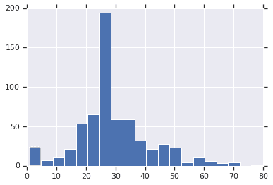
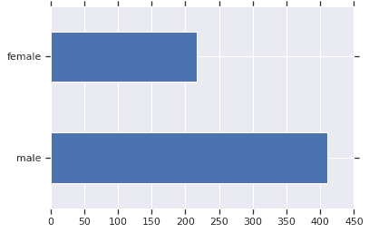
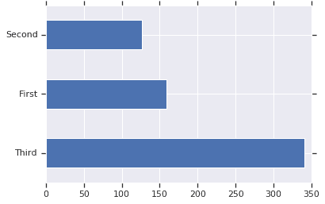
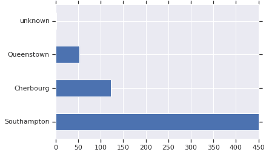
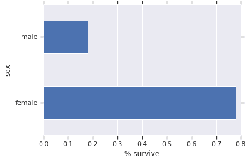
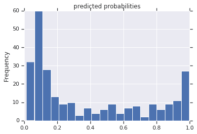
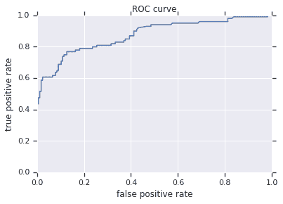

# 在 Tensorflow 中训练提升树（Boosted Trees）模型

> 原文：[https://tensorflow.google.cn/tutorials/estimator/boosted_trees](https://tensorflow.google.cn/tutorials/estimator/boosted_trees)

**Note:** 我们的 TensorFlow 社区翻译了这些文档。因为社区翻译是尽力而为， 所以无法保证它们是最准确的，并且反映了最新的 [官方英文文档](https://tensorflow.google.cn/?hl=en)。如果您有改进此翻译的建议， 请提交 pull request 到 [tensorflow/docs](https://github.com/tensorflow/docs) GitHub 仓库。要志愿地撰写或者审核译文，请加入 [docs-zh-cn@tensorflow.org Google Group](https://groups.google.com/a/tensorflow.org/forum/#!forum/docs-zh-cn)。

本教程是使用基于 [`tf.estimator`](https://tensorflow.google.cn/api_docs/python/tf/estimator) API 的决策树来训练梯度提升模型的端到端演示。提升树（Boosted Trees）模型是回归和分类问题中最受欢迎并最有效的机器学习方法之一。这是一种融合技术，它结合了几个（10 个，100 个或者甚至 1000 个）树模型的预测值。

提升树（Boosted Trees）模型受到许多机器学习从业者的欢迎，因为它们可以通过最小化的超参数调整获得令人印象深刻的性能。

## 加载泰坦尼克数据集

您将使用泰坦尼克数据集，该数据集的目标是在给出性别、年龄、阶级等特征的条件下预测乘客幸存与否。

```py
import numpy as np
import pandas as pd
from IPython.display import clear_output
from matplotlib import pyplot as plt

# 加载数据集。
dftrain = pd.read_csv('https://storage.googleapis.com/tf-datasets/titanic/train.csv')
dfeval = pd.read_csv('https://storage.googleapis.com/tf-datasets/titanic/eval.csv')
y_train = dftrain.pop('survived')
y_eval = dfeval.pop('survived') 
```

```py
import tensorflow as tf
tf.random.set_seed(123) 
```

数据集由训练集和验证集组成：

*   `dftrain` 与 `y_train` 是*训练集*——模型用来学习的数据。
*   模型根据*评估集*，`dfeval` 和 `y_eval` 进行测试。

您将使用以下特征来进行训练：

| 特征名称 | 描述 |
| sex | 乘客的性别 |
| age | 乘客的年龄 |
| n_siblings_spouses | 船上的兄弟姐妹与伙伴 |
| parch | 船上的父母与孩子 |
| fare | 乘客所支付的票价 |
| class | 乘客在船上的舱室等级 |
| deck | 哪个甲板上的乘客 |
| embark_town | 乘客是从哪个城镇上船的 |
| alone | 是否乘客独自一人 |

## 探索数据

让我们首先预览一些数据，并在训练集上创建摘要统计。

```py
dftrain.head() 
```

<devsite-iframe><iframe src="/tutorials/estimator/boosted_trees_e1d1ae84a379eaa74df0c61aaa7a21a3176437c97b21c8d76a60084b4492e8af.frame" class="framebox inherit-locale " allowfullscreen="" is-upgraded=""></iframe></devsite-iframe>

```py
dftrain.describe() 
```

<devsite-iframe><iframe src="/tutorials/estimator/boosted_trees_d8dcd808885e18f5a885898a43268a31ad574660d1cc95e2c479588cd86ac79e.frame" class="framebox inherit-locale " allowfullscreen="" is-upgraded=""></iframe></devsite-iframe>

训练集和评估集分别有 627 和 264 个样本。

```py
dftrain.shape[0], dfeval.shape[0] 
```

```py
(627, 264)

```

大多数乘客在 20 岁或 30 岁。

```py
dftrain.age.hist(bins=20)
plt.show() 
```



男乘客大约是女乘客的两倍。

```py
dftrain.sex.value_counts().plot(kind='barh')
plt.show() 
```



大多数乘客都在“三等”舱。

```py
dftrain['class'].value_counts().plot(kind='barh')
plt.show() 
```



大多数乘客从南安普顿出发。

```py
dftrain['embark_town'].value_counts().plot(kind='barh')
plt.show() 
```



与男性相比，女性存活的几率要高得多。这显然是该模型的预测特征。

```py
pd.concat([dftrain, y_train], axis=1).groupby('sex').survived.mean().plot(kind='barh').set_xlabel('% survive')
plt.show() 
```



## 创建特征列与输入函数

梯度提升（Gradient Boosting） Estimator 可以利用数值和分类特征。特征列适用于所有的 Tensorflow estimator，其目的是定义用于建模的特征。此外，它们还提供一些特征工程功能，如独热编码（one-hot-encoding）、标准化（normalization）和桶化（bucketization）。在本教程中，`CATEGORICAL_COLUMNS` 中的字段从分类列转换为独热编码列([指标列](https://tensorflow.google.cn/api_docs/python/tf/feature_column/indicator_column))：

```py
fc = tf.feature_column
CATEGORICAL_COLUMNS = ['sex', 'n_siblings_spouses', 'parch', 'class', 'deck',
                       'embark_town', 'alone']
NUMERIC_COLUMNS = ['age', 'fare']

def one_hot_cat_column(feature_name, vocab):
  return tf.feature_column.indicator_column(
      tf.feature_column.categorical_column_with_vocabulary_list(feature_name,
                                                 vocab))
feature_columns = []
for feature_name in CATEGORICAL_COLUMNS:
  # Need to one-hot encode categorical features.
  vocabulary = dftrain[feature_name].unique()
  feature_columns.append(one_hot_cat_column(feature_name, vocabulary))

for feature_name in NUMERIC_COLUMNS:
  feature_columns.append(tf.feature_column.numeric_column(feature_name,
                                           dtype=tf.float32)) 
```

您可以查看特征列生成的转换。例如，以下是在单个样本中使用 `indicator_column` 的输出：

```py
example = dict(dftrain.head(1))
class_fc = tf.feature_column.indicator_column(tf.feature_column.categorical_column_with_vocabulary_list('class', ('First', 'Second', 'Third')))
print('Feature value: "{}"'.format(example['class'].iloc[0]))
print('One-hot encoded: ', tf.keras.layers.DenseFeatures([class_fc])(example).numpy()) 
```

```py
Feature value: "Third"
One-hot encoded:  [[ 0\.  0\.  1.]]

```

此外，您还可以一起查看所有特征列的转换：

```py
tf.keras.layers.DenseFeatures(feature_columns)(example).numpy() 
```

```py
array([[ 22\.  ,   1\.  ,   0\.  ,   1\.  ,   0\.  ,   0\.  ,   1\.  ,   0\.  ,

          0\.  ,   0\.  ,   0\.  ,   0\.  ,   0\.  ,   0\.  ,   1\.  ,   0\.  ,
          0\.  ,   0\.  ,   7.25,   1\.  ,   0\.  ,   0\.  ,   0\.  ,   0\.  ,
          0\.  ,   0\.  ,   1\.  ,   0\.  ,   0\.  ,   0\.  ,   0\.  ,   0\.  ,
          1\.  ,   0\.  ]], dtype=float32)

```

接下来，您需要创建输入函数。这些将指定如何将数据读入到我们的模型中以供训练与推理。您将使用 [`tf.data`](https://tensorflow.google.cn/api_docs/python/tf/data)API 中的 `from_tensor_slices` 方法直接从 Pandas 中读取数据。这适用于较小的内存数据集。对于较大的数据集，tf.data API 支持各种文件格式（包括 [csv](https://tensorflow.google.cn/api_docs/python/tf/data/experimental/make_csv_dataset)）,以便您能处理那些不适合放入内存中的数据集。

```py
# 使用大小为全部数据的 batch ，因为数据规模非常小.
NUM_EXAMPLES = len(y_train)

def make_input_fn(X, y, n_epochs=None, shuffle=True):
  def input_fn():
    dataset = tf.data.Dataset.from_tensor_slices((dict(X), y))
    if shuffle:
      dataset = dataset.shuffle(NUM_EXAMPLES)
    # 对于训练，可以按需多次循环数据集（n_epochs=None）。
    dataset = dataset.repeat(n_epochs)
    # 在内存中训练不使用 batch。
    dataset = dataset.batch(NUM_EXAMPLES)
    return dataset
  return input_fn

# 训练与评估的输入函数。
train_input_fn = make_input_fn(dftrain, y_train)
eval_input_fn = make_input_fn(dfeval, y_eval, shuffle=False, n_epochs=1) 
```

## 训练与评估模型

您将执行以下步骤：

1.  初始化模型，指定特征和超参数。
2.  使用 `train_input_fn` 将训练数据输入模型，使用 `train` 函数训练模型。
3.  您将使用此示例中的评估集评估模型性能，即 `dfeval` DataFrame。您将验证预测是否与 `y_eval` 数组中的标签匹配。

在训练提升树（Boosted Trees）模型之前，让我们先训练一个线性分类器（逻辑回归模型）。最好的做法是从更简单的模型开始建立基准。

```py
linear_est = tf.estimator.LinearClassifier(feature_columns)

# 训练模型。
linear_est.train(train_input_fn, max_steps=100)

# 评估。
result = linear_est.evaluate(eval_input_fn)
clear_output()
print(pd.Series(result)) 
```

```py
accuracy                  0.765152
accuracy_baseline         0.625000
auc                       0.832844
auc_precision_recall      0.789631
average_loss              0.478908
global_step             100.000000
label/mean                0.375000
loss                      0.478908
precision                 0.703297
prediction/mean           0.350790
recall                    0.646465
dtype: float64

```

下面让我们训练提升树（Boosted Trees）模型。提升树（Boosted Trees）是支持回归（`BoostedTreesRegressor`）和分类（`BoostedTreesClassifier`）的。由于目标是预测一个生存与否的标签，您将使用 `BoostedTreesClassifier`。

```py
# 由于数据存入内存中，在每层使用全部数据会更快。
# 上面一个 batch 定义为整个数据集。
n_batches = 1
est = tf.estimator.BoostedTreesClassifier(feature_columns,
                                          n_batches_per_layer=n_batches)

# 一旦建立了指定数量的树，模型将停止训练，
# 而不是基于训练步数。
est.train(train_input_fn, max_steps=100)

# 评估。
result = est.evaluate(eval_input_fn)
clear_output()
print(pd.Series(result)) 
```

```py
accuracy                  0.829545
accuracy_baseline         0.625000
auc                       0.872788
auc_precision_recall      0.857807
average_loss              0.411839
global_step             100.000000
label/mean                0.375000
loss                      0.411839
precision                 0.793478
prediction/mean           0.381942
recall                    0.737374
dtype: float64

```

现在您可以使用训练的模型从评估集上对乘客进行预测了。Tensorflow 模型经过优化，可以同时在一个 batch 或一个集合的样本上进行预测。之前，`eval_inout_fn` 是使用整个评估集定义的。

```py
pred_dicts = list(est.predict(eval_input_fn))
probs = pd.Series([pred['probabilities'][1] for pred in pred_dicts])

probs.plot(kind='hist', bins=20, title='predicted probabilities')
plt.show() 
```



最后，您还可以查看结果的受试者工作特征曲线（ROC），这将使我们更好地了解真阳性率与假阴性率之间的权衡。

```py
from sklearn.metrics import roc_curve

fpr, tpr, _ = roc_curve(y_eval, probs)
plt.plot(fpr, tpr)
plt.title('ROC curve')
plt.xlabel('false positive rate')
plt.ylabel('true positive rate')
plt.xlim(0,)
plt.ylim(0,)
plt.show() 
```

