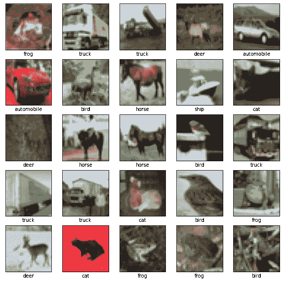
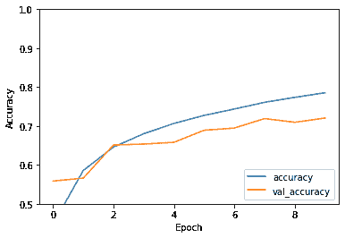

# 卷积神经网络（Convolutional Neural Network, CNN）

> 原文：[https://tensorflow.google.cn/tutorials/images/cnn](https://tensorflow.google.cn/tutorials/images/cnn)

**Note:** 我们的 TensorFlow 社区翻译了这些文档。因为社区翻译是尽力而为， 所以无法保证它们是最准确的，并且反映了最新的 [官方英文文档](https://tensorflow.google.cn/?hl=en)。如果您有改进此翻译的建议， 请提交 pull request 到 [tensorflow/docs-l10n](https://github.com/tensorflow/docs-l10n) GitHub 仓库。要志愿地撰写或者审核译文，请加入 [docs-zh-cn@tensorflow.org Google Group](https://groups.google.com/a/tensorflow.org/forum/#!forum/docs-zh-cn)。

### 导入 TensorFlow

```py
import tensorflow as tf

from tensorflow.keras import datasets, layers, models
import matplotlib.pyplot as plt 
```

### 下载并准备 CIFAR10 数据集

CIFAR10 数据集包含 10 类，共 60000 张彩色图片，每类图片有 6000 张。此数据集中 50000 个样例被作为训练集，剩余 10000 个样例作为测试集。类之间相互度立，不存在重叠的部分。

```py
(train_images, train_labels), (test_images, test_labels) = datasets.cifar10.load_data()

# 将像素的值标准化至 0 到 1 的区间内。
train_images, test_images = train_images / 255.0, test_images / 255.0 
```

### 验证数据

我们将测试集的前 25 张图片和类名打印出来，来确保数据集被正确加载。

```py
class_names = ['airplane', 'automobile', 'bird', 'cat', 'deer',
               'dog', 'frog', 'horse', 'ship', 'truck']

plt.figure(figsize=(10,10))
for i in range(25):
    plt.subplot(5,5,i+1)
    plt.xticks([])
    plt.yticks([])
    plt.grid(False)
    plt.imshow(train_images[i], cmap=plt.cm.binary)
    # 由于 CIFAR 的标签是 array， 
    # 因此您需要额外的索引（index）。
    plt.xlabel(class_names[train_labels[i][0]])
plt.show() 
```



### 构造卷积神经网络模型

下方展示的 6 行代码声明了了一个常见卷积神经网络，由几个 [Conv2D](https://tensorflow.google.cn/api_docs/python/tf/keras/layers/Conv2D) 和 [MaxPooling2D](https://tensorflow.google.cn/api_docs/python/tf/keras/layers/MaxPool2D) 层组成。

CNN 的输入是张量 (Tensor) 形式的 (image_height, image_width, color_channels)，包含了图像高度、宽度及颜色信息。不需要输入 batch size。如果您不熟悉图像处理，颜色信息建议您使用 RGB 色彩模式，此模式下，`color_channels` 为 `(R,G,B)` 分别对应 RGB 的三个颜色通道（color channel）。在此示例中，我们的 CNN 输入，CIFAR 数据集中的图片，形状是 `(32, 32, 3)`。您可以在声明第一层时将形状赋值给参数 `input_shape` 。

```py
model = models.Sequential()
model.add(layers.Conv2D(32, (3, 3), activation='relu', input_shape=(32, 32, 3)))
model.add(layers.MaxPooling2D((2, 2)))
model.add(layers.Conv2D(64, (3, 3), activation='relu'))
model.add(layers.MaxPooling2D((2, 2)))
model.add(layers.Conv2D(64, (3, 3), activation='relu')) 
```

我们声明的 CNN 结构是：

```py
model.summary() 
```

```py
Model: "sequential"
_________________________________________________________________
Layer (type)                 Output Shape              Param #   
=================================================================
conv2d (Conv2D)              (None, 30, 30, 32)        896       
_________________________________________________________________
max_pooling2d (MaxPooling2D) (None, 15, 15, 32)        0         
_________________________________________________________________
conv2d_1 (Conv2D)            (None, 13, 13, 64)        18496     
_________________________________________________________________
max_pooling2d_1 (MaxPooling2 (None, 6, 6, 64)          0         
_________________________________________________________________
conv2d_2 (Conv2D)            (None, 4, 4, 64)          36928     
=================================================================
Total params: 56,320
Trainable params: 56,320
Non-trainable params: 0
_________________________________________________________________

```

在上面的结构中，您可以看到每个 Conv2D 和 MaxPooling2D 层的输出都是一个三维的张量 (Tensor)，其形状描述了 (height, width, channels)。越深的层中，宽度和高度都会收缩。每个 Conv2D 层输出的通道数量 (channels) 取决于声明层时的第一个参数（如：上面代码中的 32 或 64）。这样，由于宽度和高度的收缩，您便可以（从运算的角度）增加每个 Conv2D 层输出的通道数量 (channels)。

### 增加 Dense 层

*Dense 层等同于全连接 (Full Connected) 层。*
在模型的最后，您将把卷积后的输出张量（本例中形状为 (4, 4, 64)）传给一个或多个 Dense 层来完成分类。Dense 层的输入为向量（一维），但前面层的输出是 3 维的张量 (Tensor)。因此您需要将三维张量展开 (flatten) 到 1 维，之后再传入一个或多个 Dense 层。CIFAR 数据集有 10 个类，因此您最终的 Dense 层需要 10 个输出及一个 softmax 激活函数。

```py
model.add(layers.Flatten())
model.add(layers.Dense(64, activation='relu'))
model.add(layers.Dense(10)) 
```

查看完整的 CNN 结构：

```py
model.summary() 
```

```py
Model: "sequential"
_________________________________________________________________
Layer (type)                 Output Shape              Param #   
=================================================================
conv2d (Conv2D)              (None, 30, 30, 32)        896       
_________________________________________________________________
max_pooling2d (MaxPooling2D) (None, 15, 15, 32)        0         
_________________________________________________________________
conv2d_1 (Conv2D)            (None, 13, 13, 64)        18496     
_________________________________________________________________
max_pooling2d_1 (MaxPooling2 (None, 6, 6, 64)          0         
_________________________________________________________________
conv2d_2 (Conv2D)            (None, 4, 4, 64)          36928     
_________________________________________________________________
flatten (Flatten)            (None, 1024)              0         
_________________________________________________________________
dense (Dense)                (None, 64)                65600     
_________________________________________________________________
dense_1 (Dense)              (None, 10)                650       
=================================================================
Total params: 122,570
Trainable params: 122,570
Non-trainable params: 0
_________________________________________________________________

```

可以看出，在被传入两个 Dense 层之前，形状为 (4, 4, 64) 的输出被展平成了形状为 (1024) 的向量。

### 编译并训练模型

```py
model.compile(optimizer='adam',
              loss=tf.keras.losses.SparseCategoricalCrossentropy(from_logits=True),
              metrics=['accuracy'])

history = model.fit(train_images, train_labels, epochs=10, 
                    validation_data=(test_images, test_labels)) 
```

```py
Epoch 1/10
1563/1563 [==============================] - 5s 3ms/step - loss: 1.5143 - accuracy: 0.4469 - val_loss: 1.2281 - val_accuracy: 0.5585
Epoch 2/10
1563/1563 [==============================] - 5s 3ms/step - loss: 1.1625 - accuracy: 0.5855 - val_loss: 1.2102 - val_accuracy: 0.5660
Epoch 3/10
1563/1563 [==============================] - 5s 3ms/step - loss: 1.0049 - accuracy: 0.6458 - val_loss: 0.9935 - val_accuracy: 0.6511
Epoch 4/10
1563/1563 [==============================] - 5s 3ms/step - loss: 0.9089 - accuracy: 0.6801 - val_loss: 0.9658 - val_accuracy: 0.6536
Epoch 5/10
1563/1563 [==============================] - 5s 3ms/step - loss: 0.8341 - accuracy: 0.7066 - val_loss: 0.9890 - val_accuracy: 0.6581
Epoch 6/10
1563/1563 [==============================] - 5s 3ms/step - loss: 0.7797 - accuracy: 0.7272 - val_loss: 0.8948 - val_accuracy: 0.6891
Epoch 7/10
1563/1563 [==============================] - 5s 3ms/step - loss: 0.7287 - accuracy: 0.7437 - val_loss: 0.9004 - val_accuracy: 0.6947
Epoch 8/10
1563/1563 [==============================] - 5s 3ms/step - loss: 0.6858 - accuracy: 0.7609 - val_loss: 0.8284 - val_accuracy: 0.7191
Epoch 9/10
1563/1563 [==============================] - 5s 3ms/step - loss: 0.6448 - accuracy: 0.7736 - val_loss: 0.8752 - val_accuracy: 0.7096
Epoch 10/10
1563/1563 [==============================] - 5s 3ms/step - loss: 0.6117 - accuracy: 0.7855 - val_loss: 0.8524 - val_accuracy: 0.7204

```

### 评估模型

```py
plt.plot(history.history['accuracy'], label='accuracy')
plt.plot(history.history['val_accuracy'], label = 'val_accuracy')
plt.xlabel('Epoch')
plt.ylabel('Accuracy')
plt.ylim([0.5, 1])
plt.legend(loc='lower right')
plt.show()

test_loss, test_acc = model.evaluate(test_images,  test_labels, verbose=2) 
```



```py
313/313 - 1s - loss: 0.8524 - accuracy: 0.7204

```

```py
print(test_acc) 
```

```py
0.7203999757766724

```

我们搭建的简单的 CNN 模型在测试集上可以达到 70% 的准确率。对于只有几行的代码来说效果不错！对于另一种 CNN 结构可参考另一个使用的基于 Keras 子类 API 和 [`tf.GradientTape`](https://tensorflow.google.cn/api_docs/python/tf/GradientTape) 的样例 [here](https://tensorflow.google.cn/tutorials/quickstart/advanced)。