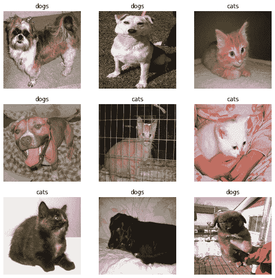
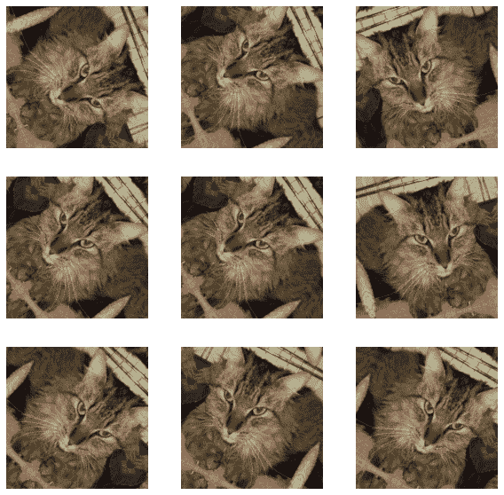
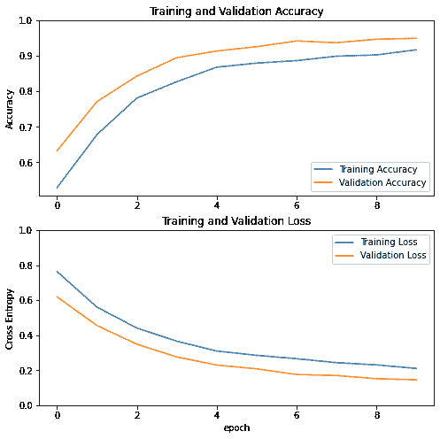
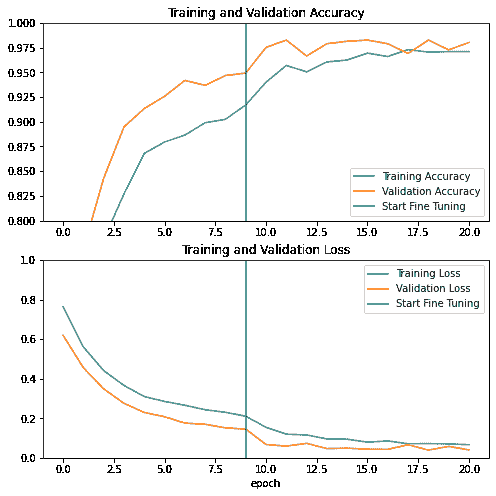
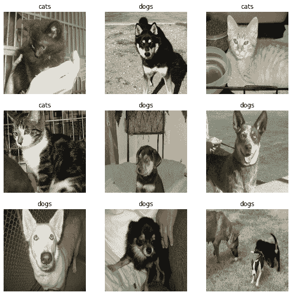

# Transfer learning and fine-tuning

> 原文：[https://tensorflow.google.cn/tutorials/images/transfer_learning](https://tensorflow.google.cn/tutorials/images/transfer_learning)

In this tutorial, you will learn how to classify images of cats and dogs by using transfer learning from a pre-trained network.

A pre-trained model is a saved network that was previously trained on a large dataset, typically on a large-scale image-classification task. You either use the pretrained model as is or use transfer learning to customize this model to a given task.

The intuition behind transfer learning for image classification is that if a model is trained on a large and general enough dataset, this model will effectively serve as a generic model of the visual world. You can then take advantage of these learned feature maps without having to start from scratch by training a large model on a large dataset.

In this notebook, you will try two ways to customize a pretrained model:

1.  Feature Extraction: Use the representations learned by a previous network to extract meaningful features from new samples. You simply add a new classifier, which will be trained from scratch, on top of the pretrained model so that you can repurpose the feature maps learned previously for the dataset.

    You do not need to (re)train the entire model. The base convolutional network already contains features that are generically useful for classifying pictures. However, the final, classification part of the pretrained model is specific to the original classification task, and subsequently specific to the set of classes on which the model was trained.

2.  Fine-Tuning: Unfreeze a few of the top layers of a frozen model base and jointly train both the newly-added classifier layers and the last layers of the base model. This allows us to "fine-tune" the higher-order feature representations in the base model in order to make them more relevant for the specific task.

You will follow the general machine learning workflow.

1.  Examine and understand the data
2.  Build an input pipeline, in this case using Keras ImageDataGenerator
3.  Compose the model
    *   Load in the pretrained base model (and pretrained weights)
    *   Stack the classification layers on top
4.  Train the model
5.  Evaluate model

```py
pip install -q tf-nightly

```

```py
WARNING: You are using pip version 20.2.2; however, version 20.2.3 is available.
You should consider upgrading via the '/tmpfs/src/tf_docs_env/bin/python -m pip install --upgrade pip' command.

```

```py
import matplotlib.pyplot as plt
import numpy as np
import os
import tensorflow as tf

from tensorflow.keras.preprocessing import image_dataset_from_directory 
```

## Data preprocessing

### Data download

In this tutorial, you will use a dataset containing several thousand images of cats and dogs. Download and extract a zip file containing the images, then create a [`tf.data.Dataset`](https://tensorflow.google.cn/api_docs/python/tf/data/Dataset) for training and validation using the [`tf.keras.preprocessing.image_dataset_from_directory`](https://tensorflow.google.cn/api_docs/python/tf/keras/preprocessing/image_dataset_from_directory) utility. You can learn more about loading images in this [tutorial](https://tensorflow.google.cn/tutorials/load_data/images).

```py
_URL = 'https://storage.googleapis.com/mledu-datasets/cats_and_dogs_filtered.zip'
path_to_zip = tf.keras.utils.get_file('cats_and_dogs.zip', origin=_URL, extract=True)
PATH = os.path.join(os.path.dirname(path_to_zip), 'cats_and_dogs_filtered')

train_dir = os.path.join(PATH, 'train')
validation_dir = os.path.join(PATH, 'validation')

BATCH_SIZE = 32
IMG_SIZE = (160, 160)

train_dataset = image_dataset_from_directory(train_dir,
                                             shuffle=True,
                                             batch_size=BATCH_SIZE,
                                             image_size=IMG_SIZE) 
```

```py
Downloading data from https://storage.googleapis.com/mledu-datasets/cats_and_dogs_filtered.zip
68608000/68606236 [==============================] - 1s 0us/step
Found 2000 files belonging to 2 classes.

```

```py
validation_dataset = image_dataset_from_directory(validation_dir,
                                                  shuffle=True,
                                                  batch_size=BATCH_SIZE,
                                                  image_size=IMG_SIZE) 
```

```py
Found 1000 files belonging to 2 classes.

```

Show the first nine images and labels from the training set:

```py
class_names = train_dataset.class_names

plt.figure(figsize=(10, 10))
for images, labels in train_dataset.take(1):
  for i in range(9):
    ax = plt.subplot(3, 3, i + 1)
    plt.imshow(images[i].numpy().astype("uint8"))
    plt.title(class_names[labels[i]])
    plt.axis("off") 
```



As the original dataset doesn't contains a test set, you will create one. To do so, determine how many batches of data are available in the validation set using `tf.data.experimental.cardinality`, then move 20% of them to a test set.

```py
val_batches = tf.data.experimental.cardinality(validation_dataset)
test_dataset = validation_dataset.take(val_batches // 5)
validation_dataset = validation_dataset.skip(val_batches // 5) 
```

```py
print('Number of validation batches: %d' % tf.data.experimental.cardinality(validation_dataset))
print('Number of test batches: %d' % tf.data.experimental.cardinality(test_dataset)) 
```

```py
Number of validation batches: 26
Number of test batches: 6

```

### Configure the dataset for performance

Use buffered prefetching to load images from disk without having I/O become blocking. To learn more about this method see the [data performance](https://tensorflow.google.cn/guide/data_performance) guide.

```py
AUTOTUNE = tf.data.experimental.AUTOTUNE

train_dataset = train_dataset.prefetch(buffer_size=AUTOTUNE)
validation_dataset = validation_dataset.prefetch(buffer_size=AUTOTUNE)
test_dataset = test_dataset.prefetch(buffer_size=AUTOTUNE) 
```

### Use data augmentation

When you don't have a large image dataset, it's a good practice to artificially introduce sample diversity by applying random, yet realistic, transformations to the training images, such as rotation and horizontal flipping. This helps expose the model to different aspects of the training data and reduce [overfitting](https://tensorflow.google.cn/tutorials/keras/overfit_and_underfit). You can learn more about data augmentation in this [tutorial](https://tensorflow.google.cn/tutorials/images/data_augmentation).

```py
data_augmentation = tf.keras.Sequential([
  tf.keras.layers.experimental.preprocessing.RandomFlip('horizontal'),
  tf.keras.layers.experimental.preprocessing.RandomRotation(0.2),
]) 
```

**Note:** These layers are active only during training, when you call `model.fit`. They are inactive when the model is used in inference mode in `model.evaulate` or `model.fit`.

Let's repeatedly apply these layers to the same image and see the result.

```py
for image, _ in train_dataset.take(1):
  plt.figure(figsize=(10, 10))
  first_image = image[0]
  for i in range(9):
    ax = plt.subplot(3, 3, i + 1)
    augmented_image = data_augmentation(tf.expand_dims(first_image, 0))
    plt.imshow(augmented_image[0] / 255)
    plt.axis('off') 
```



### Rescale pixel values

In a moment, you will download `tf.keras.applications.MobileNetV2` for use as your base model. This model expects pixel vaues in `[-1,1]`, but at this point, the pixel values in your images are in `[0-255]`. To rescale them, use the preprocessing method included with the model.

```py
preprocess_input = tf.keras.applications.mobilenet_v2.preprocess_input 
```

**Note:** Alternatively, you could rescale pixel values from `[0,255]` to `[-1, 1]` using a [Rescaling](https://tensorflow.google.cn/api_docs/python/tf/keras/layers/experimental/preprocessing/Rescaling) layer.

```py
rescale = tf.keras.layers.experimental.preprocessing.Rescaling(1./127.5, offset= -1) 
```

**Note:** If using other `tf.keras.applications`, be sure to check the API doc to determine if they expect pixels in `[-1,1]` or `[0,1]`, or use the included `preprocess_input` function.

## Create the base model from the pre-trained convnets

You will create the base model from the **MobileNet V2** model developed at Google. This is pre-trained on the ImageNet dataset, a large dataset consisting of 1.4M images and 1000 classes. ImageNet is a research training dataset with a wide variety of categories like `jackfruit` and `syringe`. This base of knowledge will help us classify cats and dogs from our specific dataset.

First, you need to pick which layer of MobileNet V2 you will use for feature extraction. The very last classification layer (on "top", as most diagrams of machine learning models go from bottom to top) is not very useful. Instead, you will follow the common practice to depend on the very last layer before the flatten operation. This layer is called the "bottleneck layer". The bottleneck layer features retain more generality as compared to the final/top layer.

First, instantiate a MobileNet V2 model pre-loaded with weights trained on ImageNet. By specifying the **include_top=False** argument, you load a network that doesn't include the classification layers at the top, which is ideal for feature extraction.

```py
# Create the base model from the pre-trained model MobileNet V2
IMG_SHAPE = IMG_SIZE + (3,)
base_model = tf.keras.applications.MobileNetV2(input_shape=IMG_SHAPE,
                                               include_top=False,
                                               weights='imagenet') 
```

```py
Downloading data from https://storage.googleapis.com/tensorflow/keras-applications/mobilenet_v2/mobilenet_v2_weights_tf_dim_ordering_tf_kernels_1.0_160_no_top.h5
9412608/9406464 [==============================] - 1s 0us/step

```

This feature extractor converts each `160x160x3` image into a `5x5x1280` block of features. Let's see what it does to an example batch of images:

```py
image_batch, label_batch = next(iter(train_dataset))
feature_batch = base_model(image_batch)
print(feature_batch.shape) 
```

```py
(32, 5, 5, 1280)

```

## Feature extraction

In this step, you will freeze the convolutional base created from the previous step and to use as a feature extractor. Additionally, you add a classifier on top of it and train the top-level classifier.

### Freeze the convolutional base

It is important to freeze the convolutional base before you compile and train the model. Freezing (by setting layer.trainable = False) prevents the weights in a given layer from being updated during training. MobileNet V2 has many layers, so setting the entire model's `trainable` flag to False will freeze all of them.

```py
base_model.trainable = False 
```

### Important note about BatchNormalization layers

Many models contain `tf.keras.layers.BatchNormalization` layers. This layer is a special case and precautions should be taken in the context of fine-tuning, as shown later in this tutorial.

When you set `layer.trainable = False`, the `BatchNormalization` layer will run in inference mode, and will not update its mean and variance statistics.

When you unfreeze a model that contains BatchNormalization layers in order to do fine-tuning, you should keep the BatchNormalization layers in inference mode by passing `training = False` when calling the base model. Otherwise, the updates applied to the non-trainable weights will destroy what the model has learned.

For details, see the [Transfer learning guide](https://tensorflow.google.cn/guide/keras/transfer_learning).

```py
# Let's take a look at the base model architecture
base_model.summary() 
```

```py
Model: "mobilenetv2_1.00_160"
__________________________________________________________________________________________________
Layer (type)                    Output Shape         Param #     Connected to                     
==================================================================================================
input_1 (InputLayer)            [(None, 160, 160, 3) 0                                            
__________________________________________________________________________________________________
Conv1 (Conv2D)                  (None, 80, 80, 32)   864         input_1[0][0]                    
__________________________________________________________________________________________________
bn_Conv1 (BatchNormalization)   (None, 80, 80, 32)   128         Conv1[0][0]                      
__________________________________________________________________________________________________
Conv1_relu (ReLU)               (None, 80, 80, 32)   0           bn_Conv1[0][0]                   
__________________________________________________________________________________________________
expanded_conv_depthwise (Depthw (None, 80, 80, 32)   288         Conv1_relu[0][0]                 
__________________________________________________________________________________________________
expanded_conv_depthwise_BN (Bat (None, 80, 80, 32)   128         expanded_conv_depthwise[0][0]    
__________________________________________________________________________________________________
expanded_conv_depthwise_relu (R (None, 80, 80, 32)   0           expanded_conv_depthwise_BN[0][0] 
__________________________________________________________________________________________________
expanded_conv_project (Conv2D)  (None, 80, 80, 16)   512         expanded_conv_depthwise_relu[0][0
__________________________________________________________________________________________________
expanded_conv_project_BN (Batch (None, 80, 80, 16)   64          expanded_conv_project[0][0]      
__________________________________________________________________________________________________
block_1_expand (Conv2D)         (None, 80, 80, 96)   1536        expanded_conv_project_BN[0][0]   
__________________________________________________________________________________________________
block_1_expand_BN (BatchNormali (None, 80, 80, 96)   384         block_1_expand[0][0]             
__________________________________________________________________________________________________
block_1_expand_relu (ReLU)      (None, 80, 80, 96)   0           block_1_expand_BN[0][0]          
__________________________________________________________________________________________________
block_1_pad (ZeroPadding2D)     (None, 81, 81, 96)   0           block_1_expand_relu[0][0]        
__________________________________________________________________________________________________
block_1_depthwise (DepthwiseCon (None, 40, 40, 96)   864         block_1_pad[0][0]                
__________________________________________________________________________________________________
block_1_depthwise_BN (BatchNorm (None, 40, 40, 96)   384         block_1_depthwise[0][0]          
__________________________________________________________________________________________________
block_1_depthwise_relu (ReLU)   (None, 40, 40, 96)   0           block_1_depthwise_BN[0][0]       
__________________________________________________________________________________________________
block_1_project (Conv2D)        (None, 40, 40, 24)   2304        block_1_depthwise_relu[0][0]     
__________________________________________________________________________________________________
block_1_project_BN (BatchNormal (None, 40, 40, 24)   96          block_1_project[0][0]            
__________________________________________________________________________________________________
block_2_expand (Conv2D)         (None, 40, 40, 144)  3456        block_1_project_BN[0][0]         
__________________________________________________________________________________________________
block_2_expand_BN (BatchNormali (None, 40, 40, 144)  576         block_2_expand[0][0]             
__________________________________________________________________________________________________
block_2_expand_relu (ReLU)      (None, 40, 40, 144)  0           block_2_expand_BN[0][0]          
__________________________________________________________________________________________________
block_2_depthwise (DepthwiseCon (None, 40, 40, 144)  1296        block_2_expand_relu[0][0]        
__________________________________________________________________________________________________
block_2_depthwise_BN (BatchNorm (None, 40, 40, 144)  576         block_2_depthwise[0][0]          
__________________________________________________________________________________________________
block_2_depthwise_relu (ReLU)   (None, 40, 40, 144)  0           block_2_depthwise_BN[0][0]       
__________________________________________________________________________________________________
block_2_project (Conv2D)        (None, 40, 40, 24)   3456        block_2_depthwise_relu[0][0]     
__________________________________________________________________________________________________
block_2_project_BN (BatchNormal (None, 40, 40, 24)   96          block_2_project[0][0]            
__________________________________________________________________________________________________
block_2_add (Add)               (None, 40, 40, 24)   0           block_1_project_BN[0][0]         
                                                                 block_2_project_BN[0][0]         
__________________________________________________________________________________________________
block_3_expand (Conv2D)         (None, 40, 40, 144)  3456        block_2_add[0][0]                
__________________________________________________________________________________________________
block_3_expand_BN (BatchNormali (None, 40, 40, 144)  576         block_3_expand[0][0]             
__________________________________________________________________________________________________
block_3_expand_relu (ReLU)      (None, 40, 40, 144)  0           block_3_expand_BN[0][0]          
__________________________________________________________________________________________________
block_3_pad (ZeroPadding2D)     (None, 41, 41, 144)  0           block_3_expand_relu[0][0]        
__________________________________________________________________________________________________
block_3_depthwise (DepthwiseCon (None, 20, 20, 144)  1296        block_3_pad[0][0]                
__________________________________________________________________________________________________
block_3_depthwise_BN (BatchNorm (None, 20, 20, 144)  576         block_3_depthwise[0][0]          
__________________________________________________________________________________________________
block_3_depthwise_relu (ReLU)   (None, 20, 20, 144)  0           block_3_depthwise_BN[0][0]       
__________________________________________________________________________________________________
block_3_project (Conv2D)        (None, 20, 20, 32)   4608        block_3_depthwise_relu[0][0]     
__________________________________________________________________________________________________
block_3_project_BN (BatchNormal (None, 20, 20, 32)   128         block_3_project[0][0]            
__________________________________________________________________________________________________
block_4_expand (Conv2D)         (None, 20, 20, 192)  6144        block_3_project_BN[0][0]         
__________________________________________________________________________________________________
block_4_expand_BN (BatchNormali (None, 20, 20, 192)  768         block_4_expand[0][0]             
__________________________________________________________________________________________________
block_4_expand_relu (ReLU)      (None, 20, 20, 192)  0           block_4_expand_BN[0][0]          
__________________________________________________________________________________________________
block_4_depthwise (DepthwiseCon (None, 20, 20, 192)  1728        block_4_expand_relu[0][0]        
__________________________________________________________________________________________________
block_4_depthwise_BN (BatchNorm (None, 20, 20, 192)  768         block_4_depthwise[0][0]          
__________________________________________________________________________________________________
block_4_depthwise_relu (ReLU)   (None, 20, 20, 192)  0           block_4_depthwise_BN[0][0]       
__________________________________________________________________________________________________
block_4_project (Conv2D)        (None, 20, 20, 32)   6144        block_4_depthwise_relu[0][0]     
__________________________________________________________________________________________________
block_4_project_BN (BatchNormal (None, 20, 20, 32)   128         block_4_project[0][0]            
__________________________________________________________________________________________________
block_4_add (Add)               (None, 20, 20, 32)   0           block_3_project_BN[0][0]         
                                                                 block_4_project_BN[0][0]         
__________________________________________________________________________________________________
block_5_expand (Conv2D)         (None, 20, 20, 192)  6144        block_4_add[0][0]                
__________________________________________________________________________________________________
block_5_expand_BN (BatchNormali (None, 20, 20, 192)  768         block_5_expand[0][0]             
__________________________________________________________________________________________________
block_5_expand_relu (ReLU)      (None, 20, 20, 192)  0           block_5_expand_BN[0][0]          
__________________________________________________________________________________________________
block_5_depthwise (DepthwiseCon (None, 20, 20, 192)  1728        block_5_expand_relu[0][0]        
__________________________________________________________________________________________________
block_5_depthwise_BN (BatchNorm (None, 20, 20, 192)  768         block_5_depthwise[0][0]          
__________________________________________________________________________________________________
block_5_depthwise_relu (ReLU)   (None, 20, 20, 192)  0           block_5_depthwise_BN[0][0]       
__________________________________________________________________________________________________
block_5_project (Conv2D)        (None, 20, 20, 32)   6144        block_5_depthwise_relu[0][0]     
__________________________________________________________________________________________________
block_5_project_BN (BatchNormal (None, 20, 20, 32)   128         block_5_project[0][0]            
__________________________________________________________________________________________________
block_5_add (Add)               (None, 20, 20, 32)   0           block_4_add[0][0]                
                                                                 block_5_project_BN[0][0]         
__________________________________________________________________________________________________
block_6_expand (Conv2D)         (None, 20, 20, 192)  6144        block_5_add[0][0]                
__________________________________________________________________________________________________
block_6_expand_BN (BatchNormali (None, 20, 20, 192)  768         block_6_expand[0][0]             
__________________________________________________________________________________________________
block_6_expand_relu (ReLU)      (None, 20, 20, 192)  0           block_6_expand_BN[0][0]          
__________________________________________________________________________________________________
block_6_pad (ZeroPadding2D)     (None, 21, 21, 192)  0           block_6_expand_relu[0][0]        
__________________________________________________________________________________________________
block_6_depthwise (DepthwiseCon (None, 10, 10, 192)  1728        block_6_pad[0][0]                
__________________________________________________________________________________________________
block_6_depthwise_BN (BatchNorm (None, 10, 10, 192)  768         block_6_depthwise[0][0]          
__________________________________________________________________________________________________
block_6_depthwise_relu (ReLU)   (None, 10, 10, 192)  0           block_6_depthwise_BN[0][0]       
__________________________________________________________________________________________________
block_6_project (Conv2D)        (None, 10, 10, 64)   12288       block_6_depthwise_relu[0][0]     
__________________________________________________________________________________________________
block_6_project_BN (BatchNormal (None, 10, 10, 64)   256         block_6_project[0][0]            
__________________________________________________________________________________________________
block_7_expand (Conv2D)         (None, 10, 10, 384)  24576       block_6_project_BN[0][0]         
__________________________________________________________________________________________________
block_7_expand_BN (BatchNormali (None, 10, 10, 384)  1536        block_7_expand[0][0]             
__________________________________________________________________________________________________
block_7_expand_relu (ReLU)      (None, 10, 10, 384)  0           block_7_expand_BN[0][0]          
__________________________________________________________________________________________________
block_7_depthwise (DepthwiseCon (None, 10, 10, 384)  3456        block_7_expand_relu[0][0]        
__________________________________________________________________________________________________
block_7_depthwise_BN (BatchNorm (None, 10, 10, 384)  1536        block_7_depthwise[0][0]          
__________________________________________________________________________________________________
block_7_depthwise_relu (ReLU)   (None, 10, 10, 384)  0           block_7_depthwise_BN[0][0]       
__________________________________________________________________________________________________
block_7_project (Conv2D)        (None, 10, 10, 64)   24576       block_7_depthwise_relu[0][0]     
__________________________________________________________________________________________________
block_7_project_BN (BatchNormal (None, 10, 10, 64)   256         block_7_project[0][0]            
__________________________________________________________________________________________________
block_7_add (Add)               (None, 10, 10, 64)   0           block_6_project_BN[0][0]         
                                                                 block_7_project_BN[0][0]         
__________________________________________________________________________________________________
block_8_expand (Conv2D)         (None, 10, 10, 384)  24576       block_7_add[0][0]                
__________________________________________________________________________________________________
block_8_expand_BN (BatchNormali (None, 10, 10, 384)  1536        block_8_expand[0][0]             
__________________________________________________________________________________________________
block_8_expand_relu (ReLU)      (None, 10, 10, 384)  0           block_8_expand_BN[0][0]          
__________________________________________________________________________________________________
block_8_depthwise (DepthwiseCon (None, 10, 10, 384)  3456        block_8_expand_relu[0][0]        
__________________________________________________________________________________________________
block_8_depthwise_BN (BatchNorm (None, 10, 10, 384)  1536        block_8_depthwise[0][0]          
__________________________________________________________________________________________________
block_8_depthwise_relu (ReLU)   (None, 10, 10, 384)  0           block_8_depthwise_BN[0][0]       
__________________________________________________________________________________________________
block_8_project (Conv2D)        (None, 10, 10, 64)   24576       block_8_depthwise_relu[0][0]     
__________________________________________________________________________________________________
block_8_project_BN (BatchNormal (None, 10, 10, 64)   256         block_8_project[0][0]            
__________________________________________________________________________________________________
block_8_add (Add)               (None, 10, 10, 64)   0           block_7_add[0][0]                
                                                                 block_8_project_BN[0][0]         
__________________________________________________________________________________________________
block_9_expand (Conv2D)         (None, 10, 10, 384)  24576       block_8_add[0][0]                
__________________________________________________________________________________________________
block_9_expand_BN (BatchNormali (None, 10, 10, 384)  1536        block_9_expand[0][0]             
__________________________________________________________________________________________________
block_9_expand_relu (ReLU)      (None, 10, 10, 384)  0           block_9_expand_BN[0][0]          
__________________________________________________________________________________________________
block_9_depthwise (DepthwiseCon (None, 10, 10, 384)  3456        block_9_expand_relu[0][0]        
__________________________________________________________________________________________________
block_9_depthwise_BN (BatchNorm (None, 10, 10, 384)  1536        block_9_depthwise[0][0]          
__________________________________________________________________________________________________
block_9_depthwise_relu (ReLU)   (None, 10, 10, 384)  0           block_9_depthwise_BN[0][0]       
__________________________________________________________________________________________________
block_9_project (Conv2D)        (None, 10, 10, 64)   24576       block_9_depthwise_relu[0][0]     
__________________________________________________________________________________________________
block_9_project_BN (BatchNormal (None, 10, 10, 64)   256         block_9_project[0][0]            
__________________________________________________________________________________________________
block_9_add (Add)               (None, 10, 10, 64)   0           block_8_add[0][0]                
                                                                 block_9_project_BN[0][0]         
__________________________________________________________________________________________________
block_10_expand (Conv2D)        (None, 10, 10, 384)  24576       block_9_add[0][0]                
__________________________________________________________________________________________________
block_10_expand_BN (BatchNormal (None, 10, 10, 384)  1536        block_10_expand[0][0]            
__________________________________________________________________________________________________
block_10_expand_relu (ReLU)     (None, 10, 10, 384)  0           block_10_expand_BN[0][0]         
__________________________________________________________________________________________________
block_10_depthwise (DepthwiseCo (None, 10, 10, 384)  3456        block_10_expand_relu[0][0]       
__________________________________________________________________________________________________
block_10_depthwise_BN (BatchNor (None, 10, 10, 384)  1536        block_10_depthwise[0][0]         
__________________________________________________________________________________________________
block_10_depthwise_relu (ReLU)  (None, 10, 10, 384)  0           block_10_depthwise_BN[0][0]      
__________________________________________________________________________________________________
block_10_project (Conv2D)       (None, 10, 10, 96)   36864       block_10_depthwise_relu[0][0]    
__________________________________________________________________________________________________
block_10_project_BN (BatchNorma (None, 10, 10, 96)   384         block_10_project[0][0]           
__________________________________________________________________________________________________
block_11_expand (Conv2D)        (None, 10, 10, 576)  55296       block_10_project_BN[0][0]        
__________________________________________________________________________________________________
block_11_expand_BN (BatchNormal (None, 10, 10, 576)  2304        block_11_expand[0][0]            
__________________________________________________________________________________________________
block_11_expand_relu (ReLU)     (None, 10, 10, 576)  0           block_11_expand_BN[0][0]         
__________________________________________________________________________________________________
block_11_depthwise (DepthwiseCo (None, 10, 10, 576)  5184        block_11_expand_relu[0][0]       
__________________________________________________________________________________________________
block_11_depthwise_BN (BatchNor (None, 10, 10, 576)  2304        block_11_depthwise[0][0]         
__________________________________________________________________________________________________
block_11_depthwise_relu (ReLU)  (None, 10, 10, 576)  0           block_11_depthwise_BN[0][0]      
__________________________________________________________________________________________________
block_11_project (Conv2D)       (None, 10, 10, 96)   55296       block_11_depthwise_relu[0][0]    
__________________________________________________________________________________________________
block_11_project_BN (BatchNorma (None, 10, 10, 96)   384         block_11_project[0][0]           
__________________________________________________________________________________________________
block_11_add (Add)              (None, 10, 10, 96)   0           block_10_project_BN[0][0]        
                                                                 block_11_project_BN[0][0]        
__________________________________________________________________________________________________
block_12_expand (Conv2D)        (None, 10, 10, 576)  55296       block_11_add[0][0]               
__________________________________________________________________________________________________
block_12_expand_BN (BatchNormal (None, 10, 10, 576)  2304        block_12_expand[0][0]            
__________________________________________________________________________________________________
block_12_expand_relu (ReLU)     (None, 10, 10, 576)  0           block_12_expand_BN[0][0]         
__________________________________________________________________________________________________
block_12_depthwise (DepthwiseCo (None, 10, 10, 576)  5184        block_12_expand_relu[0][0]       
__________________________________________________________________________________________________
block_12_depthwise_BN (BatchNor (None, 10, 10, 576)  2304        block_12_depthwise[0][0]         
__________________________________________________________________________________________________
block_12_depthwise_relu (ReLU)  (None, 10, 10, 576)  0           block_12_depthwise_BN[0][0]      
__________________________________________________________________________________________________
block_12_project (Conv2D)       (None, 10, 10, 96)   55296       block_12_depthwise_relu[0][0]    
__________________________________________________________________________________________________
block_12_project_BN (BatchNorma (None, 10, 10, 96)   384         block_12_project[0][0]           
__________________________________________________________________________________________________
block_12_add (Add)              (None, 10, 10, 96)   0           block_11_add[0][0]               
                                                                 block_12_project_BN[0][0]        
__________________________________________________________________________________________________
block_13_expand (Conv2D)        (None, 10, 10, 576)  55296       block_12_add[0][0]               
__________________________________________________________________________________________________
block_13_expand_BN (BatchNormal (None, 10, 10, 576)  2304        block_13_expand[0][0]            
__________________________________________________________________________________________________
block_13_expand_relu (ReLU)     (None, 10, 10, 576)  0           block_13_expand_BN[0][0]         
__________________________________________________________________________________________________
block_13_pad (ZeroPadding2D)    (None, 11, 11, 576)  0           block_13_expand_relu[0][0]       
__________________________________________________________________________________________________
block_13_depthwise (DepthwiseCo (None, 5, 5, 576)    5184        block_13_pad[0][0]               
__________________________________________________________________________________________________
block_13_depthwise_BN (BatchNor (None, 5, 5, 576)    2304        block_13_depthwise[0][0]         
__________________________________________________________________________________________________
block_13_depthwise_relu (ReLU)  (None, 5, 5, 576)    0           block_13_depthwise_BN[0][0]      
__________________________________________________________________________________________________
block_13_project (Conv2D)       (None, 5, 5, 160)    92160       block_13_depthwise_relu[0][0]    
__________________________________________________________________________________________________
block_13_project_BN (BatchNorma (None, 5, 5, 160)    640         block_13_project[0][0]           
__________________________________________________________________________________________________
block_14_expand (Conv2D)        (None, 5, 5, 960)    153600      block_13_project_BN[0][0]        
__________________________________________________________________________________________________
block_14_expand_BN (BatchNormal (None, 5, 5, 960)    3840        block_14_expand[0][0]            
__________________________________________________________________________________________________
block_14_expand_relu (ReLU)     (None, 5, 5, 960)    0           block_14_expand_BN[0][0]         
__________________________________________________________________________________________________
block_14_depthwise (DepthwiseCo (None, 5, 5, 960)    8640        block_14_expand_relu[0][0]       
__________________________________________________________________________________________________
block_14_depthwise_BN (BatchNor (None, 5, 5, 960)    3840        block_14_depthwise[0][0]         
__________________________________________________________________________________________________
block_14_depthwise_relu (ReLU)  (None, 5, 5, 960)    0           block_14_depthwise_BN[0][0]      
__________________________________________________________________________________________________
block_14_project (Conv2D)       (None, 5, 5, 160)    153600      block_14_depthwise_relu[0][0]    
__________________________________________________________________________________________________
block_14_project_BN (BatchNorma (None, 5, 5, 160)    640         block_14_project[0][0]           
__________________________________________________________________________________________________
block_14_add (Add)              (None, 5, 5, 160)    0           block_13_project_BN[0][0]        
                                                                 block_14_project_BN[0][0]        
__________________________________________________________________________________________________
block_15_expand (Conv2D)        (None, 5, 5, 960)    153600      block_14_add[0][0]               
__________________________________________________________________________________________________
block_15_expand_BN (BatchNormal (None, 5, 5, 960)    3840        block_15_expand[0][0]            
__________________________________________________________________________________________________
block_15_expand_relu (ReLU)     (None, 5, 5, 960)    0           block_15_expand_BN[0][0]         
__________________________________________________________________________________________________
block_15_depthwise (DepthwiseCo (None, 5, 5, 960)    8640        block_15_expand_relu[0][0]       
__________________________________________________________________________________________________
block_15_depthwise_BN (BatchNor (None, 5, 5, 960)    3840        block_15_depthwise[0][0]         
__________________________________________________________________________________________________
block_15_depthwise_relu (ReLU)  (None, 5, 5, 960)    0           block_15_depthwise_BN[0][0]      
__________________________________________________________________________________________________
block_15_project (Conv2D)       (None, 5, 5, 160)    153600      block_15_depthwise_relu[0][0]    
__________________________________________________________________________________________________
block_15_project_BN (BatchNorma (None, 5, 5, 160)    640         block_15_project[0][0]           
__________________________________________________________________________________________________
block_15_add (Add)              (None, 5, 5, 160)    0           block_14_add[0][0]               
                                                                 block_15_project_BN[0][0]        
__________________________________________________________________________________________________
block_16_expand (Conv2D)        (None, 5, 5, 960)    153600      block_15_add[0][0]               
__________________________________________________________________________________________________
block_16_expand_BN (BatchNormal (None, 5, 5, 960)    3840        block_16_expand[0][0]            
__________________________________________________________________________________________________
block_16_expand_relu (ReLU)     (None, 5, 5, 960)    0           block_16_expand_BN[0][0]         
__________________________________________________________________________________________________
block_16_depthwise (DepthwiseCo (None, 5, 5, 960)    8640        block_16_expand_relu[0][0]       
__________________________________________________________________________________________________
block_16_depthwise_BN (BatchNor (None, 5, 5, 960)    3840        block_16_depthwise[0][0]         
__________________________________________________________________________________________________
block_16_depthwise_relu (ReLU)  (None, 5, 5, 960)    0           block_16_depthwise_BN[0][0]      
__________________________________________________________________________________________________
block_16_project (Conv2D)       (None, 5, 5, 320)    307200      block_16_depthwise_relu[0][0]    
__________________________________________________________________________________________________
block_16_project_BN (BatchNorma (None, 5, 5, 320)    1280        block_16_project[0][0]           
__________________________________________________________________________________________________
Conv_1 (Conv2D)                 (None, 5, 5, 1280)   409600      block_16_project_BN[0][0]        
__________________________________________________________________________________________________
Conv_1_bn (BatchNormalization)  (None, 5, 5, 1280)   5120        Conv_1[0][0]                     
__________________________________________________________________________________________________
out_relu (ReLU)                 (None, 5, 5, 1280)   0           Conv_1_bn[0][0]                  
==================================================================================================
Total params: 2,257,984
Trainable params: 0
Non-trainable params: 2,257,984
__________________________________________________________________________________________________

```

### Add a classification head

To generate predictions from the block of features, average over the spatial `5x5` spatial locations, using a `tf.keras.layers.GlobalAveragePooling2D` layer to convert the features to a single 1280-element vector per image.

```py
global_average_layer = tf.keras.layers.GlobalAveragePooling2D()
feature_batch_average = global_average_layer(feature_batch)
print(feature_batch_average.shape) 
```

```py
(32, 1280)

```

Apply a `tf.keras.layers.Dense` layer to convert these features into a single prediction per image. You don't need an activation function here because this prediction will be treated as a `logit`, or a raw prediction value. Positive numbers predict class 1, negative numbers predict class 0.

```py
prediction_layer = tf.keras.layers.Dense(1)
prediction_batch = prediction_layer(feature_batch_average)
print(prediction_batch.shape) 
```

```py
(32, 1)

```

Build a model by chaining together the data augmentation, rescaling, base_model and feature extractor layers using the [Keras Functional API](https://tensorflow.google.cn/guide/keras/functional). As previously mentioned, use training=False as our model contains a BatchNormalization layer.

```py
inputs = tf.keras.Input(shape=(160, 160, 3))
x = data_augmentation(inputs)
x = preprocess_input(x)
x = base_model(x, training=False)
x = global_average_layer(x)
x = tf.keras.layers.Dropout(0.2)(x)
outputs = prediction_layer(x)
model = tf.keras.Model(inputs, outputs) 
```

### Compile the model

Compile the model before training it. Since there are two classes, use a binary cross-entropy loss with `from_logits=True` since the model provides a linear output.

```py
base_learning_rate = 0.0001
model.compile(optimizer=tf.keras.optimizers.Adam(lr=base_learning_rate),
              loss=tf.keras.losses.BinaryCrossentropy(from_logits=True),
              metrics=['accuracy']) 
```

```py
model.summary() 
```

```py
Model: "model"
_________________________________________________________________
Layer (type)                 Output Shape              Param #   
=================================================================
input_2 (InputLayer)         [(None, 160, 160, 3)]     0         
_________________________________________________________________
sequential (Sequential)      (None, 160, 160, 3)       0         
_________________________________________________________________
tf.math.truediv (TFOpLambda) (None, 160, 160, 3)       0         
_________________________________________________________________
tf.math.subtract (TFOpLambda (None, 160, 160, 3)       0         
_________________________________________________________________
mobilenetv2_1.00_160 (Functi (None, 5, 5, 1280)        2257984   
_________________________________________________________________
global_average_pooling2d (Gl (None, 1280)              0         
_________________________________________________________________
dropout (Dropout)            (None, 1280)              0         
_________________________________________________________________
dense (Dense)                (None, 1)                 1281      
=================================================================
Total params: 2,259,265
Trainable params: 1,281
Non-trainable params: 2,257,984
_________________________________________________________________

```

The 2.5M parameters in MobileNet are frozen, but there are 1.2K *trainable* parameters in the Dense layer. These are divided between two `tf.Variable` objects, the weights and biases.

```py
len(model.trainable_variables) 
```

```py
2

```

### Train the model

After training for 10 epochs, you should see ~94% accuracy on the validation set.

```py
initial_epochs = 10

loss0, accuracy0 = model.evaluate(validation_dataset) 
```

```py
26/26 [==============================] - 7s 199ms/step - loss: 0.9126 - accuracy: 0.3857

```

```py
print("initial loss: {:.2f}".format(loss0))
print("initial accuracy: {:.2f}".format(accuracy0)) 
```

```py
initial loss: 0.91
initial accuracy: 0.38

```

```py
history = model.fit(train_dataset,
                    epochs=initial_epochs,
                    validation_data=validation_dataset) 
```

```py
Epoch 1/10
63/63 [==============================] - 22s 306ms/step - loss: 0.7643 - accuracy: 0.5285 - val_loss: 0.6197 - val_accuracy: 0.6324
Epoch 2/10
63/63 [==============================] - 19s 301ms/step - loss: 0.5608 - accuracy: 0.6780 - val_loss: 0.4556 - val_accuracy: 0.7710
Epoch 3/10
63/63 [==============================] - 19s 305ms/step - loss: 0.4410 - accuracy: 0.7810 - val_loss: 0.3487 - val_accuracy: 0.8428
Epoch 4/10
63/63 [==============================] - 19s 300ms/step - loss: 0.3661 - accuracy: 0.8270 - val_loss: 0.2757 - val_accuracy: 0.8948
Epoch 5/10
63/63 [==============================] - 19s 297ms/step - loss: 0.3097 - accuracy: 0.8680 - val_loss: 0.2295 - val_accuracy: 0.9134
Epoch 6/10
63/63 [==============================] - 19s 298ms/step - loss: 0.2851 - accuracy: 0.8795 - val_loss: 0.2078 - val_accuracy: 0.9257
Epoch 7/10
63/63 [==============================] - 21s 329ms/step - loss: 0.2658 - accuracy: 0.8865 - val_loss: 0.1758 - val_accuracy: 0.9418
Epoch 8/10
63/63 [==============================] - 19s 304ms/step - loss: 0.2432 - accuracy: 0.8990 - val_loss: 0.1697 - val_accuracy: 0.9369
Epoch 9/10
63/63 [==============================] - 19s 302ms/step - loss: 0.2305 - accuracy: 0.9025 - val_loss: 0.1516 - val_accuracy: 0.9468
Epoch 10/10
63/63 [==============================] - 20s 307ms/step - loss: 0.2104 - accuracy: 0.9170 - val_loss: 0.1451 - val_accuracy: 0.9493

```

### Learning curves

Let's take a look at the learning curves of the training and validation accuracy/loss when using the MobileNet V2 base model as a fixed feature extractor.

```py
acc = history.history['accuracy']
val_acc = history.history['val_accuracy']

loss = history.history['loss']
val_loss = history.history['val_loss']

plt.figure(figsize=(8, 8))
plt.subplot(2, 1, 1)
plt.plot(acc, label='Training Accuracy')
plt.plot(val_acc, label='Validation Accuracy')
plt.legend(loc='lower right')
plt.ylabel('Accuracy')
plt.ylim([min(plt.ylim()),1])
plt.title('Training and Validation Accuracy')

plt.subplot(2, 1, 2)
plt.plot(loss, label='Training Loss')
plt.plot(val_loss, label='Validation Loss')
plt.legend(loc='upper right')
plt.ylabel('Cross Entropy')
plt.ylim([0,1.0])
plt.title('Training and Validation Loss')
plt.xlabel('epoch')
plt.show() 
```



**Note:** If you are wondering why the validation metrics are clearly better than the training metrics, the main factor is because layers like `tf.keras.layers.BatchNormalization` and `tf.keras.layers.Dropout` affect accuracy during training. They are turned off when calculating validation loss.

To a lesser extent, it is also because training metrics report the average for an epoch, while validation metrics are evaluated after the epoch, so validation metrics see a model that has trained slightly longer.

## Fine tuning

In the feature extraction experiment, you were only training a few layers on top of an MobileNet V2 base model. The weights of the pre-trained network were **not** updated during training.

One way to increase performance even further is to train (or "fine-tune") the weights of the top layers of the pre-trained model alongside the training of the classifier you added. The training process will force the weights to be tuned from generic feature maps to features associated specifically with the dataset.

**Note:** This should only be attempted after you have trained the top-level classifier with the pre-trained model set to non-trainable. If you add a randomly initialized classifier on top of a pre-trained model and attempt to train all layers jointly, the magnitude of the gradient updates will be too large (due to the random weights from the classifier) and your pre-trained model will forget what it has learned.

Also, you should try to fine-tune a small number of top layers rather than the whole MobileNet model. In most convolutional networks, the higher up a layer is, the more specialized it is. The first few layers learn very simple and generic features that generalize to almost all types of images. As you go higher up, the features are increasingly more specific to the dataset on which the model was trained. The goal of fine-tuning is to adapt these specialized features to work with the new dataset, rather than overwrite the generic learning.

### Un-freeze the top layers of the model

All you need to do is unfreeze the `base_model` and set the bottom layers to be un-trainable. Then, you should recompile the model (necessary for these changes to take effect), and resume training.

```py
base_model.trainable = True 
```

```py
# Let's take a look to see how many layers are in the base model
print("Number of layers in the base model: ", len(base_model.layers))

# Fine-tune from this layer onwards
fine_tune_at = 100

# Freeze all the layers before the `fine_tune_at` layer
for layer in base_model.layers[:fine_tune_at]:
  layer.trainable =  False 
```

```py
Number of layers in the base model:  154

```

### Compile the model

As you are training a much larger model and want to readapt the pretrained weights, it is important to use a lower learning rate at this stage. Otherwise, your model could overfit very quickly.

```py
model.compile(loss=tf.keras.losses.BinaryCrossentropy(from_logits=True),
              optimizer = tf.keras.optimizers.RMSprop(lr=base_learning_rate/10),
              metrics=['accuracy']) 
```

```py
model.summary() 
```

```py
Model: "model"
_________________________________________________________________
Layer (type)                 Output Shape              Param #   
=================================================================
input_2 (InputLayer)         [(None, 160, 160, 3)]     0         
_________________________________________________________________
sequential (Sequential)      (None, 160, 160, 3)       0         
_________________________________________________________________
tf.math.truediv (TFOpLambda) (None, 160, 160, 3)       0         
_________________________________________________________________
tf.math.subtract (TFOpLambda (None, 160, 160, 3)       0         
_________________________________________________________________
mobilenetv2_1.00_160 (Functi (None, 5, 5, 1280)        2257984   
_________________________________________________________________
global_average_pooling2d (Gl (None, 1280)              0         
_________________________________________________________________
dropout (Dropout)            (None, 1280)              0         
_________________________________________________________________
dense (Dense)                (None, 1)                 1281      
=================================================================
Total params: 2,259,265
Trainable params: 1,862,721
Non-trainable params: 396,544
_________________________________________________________________

```

```py
len(model.trainable_variables) 
```

```py
56

```

### Continue training the model

If you trained to convergence earlier, this step will improve your accuracy by a few percentage points.

```py
fine_tune_epochs = 10
total_epochs =  initial_epochs + fine_tune_epochs

history_fine = model.fit(train_dataset,
                         epochs=total_epochs,
                         initial_epoch=history.epoch[-1],
                         validation_data=validation_dataset) 
```

```py
Epoch 10/20
63/63 [==============================] - 31s 426ms/step - loss: 0.1810 - accuracy: 0.9288 - val_loss: 0.0674 - val_accuracy: 0.9752
Epoch 11/20
63/63 [==============================] - 26s 406ms/step - loss: 0.1221 - accuracy: 0.9494 - val_loss: 0.0592 - val_accuracy: 0.9827
Epoch 12/20
63/63 [==============================] - 26s 402ms/step - loss: 0.1116 - accuracy: 0.9529 - val_loss: 0.0732 - val_accuracy: 0.9666
Epoch 13/20
63/63 [==============================] - 26s 402ms/step - loss: 0.0950 - accuracy: 0.9586 - val_loss: 0.0467 - val_accuracy: 0.9790
Epoch 14/20
63/63 [==============================] - 25s 396ms/step - loss: 0.1075 - accuracy: 0.9556 - val_loss: 0.0487 - val_accuracy: 0.9814
Epoch 15/20
63/63 [==============================] - 25s 396ms/step - loss: 0.0664 - accuracy: 0.9741 - val_loss: 0.0435 - val_accuracy: 0.9827
Epoch 16/20
63/63 [==============================] - 25s 398ms/step - loss: 0.0860 - accuracy: 0.9681 - val_loss: 0.0428 - val_accuracy: 0.9790
Epoch 17/20
63/63 [==============================] - 25s 394ms/step - loss: 0.0709 - accuracy: 0.9740 - val_loss: 0.0662 - val_accuracy: 0.9691
Epoch 18/20
63/63 [==============================] - 25s 394ms/step - loss: 0.0787 - accuracy: 0.9685 - val_loss: 0.0390 - val_accuracy: 0.9827
Epoch 19/20
63/63 [==============================] - 25s 394ms/step - loss: 0.0733 - accuracy: 0.9734 - val_loss: 0.0577 - val_accuracy: 0.9728
Epoch 20/20
63/63 [==============================] - 25s 395ms/step - loss: 0.0642 - accuracy: 0.9739 - val_loss: 0.0403 - val_accuracy: 0.9802

```

Let's take a look at the learning curves of the training and validation accuracy/loss when fine-tuning the last few layers of the MobileNet V2 base model and training the classifier on top of it. The validation loss is much higher than the training loss, so you may get some overfitting.

You may also get some overfitting as the new training set is relatively small and similar to the original MobileNet V2 datasets.

After fine tuning the model nearly reaches 98% accuracy on the validation set.

```py
acc += history_fine.history['accuracy']
val_acc += history_fine.history['val_accuracy']

loss += history_fine.history['loss']
val_loss += history_fine.history['val_loss'] 
```

```py
plt.figure(figsize=(8, 8))
plt.subplot(2, 1, 1)
plt.plot(acc, label='Training Accuracy')
plt.plot(val_acc, label='Validation Accuracy')
plt.ylim([0.8, 1])
plt.plot([initial_epochs-1,initial_epochs-1],
          plt.ylim(), label='Start Fine Tuning')
plt.legend(loc='lower right')
plt.title('Training and Validation Accuracy')

plt.subplot(2, 1, 2)
plt.plot(loss, label='Training Loss')
plt.plot(val_loss, label='Validation Loss')
plt.ylim([0, 1.0])
plt.plot([initial_epochs-1,initial_epochs-1],
         plt.ylim(), label='Start Fine Tuning')
plt.legend(loc='upper right')
plt.title('Training and Validation Loss')
plt.xlabel('epoch')
plt.show() 
```



### Evaluation and prediction

Finaly you can verify the performance of the model on new data using test set.

```py
loss, accuracy = model.evaluate(test_dataset)
print('Test accuracy :', accuracy) 
```

```py
6/6 [==============================] - 1s 188ms/step - loss: 0.0559 - accuracy: 0.9792
Test accuracy : 0.9791666865348816

```

And now you are all set to use this model to predict if your pet is a cat or dog.

```py
#Retrieve a batch of images from the test set
image_batch, label_batch = test_dataset.as_numpy_iterator().next()
predictions = model.predict_on_batch(image_batch).flatten()

# Apply a sigmoid since our model returns logits
predictions = tf.nn.sigmoid(predictions)
predictions = tf.where(predictions < 0.5, 0, 1)

print('Predictions:\n', predictions.numpy())
print('Labels:\n', label_batch)

plt.figure(figsize=(10, 10))
for i in range(9):
  ax = plt.subplot(3, 3, i + 1)
  plt.imshow(image_batch[i].astype("uint8"))
  plt.title(class_names[predictions[i]])
  plt.axis("off") 
```

```py
Predictions:
 [0 1 0 0 1 1 1 1 1 0 0 1 0 1 1 1 0 0 1 0 1 0 1 1 0 1 1 0 1 0 0 0]
Labels:
 [0 1 0 0 1 1 1 1 1 0 0 1 0 1 1 1 0 0 1 0 1 0 1 0 0 1 1 0 1 0 0 0]

```



## Summary

*   **Using a pre-trained model for feature extraction**: When working with a small dataset, it is a common practice to take advantage of features learned by a model trained on a larger dataset in the same domain. This is done by instantiating the pre-trained model and adding a fully-connected classifier on top. The pre-trained model is "frozen" and only the weights of the classifier get updated during training. In this case, the convolutional base extracted all the features associated with each image and you just trained a classifier that determines the image class given that set of extracted features.

*   **Fine-tuning a pre-trained model**: To further improve performance, one might want to repurpose the top-level layers of the pre-trained models to the new dataset via fine-tuning. In this case, you tuned your weights such that your model learned high-level features specific to the dataset. This technique is usually recommended when the training dataset is large and very similar to the original dataset that the pre-trained model was trained on.

To learn more, visit the [Transfer learning guide](https://tensorflow.google.cn/guide/keras/transfer_learning).

```py
# MIT License
#
# Copyright (c) 2017 François Chollet                                                                                                                    # IGNORE_COPYRIGHT: cleared by OSS licensing
#
# Permission is hereby granted, free of charge, to any person obtaining a
# copy of this software and associated documentation files (the "Software"),
# to deal in the Software without restriction, including without limitation
# the rights to use, copy, modify, merge, publish, distribute, sublicense,
# and/or sell copies of the Software, and to permit persons to whom the
# Software is furnished to do so, subject to the following conditions:
#
# The above copyright notice and this permission notice shall be included in
# all copies or substantial portions of the Software.
#
# THE SOFTWARE IS PROVIDED "AS IS", WITHOUT WARRANTY OF ANY KIND, EXPRESS OR
# IMPLIED, INCLUDING BUT NOT LIMITED TO THE WARRANTIES OF MERCHANTABILITY,
# FITNESS FOR A PARTICULAR PURPOSE AND NONINFRINGEMENT. IN NO EVENT SHALL
# THE AUTHORS OR COPYRIGHT HOLDERS BE LIABLE FOR ANY CLAIM, DAMAGES OR OTHER
# LIABILITY, WHETHER IN AN ACTION OF CONTRACT, TORT OR OTHERWISE, ARISING
# FROM, OUT OF OR IN CONNECTION WITH THE SOFTWARE OR THE USE OR OTHER
# DEALINGS IN THE SOFTWARE. 
```