# Data augmentation

> 原文：[https://tensorflow.google.cn/tutorials/images/data_augmentation](https://tensorflow.google.cn/tutorials/images/data_augmentation)

## Overview

This tutorial demonstrates data augmentation: a technique to increase the diversity of your training set by applying random (but realistic) transformations such as image rotation. You will learn how to apply data augmentation in two ways. First, you will use [Keras Preprocessing Layers](https://tensorflow.google.cn/api_docs/python/tf/keras/layers/experimental/preprocessing/). Next, you will use [`tf.image`](https://tensorflow.google.cn/api_docs/python/tf/image).

## Setup

```py
pip install -q tf-nightly

```

```py
WARNING: You are using pip version 20.2.2; however, version 20.2.3 is available.
You should consider upgrading via the '/tmpfs/src/tf_docs_env/bin/python -m pip install --upgrade pip' command.

```

```py
import matplotlib.pyplot as plt
import numpy as np
import tensorflow as tf
import tensorflow_datasets as tfds

from tensorflow.keras import layers
from tensorflow.keras.datasets import mnist 
```

## Download a dataset

This tutorial uses the [tf_flowers](https://tensorflow.google.cn/datasets/catalog/tf_flowers) dataset. For convenience, download the dataset using [TensorFlow Datasets](https://tensorflow.google.cn/datasets). If you would like to learn about others ways of importing data, see the [load images](https://tensorflow.google.cn/tutorials/load_data/images) tutorial.

```py
(train_ds, val_ds, test_ds), metadata = tfds.load(
    'tf_flowers',
    split=['train[:80%]', 'train[80%:90%]', 'train[90%:]'],
    with_info=True,
    as_supervised=True,
) 
```

```py
Downloading and preparing dataset tf_flowers/3.0.1 (download: 218.21 MiB, generated: 221.83 MiB, total: 440.05 MiB) to /home/kbuilder/tensorflow_datasets/tf_flowers/3.0.1...

Warning:absl:Dataset tf_flowers is hosted on GCS. It will automatically be downloaded to your
local data directory. If you'd instead prefer to read directly from our public
GCS bucket (recommended if you're running on GCP), you can instead pass
`try_gcs=True` to `tfds.load` or set `data_dir=gs://tfds-data/datasets`.

Dataset tf_flowers downloaded and prepared to /home/kbuilder/tensorflow_datasets/tf_flowers/3.0.1\. Subsequent calls will reuse this data.

```

The flowers dataset has five classes.

```py
num_classes = metadata.features['label'].num_classes
print(num_classes) 
```

```py
5

```

Let's retrieve an image from the dataset and use it to demonstrate data augmentation.

```py
get_label_name = metadata.features['label'].int2str

image, label = next(iter(train_ds))
_ = plt.imshow(image)
_ = plt.title(get_label_name(label)) 
```

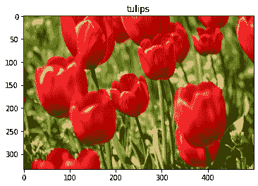

## Use Keras preprocessing layers

**Note:** The [Keras Preprocesing Layers](https://tensorflow.google.cn/api_docs/python/tf/keras/layers/experimental/preprocessing) introduced in this section are currently experimental.

### Resizing and rescaling

You can use preprocessing layers to [resize](https://tensorflow.google.cn/api_docs/python/tf/keras/layers/experimental/preprocessing/Resizing) your images to a consistent shape, and to [rescale](https://tensorflow.google.cn/api_docs/python/tf/keras/layers/experimental/preprocessing/Rescaling) pixel values.

```py
IMG_SIZE = 180

resize_and_rescale = tf.keras.Sequential([
  layers.experimental.preprocessing.Resizing(IMG_SIZE, IMG_SIZE),
  layers.experimental.preprocessing.Rescaling(1./255)
]) 
```

**Note:** the rescaling layer above standardizes pixel values to `[0,1]`. If instead you wanted `[-1,1]`, you would write `Rescaling(1./127.5, offset=-1)`.

You can see the result of applying these layers to an image.

```py
result = resize_and_rescale(image)
_ = plt.imshow(result) 
```

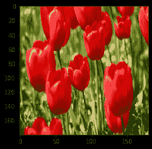

You can verify the pixels are in `[0-1]`.

```py
print("Min and max pixel values:", result.numpy().min(), result.numpy().max()) 
```

```py
Min and max pixel values: 0.0 1.0

```

### Data augmentation

You can use preprocessing layers for data augmentation as well.

Let's create a few preprocessing layers and apply them repeatedly to the same image.

```py
data_augmentation = tf.keras.Sequential([
  layers.experimental.preprocessing.RandomFlip("horizontal_and_vertical"),
  layers.experimental.preprocessing.RandomRotation(0.2),
]) 
```

```py
# Add the image to a batch
image = tf.expand_dims(image, 0) 
```

```py
plt.figure(figsize=(10, 10))
for i in range(9):
  augmented_image = data_augmentation(image)
  ax = plt.subplot(3, 3, i + 1)
  plt.imshow(augmented_image[0])
  plt.axis("off") 
```

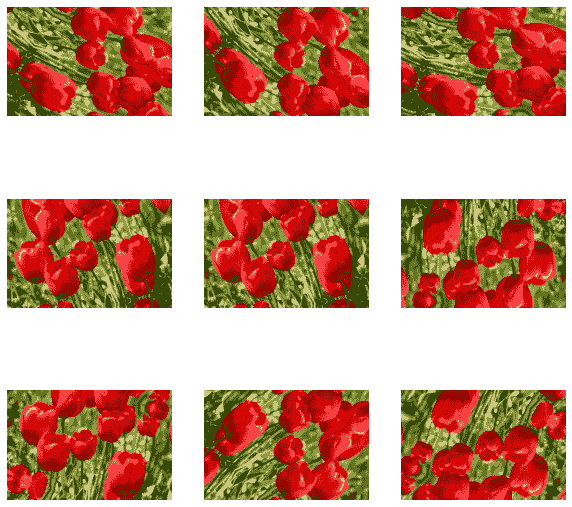

There are a variety of preprocessing [layers](https://tensorflow.google.cn/api_docs/python/tf/keras/layers/experimental/preprocessing) you can use for data augmentation including `layers.RandomContrast`, `layers.RandomCrop`, `layers.RandomZoom`, and others.

### Two options to use the preprocessing layers

There are two ways you can use these preprocessing layers, with important tradeoffs.

#### Option 1: Make the preprocessing layers part of your model

```py
model = tf.keras.Sequential([
  resize_and_rescale,
  data_augmentation,
  layers.Conv2D(16, 3, padding='same', activation='relu'),
  layers.MaxPooling2D(),
  # Rest of your model
]) 
```

There are two important points to be aware of in this case:

*   Data augmentation will run on-device, synchronously with the rest of your layers, and benefit from GPU acceleration.

*   When you export your model using `model.save`, the preprocessing layers will be saved along with the rest of your model. If you later deploy this model, it will automatically standardize images (according to the configuration of your layers). This can save you from the effort of having to reimplement that logic server-side.

**Note:** Data augmentation is inactive at test time so input images will only be augmented during calls to `model.fit` (not `model.evaluate` or `model.predict`).

#### Option 2: Apply the preprocessing layers to your dataset

```py
aug_ds = train_ds.map(
  lambda x, y: (resize_and_rescale(x, training=True), y)) 
```

With this approach, you use [`Dataset.map`](https://tensorflow.google.cn/api_docs/python/tf/data/Dataset#map) to create a dataset that yields batches of augmented images. In this case:

*   Data augmentation will happen asynchronously on the CPU, and is non-blocking. You can overlap the training of your model on the GPU with data preprocessing, using [`Dataset.prefetch`](https://tensorflow.google.cn/api_docs/python/tf/data/Dataset#prefetch), shown below.
*   In this case the prepreprocessing layers will not be exported with the model when you call `model.save`. You will need to attach them to your model before saving it or reimplement them server-side. After training, you can attach the preprocessing layers before export.

You can find an example of the first option in the [image classification](https://tensorflow.google.cn/tutorials/images/classification) tutorial. Let's demonstrate the second option here.

### Apply the preprocessing layers to the datasets

Configure the train, validation, and test datasets with the preprocessing layers you created above. You will also configure the datasets for performance, using parallel reads and buffered prefetching to yield batches from disk without I/O become blocking. You can learn more dataset performance in the [Better performance with the tf.data API](https://tensorflow.google.cn/guide/data_performance) guide.

**Note:** data augmentation should only be applied to the training set.

```py
batch_size = 32
AUTOTUNE = tf.data.experimental.AUTOTUNE

def prepare(ds, shuffle=False, augment=False):
  # Resize and rescale all datasets
  ds = ds.map(lambda x, y: (resize_and_rescale(x), y), 
              num_parallel_calls=AUTOTUNE)

  if shuffle:
    ds = ds.shuffle(1000)

  # Batch all datasets
  ds = ds.batch(batch_size)

  # Use data augmentation only on the training set
  if augment:
    ds = ds.map(lambda x, y: (data_augmentation(x, training=True), y), 
                num_parallel_calls=AUTOTUNE)

  # Use buffered prefecting on all datasets
  return ds.prefetch(buffer_size=AUTOTUNE) 
```

```py
train_ds = prepare(train_ds, shuffle=True, augment=True)
val_ds = prepare(val_ds)
test_ds = prepare(test_ds) 
```

### Train a model

For completeness, you will now train a model using these datasets. This model has not been tuned for accuracy (the goal is to show you the mechanics).

```py
model = tf.keras.Sequential([
  layers.Conv2D(16, 3, padding='same', activation='relu'),
  layers.MaxPooling2D(),
  layers.Conv2D(32, 3, padding='same', activation='relu'),
  layers.MaxPooling2D(),
  layers.Conv2D(64, 3, padding='same', activation='relu'),
  layers.MaxPooling2D(),
  layers.Flatten(),
  layers.Dense(128, activation='relu'),
  layers.Dense(num_classes)
]) 
```

```py
model.compile(optimizer='adam',
              loss=tf.keras.losses.SparseCategoricalCrossentropy(from_logits=True),
              metrics=['accuracy']) 
```

```py
epochs=5
history = model.fit(
  train_ds,
  validation_data=val_ds,
  epochs=epochs
) 
```

```py
Epoch 1/5
92/92 [==============================] - 30s 315ms/step - loss: 1.5078 - accuracy: 0.3428 - val_loss: 1.0809 - val_accuracy: 0.6240
Epoch 2/5
92/92 [==============================] - 28s 303ms/step - loss: 1.0781 - accuracy: 0.5724 - val_loss: 0.9762 - val_accuracy: 0.6322
Epoch 3/5
92/92 [==============================] - 28s 295ms/step - loss: 1.0083 - accuracy: 0.5900 - val_loss: 0.9570 - val_accuracy: 0.6376
Epoch 4/5
92/92 [==============================] - 28s 300ms/step - loss: 0.9537 - accuracy: 0.6116 - val_loss: 0.9081 - val_accuracy: 0.6485
Epoch 5/5
92/92 [==============================] - 28s 301ms/step - loss: 0.8816 - accuracy: 0.6525 - val_loss: 0.8353 - val_accuracy: 0.6594

```

```py
loss, acc = model.evaluate(test_ds)
print("Accuracy", acc) 
```

```py
12/12 [==============================] - 1s 83ms/step - loss: 0.8226 - accuracy: 0.6567
Accuracy 0.6566757559776306

```

### Custom data augmentation

You can also create custom data augmenation layers. This tutorial shows two ways of doing so. First, you will create a [`layers.Lambda`](https://tensorflow.google.cn/api_docs/python/tf/keras/layers/Lambda) layer. This is a good way to write concise code. Next, you will write a new layer via [subclassing](https://tensorflow.google.cn/guide/keras/custom_layers_and_models), which gives you more control. Both layers will randomly invert the colors in an image, accoring to some probability.

```py
def random_invert_img(x, p=0.5):
  if  tf.random.uniform([]) < p:
    x = (255-x)
  else:
    x
  return x 
```

```py
def random_invert(factor=0.5):
  return layers.Lambda(lambda x: random_invert_img(x, factor))

random_invert = random_invert() 
```

```py
plt.figure(figsize=(10, 10))
for i in range(9):
  augmented_image = random_invert(image)
  ax = plt.subplot(3, 3, i + 1)
  plt.imshow(augmented_image[0].numpy().astype("uint8"))
  plt.axis("off") 
```

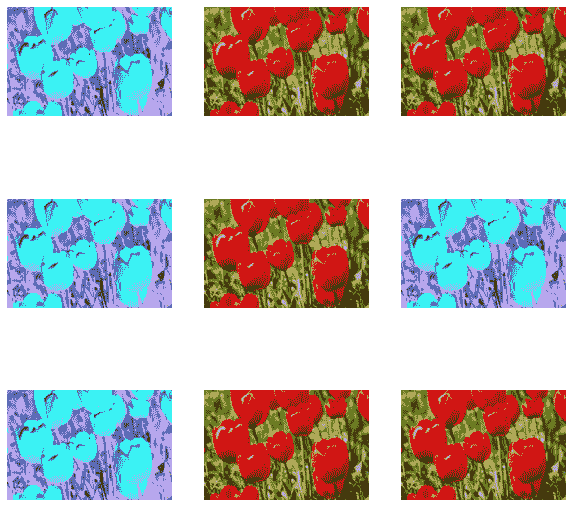

Next, implement a custom layer by [subclassing](https://tensorflow.google.cn/guide/keras/custom_layers_and_models).

```py
class RandomInvert(layers.Layer):
  def __init__(self, factor=0.5, **kwargs):
    super().__init__(**kwargs)
    self.factor = factor

  def call(self, x):
    return random_invert_img(x) 
```

```py
_ = plt.imshow(RandomInvert()(image)[0]) 
```

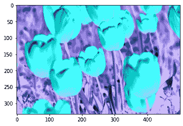

Both of these layers can be used as described in options 1 and 2 above.

## Using tf.image

The above `layers.preprocessing` utilities are convenient. For finer control, you can write your own data augmentation pipelines or layers using [`tf.data`](https://tensorflow.google.cn/api_docs/python/tf/data) and [`tf.image`](https://tensorflow.google.cn/api_docs/python/tf/image). You may also want to check out [TensorFlow Addons Image: Operations](https://tensorflow.google.cn/addons/tutorials/image_ops) and [TensorFlow I/O: Color Space Conversions](https://tensorflow.google.cn/io/tutorials/colorspace)

Since the flowers dataset was previously configured with data augmentation, let's reimport it to start fresh.

```py
(train_ds, val_ds, test_ds), metadata = tfds.load(
    'tf_flowers',
    split=['train[:80%]', 'train[80%:90%]', 'train[90%:]'],
    with_info=True,
    as_supervised=True,
) 
```

Retrieve an image to work with.

```py
image, label = next(iter(train_ds))
_ = plt.imshow(image)
_ = plt.title(get_label_name(label)) 
```


Let's use the following function to visualize and compare the original and augmented images side-by-side.

```py
def visualize(original, augmented):
  fig = plt.figure()
  plt.subplot(1,2,1)
  plt.title('Original image')
  plt.imshow(original)

  plt.subplot(1,2,2)
  plt.title('Augmented image')
  plt.imshow(augmented) 
```

### Data augmentation

### Flipping the image

Flip the image either vertically or horizontally.

```py
flipped = tf.image.flip_left_right(image)
visualize(image, flipped) 
```

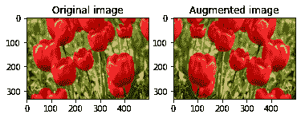

### Grayscale the image

Grayscale an image.

```py
grayscaled = tf.image.rgb_to_grayscale(image)
visualize(image, tf.squeeze(grayscaled))
_ = plt.colorbar() 
```

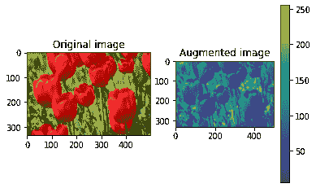

### Saturate the image

Saturate an image by providing a saturation factor.

```py
saturated = tf.image.adjust_saturation(image, 3)
visualize(image, saturated) 
```

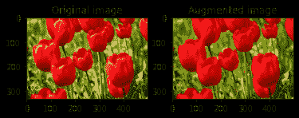

### Change image brightness

Change the brightness of image by providing a brightness factor.

```py
bright = tf.image.adjust_brightness(image, 0.4)
visualize(image, bright) 
```

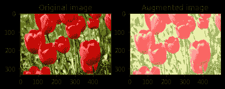

### Center crop the image

Crop the image from center up to the image part you desire.

```py
cropped = tf.image.central_crop(image, central_fraction=0.5)
visualize(image,cropped) 
```

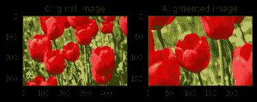

### Rotate the image

Rotate an image by 90 degrees.

```py
rotated = tf.image.rot90(image)
visualize(image, rotated) 
```

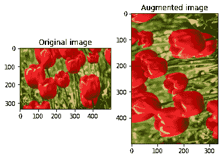

### Apply augmentation to a dataset

As before, apply data augmentation to a dataset using [`Dataset.map`](https://tensorflow.google.cn/api_docs/python/tf/data/Dataset#map).

```py
def resize_and_rescale(image, label):
  image = tf.cast(image, tf.float32)
  image = tf.image.resize(image, [IMG_SIZE, IMG_SIZE])
  image = (image / 255.0)
  return image, label 
```

```py
def augment(image,label):
  image, label = resize_and_rescale(image, label)
  # Add 6 pixels of padding
  image = tf.image.resize_with_crop_or_pad(image, IMG_SIZE + 6, IMG_SIZE + 6) 
   # Random crop back to the original size
  image = tf.image.random_crop(image, size=[IMG_SIZE, IMG_SIZE, 3])
  image = tf.image.random_brightness(image, max_delta=0.5) # Random brightness
  image = tf.clip_by_value(image, 0, 1)
  return image, label 
```

### Configure the datasets

```py
train_ds = (
    train_ds
    .shuffle(1000)
    .map(augment, num_parallel_calls=AUTOTUNE)
    .batch(batch_size)
    .prefetch(AUTOTUNE)
) 
```

```py
val_ds = (
    val_ds
    .map(resize_and_rescale, num_parallel_calls=AUTOTUNE)
    .batch(batch_size)
    .prefetch(AUTOTUNE)
) 
```

```py
test_ds = (
    test_ds
    .map(resize_and_rescale, num_parallel_calls=AUTOTUNE)
    .batch(batch_size)
    .prefetch(AUTOTUNE)
) 
```

These datasets can now be used to train a model as shown previously.

## Next steps

This tutorial demonstrated data augmentation using [Keras Preprocessing Layers](https://tensorflow.google.cn/api_docs/python/tf/keras/layers/experimental/preprocessing/) and [`tf.image`](https://tensorflow.google.cn/api_docs/python/tf/image). To learn how to include preprocessing layers inside your model, see the [Image classification](https://tensorflow.google.cn/tutorials/images/classification) tutorial. You may also be interested in learning how preprocessing layers can help you classify text, as shown in the [Basic text classification](https://tensorflow.google.cn/tutorials/keras/text_classification) tutorial. You can learn more about [`tf.data`](https://tensorflow.google.cn/api_docs/python/tf/data) in this [guide](https://tensorflow.google.cn/guide/data), and you can learn how to configure your input pipelines for performance [here](https://tensorflow.google.cn/guide/data_performance).