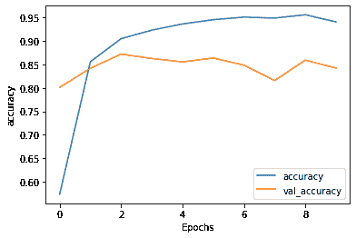
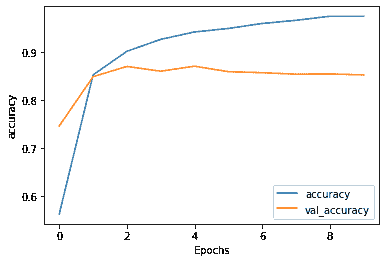
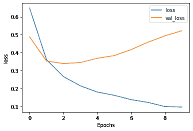

# 使用 RNN 进行文本分类

> 原文：[https://tensorflow.google.cn/tutorials/text/text_classification_rnn](https://tensorflow.google.cn/tutorials/text/text_classification_rnn)

此文本分类教程将在 [IMDB 大型电影评论数据集](http://ai.stanford.edu/%7Eamaas/data/sentiment/)上训练[循环神经网络](https://developers.google.cn/machine-learning/glossary/#recurrent_neural_network)，以进行情感分析。

## 设置

```py
import tensorflow_datasets as tfds
import tensorflow as tf 
```

导入 `matplotlib` 并创建一个辅助函数来绘制计算图：

```py
import matplotlib.pyplot as plt

def plot_graphs(history, metric):
  plt.plot(history.history[metric])
  plt.plot(history.history['val_'+metric], '')
  plt.xlabel("Epochs")
  plt.ylabel(metric)
  plt.legend([metric, 'val_'+metric])
  plt.show() 
```

## 设置输入流水线

IMDB 大型电影评论数据集是一个*二进制分类*数据集——所有评论都具有*正面*或*负面*情绪。

使用 [TFDS](https://tensorflow.google.cn/datasets) 下载数据集。

```py
dataset, info = tfds.load('imdb_reviews/subwords8k', with_info=True,
                          as_supervised=True)
train_dataset, test_dataset = dataset['train'], dataset['test'] 
```

```py
WARNING:absl:TFDS datasets with text encoding are deprecated and will be removed in a future version. Instead, you should use the plain text version and tokenize the text using `tensorflow_text` (See: https://www.tensorflow.org/tutorials/tensorflow_text/intro#tfdata_example)

Downloading and preparing dataset imdb_reviews/subwords8k/1.0.0 (download: 80.23 MiB, generated: Unknown size, total: 80.23 MiB) to /home/kbuilder/tensorflow_datasets/imdb_reviews/subwords8k/1.0.0...
Shuffling and writing examples to /home/kbuilder/tensorflow_datasets/imdb_reviews/subwords8k/1.0.0.incomplete7GBYY4/imdb_reviews-train.tfrecord
Shuffling and writing examples to /home/kbuilder/tensorflow_datasets/imdb_reviews/subwords8k/1.0.0.incomplete7GBYY4/imdb_reviews-test.tfrecord
Shuffling and writing examples to /home/kbuilder/tensorflow_datasets/imdb_reviews/subwords8k/1.0.0.incomplete7GBYY4/imdb_reviews-unsupervised.tfrecord
Dataset imdb_reviews downloaded and prepared to /home/kbuilder/tensorflow_datasets/imdb_reviews/subwords8k/1.0.0\. Subsequent calls will reuse this data.

```

数据集 `info` 包括编码器 (`tfds.features.text.SubwordTextEncoder`)。

```py
encoder = info.features['text'].encoder 
```

```py
print('Vocabulary size: {}'.format(encoder.vocab_size)) 
```

```py
Vocabulary size: 8185

```

此文本编码器将以可逆方式对任何字符串进行编码，并在必要时退回到字节编码。

```py
sample_string = 'Hello TensorFlow.'

encoded_string = encoder.encode(sample_string)
print('Encoded string is {}'.format(encoded_string))

original_string = encoder.decode(encoded_string)
print('The original string: "{}"'.format(original_string)) 
```

```py
Encoded string is [4025, 222, 6307, 2327, 4043, 2120, 7975]
The original string: "Hello TensorFlow."

```

```py
assert original_string == sample_string 
```

```py
for index in encoded_string:
  print('{} ----&gt; {}'.format(index, encoder.decode([index]))) 
```

```py
4025 ----&gt; Hell
222 ----&gt; o 
6307 ----&gt; Ten
2327 ----&gt; sor
4043 ----&gt; Fl
2120 ----&gt; ow
7975 ----&gt; .

```

## 准备用于训练的数据

接下来，创建这些编码字符串的批次。使用 `padded_batch` 方法将序列零填充至批次中最长字符串的长度：

```py
BUFFER_SIZE = 10000
BATCH_SIZE = 64 
```

```py
train_dataset = train_dataset.shuffle(BUFFER_SIZE)
train_dataset = train_dataset.padded_batch(BATCH_SIZE)

test_dataset = test_dataset.padded_batch(BATCH_SIZE) 
```

## 创建模型

构建一个 [`tf.keras.Sequential`](https://tensorflow.google.cn/api_docs/python/tf/keras/Sequential) 模型并从嵌入向量层开始。嵌入向量层每个单词存储一个向量。调用时，它会将单词索引序列转换为向量序列。这些向量是可训练的。（在足够的数据上）训练后，具有相似含义的单词通常具有相似的向量。

与通过 [`tf.keras.layers.Dense`](https://tensorflow.google.cn/api_docs/python/tf/keras/layers/Dense) 层传递独热编码向量的等效运算相比，这种索引查找方法要高效得多。

循环神经网络 (RNN) 通过遍历元素来处理序列输入。RNN 将输出从一个时间步骤传递到其输入，然后传递到下一个步骤。

[`tf.keras.layers.Bidirectional`](https://tensorflow.google.cn/api_docs/python/tf/keras/layers/Bidirectional) 包装器也可以与 RNN 层一起使用。这将通过 RNN 层向前和向后传播输入，然后连接输出。这有助于 RNN 学习长程依赖关系。

```py
model = tf.keras.Sequential([
    tf.keras.layers.Embedding(encoder.vocab_size, 64),
    tf.keras.layers.Bidirectional(tf.keras.layers.LSTM(64)),
    tf.keras.layers.Dense(64, activation='relu'),
    tf.keras.layers.Dense(1)
]) 
```

请注意，我们在这里选择 Keras 序贯模型，因为模型中的所有层都只有单个输入并产生单个输出。如果要使用有状态 RNN 层，则可能需要使用 Keras 函数式 API 或模型子类化来构建模型，以便可以检索和重用 RNN 层状态。有关更多详细信息，请参阅 [Keras RNN 指南](https://tensorflow.google.cn/guide/keras/rnn#rnn_state_reuse)。

编译 Keras 模型以配置训练过程：

```py
model.compile(loss=tf.keras.losses.BinaryCrossentropy(from_logits=True),
              optimizer=tf.keras.optimizers.Adam(1e-4),
              metrics=['accuracy']) 
```

## 训练模型

```py
history = model.fit(train_dataset, epochs=10,
                    validation_data=test_dataset, 
                    validation_steps=30) 
```

```py
Epoch 1/10
391/391 [==============================] - 41s 105ms/step - loss: 0.6363 - accuracy: 0.5736 - val_loss: 0.4592 - val_accuracy: 0.8010
Epoch 2/10
391/391 [==============================] - 41s 105ms/step - loss: 0.3426 - accuracy: 0.8556 - val_loss: 0.3710 - val_accuracy: 0.8417
Epoch 3/10
391/391 [==============================] - 42s 107ms/step - loss: 0.2520 - accuracy: 0.9047 - val_loss: 0.3444 - val_accuracy: 0.8719
Epoch 4/10
391/391 [==============================] - 41s 105ms/step - loss: 0.2103 - accuracy: 0.9228 - val_loss: 0.3348 - val_accuracy: 0.8625
Epoch 5/10
391/391 [==============================] - 42s 106ms/step - loss: 0.1803 - accuracy: 0.9360 - val_loss: 0.3591 - val_accuracy: 0.8552
Epoch 6/10
391/391 [==============================] - 42s 106ms/step - loss: 0.1589 - accuracy: 0.9450 - val_loss: 0.4146 - val_accuracy: 0.8635
Epoch 7/10
391/391 [==============================] - 41s 105ms/step - loss: 0.1466 - accuracy: 0.9505 - val_loss: 0.3780 - val_accuracy: 0.8484
Epoch 8/10
391/391 [==============================] - 41s 106ms/step - loss: 0.1463 - accuracy: 0.9485 - val_loss: 0.4074 - val_accuracy: 0.8156
Epoch 9/10
391/391 [==============================] - 41s 106ms/step - loss: 0.1327 - accuracy: 0.9555 - val_loss: 0.4608 - val_accuracy: 0.8589
Epoch 10/10
391/391 [==============================] - 41s 105ms/step - loss: 0.1666 - accuracy: 0.9404 - val_loss: 0.4364 - val_accuracy: 0.8422

```

```py
test_loss, test_acc = model.evaluate(test_dataset)

print('Test Loss: {}'.format(test_loss))
print('Test Accuracy: {}'.format(test_acc)) 
```

```py
391/391 [==============================] - 17s 43ms/step - loss: 0.4305 - accuracy: 0.8477
Test Loss: 0.43051090836524963
Test Accuracy: 0.8476799726486206

```

上面的模型没有遮盖应用于序列的填充。如果在填充序列上进行训练并在未填充序列上进行测试，则可能导致倾斜。理想情况下，您可以[使用遮盖](https://tensorflow.google.cn/guide/keras/masking_and_padding)来避免这种情况，但是正如您在下面看到的那样，它只会对输出产生很小的影响。

如果预测 >= 0.5，则为正，否则为负。

```py
def pad_to_size(vec, size):
  zeros = [0] * (size - len(vec))
  vec.extend(zeros)
  return vec 
```

```py
def sample_predict(sample_pred_text, pad):
  encoded_sample_pred_text = encoder.encode(sample_pred_text)

  if pad:
    encoded_sample_pred_text = pad_to_size(encoded_sample_pred_text, 64)
  encoded_sample_pred_text = tf.cast(encoded_sample_pred_text, tf.float32)
  predictions = model.predict(tf.expand_dims(encoded_sample_pred_text, 0))

  return (predictions) 
```

```py
# predict on a sample text without padding.

sample_pred_text = ('The movie was cool. The animation and the graphics '
                    'were out of this world. I would recommend this movie.')
predictions = sample_predict(sample_pred_text, pad=False)
print(predictions) 
```

```py
[[-0.11829309]]

```

```py
# predict on a sample text with padding

sample_pred_text = ('The movie was cool. The animation and the graphics '
                    'were out of this world. I would recommend this movie.')
predictions = sample_predict(sample_pred_text, pad=True)
print(predictions) 
```

```py
[[-1.162545]]

```

```py
plot_graphs(history, 'accuracy') 
```



```py
plot_graphs(history, 'loss') 
```


## 堆叠两个或更多 LSTM 层

Keras 循环层有两种可用的模式，这些模式由 `return_sequences` 构造函数参数控制：

*   返回每个时间步骤的连续输出的完整序列（形状为 `(batch_size, timesteps, output_features)` 的 3D 张量）。
*   仅返回每个输入序列的最后一个输出（形状为 (batch_size, output_features) 的 2D 张量）。

```py
model = tf.keras.Sequential([
    tf.keras.layers.Embedding(encoder.vocab_size, 64),
    tf.keras.layers.Bidirectional(tf.keras.layers.LSTM(64,  return_sequences=True)),
    tf.keras.layers.Bidirectional(tf.keras.layers.LSTM(32)),
    tf.keras.layers.Dense(64, activation='relu'),
    tf.keras.layers.Dropout(0.5),
    tf.keras.layers.Dense(1)
]) 
```

```py
model.compile(loss=tf.keras.losses.BinaryCrossentropy(from_logits=True),
              optimizer=tf.keras.optimizers.Adam(1e-4),
              metrics=['accuracy']) 
```

```py
history = model.fit(train_dataset, epochs=10,
                    validation_data=test_dataset,
                    validation_steps=30) 
```

```py
Epoch 1/10
391/391 [==============================] - 75s 192ms/step - loss: 0.6484 - accuracy: 0.5630 - val_loss: 0.4876 - val_accuracy: 0.7464
Epoch 2/10
391/391 [==============================] - 74s 190ms/step - loss: 0.3603 - accuracy: 0.8528 - val_loss: 0.3533 - val_accuracy: 0.8490
Epoch 3/10
391/391 [==============================] - 75s 191ms/step - loss: 0.2666 - accuracy: 0.9018 - val_loss: 0.3393 - val_accuracy: 0.8703
Epoch 4/10
391/391 [==============================] - 75s 193ms/step - loss: 0.2151 - accuracy: 0.9267 - val_loss: 0.3451 - val_accuracy: 0.8604
Epoch 5/10
391/391 [==============================] - 76s 194ms/step - loss: 0.1806 - accuracy: 0.9422 - val_loss: 0.3687 - val_accuracy: 0.8708
Epoch 6/10
391/391 [==============================] - 75s 193ms/step - loss: 0.1623 - accuracy: 0.9495 - val_loss: 0.3836 - val_accuracy: 0.8594
Epoch 7/10
391/391 [==============================] - 76s 193ms/step - loss: 0.1382 - accuracy: 0.9598 - val_loss: 0.4173 - val_accuracy: 0.8573
Epoch 8/10
391/391 [==============================] - 76s 194ms/step - loss: 0.1227 - accuracy: 0.9664 - val_loss: 0.4586 - val_accuracy: 0.8542
Epoch 9/10
391/391 [==============================] - 76s 194ms/step - loss: 0.0997 - accuracy: 0.9749 - val_loss: 0.4939 - val_accuracy: 0.8547
Epoch 10/10
391/391 [==============================] - 76s 194ms/step - loss: 0.0973 - accuracy: 0.9748 - val_loss: 0.5222 - val_accuracy: 0.8526

```

```py
test_loss, test_acc = model.evaluate(test_dataset)

print('Test Loss: {}'.format(test_loss))
print('Test Accuracy: {}'.format(test_acc)) 
```

```py
391/391 [==============================] - 30s 78ms/step - loss: 0.5205 - accuracy: 0.8572
Test Loss: 0.5204932689666748
Test Accuracy: 0.857200026512146

```

```py
# predict on a sample text without padding.

sample_pred_text = ('The movie was not good. The animation and the graphics '
                    'were terrible. I would not recommend this movie.')
predictions = sample_predict(sample_pred_text, pad=False)
print(predictions) 
```

```py
[[-2.6377363]]

```

```py
# predict on a sample text with padding

sample_pred_text = ('The movie was not good. The animation and the graphics '
                    'were terrible. I would not recommend this movie.')
predictions = sample_predict(sample_pred_text, pad=True)
print(predictions) 
```

```py
[[-3.0502243]]

```

```py
plot_graphs(history, 'accuracy') 
```



```py
plot_graphs(history, 'loss') 
```



检查其他现有循环层，例如 [GRU 层](https://tensorflow.google.cn/api_docs/python/tf/keras/layers/GRU)。

如果您对构建自定义 RNN 感兴趣，请参阅 [Keras RNN 指南](https://tensorflow.google.cn/guide/keras/rnn)。