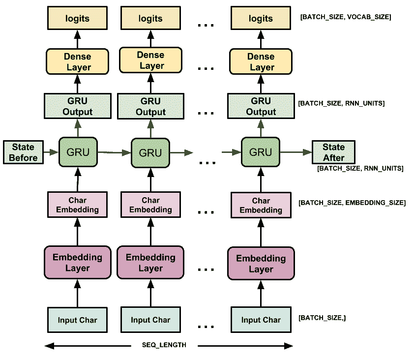
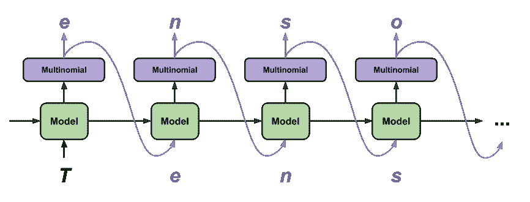

# 循环神经网络（RNN）文本生成

> 原文：[https://tensorflow.google.cn/tutorials/text/text_generation](https://tensorflow.google.cn/tutorials/text/text_generation)

<devsite-mathjax config="TeX-AMS-MML_SVG"></devsite-mathjax>

本教程演示如何使用基于字符的 RNN 生成文本。我们将使用 Andrej Karpathy 在[《循环神经网络不合理的有效性》](http://karpathy.github.io/2015/05/21/rnn-effectiveness/)一文中提供的莎士比亚作品数据集。给定此数据中的一个字符序列 （“Shakespear”），训练一个模型以预测该序列的下一个字符（“e”）。通过重复调用该模型，可以生成更长的文本序列。

请注意：启用 GPU 加速可以更快地执行此笔记本。在 Colab 中依次选择：*运行时 > 更改运行时类型 > 硬件加速器 > GPU*。如果在本地运行，请确保 TensorFlow 的版本为 1.11 或更高。

本教程包含使用 [tf.keras](https://tensorflow.google.cn/programmers_guide/keras) 和 [eager execution](https://tensorflow.google.cn/programmers_guide/eager) 实现的可运行代码。以下是当本教程中的模型训练 30 个周期 （epoch），并以字符串 “Q” 开头时的示例输出：

```py
QUEENE:
I had thought thou hadst a Roman; for the oracle,
Thus by All bids the man against the word,
Which are so weak of care, by old care done;
Your children were in your holy love,
And the precipitation through the bleeding throne.

BISHOP OF ELY:
Marry, and will, my lord, to weep in such a one were prettiest;
Yet now I was adopted heir
Of the world's lamentable day,
To watch the next way with his father with his face?

ESCALUS:
The cause why then we are all resolved more sons.

VOLUMNIA:
O, no, no, no, no, no, no, no, no, no, no, no, no, no, no, no, no, no, no, no, no, it is no sin it should be dead,
And love and pale as any will to that word.

QUEEN ELIZABETH:
But how long have I heard the soul for this world,
And show his hands of life be proved to stand.

PETRUCHIO:
I say he look'd on, if I must be content
To stay him from the fatal of our country's bliss.
His lordship pluck'd from this sentence then for prey,
And then let us twain, being the moon,
were she such a case as fills m

```

虽然有些句子符合语法规则，但是大多数句子没有意义。这个模型尚未学习到单词的含义，但请考虑以下几点：

*   此模型是基于字符的。训练开始时，模型不知道如何拼写一个英文单词，甚至不知道单词是文本的一个单位。

*   输出文本的结构类似于剧本 -- 文本块通常以讲话者的名字开始；而且与数据集类似，讲话者的名字采用全大写字母。

*   如下文所示，此模型由小批次 （batch） 文本训练而成（每批 100 个字符）。即便如此，此模型仍然能生成更长的文本序列，并且结构连贯。

## 设置

### 导入 TensorFlow 和其他库

```py
import tensorflow as tf

import numpy as np
import os
import time 
```

### 下载莎士比亚数据集

修改下面一行代码，在你自己的数据上运行此代码。

```py
path_to_file = tf.keras.utils.get_file('shakespeare.txt', 'https://storage.googleapis.com/download.tensorflow.org/data/shakespeare.txt') 
```

```py
Downloading data from https://storage.googleapis.com/download.tensorflow.org/data/shakespeare.txt
1122304/1115394 [==============================] - 0s 0us/step

```

### 读取数据

首先，看一看文本：

```py
# 读取并为 py2 compat 解码
text = open(path_to_file, 'rb').read().decode(encoding='utf-8')

# 文本长度是指文本中的字符个数
print ('Length of text: {} characters'.format(len(text))) 
```

```py
Length of text: 1115394 characters

```

```py
# 看一看文本中的前 250 个字符
print(text[:250]) 
```

```py
First Citizen:
Before we proceed any further, hear me speak.

All:
Speak, speak.

First Citizen:
You are all resolved rather to die than to famish?

All:
Resolved. resolved.

First Citizen:
First, you know Caius Marcius is chief enemy to the people.

```

```py
# 文本中的非重复字符
vocab = sorted(set(text))
print ('{} unique characters'.format(len(vocab))) 
```

```py
65 unique characters

```

## 处理文本

### 向量化文本

在训练之前，我们需要将字符串映射到数字表示值。创建两个查找表格：一个将字符映射到数字，另一个将数字映射到字符。

```py
# 创建从非重复字符到索引的映射
char2idx = {u:i for i, u in enumerate(vocab)}
idx2char = np.array(vocab)

text_as_int = np.array([char2idx[c] for c in text]) 
```

现在，每个字符都有一个整数表示值。请注意，我们将字符映射至索引 0 至 `len(unique)`.

```py
print('{')
for char,_ in zip(char2idx, range(20)):
    print('  {:4s}: {:3d},'.format(repr(char), char2idx[char]))
print('  ...\n}') 
```

```py
{
  '\n':   0,
  ' ' :   1,
  '!' :   2,
  '$' :   3,
  '&' :   4,
  "'" :   5,
  ',' :   6,
  '-' :   7,
  '.' :   8,
  '3' :   9,
  ':' :  10,
  ';' :  11,
  '?' :  12,
  'A' :  13,
  'B' :  14,
  'C' :  15,
  'D' :  16,
  'E' :  17,
  'F' :  18,
  'G' :  19,
  ...
}

```

```py
# 显示文本首 13 个字符的整数映射
print ('{} ---- characters mapped to int ---- > {}'.format(repr(text[:13]), text_as_int[:13])) 
```

```py
'First Citizen' ---- characters mapped to int ---- > [18 47 56 57 58  1 15 47 58 47 64 43 52]

```

### 预测任务

给定一个字符或者一个字符序列，下一个最可能出现的字符是什么？这就是我们训练模型要执行的任务。输入进模型的是一个字符序列，我们训练这个模型来预测输出 -- 每个时间步（time step）预测下一个字符是什么。

由于 RNN 是根据前面看到的元素维持内部状态，那么，给定此时计算出的所有字符，下一个字符是什么？

### 创建训练样本和目标

接下来，将文本划分为样本序列。每个输入序列包含文本中的 `seq_length` 个字符。

对于每个输入序列，其对应的目标包含相同长度的文本，但是向右顺移一个字符。

将文本拆分为长度为 `seq_length+1` 的文本块。例如，假设 `seq_length` 为 4 而且文本为 “Hello”， 那么输入序列将为 “Hell”，目标序列将为 “ello”。

为此，首先使用 [`tf.data.Dataset.from_tensor_slices`](https://tensorflow.google.cn/api_docs/python/tf/data/Dataset#from_tensor_slices) 函数把文本向量转换为字符索引流。

```py
# 设定每个输入句子长度的最大值
seq_length = 100
examples_per_epoch = len(text)//seq_length

# 创建训练样本 / 目标
char_dataset = tf.data.Dataset.from_tensor_slices(text_as_int)

for i in char_dataset.take(5):
  print(idx2char[i.numpy()]) 
```

```py
F
i
r
s
t

```

`batch` 方法使我们能轻松把单个字符转换为所需长度的序列。

```py
sequences = char_dataset.batch(seq_length+1, drop_remainder=True)

for item in sequences.take(5):
  print(repr(''.join(idx2char[item.numpy()]))) 
```

```py
'First Citizen:\nBefore we proceed any further, hear me speak.\n\nAll:\nSpeak, speak.\n\nFirst Citizen:\nYou '
'are all resolved rather to die than to famish?\n\nAll:\nResolved. resolved.\n\nFirst Citizen:\nFirst, you k'
"now Caius Marcius is chief enemy to the people.\n\nAll:\nWe know't, we know't.\n\nFirst Citizen:\nLet us ki"
"ll him, and we'll have corn at our own price.\nIs't a verdict?\n\nAll:\nNo more talking on't; let it be d"
'one: away, away!\n\nSecond Citizen:\nOne word, good citizens.\n\nFirst Citizen:\nWe are accounted poor citi'

```

对于每个序列，使用 `map` 方法先复制再顺移，以创建输入文本和目标文本。`map` 方法可以将一个简单的函数应用到每一个批次 （batch）。

```py
def split_input_target(chunk):
    input_text = chunk[:-1]
    target_text = chunk[1:]
    return input_text, target_text

dataset = sequences.map(split_input_target) 
```

打印第一批样本的输入与目标值：

```py
for input_example, target_example in  dataset.take(1):
  print ('Input data: ', repr(''.join(idx2char[input_example.numpy()])))
  print ('Target data:', repr(''.join(idx2char[target_example.numpy()]))) 
```

```py
Input data:  'First Citizen:\nBefore we proceed any further, hear me speak.\n\nAll:\nSpeak, speak.\n\nFirst Citizen:\nYou'
Target data: 'irst Citizen:\nBefore we proceed any further, hear me speak.\n\nAll:\nSpeak, speak.\n\nFirst Citizen:\nYou '

```

这些向量的每个索引均作为一个时间步来处理。作为时间步 0 的输入，模型接收到 “F” 的索引，并尝试预测 “i” 的索引为下一个字符。在下一个时间步，模型执行相同的操作，但是 `RNN` 不仅考虑当前的输入字符，还会考虑上一步的信息。

```py
for i, (input_idx, target_idx) in enumerate(zip(input_example[:5], target_example[:5])):
    print("Step {:4d}".format(i))
    print("  input: {} ({:s})".format(input_idx, repr(idx2char[input_idx])))
    print("  expected output: {} ({:s})".format(target_idx, repr(idx2char[target_idx]))) 
```

```py
Step    0
  input: 18 ('F')
  expected output: 47 ('i')
Step    1
  input: 47 ('i')
  expected output: 56 ('r')
Step    2
  input: 56 ('r')
  expected output: 57 ('s')
Step    3
  input: 57 ('s')
  expected output: 58 ('t')
Step    4
  input: 58 ('t')
  expected output: 1 (' ')

```

### 创建训练批次

前面我们使用 [`tf.data`](https://tensorflow.google.cn/api_docs/python/tf/data) 将文本拆分为可管理的序列。但是在把这些数据输送至模型之前，我们需要将数据重新排列 （shuffle） 并打包为批次。

```py
# 批大小
BATCH_SIZE = 64

# 设定缓冲区大小，以重新排列数据集
# （TF 数据被设计为可以处理可能是无限的序列，
# 所以它不会试图在内存中重新排列整个序列。相反，
# 它维持一个缓冲区，在缓冲区重新排列元素。） 
BUFFER_SIZE = 10000

dataset = dataset.shuffle(BUFFER_SIZE).batch(BATCH_SIZE, drop_remainder=True)

dataset 
```

```py
<BatchDataset shapes: ((64, 100), (64, 100)), types: (tf.int64, tf.int64)>

```

## 创建模型

使用 [`tf.keras.Sequential`](https://tensorflow.google.cn/api_docs/python/tf/keras/Sequential) 定义模型。在这个简单的例子中，我们使用了三个层来定义模型：

*   [`tf.keras.layers.Embedding`](https://tensorflow.google.cn/api_docs/python/tf/keras/layers/Embedding)：输入层。一个可训练的对照表，它会将每个字符的数字映射到一个 `embedding_dim` 维度的向量。
*   [`tf.keras.layers.GRU`](https://tensorflow.google.cn/api_docs/python/tf/keras/layers/GRU)：一种 RNN 类型，其大小由 `units=rnn_units` 指定（这里你也可以使用一个 LSTM 层）。
*   [`tf.keras.layers.Dense`](https://tensorflow.google.cn/api_docs/python/tf/keras/layers/Dense)：输出层，带有 `vocab_size` 个输出。

```py
# 词集的长度
vocab_size = len(vocab)

# 嵌入的维度
embedding_dim = 256

# RNN 的单元数量
rnn_units = 1024 
```

```py
def build_model(vocab_size, embedding_dim, rnn_units, batch_size):
  model = tf.keras.Sequential([
    tf.keras.layers.Embedding(vocab_size, embedding_dim,
                              batch_input_shape=[batch_size, None]),
    tf.keras.layers.GRU(rnn_units,
                        return_sequences=True,
                        stateful=True,
                        recurrent_initializer='glorot_uniform'),
    tf.keras.layers.Dense(vocab_size)
  ])
  return model 
```

```py
model = build_model(
  vocab_size = len(vocab),
  embedding_dim=embedding_dim,
  rnn_units=rnn_units,
  batch_size=BATCH_SIZE) 
```

对于每个字符，模型会查找嵌入，把嵌入当作输入运行 GRU 一个时间步，并用密集层生成逻辑回归 （logits），预测下一个字符的对数可能性。 

## 试试这个模型

现在运行这个模型，看看它是否按预期运行。

首先检查输出的形状：

```py
for input_example_batch, target_example_batch in dataset.take(1):
  example_batch_predictions = model(input_example_batch)
  print(example_batch_predictions.shape, "# (batch_size, sequence_length, vocab_size)") 
```

```py
(64, 100, 65) # (batch_size, sequence_length, vocab_size)

```

在上面的例子中，输入的序列长度为 `100`， 但是这个模型可以在任何长度的输入上运行：

```py
model.summary() 
```

```py
Model: "sequential"
_________________________________________________________________
Layer (type)                 Output Shape              Param #   
=================================================================
embedding (Embedding)        (64, None, 256)           16640     
_________________________________________________________________
gru (GRU)                    (64, None, 1024)          3938304   
_________________________________________________________________
dense (Dense)                (64, None, 65)            66625     
=================================================================
Total params: 4,021,569
Trainable params: 4,021,569
Non-trainable params: 0
_________________________________________________________________

```

为了获得模型的实际预测，我们需要从输出分布中抽样，以获得实际的字符索引。这个分布是根据对字符集的逻辑回归定义的。

请注意：从这个分布中 *抽样* 很重要，因为取分布的 *最大值自变量点集（argmax）* 很容易使模型卡在循环中。

试试这个批次中的第一个样本：

```py
sampled_indices = tf.random.categorical(example_batch_predictions[0], num_samples=1)
sampled_indices = tf.squeeze(sampled_indices,axis=-1).numpy() 
```

这使我们得到每个时间步预测的下一个字符的索引。

```py
sampled_indices 
```

```py
array([ 3, 19, 11,  8, 17, 50, 14,  5, 16, 57, 51, 53, 17, 54,  9, 11, 22,
       13, 36, 57, 57, 50, 47, 22,  5,  7,  1, 59,  3, 26, 52,  2, 62, 30,
       54, 18, 62,  9, 63,  2, 22, 11, 18, 12, 63,  0, 13, 16, 38, 49, 21,
       25, 22, 53, 39, 63,  3, 26, 39, 15, 21, 56, 49, 39, 20, 55,  5, 39,
       61, 29, 21, 39, 39, 63, 48, 11, 27, 42, 59,  0, 19, 58, 57, 27, 40,
       13, 53, 13,  7,  4, 21, 32, 10, 57, 18, 30, 54, 36, 12,  3])

```

解码它们，以查看此未经训练的模型预测的文本：

```py
print("Input: \n", repr("".join(idx2char[input_example_batch[0]])))
print()
print("Next Char Predictions: \n", repr("".join(idx2char[sampled_indices ]))) 
```

```py
Input: 
 'e, I say! madam! sweet-heart! why, bride!\nWhat, not a word? you take your pennyworths now;\nSleep for'

Next Char Predictions: 
 "$G;.ElB'DsmoEp3;JAXssliJ'- u$Nn!xRpFx3y!J;F?y\nADZkIMJoay$NaCIrkaHq'awQIaayj;Odu\nGtsObAoA-&IT:sFRpX?$"

```

## 训练模型

此时，这个问题可以被视为一个标准的分类问题：给定先前的 RNN 状态和这一时间步的输入，预测下一个字符的类别。

### 添加优化器和损失函数

标准的 [`tf.keras.losses.sparse_categorical_crossentropy`](https://tensorflow.google.cn/api_docs/python/tf/keras/losses/sparse_categorical_crossentropy) 损失函数在这里适用，因为它被应用于预测的最后一个维度。

因为我们的模型返回逻辑回归，所以我们需要设定命令行参数 `from_logits`。

```py
def loss(labels, logits):
  return tf.keras.losses.sparse_categorical_crossentropy(labels, logits, from_logits=True)

example_batch_loss  = loss(target_example_batch, example_batch_predictions)
print("Prediction shape: ", example_batch_predictions.shape, " # (batch_size, sequence_length, vocab_size)")
print("scalar_loss:      ", example_batch_loss.numpy().mean()) 
```

```py
Prediction shape:  (64, 100, 65)  # (batch_size, sequence_length, vocab_size)
scalar_loss:       4.1736827

```

使用 [`tf.keras.Model.compile`](https://tensorflow.google.cn/api_docs/python/tf/keras/Model#compile) 方法配置训练步骤。我们将使用 [`tf.keras.optimizers.Adam`](https://tensorflow.google.cn/api_docs/python/tf/keras/optimizers/Adam) 并采用默认参数，以及损失函数。

```py
model.compile(optimizer='adam', loss=loss) 
```

### 配置检查点

使用 [`tf.keras.callbacks.ModelCheckpoint`](https://tensorflow.google.cn/api_docs/python/tf/keras/callbacks/ModelCheckpoint) 来确保训练过程中保存检查点。

```py
# 检查点保存至的目录
checkpoint_dir = './training_checkpoints'

# 检查点的文件名
checkpoint_prefix = os.path.join(checkpoint_dir, "ckpt_{epoch}")

checkpoint_callback=tf.keras.callbacks.ModelCheckpoint(
    filepath=checkpoint_prefix,
    save_weights_only=True) 
```

### 执行训练

为保持训练时间合理，使用 10 个周期来训练模型。在 Colab 中，将运行时设置为 GPU 以加速训练。

```py
EPOCHS=10 
```

```py
history = model.fit(dataset, epochs=EPOCHS, callbacks=[checkpoint_callback]) 
```

```py
Epoch 1/10
172/172 [==============================] - 5s 27ms/step - loss: 2.6663
Epoch 2/10
172/172 [==============================] - 5s 27ms/step - loss: 1.9452
Epoch 3/10
172/172 [==============================] - 5s 27ms/step - loss: 1.6797
Epoch 4/10
172/172 [==============================] - 5s 27ms/step - loss: 1.5355
Epoch 5/10
172/172 [==============================] - 5s 27ms/step - loss: 1.4493
Epoch 6/10
172/172 [==============================] - 5s 27ms/step - loss: 1.3900
Epoch 7/10
172/172 [==============================] - 5s 27ms/step - loss: 1.3457
Epoch 8/10
172/172 [==============================] - 5s 26ms/step - loss: 1.3076
Epoch 9/10
172/172 [==============================] - 5s 27ms/step - loss: 1.2732
Epoch 10/10
172/172 [==============================] - 5s 27ms/step - loss: 1.2412

```

## 生成文本

### 恢复最新的检查点

为保持此次预测步骤简单，将批大小设定为 1。

由于 RNN 状态从时间步传递到时间步的方式，模型建立好之后只接受固定的批大小。

若要使用不同的 `batch_size` 来运行模型，我们需要重建模型并从检查点中恢复权重。

```py
tf.train.latest_checkpoint(checkpoint_dir) 
```

```py
'./training_checkpoints/ckpt_10'

```

```py
model = build_model(vocab_size, embedding_dim, rnn_units, batch_size=1)

model.load_weights(tf.train.latest_checkpoint(checkpoint_dir))

model.build(tf.TensorShape([1, None])) 
```

```py
model.summary() 
```

```py
Model: "sequential_1"
_________________________________________________________________
Layer (type)                 Output Shape              Param #   
=================================================================
embedding_1 (Embedding)      (1, None, 256)            16640     
_________________________________________________________________
gru_1 (GRU)                  (1, None, 1024)           3938304   
_________________________________________________________________
dense_1 (Dense)              (1, None, 65)             66625     
=================================================================
Total params: 4,021,569
Trainable params: 4,021,569
Non-trainable params: 0
_________________________________________________________________

```

### 预测循环

下面的代码块生成文本：

*   首先设置起始字符串，初始化 RNN 状态并设置要生成的字符个数。

*   用起始字符串和 RNN 状态，获取下一个字符的预测分布。

*   然后，用分类分布计算预测字符的索引。把这个预测字符当作模型的下一个输入。

*   模型返回的 RNN 状态被输送回模型。现在，模型有更多上下文可以学习，而非只有一个字符。在预测出下一个字符后，更改过的 RNN 状态被再次输送回模型。模型就是这样，通过不断从前面预测的字符获得更多上下文，进行学习。



查看生成的文本，你会发现这个模型知道什么时候使用大写字母，什么时候分段，而且模仿出了莎士比亚式的词汇。由于训练的周期小，模型尚未学会生成连贯的句子。

```py
def generate_text(model, start_string):
  # 评估步骤（用学习过的模型生成文本）

  # 要生成的字符个数
  num_generate = 1000

  # 将起始字符串转换为数字（向量化）
  input_eval = [char2idx[s] for s in start_string]
  input_eval = tf.expand_dims(input_eval, 0)

  # 空字符串用于存储结果
  text_generated = []

  # 低温度会生成更可预测的文本
  # 较高温度会生成更令人惊讶的文本
  # 可以通过试验以找到最好的设定
  temperature = 1.0

  # 这里批大小为 1
  model.reset_states()
  for i in range(num_generate):
      predictions = model(input_eval)
      # 删除批次的维度
      predictions = tf.squeeze(predictions, 0)

      # 用分类分布预测模型返回的字符
      predictions = predictions / temperature
      predicted_id = tf.random.categorical(predictions, num_samples=1)[-1,0].numpy()

      # 把预测字符和前面的隐藏状态一起传递给模型作为下一个输入
      input_eval = tf.expand_dims([predicted_id], 0)

      text_generated.append(idx2char[predicted_id])

  return (start_string + ''.join(text_generated)) 
```

```py
print(generate_text(model, start_string=u"ROMEO: ")) 
```

```py
ROMEO: in't, Romeo rather
say, bid me not say, the adden, and you man for all.
Now, good Cart, or do held. Well, leaving her son,
Some stomacame, brother, Edommen.

PROSPERO:
My lord Hastings, for death,
Or as believell you be accoment.

TRANIO:
Mistraising? come, get abseng house:
The that was a life upon none of the equard sud,
Great Aufidius any joy;
For well a fool, and loveth one stay,
To whom Gare his moved me of Marcius shoulded.
Pite o'erposens to him.

KING RICHARD II:
Come, civil and live, if wet to help and raisen fellow.

CORIOLANUS:
Mark, here, sir. But the palace-hate will be at him in
some wondering danger, my bestilent.

DUKE OF AUMERLE:
You, my lord? my dearly uncles for,
If't be fown'd for truth enough not him,
He talk of youngest young princely sake.

ROMEO:
This let me have a still before the queen
First worthy angel. Would yes, by return.

BAPTISTA:
You have dan,
Dies, renown awrifes; I'll say you.

Provost:
And, come, make it out.

LEONTES:
They call thee, hangions,
Not 

```

若想改进结果，最简单的方式是延长训练时间 （试试 `EPOCHS=30`）。

你还可以试验使用不同的起始字符串，或者尝试增加另一个 RNN 层以提高模型的准确率，亦或调整温度参数以生成更多或者更少的随机预测。

## 高级：自定义训练

上面的训练步骤简单，但是能控制的地方不多。

至此，你已经知道如何手动运行模型。现在，让我们打开训练循环，并自己实现它。这是一些任务的起点，例如实现 *课程学习* 以帮助稳定模型的开环输出。

你将使用 [`tf.GradientTape`](https://tensorflow.google.cn/api_docs/python/tf/GradientTape) 跟踪梯度。关于此方法的更多信息请参阅 [eager execution 指南](https://tensorflow.google.cn/guide/eager)。

步骤如下：

*   首先，初始化 RNN 状态，使用 [`tf.keras.Model.reset_states`](https://tensorflow.google.cn/api_docs/python/tf/keras/Model#reset_states) 方法。

*   然后，迭代数据集（逐批次）并计算每次迭代对应的 *预测*。

*   打开一个 [`tf.GradientTape`](https://tensorflow.google.cn/api_docs/python/tf/GradientTape) 并计算该上下文时的预测和损失。

*   使用 `tf.GradientTape.grads` 方法，计算当前模型变量情况下的损失梯度。

*   最后，使用优化器的 `tf.train.Optimizer.apply_gradients` 方法向下迈出一步。

```py
model = build_model(
  vocab_size = len(vocab),
  embedding_dim=embedding_dim,
  rnn_units=rnn_units,
  batch_size=BATCH_SIZE) 
```

```py
WARNING:tensorflow:Unresolved object in checkpoint: (root).optimizer
WARNING:tensorflow:Unresolved object in checkpoint: (root).optimizer.iter
WARNING:tensorflow:Unresolved object in checkpoint: (root).optimizer.beta_1
WARNING:tensorflow:Unresolved object in checkpoint: (root).optimizer.beta_2
WARNING:tensorflow:Unresolved object in checkpoint: (root).optimizer.decay
WARNING:tensorflow:Unresolved object in checkpoint: (root).optimizer.learning_rate
WARNING:tensorflow:Unresolved object in checkpoint: (root).optimizer's state 'm' for (root).layer_with_weights-0.embeddings
WARNING:tensorflow:Unresolved object in checkpoint: (root).optimizer's state 'm' for (root).layer_with_weights-2.kernel
WARNING:tensorflow:Unresolved object in checkpoint: (root).optimizer's state 'm' for (root).layer_with_weights-2.bias
WARNING:tensorflow:Unresolved object in checkpoint: (root).optimizer's state 'm' for (root).layer_with_weights-1.cell.kernel
WARNING:tensorflow:Unresolved object in checkpoint: (root).optimizer's state 'm' for (root).layer_with_weights-1.cell.recurrent_kernel
WARNING:tensorflow:Unresolved object in checkpoint: (root).optimizer's state 'm' for (root).layer_with_weights-1.cell.bias
WARNING:tensorflow:Unresolved object in checkpoint: (root).optimizer's state 'v' for (root).layer_with_weights-0.embeddings
WARNING:tensorflow:Unresolved object in checkpoint: (root).optimizer's state 'v' for (root).layer_with_weights-2.kernel
WARNING:tensorflow:Unresolved object in checkpoint: (root).optimizer's state 'v' for (root).layer_with_weights-2.bias
WARNING:tensorflow:Unresolved object in checkpoint: (root).optimizer's state 'v' for (root).layer_with_weights-1.cell.kernel
WARNING:tensorflow:Unresolved object in checkpoint: (root).optimizer's state 'v' for (root).layer_with_weights-1.cell.recurrent_kernel
WARNING:tensorflow:Unresolved object in checkpoint: (root).optimizer's state 'v' for (root).layer_with_weights-1.cell.bias
WARNING:tensorflow:A checkpoint was restored (e.g. tf.train.Checkpoint.restore or tf.keras.Model.load_weights) but not all checkpointed values were used. See above for specific issues. Use expect_partial() on the load status object, e.g. tf.train.Checkpoint.restore(...).expect_partial(), to silence these warnings, or use assert_consumed() to make the check explicit. See https://www.tensorflow.org/guide/checkpoint#loading_mechanics for details.

```

```py
optimizer = tf.keras.optimizers.Adam() 
```

```py
@tf.function
def train_step(inp, target):
  with tf.GradientTape() as tape:
    predictions = model(inp)
    loss = tf.reduce_mean(
        tf.keras.losses.sparse_categorical_crossentropy(
            target, predictions, from_logits=True))
  grads = tape.gradient(loss, model.trainable_variables)
  optimizer.apply_gradients(zip(grads, model.trainable_variables))

  return loss 
```

```py
# 训练步骤
EPOCHS = 10

for epoch in range(EPOCHS):
  start = time.time()

  # 在每个训练周期开始时，初始化隐藏状态
  # 隐藏状态最初为 None
  hidden = model.reset_states()

  for (batch_n, (inp, target)) in enumerate(dataset):
    loss = train_step(inp, target)

    if batch_n % 100 == 0:
      template = 'Epoch {} Batch {} Loss {}'
      print(template.format(epoch+1, batch_n, loss))

  # 每 5 个训练周期，保存（检查点）1 次模型
  if (epoch + 1) % 5 == 0:
    model.save_weights(checkpoint_prefix.format(epoch=epoch))

  print ('Epoch {} Loss {:.4f}'.format(epoch+1, loss))
  print ('Time taken for 1 epoch {} sec\n'.format(time.time() - start))

model.save_weights(checkpoint_prefix.format(epoch=epoch)) 
```

```py
Epoch 1 Batch 0 Loss 4.173541069030762
Epoch 1 Batch 100 Loss 2.3451342582702637
Epoch 1 Loss 2.1603
Time taken for 1 epoch 6.5293896198272705 sec

Epoch 2 Batch 0 Loss 2.1137943267822266
Epoch 2 Batch 100 Loss 1.9266924858093262
Epoch 2 Loss 1.7417
Time taken for 1 epoch 5.6192779541015625 sec

Epoch 3 Batch 0 Loss 1.775771975517273
Epoch 3 Batch 100 Loss 1.657868504524231
Epoch 3 Loss 1.5520
Time taken for 1 epoch 5.231291770935059 sec

Epoch 4 Batch 0 Loss 1.543768048286438
Epoch 4 Batch 100 Loss 1.5487240552902222
Epoch 4 Loss 1.4920
Time taken for 1 epoch 5.363192319869995 sec

Epoch 5 Batch 0 Loss 1.4550749063491821
Epoch 5 Batch 100 Loss 1.4589751958847046
Epoch 5 Loss 1.4171
Time taken for 1 epoch 5.297640085220337 sec

Epoch 6 Batch 0 Loss 1.376267671585083
Epoch 6 Batch 100 Loss 1.3637677431106567
Epoch 6 Loss 1.3818
Time taken for 1 epoch 5.299052476882935 sec

Epoch 7 Batch 0 Loss 1.2916797399520874
Epoch 7 Batch 100 Loss 1.3284915685653687
Epoch 7 Loss 1.3983
Time taken for 1 epoch 5.277729749679565 sec

Epoch 8 Batch 0 Loss 1.2573177814483643
Epoch 8 Batch 100 Loss 1.2979872226715088
Epoch 8 Loss 1.3120
Time taken for 1 epoch 5.250093460083008 sec

Epoch 9 Batch 0 Loss 1.3046417236328125
Epoch 9 Batch 100 Loss 1.2858468294143677
Epoch 9 Loss 1.3266
Time taken for 1 epoch 5.280868291854858 sec

Epoch 10 Batch 0 Loss 1.1859409809112549
Epoch 10 Batch 100 Loss 1.2690430879592896
Epoch 10 Loss 1.2733
Time taken for 1 epoch 5.34737491607666 sec

```