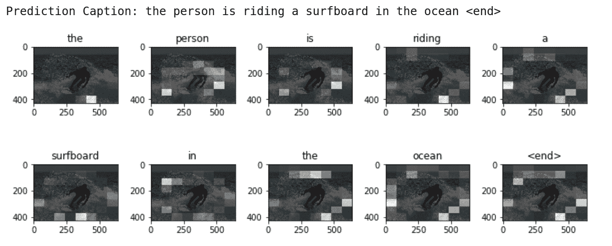
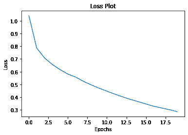
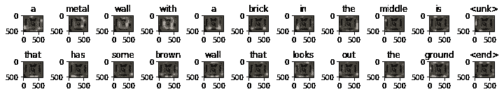
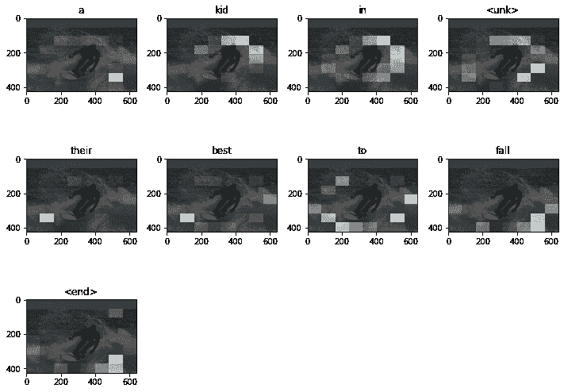

# Image captioning with visual attention

> 原文：[https://tensorflow.google.cn/tutorials/text/image_captioning](https://tensorflow.google.cn/tutorials/text/image_captioning)

<devsite-mathjax config="TeX-AMS-MML_SVG"></devsite-mathjax>

Given an image like the example below, our goal is to generate a caption such as "a surfer riding on a wave".


*[Image Source](https://commons.wikimedia.org/wiki/Surfing#/media/File:Surfing_in_Hawaii.jpg); License: Public Domain*

To accomplish this, you'll use an attention-based model, which enables us to see what parts of the image the model focuses on as it generates a caption.



The model architecture is similar to [Show, Attend and Tell: Neural Image Caption Generation with Visual Attention](https://arxiv.org/abs/1502.03044).

This notebook is an end-to-end example. When you run the notebook, it downloads the [MS-COCO](http://cocodataset.org/#home) dataset, preprocesses and caches a subset of images using Inception V3, trains an encoder-decoder model, and generates captions on new images using the trained model.

In this example, you will train a model on a relatively small amount of data—the first 30,000 captions for about 20,000 images (because there are multiple captions per image in the dataset).

```py
import tensorflow as tf

# You'll generate plots of attention in order to see which parts of an image
# our model focuses on during captioning
import matplotlib.pyplot as plt

# Scikit-learn includes many helpful utilities
from sklearn.model_selection import train_test_split
from sklearn.utils import shuffle

import collections
import random
import re
import numpy as np
import os
import time
import json
from glob import glob
from PIL import Image
import pickle 
```

## Download and prepare the MS-COCO dataset

You will use the [MS-COCO dataset](http://cocodataset.org/#home) to train our model. The dataset contains over 82,000 images, each of which has at least 5 different caption annotations. The code below downloads and extracts the dataset automatically.

**Caution:** large download ahead**. You'll use the training set, which is a 13GB file.

```py
# Download caption annotation files
annotation_folder = '/annotations/'
if not os.path.exists(os.path.abspath('.') + annotation_folder):
  annotation_zip = tf.keras.utils.get_file('captions.zip',
                                          cache_subdir=os.path.abspath('.'),
                                          origin = 'http://images.cocodataset.org/annotations/annotations_trainval2014.zip',
                                          extract = True)
  annotation_file = os.path.dirname(annotation_zip)+'/annotations/captions_train2014.json'
  os.remove(annotation_zip)

# Download image files
image_folder = '/train2014/'
if not os.path.exists(os.path.abspath('.') + image_folder):
  image_zip = tf.keras.utils.get_file('train2014.zip',
                                      cache_subdir=os.path.abspath('.'),
                                      origin = 'http://images.cocodataset.org/zips/train2014.zip',
                                      extract = True)
  PATH = os.path.dirname(image_zip) + image_folder
  os.remove(image_zip)
else:
  PATH = os.path.abspath('.') + image_folder 
```

```py
Downloading data from http://images.cocodataset.org/annotations/annotations_trainval2014.zip
252878848/252872794 [==============================] - 7s 0us/step
Downloading data from http://images.cocodataset.org/zips/train2014.zip
13510574080/13510573713 [==============================] - 374s 0us/step

```

## Optional: limit the size of the training set

To speed up training for this tutorial, you'll use a subset of 30,000 captions and their corresponding images to train our model. Choosing to use more data would result in improved captioning quality.

```py
with open(annotation_file, 'r') as f:
    annotations = json.load(f) 
```

```py
# Group all captions together having the same image ID.
image_path_to_caption = collections.defaultdict(list)
for val in annotations['annotations']:
  caption = f"<start> {val['caption']} <end>"
  image_path = PATH + 'COCO_train2014_' + '%012d.jpg' % (val['image_id'])
  image_path_to_caption[image_path].append(caption) 
```

```py
image_paths = list(image_path_to_caption.keys())
random.shuffle(image_paths)

# Select the first 6000 image_paths from the shuffled set.
# Approximately each image id has 5 captions associated with it, so that will 
# lead to 30,000 examples.
train_image_paths = image_paths[:6000]
print(len(train_image_paths)) 
```

```py
6000

```

```py
train_captions = []
img_name_vector = []

for image_path in train_image_paths:
  caption_list = image_path_to_caption[image_path]
  train_captions.extend(caption_list)
  img_name_vector.extend([image_path] * len(caption_list)) 
```

```py
print(train_captions[0])
Image.open(img_name_vector[0]) 
```

```py
<start> a woman in a blue dress is playing tennis <end>

```


## Preprocess the images using InceptionV3

Next, you will use InceptionV3 (which is pretrained on Imagenet) to classify each image. You will extract features from the last convolutional layer.

First, you will convert the images into InceptionV3's expected format by:

*   Resizing the image to 299px by 299px
*   [Preprocess the images](https://cloud.google.com/tpu/docs/inception-v3-advanced#preprocessing_stage) using the [preprocess_input](https://tensorflow.google.cn/api_docs/python/tf/keras/applications/inception_v3/preprocess_input) method to normalize the image so that it contains pixels in the range of -1 to 1, which matches the format of the images used to train InceptionV3.

```py
def load_image(image_path):
    img = tf.io.read_file(image_path)
    img = tf.image.decode_jpeg(img, channels=3)
    img = tf.image.resize(img, (299, 299))
    img = tf.keras.applications.inception_v3.preprocess_input(img)
    return img, image_path 
```

## Initialize InceptionV3 and load the pretrained Imagenet weights

Now you'll create a tf.keras model where the output layer is the last convolutional layer in the InceptionV3 architecture. The shape of the output of this layer is `8x8x2048`. You use the last convolutional layer because you are using attention in this example. You don't perform this initialization during training because it could become a bottleneck.

*   You forward each image through the network and store the resulting vector in a dictionary (image_name --> feature_vector).
*   After all the images are passed through the network, you pickle the dictionary and save it to disk.

```py
image_model = tf.keras.applications.InceptionV3(include_top=False,
                                                weights='imagenet')
new_input = image_model.input
hidden_layer = image_model.layers[-1].output

image_features_extract_model = tf.keras.Model(new_input, hidden_layer) 
```

```py
Downloading data from https://storage.googleapis.com/tensorflow/keras-applications/inception_v3/inception_v3_weights_tf_dim_ordering_tf_kernels_notop.h5
87916544/87910968 [==============================] - 1s 0us/step

```

## Caching the features extracted from InceptionV3

You will pre-process each image with InceptionV3 and cache the output to disk. Caching the output in RAM would be faster but also memory intensive, requiring 8 * 8 * 2048 floats per image. At the time of writing, this exceeds the memory limitations of Colab (currently 12GB of memory).

Performance could be improved with a more sophisticated caching strategy (for example, by sharding the images to reduce random access disk I/O), but that would require more code.

The caching will take about 10 minutes to run in Colab with a GPU. If you'd like to see a progress bar, you can:

1.  install [tqdm](https://github.com/tqdm/tqdm):

    `!pip install -q tqdm`

2.  Import tqdm:

    `from tqdm import tqdm`

3.  Change the following line:

    `for img, path in image_dataset:`

    to:

    `for img, path in tqdm(image_dataset):`

```py
# Get unique images
encode_train = sorted(set(img_name_vector))

# Feel free to change batch_size according to your system configuration
image_dataset = tf.data.Dataset.from_tensor_slices(encode_train)
image_dataset = image_dataset.map(
  load_image, num_parallel_calls=tf.data.experimental.AUTOTUNE).batch(16)

for img, path in image_dataset:
  batch_features = image_features_extract_model(img)
  batch_features = tf.reshape(batch_features,
                              (batch_features.shape[0], -1, batch_features.shape[3]))

  for bf, p in zip(batch_features, path):
    path_of_feature = p.numpy().decode("utf-8")
    np.save(path_of_feature, bf.numpy()) 
```

## Preprocess and tokenize the captions

*   First, you'll tokenize the captions (for example, by splitting on spaces). This gives us a vocabulary of all of the unique words in the data (for example, "surfing", "football", and so on).
*   Next, you'll limit the vocabulary size to the top 5,000 words (to save memory). You'll replace all other words with the token "UNK" (unknown).
*   You then create word-to-index and index-to-word mappings.
*   Finally, you pad all sequences to be the same length as the longest one.

```py
# Find the maximum length of any caption in our dataset
def calc_max_length(tensor):
    return max(len(t) for t in tensor) 
```

```py
# Choose the top 5000 words from the vocabulary
top_k = 5000
tokenizer = tf.keras.preprocessing.text.Tokenizer(num_words=top_k,
                                                  oov_token="<unk>",
                                                  filters='!"#$%&()*+.,-/:;=?@[\]^_`{|}~ ')
tokenizer.fit_on_texts(train_captions)
train_seqs = tokenizer.texts_to_sequences(train_captions) 
```

```py
tokenizer.word_index['<pad>'] = 0
tokenizer.index_word[0] = '<pad>' 
```

```py
# Create the tokenized vectors
train_seqs = tokenizer.texts_to_sequences(train_captions) 
```

```py
# Pad each vector to the max_length of the captions
# If you do not provide a max_length value, pad_sequences calculates it automatically
cap_vector = tf.keras.preprocessing.sequence.pad_sequences(train_seqs, padding='post') 
```

```py
# Calculates the max_length, which is used to store the attention weights
max_length = calc_max_length(train_seqs) 
```

## Split the data into training and testing

```py
img_to_cap_vector = collections.defaultdict(list)
for img, cap in zip(img_name_vector, cap_vector):
  img_to_cap_vector[img].append(cap)

# Create training and validation sets using an 80-20 split randomly.
img_keys = list(img_to_cap_vector.keys())
random.shuffle(img_keys)

slice_index = int(len(img_keys)*0.8)
img_name_train_keys, img_name_val_keys = img_keys[:slice_index], img_keys[slice_index:]

img_name_train = []
cap_train = []
for imgt in img_name_train_keys:
  capt_len = len(img_to_cap_vector[imgt])
  img_name_train.extend([imgt] * capt_len)
  cap_train.extend(img_to_cap_vector[imgt])

img_name_val = []
cap_val = []
for imgv in img_name_val_keys:
  capv_len = len(img_to_cap_vector[imgv])
  img_name_val.extend([imgv] * capv_len)
  cap_val.extend(img_to_cap_vector[imgv]) 
```

```py
len(img_name_train), len(cap_train), len(img_name_val), len(cap_val) 
```

```py
(24009, 24009, 6001, 6001)

```

## Create a tf.data dataset for training

Our images and captions are ready! Next, let's create a tf.data dataset to use for training our model.

```py
# Feel free to change these parameters according to your system's configuration

BATCH_SIZE = 64
BUFFER_SIZE = 1000
embedding_dim = 256
units = 512
vocab_size = top_k + 1
num_steps = len(img_name_train) // BATCH_SIZE
# Shape of the vector extracted from InceptionV3 is (64, 2048)
# These two variables represent that vector shape
features_shape = 2048
attention_features_shape = 64 
```

```py
# Load the numpy files
def map_func(img_name, cap):
  img_tensor = np.load(img_name.decode('utf-8')+'.npy')
  return img_tensor, cap 
```

```py
dataset = tf.data.Dataset.from_tensor_slices((img_name_train, cap_train))

# Use map to load the numpy files in parallel
dataset = dataset.map(lambda item1, item2: tf.numpy_function(
          map_func, [item1, item2], [tf.float32, tf.int32]),
          num_parallel_calls=tf.data.experimental.AUTOTUNE)

# Shuffle and batch
dataset = dataset.shuffle(BUFFER_SIZE).batch(BATCH_SIZE)
dataset = dataset.prefetch(buffer_size=tf.data.experimental.AUTOTUNE) 
```

## Model

Fun fact: the decoder below is identical to the one in the example for [Neural Machine Translation with Attention](https://tensorflow.google.cn/tutorials/sequences/nmt_with_attention).

The model architecture is inspired by the [Show, Attend and Tell](https://arxiv.org/pdf/1502.03044.pdf) paper.

*   In this example, you extract the features from the lower convolutional layer of InceptionV3 giving us a vector of shape (8, 8, 2048).
*   You squash that to a shape of (64, 2048).
*   This vector is then passed through the CNN Encoder (which consists of a single Fully connected layer).
*   The RNN (here GRU) attends over the image to predict the next word.

```py
class BahdanauAttention(tf.keras.Model):
  def __init__(self, units):
    super(BahdanauAttention, self).__init__()
    self.W1 = tf.keras.layers.Dense(units)
    self.W2 = tf.keras.layers.Dense(units)
    self.V = tf.keras.layers.Dense(1)

  def call(self, features, hidden):
    # features(CNN_encoder output) shape == (batch_size, 64, embedding_dim)

    # hidden shape == (batch_size, hidden_size)
    # hidden_with_time_axis shape == (batch_size, 1, hidden_size)
    hidden_with_time_axis = tf.expand_dims(hidden, 1)

    # attention_hidden_layer shape == (batch_size, 64, units)
    attention_hidden_layer = (tf.nn.tanh(self.W1(features) +
                                         self.W2(hidden_with_time_axis)))

    # score shape == (batch_size, 64, 1)
    # This gives you an unnormalized score for each image feature.
    score = self.V(attention_hidden_layer)

    # attention_weights shape == (batch_size, 64, 1)
    attention_weights = tf.nn.softmax(score, axis=1)

    # context_vector shape after sum == (batch_size, hidden_size)
    context_vector = attention_weights * features
    context_vector = tf.reduce_sum(context_vector, axis=1)

    return context_vector, attention_weights 
```

```py
class CNN_Encoder(tf.keras.Model):
    # Since you have already extracted the features and dumped it using pickle
    # This encoder passes those features through a Fully connected layer
    def __init__(self, embedding_dim):
        super(CNN_Encoder, self).__init__()
        # shape after fc == (batch_size, 64, embedding_dim)
        self.fc = tf.keras.layers.Dense(embedding_dim)

    def call(self, x):
        x = self.fc(x)
        x = tf.nn.relu(x)
        return x 
```

```py
class RNN_Decoder(tf.keras.Model):
  def __init__(self, embedding_dim, units, vocab_size):
    super(RNN_Decoder, self).__init__()
    self.units = units

    self.embedding = tf.keras.layers.Embedding(vocab_size, embedding_dim)
    self.gru = tf.keras.layers.GRU(self.units,
                                   return_sequences=True,
                                   return_state=True,
                                   recurrent_initializer='glorot_uniform')
    self.fc1 = tf.keras.layers.Dense(self.units)
    self.fc2 = tf.keras.layers.Dense(vocab_size)

    self.attention = BahdanauAttention(self.units)

  def call(self, x, features, hidden):
    # defining attention as a separate model
    context_vector, attention_weights = self.attention(features, hidden)

    # x shape after passing through embedding == (batch_size, 1, embedding_dim)
    x = self.embedding(x)

    # x shape after concatenation == (batch_size, 1, embedding_dim + hidden_size)
    x = tf.concat([tf.expand_dims(context_vector, 1), x], axis=-1)

    # passing the concatenated vector to the GRU
    output, state = self.gru(x)

    # shape == (batch_size, max_length, hidden_size)
    x = self.fc1(output)

    # x shape == (batch_size * max_length, hidden_size)
    x = tf.reshape(x, (-1, x.shape[2]))

    # output shape == (batch_size * max_length, vocab)
    x = self.fc2(x)

    return x, state, attention_weights

  def reset_state(self, batch_size):
    return tf.zeros((batch_size, self.units)) 
```

```py
encoder = CNN_Encoder(embedding_dim)
decoder = RNN_Decoder(embedding_dim, units, vocab_size) 
```

```py
optimizer = tf.keras.optimizers.Adam()
loss_object = tf.keras.losses.SparseCategoricalCrossentropy(
    from_logits=True, reduction='none')

def loss_function(real, pred):
  mask = tf.math.logical_not(tf.math.equal(real, 0))
  loss_ = loss_object(real, pred)

  mask = tf.cast(mask, dtype=loss_.dtype)
  loss_ *= mask

  return tf.reduce_mean(loss_) 
```

## Checkpoint

```py
checkpoint_path = "./checkpoints/train"
ckpt = tf.train.Checkpoint(encoder=encoder,
                           decoder=decoder,
                           optimizer = optimizer)
ckpt_manager = tf.train.CheckpointManager(ckpt, checkpoint_path, max_to_keep=5) 
```

```py
start_epoch = 0
if ckpt_manager.latest_checkpoint:
  start_epoch = int(ckpt_manager.latest_checkpoint.split('-')[-1])
  # restoring the latest checkpoint in checkpoint_path
  ckpt.restore(ckpt_manager.latest_checkpoint) 
```

## Training

*   You extract the features stored in the respective `.npy` files and then pass those features through the encoder.
*   The encoder output, hidden state(initialized to 0) and the decoder input (which is the start token) is passed to the decoder.
*   The decoder returns the predictions and the decoder hidden state.
*   The decoder hidden state is then passed back into the model and the predictions are used to calculate the loss.
*   Use teacher forcing to decide the next input to the decoder.
*   Teacher forcing is the technique where the target word is passed as the next input to the decoder.
*   The final step is to calculate the gradients and apply it to the optimizer and backpropagate.

```py
# adding this in a separate cell because if you run the training cell
# many times, the loss_plot array will be reset
loss_plot = [] 
```

```py
@tf.function
def train_step(img_tensor, target):
  loss = 0

  # initializing the hidden state for each batch
  # because the captions are not related from image to image
  hidden = decoder.reset_state(batch_size=target.shape[0])

  dec_input = tf.expand_dims([tokenizer.word_index['<start>']] * target.shape[0], 1)

  with tf.GradientTape() as tape:
      features = encoder(img_tensor)

      for i in range(1, target.shape[1]):
          # passing the features through the decoder
          predictions, hidden, _ = decoder(dec_input, features, hidden)

          loss += loss_function(target[:, i], predictions)

          # using teacher forcing
          dec_input = tf.expand_dims(target[:, i], 1)

  total_loss = (loss / int(target.shape[1]))

  trainable_variables = encoder.trainable_variables + decoder.trainable_variables

  gradients = tape.gradient(loss, trainable_variables)

  optimizer.apply_gradients(zip(gradients, trainable_variables))

  return loss, total_loss 
```

```py
EPOCHS = 20

for epoch in range(start_epoch, EPOCHS):
    start = time.time()
    total_loss = 0

    for (batch, (img_tensor, target)) in enumerate(dataset):
        batch_loss, t_loss = train_step(img_tensor, target)
        total_loss += t_loss

        if batch % 100 == 0:
            print ('Epoch {} Batch {} Loss {:.4f}'.format(
              epoch + 1, batch, batch_loss.numpy() / int(target.shape[1])))
    # storing the epoch end loss value to plot later
    loss_plot.append(total_loss / num_steps)

    if epoch % 5 == 0:
      ckpt_manager.save()

    print ('Epoch {} Loss {:.6f}'.format(epoch + 1,
                                         total_loss/num_steps))
    print ('Time taken for 1 epoch {} sec\n'.format(time.time() - start)) 
```

```py
Epoch 1 Batch 0 Loss 2.0618
Epoch 1 Batch 100 Loss 1.1516
Epoch 1 Batch 200 Loss 0.9201
Epoch 1 Batch 300 Loss 0.8922
Epoch 1 Loss 1.040854
Time taken for 1 epoch 100.07987594604492 sec

Epoch 2 Batch 0 Loss 0.8678
Epoch 2 Batch 100 Loss 0.8257
Epoch 2 Batch 200 Loss 0.8268
Epoch 2 Batch 300 Loss 0.7109
Epoch 2 Loss 0.786627
Time taken for 1 epoch 36.52699089050293 sec

Epoch 3 Batch 0 Loss 0.7747
Epoch 3 Batch 100 Loss 0.7220
Epoch 3 Batch 200 Loss 0.7071
Epoch 3 Batch 300 Loss 0.7065
Epoch 3 Loss 0.708941
Time taken for 1 epoch 36.67209577560425 sec

Epoch 4 Batch 0 Loss 0.7542
Epoch 4 Batch 100 Loss 0.6422
Epoch 4 Batch 200 Loss 0.6024
Epoch 4 Batch 300 Loss 0.7107
Epoch 4 Loss 0.657265
Time taken for 1 epoch 36.70520520210266 sec

Epoch 5 Batch 0 Loss 0.6684
Epoch 5 Batch 100 Loss 0.6549
Epoch 5 Batch 200 Loss 0.6364
Epoch 5 Batch 300 Loss 0.6250
Epoch 5 Loss 0.616459
Time taken for 1 epoch 36.51219129562378 sec

Epoch 6 Batch 0 Loss 0.6531
Epoch 6 Batch 100 Loss 0.5622
Epoch 6 Batch 200 Loss 0.5688
Epoch 6 Batch 300 Loss 0.6302
Epoch 6 Loss 0.581336
Time taken for 1 epoch 37.36966156959534 sec

Epoch 7 Batch 0 Loss 0.5335
Epoch 7 Batch 100 Loss 0.5362
Epoch 7 Batch 200 Loss 0.5960
Epoch 7 Batch 300 Loss 0.5382
Epoch 7 Loss 0.558110
Time taken for 1 epoch 36.8504319190979 sec

Epoch 8 Batch 0 Loss 0.5242
Epoch 8 Batch 100 Loss 0.5142
Epoch 8 Batch 200 Loss 0.5458
Epoch 8 Batch 300 Loss 0.4814
Epoch 8 Loss 0.523847
Time taken for 1 epoch 36.90491819381714 sec

Epoch 9 Batch 0 Loss 0.5318
Epoch 9 Batch 100 Loss 0.4869
Epoch 9 Batch 200 Loss 0.4791
Epoch 9 Batch 300 Loss 0.4719
Epoch 9 Loss 0.496363
Time taken for 1 epoch 36.52782845497131 sec

Epoch 10 Batch 0 Loss 0.4707
Epoch 10 Batch 100 Loss 0.4642
Epoch 10 Batch 200 Loss 0.4685
Epoch 10 Batch 300 Loss 0.4659
Epoch 10 Loss 0.470341
Time taken for 1 epoch 36.24022054672241 sec

Epoch 11 Batch 0 Loss 0.4530
Epoch 11 Batch 100 Loss 0.4947
Epoch 11 Batch 200 Loss 0.4457
Epoch 11 Batch 300 Loss 0.4617
Epoch 11 Loss 0.447154
Time taken for 1 epoch 36.481024980545044 sec

Epoch 12 Batch 0 Loss 0.4359
Epoch 12 Batch 100 Loss 0.4257
Epoch 12 Batch 200 Loss 0.4124
Epoch 12 Batch 300 Loss 0.4302
Epoch 12 Loss 0.424052
Time taken for 1 epoch 37.11701226234436 sec

Epoch 13 Batch 0 Loss 0.4531
Epoch 13 Batch 100 Loss 0.4064
Epoch 13 Batch 200 Loss 0.3677
Epoch 13 Batch 300 Loss 0.3942
Epoch 13 Loss 0.402709
Time taken for 1 epoch 36.868356466293335 sec

Epoch 14 Batch 0 Loss 0.3967
Epoch 14 Batch 100 Loss 0.3455
Epoch 14 Batch 200 Loss 0.3742
Epoch 14 Batch 300 Loss 0.3905
Epoch 14 Loss 0.382572
Time taken for 1 epoch 36.95557117462158 sec

Epoch 15 Batch 0 Loss 0.3754
Epoch 15 Batch 100 Loss 0.3721
Epoch 15 Batch 200 Loss 0.3633
Epoch 15 Batch 300 Loss 0.3830
Epoch 15 Loss 0.364831
Time taken for 1 epoch 36.37884545326233 sec

Epoch 16 Batch 0 Loss 0.3873
Epoch 16 Batch 100 Loss 0.3499
Epoch 16 Batch 200 Loss 0.3437
Epoch 16 Batch 300 Loss 0.3232
Epoch 16 Loss 0.346227
Time taken for 1 epoch 36.44292426109314 sec

Epoch 17 Batch 0 Loss 0.3250
Epoch 17 Batch 100 Loss 0.3218
Epoch 17 Batch 200 Loss 0.3703
Epoch 17 Batch 300 Loss 0.2849
Epoch 17 Loss 0.328413
Time taken for 1 epoch 36.11301136016846 sec

Epoch 18 Batch 0 Loss 0.3032
Epoch 18 Batch 100 Loss 0.3321
Epoch 18 Batch 200 Loss 0.3112
Epoch 18 Batch 300 Loss 0.3129
Epoch 18 Loss 0.315071
Time taken for 1 epoch 36.2520546913147 sec

Epoch 19 Batch 0 Loss 0.3005
Epoch 19 Batch 100 Loss 0.3190
Epoch 19 Batch 200 Loss 0.3243
Epoch 19 Batch 300 Loss 0.2861
Epoch 19 Loss 0.301502
Time taken for 1 epoch 36.188610553741455 sec

Epoch 20 Batch 0 Loss 0.3263
Epoch 20 Batch 100 Loss 0.3182
Epoch 20 Batch 200 Loss 0.2885
Epoch 20 Batch 300 Loss 0.2923
Epoch 20 Loss 0.285932
Time taken for 1 epoch 36.192723989486694 sec

```

```py
plt.plot(loss_plot)
plt.xlabel('Epochs')
plt.ylabel('Loss')
plt.title('Loss Plot')
plt.show() 
```



## Caption!

*   The evaluate function is similar to the training loop, except you don't use teacher forcing here. The input to the decoder at each time step is its previous predictions along with the hidden state and the encoder output.
*   Stop predicting when the model predicts the end token.
*   And store the attention weights for every time step.

```py
def evaluate(image):
    attention_plot = np.zeros((max_length, attention_features_shape))

    hidden = decoder.reset_state(batch_size=1)

    temp_input = tf.expand_dims(load_image(image)[0], 0)
    img_tensor_val = image_features_extract_model(temp_input)
    img_tensor_val = tf.reshape(img_tensor_val, (img_tensor_val.shape[0], -1, img_tensor_val.shape[3]))

    features = encoder(img_tensor_val)

    dec_input = tf.expand_dims([tokenizer.word_index['<start>']], 0)
    result = []

    for i in range(max_length):
        predictions, hidden, attention_weights = decoder(dec_input, features, hidden)

        attention_plot[i] = tf.reshape(attention_weights, (-1, )).numpy()

        predicted_id = tf.random.categorical(predictions, 1)[0][0].numpy()
        result.append(tokenizer.index_word[predicted_id])

        if tokenizer.index_word[predicted_id] == '<end>':
            return result, attention_plot

        dec_input = tf.expand_dims([predicted_id], 0)

    attention_plot = attention_plot[:len(result), :]
    return result, attention_plot 
```

```py
def plot_attention(image, result, attention_plot):
    temp_image = np.array(Image.open(image))

    fig = plt.figure(figsize=(10, 10))

    len_result = len(result)
    for l in range(len_result):
        temp_att = np.resize(attention_plot[l], (8, 8))
        ax = fig.add_subplot(len_result//2, len_result//2, l+1)
        ax.set_title(result[l])
        img = ax.imshow(temp_image)
        ax.imshow(temp_att, cmap='gray', alpha=0.6, extent=img.get_extent())

    plt.tight_layout()
    plt.show() 
```

```py
# captions on the validation set
rid = np.random.randint(0, len(img_name_val))
image = img_name_val[rid]
real_caption = ' '.join([tokenizer.index_word[i] for i in cap_val[rid] if i not in [0]])
result, attention_plot = evaluate(image)

print ('Real Caption:', real_caption)
print ('Prediction Caption:', ' '.join(result))
plot_attention(image, result, attention_plot) 
```

```py
Real Caption: <start> a <unk> clock is on display on the surface of a building <end>
Prediction Caption: a metal wall with a brick in the middle is <unk> that has some brown wall that looks out the ground <end>

```



## Try it on your own images

For fun, below we've provided a method you can use to caption your own images with the model we've just trained. Keep in mind, it was trained on a relatively small amount of data, and your images may be different from the training data (so be prepared for weird results!)

```py
image_url = 'https://tensorflow.org/images/surf.jpg'
image_extension = image_url[-4:]
image_path = tf.keras.utils.get_file('image'+image_extension,
                                     origin=image_url)

result, attention_plot = evaluate(image_path)
print ('Prediction Caption:', ' '.join(result))
plot_attention(image_path, result, attention_plot)
# opening the image
Image.open(image_path) 
```

```py
Downloading data from https://tensorflow.org/images/surf.jpg
65536/64400 [==============================] - 0s 2us/step
Prediction Caption: a kid in <unk> their best to fall <end>

```




# Next steps

Congrats! You've just trained an image captioning model with attention. Next, take a look at this example [Neural Machine Translation with Attention](https://tensorflow.google.cn/tutorials/sequences/nmt_with_attention). It uses a similar architecture to translate between Spanish and English sentences. You can also experiment with training the code in this notebook on a different dataset.