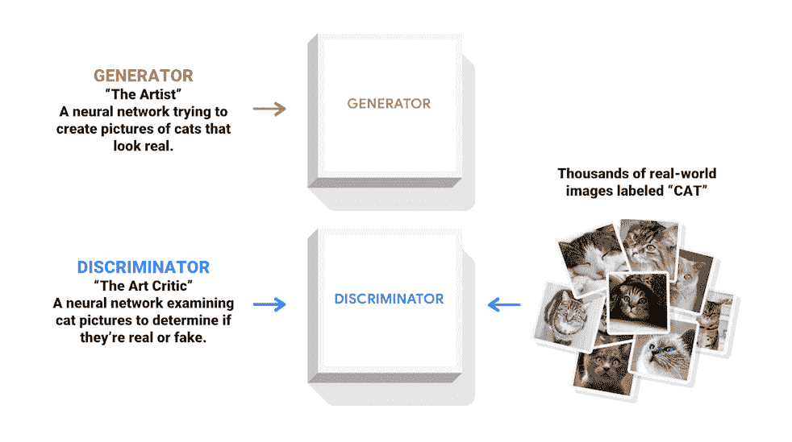
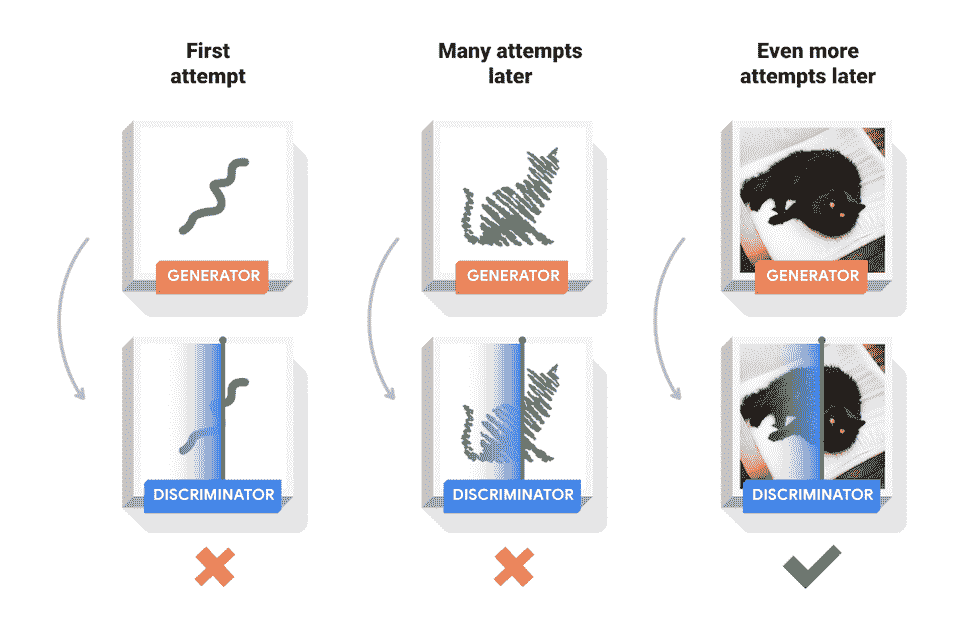
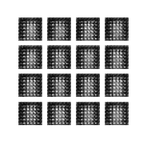
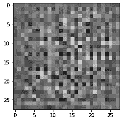
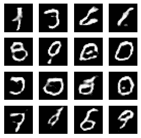
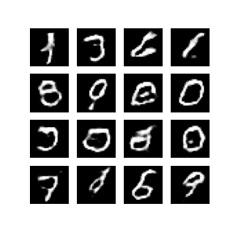

# 深度卷积生成对抗网络

> 原文：[https://tensorflow.google.cn/tutorials/generative/dcgan](https://tensorflow.google.cn/tutorials/generative/dcgan)

**Note:** 我们的 TensorFlow 社区翻译了这些文档。因为社区翻译是尽力而为， 所以无法保证它们是最准确的，并且反映了最新的 [官方英文文档](https://tensorflow.google.cn/?hl=en)。如果您有改进此翻译的建议， 请提交 pull request 到 [tensorflow/docs](https://github.com/tensorflow/docs) GitHub 仓库。要志愿地撰写或者审核译文，请加入 [docs-zh-cn@tensorflow.org Google Group](https://groups.google.com/a/tensorflow.org/forum/#!forum/docs-zh-cn)。

本教程演示了如何使用[深度卷积生成对抗网络](https://arxiv.org/pdf/1511.06434.pdf)（DCGAN）生成手写数字图片。该代码是使用 [Keras Sequential API](https://tensorflow.google.cn/guide/keras) 与 [`tf.GradientTape`](https://tensorflow.google.cn/api_docs/python/tf/GradientTape) 训练循环编写的。

## 什么是生成对抗网络？

[生成对抗网络](https://arxiv.org/abs/1406.2661)（GANs）是当今计算机科学领域最有趣的想法之一。两个模型通过对抗过程同时训练。一个*生成器*（“艺术家”）学习创造看起来真实的图像，而*判别器*（“艺术评论家”）学习区分真假图像。



训练过程中，*生成器*在生成逼真图像方面逐渐变强，而*判别器*在辨别这些图像的能力上逐渐变强。当*判别器*不再能够区分真实图片和伪造图片时，训练过程达到平衡。



本笔记在 MNIST 数据集上演示了该过程。下方动画展示了当训练了 50 个 epoch （全部数据集迭代 50 次） 时*生成器*所生成的一系列图片。图片从随机噪声开始，随着时间的推移越来越像手写数字。



要了解关于 GANs 的更多信息，我们建议参阅 MIT 的 [深度学习入门](http://introtodeeplearning.com/) 课程。

### Import TensorFlow and other libraries

```py
import tensorflow as tf 
```

```py
tf.__version__ 
```

```py
'2.3.0'

```

```py
# 用于生成 GIF 图片
pip install -q imageio

```

```py
WARNING: You are using pip version 20.2.2; however, version 20.2.3 is available.
You should consider upgrading via the '/tmpfs/src/tf_docs_env/bin/python -m pip install --upgrade pip' command.

```

```py
import glob
import imageio
import matplotlib.pyplot as plt
import numpy as np
import os
import PIL
from tensorflow.keras import layers
import time

from IPython import display 
```

### 加载和准备数据集

您将使用 MNIST 数据集来训练生成器和判别器。生成器将生成类似于 MNIST 数据集的手写数字。

```py
(train_images, train_labels), (_, _) = tf.keras.datasets.mnist.load_data() 
```

```py
train_images = train_images.reshape(train_images.shape[0], 28, 28, 1).astype('float32')
train_images = (train_images - 127.5) / 127.5 # 将图片标准化到 [-1, 1] 区间内 
```

```py
BUFFER_SIZE = 60000
BATCH_SIZE = 256 
```

```py
# 批量化和打乱数据
train_dataset = tf.data.Dataset.from_tensor_slices(train_images).shuffle(BUFFER_SIZE).batch(BATCH_SIZE) 
```

## 创建模型

生成器和判别器均使用 [Keras Sequential API](https://tensorflow.google.cn/guide/keras#sequential_model) 定义。

### 生成器

生成器使用 [`tf.keras.layers.Conv2DTranspose`](https://tensorflow.google.cn/api_docs/python/tf/keras/layers/Conv2DTranspose) （上采样）层来从种子（随机噪声）中产生图片。以一个使用该种子作为输入的 `Dense` 层开始，然后多次上采样直到达到所期望的 28x28x1 的图片尺寸。注意除了输出层使用 tanh 之外，其他每层均使用 [`tf.keras.layers.LeakyReLU`](https://tensorflow.google.cn/api_docs/python/tf/keras/layers/LeakyReLU) 作为激活函数。

```py
def make_generator_model():
    model = tf.keras.Sequential()
    model.add(layers.Dense(7*7*256, use_bias=False, input_shape=(100,)))
    model.add(layers.BatchNormalization())
    model.add(layers.LeakyReLU())

    model.add(layers.Reshape((7, 7, 256)))
    assert model.output_shape == (None, 7, 7, 256) # 注意：batch size 没有限制

    model.add(layers.Conv2DTranspose(128, (5, 5), strides=(1, 1), padding='same', use_bias=False))
    assert model.output_shape == (None, 7, 7, 128)
    model.add(layers.BatchNormalization())
    model.add(layers.LeakyReLU())

    model.add(layers.Conv2DTranspose(64, (5, 5), strides=(2, 2), padding='same', use_bias=False))
    assert model.output_shape == (None, 14, 14, 64)
    model.add(layers.BatchNormalization())
    model.add(layers.LeakyReLU())

    model.add(layers.Conv2DTranspose(1, (5, 5), strides=(2, 2), padding='same', use_bias=False, activation='tanh'))
    assert model.output_shape == (None, 28, 28, 1)

    return model 
```

使用（尚未训练的）生成器创建一张图片。

```py
generator = make_generator_model()

noise = tf.random.normal([1, 100])
generated_image = generator(noise, training=False)

plt.imshow(generated_image[0, :, :, 0], cmap='gray') 
```

```py
<matplotlib.image.AxesImage at 0x7f01d26074a8>

```



### 判别器

判别器是一个基于 CNN 的图片分类器。

```py
def make_discriminator_model():
    model = tf.keras.Sequential()
    model.add(layers.Conv2D(64, (5, 5), strides=(2, 2), padding='same',
                                     input_shape=[28, 28, 1]))
    model.add(layers.LeakyReLU())
    model.add(layers.Dropout(0.3))

    model.add(layers.Conv2D(128, (5, 5), strides=(2, 2), padding='same'))
    model.add(layers.LeakyReLU())
    model.add(layers.Dropout(0.3))

    model.add(layers.Flatten())
    model.add(layers.Dense(1))

    return model 
```

使用（尚未训练的）判别器来对图片的真伪进行判断。模型将被训练为为真实图片输出正值，为伪造图片输出负值。

```py
discriminator = make_discriminator_model()
decision = discriminator(generated_image)
print (decision) 
```

```py
tf.Tensor([[-0.00427552]], shape=(1, 1), dtype=float32)

```

## 定义损失函数和优化器

为两个模型定义损失函数和优化器。

```py
# 该方法返回计算交叉熵损失的辅助函数
cross_entropy = tf.keras.losses.BinaryCrossentropy(from_logits=True) 
```

### 判别器损失

该方法量化判别器从判断真伪图片的能力。它将判别器对真实图片的预测值与值全为 1 的数组进行对比，将判别器对伪造（生成的）图片的预测值与值全为 0 的数组进行对比。

```py
def discriminator_loss(real_output, fake_output):
    real_loss = cross_entropy(tf.ones_like(real_output), real_output)
    fake_loss = cross_entropy(tf.zeros_like(fake_output), fake_output)
    total_loss = real_loss + fake_loss
    return total_loss 
```

### 生成器损失

生成器损失量化其欺骗判别器的能力。直观来讲，如果生成器表现良好，判别器将会把伪造图片判断为真实图片（或 1）。这里我们将把判别器在生成图片上的判断结果与一个值全为 1 的数组进行对比。

```py
def generator_loss(fake_output):
    return cross_entropy(tf.ones_like(fake_output), fake_output) 
```

由于我们需要分别训练两个网络，判别器和生成器的优化器是不同的。

```py
generator_optimizer = tf.keras.optimizers.Adam(1e-4)
discriminator_optimizer = tf.keras.optimizers.Adam(1e-4) 
```

### 保存检查点

本笔记还演示了如何保存和恢复模型，这在长时间训练任务被中断的情况下比较有帮助。

```py
checkpoint_dir = './training_checkpoints'
checkpoint_prefix = os.path.join(checkpoint_dir, "ckpt")
checkpoint = tf.train.Checkpoint(generator_optimizer=generator_optimizer,
                                 discriminator_optimizer=discriminator_optimizer,
                                 generator=generator,
                                 discriminator=discriminator) 
```

## 定义训练循环

```py
EPOCHS = 50
noise_dim = 100
num_examples_to_generate = 16

# 我们将重复使用该种子（因此在动画 GIF 中更容易可视化进度）
seed = tf.random.normal([num_examples_to_generate, noise_dim]) 
```

训练循环在生成器接收到一个随机种子作为输入时开始。该种子用于生产一张图片。判别器随后被用于区分真实图片（选自训练集）和伪造图片（由生成器生成）。针对这里的每一个模型都计算损失函数，并且计算梯度用于更新生成器与判别器。

```py
# 注意 `tf.function` 的使用
# 该注解使函数被“编译”
@tf.function
def train_step(images):
    noise = tf.random.normal([BATCH_SIZE, noise_dim])

    with tf.GradientTape() as gen_tape, tf.GradientTape() as disc_tape:
      generated_images = generator(noise, training=True)

      real_output = discriminator(images, training=True)
      fake_output = discriminator(generated_images, training=True)

      gen_loss = generator_loss(fake_output)
      disc_loss = discriminator_loss(real_output, fake_output)

    gradients_of_generator = gen_tape.gradient(gen_loss, generator.trainable_variables)
    gradients_of_discriminator = disc_tape.gradient(disc_loss, discriminator.trainable_variables)

    generator_optimizer.apply_gradients(zip(gradients_of_generator, generator.trainable_variables))
    discriminator_optimizer.apply_gradients(zip(gradients_of_discriminator, discriminator.trainable_variables)) 
```

```py
def train(dataset, epochs):
  for epoch in range(epochs):
    start = time.time()

    for image_batch in dataset:
      train_step(image_batch)

    # 继续进行时为 GIF 生成图像
    display.clear_output(wait=True)
    generate_and_save_images(generator,
                             epoch + 1,
                             seed)

    # 每 15 个 epoch 保存一次模型
    if (epoch + 1) % 15 == 0:
      checkpoint.save(file_prefix = checkpoint_prefix)

    print ('Time for epoch {} is {} sec'.format(epoch + 1, time.time()-start))

  # 最后一个 epoch 结束后生成图片
  display.clear_output(wait=True)
  generate_and_save_images(generator,
                           epochs,
                           seed) 
```

**生成与保存图片**

```py
def generate_and_save_images(model, epoch, test_input):
  # 注意 training` 设定为 False
  # 因此，所有层都在推理模式下运行（batchnorm）。
  predictions = model(test_input, training=False)

  fig = plt.figure(figsize=(4,4))

  for i in range(predictions.shape[0]):
      plt.subplot(4, 4, i+1)
      plt.imshow(predictions[i, :, :, 0] * 127.5 + 127.5, cmap='gray')
      plt.axis('off')

  plt.savefig('image_at_epoch_{:04d}.png'.format(epoch))
  plt.show() 
```

## 训练模型

调用上面定义的 `train()` 方法来同时训练生成器和判别器。注意，训练 GANs 可能是棘手的。重要的是，生成器和判别器不能够互相压制对方（例如，他们以相似的学习率训练）。

在训练之初，生成的图片看起来像是随机噪声。随着训练过程的进行，生成的数字将越来越真实。在大概 50 个 epoch 之后，这些图片看起来像是 MNIST 数字。使用 Colab 中的默认设置可能需要大约 1 分钟每 epoch。

```py
%%time
train(train_dataset, EPOCHS) 
```



```py
CPU times: user 1min 52s, sys: 11.7 s, total: 2min 4s
Wall time: 3min 22s

```

恢复最新的检查点。

```py
checkpoint.restore(tf.train.latest_checkpoint(checkpoint_dir)) 
```

```py
<tensorflow.python.training.tracking.util.CheckpointLoadStatus at 0x7f0118537668>

```

## 创建 GIF

```py
# 使用 epoch 数生成单张图片
def display_image(epoch_no):
  return PIL.Image.open('image_at_epoch_{:04d}.png'.format(epoch_no)) 
```

```py
display_image(EPOCHS) 
```



使用训练过程中生成的图片通过 `imageio` 生成动态 gif

```py
anim_file = 'dcgan.gif'

with imageio.get_writer(anim_file, mode='I') as writer:
  filenames = glob.glob('image*.png')
  filenames = sorted(filenames)
  last = -1
  for i,filename in enumerate(filenames):
    frame = 2*(i**0.5)
    if round(frame) > round(last):
      last = frame
    else:
      continue
    image = imageio.imread(filename)
    writer.append_data(image)
  image = imageio.imread(filename)
  writer.append_data(image)

import IPython
if IPython.version_info > (6,2,0,''):
  display.Image(filename=anim_file) 
```

如果您正在使用 Colab，您可以通过如下代码下载动画：

```py
try:
  from google.colab import files
except ImportError:
   pass
else:
  files.download(anim_file) 
```

## 下一步

本教程展示了实现和训练 GAN 模型所需的全部必要代码。接下来，您可能想尝试其他数据集，例如大规模名人面部属性（CelebA）数据集 [在 Kaggle 上获取](https://www.kaggle.com/jessicali9530/celeba-dataset)。要了解更多关于 GANs 的信息，我们推荐参阅 [NIPS 2016 教程： 生成对抗网络](https://arxiv.org/abs/1701.00160)。