# CycleGAN

> 原文：[https://tensorflow.google.cn/tutorials/generative/cyclegan](https://tensorflow.google.cn/tutorials/generative/cyclegan)

<devsite-mathjax config="TeX-AMS-MML_SVG"></devsite-mathjax>

**Note:** 我们的 TensorFlow 社区翻译了这些文档。因为社区翻译是尽力而为， 所以无法保证它们是最准确的，并且反映了最新的 [官方英文文档](https://tensorflow.google.cn/?hl=en)。如果您有改进此翻译的建议， 请提交 pull request 到 [tensorflow/docs](https://github.com/tensorflow/docs) GitHub 仓库。要志愿地撰写或者审核译文，请加入 [docs-zh-cn@tensorflow.org Google Group](https://groups.google.com/a/tensorflow.org/forum/#!forum/docs-zh-cn)。

本笔记演示了使用条件 GAN 进行的未配对图像到图像转换，如[使用循环一致的对抗网络进行未配对图像到图像转换](https://arxiv.org/abs/1703.10593) 中所述，也称之为 CycleGAN。论文提出了一种可以捕捉图像域特征并找出如何将这些特征转换为另一个图像域的方法，而无需任何成对的训练样本。

本笔记假定您熟悉 Pix2Pix，您可以在 [Pix2Pix 教程](https://tensorflow.google.cn/tutorials/generative/pix2pix)中了解有关它的信息。CycleGAN 的代码与其相似，主要区别在于额外的损失函数，以及非配对训练数据的使用。

CycleGAN 使用循环一致损失来使训练过程无需配对数据。换句话说，它可以从一个域转换到另一个域，而不需要在源域与目标域之间进行一对一映射。

这为完成许多有趣的任务开辟了可能性，例如照片增强、图片着色、风格迁移等。您所需要的只是源数据集和目标数据集（仅仅是图片目录）

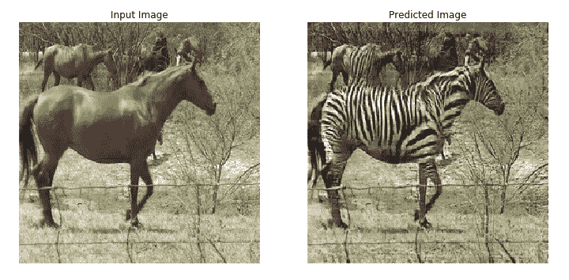 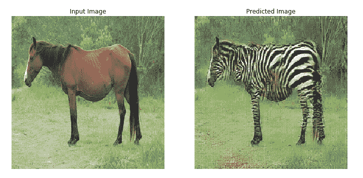

## 设定输入管线

安装 [tensorflow_examples](https://github.com/tensorflow/examples) 包，以导入生成器和判别器。

```py
pip install -q git+https://github.com/tensorflow/examples.git

```

```py
WARNING: You are using pip version 20.2.2; however, version 20.2.3 is available.
You should consider upgrading via the '/tmpfs/src/tf_docs_env/bin/python -m pip install --upgrade pip' command.

```

```py
import tensorflow as tf 
```

```py
import tensorflow_datasets as tfds
from tensorflow_examples.models.pix2pix import pix2pix

import os
import time
import matplotlib.pyplot as plt
from IPython.display import clear_output

tfds.disable_progress_bar()
AUTOTUNE = tf.data.experimental.AUTOTUNE 
```

## 输入管线

本教程训练一个模型，以将普通马图片转换为斑马图片。您可以在[此处](https://tensorflow.google.cn/datasets/datasets#cycle_gan)获取该数据集以及类似数据集。

如[论文](https://arxiv.org/abs/1703.10593)所述，将随机抖动和镜像应用到训练集。这是一些避免过拟合的图像增强技术。

这类似于 [pix2pix](https://tensorflow.google.cn/tutorials/generative/pix2pix#load_the_dataset) 中所做的工作。

*   在随机抖动中，图片大小调整为 `286 x 286`，随后被随机裁剪为 `256 x 256`。
*   在随机镜像中，图片会从左到右随机翻转。

```py
dataset, metadata = tfds.load('cycle_gan/horse2zebra',
                              with_info=True, as_supervised=True)

train_horses, train_zebras = dataset['trainA'], dataset['trainB']
test_horses, test_zebras = dataset['testA'], dataset['testB'] 
```

```py
Downloading and preparing dataset cycle_gan/horse2zebra/2.0.0 (download: 111.45 MiB, generated: Unknown size, total: 111.45 MiB) to /home/kbuilder/tensorflow_datasets/cycle_gan/horse2zebra/2.0.0...
Shuffling and writing examples to /home/kbuilder/tensorflow_datasets/cycle_gan/horse2zebra/2.0.0.incompleteNSW88L/cycle_gan-trainA.tfrecord
Shuffling and writing examples to /home/kbuilder/tensorflow_datasets/cycle_gan/horse2zebra/2.0.0.incompleteNSW88L/cycle_gan-trainB.tfrecord
Shuffling and writing examples to /home/kbuilder/tensorflow_datasets/cycle_gan/horse2zebra/2.0.0.incompleteNSW88L/cycle_gan-testA.tfrecord
Shuffling and writing examples to /home/kbuilder/tensorflow_datasets/cycle_gan/horse2zebra/2.0.0.incompleteNSW88L/cycle_gan-testB.tfrecord
Dataset cycle_gan downloaded and prepared to /home/kbuilder/tensorflow_datasets/cycle_gan/horse2zebra/2.0.0\. Subsequent calls will reuse this data.

```

```py
BUFFER_SIZE = 1000
BATCH_SIZE = 1
IMG_WIDTH = 256
IMG_HEIGHT = 256 
```

```py
def random_crop(image):
  cropped_image = tf.image.random_crop(
      image, size=[IMG_HEIGHT, IMG_WIDTH, 3])

  return cropped_image 
```

```py
# 将图像归一化到区间 [-1, 1] 内。
def normalize(image):
  image = tf.cast(image, tf.float32)
  image = (image / 127.5) - 1
  return image 
```

```py
def random_jitter(image):
  # 调整大小为 286 x 286 x 3
  image = tf.image.resize(image, [286, 286],
                          method=tf.image.ResizeMethod.NEAREST_NEIGHBOR)

  # 随机裁剪到 256 x 256 x 3
  image = random_crop(image)

  # 随机镜像
  image = tf.image.random_flip_left_right(image)

  return image 
```

```py
def preprocess_image_train(image, label):
  image = random_jitter(image)
  image = normalize(image)
  return image 
```

```py
def preprocess_image_test(image, label):
  image = normalize(image)
  return image 
```

```py
train_horses = train_horses.map(
    preprocess_image_train, num_parallel_calls=AUTOTUNE).cache().shuffle(
    BUFFER_SIZE).batch(1)

train_zebras = train_zebras.map(
    preprocess_image_train, num_parallel_calls=AUTOTUNE).cache().shuffle(
    BUFFER_SIZE).batch(1)

test_horses = test_horses.map(
    preprocess_image_test, num_parallel_calls=AUTOTUNE).cache().shuffle(
    BUFFER_SIZE).batch(1)

test_zebras = test_zebras.map(
    preprocess_image_test, num_parallel_calls=AUTOTUNE).cache().shuffle(
    BUFFER_SIZE).batch(1) 
```

```py
sample_horse = next(iter(train_horses))
sample_zebra = next(iter(train_zebras)) 
```

```py
plt.subplot(121)
plt.title('Horse')
plt.imshow(sample_horse[0] * 0.5 + 0.5)

plt.subplot(122)
plt.title('Horse with random jitter')
plt.imshow(random_jitter(sample_horse[0]) * 0.5 + 0.5) 
```

```py
<matplotlib.image.AxesImage at 0x7f5a600b8048>

```

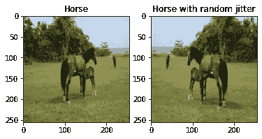

```py
plt.subplot(121)
plt.title('Zebra')
plt.imshow(sample_zebra[0] * 0.5 + 0.5)

plt.subplot(122)
plt.title('Zebra with random jitter')
plt.imshow(random_jitter(sample_zebra[0]) * 0.5 + 0.5) 
```

```py
<matplotlib.image.AxesImage at 0x7f5a101663c8>

```

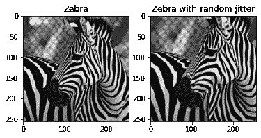

## 导入并重用 Pix2Pix 模型

通过安装的 [tensorflow_examples](https://github.com/tensorflow/examples) 包导入 [Pix2Pix](https://github.com/tensorflow/examples/blob/master/tensorflow_examples/models/pix2pix/pix2pix.py) 中的生成器和判别器。

本教程中使用模型体系结构与 [pix2pix](https://github.com/tensorflow/examples/blob/master/tensorflow_examples/models/pix2pix/pix2pix.py) 中所使用的非常相似。一些区别在于：

*   Cyclegan 使用 [instance normalization（实例归一化）](https://arxiv.org/abs/1607.08022)而不是 [batch normalization （批归一化）](https://arxiv.org/abs/1502.03167)。
*   [CycleGAN 论文](https://arxiv.org/abs/1703.10593)使用一种基于 `resnet` 的改进生成器。简单起见，本教程使用的是改进的 `unet` 生成器。

这里训练了两个生成器（G 和 F）以及两个判别器（X 和 Y）。

*   生成器 `G` 学习将图片 `X` 转换为 `Y`。 $(G: X -> Y)$
*   生成器 `F` 学习将图片 `Y` 转换为 `X`。 $(F: Y -> X)$
*   判别器 `D_X` 学习区分图片 `X` 与生成的图片 `X` (`F(Y)`)。
*   判别器 `D_Y` 学习区分图片 `Y` 与生成的图片 `Y` (`G(X)`)。

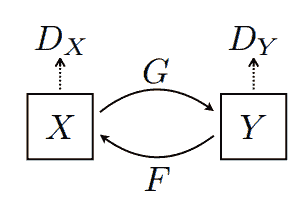

```py
OUTPUT_CHANNELS = 3

generator_g = pix2pix.unet_generator(OUTPUT_CHANNELS, norm_type='instancenorm')
generator_f = pix2pix.unet_generator(OUTPUT_CHANNELS, norm_type='instancenorm')

discriminator_x = pix2pix.discriminator(norm_type='instancenorm', target=False)
discriminator_y = pix2pix.discriminator(norm_type='instancenorm', target=False) 
```

```py
to_zebra = generator_g(sample_horse)
to_horse = generator_f(sample_zebra)
plt.figure(figsize=(8, 8))
contrast = 8

imgs = [sample_horse, to_zebra, sample_zebra, to_horse]
title = ['Horse', 'To Zebra', 'Zebra', 'To Horse']

for i in range(len(imgs)):
  plt.subplot(2, 2, i+1)
  plt.title(title[i])
  if i % 2 == 0:
    plt.imshow(imgs[i][0] * 0.5 + 0.5)
  else:
    plt.imshow(imgs[i][0] * 0.5 * contrast + 0.5)
plt.show() 
```

```py
WARNING:matplotlib.image:Clipping input data to the valid range for imshow with RGB data ([0..1] for floats or [0..255] for integers).
WARNING:matplotlib.image:Clipping input data to the valid range for imshow with RGB data ([0..1] for floats or [0..255] for integers).

```

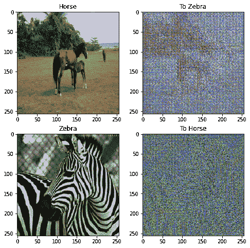

```py
plt.figure(figsize=(8, 8))

plt.subplot(121)
plt.title('Is a real zebra?')
plt.imshow(discriminator_y(sample_zebra)[0, ..., -1], cmap='RdBu_r')

plt.subplot(122)
plt.title('Is a real horse?')
plt.imshow(discriminator_x(sample_horse)[0, ..., -1], cmap='RdBu_r')

plt.show() 
```

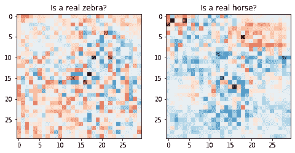

## 损失函数

在 CycleGAN 中，没有可训练的成对数据，因此无法保证输入 `x` 和 目标 `y` 数据对在训练期间是有意义的。所以为了强制网络学习正确的映射，作者提出了循环一致损失。

判别器损失和生成器损失和 [pix2pix](https://google.tensorflow.cn/tutorials/generative/pix2pix#define_the_loss_functions_and_the_optimizer) 中所使用的类似。

```py
LAMBDA = 10 
```

```py
loss_obj = tf.keras.losses.BinaryCrossentropy(from_logits=True) 
```

```py
def discriminator_loss(real, generated):
  real_loss = loss_obj(tf.ones_like(real), real)

  generated_loss = loss_obj(tf.zeros_like(generated), generated)

  total_disc_loss = real_loss + generated_loss

  return total_disc_loss * 0.5 
```

```py
def generator_loss(generated):
  return loss_obj(tf.ones_like(generated), generated) 
```

循环一致意味着结果应接近原始输出。例如，将一句英文译为法文，随后再从法文翻译回英文，最终的结果句应与原始句输入相同。

在循环一致损失中，

*   图片 $X$ 通过生成器 $G$ 传递，该生成器生成图片 $\hat{Y}$。
*   生成的图片 $\hat{Y}$ 通过生成器 $F$ 传递，循环生成图片 $\hat{X}$。
*   在 $X$ 和 $\hat{X}$ 之间计算平均绝对误差。

$$forward\ cycle\ consistency\ loss: X -> G(X) -> F(G(X)) \sim \hat{X}$$$$backward\ cycle\ consistency\ loss: Y -> F(Y) -> G(F(Y)) \sim \hat{Y}$$

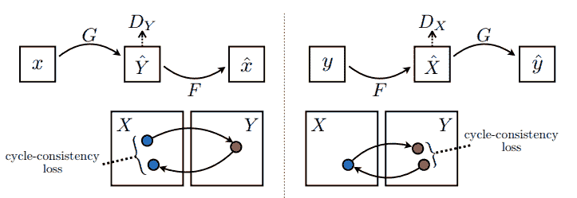

```py
def calc_cycle_loss(real_image, cycled_image):
  loss1 = tf.reduce_mean(tf.abs(real_image - cycled_image))

  return LAMBDA * loss1 
```

如上所示，生成器 $G$ 负责将图片 $X$ 转换为 $Y$。一致性损失表明，如果您将图片 $Y$ 馈送给生成器 $G$，它应当生成真实图片 $Y$ 或接近于 $Y$ 的图片。

$$Identity\ loss = |G(Y) - Y| + |F(X) - X|$$

```py
def identity_loss(real_image, same_image):
  loss = tf.reduce_mean(tf.abs(real_image - same_image))
  return LAMBDA * 0.5 * loss 
```

为所有生成器和判别器初始化优化器。

```py
generator_g_optimizer = tf.keras.optimizers.Adam(2e-4, beta_1=0.5)
generator_f_optimizer = tf.keras.optimizers.Adam(2e-4, beta_1=0.5)

discriminator_x_optimizer = tf.keras.optimizers.Adam(2e-4, beta_1=0.5)
discriminator_y_optimizer = tf.keras.optimizers.Adam(2e-4, beta_1=0.5) 
```

## Checkpoints

```py
checkpoint_path = "./checkpoints/train"

ckpt = tf.train.Checkpoint(generator_g=generator_g,
                           generator_f=generator_f,
                           discriminator_x=discriminator_x,
                           discriminator_y=discriminator_y,
                           generator_g_optimizer=generator_g_optimizer,
                           generator_f_optimizer=generator_f_optimizer,
                           discriminator_x_optimizer=discriminator_x_optimizer,
                           discriminator_y_optimizer=discriminator_y_optimizer)

ckpt_manager = tf.train.CheckpointManager(ckpt, checkpoint_path, max_to_keep=5)

# 如果存在检查点，恢复最新版本检查点
if ckpt_manager.latest_checkpoint:
  ckpt.restore(ckpt_manager.latest_checkpoint)
  print ('Latest checkpoint restored!!') 
```

## 训练

注意：本示例模型比论文中训练了更少的 epoch（本示例为 40 epoch，论文中为 200 epoch），以使训练时间相对于本教程是合理的。预测的准确率可能会低一些。

```py
EPOCHS = 40 
```

```py
def generate_images(model, test_input):
  prediction = model(test_input)

  plt.figure(figsize=(12, 12))

  display_list = [test_input[0], prediction[0]]
  title = ['Input Image', 'Predicted Image']

  for i in range(2):
    plt.subplot(1, 2, i+1)
    plt.title(title[i])
    # 获取范围在 [0, 1] 之间的像素值以绘制它。
    plt.imshow(display_list[i] * 0.5 + 0.5)
    plt.axis('off')
  plt.show() 
```

尽管训练循环看起来很复杂，其实包含四个基本步骤：

*   获取预测。
*   计算损失值。
*   使用反向传播计算损失值。
*   将梯度应用于优化器。

```py
@tf.function
def train_step(real_x, real_y):
  # persistent 设置为 Ture，因为 GradientTape 被多次应用于计算梯度。
  with tf.GradientTape(persistent=True) as tape:
    # 生成器 G 转换 X -> Y。
    # 生成器 F 转换 Y -> X。

    fake_y = generator_g(real_x, training=True)
    cycled_x = generator_f(fake_y, training=True)

    fake_x = generator_f(real_y, training=True)
    cycled_y = generator_g(fake_x, training=True)

    # same_x 和 same_y 用于一致性损失。
    same_x = generator_f(real_x, training=True)
    same_y = generator_g(real_y, training=True)

    disc_real_x = discriminator_x(real_x, training=True)
    disc_real_y = discriminator_y(real_y, training=True)

    disc_fake_x = discriminator_x(fake_x, training=True)
    disc_fake_y = discriminator_y(fake_y, training=True)

    # 计算损失。
    gen_g_loss = generator_loss(disc_fake_y)
    gen_f_loss = generator_loss(disc_fake_x)

    total_cycle_loss = calc_cycle_loss(real_x, cycled_x) + calc_cycle_loss(real_y, cycled_y)

    # 总生成器损失 = 对抗性损失 + 循环损失。
    total_gen_g_loss = gen_g_loss + total_cycle_loss + identity_loss(real_y, same_y)
    total_gen_f_loss = gen_f_loss + total_cycle_loss + identity_loss(real_x, same_x)

    disc_x_loss = discriminator_loss(disc_real_x, disc_fake_x)
    disc_y_loss = discriminator_loss(disc_real_y, disc_fake_y)

  # 计算生成器和判别器损失。
  generator_g_gradients = tape.gradient(total_gen_g_loss, 
                                        generator_g.trainable_variables)
  generator_f_gradients = tape.gradient(total_gen_f_loss, 
                                        generator_f.trainable_variables)

  discriminator_x_gradients = tape.gradient(disc_x_loss, 
                                            discriminator_x.trainable_variables)
  discriminator_y_gradients = tape.gradient(disc_y_loss, 
                                            discriminator_y.trainable_variables)

  # 将梯度应用于优化器。
  generator_g_optimizer.apply_gradients(zip(generator_g_gradients, 
                                            generator_g.trainable_variables))

  generator_f_optimizer.apply_gradients(zip(generator_f_gradients, 
                                            generator_f.trainable_variables))

  discriminator_x_optimizer.apply_gradients(zip(discriminator_x_gradients,
                                                discriminator_x.trainable_variables))

  discriminator_y_optimizer.apply_gradients(zip(discriminator_y_gradients,
                                                discriminator_y.trainable_variables)) 
```

```py
for epoch in range(EPOCHS):
  start = time.time()

  n = 0
  for image_x, image_y in tf.data.Dataset.zip((train_horses, train_zebras)):
    train_step(image_x, image_y)
    if n % 10 == 0:
      print ('.', end='')
    n+=1

  clear_output(wait=True)
  # 使用一致的图像（sample_horse），以便模型的进度清晰可见。
  generate_images(generator_g, sample_horse)

  if (epoch + 1) % 5 == 0:
    ckpt_save_path = ckpt_manager.save()
    print ('Saving checkpoint for epoch {} at {}'.format(epoch+1,
                                                         ckpt_save_path))

  print ('Time taken for epoch {} is {} sec\n'.format(epoch + 1,
                                                      time.time()-start)) 
```

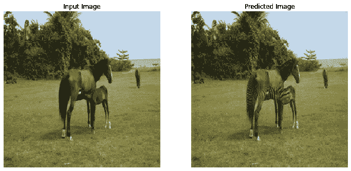

```py
Saving checkpoint for epoch 40 at ./checkpoints/train/ckpt-8
Time taken for epoch 40 is 175.41231870651245 sec

```

## 使用测试数据集进行生成

```py
# 在测试数据集上运行训练的模型。
for inp in test_horses.take(5):
  generate_images(generator_g, inp) 
```


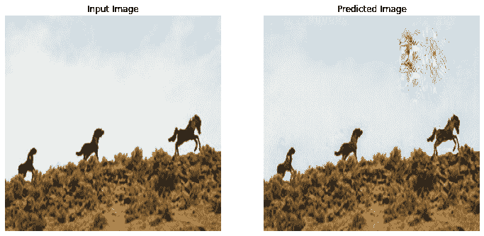

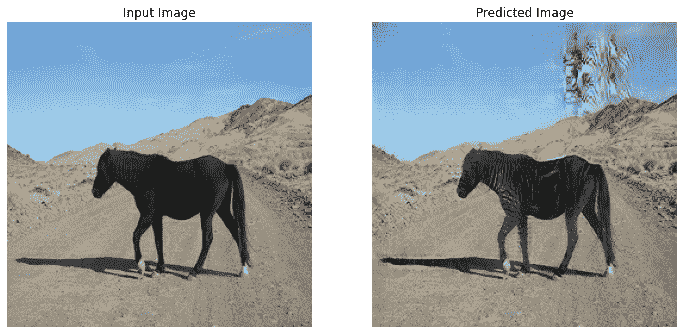

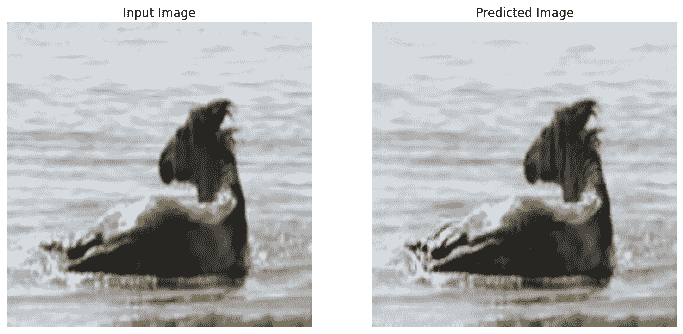

## 下一步

本教程展示了如何从 [Pix2Pix](https://tensorflow.google.cn/tutorials/generative/pix2pix) 教程实现的生成器和判别器开始实现 CycleGAN。 下一步，您可以尝试使用一个来源于 [TensorFlow 数据集](https://tensorflow.google.cn/datasets/datasets#cycle_gan)的不同的数据集。

您也可以训练更多的 epoch 以改进结果，或者可以实现[论文](https://arxiv.org/abs/1703.10593)中所使用的改进 ResNet 生成器来代替这里使用的 U-Net 生成器。