# Intro to Autoencoders

> 原文：[https://tensorflow.google.cn/tutorials/generative/autoencoder](https://tensorflow.google.cn/tutorials/generative/autoencoder)

This tutorial introduces autoencoders with three examples: the basics, image denoising, and anomaly detection.

An autoencoder is a special type of neural network that is trained to copy its input to its output. For example, given an image of a handwritten digit, an autoencoder first encodes the image into a lower dimensional latent representation, then decodes the latent representation back to an image. An autoencoder learns to compress the data while minimizing the reconstruction error.

To learn more about autoencoders, please consider reading chapter 14 from [Deep Learning](https://www.deeplearningbook.org/) by Ian Goodfellow, Yoshua Bengio, and Aaron Courville.

## Import TensorFlow and other libraries

```py
import matplotlib.pyplot as plt
import numpy as np
import pandas as pd
import tensorflow as tf

from sklearn.metrics import accuracy_score, precision_score, recall_score
from sklearn.model_selection import train_test_split
from tensorflow.keras import layers, losses
from tensorflow.keras.datasets import fashion_mnist
from tensorflow.keras.models import Model 
```

## Load the dataset

To start, you will train the basic autoencoder using the Fashon MNIST dataset. Each image in this dataset is 28x28 pixels.

```py
(x_train, _), (x_test, _) = fashion_mnist.load_data()

x_train = x_train.astype('float32') / 255.
x_test = x_test.astype('float32') / 255.

print (x_train.shape)
print (x_test.shape) 
```

```py
Downloading data from https://storage.googleapis.com/tensorflow/tf-keras-datasets/train-labels-idx1-ubyte.gz
32768/29515 [=================================] - 0s 0us/step
Downloading data from https://storage.googleapis.com/tensorflow/tf-keras-datasets/train-images-idx3-ubyte.gz
26427392/26421880 [==============================] - 0s 0us/step
Downloading data from https://storage.googleapis.com/tensorflow/tf-keras-datasets/t10k-labels-idx1-ubyte.gz
8192/5148 [===============================================] - 0s 0us/step
Downloading data from https://storage.googleapis.com/tensorflow/tf-keras-datasets/t10k-images-idx3-ubyte.gz
4423680/4422102 [==============================] - 0s 0us/step
(60000, 28, 28)
(10000, 28, 28)

```

## First example: Basic autoencoder

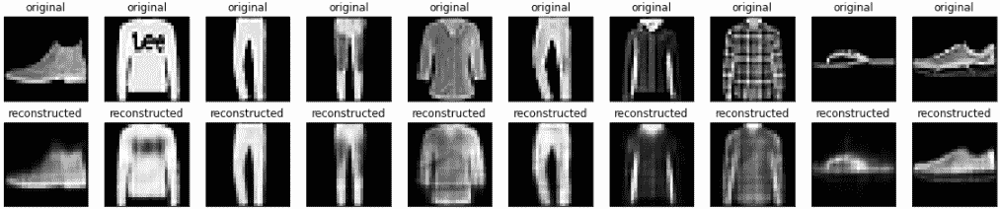

Define an autoencoder with two Dense layers: an `encoder`, which compresses the images into a 64 dimensional latent vector, and a `decoder`, that reconstructs the original image from the latent space.

To define your model, use the [Keras Model Subclassing API](https://tensorflow.google.cn/guide/keras/custom_layers_and_models).

```py
latent_dim = 64 

class Autoencoder(Model):
  def __init__(self, latent_dim):
    super(Autoencoder, self).__init__()
    self.latent_dim = latent_dim   
    self.encoder = tf.keras.Sequential([
      layers.Flatten(),
      layers.Dense(latent_dim, activation='relu'),
    ])
    self.decoder = tf.keras.Sequential([
      layers.Dense(784, activation='sigmoid'),
      layers.Reshape((28, 28))
    ])

  def call(self, x):
    encoded = self.encoder(x)
    decoded = self.decoder(encoded)
    return decoded

autoencoder = Autoencoder(latent_dim) 
```

```py
autoencoder.compile(optimizer='adam', loss=losses.MeanSquaredError()) 
```

Train the model using `x_train` as both the input and the target. The `encoder` will learn to compress the dataset from 784 dimensions to the latent space, and the `decoder` will learn to reconstruct the original images. .

```py
autoencoder.fit(x_train, x_train,
                epochs=10,
                shuffle=True,
                validation_data=(x_test, x_test)) 
```

```py
Epoch 1/10
1875/1875 [==============================] - 3s 2ms/step - loss: 0.0239 - val_loss: 0.0132
Epoch 2/10
1875/1875 [==============================] - 3s 2ms/step - loss: 0.0116 - val_loss: 0.0105
Epoch 3/10
1875/1875 [==============================] - 3s 2ms/step - loss: 0.0100 - val_loss: 0.0097
Epoch 4/10
1875/1875 [==============================] - 3s 2ms/step - loss: 0.0095 - val_loss: 0.0094
Epoch 5/10
1875/1875 [==============================] - 3s 2ms/step - loss: 0.0092 - val_loss: 0.0092
Epoch 6/10
1875/1875 [==============================] - 3s 2ms/step - loss: 0.0090 - val_loss: 0.0091
Epoch 7/10
1875/1875 [==============================] - 3s 2ms/step - loss: 0.0090 - val_loss: 0.0090
Epoch 8/10
1875/1875 [==============================] - 3s 2ms/step - loss: 0.0089 - val_loss: 0.0090
Epoch 9/10
1875/1875 [==============================] - 3s 2ms/step - loss: 0.0088 - val_loss: 0.0090
Epoch 10/10
1875/1875 [==============================] - 3s 2ms/step - loss: 0.0088 - val_loss: 0.0088

<tensorflow.python.keras.callbacks.History at 0x7f220fe53fd0>

```

Now that the model is trained, let's test it by encoding and decoding images from the test set.

```py
encoded_imgs = autoencoder.encoder(x_test).numpy()
decoded_imgs = autoencoder.decoder(encoded_imgs).numpy() 
```

```py
n = 10
plt.figure(figsize=(20, 4))
for i in range(n):
  # display original
  ax = plt.subplot(2, n, i + 1)
  plt.imshow(x_test[i])
  plt.title("original")
  plt.gray()
  ax.get_xaxis().set_visible(False)
  ax.get_yaxis().set_visible(False)

  # display reconstruction
  ax = plt.subplot(2, n, i + 1 + n)
  plt.imshow(decoded_imgs[i])
  plt.title("reconstructed")
  plt.gray()
  ax.get_xaxis().set_visible(False)
  ax.get_yaxis().set_visible(False)
plt.show() 
```

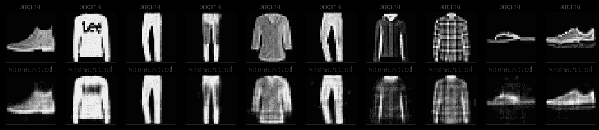

## Second example: Image denoising

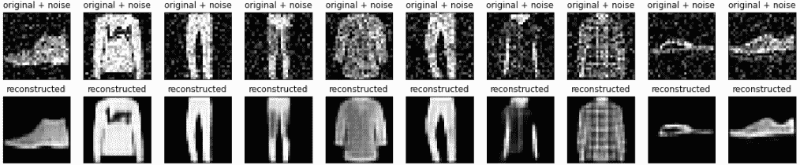

An autoencoder can also be trained to remove noise from images. In the following section, you will create a noisy version of the Fashion MNIST dataset by applying random noise to each image. You will then train an autoencoder using the noisy image as input, and the original image as the target.

Let's reimport the dataset to omit the modifications made earlier.

```py
(x_train, _), (x_test, _) = fashion_mnist.load_data() 
```

```py
x_train = x_train.astype('float32') / 255.
x_test = x_test.astype('float32') / 255.

x_train = x_train[..., tf.newaxis]
x_test = x_test[..., tf.newaxis]

print(x_train.shape) 
```

```py
(60000, 28, 28, 1)

```

Adding random noise to the images

```py
noise_factor = 0.2
x_train_noisy = x_train + noise_factor * tf.random.normal(shape=x_train.shape) 
x_test_noisy = x_test + noise_factor * tf.random.normal(shape=x_test.shape) 

x_train_noisy = tf.clip_by_value(x_train_noisy, clip_value_min=0., clip_value_max=1.)
x_test_noisy = tf.clip_by_value(x_test_noisy, clip_value_min=0., clip_value_max=1.) 
```

Plot the noisy images.

```py
n = 10
plt.figure(figsize=(20, 2))
for i in range(n):
    ax = plt.subplot(1, n, i + 1)
    plt.title("original + noise")
    plt.imshow(tf.squeeze(x_test_noisy[i]))
    plt.gray()
plt.show() 
```

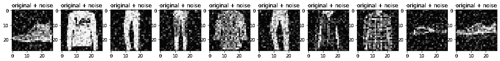

### Define a convolutional autoencoder

In this example, you will train a convolutional autoencoder using [Conv2D](https://tensorflow.google.cn/api_docs/python/tf/keras/layers/Conv2D) layers in the `encoder`, and [Conv2DTranspose](https://tensorflow.google.cn/api_docs/python/tf/keras/layers/Conv2DTranspose) layers in the `decoder`.

```py
class Denoise(Model):
  def __init__(self):
    super(Denoise, self).__init__()
    self.encoder = tf.keras.Sequential([
      layers.Input(shape=(28, 28, 1)), 
      layers.Conv2D(16, (3,3), activation='relu', padding='same', strides=2),
      layers.Conv2D(8, (3,3), activation='relu', padding='same', strides=2)])

    self.decoder = tf.keras.Sequential([
      layers.Conv2DTranspose(8, kernel_size=3, strides=2, activation='relu', padding='same'),
      layers.Conv2DTranspose(16, kernel_size=3, strides=2, activation='relu', padding='same'),
      layers.Conv2D(1, kernel_size=(3,3), activation='sigmoid', padding='same')])

  def call(self, x):
    encoded = self.encoder(x)
    decoded = self.decoder(encoded)
    return decoded

autoencoder = Denoise() 
```

```py
autoencoder.compile(optimizer='adam', loss=losses.MeanSquaredError()) 
```

```py
autoencoder.fit(x_train_noisy, x_train,
                epochs=10,
                shuffle=True,
                validation_data=(x_test_noisy, x_test)) 
```

```py
Epoch 1/10
1875/1875 [==============================] - 26s 14ms/step - loss: 0.0182 - val_loss: 0.0112
Epoch 2/10
1875/1875 [==============================] - 25s 14ms/step - loss: 0.0100 - val_loss: 0.0093
Epoch 3/10
1875/1875 [==============================] - 25s 13ms/step - loss: 0.0089 - val_loss: 0.0087
Epoch 4/10
1875/1875 [==============================] - 26s 14ms/step - loss: 0.0085 - val_loss: 0.0084
Epoch 5/10
1875/1875 [==============================] - 25s 14ms/step - loss: 0.0083 - val_loss: 0.0083
Epoch 6/10
1875/1875 [==============================] - 26s 14ms/step - loss: 0.0082 - val_loss: 0.0082
Epoch 7/10
1875/1875 [==============================] - 25s 13ms/step - loss: 0.0081 - val_loss: 0.0081
Epoch 8/10
1875/1875 [==============================] - 25s 13ms/step - loss: 0.0081 - val_loss: 0.0080
Epoch 9/10
1875/1875 [==============================] - 25s 13ms/step - loss: 0.0080 - val_loss: 0.0080
Epoch 10/10
1875/1875 [==============================] - 25s 14ms/step - loss: 0.0079 - val_loss: 0.0080

<tensorflow.python.keras.callbacks.History at 0x7f22122b45c0>

```

Let's take a look at a summary of the encoder. Notice how the images are downsampled from 28x28 to 7x7.

```py
autoencoder.encoder.summary() 
```

```py
Model: "sequential_2"
_________________________________________________________________
Layer (type)                 Output Shape              Param #   
=================================================================
conv2d (Conv2D)              (None, 14, 14, 16)        160       
_________________________________________________________________
conv2d_1 (Conv2D)            (None, 7, 7, 8)           1160      
=================================================================
Total params: 1,320
Trainable params: 1,320
Non-trainable params: 0
_________________________________________________________________

```

The decoder upsamples the images back from 7x7 to 28x28.

```py
autoencoder.decoder.summary() 
```

```py
Model: "sequential_3"
_________________________________________________________________
Layer (type)                 Output Shape              Param #   
=================================================================
conv2d_transpose (Conv2DTran (None, 14, 14, 8)         584       
_________________________________________________________________
conv2d_transpose_1 (Conv2DTr (None, 28, 28, 16)        1168      
_________________________________________________________________
conv2d_2 (Conv2D)            (None, 28, 28, 1)         145       
=================================================================
Total params: 1,897
Trainable params: 1,897
Non-trainable params: 0
_________________________________________________________________

```

Plotting both the noisy images and the denoised images produced by the autoencoder.

```py
encoded_imgs = autoencoder.encoder(x_test).numpy()
decoded_imgs = autoencoder.decoder(encoded_imgs).numpy() 
```

```py
n = 10
plt.figure(figsize=(20, 4))
for i in range(n):

    # display original + noise
    ax = plt.subplot(2, n, i + 1)
    plt.title("original + noise")
    plt.imshow(tf.squeeze(x_test_noisy[i]))
    plt.gray()
    ax.get_xaxis().set_visible(False)
    ax.get_yaxis().set_visible(False)

    # display reconstruction
    bx = plt.subplot(2, n, i + n + 1)
    plt.title("reconstructed")
    plt.imshow(tf.squeeze(decoded_imgs[i]))
    plt.gray()
    bx.get_xaxis().set_visible(False)
    bx.get_yaxis().set_visible(False)
plt.show() 
```

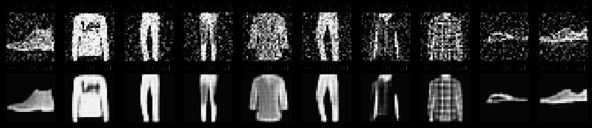

## Third example: Anomaly detection

## Overview

In this example, you will train an autoencoder to detect anomalies on the [ECG5000 dataset](http://www.timeseriesclassification.com/description.php?Dataset=ECG5000). This dataset contains 5,000 [Electrocardiograms](https://en.wikipedia.org/wiki/Electrocardiography), each with 140 data points. You will use a simplified version of the dataset, where each example has been labeled either `0` (corresponding to an abnormal rhythm), or `1` (corresponding to a normal rhythm). You are interested in identifying the abnormal rhythms.

**Note:** This is a labeled dataset, so you could phrase this as a supervised learning problem. The goal of this example is to illustrate anomaly detection concepts you can apply to larger datasets, where you do not have labels available (for example, if you had many thousands of normal rhythms, and only a small number of abnormal rhythms).

How will you detect anomalies using an autoencoder? Recall that an autoencoder is trained to minimize reconstruction error. You will train an autoencoder on the normal rhythms only, then use it to reconstruct all the data. Our hypothesis is that the abnormal rhythms will have higher reconstruction error. You will then classify a rhythm as an anomaly if the reconstruction error surpasses a fixed threshold.

### Load ECG data

The dataset you will use is based on one from [timeseriesclassification.com](http://www.timeseriesclassification.com/description.php?Dataset=ECG5000).

```py
# Download the dataset
dataframe = pd.read_csv('http://storage.googleapis.com/download.tensorflow.org/data/ecg.csv', header=None)
raw_data = dataframe.values
dataframe.head() 
```

<devsite-iframe><iframe src="/tutorials/generative/autoencoder_d1e264d3aef03a2f0ce0c60938dad7e5c8bc047c81aeacdbf265389b3baf6cfe.frame" class="framebox inherit-locale " allowfullscreen="" is-upgraded=""></iframe></devsite-iframe>

```py
# The last element contains the labels
labels = raw_data[:, -1]

# The other data points are the electrocadriogram data
data = raw_data[:, 0:-1]

train_data, test_data, train_labels, test_labels = train_test_split(
    data, labels, test_size=0.2, random_state=21
) 
```

Normalize the data to `[0,1]`.

```py
min_val = tf.reduce_min(train_data)
max_val = tf.reduce_max(train_data)

train_data = (train_data - min_val) / (max_val - min_val)
test_data = (test_data - min_val) / (max_val - min_val)

train_data = tf.cast(train_data, tf.float32)
test_data = tf.cast(test_data, tf.float32) 
```

You will train the autoencoder using only the normal rhythms, which are labeled in this dataset as `1`. Separate the normal rhythms from the abnormal rhythms.

```py
train_labels = train_labels.astype(bool)
test_labels = test_labels.astype(bool)

normal_train_data = train_data[train_labels]
normal_test_data = test_data[test_labels]

anomalous_train_data = train_data[~train_labels]
anomalous_test_data = test_data[~test_labels] 
```

Plot a normal ECG.

```py
plt.grid()
plt.plot(np.arange(140), normal_train_data[0])
plt.title("A Normal ECG")
plt.show() 
```

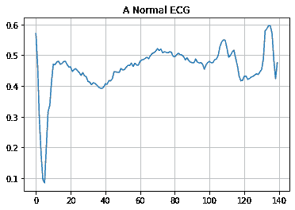

Plot an anomalous ECG.

```py
plt.grid()
plt.plot(np.arange(140), anomalous_train_data[0])
plt.title("An Anomalous ECG")
plt.show() 
```

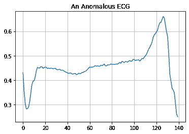

### Build the model

```py
class AnomalyDetector(Model):
  def __init__(self):
    super(AnomalyDetector, self).__init__()
    self.encoder = tf.keras.Sequential([
      layers.Dense(32, activation="relu"),
      layers.Dense(16, activation="relu"),
      layers.Dense(8, activation="relu")])

    self.decoder = tf.keras.Sequential([
      layers.Dense(16, activation="relu"),
      layers.Dense(32, activation="relu"),
      layers.Dense(140, activation="sigmoid")])

  def call(self, x):
    encoded = self.encoder(x)
    decoded = self.decoder(encoded)
    return decoded

autoencoder = AnomalyDetector() 
```

```py
autoencoder.compile(optimizer='adam', loss='mae') 
```

Notice that the autoencoder is trained using only the normal ECGs, but is evaluated using the full test set.

```py
history = autoencoder.fit(normal_train_data, normal_train_data, 
          epochs=20, 
          batch_size=512,
          validation_data=(test_data, test_data),
          shuffle=True) 
```

```py
Epoch 1/20
5/5 [==============================] - 0s 20ms/step - loss: 0.0582 - val_loss: 0.0534
Epoch 2/20
5/5 [==============================] - 0s 5ms/step - loss: 0.0564 - val_loss: 0.0519
Epoch 3/20
5/5 [==============================] - 0s 5ms/step - loss: 0.0540 - val_loss: 0.0508
Epoch 4/20
5/5 [==============================] - 0s 5ms/step - loss: 0.0514 - val_loss: 0.0491
Epoch 5/20
5/5 [==============================] - 0s 5ms/step - loss: 0.0482 - val_loss: 0.0467
Epoch 6/20
5/5 [==============================] - 0s 5ms/step - loss: 0.0448 - val_loss: 0.0449
Epoch 7/20
5/5 [==============================] - 0s 5ms/step - loss: 0.0414 - val_loss: 0.0429
Epoch 8/20
5/5 [==============================] - 0s 5ms/step - loss: 0.0380 - val_loss: 0.0413
Epoch 9/20
5/5 [==============================] - 0s 5ms/step - loss: 0.0345 - val_loss: 0.0400
Epoch 10/20
5/5 [==============================] - 0s 5ms/step - loss: 0.0316 - val_loss: 0.0390
Epoch 11/20
5/5 [==============================] - 0s 5ms/step - loss: 0.0293 - val_loss: 0.0382
Epoch 12/20
5/5 [==============================] - 0s 5ms/step - loss: 0.0276 - val_loss: 0.0379
Epoch 13/20
5/5 [==============================] - 0s 5ms/step - loss: 0.0262 - val_loss: 0.0370
Epoch 14/20
5/5 [==============================] - 0s 5ms/step - loss: 0.0251 - val_loss: 0.0366
Epoch 15/20
5/5 [==============================] - 0s 5ms/step - loss: 0.0244 - val_loss: 0.0359
Epoch 16/20
5/5 [==============================] - 0s 5ms/step - loss: 0.0237 - val_loss: 0.0355
Epoch 17/20
5/5 [==============================] - 0s 5ms/step - loss: 0.0231 - val_loss: 0.0352
Epoch 18/20
5/5 [==============================] - 0s 5ms/step - loss: 0.0225 - val_loss: 0.0345
Epoch 19/20
5/5 [==============================] - 0s 5ms/step - loss: 0.0219 - val_loss: 0.0343
Epoch 20/20
5/5 [==============================] - 0s 5ms/step - loss: 0.0214 - val_loss: 0.0341

```

```py
plt.plot(history.history["loss"], label="Training Loss")
plt.plot(history.history["val_loss"], label="Validation Loss")
plt.legend() 
```

```py
<matplotlib.legend.Legend at 0x7f21d014f438>

```

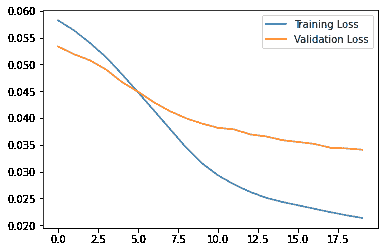

You will soon classify an ECG as anomalous if the reconstruction error is greater than one standard deviation from the normal training examples. First, let's plot a normal ECG from the training set, the reconstruction after it's encoded and decoded by the autoencoder, and the reconstruction error.

```py
encoded_imgs = autoencoder.encoder(normal_test_data).numpy()
decoded_imgs = autoencoder.decoder(encoded_imgs).numpy()

plt.plot(normal_test_data[0],'b')
plt.plot(decoded_imgs[0],'r')
plt.fill_between(np.arange(140), decoded_imgs[0], normal_test_data[0], color='lightcoral' )
plt.legend(labels=["Input", "Reconstruction", "Error"])
plt.show() 
```

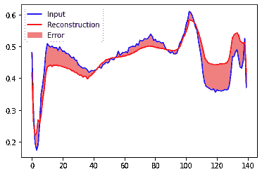

Create a similar plot, this time for an anomalous test example.

```py
encoded_imgs = autoencoder.encoder(anomalous_test_data).numpy()
decoded_imgs = autoencoder.decoder(encoded_imgs).numpy()

plt.plot(anomalous_test_data[0],'b')
plt.plot(decoded_imgs[0],'r')
plt.fill_between(np.arange(140), decoded_imgs[0], anomalous_test_data[0], color='lightcoral' )
plt.legend(labels=["Input", "Reconstruction", "Error"])
plt.show() 
```

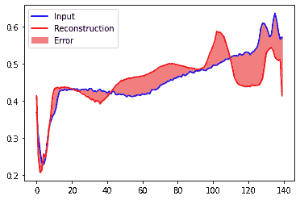

### Detect anomalies

Detect anomalies by calculating whether the reconstruction loss is greater than a fixed threshold. In this tutorial, you will calculate the mean average error for normal examples from the training set, then classify future examples as anomalous if the reconstruction error is higher than one standard deviation from the training set.

Plot the reconstruction error on normal ECGs from the training set

```py
reconstructions = autoencoder.predict(normal_train_data)
train_loss = tf.keras.losses.mae(reconstructions, normal_train_data)

plt.hist(train_loss, bins=50)
plt.xlabel("Train loss")
plt.ylabel("No of examples")
plt.show() 
```

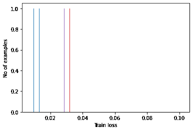

Choose a threshold value that is one standard deviations above the mean.

```py
threshold = np.mean(train_loss) + np.std(train_loss)
print("Threshold: ", threshold) 
```

```py
Threshold:  0.033377893

```

**Note:** There are other strategies you could use to select a threshold value above which test examples should be classified as anomalous, the correct approach will depend on your dataset. You can learn more with the links at the end of this tutorial.

If you examine the recontruction error for the anomalous examples in the test set, you'll notice most have greater reconstruction error than the threshold. By varing the threshold, you can adjust the [precision](https://developers.google.cn/machine-learning/glossary#precision) and [recall](https://developers.google.cn/machine-learning/glossary#recall) of your classifier.

```py
reconstructions = autoencoder.predict(anomalous_test_data)
test_loss = tf.keras.losses.mae(reconstructions, anomalous_test_data)

plt.hist(test_loss, bins=50)
plt.xlabel("Test loss")
plt.ylabel("No of examples")
plt.show() 
```

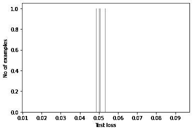

Classify an ECG as an anomaly if the reconstruction error is greater than the threshold.

```py
def predict(model, data, threshold):
  reconstructions = model(data)
  loss = tf.keras.losses.mae(reconstructions, data)
  return tf.math.less(loss, threshold)

def print_stats(predictions, labels):
  print("Accuracy = {}".format(accuracy_score(labels, preds)))
  print("Precision = {}".format(precision_score(labels, preds)))
  print("Recall = {}".format(recall_score(labels, preds))) 
```

```py
preds = predict(autoencoder, test_data, threshold)
print_stats(preds, test_labels) 
```

```py
Accuracy = 0.944
Precision = 0.9921875
Recall = 0.9071428571428571

```

## Next steps

To learn more about anomaly detection with autoencoders, check out this excellent [interactive example](https://anomagram.fastforwardlabs.com/#/) built with TensorFlow.js by Victor Dibia. For a real-world use case, you can learn how [Airbus Detects Anomalies in ISS Telemetry Data](https://blog.tensorflow.org/2020/04/how-airbus-detects-anomalies-iss-telemetry-data-tfx.html) using TensorFlow. To learn more about the basics, consider reading this [blog post](https://blog.keras.io/building-autoencoders-in-keras.html) by François Chollet. For more details, check out chapter 14 from [Deep Learning](https://www.deeplearningbook.org/) by Ian Goodfellow, Yoshua Bengio, and Aaron Courville.