# 二、训练深度神经网络

> 译者：[@SeanCheney](https://www.jianshu.com/u/130f76596b02)


第 10 章介绍了人工神经网络，并训练了第一个深度神经网络。 但它非常浅，只有两个隐藏层。 如果你需要解决非常复杂的问题，例如检测高分辨率图像中的数百种类型的对象，该怎么办？ 你可能需要训练更深的 DNN，也许有 10 层或更多，每层包含数百个神经元，通过数十万个连接相连。 这可不像公园散步那么简单，可能碰到下面这些问题：

*   你将面临棘手的梯度消失问题（或相关的梯度爆炸问题）：在反向传播过程中，梯度变得越来越小或越来越大。二者都会使较浅层难以训练；
*   要训练一个庞大的神经网络，但是数据量不足，或者标注成本很高；
*   训练可能非常慢；
*   具有数百万参数的模型将会有严重的过拟合训练集的风险，特别是在训练实例不多或存在噪音时。

在本章中，我们将依次讨论这些问题，并给出解决问题的方法。 我们将从梯度消失/爆炸问题开始，并探讨解决这个问题的一些最流行的解决方案。 接下来会介绍迁移学习和无监督预训练，这可以在即使标注数据不多的情况下，也能应对复杂问题。然后我们将看看各种优化器，可以加速大型模型的训练。 最后，我们将浏览一些流行的大型神经网络正则化方法。

使用这些工具，你将能够训练非常深的网络：欢迎来到深度学习的世界！

## 梯度消失/爆炸问题

正如我们在第 10 章中所讨论的那样，反向传播算法的工作原理是从输出层到输入层，传播误差的梯度。 一旦该算法已经计算了网络中每个参数的损失函数的梯度，它就通过梯度下降使用这些梯度来更新每个参数。

不幸的是，随着算法进展到较低层，梯度往往变得越来越小。 结果，梯度下降更新使得低层连接权重实际上保持不变，并且训练永远不会收敛到最优解。 这被称为梯度消失问题。 在某些情况下，可能会发生相反的情况：梯度可能变得越来越大，许多层得到了非常大的权重更新，算法发散。这是梯度爆炸的问题，在循环神经网络中最为常见（见第 145 章）。 更一般地说，深度神经网络面临梯度不稳定; 不同的层可能有非常不同的学习率。

虽然很早就观察到这种现象了（这是造成深度神经网络在 2000 年早期被抛弃的原因之一），但直到 2010 年左右，人们才才略微清楚了导致梯度消失/爆炸的原因。 Xavier Glorot 和 Yoshua Bengio 发表的题为[《Understanding the Difficulty of Training Deep Feedforward Neural Networks》](https://links.jianshu.com/go?to=http%3A%2F%2Fproceedings.mlr.press%2Fv9%2Fglorot10a%2Fglorot10a.pdf)的论文发现了一些疑点，包括流行的 sigmoid 激活函数和当时最受欢迎的权重初始化方法的组合，即随机初始化时使用平均值为 0，标准差为 1 的正态分布。简而言之，他们表明，用这个激活函数和这个初始化方案，每层输出的方差远大于其输入的方差。随着网络前向传播，每层的方差持续增加，直到激活函数在顶层饱和。logistic 函数的平均值为 0.5 而不是 0（双曲正切函数的平均值为 0，表现略好于深层网络中的 logistic 函数），使得情况更坏。

看一下 logistic 激活函数（参见图 11-1），可以看到当输入变大（负或正）时，函数饱和在 0 或 1，导数非常接近 0。因此，当反向传播开始时， 它几乎没有梯度通过网络传播回来，而且由于反向传播通过顶层向下传递，所以存在的小梯度不断地被稀释，因此较低层得到的改善很小。

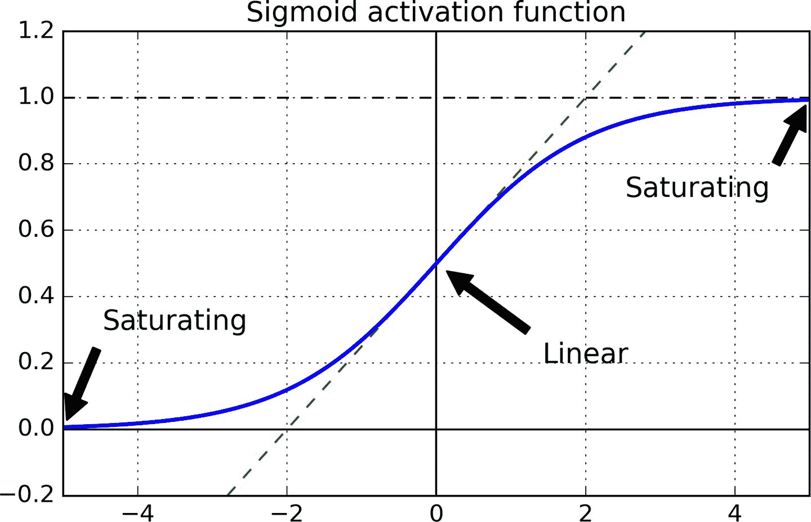

图 11-1 逻辑激活函数饱和

### Glorot 和 He 初始化

Glorot 和 Bengio 在他们的论文中提出了一种显著缓解这个问题的方法。 我们需要信号在两个方向上正确地流动：在进行预测时是前向的，在反向传播梯度时是逆向的。 我们不希望信号消失，也不希望它爆炸并饱和。 为了使信号正确流动，作者认为，我们需要每层输出的方差等于其输入的方差，并且反向传播时，流经一层的前后，梯度的方差也要相同（如果对数学细节感兴趣的话，请查看论文）。实际上不可能保证两者都是一样的，除非这个层具有相同数量的输入和神经元（这两个数被称为该层的扇入`fan-in`和扇出`fan-out`），但是他们提出了一个很好的折衷办法，在实践中证明这个折中办法非常好：随机初始化连接权重必须如公式 11-1 这样，其中`fan[avg] = (fan[in] + fan[out]) / 2`。 这种初始化策略通常被称为 Xavier 初始化或 Glorot 初始化。

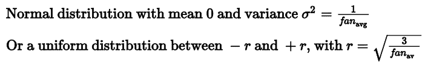

公式 11-1 Xavier 初始化（使用逻辑激活函数）

如果将公式 11-1 中的`fan[avg]`替换为`fan[in]`，就得到了 Yann LeCun 在 1990 年代提出的初始化策略，他称其为 LeCun 初始化。Genevieve Orr 和 Klaus-Robert Müller 在 1998 年出版的书《Neural Networks: Tricks of the Trade (Springer)》中推荐了 LeCun 初始化。当`fan[in] = fan[out]`时，LeCun 初始化等同于 Glorot 初始化。研究者们经历了十多年才意识到初始化策略的重要性。使用 Glorot 初始化可以大大加快训练，这是促成深度学习成功的技术之一。

一些论文针对不同的激活函数提供了类似的策略。这些策略的区别在于方差大小和使用`fan[avg]`或`fan[out]`，如表 11-1 所示。 ReLU 激活函数（及其变体，包括简称 ELU 激活）的初始化策略有时称为 He 初始化。本章后面会介绍 SELU 激活函数，它应该与 LeCun 初始化（最好是正态分布）一起使用。

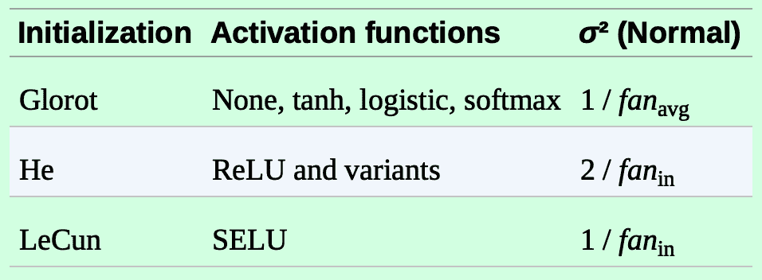

表 11-1 每种激活函数的初始化参数

默认情况下，Keras 使用均匀分布的 Glorot 初始化函数。创建层时，可以通过设置`kernel_initializer="he_uniform"`或`kernel_initializer="he_normal"`变更为 He 初始化，如下所示：

```py
keras.layers.Dense(10, activation="relu", kernel_initializer="he_normal") 
```

如果想让均匀分布的 He 初始化是基于`fan[avg]`而不是`fan[in]`，可以使用 VarianceScaling 初始化器：

```py
he_avg_init = keras.initializers.VarianceScaling(scale=2., mode='fan_avg',
                                                 distribution='uniform')
keras.layers.Dense(10, activation="sigmoid", kernel_initializer=he_avg_init) 
```

### 非饱和激活函数

Glorot 和 Bengio 在 2010 年的论文中的一个见解是，消失/爆炸的梯度问题部分是由于激活函数的选择不好造成的。 在那之前，大多数人都认为，如果大自然选择在生物神经元中使用 sigmoid 激活函数，它们必定是一个很好的选择。 但事实证明，其他激活函数在深度神经网络中表现得更好，特别是 ReLU 激活函数，主要是因为它对正值不会饱和（也因为它的计算速度很快）。

但是，ReLU 激活功能并不完美。 它有一个被称为 “ReLU 死区” 的问题：在训练过程中，一些神经元会“死亡”，即它们停止输出 0 以外的任何东西。在某些情况下，你可能会发现你网络的一半神经元已经死亡，特别是使用大学习率时。 在训练期间，如果神经元的权重得到更新，使得神经元输入的加权和为负，则它将开始输出 0 。当这种情况发生时，由于当输入为负时，ReLU 函数的梯度为 0，神经元就只能输出 0 了。

为了解决这个问题，你可能需要使用 ReLU 函数的一个变体，比如 leaky ReLU。这个函数定义为`LeakyReLU[α](z)= max(αz, z)`（见图 11-2）。超参数`α`定义了函数“泄露”的程度：它是`z < 0`时函数的斜率，通常设置为 0.01。这个小斜率保证 leaky ReLU 永不死亡；他们可能会长期昏迷，但他们有机会最终醒来。[2015 年的一篇论文](https://links.jianshu.com/go?to=https%3A%2F%2Farxiv.org%2Fabs%2F1505.00853)比较了几种 ReLU 激活功能的变体，其中一个结论是 leaky Relu 总是优于严格的 ReLU 激活函数。事实上，设定`α= 0.2`（大的泄露）似乎比`α= 0.01`（小的泄露）有更好的性能。这篇论文还评估了随机化 leaky ReLU（RReLU），其中`α`在训练期间在给定范围内随机，并在测试期间固定为平均值。它表现相当好，似乎是一个正则项（减少训练集的过拟合风险）。最后，文章还评估了参数化的 leaky ReLU（PReLU），其中`α`被授权在训练期间参与学习（而不是作为超参数，`α`变成可以像任何其他参数一样被反向传播修改的参数）。据报道，PReLU 在大型图像数据集上的表现强于 ReLU，但是对于较小的数据集，其具有过度拟合训练集的风险。

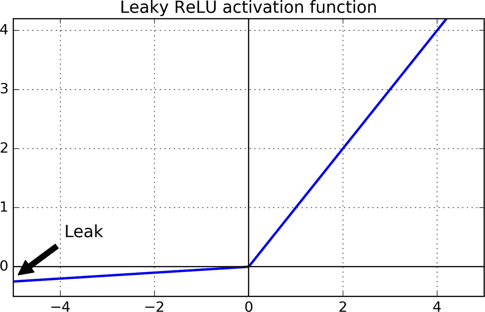

图 11-2 Leaky ReLU：很像 ReLU，但在负区间有小斜率

最后，Djork-Arné Clevert 等人在 [2015 年的一篇论文](https://links.jianshu.com/go?to=https%3A%2F%2Farxiv.org%2Fabs%2F1511.07289)中提出了一种称为指数线性单元（exponential linear unit，ELU）的新激活函数，在他们的实验中，ELU 的表现优于所有 ReLU 变体：训练时间减少，神经网络在测试集上表现的更好。 如图 11-3 所示，公式 11-2 给出了它的定义。

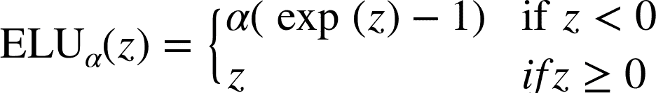

公式 11-2 ELU 激活函数

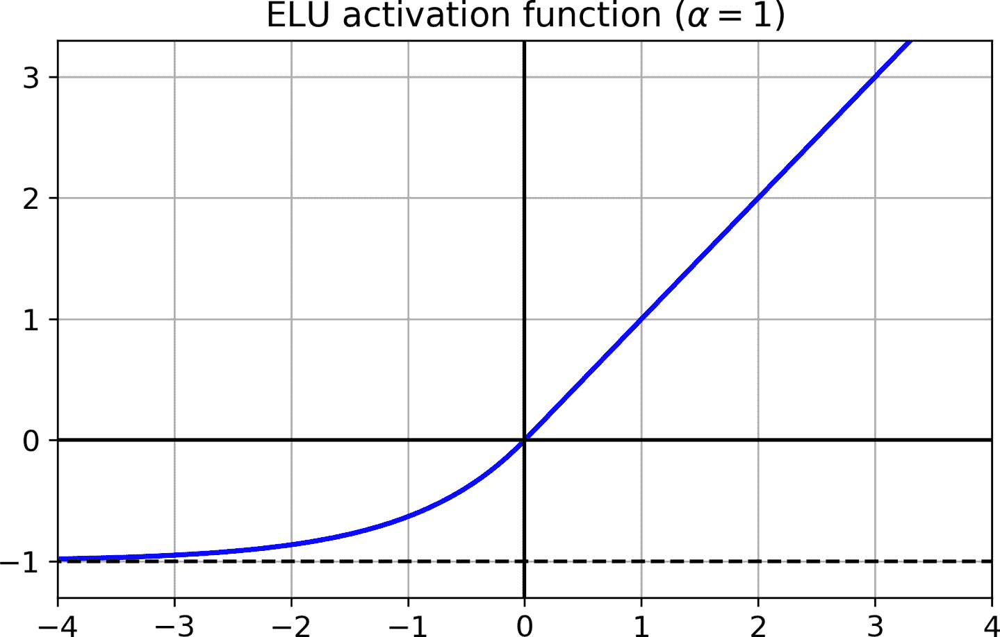

图 11-3 ELU 激活函数

ELU 看起来很像 ReLU 函数，但有一些区别，主要区别在于：

*   它在`z < 0`时取负值，这使得该单元的平均输出接近于 0。这有助于减轻梯度消失问题。 超参数`α`定义为当`z`是一个大的负数时，ELU 函数接近的值。它通常设置为 1，但是如果你愿意，你可以像调整其他超参数一样调整它。
*   它对`z < 0`有一个非零的梯度，避免了神经元死亡的问题。
*   如果`α`等于 1，则函数在任何地方都是平滑的，包括`z = 0`附近，这有助于加速梯度下降，因为它不会在`z = 0`附近回弹。

ELU 激活函数的主要缺点是计算速度慢于 ReLU 及其变体（由于使用指数函数），但是在训练过程中，这是通过更快的收敛速度来补偿的。 然而，在测试时间，ELU 网络将比 ReLU 网络慢。

[2017 年的一篇文章](https://links.jianshu.com/go?to=https%3A%2F%2Farxiv.org%2Fabs%2F1706.02515)中，Günter Klambauer 等人介绍了一种 Scaled ELU（SELU）激活函数：正如它的名字所示，它是 ELU 的伸缩变体。作者证明，只要神经网络中都是紧密层，并且所有隐藏层都是用的 SELU 激活函数，则这个网络是自归一的：训练过程中，每层输出的平均值是 0，标准差是 1，这样就解决了梯度消失爆炸问题。对于全紧密层的网络（尤其是很深的），SELU 的效果常常优于其他激活函数。但是自归一是需要条件的（数学论证见论文）：

*   输入特征必须是标准的（平均值是 0，标准差是 1）；

*   每个隐藏层的权重必须是 LeCun 正态初始化的。在 Keras 中，要设置`kernel_initializer="lecun_normal"`；

*   网络架构必须是顺序的。但是，如果要在非顺序网络（比如 RNN）或有跳连接的网络（跳过层的连接，比如 Wide&Deep）中使用 SELU，就不能保证是自归一的，所以 SELU 就不会比其它激活函数更优；

*   这篇论文只是说如果所有层都是紧密层才保证自归一，但有些研究者发现 SELU 激活函数也可以提高卷积神经网络的性能。

> 提示：那么深层神经网络的隐藏层应该使用哪个激活函数呢？ 虽然可能会有所不同，一般来说 SELU > ELU > leaky ReLU（及其变体）> ReLU > tanh > sigmoid。 如果网络架构不能保证自归一，则 ELU 可能比 SELU 的性能更好（因为 SELU 在`z=0`时不是平滑的）。如果关心运行延迟，则 leaky ReLU 更好。 如果你不想多调整另一个超参数，你可以使用前面提到的默认的`α`值（leaky ReLU 为 0.3）。 如果有充足的时间和计算能力，可以使用交叉验证来评估其他激活函数，如果神经网络过拟合，则使用 RReLU; 如果您拥有庞大的训练数据集，则为 PReLU。但是，因为 ReLU 是目前应用最广的激活函数，许多库和硬件加速器都使用了针对 ReLU 的优化，如果速度是首要的，ReLU 可能仍然是首选。

要使用 leaky ReLU，需要创建一个`LeakyReLU`层，并将它加到需要追加的层后面：

```py
model = keras.models.Sequential([
    [...]
    keras.layers.Dense(10, kernel_initializer="he_normal"),
    keras.layers.LeakyReLU(alpha=0.2),
    [...]
]) 
```

对于 PReLU，用`PReLU()`替换`LeakyRelu(alpha=0.2)`。目前还没有 RReLU 的 Keras 官方实现，但很容易自己实现（方法见第 12 章的练习）。

对于 SELU，当创建层时设置`activation="selu"`，`kernel_initializer="lecun_normal"`：

```py
layer = keras.layers.Dense(10, activation="selu",
                           kernel_initializer="lecun_normal") 
```

### 批归一化（Batch Normalization）

尽管使用 He 初始化和 ELU（或任何 ReLU 变体）可以显著减少训练开始阶段的梯度消失/爆炸问题，但不能保证在训练期间问题不会再次出现。

[在 2015 年的一篇论文](https://links.jianshu.com/go?to=https%3A%2F%2Farxiv.org%2Fabs%2F1502.03167)中，Sergey Ioffe 和 Christian Szegedy 提出了一种称为批归一化（Batch Normalization，BN）的方法来解决梯度消失/爆炸问题。该方法包括在每层的激活函数之前或之后在模型中添加操作。操作就是将输入平均值变为 0，方差变为 1，然后用两个新参数，一个做缩放，一个做偏移。换句话说，这个操作可以让模型学习到每层输入值的最佳缩放值和平均值。大大多数情况下，如果模型的第一层使用了 BN 层，则不用标准化训练集（比如使用`StandardScaler`）；BN 层做了标准化工作（虽然是近似的，每次每次只处理一个批次，但能做缩放和平移）。

为了对输入进行零居中（平均值是 0）和归一化，算法需要估计输入的均值和标准差。 它通过评估当前小批量输入的均值和标准差（因此命名为“批归一化”）来实现。 整个操作在公式 11-3 中。

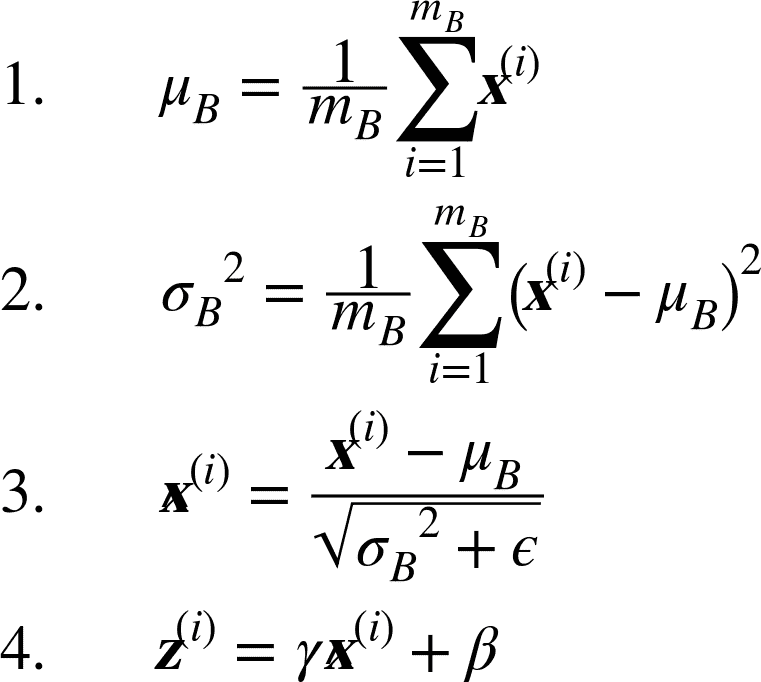

公式 11-3 批归一化算法

其中，

*   `μ[B]`是整个小批量`B`的均值向量

*   `σ[B]`是输入标准差向量，也是根据整个小批量估算的。

*   `m[B]`是小批量中的实例数量。

*   `X_hat^(j)`是以为零中心和标准化的实例`i`的输入向量。

*   `γ`是层的缩放参数的向量（每个输入一个缩放参数）。

*   `⊗`表示元素级别的相乘（每个输入乘以对应的缩放参数）

*   `β`是层的偏移参数（偏移量）向量（每个输入一个偏移参数）

*   `ϵ`是一个很小的数字，以避免被零除（通常为`10^-5`）。 这被称为平滑项（拉布拉斯平滑，Laplace Smoothing）。

*   `z^(i)`是 BN 操作的输出：它是输入的缩放和移位版本。

在训练时，BN 将输入标准化，然后做了缩放和平移。测试时又如何呢？因为需要对实例而不是批次实例做预测，所以就不能计算每个输入的平均和标准差。另外，即使有批量实例，批量也可能太小，或者实例并不是独立同分布的，所以在批量上计算是不可靠的。一种解决方法是等到训练结束，用模型再运行一次训练集，算出每个 BN 层的平均值和标准差。然后就可以用这些数据做预测，而不是批输入的平均值和标准差。但是，大部分批归一化实现是通过层输入的平均值和标准差的移动平均值来计算的。这也是 Keras 在`BatchNormalization`中使用的方法。总的来说，每个批归一化的层都通过指数移动平均学习了四个参数：`γ`（输出缩放向量），`β`（输出偏移向量），`μ`（最终输入平均值向量）和`σ`（最终输入标准差向量）。`μ`和`σ`都是在训练过程中计算的，但只在训练后使用（用于替换公式 11-3 中批输入平均和标准差）。

Ioffe 和 Szegedy 证明，批归一化大大改善了他们试验的所有深度神经网络，极大提高了 ImageNet 分类的效果（ImageNet 是一个图片分类数据集，用于评估计算机视觉系统）。梯度消失问题大大减少了，他们可以使用饱和激活函数，如 tanh 甚至逻辑激活函数。网络对权重初始化也不那么敏感。他们能够使用更大的学习率，显著加快了学习过程。具体地，他们指出，“应用于最先进的图像分类模型，批标准减少了 14 倍的训练步骤实现了相同的精度，以显著的优势击败了原始模型。[...] 使用批量标准化的网络集合，我们改进了 ImageNet 分类上的最佳公布结果：达到 4.9% 的前 5 个验证错误（和 4.8% 的测试错误），超出了人类评估者的准确性。批量标准化也像一个正则化项一样，减少了对其他正则化技术的需求（如本章稍后描述的丢弃）.

然而，批量标准化的确会增加模型的复杂性（尽管它不需要对输入数据进行标准化，因为第一个隐藏层会照顾到这一点，只要它是批量标准化的）。 此外，还存在运行时间的损失：由于每层所需的额外计算，神经网络的预测速度较慢。 但是，可以在训练之后，处理在 BN 层的前一层，就可以加快速度。方法是更新前一层的权重和偏置项，使其直接输出合适的缩放值和偏移值。例如，如果前一层计算的是`XW + b`，BN 层计算的是`γ⊗(XW + b – μ)/σ + β`（忽略了分母中的平滑项`ε`）。如果定义`W′ = γ⊗W/σ`和`b′ = γ⊗(b – μ)/σ + β`，公式就能简化为`XW′ + b′`。因此如果替换前一层的权重和偏置项（`W`和`b`）为`W'`和`b'`，就可以不用 BN 层了（TFLite 的优化器就干了这件事，见第 19 章）。

> 注意：你可能会发现，训练相当缓慢，这是因为每个周期都因为使用 BN 而延长了时间。但是有了 BN，收敛的速度更快，需要的周期数更少。综合来看，需要的总时长变短了。

### 使用 Keras 实现批归一化

和 Keras 大部分功能一样，实现批归一化既简单又直观。只要每个隐藏层的激活函数前面或后面添加一个`BatchNormalization`层就行，也可以将 BN 层作为模型的第一层。例如，这个模型在每个隐藏层的后面使用了 BN，第一层也用了 BN（在打平输入之后）：

```py
model = keras.models.Sequential([
    keras.layers.Flatten(input_shape=[28, 28]),
    keras.layers.BatchNormalization(),
    keras.layers.Dense(300, activation="elu", kernel_initializer="he_normal"),
    keras.layers.BatchNormalization(),
    keras.layers.Dense(100, activation="elu", kernel_initializer="he_normal"),
    keras.layers.BatchNormalization(),
    keras.layers.Dense(10, activation="softmax")
]) 
```

这样就成了！在这个只有两个隐藏层的例子中，BN 的作用不会那么大，但对于更深的网络，作用就特别大。

打印一下模型的摘要：

```py
>>> model.summary()
Model: "sequential_3"
_________________________________________________________________
Layer (type)                 Output Shape              Param #
=================================================================
flatten_3 (Flatten)          (None, 784)               0
_________________________________________________________________
batch_normalization_v2 (Batc (None, 784)               3136
_________________________________________________________________
dense_50 (Dense)             (None, 300)               235500
_________________________________________________________________
batch_normalization_v2_1 (Ba (None, 300)               1200
_________________________________________________________________
dense_51 (Dense)             (None, 100)               30100
_________________________________________________________________
batch_normalization_v2_2 (Ba (None, 100)               400
_________________________________________________________________
dense_52 (Dense)             (None, 10)                1010
=================================================================
Total params: 271,346
Trainable params: 268,978
Non-trainable params: 2,368 
```

可以看到每个 BN 层添加了四个参数：`γ`、 `β`、 `μ` 和 `σ`（例如，第一个 BN 层添加了 3136 个参数，即`4 × 784`）。后两个参数`μ` 和 `σ`是移动平均，不受反向传播影响，Keras 称其“不可训练”（如果将 BN 的总参数`3,136 + 1,200 + 400`除以 2，得到 2368，就是模型中总的不可训练的参数量）。

看下第一个 BN 层的参数。两个参数是可训练的（通过反向传播），两个不可训练：

```py
>>> [(var.name, var.trainable) for var in model.layers[1].variables]
[('batch_normalization_v2/gamma:0', True),
 ('batch_normalization_v2/beta:0', True),
 ('batch_normalization_v2/moving_mean:0', False),
 ('batch_normalization_v2/moving_variance:0', False)] 
```

当在 Keras 中创建一个 BN 层时，训练过程中，还会创建两个 Keras 在迭代时的操作。该操作会更新移动平均值。因为后端使用的是 TensorFlow，这些操作就是 TensorFlow 操作（第 12 章会讨论 TF 操作）：

```py
>>> model.layers[1].updates
[<tf.Operation 'cond_2/Identity' type=Identity>,
 <tf.Operation 'cond_3/Identity' type=Identity>] 
```

BN 的论文作者建议在激活函数之前使用 BN 层，而不是像前面的例子添加到后面。到底是前面还是后面好存在争议，取决于具体的任务 —— 你最好在数据集上试验一下哪种选择好。要在激活函数前添加 BN 层，必须将激活函数从隐藏层拿出来，单独做成一层。另外，因为 BN 层对每个输入有一个偏移参数，可以将前一层的偏置项去掉（设置`use_bias=False`）：

```py
model = keras.models.Sequential([
    keras.layers.Flatten(input_shape=[28, 28]),
    keras.layers.BatchNormalization(),
    keras.layers.Dense(300, kernel_initializer="he_normal", use_bias=False),
    keras.layers.BatchNormalization(),
    keras.layers.Activation("elu"),
    keras.layers.Dense(100, kernel_initializer="he_normal", use_bias=False),
    keras.layers.BatchNormalization(),
    keras.layers.Activation("elu"),
    keras.layers.Dense(10, activation="softmax")
]) 
```

`BatchNormalization`类可供调节的参数不多。默认值通常就可以，但有时需要调节`momentum`，这个超参数是`BatchNormalization`在更新指数移动平均时使用的。给定一个新值`v`（即，一个当前批次的输入平均或标准差新向量），BN 层使用下面的等式更新平均`V_hat`:

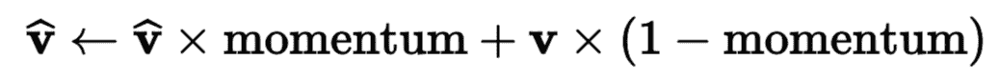

`momentum`的最优值通常接近于 1：比如，0.9、0.99、0.999（大数据的 9 更多，小数据集的 9 少）。

另一个重要的超参数是`axis`：它确定了在哪个轴上归一。默认是 -1，即归一化最后一个轴（使用其它轴的平均值和标准差）。当输入是 2D 时（即批的形状是[`batch size`,`features`]），也就是说每个输入特征都会根据批次全部实例的平均值和标准差做归一。例如，前面例子的第一个 BN 层会分别对 784 个输入特征的每个特征做归一化（还有缩放和偏移）；因此，BN 层会计算 28 个平均值和 28 个标准差（每列 1 个值，根据每行的所有实例计算），用同样的平均值和标准差归一化给定列的所有像素。还会有 28 个缩放值和 28 个偏移值。如果仍想对 784 个像素独立处理，要设置`axis=[1, 2]`。

在训练和训练之后，BN 层不会做同样的计算：BN 会使用训练中的批次数据和训练后的最终数据（即移动平均值的最终值）。看看源码中是如何实现的：

```py
class BatchNormalization(keras.layers.Layer):
    [...]
    def call(self, inputs, training=None):
        [...] 
```

`call()`方法具体实现了方法，它有一个参数`training`，默认是`None`，但`fit()`方法在训练中将其设为 1。如果你需要写一个自定义层，要求自定义层在训练和测试中的功能不同，就可以在`call()`方法中添加一个参数`training`，用这个参数决定该计算什么（第 12 张会讨论自定义层）。

`BatchNormalization`已经成为了深度神经网络中最常使用的层，以至于计算图中经常省略，默认嘉定在每个层后面加一个 BN 层。但是 [Hongyi Zhang 的一篇文章](https://links.jianshu.com/go?to=https%3A%2F%2Farxiv.org%2Fabs%2F1901.09321)可能改变了这种做法：通过使用一个新的`fixed-update`（fixup）权重初始化方法，作者没有使用 BN，训练了一个非常深的神经网络（多达 10000 层），在复杂图片分类任务上表现惊艳。但这个结论很新，最好还是再等一等，现在还是使用批归一化。

### 梯度裁剪

减少梯度爆炸问题的一种常用技术是在反向传播过程中剪切梯度，使它们不超过某个阈值，这种方法称为梯度裁剪。梯度裁剪在循环神经网络中用的很多，因为循环神经网络中用 BN 很麻烦，参见第 15 章。 对于其它类型的网络，BN 就足够了。在 Keras 中，梯度裁剪只需在创建优化器时设置`clipvalue`或`clipnorm`参数，如下：

```py
optimizer = keras.optimizers.SGD(clipvalue=1.0)
model.compile(loss="mse", optimizer=optimizer) 
```

优化器会将梯度向量中的每个值裁剪到 -1.0 和 1.0 之间。这意味着损失（对每个可训练参数）的所有偏导数会被裁剪到 -1.0 和 1.0 之间。阈值是一个可以调节的超参数，可能影响到梯度向量的方向。例如，如果原始梯度向量是`[0.9, 100.0]`，它大体指向第二个轴；但在裁剪之后变为`[0.9, 1.0]`，方向就大体指向对角线了。在实际中，梯度裁剪的效果不错。如果想确保梯度裁剪不改变梯度向量的方向，就需要设置`clipnorm`靠范数裁剪，这样如果梯度的 l2 范数超过了阈值，就能对整个梯度裁剪。例如，如果设置`clipnorm = 1.0`，向量`[0.9, 100.0]`就会被裁剪为`[0.00899964, 0.9999595]`，方向没变，但第一个量几乎被抹去了。如果再训练过程中发现了梯度爆炸（可以用 TensorBoard 跟踪梯度），最好的方法是既用值也用范数裁剪，设置不同的阈值，看看哪个在验证集上表现最好。

### 复用预训练层

从零开始训练一个非常大的 DNN 通常不是一个好主意，相反，您应该总是尝试找到一个现有的神经网络来完成与您正在尝试解决的任务类似的任务（第 14 章会介绍如何找），然后复用这个网络的较低层：这就是所谓的迁移学习。这样不仅能大大加快训练速度，还将需要更少的训练数据。

例如，假设你有一个经过训练的 DNN，能将图片分为 100 个不同的类别，包括动物，植物，车辆和日常物品。 现在想要训练一个 DNN 来对特定类型的车辆进行分类。 这些任务非常相似，甚至部分重叠，因此应该尝试重新使用第一个网络的一部分（请参见图 11-4）。

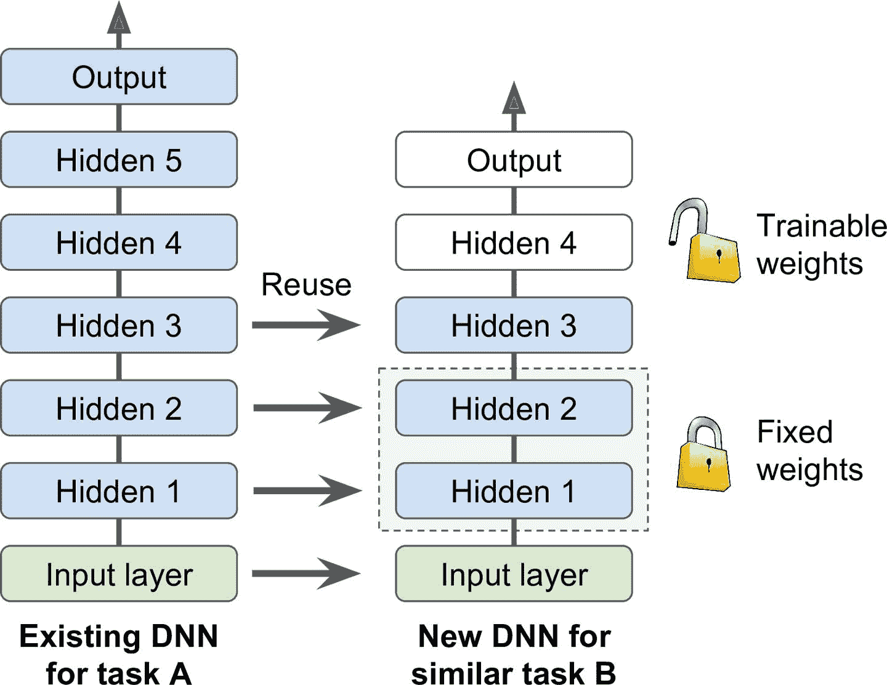

图 11-4 复用预训练层

> 笔记：如果新任务的输入图像与原始任务中使用的输入图像的大小不一致，则必须添加预处理步骤以将其大小调整为原始模型的预期大小。 更一般地说，如果输入具有类似的低级层次的特征，则迁移学习将很好地工作。

原始模型的输出层通常要替换掉，因为对于新任务可能一点用也没有，输出的数量可能就不对。相似的，原始模型的上层也不如浅层管用，因为高阶特征可能相差很大。需要确定好到底用几层。

> 提示：任务越相似，可复用的层越多。对于非常相似的任务，可以尝试保留所有的吟唱层，替换输出层。

先将所有复用的层冻结（即，使其权重不可训练，梯度下降不能修改权重），然后训练模型，看其表现如何。然后将复用的最上一或两层解冻，让反向传播可以调节它们，再查看性能有无提升。训练数据越多，可以解冻的层越多。解冻时减小学习率也有帮助，可以避免破坏微调而得的权重。

如果效果不好，或者训练数据不多，可以尝试去除顶层，将其余的层都解冻。不断尝试，直到找到合适的层，如果训练数据很多，可以尝试替换顶层，或者加入更多的隐藏层。

### 用 Keras 进行迁移学习

看一个例子。假设 Fashion MNIST 只有八个类，不包括拖鞋和 T 恤。一些人在这个数据集上搭建并训练了一个 Keras 模型，且效果不错（准确率大于 90%），将其称为模型 A。现在想处理另一个问题：有拖鞋和 T 恤的图片，要训练一个二分类器（`positive=shirt, negative=sandal`）。数据集不大，只有 200 张打了标签的图片。当训练架构与模型 A 相同的新模型时（称其为模型 B），表现非常好（准确率 97.2%）。但因为这是一个非常简单的任务（只有两类），所以准确率应该还可以更高。因为和任务 A 很像，所以可以尝试一下迁移学习。

首先，加载模型 A，创建一个新模型，除了输出层不要，保留所有的层：

```py
model_A = keras.models.load_model("my_model_A.h5")
model_B_on_A = keras.models.Sequential(model_A.layers[:-1])
model_B_on_A.add(keras.layers.Dense(1, activation="sigmoid")) 
```

`model_A` 和 `model_B_on_A` 公用了一些层。当你训练`model_B_on_A`时，也会影响`model_A`。如果想避免，需要在复用前克隆`model_A`。要这么做，可以使用`clone.model()`，然后复制权重（`clone.model()`不能克隆权重）：

```py
model_A_clone = keras.models.clone_model(model_A)
model_A_clone.set_weights(model_A.get_weights()) 
```

现在就可以训练`model_B_on_A`了，但是因为新输出层是随机初始化的，误差较大，较大的误差梯度可能会破坏复用的权重。为了避免，一种方法是在前几次周期中，冻结复用的层，让新层有时间学到合理的权重。要实现的话，将每层的`trainable`属性设为`False`，然后编译模型：

```py
for layer in model_B_on_A.layers[:-1]:
    layer.trainable = False

model_B_on_A.compile(loss="binary_crossentropy", optimizer="sgd",
                     metrics=["accuracy"]) 
```

> 笔记：冻结或解冻模型之后，都需要编译。

训练几个周期之后，就可以解冻复用层（需要再次编译模型），然后接着训练以微调模型。解冻之后，最好降低学习率，目的还是避免破坏复用层的权重：

```py
history = model_B_on_A.fit(X_train_B, y_train_B, epochs=4,
                           validation_data=(X_valid_B, y_valid_B))

for layer in model_B_on_A.layers[:-1]:
    layer.trainable = True

optimizer = keras.optimizers.SGD(lr=1e-4) # the default lr is 1e-2
model_B_on_A.compile(loss="binary_crossentropy", optimizer=optimizer,
                     metrics=["accuracy"])
history = model_B_on_A.fit(X_train_B, y_train_B, epochs=16,
                           validation_data=(X_valid_B, y_valid_B)) 
```

最终结果，新模型的测试准确率达到了 99.25%。迁移学习将误差率从 2.8% 降低到了 0.7%，减小了 4 倍！

```py
>>> model_B_on_A.evaluate(X_test_B, y_test_B)
[0.06887910133600235, 0.9925] 
```

你相信这个结果吗？不要相信：因为作者作弊了！作者尝试了许多方案，才找到一组配置提升了效果。如果你尝试改变类或随机种子，就能发现效果下降。作者这里做的是“拷问数据，直到数据招供”。当某篇论文的结果太好了，你应该怀疑下：也许新方法实际没什么效果（甚至降低了表现），只是作者尝试了许多变量，只报告了最好的结果（可能只是运气），踩的坑都没说。大部分时候，这不是恶意，但确实是科学中许多结果无法复现的原因。作者为什么要作弊呢？因为迁移学习对小网络帮助不大，小型网络只能学到几个模式，紧密网络学到的具体模式，可能在其他任务中用处不大。迁移学习在深度卷积网络中表现最好，CNN 学到的特征更通用（特别是浅层）。第 14 章会用刚讨论的，回顾迁移学习（下次保证不作弊）。

### 无监督预训练

假设你想要解决一个复杂的任务，但没有多少的打了标签的训练数据，也找不到一个类似的任务训练模型。 不要失去希望！ 首先，应该尝试收集更多的有标签的训练数据，但是如果做不到，仍然可以进行无监督的训练（见图 11-5）。 通常，获得无标签的训练数据成本低，但打标签成本很高。如果收集了大量无标签数据，可以尝试训练一个无监督模型，比如自编码器或生成式对抗网络（见第 17 章）。然后可以复用自编码器或 GAN 的浅层，加上输出层，使用监督学习微调网络（使用标签数据）。

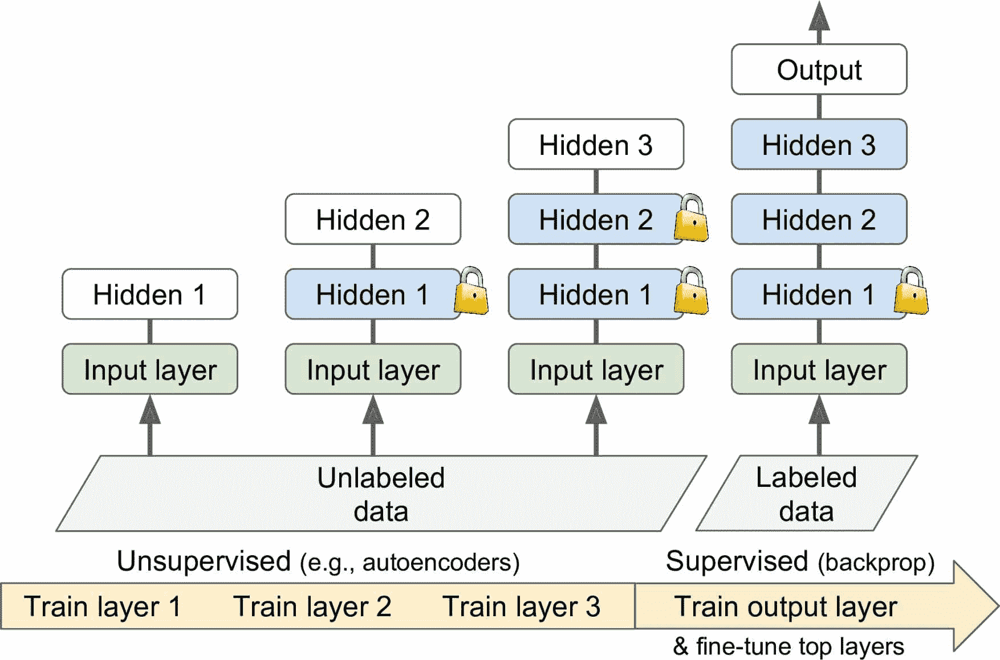

图 11-5 无监督的预训练

这是 Geoffrey Hinton 和他的团队在 2006 年使用的技术，导致了神经网络的复兴和深度学习的成功。 直到 2010 年，无监督预训练（通常使用受限玻尔兹曼机 RBM）是深度网络的标准，只有在梯度消失问题得到缓解之后，监督训练 DNN 才更为普遍。 然而，当你有一个复杂的任务需要解决时，没有类似的模型可以重复使用，而且标记的训练数据很少，但是大量的未标记的训练数据时，无监督训练（现在通常使用自动编码器、GAN 而不是 RBM）仍然是一个很好的选择。在深度学习的早期，训练深度模型很困难，人们使用了一种逐层预训练的方法（见图 11-5）。先训练一个单层无监督模型，通常是 RBM，然后冻结该层，加另一个层，再训练模型（只训练新层），然后冻住新层，再加一层，再次训练模型。现在变得简单了，直接跳到图 11-5 中的步骤 3，训练完整的无监督模型，使用的是自编码器或 GAN。

### 在辅助任务上预训练

如果没有多少标签训练数据，最后的选择是在辅助任务上训练第一个神经网络，在辅助任务上可以轻松获取或生成标签的训练数据，然后重新使用该网络的较低层来完成实际任务。 第一个神经网络的较低层将学习可能被第二个神经网络重复使用的特征检测器。

例如，如果你想建立一个识别面孔的系统，你可能只有几个人的照片 - 显然不足以训练一个好的分类器。 收集每个人的数百张照片将是不实际的。 但是，您可以在互联网上收集大量随机人员的照片，并训练第一个神经网络来检测两张不同的照片是否属于同一个人。 这样的网络将学习面部优秀的特征检测器，所以重复使用它的较低层将允许你使用很少的训练数据来训练一个好的面部分类器。

对于自然语言处理（NLP），可以下载大量文本，然后自动生成标签数据。例如，可以随机遮挡一些词，然后训练一个模型预测缺失词。如果能在这个任务上训练一个表现不错的模型，则该模型已经在语言层面学到不少了，就可以复用它到实际任务中，再用标签数据微调（第 15 章会讨论更多预训练任务）。

> 笔记：自监督学习是当你从数据自动生成标签，然后在标签数据上使用监督学习训练模型。因为这种方法无需人工标注，最好将其分类为无监督学习。

## 更快的优化器

训练一个非常大的深度神经网络可能会非常缓慢。 到目前为止，我们已经看到了四种加速训练的方法（并且达到更好性能的方法）：对连接权重应用良好的初始化策略，使用良好的激活函数，使用批归一化以及重用预训练网络的部分（使用辅助任务或无监督学习）。 另一个速度提升的方法是使用更快的优化器，而不是常规的梯度下降优化器。 在本节中，我们将介绍最流行的算法：动量优化，Nesterov 加速梯度，AdaGrad，RMSProp，最后是 Adam 和 Nadam 优化。

> 剧透：本节的结论是，几乎总是应该使用`Adam_optimization`，所以如果不关心它是如何工作的，只需使用`AdamOptimizer`替换`GradientDescentOptimizer`，然后跳到下一节！ 只需要这么小的改动，训练通常会快几倍。 但是，Adam 优化确实有三个可以调整的超参数（加上学习率）。 默认值通常工作的不错，但如果您需要调整它们，知道他们怎么实现的可能会有帮助。 Adam 优化结合了来自其他优化算法的几个想法，所以先看看这些算法是有用的。

## 动量优化

想象一下，一个保龄球在一个光滑的表面上平缓的斜坡上滚动：它会缓慢地开始，但是它会很快地达到最终的速度（如果有一些摩擦或空气阻力的话）。 这是 Boris Polyak 在 1964 年提出的动量优化背后的一个非常简单的想法。相比之下，普通的梯度下降只需要沿着斜坡进行小的有规律的下降步骤，所以需要更多的时间才能到达底部。

回想一下，梯度下降只是通过直接减去损失函数`J(θ)`相对于权重`θ`的梯度（`∇θJ(θ)`），乘以学习率`η`来更新权重`θ`。 等式是：`θ ← θ – η ∇[θ]J(θ)`。它不关心早期的梯度是什么。 如果局部梯度很小，则会非常缓慢。

动量优化很关心以前的梯度：在每次迭代时，它将动量向量`m`（乘以学习率`η`）与局部梯度相加，并且通过简单地减去该动量向量来更新权重（参见公式 11-4）。 换句话说，梯度用作加速度，不用作速度。 为了模拟某种摩擦机制，避免动量过大，该算法引入了一个新的超参数`β`，简称为动量，它必须设置在 0（高摩擦）和 1（无摩擦）之间。 典型的动量值是 0.9。

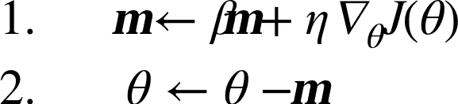

公式 11-4 动量算法

可以很容易验证，如果梯度保持不变，则最终速度（即，权重更新的最大大小）等于该梯度乘以学习率`η`乘以`1/(1-β)`。 例如，如果`β = 0.9`，则最终速度等于学习率的梯度乘以 10 倍，因此动量优化比梯度下降快 10 倍！ 这使动量优化比梯度下降快得多。 特别是，我们在第四章中看到，当输入量具有非常不同的尺度时，损失函数看起来像一个细长的碗（见图 4-7）。 梯度下降速度很快，但要花很长的时间才能到达底部。 相反，动量优化会越来越快地滚下山谷底部，直到达到底部（最佳）。在不使用批归一化的深度神经网络中，较高层往往会得到具有不同的尺度的输入，所以使用动量优化会有很大的帮助。 它也可以帮助滚过局部最优值。

> 笔记：由于动量的原因，优化器可能会超调一些，然后再回来，再次超调，并在稳定在最小值之前多次振荡。 这就是为什么在系统中有一点摩擦的原因之一：它消除了这些振荡，从而加速了收敛。

在 Keras 中实现动量优化很简单：只需使用`SGD`优化器，设置`momentum`超参数，然后就可以躺下赚钱了！

```py
optimizer = keras.optimizers.SGD(lr=0.001, momentum=0.9) 
```

动量优化的一个缺点是它增加了另一个超参数来调整。 然而，0.9 的动量值通常在实践中运行良好，几乎总是比梯度下降快。

### Nesterov 加速梯度

Yurii Nesterov 在 1983 年提出的动量优化的一个小变体几乎总是比普通的动量优化更快。 Nesterov 动量优化或 Nesterov 加速梯度（Nesterov Accelerated Gradient，NAG）的思想是测量损失函数的梯度不是在局部位置，而是在动量方向稍微靠前（见公式 11-5）。 与普通的动量优化的唯一区别在于梯度是在`θ+βm`而不是在`θ`处测量的。


公式 11-5 Nesterov 加速梯度算法

这个小小的调整是可行的，因为一般来说，动量向量将指向正确的方向（即朝向最优方向），所以使用在该方向上测得的梯度稍微更精确，而不是使用 原始位置的梯度，如图 11-6 所示（其中`∇1`代表在起点`θ`处测量的损失函数的梯度，`∇2`代表位于`θ+βm`的点处的梯度）。

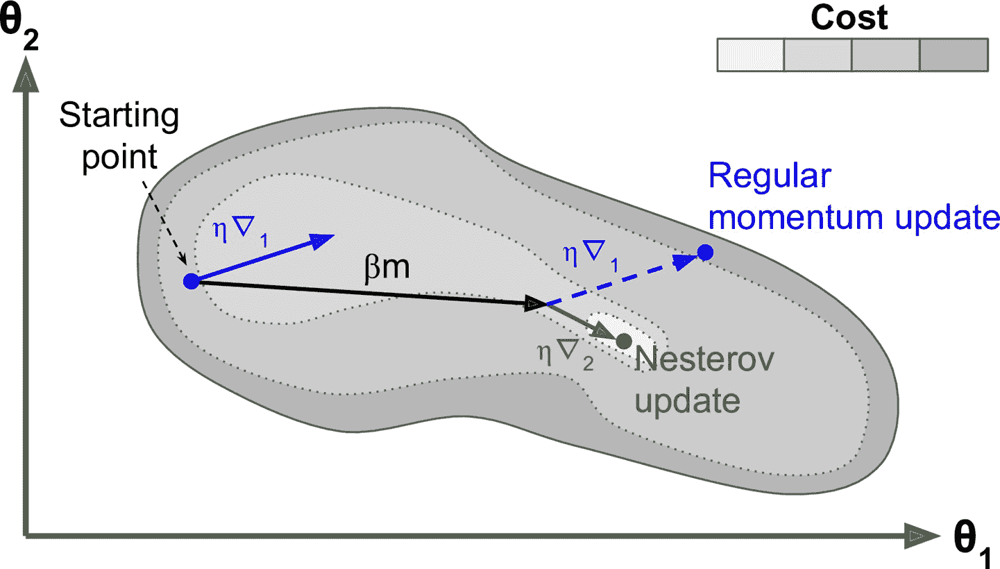

图 11-6 常规 vs Nesterov 动量优化

可以看到，Nesterov 更新稍微靠近最佳值。 过了一段时间，这些小的改进加起来，NAG 最终比常规的动量优化快得多。 此外，当动量推动权重横跨山谷时，`∇1`继续推进越过山谷，而`∇2`推回山谷的底部。 这有助于减少振荡，从而更快地收敛。

与常规的动量优化相比，NAG 几乎总能加速训练。 要使用它，只需在创建`SGD`时设置`nesterov=True`：

```py
optimizer = keras.optimizers.SGD(lr=0.001, momentum=0.9, nesterov=True) 
```

### AdaGrad

再次考虑细长碗的问题：梯度下降从最陡峭的斜坡快速下降，然后缓慢地下到谷底。 如果算法能够早期检测到这个问题并且纠正它的方向来指向全局最优点，那将是非常好的。AdaGrad 算法通过沿着最陡的维度缩小梯度向量来实现这一点（见公式 11-6）：


公式 11-6 AdaGrad 算法

第一步将梯度的平方累加到向量`s`中（⊗符号表示元素级别相乘）。 这个向量化形式相当于向量`s`的每个元素`s[i]`计算`s[i] ← s[i] + (∂J(θ)/∂θ[i])^2`。换一种说法，每个`s[i]`累加损失函数对参数`θ[i]`的偏导数的平方。 如果损失函数沿着第`i`维陡峭，则在每次迭代时，`s[i]`将变得越来越大。

第二步几乎与梯度下降相同，但有一个很大的不同：梯度向量按比例`(s+ε)^0.5`缩小 （`⊘`符号表示元素分割，`ε`是避免被零除的平滑项，通常设置为`10^(-10)`。 这个向量化的形式相当于所有`θ[i]`同时计算

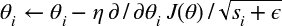

简而言之，这种算法会降低学习速度，但对于陡峭的维度，其速度要快于具有温和的斜率的维度。 这被称为自适应学习率。 它有助于将更新的结果更直接地指向全局最优（见图 11-7）。 另一个好处是它不需要那么多的去调整学习率超参数`η`。

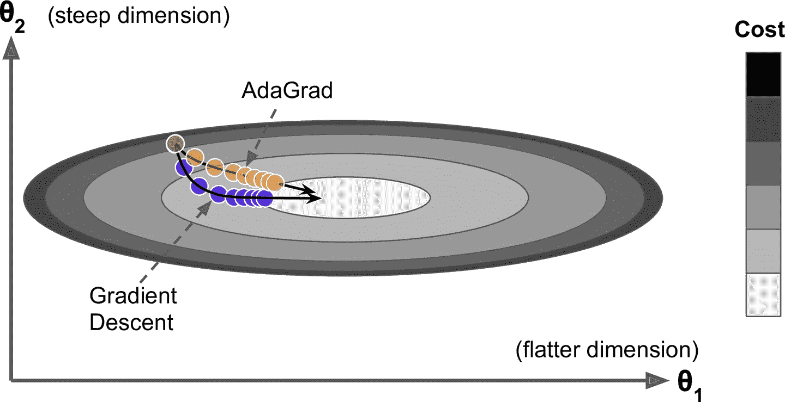

图 11-7 AdaGard vs 梯度下降

对于简单的二次问题，AdaGrad 经常表现良好，但不幸的是，在训练神经网络时，它经常停止得太早。 学习率被缩减得太多，以至于在达到全局最优之前，算法完全停止。 所以，即使 Keras 有一个`Adagrad` 优化器，你也不应该用它来训练深度神经网络（虽然对线性回归这样简单的任务可能是有效的）。但是，理解 AdaGrad 对掌握其它自适应学习率还是很有帮助的。

### RMSProp

前面看到，AdaGrad 的风险是降速太快，可能无法收敛到全局最优。RMSProp 算法通过仅累积最近迭代（而不是从训练开始以来的所有梯度）的梯度来修正这个问题。 它通过在第一步中使用指数衰减来实现（见公式 11-7）。

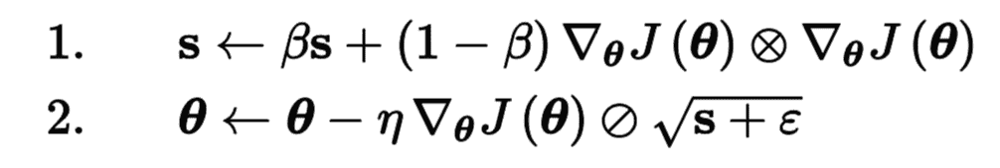

公式 11-7 RMSProp 算法

它的衰变率`β`通常设定为 0.9。 是的，它又是一个新的超参数，但是这个默认值通常运行良好，所以你可能根本不需要调整它。

正如所料，Keras 拥有一个`RMSProp`优化器：

```py
optimizer = keras.optimizers.RMSprop(lr=0.001, rho=0.9) 
```

除了非常简单的问题，这个优化器几乎总是比 AdaGrad 执行得更好。 它通常也比动量优化和 Nesterov 加速梯度表现更好。 事实上，这是许多研究人员首选的优化算法，直到 Adam 优化出现。

## Adam 和 Nadam 优化

Adam，代表自适应矩估计，结合了动量优化和 RMSProp 的思想：就像动量优化一样，它追踪过去梯度的指数衰减平均值，就像 RMSProp 一样，它跟踪过去平方梯度的指数衰减平均值 （见方程式 11-8）。

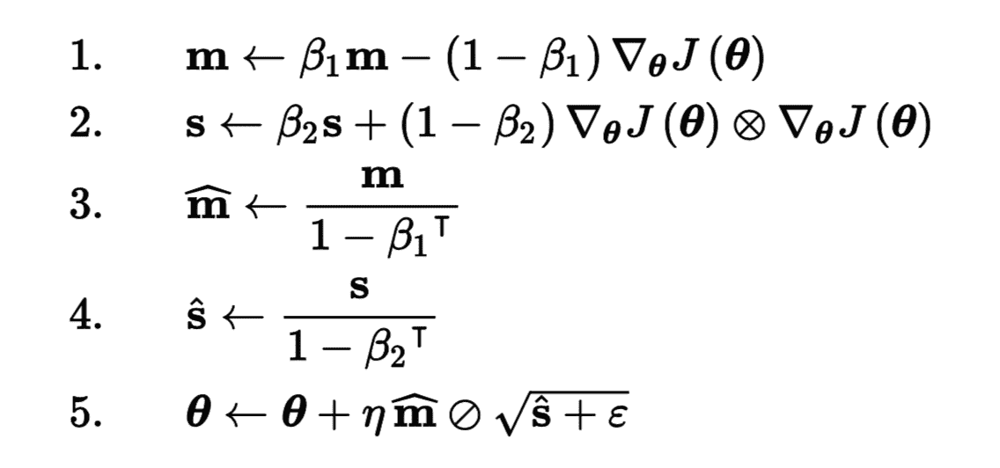

公式 11-8 Adam 算法

`T`代表迭代次数（从 1 开始）。

如果你只看步骤 1, 2 和 5，你会注意到 Adam 与动量优化和 RMSProp 的相似性。 唯一的区别是第 1 步计算指数衰减的平均值，而不是指数衰减的和，但除了一个常数因子（衰减平均值只是衰减和的`1 - β1`倍）之外，它们实际上是等效的。 步骤 3 和步骤 4 是一个技术细节：由于`m`和`s`初始化为 0，所以在训练开始时它们会偏向 0，所以这两步将在训练开始时帮助提高`m`和`s`。

动量衰减超参数`β1`通常初始化为 0.9，而缩放衰减超参数`β2`通常初始化为 0.999。 如前所述，平滑项`ε`通常被初始化为一个很小的数，例如`10^(-7)`。这些是 TensorFlow 的`Adam`类的默认值（更具体地，ε默认为 None，Keras 将使用`keras.backend.epsilon()`，默认为`10^(-7)`，可以通过`keras.backend.set_epsilon()`更改），所以你可以简单地使用：

```py
optimizer = keras.optimizers.Adam(lr=0.001, beta_1=0.9, beta_2=0.999) 
```

实际上，由于 Adam 是一种自适应学习率算法（如 AdaGrad 和 RMSProp），所以对学习率超参数`η`的调整较少。 您经常可以使用默认值`η= 0.001`，使 Adam 相对于梯度下降更容易使用。

> 提示：如果读者对这些不同的技术感到头晕脑胀，不用担心，本章末尾会提供一些指导。

最后，Adam 还有两种变体值得一看：

AdaMax

公式 11-8 的第 2 步中，Adam 积累了`s`的梯度平方（越近，权重越高）。第 5 步中，如果忽略了`ε`、第 3 步和第 4 步（只是技术细节而已），Adam 是通过`s`的平方根更新参数。总之，Adam 通过时间损耗梯度的 l2 范数更新参数（l2 范数是平方和的平方根）。AdaMax（也是在 Adam 的同一篇论文中介绍的）用 ℓ∞ 范数（max 的另一种说法）代替了 ℓ2 范数。更具体的，是在第 2 步中做了替换，舍弃了第 4 步，第 5 步中用`s`（即时间损耗的最大值）更新梯度。在实践中，这样可以使 AdaMax 比 Adam 更稳定，但也要取决于数据集，总体上，Adam 表现更好。因此，AdaMax 只是 Adam 碰到问题时的另一种选择。

Nadam

Nadam 优化是 Adam 优化加上了 Nesterov 技巧，所以通常比 Adam 收敛的快一点。在[论文](https://links.jianshu.com/go?to=http%3A%2F%2Fcs229.stanford.edu%2Fproj2015%2F054_report.pdf)中，作者 Timothy Dozat 在不同任务上试验了不同的优化器，发现 Nadam 通常比 Adam 效果好，但有时不如 RMSProp。

> 警告：自适应优化方法（包括 RMSProp，Adam，Nadam）总体不错，收敛更快。但是 Ashia C. Wilson 在 2017 年的一篇[论文](https://links.jianshu.com/go?to=https%3A%2F%2Farxiv.org%2Fabs%2F1705.08292)中说，这些自适应优化方法在有些数据集上泛化很差。所以当你对模型失望时，可以尝试下普通的 Nesterov 加速梯度：你的数据集可能只是对自适应梯度敏感。另外要调研最新的研究进展，因为这个领域进展很快。

目前所有讨论的优化方法都是基于一阶偏导（雅可比矩阵）的。文献中还介绍了基于二阶导数（黑森矩阵，黑森矩阵是雅可比矩阵的骗到）的算法。但是，后者很难应用于深度神经网络，因为每个输出有`n^2`个黑森矩阵（`n`是参数个数），每个输出只有`n`个雅可比矩阵。因为 DNN 通常有数万个参数，二阶优化器通常超出了内存，就算内存能装下，计算黑森矩阵也非常慢。

> 训练稀疏模型
> 所有刚刚提出的优化算法都会产生紧密模型，这意味着大多数参数都是非零的。 如果你在运行时需要一个非常快的模型，或者如果你需要它占用较少的内存，你可能更喜欢用一个稀疏模型来代替。
> 实现这一点的一个微不足道的方法是像平常一样训练模型，然后丢掉微小的权重（将它们设置为 0）。但这通常不会生成一个稀疏的模型，而且可能使模型性能下降。
> 更好的选择是在训练过程中应用强 ℓ1 正则化，因为它会推动优化器尽可能多地消除权重（如第 4 章关于 Lasso 回归的讨论）。
> 如果这些技术可能仍然不成，就查看 [TensorFlow Model Optimization Toolkit (TF-MOT)](https://links.jianshu.com/go?to=https%3A%2F%2Fhoml.info%2Ftfmot)，它提供了一些剪枝 API，可以在训练中根据量级迭代去除权重。

表 11-2 比较了讨论过的优化器（`*`是差，`**`是平均，`***`是好）。


表 11-2 优化器比较

### 学习率调整

找到一个好的学习速率非常重要。 如果设置太高，训练时可能离散。如果设置得太低，训练最终会收敛到最佳状态，但会花费很长时间。 如果将其设置得稍高，开始的进度会非常快，但最终会在最优解周围跳动，永远不会停下来。如果计算资源有限，可能需要打断训练，在最优收敛之前拿到一个次优解（见图 11-8）。

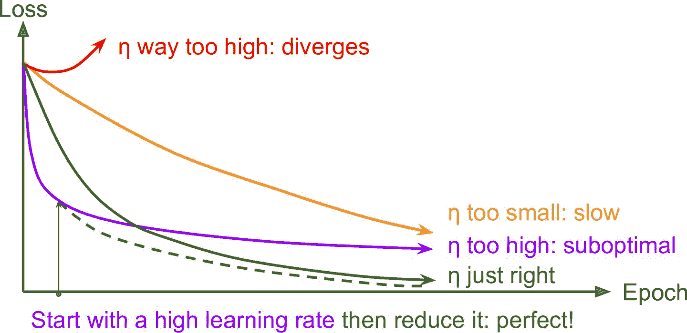

图 11-8 不同学习速率的学习曲线

正如第 10 章讨论过的，可以通过几百次迭代找到一个好的学习率，学习率一开始设的很小，然后指数级提高，查看学习曲线，找到那条要要开始抬高的曲线，要找的学习率比这条曲线稍低。

但除了固定学习率，还有更好的方法：如果你从一个高的学习率开始，然后一旦它停止快速的进步就减少它，你可以比最佳的恒定学习率更快地达到一个好的解决方案。 有许多不同的策略，以减少训练期间的学习率。 这些策略被称为学习率调整（我们在第 4 章中简要介绍了这个概念），其中最常见的是：

幂调度:
设学习率为迭代次数`t`的函数：`η(t) = η[0] (1 + t/s)^c`。初始学习率`η[0]`， 幂`c`（通常被设置为 1），步数`s`是超参数。学习率在每步都会下降，`s`步后，下降到`η[0]/ 2`。再经过`s`步，下降到`η[0] / 3`，然后是`η[0] / 4`、`η[0] / 5`，以此类推。可以看到，策略是一开始很快，然后越来越慢。幂调度需要调节`η[0]`和`s`（也可能有`c`）。

指数调度:
将学习率设置为迭代次数`t`的函数：`η(t) = η[0] 0.1^(t/s)`。 学习率每步都会下降 10 倍。幂调度的下降是越来越慢，指数调度保持 10 倍不变。

预定的分段恒定学习率：
先在几个周期内使用固定的学习率（比如 5 个周期内学习率设置为`η[0] = 0.1`），然后在另一个周期内设更小的学习率（比如 50 个周期`η[0] = 0.001`），以此类推。虽然这个解决方案可以很好地工作，但是通常需要弄清楚正确的学习速度顺序以及使用时长。

性能调度：
每`N`步测量验证误差（就像提前停止一样），当误差下降时，将学习率降低`λ`倍。

1 循环调度：
与其它方法相反，1 循环调度（Leslie Smith 在 2018 年提出）一开始在前半个周期将学习率`η[0]`线性增加到`η[1]`然后在后半个周期内再线性下降到`η[0]`，最后几个周期学习率下降几个数量级（仍然是线性的）。用前面的方法找到最优学习率的方法确定`η[1]`，`η[0]`是`η[1]`的十分之一。当使用动量时，先用一个高动量（比如 0.95），然后在训练上半段下降（比如线性下降到 0.85），然后在训练后半部分上升到最高值（0.95），最后几个周期也用最高值完成。Smith 做了许多试验，证明这个方法可以显著加速并能提高性能。例如，在 CIFAR10 图片数据集上，这个方法在 100 个周期就达到了 91.9% 的验证准确率，而标准方法经过 800 个周期才打到 90.3%（模型架构不变）。

Andrew Senior 等人在 2013 年的论文比较了使用动量优化训练深度神经网络进行语音识别时一些最流行的学习率调整的性能。 作者得出结论：在这种情况下，性能调度和指数调度都表现良好，但他们更喜欢指数调度，因为它实现起来比较简单，容易调整，收敛速度略快于最佳解决方案。作者还之处，1 周期表现更好。

使用 Keras 实现学习率幂调整非常简单，只要在优化器中设定`decay`超参数：

```py
 optimizer = keras.optimizers.SGD(lr=0.01, decay=1e-4) 
```

`decay`是`s`（更新学习率的步骤数），Keras 假定`c`等于 1。

指数调度和分段恒定学习率也很简单。首先定义一个函数接受当前周期，然后返回学习率。例如，如下实现指数调度：

```py
def exponential_decay_fn(epoch):
    return 0.01 * 0.1**(epoch / 20) 
```

如果不想硬实现`η[1]`和`s`，可以实现一个函数返回配置函数：

```py
def exponential_decay(lr0, s):
    def exponential_decay_fn(epoch):
        return lr0 * 0.1**(epoch / s)
    return exponential_decay_fn

exponential_decay_fn = exponential_decay(lr0=0.01, s=20) 
```

然后，创建一个`LearningRateScheduler`调回，给它一个调度函数，然后将调回传递给`fit()`：

```py
lr_scheduler = keras.callbacks.LearningRateScheduler(exponential_decay_fn)
history = model.fit(X_train_scaled, y_train, [...], callbacks=[lr_scheduler]) 
```

`LearningRateScheduler`会在每个周期开始时更新优化器的`learning_rate`属性。每个周期更新一次学习率就够了，但如果想更新更频繁，例如每步都更新，可以通过写调回实现（看前面指数调回的例子）。如果每个周期有许多步，每步都更新学习率是非常合理的。或者，可以使用`keras.optimizers.schedules`方法。

调度函数可以将当前学习率作为第二个参数。例如，下面的调度函数将之前的学习率乘以`0.1^(1/20)`，同样实现了指数下降：

```py
def exponential_decay_fn(epoch, lr):
    return lr * 0.1**(1 / 20) 
```

该实现依靠优化器的初始学习率（与前面的实现相反），所以一定要设置对。

当保存模型时，优化器和学习率也能保存。这意味着，只要有这个新的调度函数，就能加载模型接着训练。如果调度函数使用了周期，会稍微麻烦点：周期不会保存，每次调用`fit()`方法时，周期都会重置为 0。如果加载模型接着训练，可能会导致学习率很大，会破坏模型的权重。一种应对方法是手动设置`fit()`方法的参数`initial_epoch`，是周期从正确的值开始。

对于分段恒定学习率调度，可以使用如下的调度函数，然后创建一个`LearningRateScheduler`调回，传递给`fit()`方法：

```py
def piecewise_constant_fn(epoch):
    if epoch < 5:
        return 0.01
    elif epoch < 15:
        return 0.005
    else:
        return 0.001 
```

对于性能调度，使用`ReduceLROnPlateau`调回。例如，如果将下面的调回去传递给`fit()`，只要验证损失在连续 5 个周期内没有改进，就会将学习率乘以 0.5：

```py
lr_scheduler = keras.callbacks.ReduceLROnPlateau(factor=0.5, patience=5) 
```

最后，`tf.keras`还提供了一种实现学习率调度的方法：使用`keras.optimizers.schedules`中一种可用的调度定义学习率。这样可以在每步更新学习率。例如，还可以如下实现前面的函数`exponential_decay_fn()`：

```py
s = 20 * len(X_train) // 32 # number of steps in 20 epochs (batch size = 32)
learning_rate = keras.optimizers.schedules.ExponentialDecay(0.01, s, 0.1)
optimizer = keras.optimizers.SGD(learning_rate) 
```

这样又好看又简单，另外当保存模型时，学习率和调度（包括状态）也能保存。但是这个方法不属于 Keras API，是`tf.keras`专有的。

对于 1 循环调度，实现也不困难：只需创建一个在每个迭代修改学习率的自定义调回（通过更改`self.model.optimizer.lr`更新学习率）。代码见 Jupyter 笔记本的例子。

总结一下，指数调度、性能调度和 1 循环调度可以极大加快收敛，不妨一试！

## 通过正则化避免过拟合

有四个参数，我可以拟合一个大象，五个我可以让他摆动他的象鼻。—— John von Neumann,cited by Enrico Fermi in Nature 427

有数千个参数，甚至可以拟合整个动物园。深度神经网络通常具有数以万计的参数，有时甚至是数百万。 有了这么多的参数，网络拥有难以置信的自由度，可以适应各种复杂的数据集。 但是这个很大的灵活性也意味着它很容易过拟合训练集。所以需要正则。第 10 章用过了最好的正则方法之一：早停。另外，虽然批归一化是用来解决梯度不稳定的，但也可以作为正则器。这一节会介绍其它一些最流行的神经网络正则化技术：ℓ1 和 ℓ2 正则、丢弃和最大范数正则。

### ℓ1 和 ℓ2 正则

就像第 4 章中对简单线性模型所做的那样，可以使用 ℓ2 正则约束一个神经网络的连接权重，或 ℓ1 正则得到稀疏模型（许多权重为 0）。下面是对 Keras 的连接权重设置 ℓ2 正则，正则因子是 0.01：

```py
layer = keras.layers.Dense(100, activation="elu",
                           kernel_initializer="he_normal",
                           kernel_regularizer=keras.regularizers.l2(0.01)) 
```

`l2`函数返回的正则器会在训练中的每步被调用，以计算正则损失。正则损失随后被添加到最终损失。如果要使用 ℓ1 正则，可以使用`keras.regularizers.l1()`；如果想使用 ℓ1 和 ℓ2 正则，可以使用`keras.regularizers.l1_l2()`（要设置两个正则因子）。

因为想对模型中的所有层使用相同的正则器，还要使用相同的激活函数和相同的初始化策略。参数重复使代码很难看。为了好看，可以用循环重构代码。另一种方法是使用 Python 的函数`functools.partial()`，它可以为任意可调回对象创建封装类，并有默认参数值：

```py
from functools import partial

RegularizedDense = partial(keras.layers.Dense,
                           activation="elu",
                           kernel_initializer="he_normal",
                           kernel_regularizer=keras.regularizers.l2(0.01))

model = keras.models.Sequential([
    keras.layers.Flatten(input_shape=[28, 28]),
    RegularizedDense(300),
    RegularizedDense(100),
    RegularizedDense(10, activation="softmax",
                     kernel_initializer="glorot_uniform")
]) 
```

### 丢弃

丢弃是深度神经网络最流行的正则化方法之一。 它由 Geoffrey Hinton 于 2012 年提出，并在 Nitish Srivastava 等人的 2014 年论文中进一步详细描述，并且已被证明是非常成功的：即使是最先进的神经网络，仅仅通过增加丢弃就可以提高 1-2% 的准确度。 这听起来可能不是很多，但是当一个模型已经具有 95% 的准确率时，获得 2% 的准确度提升意味着将误差率降低近 40%（从 5% 误差降至大约 3%）。

这是一个相当简单的算法：在每个训练步骤中，每个神经元（包括输入神经元，但不包括输出神经元）都有一个暂时“丢弃”的概率`p`，这意味着在这个训练步骤中它将被完全忽略， 在下一步可能会激活（见图 11-9）。 超参数`p`称为丢弃率，通常设为 10% 到 50% 之间；循环神经网络之间接近 20-30%，在卷积网络中接近 40-50%。 训练后，神经元不会再丢失。 这就是全部（除了我们将要讨论的技术细节）。

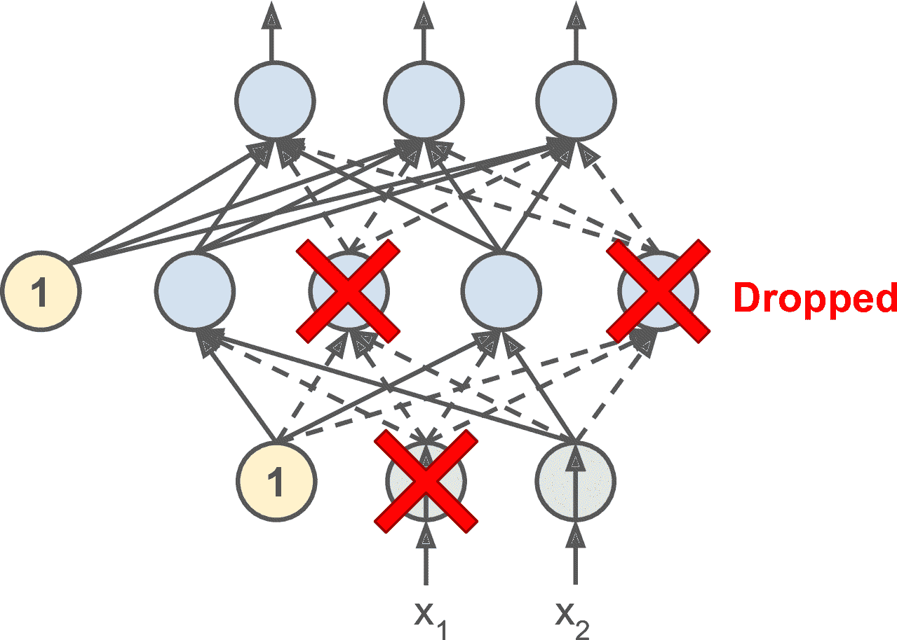

图 11-9 丢弃正则化

这个具有破坏性的方法竟然行得通，这是相当令人惊讶的。如果一个公司的员工每天早上被告知要掷硬币来决定是否上班，公司的表现会不会更好呢？那么，谁知道；也许会！公司显然将被迫适应这样的组织构架；它不能依靠任何一个人操作咖啡机或执行任何其他关键任务，所以这个专业知识将不得不分散在几个人身上。员工必须学会与其他的许多同事合作，而不仅仅是其中的一小部分。该公司将变得更有弹性。如果一个人离开了，并没有什么区别。目前还不清楚这个想法是否真的可以在公司实行，但它确实对于神经网络是可行的。神经元被丢弃训练不能与其相邻的神经元共适应；他们必须尽可能让自己变得有用。他们也不能过分依赖一些输入神经元;他们必须注意他们的每个输入神经元。他们最终对输入的微小变化会不太敏感。最后，你会得到一个更稳定的网络，泛化能力更强。

了解丢弃的另一种方法是认识到每个训练步骤都会产生一个独特的神经网络。 由于每个神经元可以存在或不存在，总共有`2 ^ N`个可能的网络（其中 N 是可丢弃神经元的总数）。 这是一个巨大的数字，实际上不可能对同一个神经网络进行两次采样。 一旦你运行了 10,000 个训练步骤，你基本上已经训练了 10,000 个不同的神经网络（每个神经网络只有一个训练实例）。 这些神经网络显然不是独立的，因为它们共享许多权重，但是它们都是不同的。 由此产生的神经网络可以看作是所有这些较小的神经网络的平均集成。

> 提示：在实际中，可以只将丢弃应用到最上面的一到三层（包括输出层）。

有一个小而重要的技术细节。 假设`p = 50%`，在这种情况下，在测试期间，在训练期间神经元将被连接到两倍于（平均）的输入神经元。 为了弥补这个事实，我们需要在训练之后将每个神经元的输入连接权重乘以 0.5。 如果我们不这样做，每个神经元的总输入信号大概是网络训练的两倍，这不太可能表现良好。 更一般地说，我们需要将每个输入连接权重乘以训练后的保持概率（`1-p`）。 或者，我们可以在训练过程中将每个神经元的输出除以保持概率（这些替代方案并不完全等价，但它们工作得同样好）。

要使用 Kera 实现丢弃，可以使用`keras.layers.Dropout`层。在训练过程中，它随机丢弃一些输入（将它们设置为 0），并用保留概率来划分剩余输入。 训练结束后，这个函数什么都不做，只是将输入传给下一层。下面的代码将丢弃正则化应用于每个紧密层之前，丢弃率为 0.2：

```py
model = keras.models.Sequential([
    keras.layers.Flatten(input_shape=[28, 28]),
    keras.layers.Dropout(rate=0.2),
    keras.layers.Dense(300, activation="elu", kernel_initializer="he_normal"),
    keras.layers.Dropout(rate=0.2),
    keras.layers.Dense(100, activation="elu", kernel_initializer="he_normal"),
    keras.layers.Dropout(rate=0.2),
    keras.layers.Dense(10, activation="softmax")
]) 
```

> 警告：因为丢弃只在训练时有用，比较训练损失和验证损失会产生误导。特别地，一个模型可能过拟合训练集，但训练和验证损失相近。因此一定要不要带丢弃评估训练损失（比如训练后）。

如果观察到模型过拟合，则可以增加丢弃率（即，减少`keep_prob`超参数）。 相反，如果模型欠拟合训练集，则应尝试降低丢弃率（即增加`keep_prob`）。 它也可以帮助增加大层的丢弃率，并减少小层的丢弃率。另外，许多优秀的架构只在最后一个隐藏层之后使用丢弃，如果全都加上丢弃太强了，可以这么试试。

丢弃似乎减缓了收敛速度，但通常会在调参得当时使模型更好。 所以，这通常值得花费额外的时间和精力。

> 提示：如果想对一个自归一化的基于 SELU 的网络使用正则，应该使用 alpha 丢弃：这是一个丢弃的变体，可以保留输入的平均值和标准差（它是在 SELU 的论文中提出的，因为常规的丢弃会破会自归一化）。

### 蒙特卡洛（MC）丢弃

Yarin Gal 和 Zoubin Ghahramani 在 [2016 的一篇论文](https://links.jianshu.com/go?to=https%3A%2F%2Farxiv.org%2Fabs%2F1506.02142)中，追加了几个使用丢弃的理由：

*   首先，这篇论文对丢弃网络（每个权重层前都有一个丢弃层）和贝叶斯推断建立了理论联系，从数学角度给予了证明。

*   第二，作者介绍了一种称为 MC 丢弃的方法，它可以提升任何训练过的丢弃模型的性能，并且无需重新训练或修改，对模型存在的不确定性提供了一种更好的方法，也很容易实现。

如果这听起来像一个广告，看下面的代码。它是 MC 丢弃的完整实现，可以提升前面训练的模型，并且没有重新训练：

```py
y_probas = np.stack([model(X_test_scaled, training=True)
                     for sample in range(100)])
y_proba = y_probas.mean(axis=0) 
```

我们只是在训练集上做了 100 次预测，设置`training=True`保证丢弃是活跃的，然后放到一起。因为丢弃是开启的，所有的预测都会不同。`predict()`返回一个矩阵，每行包含一个实例，每列是一个类。因为测试集有 10000 个实例和 10 个类，这个矩阵的形状是`[10000,10]`。我们一共有 100 个这样的矩阵，因此`y_proba`是一个形状`[100,10000,10]`的数组。当对以一个维度维度（`axis=0`）做平均时，得到的是`y_proba`，形状是`[10000,10]`的数组，就像和一次独立预测的一样。对开启丢弃的多次预测做平均，就得到了一个蒙特卡洛估计，会比单独一次预测的可靠性更高。例如，看下模型对训练集第一个实例的预测，关闭丢弃：

```py
>>> np.round(model.predict(X_test_scaled[:1]), 2)
array([[0\.  , 0\.  , 0\.  , 0\.  , 0\.  , 0\.  , 0\.  , 0.01, 0\.  , 0.99]],
      dtype=float32) 
```

这个模型大概率认定这张图属于类 9（靴子）。应该相信这个结果吗？有无质疑空间呢？

再看看开启丢弃的预测：

```py
>>> np.round(y_probas[:, :1], 2)
array([[[0\.  , 0\.  , 0\.  , 0\.  , 0\.  , 0.14, 0\.  , 0.17, 0\.  , 0.68]],
       [[0\.  , 0\.  , 0\.  , 0\.  , 0\.  , 0.16, 0\.  , 0.2 , 0\.  , 0.64]],
       [[0\.  , 0\.  , 0\.  , 0\.  , 0\.  , 0.02, 0\.  , 0.01, 0\.  , 0.97]],
       [...] 
```

当开启丢弃，模型就没那么确定了。虽然仍偏向类 9，但会在类 5（凉鞋）和类 7（运动鞋）犹豫。对第一维做平均，我们得到了下面的 MC 丢弃预测：

```py
>>> np.round(y_proba[:1], 2)
array([[0\.  , 0\.  , 0\.  , 0\.  , 0\.  , 0.22, 0\.  , 0.16, 0\.  , 0.62]],
      dtype=float32) 
```

模型仍认为这张图属于类 9，但置信度只有 62%，这比 99% 可信读了。知道可能属于其它什么类，也有用。还可以再查看下概率估计的标准差：

```py
>>> y_std = y_probas.std(axis=0)
>>> np.round(y_std[:1], 2)
array([[0\.  , 0\.  , 0\.  , 0\.  , 0\.  , 0.28, 0\.  , 0.21, 0.02, 0.32]],
      dtype=float32) 
```

显然，概率估计的方差很大：如果搭建的是一个对风险敏感的系统（比如医疗或金融），就要对这样不确定的预测保持谨慎。另外，模型的准确率从 86.8 提升到了 86.9：

```py
>>> accuracy = np.sum(y_pred == y_test) / len(y_test)
>>> accuracy
0.8694 
```

> 笔记：蒙特卡洛样本的数量是一个可以调节的超参数。这个数越高，预测和不准确度的估计越高。但是，如果样本数翻倍，推断时间也要翻倍。另外，样本数超过一定数量，提升就不大了。因此要取决于任务本身，在延迟和准确性上做取舍。

如果模型包含其它层行为特殊的层（比如批归一化层），则不能像刚才那样强行训练模型。相反，你需要将`Dropout`层替换为`MCDropout`类：

```py
class MCDropout(keras.layers.Dropout):
    def call(self, inputs):
        return super().call(inputs, training=True) 
```

这里，使用了`Dropout`的子类，并覆盖了方法`call()`，使`training`参数变为`True`（见第 12 章）。相似的，可以通过`AlphaDropout`的子类定义一个`MCAlphaDropout`。如果是从零搭建模型，只需使用`MCDropout`而不是`Dropout`，你需要创建一个与老模型架构相同的新模型，替换`Dropout`层为`MCDropout`层，然后复制权重到新模型上。

总之，MC 丢弃是一个可以提升丢弃模型、提供更加不准确估计的神奇方法。当然，因为在训练中仍然是常规丢弃，它仍然是一个正则器。

### 最大范数正则化

另一种在神经网络中非常流行的正则化技术被称为最大范数正则化：对于每个神经元，它约束输入连接的权重`w`，使得`||w||₂ < r`，其中`r`是最大范数超参数，`||·||₂`是 l2 范数。

最大范数正则没有添加正则损失项到总损失函数中。相反，只是计算
我们通常通过在每个训练步骤之后计算`||w||₂`，并且如果需要的话可以如下剪切`W`。

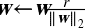

减少`r`增加了正则化的量，并有助于减少过拟合。 最大范数正则化还可以帮助减轻梯度消失/爆炸问题（如果不使用批归一化）。

要在 Keras 中实现最大范数正则，需要设置每个隐藏层的`kernel_constraint`的`max_norm()`为一个合适的值，如下所示：

```py
keras.layers.Dense(100, activation="elu", kernel_initializer="he_normal",
                   kernel_constraint=keras.constraints.max_norm(1.)) 
```

每次训练迭代之后，模型的`fit()`方法会调用`max_norm()`返回的对象，传给它层的权重，并返回缩放过的权重，再代替层的权重。第 12 章会看到，如果需要的话可以定义自己的约束函数。你还可以通过设置参数`bias_constraint`约束偏置项。

`max_norm()`函数有一个参数`axis`，默认为 0。紧密层权重的形状通常是[输入数，神经元数]，因此设置`axis=0`，意味最大范数约束会独立作用在每个神经元的权重向量上。如果你想对卷积层使用最大范数，一定要合理设置`axis`（通常`axis=[0,1,2]`）。

## 总结和实践原则

本章介绍了许多方法，读者可能纳闷到底该用哪个呢。用哪种方法要取决于任务，并没有统一的结论，表 11-3 的总结可用于大多数情况，不需要调节太多超参数。但是，也不要死守这些默认值！


表 11-3 默认 DNN 配置

如果网络只有紧密层，则可以是自归一化的，可以使用表 11-4 的配置。

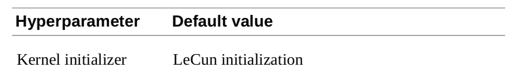

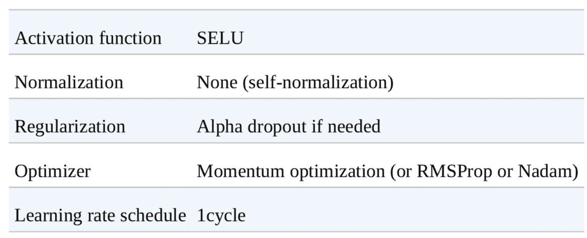

表 11-4 自归一化网络的 DNN 配置

不要忘了归一化输入特征！还应该尝试复用部分预训练模型，如果它处理的是一个想死任务，或者如果有许多无便数据时使用无监督预训练，或者有许多相似任务的标签数据时使用辅助任务的语序年。

虽然这些指导可以应对大部分情况，但有些例外：

*   如果需要系数模型，你可以使用ℓ1 正则（可以在训练后，将部分小权重设为零）。如果需要一个再稀疏点的模型，可以使用 TensorFlow Model Optimization Toolkit，它会破坏自归一化，所以要使用默认配置。

*   如果需要一个地延迟模型（预测快），层要尽量少，对前一层使用批归一化，使用更快的激活函数，比如 leaky ReLU 或 ReLU。稀疏模型也快。最后，将浮点精度从 32 位降到 16 位，甚至 8 位。还有，尝试 TF-MOT。

*   如果搭建的是风险敏感的模型，或者推断延迟不是非常重要，可以使用 MC 丢弃提升性能，得到更可靠的概率估计和不确定估计。

有了这些原则，就可以开始训练非常深的网络了。希望你现在对 Keras 有足够的自信。随着深入，可能需要写自定义的损失函数或调解训练算法。对于这样的情况，需要使用 TensorFlow 的低级 API，见下一章。

## 练习

1.  使用 He 初始化随机选择权重，是否可以将所有权重初始化为相同的值？

2.  可以将偏置初始化为 0 吗？

3.  说出 SELU 激活功能与 ReLU 相比的三个优点。

4.  在哪些情况下，您想要使用以下每个激活函数：SELU，leaky ReLU（及其变体），ReLU，tanh，logistic 以及 softmax？

5.  如果将`momentum`超参数设置得太接近 1（例如，0.99999），会发生什么情况？

6.  请列举您可以生成稀疏模型的三种方法。

7.  丢弃是否会减慢训练？ 它是否会减慢推断（即预测新的实例）？MC 丢弃呢？

8.  在 CIFAR10 图片数据集上训练一个深度神经网络：

    1.  建立一个 DNN，有 20 个隐藏层，每层 100 个神经元，使用 He 初始化和 ELU 激活函数。
    2.  使用 Nadam 优化和早停，尝试在 CIFAR10 上进行训练，可以使用`keras.datasets.cifar10.load_​data()`加载数据。数据集包括 60000 张`32x32`的图片（50000 张训练，10000 张测试）有 10 个类，所以需要 10 个神经元的 softmax 输出层。记得每次调整架构或超参数之后，寻找合适的学习率。
    3.  现在尝试添加批归一化并比较学习曲线：它是否比以前收敛得更快？ 它是否会产生更好的模型？对训练速度有何影响？
    4.  尝试用 SELU 替换批归一化，做一些调整，确保网络是自归一化的（即，标准化输入特征，使用 LeCun 正态初始化，确保 DNN 只含有紧密层）。
    5.  使用 alpha 丢弃正则化模型。然后，不训练模型，使用 MC 丢弃能否提高准确率。
    6.  用 1 循环调度重新训练模型，是否能提高训练速度和准确率。

参考答案见附录 A。

