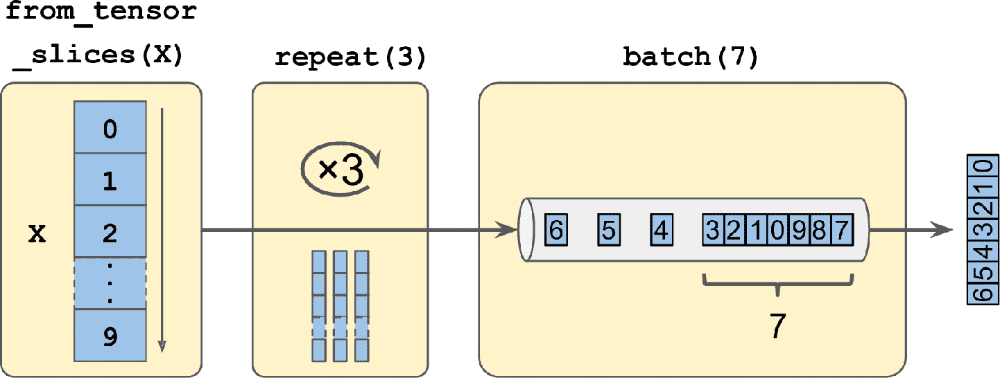
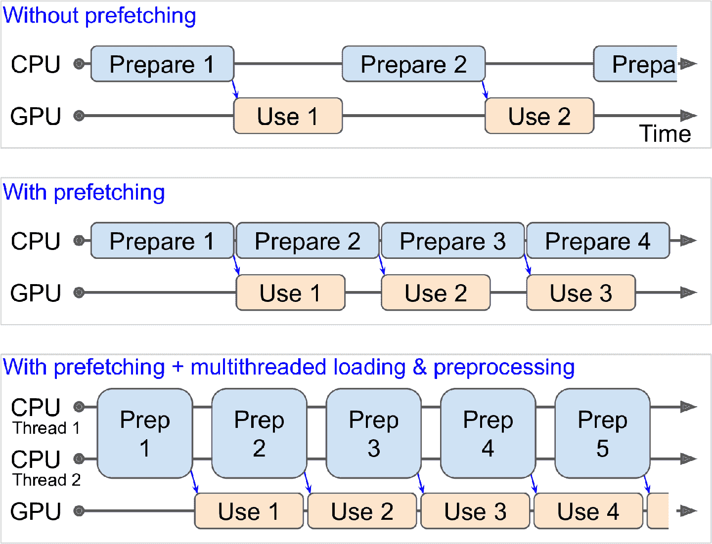
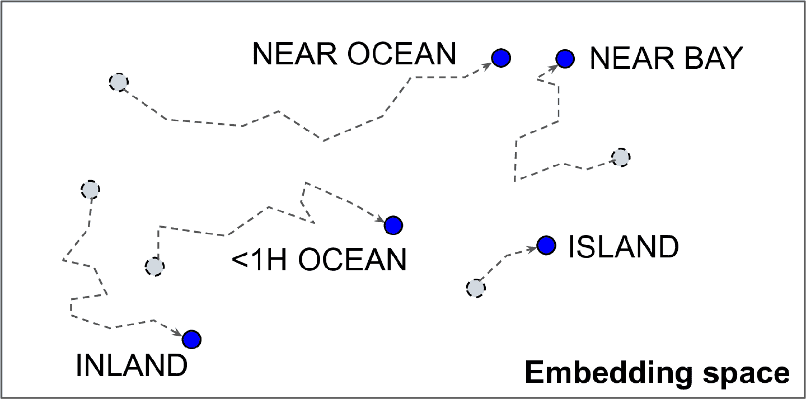
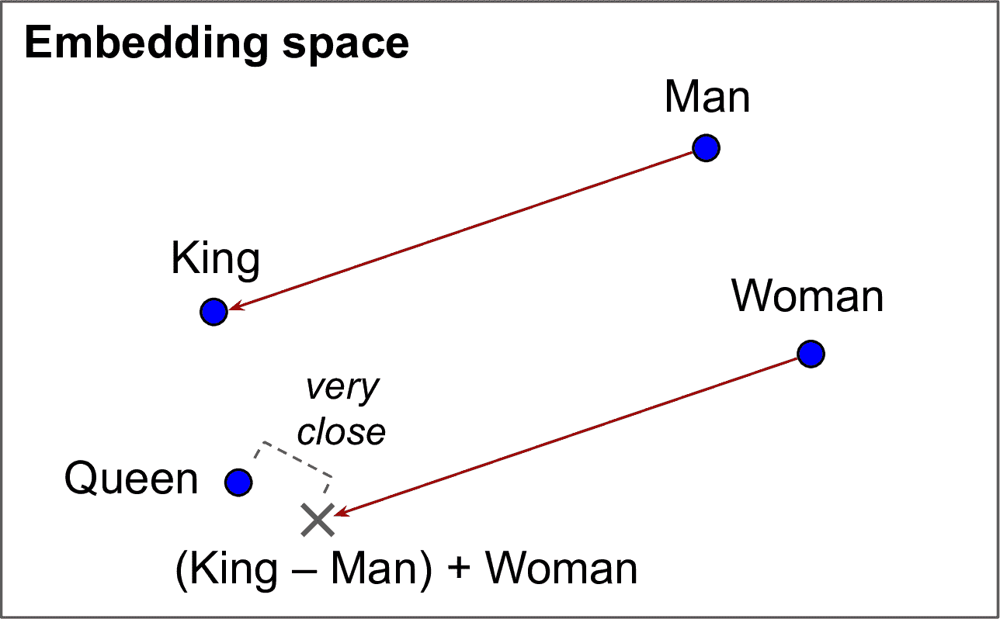

# 四、使用 TensorFlow 加载和预处理数据

> 译者：[@SeanCheney](https://www.jianshu.com/u/130f76596b02)


目前为止，我们只是使用了存放在内存中的数据集，但深度学习系统经常需要在大数据集上训练，而内存放不下大数据集。其它的深度学习库通过对大数据集做预处理，绕过了内存限制，但 TensorFlow 通过 Data API，使一切都容易了：只需要创建一个数据集对象，告诉它去哪里拿数据，以及如何做转换就行。TensorFlow 负责所有的实现细节，比如多线程、队列、批次和预提取。另外，Data API 和`tf.keras`可以无缝配合！

Data API 还可以从现成的文件（比如 CSV 文件）、固定大小的二进制文件、使用 TensorFlow 的 TFRecord 格式的文件（支持大小可变的记录）读取数据。TFRecord 是一个灵活高效的二进制格式，基于 Protocol Buffers（一个开源二进制格式）。Data API 还支持从 SQL 数据库读取数据。另外，许多开源插件也可以用来从各种数据源读取数据，包括谷歌的 BigQuery。

高效读取大数据集不是唯一的难点：数据还需要进行预处理，通常是归一化。另外，数据集中并不是只有数值字段：可能还有文本特征、类型特征，等等。这些特征需要编码，比如使用独热编码或嵌入（后面会看到，嵌入嵌入是用来标识类型或标记的紧密向量）。预处理的一种方式是写自己的自定义预处理层，另一种是使用 Kera 的标准预处理层。

本章中，我们会介绍 Data API，TFRecord 格式，以及如何创建自定义预处理层，和使用 Keras 的预处理层。还会快速学习 TensorFlow 生态的一些项目：

*   TF Transform (`tf.Transform`)：可以用来编写单独的预处理函数，它可以在真正训练前，运行在完整训练集的批模式中，然后输出到 TF 函数，插入到训练好的模型中。只要模型在生产环境中部署好了，就能随时预处理新的实例。

*   TF Datasets (TFDS)。提供了下载许多常见数据集的函数，包括 ImageNet，和数据集对象（可用 Data API 操作）。

## Data API

整个 Data API 都是围绕数据集`dataset`的概念展开的：可以猜得到，数据集表示一连串数据项。通常你是用的数据集是从硬盘里逐次读取数据的，简单起见，我们是用`tf.data.Dataset.from_tensor_slices()`创建一个存储于内存中的数据集：

```py
>>> X = tf.range(10)  # any data tensor
>>> dataset = tf.data.Dataset.from_tensor_slices(X)
>>> dataset
<TensorSliceDataset shapes: (), types: tf.int32> 
```

函数`from_tensor_slices()`取出一个张量，创建了一个`tf.data.Dataset`，它的元素是`X`的全部切片，因此这个数据集包括 10 项：张量 0、1、2、...、9。在这个例子中，使用`tf.data.Dataset.range(10)`也能达到同样的效果。

可以像下面这样对这个数据集迭代：

```py
>>> for item in dataset:
...     print(item)
...
tf.Tensor(0, shape=(), dtype=int32)
tf.Tensor(1, shape=(), dtype=int32)
tf.Tensor(2, shape=(), dtype=int32)
[...]
tf.Tensor(9, shape=(), dtype=int32) 
```

### 链式转换

有了数据集之后，通过调用转换方法，可以对数据集做各种转换。每个方法会返回一个新的数据集，因此可以将转换像下面这样链接起来（见图 13-1）：

```py
>>> dataset = dataset.repeat(3).batch(7)
>>> for item in dataset:
...     print(item)
...
tf.Tensor([0 1 2 3 4 5 6], shape=(7,), dtype=int32)
tf.Tensor([7 8 9 0 1 2 3], shape=(7,), dtype=int32)
tf.Tensor([4 5 6 7 8 9 0], shape=(7,), dtype=int32)
tf.Tensor([1 2 3 4 5 6 7], shape=(7,), dtype=int32)
tf.Tensor([8 9], shape=(2,), dtype=int32) 
```



图 13-1 链接数据集转换

在这个例子中，我们先在原始数据集上调用了`repeat()`方法，返回了一个重复了原始数据集 3 次的新数据集。当然，这步不会复制数据集中的数据三次（如果调用这个方法时没有加参数，新数据集会一直重复源数据集，必须让迭代代码决定何时退出）。然后我们在新数据集上调用了`batch()`方法，这步又产生了一个新数据集。这一步会将上一个数据集的分成 7 个一批次。最后，做一下迭代。可以看到，最后的批次只有两个元素，可以设置`drop_remainder=True`，丢弃最后的两项，将数据对齐。

> 警告：数据集方法不修改数据集，只是生成新的数据集而已，所以要做新数据集的赋值（即使用`dataset = ...`）。

还可以通过`map()`方法转换元素。比如，下面的代码创建了一个每个元素都翻倍的新数据集：

```py
>>> dataset = dataset.map(lambda x: x * 2) # Items: [0,2,4,6,8,10,12] 
```

这个函数可以用来对数据做预处理。有时可能会涉及复杂的计算，比如改变形状或旋转图片，所以通常需要多线程来加速：只需设置参数`num_parallel_calls`就行。注意，传递给`map()`方法的函数必须是可以转换为 TF 函数。

`map()`方法是对每个元素做转换的，`apply()`方法是对数据整体做转换的。例如，下面的代码对数据集应用了`unbatch()`函数（这个函数目前是试验性的，但很有可能加入到以后的版本中）。新数据集中的每个元素都是一个单整数张量，而不是批次大小为 7 的整数。

```py
>>> dataset = dataset.apply(tf.data.experimental.unbatch()) # Items: 0,2,4,... 
```

还可以用`filter()`方法做过滤：

```py
>>> dataset = dataset.filter(lambda x: x < 10) # Items: 0 2 4 6 8 0 2 4 6... 
```

`take()`方法可以用来查看数据：

```py
>>> for item in dataset.take(3):
...     print(item)
...
tf.Tensor(0, shape=(), dtype=int64)
tf.Tensor(2, shape=(), dtype=int64)
tf.Tensor(4, shape=(), dtype=int64) 
```

### 打散数据

当训练集中的实例是独立同分布时，梯度下降的效果最好（见第 4 章）。实现独立同分布的一个简单方法是使用`shuffle()`方法。它能创建一个新数据集，新数据集的前面是一个缓存，缓存中是源数据集的开头元素。然后，无论什么时候取元素，就会从缓存中随便随机取出一个元素，从源数据集中取一个新元素替换。从缓冲器取元素，直到缓存为空。必须要指定缓存的大小，最好大一点，否则随机效果不明显。不要查出内存大小，即使内存够用，缓存超过数据集也是没有意义的。可以提供一个随机种子，如果希望随机的顺序是固定的。例如，下面的代码创建并显示了一个包括 0 到 9 的数据集，重复 3 次，用大小为 5 的缓存做随机，随机种子是 42，批次大小是 7：

```py
>>> dataset = tf.data.Dataset.range(10).repeat(3) # 0 to 9, three times
>>> dataset = dataset.shuffle(buffer_size=5, seed=42).batch(7)
>>> for item in dataset:
...     print(item)
...
tf.Tensor([0 2 3 6 7 9 4], shape=(7,), dtype=int64)
tf.Tensor([5 0 1 1 8 6 5], shape=(7,), dtype=int64)
tf.Tensor([4 8 7 1 2 3 0], shape=(7,), dtype=int64)
tf.Tensor([5 4 2 7 8 9 9], shape=(7,), dtype=int64)
tf.Tensor([3 6], shape=(2,), dtype=int64) 
```

> 提示：如果在随机数据集上调用`repeat()`方法，默认下，每次迭代的顺序都是新的。通常这样没有问题，但如果你想让每次迭代的顺序一样（比如，测试或调试），可以设置`reshuffle_each_iteration=False`。

对于内存放不下的大数据集，这个简单的随机缓存方法就不成了，因为缓存相比于数据集就小太多了。一个解决方法是将源数据本身打乱（例如，Linux 可以用`shuf`命令打散文本文件）。这样肯定能提高打散的效果！即使源数据打散了，你可能还想再打散一点，否则每个周期可能还会出现同样的顺序，模型最后可能是偏的（比如，源数据顺序偶然导致的假模式）。为了将实例进一步打散，一个常用的方法是将源数据分成多个文件，训练时随机顺序读取。但是，相同文件中的实例仍然靠的太近。为了避免这点，可以同时随机读取多个文件，做交叉。在最顶层，可以用`shuffle()`加一个随机缓存。如果这听起来很麻烦，不用担心：Data API 都为你实现了，几行代码就行。

#### 多行数据交叉

首先，假设加载了加州房价数据集，打散它（除非已经打散了），分成训练集、验证集、测试集。然后将每个数据集分成多个 csv 文件，每个如下所示（每行包含 8 个输入特征加上目标中位房价）：

```py
MedInc,HouseAge,AveRooms,AveBedrms,Popul,AveOccup,Lat,Long,MedianHouseValue
3.5214,15.0,3.0499,1.1065,1447.0,1.6059,37.63,-122.43,1.442
5.3275,5.0,6.4900,0.9910,3464.0,3.4433,33.69,-117.39,1.687
3.1,29.0,7.5423,1.5915,1328.0,2.2508,38.44,-122.98,1.621
[...] 
```

再假设`train_filepaths`包括了训练文件路径的列表（还要`valid_filepaths`和`test_filepaths`）：

```py
>>> train_filepaths
['datasets/housing/my_train_00.csv', 'datasets/housing/my_train_01.csv',...] 
```

另外，可以使用文件模板，比如`train_filepaths = "datasets/housing/my_train_*.csv"`。现在，创建一个数据集，包括这些文件路径：

```py
filepath_dataset = tf.data.Dataset.list_files(train_filepaths, seed=42) 
```

默认，`list_files()`函数返回一个文件路径打散的数据集。也可以设置`shuffle=False`，文件路径就不打散了。

然后，可以调用`leave()`方法，一次读取 5 个文件，做交叉操作（跳过第一行表头，使用`skip()`方法）：

```py
n_readers = 5
dataset = filepath_dataset.interleave(
    lambda filepath: tf.data.TextLineDataset(filepath).skip(1),
    cycle_length=n_readers) 
```

`interleave()`方法会创建一个数据集，它从`filepath_dataset`读 5 条文件路径，对每条路径调用函数（例子中是用的匿名函数）来创建数据集（例子中是`TextLineDataset`）。为了更清楚点，这一步总欧诺个由七个数据集：文件路径数据集，交叉数据集，和五个`TextLineDatasets`数据集。当迭代交叉数据集时，会循环`TextLineDatasets`，每次读取一行，知道数据集为空。然后会从`filepath_dataset`再获取五个文件路径，做同样的交叉，直到文件路径为空。

> 提示：为了交叉得更好，最好让文件有相同的长度，否则长文件的尾部不会交叉。

默认情况下，`interleave()`不是并行的，只是顺序从每个文件读取一行。如果想变成并行读取文件，可以设定参数`num_parallel_calls`为想要的线程数（`map()`方法也有这个参数）。还可以将其设置为`tf.data.experimental.AUTOTUNE`，让 TensorFlow 根据 CPU 自己找到合适的线程数（目前这是个试验性的功能）。看看目前数据集包含什么：

```py
>>> for line in dataset.take(5):
...     print(line.numpy())
...
b'4.2083,44.0,5.3232,0.9171,846.0,2.3370,37.47,-122.2,2.782'
b'4.1812,52.0,5.7013,0.9965,692.0,2.4027,33.73,-118.31,3.215'
b'3.6875,44.0,4.5244,0.9930,457.0,3.1958,34.04,-118.15,1.625'
b'3.3456,37.0,4.5140,0.9084,458.0,3.2253,36.67,-121.7,2.526'
b'3.5214,15.0,3.0499,1.1065,1447.0,1.6059,37.63,-122.43,1.442' 
```

忽略表头行，这是五个 csv 文件的第一行，随机选取的。看起来不错。但是也看到了，都是字节串，需要解析数据，缩放数据。

### 预处理数据

实现一个小函数来做预处理：

```py
X_mean, X_std = [...] # mean and scale of each feature in the training set
n_inputs = 8

def preprocess(line):
  defs = [0.] * n_inputs + [tf.constant([], dtype=tf.float32)]
  fields = tf.io.decode_csv(line, record_defaults=defs)
  x = tf.stack(fields[:-1])
  y = tf.stack(fields[-1:])
  return (x - X_mean) / X_std, y 
```

逐行看下代码：

*   首先，代码假定已经算好了训练集中每个特征的平均值和标准差。`X_mean`和`X_std`是 1D 张量（或 NumPy 数组），包含八个浮点数，每个都是特征。

*   `preprocess()`函数从 csv 取一行，开始解析。使用`tf.io.decode_csv()`函数，接收两个参数，第一个是要解析的行，第二个是一个数组，包含 csv 文件每列的默认值。这个数组不仅告诉 TensorFlow 每列的默认值，还有总列数和数据类型。在这个例子中，是告诉 TensorFlow，所有特征列都是浮点数，缺失值默认为，但提供了一个类型是`tf.float32`的空数组，作为最后一列（目标）的默认值：数组告诉 TensorFlow 这一列包含浮点数，但没有默认值，所以碰到空值时会报异常。

*   `decode_csv()`函数返回一个标量张量（每列一个）的列表，但应该返回 1D 张量数组。所以在所有张量上调用了`tf.stack()`，除了最后一个。然后对目标值做同样的操作（让其成为只包含一个值，而不是标量张量的 1D 张量数组）。

*   最后，对特征做缩放，减去平均值，除以标准差，然后返回包含缩放特征和目标值的元组。

测试这个预处理函数：

```py
>>> preprocess(b'4.2083,44.0,5.3232,0.9171,846.0,2.3370,37.47,-122.2,2.782')
(<tf.Tensor: id=6227, shape=(8,), dtype=float32, numpy=
 array([ 0.16579159,  1.216324  , -0.05204564, -0.39215982, -0.5277444 ,
        -0.2633488 ,  0.8543046 , -1.3072058 ], dtype=float32)>,
 <tf.Tensor: [...], numpy=array([2.782], dtype=float32)>) 
```

很好，接下来将函数应用到数据集上。

### 整合

为了让代码可复用，将前面所有讨论过的东西编程一个小函数：创建并返回一个数据集，可以高效从多个 csv 文件加载加州房价数据集，做预处理、打散、选择性重复，做批次（见图 3-2）：

```py
def csv_reader_dataset(filepaths, repeat=1, n_readers=5,
                       n_read_threads=None, shuffle_buffer_size=10000,
                       n_parse_threads=5, batch_size=32):
    dataset = tf.data.Dataset.list_files(filepaths)
    dataset = dataset.interleave(
        lambda filepath: tf.data.TextLineDataset(filepath).skip(1),
        cycle_length=n_readers, num_parallel_calls=n_read_threads)
    dataset = dataset.map(preprocess, num_parallel_calls=n_parse_threads)
    dataset = dataset.shuffle(shuffle_buffer_size).repeat(repeat)
    return dataset.batch(batch_size).prefetch(1) 
```

代码条理很清晰，除了最后一行的`prefetch(1)`，对于提升性能很关键。

### 预提取

通过调用`prefetch(1)`，创建了一个高效的数据集，总能提前一个批次。换句话说，当训练算法在一个批次上工作时，数据集已经准备好下一个批次了（从硬盘读取数据并做预处理）。这样可以极大提升性能，解释见图 13-3。如果加载和预处理还要是多线程的（通过设置`interleave()`和`map()`的`num_parallel_calls`），可以利用多 CPU，准备批次数据可以比在 GPU 上训练还快：这样 GPU 就可以 100% 利用起来了（排除数据从 CPU 传输到 GPU 的时间），训练可以快很多。



图 13-3 通过预提取，让 CPU 和 GPU 并行工作：GPU 在一个批次上工作时，CPU 准备下一个批次

> 提示：如果想买一块 GPU 显卡的话，它的处理能力和显存都是非常重要的。另一个同样重要的，是显存带宽，即每秒可以进入或流出内存的 GB 数。

如果数据集不大，内存放得下，可以使用数据集的`cache()`方法将数据集存入内存。通常这步是在加载和预处理数据之后，在打散、重复、分批次之前。这样做的话，每个实例只需做一次读取和处理，下一个批次仍能提前准备。

你现在知道如何搭建高效输入管道，从多个文件加载和预处理数据了。我们讨论了最常用的数据集方法，但还有一些你可能感兴趣：`concatenate()`、`zip()`、`window()`、`reduce()`、`shard()`、`flat_map()`、和`padded_batch()`。还有两个类方法：`from_generator()`和`from_tensors()`，它们能从 Python 生成器或张量列表创建数据集。更多细节请查看 API 文档。`tf.data.experimental`中还有试验性功能，其中许多功能可能会添加到未来版本中。

### `tf.keras`使用数据集

现在可以使用`csv_reader_dataset()`函数为训练集创建数据集了。注意，不需要将数据重复，`tf.keras`会做重复。还为验证集和测试集创建了数据集：

```py
train_set = csv_reader_dataset(train_filepaths)
valid_set = csv_reader_dataset(valid_filepaths)
test_set = csv_reader_dataset(test_filepaths) 
```

现在就可以利用这些数据集来搭建和训练 Keras 模型了。我们要做的就是将训练和验证集传递给`fit()`方法，而不是`X_train`、`y_train`、`X_valid`、`y_valid`：

```py
model = keras.models.Sequential([...])
model.compile([...])
model.fit(train_set, epochs=10, validation_data=valid_set) 
```

相似的，可以将数据集传递给`evaluate()`和`predict()`方法：

```py
model.evaluate(test_set)
new_set = test_set.take(3).map(lambda X, y: X) # pretend we have 3 new instances
model.predict(new_set) # a dataset containing new instances 
```

跟其它集合不同，`new_set`通常不包含标签（如果包含标签，也会被 Keras 忽略）。注意，在所有这些情况下，还可以使用 NumPy 数组（但仍需要加载和预处理）。

如果你想创建自定义训练循环（就像 12 章那样），你可以在训练集上迭代：

```py
for X_batch, y_batch in train_set:
    [...] # perform one Gradient Descent step 
```

事实上，还可以创建一个 TF 函数（见第 12 章）来完成整个训练循环：

```py
@tf.function
def train(model, optimizer, loss_fn, n_epochs, [...]):
    train_set = csv_reader_dataset(train_filepaths, repeat=n_epochs, [...])
for X_batch, y_batch in train_set:
        with tf.GradientTape() as tape:
            y_pred = model(X_batch)
            main_loss = tf.reduce_mean(loss_fn(y_batch, y_pred))
            loss = tf.add_n([main_loss] + model.losses)
        grads = tape.gradient(loss, model.trainable_variables)
        optimizer.apply_gradients(zip(grads, model.trainable_variables)) 
```

祝贺，你现在知道如何使用 Data API 创建强大的输入管道了！但是，目前为止我们使用的 CSV 文件，虽然常见又简单方便，但不够高效，不支持大或复杂的数据结构（比如图片或音频）。这就是 TFRecord 要解决的。

> 提示：如果你对 csv 文件感到满意（或其它任意格式），就不必使用 TFRecord。就像老话说的，只要没坏就别修！TFRecord 是为解决训练过程中加载和解析数据时碰到的瓶颈。

## TFRecord 格式

TFRecord 格式是 TensorFlow 偏爱的存储大量数据并高效读取的数据。它是非常简单的二进制格式，只包含不同大小的二进制记录的数据（每个记录包括一个长度、一个 CRC 校验和，校验和用于检查长度是否正确，真是的数据，和一个数据的 CRC 校验和，用于检查数据是否正确）。可以使用`tf.io.TFRecordWriter`类轻松创建 TFRecord 文件：

```py
with tf.io.TFRecordWriter("my_data.tfrecord") as f:
    f.write(b"This is the first record")
    f.write(b"And this is the second record") 
```

然后可以使用`tf.data.TFRecordDataset`来读取一个或多个 TFRecord 文件：

```py
filepaths = ["my_data.tfrecord"]
dataset = tf.data.TFRecordDataset(filepaths)
for item in dataset:
    print(item) 
```

输出是：

```py
tf.Tensor(b'This is the first record', shape=(), dtype=string)
tf.Tensor(b'And this is the second record', shape=(), dtype=string) 
```

> 提示：默认情况下，`TFRecordDataset`会逐一读取数据，但通过设定`num_parallel_reads`可以并行读取并交叉数据。另外，你可以使用`list_files()`和`interleave()`获得同样的结果。

### 压缩 TFRecord 文件

有的时候压缩 TFRecord 文件很有必要，特别是当需要网络传输的时候。你可以通过设定`options`参数，创建压缩的 TFRecord 文件：

```py
options = tf.io.TFRecordOptions(compression_type="GZIP")
with tf.io.TFRecordWriter("my_compressed.tfrecord", options) as f:
  [...] 
```

当读取压缩 TFRecord 文件时，需要指定压缩类型：

```py
dataset = tf.data.TFRecordDataset(["my_compressed.tfrecord"],
                                  compression_type="GZIP") 
```

### 简要介绍协议缓存

即便每条记录可以使用任何二进制格式，TFRecord 文件通常包括序列化的协议缓存（也称为 protobuf）。这是一种可移植、可扩展的高效二进制格式，是谷歌在 2001 年开发，并在 2008 年开源的；协议缓存现在使用广泛，特别是在 gRPC，谷歌的远程调用系统中。定义语言如下：

```py
syntax = "proto3";
message Person {
  string name = 1;
  int32 id = 2;
  repeated string email = 3;
} 
```

定义写道，使用的是协议缓存的版本 3，指定每个`Person`对象可以有一个`name`，类型是字符串，类型是`int32`的`id`，0 个或多个`email`字段，每个都是字符串。数字 1、2、3 是字段标识符：用于每条数据的二进制表示。当你在`.proto`文件中有了一个定义，就可以编译了。这就需要`protoc`，协议缓存编译器，来生成 Python（或其它语言）的访问类。注意，要使用的缓存协议的定义已经编译好了，它们的 Python 类是 TensorFlow 的一部分，所以就不必使用`protoc`了。你需要知道的知识如何使用 Python 的缓存协议访问类。为了讲解，看一个简单的例子，使用访问类来生成`Person`缓存协议：

```py
>>> from person_pb2 import Person  # 引入生成的访问类
>>> person = Person(name="Al", id=123, email=["a@b.com"])  # 创建一个 Person
>>> print(person)  # 展示 Person
name: "Al"
id: 123
email: "a@b.com"
>>> person.name  # 读取一个字段
"Al"
>>> person.name = "Alice"  # 修改一个字段
>>> person.email[0]  # 重复的字段可以像数组一样访问
"a@b.com"
>>> person.email.append("c@d.com")  # 添加 email 地址
>>> s = person.SerializeToString()  # 将对象序列化为字节串
>>> s
b'\n\x05Alice\x10{\x1a\x07a@b.com\x1a\x07c@d.com'
>>> person2 = Person()  # 创建一个新 Person
>>> person2.ParseFromString(s)  #解析字节串（字节长度 27）
27
>>> person == person2  # 现在相等
True 
```

简而言之，我们引入了`protoc`生成的类`Person`，创建了一个实例，展示、读取、并写入新字段，然后使用`SerializeToString()`将其序列化。序列化的数据就可以保存或通过网络传输了。当读取或接收二进制数据时，可以使用`ParseFromString()`方法来解析，就得到了序列化对象的复制。

可以将序列化的`Person`对象存储为 TFRecord 文件，然后可以加载和解析。但是`SerializeToString()`和`ParseFromString()`不是 TensorFlow 运算（这段代码中的其它代码也不是 TensorFlow 运算），因此 TensorFlow 函数中不能含有这两个方法（除非将其包装进`tf.py_function()`运算，但会使代码速度变慢，移植性变差）。幸好，TensorFlow 还有提供了解析运算的特殊协议缓存。

### TensorFlow 协议缓存

TFRecord 文件主要使用的协议缓存是`Example`，它表示数据集中的一个实例，包括命名特征的列表，每个特征可以是字节串列表、或浮点列表、或整数列表。下面是一个协议缓存的定义：

```py
syntax = "proto3";
message BytesList { repeated bytes value = 1; }
message FloatList { repeated float value = 1 [packed = true]; }
message Int64List { repeated int64 value = 1 [packed = true]; }
message Feature {
    oneof kind {
        BytesList bytes_list = 1;
        FloatList float_list = 2;
        Int64List int64_list = 3;
    }
};
message Features { map<string, Feature> feature = 1; };
message Example { Features features = 1; }; 
```

`BytesList`、`FloatList`、`Int64List`的定义都很清楚。注意，重复的数值字段使用了`[packed = true]`，目的是高效编码。`Feature`包含的是`BytesList`、`FloatList`、`Int64List`三者之一。`Features`（带`s`）是包含特征名和对应特征值的字典。最后，一个`Example`值包含一个`Features`对象。下面是一个如何创建`tf.train.Example`的例子，表示的是之前同样的人，并存储为 TFRecord 文件：

```py
from tensorflow.train import BytesList, FloatList, Int64List
from tensorflow.train import Feature, Features, Example

person_example = Example(
    features=Features(
        feature={
            "name": Feature(bytes_list=BytesList(value=[b"Alice"])),
            "id": Feature(int64_list=Int64List(value=[123])),
            "emails": Feature(bytes_list=BytesList(value=[b"a@b.com",
                                                          b"c@d.com"]))
        })) 
```

这段代码有点冗长和重复，但很清晰（可以很容易将其包装起来）。现在有了`Example`协议缓存，可以调用`SerializeToString()`方法将其序列化，然后将结果数据存入 TFRecord 文件：

```py
with tf.io.TFRecordWriter("my_contacts.tfrecord") as f:
    f.write(person_example.SerializeToString()) 
```

通常需要写不止一个`Example`！一般来说，你需要写一个转换脚本，读取当前格式（例如 csv），为每个实例创建`Example`协议缓存，序列化并存储到若干 TFRecord 文件中，最好再打散。这些需要花费不少时间，如有必要再这么做（也许 CSV 文件就足够了）。

有了序列化好的`Example`TFRecord 文件之后，就可以加载了。

### 加载和解析 Example

要加载序列化的`Example`协议缓存，需要再次使用`tf.data.TFRecordDataset`，使用`tf.io.parse_single_example()`解析每个`Example`。这是一个 TensorFlow 运算，所以可以包装进 TF 函数。它至少需要两个参数：一个包含序列化数据的字符串标量张量，和每个特征的描述。描述是一个字典，将每个特征名映射到`tf.io.FixedLenFeature`描述符，描述符指明特征的形状、类型和默认值，或（当特征列表长度可能变化时，比如`"email"特征`）映射到`tf.io.VarLenFeature`描述符，它只指向类型。

下面的代码定义了描述字典，然后迭代`TFRecordDataset`，解析序列化的`Example`协议缓存：

```py
feature_description = {
    "name": tf.io.FixedLenFeature([], tf.string, default_value=""),
    "id": tf.io.FixedLenFeature([], tf.int64, default_value=0),
    "emails": tf.io.VarLenFeature(tf.string),
}

for serialized_example in tf.data.TFRecordDataset(["my_contacts.tfrecord"]):
    parsed_example = tf.io.parse_single_example(serialized_example,
                                                feature_description) 
```

长度固定的特征会像常规张量那样解析，而长度可变的特征会作为稀疏张量解析。可以使用`tf.sparse.to_dense()`将稀疏张量转变为紧密张量，但只是简化了值的访问：

```py
>>> tf.sparse.to_dense(parsed_example["emails"], default_value=b"")
<tf.Tensor: [...] dtype=string, numpy=array([b'a@b.com', b'c@d.com'], [...])>
>>> parsed_example["emails"].values
<tf.Tensor: [...] dtype=string, numpy=array([b'a@b.com', b'c@d.com'], [...])> 
```

`BytesList`可以包含任意二进制数据，序列化对象也成。例如，可以使用`tf.io.encode_jpeg()`将图片编码为 JPEG 格式，然后将二进制数据放入`BytesList`。然后，当代码读取`TFRecord`时，会从解析`Example`开始，再调用`tf.io.decode_jpeg()`解析数据，得到原始图片（或者可以使用`tf.io.decode_image()`，它能解析任意`BMP`、`GIF`、`JPEG`、`PNG`格式）。你还可以通过`tf.io.serialize_tensor()`序列化张量，将结果字节串放入`BytesList`特征，将任意张量存储在`BytesList`中。之后，当解析`TFRecord`时，可以使用`tf.io.parse_tensor()`解析数据。

除了使用`tf.io.parse_single_example()`逐一解析`Example`，你还可以通过`tf.io.parse_example()`逐批次解析：

```py
dataset = tf.data.TFRecordDataset(["my_contacts.tfrecord"]).batch(10)
for serialized_examples in dataset:
    parsed_examples = tf.io.parse_example(serialized_examples,
                                          feature_description) 
```

可以看到`Example`协议缓存对大多数情况就足够了。但是，如果处理的是嵌套列表，就会比较麻烦。比如，假设你想分类文本文档。每个文档可能都是句子的列表，而每个句子又是词的列表。每个文档可能还有评论列表，评论又是词的列表。可能还有上下文数据，比如文档的作者、标题和出版日期。TensorFlow 的`SequenceExample`协议缓存就是为了处理这种情况的。

### 使用`SequenceExample`协议缓存处理嵌套列表

下面是`SequenceExample`协议缓存的定义：

```py
message FeatureList { repeated Feature feature = 1; };
message FeatureLists { map<string, FeatureList> feature_list = 1; };
message SequenceExample {
    Features context = 1;
    FeatureLists feature_lists = 2;
}; 
```

`SequenceExample`包括一个上下文数据的`Features`对象，和一个包括一个或多个命名`FeatureList`对象（比如，一个`FeatureList`命名为`"content"`，另一个命名为`"comments"`）的`FeatureLists`对象。每个`FeatureList`包含`Feature`对象的列表，每个`Feature`对象可能是字节串、64 位整数或浮点数的列表（这个例子中，每个`Feature`表示的是一个句子或一条评论，格式或许是词的列表）。创建`SequenceExample`，将其序列化、解析，和创建、序列化、解析`Example`很像，但必须要使用`tf.io.parse_single_sequence_example()`来解析单个的`SequenceExample`或用`tf.io.parse_sequence_example()`解析一个批次。两个函数都是返回一个包含上下文特征（字典）和特征列表（也是字典）的元组。如果特征列表包含大小可变的序列（就像前面的例子），可以将其转化为嵌套张量，使用`tf.RaggedTensor.from_sparse()`：

```py
parsed_context, parsed_feature_lists = tf.io.parse_single_sequence_example(
    serialized_sequence_example, context_feature_descriptions,
    sequence_feature_descriptions)
parsed_content = tf.RaggedTensor.from_sparse(parsed_feature_lists["content"]) 
```

现在你就知道如何高效存储、加载和解析数据了，下一步是准备数据。

## 预处理输入特征

为神经网络准备数据需要将所有特征转变为数值特征，做一些归一化工作等等。特别的，如果数据包括类型特征或文本特征，也需要转变为数字。这些工作可以在准备数据文件的时候做，使用 NumPy、Pandas、Scikit-Learn 这样的工作。或者，可以在用 Data API 加载数据时，实时预处理数据（比如，使用数据集的`map()`方法，就像前面的例子），或者可以给模型加一个预处理层。接下来，来看最后一种方法。

例如，这个例子是使用`Lambda`层实现标准化层。对于每个特征，减去其平均值，再除以标准差（再加上一个平滑项，避免 0 除）：

```py
means = np.mean(X_train, axis=0, keepdims=True)
stds = np.std(X_train, axis=0, keepdims=True)
eps = keras.backend.epsilon()
model = keras.models.Sequential([
    keras.layers.Lambda(lambda inputs: (inputs - means) / (stds + eps)),
    [...] # 其它层
]) 
```

并不难。但是，你也许更想要一个独立的自定义层（就像 Scikit-Learn 的`StandardScaler`），而不是像`means`和`stds`这样的全局变量：

```py
class Standardization(keras.layers.Layer):
    def adapt(self, data_sample):
        self.means_ = np.mean(data_sample, axis=0, keepdims=True)
        self.stds_ = np.std(data_sample, axis=0, keepdims=True)
    def call(self, inputs):
        return (inputs - self.means_) / (self.stds_ + keras.backend.epsilon()) 
```

使用这个标准化层之前，你需要使用`adapt()`方法将其适配到数据集样本。这么做就能使用每个特征的平均值和标准差：

```py
std_layer = Standardization()
std_layer.adapt(data_sample) 
```

这个样本必须足够大，可以代表数据集，但不必是完整的训练集：通常几百个随机实例就够了（但还是要取决于任务）。然后，就可以像普通层一样使用这个预处理层了：

```py
model = keras.Sequential()
model.add(std_layer)
[...] # create the rest of the model
model.compile([...])
model.fit([...]) 
```

可能以后还会有`keras.layers.Normalization`层，和这个自定义`Standardization`层差不多：先创建层，然后对数据集做适配（向`adapt()`方法传递样本），最后像普通层一样使用。

接下来看看类型特征。先将其编码为独热向量。

### 使用独热向量编码类型特征

考虑下第 2 章中的加州房价数据集的`ocean_proximity`特征：这是一个类型特征，有五个值：`"<1H OCEAN"`、`"INLAND"`、`"NEAR OCEAN"`、`"NEAR BAY"`、`"ISLAND"`。输入给神经网络之前，需要对其进行编码。因为类型不多，可以使用独热编码。先将每个类型映射为索引（0 到 4），使用一张查询表：

```py
vocab = ["<1H OCEAN", "INLAND", "NEAR OCEAN", "NEAR BAY", "ISLAND"]
indices = tf.range(len(vocab), dtype=tf.int64)
table_init = tf.lookup.KeyValueTensorInitializer(vocab, indices)
num_oov_buckets = 2
table = tf.lookup.StaticVocabularyTable(table_init, num_oov_buckets) 
```

逐行看下代码：

*   先定义词典：也就是所有类型的列表。

*   然后创建张量，具有索引 0 到 4。

*   接着，创建查找表的初始化器，传入类型列表和对应索引。在这个例子中，因为已经有了数据，所以直接用`KeyValueTensorInitializer`就成了；但如果类型是在文本中（一行一个类型），就要使用`TextFileInitializer`。

*   最后两行创建了查找表，传入初始化器并指明未登录词（oov）桶的数量。如果查找的类型不在词典中，查找表会计算这个类型的哈希，使用哈希分配一个未知的类型给未登录词桶。索引序号接着现有序号，所以这个例子中的两个未登录词的索引是 5 和 6。

为什么使用桶呢？如果类型数足够大（例如，邮编、城市、词、产品、或用户），数据集也足够大，或者数据集持续变化，这样的话，获取类型的完整列表就不容易了。一个解决方法是根据数据样本定义（而不是整个训练集），为其它不在样本中的类型加上一些未登录词桶。训练中碰到的未知类型越多，要使用的未登录词桶就要越多。事实上，如果未登录词桶的数量不够，就会发生碰撞：不同的类型会出现在同一个桶中，所以神经网络就无法区分了。

现在用查找表将小批次的类型特征编码为独热向量：

```py
>>> categories = tf.constant(["NEAR BAY", "DESERT", "INLAND", "INLAND"])
>>> cat_indices = table.lookup(categories)
>>> cat_indices
<tf.Tensor: id=514, shape=(4,), dtype=int64, numpy=array([3, 5, 1, 1])>
>>> cat_one_hot = tf.one_hot(cat_indices, depth=len(vocab) + num_oov_buckets)
>>> cat_one_hot
<tf.Tensor: id=524, shape=(4, 7), dtype=float32, numpy=
array([[0., 0., 0., 1., 0., 0., 0.],
       [0., 0., 0., 0., 0., 1., 0.],
       [0., 1., 0., 0., 0., 0., 0.],
       [0., 1., 0., 0., 0., 0., 0.]], dtype=float32)> 
```

可以看到，`"NEAR BAY"`映射到了索引 3，未知类型`"DESERT"`映射到了两个未登录词桶之一（索引 5），`"INLAND"`映射到了索引 1 两次。然后使用`tf.one_hot()`来做独热编码。注意，需要告诉该函数索引的总数量，索引总数等于词典大小加上未登录词桶的数量。现在你就知道如何用 TensorFlow 将类型特征编码为独热向量了。

和之前一样，将这些操作写成一个独立的类并不难。`adapt()`方法接收一个数据样本，提取其中的所有类型。创建一张查找表，将类型和索引映射起来。`call()`方法会使用查找表将输入类型和索引建立映射。目前，Keras 已经有了一个名为`keras.layers.TextVectorization`的层，它的功能就是上面这样：`adapt()`从样本中提取词表，`call()`将每个类型映射到词表的索引。如果要将索引变为独热向量的话，可以将这个层添加到模型开始的地方，后面根生一个可以用`tf.one_hot()`的`Lambda`层。

这可能不是最佳解决方法。每个独热向量的大小是词表长度加上未登录词桶的大小。当类型不多时，这么做可以，但如果词表很大，最好使用“嵌入“来做。

> 提示：一个重要的原则，如果类型数小于 10，可以使用独热编码。如果类型超过 50 个（使用哈希桶时通常如此），最好使用嵌入。类型数在 10 和 50 之间时，最好对两种方法做个试验，看哪个更合适。

### 使用嵌入编码类型特征

嵌入是一个可训练的表示类型的紧密向量。默认时，嵌入是随机初始化的，`"NEAR BAY"`可能初始化为`[0.131, 0.890]`，`"NEAR OCEAN"`可能初始化为`[0.631, 0.791]`。

这个例子中，使用的是 2D 嵌入，维度是一个可调节的超参数。因为嵌入是可以训练的，它能在训练中提高性能；当嵌入表示相似的类时，梯度下降会使相似的嵌入靠的更近，而`"INLAND"`会偏的更远（见图 13-4）。事实上，表征的越好，越利于神经网络做出准确的预测，而训练会让嵌入更好的表征类型，这被称为表征学习（第 17 章会介绍其它类型的表征学习）。



图 13-4 嵌入的表征会在训练中提高

> 词嵌入
> 
> 嵌入不仅可以实现当前任务的表征，同样的嵌入也可以用于其它的任务。最常见的例子是词嵌入（即，单个词的嵌入）：对于自然语言处理任务，最好使用预训练的词嵌入，而不是使用自己训练的。
> 
> 使用向量表征词可以追溯到 1960 年代，许多复杂的技术用于生成向量，包括使用神经网络。进步发生在 2013 年，Tomáš Mikolov 和谷歌其它的研究院发表了一篇论文[《Distributed Representations of Words and Phrases and their Compositionality》](https://links.jianshu.com/go?to=https%3A%2F%2Farxiv.org%2Fabs%2F1310.4546)，介绍了一种用神经网络学习词嵌入的技术，效果远超以前的技术。可以实现在大文本语料上学习嵌入：用神经网络预测给定词附近的词，得到了非常好的词嵌入。例如，同义词有非常相近的词嵌入，语义相近的词，比如法国、西班牙和意大利靠的也很近。
> 
> 不止是相近：词嵌入在嵌入空间的轴上的分布也是有意义的。下面是一个著名的例子：如果计算`King – Man + Woman`，结果与`Queen`非常相近（见图 13-5）。换句话，词嵌入编码了性别。相似的，可以计算`Madrid – Spain + France`，结果和`Paris`很近。
> 
> 
> 
> 图 13-5 相似词的词嵌入也相近，一些轴编码了概念
> 
> 但是，词嵌入有时偏差很大。例如，尽管词嵌入学习到了男人是国王，女人是王后，词嵌入还学到了男人是医生、女人是护士。这是非常大的性别偏差。

来看下如何手动实现嵌入。首先，需要创建一个包含每个类型嵌入（随机初始化）的嵌入矩阵。每个类型就有一行，每个未登录词桶就有一行，每个嵌入维度就有一列：

```py
embedding_dim = 2
embed_init = tf.random.uniform([len(vocab) + num_oov_buckets, embedding_dim])
embedding_matrix = tf.Variable(embed_init) 
```

这个例子用的是 2D 嵌入，通常的嵌入是 10 到 300 维，取决于任务和词表大小（需要调节词表大小超参数）。

嵌入矩阵是一个随机的`6 × 2`矩阵，存入一个变量（因此可以在训练中被梯度下降调节）：

```py
>>> embedding_matrix
<tf.Variable 'Variable:0' shape=(6, 2) dtype=float32, numpy=
array([[0.6645621 , 0.44100678],
       [0.3528825 , 0.46448255],
       [0.03366041, 0.68467236],
       [0.74011743, 0.8724445 ],
       [0.22632635, 0.22319686],
       [0.3103881 , 0.7223358 ]], dtype=float32)> 
```

使用嵌入编码之前的类型特征：

```py
>>> categories = tf.constant(["NEAR BAY", "DESERT", "INLAND", "INLAND"])
>>> cat_indices = table.lookup(categories)
>>> cat_indices
<tf.Tensor: id=741, shape=(4,), dtype=int64, numpy=array([3, 5, 1, 1])>
>>> tf.nn.embedding_lookup(embedding_matrix, cat_indices)
<tf.Tensor: id=864, shape=(4, 2), dtype=float32, numpy=
array([[0.74011743, 0.8724445 ],
       [0.3103881 , 0.7223358 ],
       [0.3528825 , 0.46448255],
       [0.3528825 , 0.46448255]], dtype=float32)> 
```

`tf.nn.embedding_lookup()`函数根据给定的索引在嵌入矩阵中查找行。例如，查找表说`"INLAND"`类型位于索引 1，`tf.nn.embedding_lookup()`就返回嵌入矩阵的行 1：`[0.3528825, 0.46448255]`。

Keras 提供了`keras.layers.Embedding`层来处理嵌入矩阵（默认可训练）；当这个层初始化时，会随机初始化嵌入矩阵，当被调用时，就返回索引所在的嵌入矩阵的那行：

```py
>>> embedding = keras.layers.Embedding(input_dim=len(vocab) + num_oov_buckets,
...                                    output_dim=embedding_dim)
...
>>> embedding(cat_indices)
<tf.Tensor: id=814, shape=(4, 2), dtype=float32, numpy=
array([[ 0.02401174,  0.03724445],
       [-0.01896119,  0.02223358],
       [-0.01471175, -0.00355174],
       [-0.01471175, -0.00355174]], dtype=float32)> 
```

将这些内容放到一起，创建一个 Keras 模型，可以处理类型特征（和数值特征），学习每个类型（和未登录词）的嵌入：

```py
regular_inputs = keras.layers.Input(shape=[8])
categories = keras.layers.Input(shape=[], dtype=tf.string)
cat_indices = keras.layers.Lambda(lambda cats: table.lookup(cats))(categories)
cat_embed = keras.layers.Embedding(input_dim=6, output_dim=2)(cat_indices)
encoded_inputs = keras.layers.concatenate([regular_inputs, cat_embed])
outputs = keras.layers.Dense(1)(encoded_inputs)
model = keras.models.Model(inputs=[regular_inputs, categories],
                           outputs=[outputs]) 
```

这个模型有两个输入：一个常规输入，每个实例包括 8 个数值特征，机上一个类型特征。使用`Lambda`层查找每个类型的索引，然后用索引查找嵌入。接着，将嵌入和常规输入连起来，作为编码输入进神经网络。此时可以加入任意种类的神经网络，但只是添加了一个紧密输出层。

当`keras.layers.TextVectorization`准备好之后，可以调用它的`adapt()`方法，从数据样本提取词表（会自动创建查找表）。然后加入到模型中，就可以执行索引查找了（替换前面代码的`Lambda`层）。

> 笔记：独热编码加紧密层（没有激活函数和偏差项），等价于嵌入层。但是，嵌入层用的计算更少（嵌入矩阵越大，性能差距越明显）。紧密层的权重矩阵扮演的是嵌入矩阵的角色。例如，大小为 20 的独热向量和 10 个单元的紧密层加起来，等价于`input_dim=20`、`output_dim=10`的嵌入层。作为结果，嵌入的维度超过后面的层的神经元数是浪费的。

再进一步看看 Keras 的预处理层。

### Keras 预处理层

Keras 团队打算提供一套标准的 Keras 预处理层，现在已经可用了，[链接](https://links.jianshu.com/go?to=https%3A%2F%2Fgithub.com%2Fkeras-team%2Fgovernance%2Fblob%2Fmaster%2Frfcs%2F20190502-preprocessing-layers.md)。新的 API 可能会覆盖旧的 Feature Columns API。

我们已经讨论了其中的两个：`keras.layers.Normalization`用来做特征标准化，`TextVectorization`层用于将文本中的词编码为词典的索引。对于这两个层，都是用数据样本调用它的`adapt()`方法，然后如常使用。其它的预处理层也是这么使用的。

API 中还提供了`keras.layers.Discretization`层，它能将连续数据切成不同的组，将每个组斌吗为独热向量。例如，可以用它将价格分成是三类，低、中、高，编码为`[1, 0, 0]`、`[0, 1, 0]`、`[0, 0, 1]`。当然，这么做会损失很多信息，但有时，相对于连续数据，这么做可以发现不那么明显的规律。

> 警告：`Discretization`层是不可微的，只能在模型一开始使用。事实上，模型的预处理层会在训练时冻结，因此预处理层的参数不会被梯度下降影响，所以可以是不可微的。这还意味着，如果想让预处理层可训练的话，不能在自定义预处理层上直接使用嵌入层，而是应该像前民的例子那样分开来做。

还可以用类`PreprocessingStage`将多个预处理层链接起来。例如，下面的代码创建了一个预处理管道，先将输入归一化，然后离散（有点类似 Scikit-Learn 的管道）。当将这个管道应用到数据样本时，可以作为常规层使用（还得是在模型的前部，因为包含不可微分的预处理层）：

```py
normalization = keras.layers.Normalization()
discretization = keras.layers.Discretization([...])
pipeline = keras.layers.PreprocessingStage([normalization, discretization])
pipeline.adapt(data_sample) 
```

`TextVectorization`层也有一个选项用于输出词频向量，而不是词索引。例如，如果词典包括三个词，比如`["and", "basketball", "more"]`，则`"more and more"`会映射为`[1, 0, 2]`：`"and"`出现了一次，`"basketball"`没有出现，`"more"`出现了两次。这种词表征称为词袋，因为它完全失去了词的顺序。常见词，比如`"and"`，会在文本中有更高的值，尽管没什么实际意义。因此，词频向量中应该降低常见词的影响。一个常见的方法是将词频除以出现该词的文档数的对数。这种方法称为词频-逆文档频率（TF-IDF）。例如，假设`"and"`、`"basketball"`、`"more"`分别出现在了 200、10、100 个文档中：最终的向量应该是`[1/log(200), 0/log(10), 2/log(100)]`，大约是`[0.19, 0., 0.43]`。`TextVectorization`层会有 TF-IDF 的选项。

> 笔记：如果标准预处理层不能满足你的任务，你还可以选择创建自定义预处理层，就像前面的`Standardization`。创建一个`keras.layers.PreprocessingLayer`子类，`adapt()`方法用于接收一个`data_sample`参数，或者再有一个`reset_state`参数：如果是`True`，则`adapt()`方法在计算新状态之前重置现有的状态；如果是`False`，会更新现有的状态。

可以看到，这些 Keras 预处理层可以使预处理更容易！现在，无论是自定义预处理层，还是使用 Keras 的，预处理都可以实时进行了。但在训练中，最好再提前进行预处理。下面来看看为什么，以及怎么做。

## TF Transform

预处理非常消耗算力，训练前做预处理相对于实时处理，可以极大的提高速度：数据在训练前，每个实例就处理一次，而不是在训练中每个实例在每个周期就处理一次。前面提到过，如果数据集小到可以存入内存，可以使用`cache()`方法。但如果太大，可以使用 Apache Beam 或 Spark。它们可以在大数据上做高效的数据预处理，还可以分布进行，使用它们就能在训练前处理所有训练数据了。

虽然训练加速了，但带来一个问题：一旦模型训练好了，假如想部署到移动 app 上，还是需要写一些预处理数据的代码。假如想部署到 TensorFlow.js，还是需要预处理代码。这是一个维护难题：无论何时想改变预处理逻辑，都需要更新 Apache Beam 的代码、移动端代码、JavaScript 代码。不仅耗时，也容易出错：不同端的可能有细微的差别。训练/实际产品表现之间的偏差会导致 bug 或使效果大打折扣。

一种解决办法是在部署到 app 或浏览器之前，给训练好的模型加上额外的预处理层，来做实时的预处理。这样好多了，只有两套代码 Apache Beam 或 Spark 代码，和预处理层代码。

如果只需定义一次预处理操作呢？这就是 TF Transform 要做的。TF Transform 是 [TensorFlow Extended (TFX)](https://links.jianshu.com/go?to=https%3A%2F%2Ftensorflow.org%2Ftfx) 的一部分，这是一个端到端的 TensorFlow 模型生产化平台。首先，需要安装（TensorFlow 没有捆绑）。然后通过 TF Transform 函数来做缩放、分桶等操作，一次性定义预处理函数。你还可以使用任意需要的 TensorFlow 运算。如果只有两个特征，预处理函数可能如下：

```py
import tensorflow_transform as tft

def preprocess(inputs):  # inputs = 输入特征批次
    median_age = inputs["housing_median_age"]
    ocean_proximity = inputs["ocean_proximity"]
    standardized_age = tft.scale_to_z_score(median_age)
    ocean_proximity_id = tft.compute_and_apply_vocabulary(ocean_proximity)
    return {
        "standardized_median_age": standardized_age,
        "ocean_proximity_id": ocean_proximity_id
    } 
```

然后，TF Transform 可以使用 Apache Beam（可以使用其`AnalyzeAndTransformDataset`类）在整个训练集上应用这个`preprocess()`函数。在使用过程中，还会计算整个训练集上的必要统计数据：这个例子中，是`housing_median_age`和`the ocean_proximity`的平均值和标准差。计算这些数据的组件称为分析器。

更重要的，TF Transform 还会生成一个等价的 TensorFlow 函数，可以放入部署的模型中。这个 TF 函数包括一些常量，对应于 Apache Beam 的统计值（平均值、标准差和词典）。

有了 Data API、TFRecord，Keras 预处理层和 TF Transform，可以为训练搭建高度伸缩的输入管道，可以是生产又快，迁移性又好。

但是，如果只想使用标准数据集呢？只要使用 TFDS 就成了。

## TensorFlow Datasets（TFDS）项目

从 [TensorFlow Datasets](https://links.jianshu.com/go?to=https%3A%2F%2Ftensorflow.org%2Fdatasets) 项目，可以非常方便的下载一些常见的数据集，从小数据集，比如 MNIST 或 Fashion MNIST，到大数据集，比如 ImageNet（需要大硬盘）。包括了图片数据集、文本数据集（包括翻译数据集）、和音频视频数据集。可以访问[这里](https://links.jianshu.com/go?to=https%3A%2F%2Fwww.tensorflow.org%2Fdatasets%2Fdatasets)，查看完整列表，每个数据集都有介绍。

TensorFlow 没有捆绑 TFDS，所以需要使用 PIP 安装库`tensorflow-datasets`。然后调用函数`tfds.load()`，就能下载数据集了（除非之前下载过），返回的数据是数据集的字典（通常是一个是训练集，一个是测试集）。例如，下载 MNIST：

```py
import tensorflow_datasets as tfds

dataset = tfds.load(name="mnist")
mnist_train, mnist_test = dataset["train"], dataset["test"] 
```

然后可以对其应用任意转换（打散、批次、预提取），然后就可以训练模型了。下面是一个简单的例子：

```py
mnist_train = mnist_train.shuffle(10000).batch(32).prefetch(1)
for item in mnist_train:
    images = item["image"]
    labels = item["label"]
    [...] 
```

> 提示：`load()`函数打散了每个下载的数据分片（只是对于训练集）。但还不够，最好再自己做打散。

注意，数据集中的每一项都是一个字典，包含特征和标签。但 Keras 期望每项都是一个包含两个元素（特征和标签）的元组。可以使用`map()`对数据集做转换，如下：

```py
mnist_train = mnist_train.shuffle(10000).batch(32)
mnist_train = mnist_train.map(lambda items: (items["image"], items["label"]))
mnist_train = mnist_train.prefetch(1) 
```

更简单的方式是让`load()`函数来做这个工作，只要设定`as_supervised=True`（显然这只适用于有标签的数据集）。你还可以将数据集直接传给`tf.keras`模型：

```py
dataset = tfds.load(name="mnist", batch_size=32, as_supervised=True)
mnist_train = dataset["train"].prefetch(1)
model = keras.models.Sequential([...])
model.compile(loss="sparse_categorical_crossentropy", optimizer="sgd")
model.fit(mnist_train, epochs=5) 
```

这一章很技术，你可能觉得没有神经网络的抽象美，但事实是深度学习经常要涉及大数据集，知道如果高效加载、解析和预处理，是一个非常重要的技能。下一章会学习卷积神经网络，它是一种用于图像处理和其它应用的、非常成功的神经网络。

## 练习

1.  为什么要使用 Data API ？

2.  将大数据分成多个文件有什么好处？

3.  训练中，如何断定输入管道是瓶颈？如何处理瓶颈？

4.  可以将任何二进制数据存入 TFRecord 文件吗，还是只能存序列化的协议缓存？

5.  为什么要将数据转换为示例协议缓存？为什么不使用自己的协议缓存？

6.  使用 TFRecord 时，什么时候要压缩？为什么不系统化的做？

7.  数据预处理可以在写入数据文件时，或在`tf.data`管道中，或在预处理层中，或使用 TF Transform。这几种方法各有什么优缺点？

8.  说出几种常见的编码类型特征的方法。文本如何编码？

9.加载 Fashion MNIST 数据集；将其分成训练集、验证集和测试集；打散训练集；将每个数据及村委多个 TFRecord 文件。每条记录应该是有两个特征的序列化的示例协议缓存：序列化的图片（使用`tf.io.serialize_tensor()`序列化每张图片），和标签。然后使用`tf.data`为每个集合创建一个高效数据集。最后，使用 Keras 模型训练这些数据集，用预处理层标准化每个特征。让输入管道越高效越好，使用 TensorBoard 可视化地分析数据。

10.  在这道题中，你要下载一个数据集，分割它，创建一个`tf.data.Dataset`，用于高效加载和预处理，然后搭建一个包含嵌入层的二分类模型：

a. 下载 [Large Movie Review Dataset](https://links.jianshu.com/go?to=https%3A%2F%2Fhoml.info%2Fimdb)，它包含 50000 条 IMDB 的影评。数据分为两个目录，`train`和`test`，每个包含 12500 条正面评价和 12500 条负面评价。每条评价都存在独立的文本文件中。还有其他文件和文件夹（包括预处理的词袋），但这个练习中用不到。

b. 将测试集分给成验证集（15000）和测试集（10000）。

c. 使用`tf.data`，为每个集合创建高效数据集。

d. 创建一个二分类模型，使用`TextVectorization`层来预处理每条影评。如果`TextVectorization`层用不了（或者你想挑战下），则创建自定义的预处理层：使用`tf.strings`包中的函数，比如`lower()`来做小写，`regex_replace()`来替换带有空格的标点，`split()`来分割词。用查找表输出词索引，`adapt()`方法中要准备好。

e. 加入嵌入层，计算每条评论的平均嵌入，乘以词数的平方根。这个缩放过的平均嵌入可以传入剩余的模型中。

f. 训练模型，看看准确率能达到多少。尝试优化管道，让训练越快越好。

g. 使用 TFDS 加载同样的数据集：`tfds.load("imdb_reviews")`。

参考答案见附录 A。

