# 六、使用 RNN 和 CNN 处理序列

> 译者：[@SeanCheney](https://www.jianshu.com/u/130f76596b02)


击球手击出垒球，外场手会立即开始奔跑，并预测球的轨迹。外场手追踪球，不断调整移动步伐，最终在观众的掌声中抓到它。无论是在听完朋友的话还是早餐时预测咖啡的味道，你时刻在做的事就是在预测未来。在本章中，我们将讨论循环神经网络，一类可以预测未来的网络（当然，是到某一点为止）。它们可以分析时间序列数据，比如股票价格，并告诉你什么时候买入和卖出。在自动驾驶系统中，他们可以预测行车轨迹，避免发生事故。更一般地说，它们可在任意长度的序列上工作，而不是截止目前我们讨论的只能在固定长度的输入上工作的网络。举个例子，它们可以将语句，文件，以及语音范本作为输入，应用在在自动翻译，语音到文本的自然语言处理应用中。

在本章中，我们将学习循环神经网络的基本概念，如何使用时间反向传播训练网络，然后用来预测时间序列。然后，会讨论 RNN 面对的两大难点：

*   不稳定梯度（换句话说，在第 11 章中讨论的梯度消失/爆炸），可以使用多种方法缓解，包括循环丢弃和循环层归一化。

*   有限的短期记忆，可以通过 LSTM 和 GRU 单元延长。

RNN 不是唯一能处理序列数据的神经网络：对于小序列，常规紧密网络也可以；对于长序列，比如音频或文本，卷积神经网络也可以。我们会讨论这两种方法，本章最后会实现一个 WaveNet：这是一种 CNN 架构，可以处理上万个时间步的序列。在第 16 章，还会继续学习 RNN，如何使用 RNN 来做自然语言处理，和基于注意力机制的新架构。

## 循环神经元和层

到目前为止，我们主要关注的是前馈神经网络，激活仅从输入层到输出层的一个方向流动（附录 E 中的几个网络除外）。 循环神经网络看起来非常像一个前馈神经网络，除了它也有连接指向后方。 让我们看一下最简单的 RNN，由一个神经元接收输入，产生一个输出，并将输出发送回自己，如图 15-1（左）所示。 在每个时间步`t`（也称为一个帧），这个循环神经元接收输入`x[t]`以及它自己的前一时间步长`y[t - 1]`的输出。 因为第一个时间步骤没有上一次的输出，所以是 0。可以用时间轴来表示这个微小的网络，如图 15-1（右）所示。 这被称为随时间展开网络。

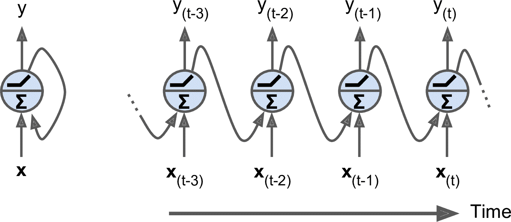

图 15-1 循环神经网络（左），随时间展开网络（右）

你可以轻松创建一个循环神经元层。 在每个时间步`t`，每个神经元都接收输入向量`x[t]`和前一个时间步`y[t - 1]`的输出向量，如图 15-2 所示。 注意，输入和输出都是向量（当只有一个神经元时，输出是一个标量）。


图 15-2 一层循环神经元（左），及其随时间展开（右）

每个循环神经元有两组权重：一组用于输入`x[t]`，另一组用于前一时间步长`y[t - 1]`的输出。 我们称这些权重向量为`w[x]`和`w[y]`。如果考虑的是整个循环神经元层，可以将所有权重向量放到两个权重矩阵中，`W[x]`和`W[y]`。整个循环神经元层的输出可以用公式 15-1 表示（`b`是偏差项，`φ(·)`是激活函数，例如 ReLU）。

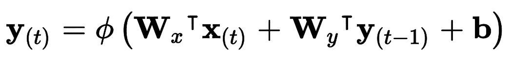

公式 15-1 单个实例的循环神经元层的输出

就像前馈神经网络一样，可以将所有输入和时间步`t`放到输入矩阵`X[t]`中，一次计算出整个小批次的输出：（见公式 15-2）。

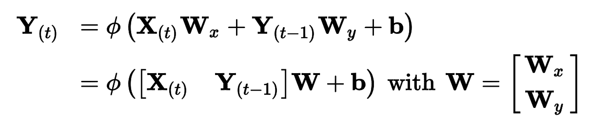

公式 15-2 小批次实例的循环层输出

在这个公式中：

*   `Y[t]`是`m × n_neurons`矩阵，包含在小批次中每个实例在时间步`t`的层输出（`m`是小批次中的实例数，`n_neurons`是神经元数）。
*   `X[t]`是`m × n_inputs`矩阵，包含所有实例的输入 （`n_inputs`是输入特征的数量）。
*   `W[x]`是`n_inputs × n_neurons`矩阵，包含当前时间步的输入的连接权重。
*   `W[y]`是`n_neurons × n_neurons`矩阵，包含上一个时间步的输出的连接权重。
*   `b`是大小为`n_neurons`的向量，包含每个神经元的偏置项。
*   权重矩阵`W[x]`和`W[y]`通常纵向连接成一个权重矩阵`W`，形状为`(n_inputs + n_neurons) × n_neurons`（见公式 15-2 的第二行）

注意，`Y[t]`是`X[t]`和`Y[t - 1]`的函数，`Y[t - 1]`是`X[t - 1]`和`Y[t - 2]`的函数，以此类推。这使得`Y[t]`是从时间`t = 0`开始的所有输入（即`X[0]`，`X[1]`，...，`X[t]`）的函数。 在第一个时间步，`t = 0`，没有以前的输出，所以它们通常被假定为全零。

### 记忆单元

由于时间`t`的循环神经元的输出，是由所有先前时间步骤计算出来的的函数，你可以说它有一种记忆形式。神经网络的一部分，保留一些跨越时间步长的状态，称为存储单元（或简称为单元）。单个循环神经元或循环神经元层是非常基本的单元，只能学习短期规律（取决于具体任务，通常是 10 个时间步）。本章后面我们将介绍一些更为复杂和强大的单元，可以学习更长时间步的规律（也取决于具体任务，大概是 100 个时间步）。

一般情况下，时间步`t`的单元状态，记为`h[t]`（`h`代表“隐藏”），是该时间步的某些输入和前一时间步状态的函数：`h[t] = f(h[t - 1], x[t])`。 其在时间步`t`的输出，表示为`y[t]`，也和前一状态和当前输入的函数有关。 我们已经讨论过的基本单元，输出等于单元状态，但是在更复杂的单元中并不总是如此，如图 15-3 所示。

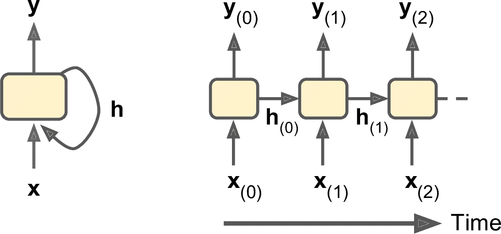

图 15-3 单元的隐藏状态和输出可能不同

## 输入和输出序列

RNN 可以同时输入序列并输出序列（见图 15-4，左上角的网络）。这种序列到序列的网络可以有效预测时间序列（如股票价格）：输入过去`N`天价格，则输出向未来移动一天的价格（即，从`N - 1`天前到明天）。

或者，你可以向网络输入一个序列，忽略除最后一项之外的所有输出（图 15-4 右上角的网络）。 换句话说，这是一个序列到向量的网络。 例如，你可以向网络输入与电影评论相对应的单词序列，网络输出情感评分（例如，从`-1 [讨厌]`到`+1 [喜欢]`）。

相反，可以向网络一遍又一遍输入相同的向量（见图 15-4 的左下角），输出一个序列。这是一个向量到序列的网络。 例如，输入可以是图像（或是 CNN 的结果），输出是该图像的标题。

最后，可以有一个序列到向量的网络，称为编码器，后面跟着一个称为解码器的向量到序列的网络（见图 15-4 右下角）。 例如，这可以用于将句子从一种语言翻译成另一种语言。 给网络输入一种语言的一句话，编码器会把这个句子转换成单一的向量表征，然后解码器将这个向量解码成另一种语言的句子。 这种称为编码器 - 解码器的两步模型，比用单个序列到序列的 RNN 实时地进行翻译要好得多，因为句子的最后一个单词可以影响翻译的第一句话，所以你需要等到听完整个句子才能翻译。第 16 章还会介绍如何实现编码器-解码器（会比图 15-4 中复杂）

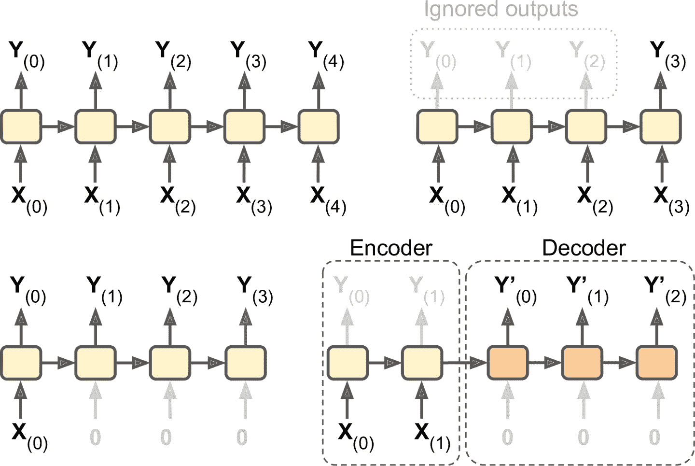

图 15-4 序列到序列（左上），序列到向量（右上），向量到序列（左下），延迟序列到序列（右下）

## 训练 RNN

训练 RNN 诀窍是在时间上展开（就像我们刚刚做的那样），然后只要使用常规反向传播（见图 15-5）。 这个策略被称为时间上的反向传播（BPTT）。

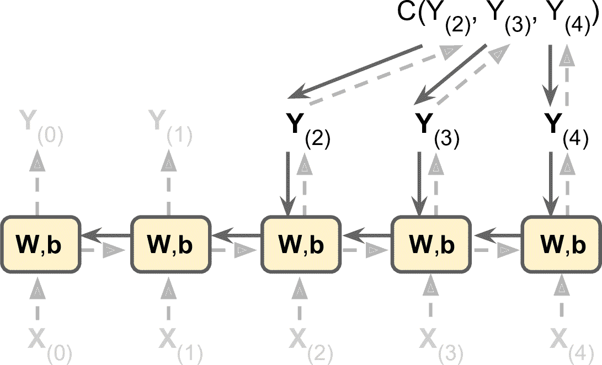

图 15-5 随时间反向传播

就像在正常的反向传播中一样，展开的网络（用虚线箭头表示）中先有一个正向传播（虚线）。然后使用损失函数`C(Y[0], Y[1], …Y[T]])`评估输出序列（其中`T`是最大时间步）。这个损失函数会忽略一些输出，见图 15-5（例如，在序列到向量的 RNN 中，除了最后一项，其它的都被忽略了）。损失函数的梯度通过展开的网络反向传播（实线箭头）。最后使用在 BPTT 期间计算的梯度来更新模型参数。注意，梯度在损失函数所使用的所有输出中反向流动，而不仅仅通过最终输出（例如，在图 15-5 中，损失函数使用网络的最后三个输出`Y[2]`，`Y[3]`和`Y[4]`，所以梯度流经这三个输出，但不通过`Y[0]`和`Y[1]`。而且，由于在每个时间步骤使用相同的参数`W`和`b`，所以反向传播将做正确的事情并对所有时间步求和。

幸好，`tf.keras`处理了这些麻烦。

## 预测时间序列

假设你在研究网站每小时的活跃用户数，或是所在城市的每日气温，或公司的财务状况，用多种指标做季度衡量。在这些任务中，数据都是一个序列，每步有一个或多个值。这被称为时间序列。在前两个任务中，每个时间步只有一个值，它们是单变量时间序列。在财务状况的任务中，每个时间步有多个值（利润、欠账，等等），所以是多变量时间序列。典型的任务是预测未来值，称为“预测”。另一个任务是填空：预测（或“后测”）过去的缺失值，这被称为“填充”。例如，图 15-6 展示了 3 个单变量时间序列，每个都有 50 个时间步，目标是预测下一个时间步的值（用`X`表示）。

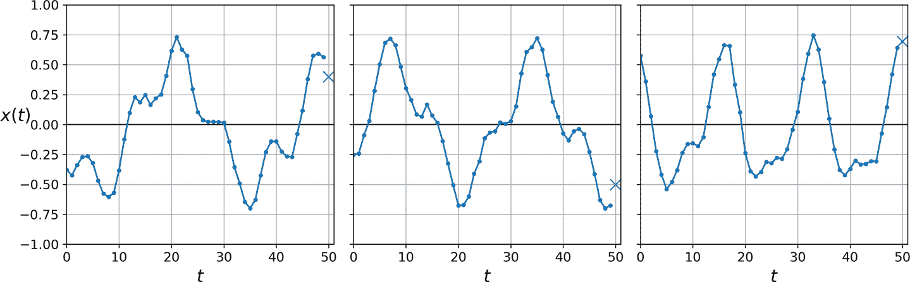

图 15-6 时间序列预测

简单起见，使用函数`generate_time_series()`生成的时间序列，如下：

```py
def generate_time_series(batch_size, n_steps):
    freq1, freq2, offsets1, offsets2 = np.random.rand(4, batch_size, 1)
    time = np.linspace(0, 1, n_steps)
    series = 0.5 * np.sin((time - offsets1) * (freq1 * 10 + 10))  #   wave 1
    series += 0.2 * np.sin((time - offsets2) * (freq2 * 20 + 20)) # + wave 2
    series += 0.1 * (np.random.rand(batch_size, n_steps) - 0.5)   # + noise
    return series[..., np.newaxis].astype(np.float32) 
```

这个函数可以根据要求创建出时间序列（通过`batch_size`参数），长度为`n_steps`，每个时间步只有 1 个值。函数返回 NumPy 数组，形状是[批次大小, 时间步数, 1]，每个序列是两个正弦波之和（固定强度+随机频率和相位），加一点噪音。

> 笔记：当处理时间序列时（和其它类型的时间序列），输入特征通常用 3D 数组来表示，其形状是`[批次大小, 时间步数, 维度]`，对于单变量时间序列，其维度是 1，多变量时间序列的维度是其维度数。

用这个函数来创建训练集、验证集和测试集：

```py
n_steps = 50
series = generate_time_series(10000, n_steps + 1)
X_train, y_train = series[:7000, :n_steps], series[:7000, -1]
X_valid, y_valid = series[7000:9000, :n_steps], series[7000:9000, -1]
X_test, y_test = series[9000:, :n_steps], series[9000:, -1] 
```

`X_train`包含 7000 个时间序列（即，形状是 [7000, 50, 1]），`X_valid`有 2000 个，`X_test`有 1000 个。因为预测的是单一值，目标值是列向量（`y_train`的形状是`[7000, 1]`）。

### 基线模型

使用 RNN 之前，最好有基线指标，否则做出来的模型可能比基线模型还糟。例如，最简单的方法，是预测每个序列的最后一个值。这个方法被称为朴素预测，有时很难被超越。在这个例子中，它的均方误差为 0.020：

```py
>>> y_pred = X_valid[:, -1]
>>> np.mean(keras.losses.mean_squared_error(y_valid, y_pred))
0.020211367 
```

另一个简单的方法是使用全连接网络。因为结果要是打平的特征列表，需要加一个`Flatten`层。使用简单线性回归模型，使预测值是时间序列中每个值的线性组合：

```py
model = keras.models.Sequential([
    keras.layers.Flatten(input_shape=[50, 1]),
    keras.layers.Dense(1)
]) 
```

使用 MSE 损失、Adam 优化器编译模型，在训练集上训练 20 个周期，用验证集评估，最终得到的 MSE 值为 0.004。比朴素预测强多了！

### 实现一个简单 RNN

搭建一个简单 RNN 模型：

```py
model = keras.models.Sequential([
  keras.layers.SimpleRNN(1, input_shape=[None, 1])
]) 
```

这是能实现的最简单的 RNN。只有 1 个层，1 个神经元，如图 15-1。不用指定输入序列的长度（和之前的模型不同），因为循环神经网络可以处理任意的时间步（这就是为什么将第一个输入维度设为`None`）。默认时，`SimpleRNN`使用双曲正切激活函数。和之前看到的一样：初始状态`h[init]`设为 0，和时间序列的第一个值`x[0]`一起传递给神经元。神经元计算这两个值的加权和，对结果使用双曲正切激活函数，得到第一个输出`y[0]`。在简单 RNN 中，这个输出也是新状态`h[0]`。这个新状态和下一个输入值`x[1]`，按照这个流程，直到输出最后一个值，`y[49]`。所有这些都是同时对每个时间序列进行的。

> 笔记：默认时，Keras 的循环层只返回最后一个输出。要让其返回每个时间步的输出，必须设置`return_sequences=True`。

用这个模型编译、训练、评估（和之前一样，用 Adam 训练 20 个周期），你会发现它的 MSE 只有 0.014。击败了朴素预测，但不如简单线性模型。对于每个神经元，线性简单模型中每个时间步骤每个输入就有一个参数（前面用过的简单线性模型一共有 51 个参数）。相反，对于简单 RNN 中每个循环神经元，每个输入每个隐藏状态只有一个参数（在简单 RNN 中，就是每层循环神经元的数量），加上一个偏置项。在这个简单 RNN 中，只有三个参数。

> 趋势和季节性
> 
> 还有其它预测时间序列的模型，比如权重移动平均模型或自动回归集成移动平均（ARIMA）模型。某些模型需要先移出趋势和季节性。例如，如果要研究网站的活跃用户数，它每月会增长 10%，就需要去掉这个趋势。训练好模型之后，在做预测时，你可以将趋势加回来做最终的预测。相似的，如果要预测防晒霜的每月销量，会观察到明显的季节性：每年夏天卖的多。需要将季节性从时间序列去除，比如计算每个时间步和前一年的差值（这个方法被称为差分）。然后，当训练好模型，做预测时，可以将季节性加回来，来得到最终结果。
> 
> 使用 RNN 时，一般不需要做这些，但在有些任务中可以提高性能，因为模型不是非要学习这些趋势或季节性。

很显然，这个简单 RNN 过于简单了，性能不成。下面就来添加更多的循环层！

### 深度 RNN

将多个神经元的层堆起来，见图 15-7。就形成了深度 RNN。

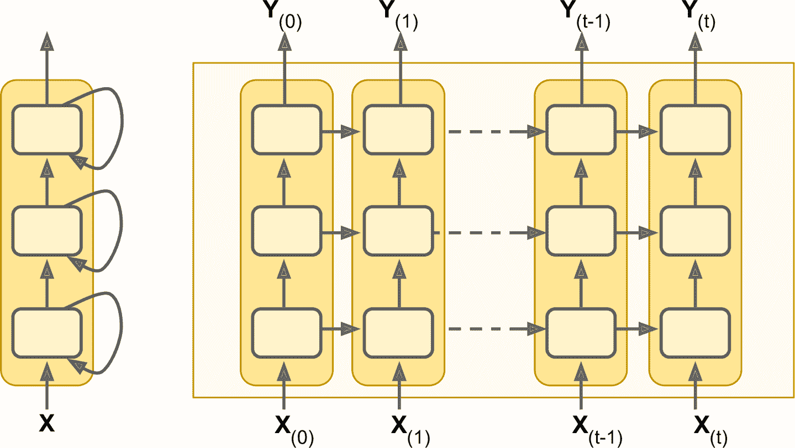

图 15-7 深度 RNN（左）和随时间展开的深度 RNN（右）

用`tf.keras`实现深度 RNN 相当容易：将循环层堆起来就成。在这个例子中，我们使用三个`SimpleRNN`层（也可以添加其它类型的循环层，比如 LSTM 或 GRU）：

```py
model = keras.models.Sequential([
    keras.layers.SimpleRNN(20, return_sequences=True, input_shape=[None, 1]),
    keras.layers.SimpleRNN(20, return_sequences=True),
    keras.layers.SimpleRNN(1)
]) 
```

> 警告：所有循环层一定要设置`return_sequences=True`（除了最后一层，因为最后一层只关心输出）。如果没有设置，输出的是 2D 数组（只有最终时间步的输出），而不是 3D 数组（包含所有时间步的输出），下一个循环层就接收不到 3D 格式的序列数据。

如果对这个模型做编译，训练和评估，其 MSE 值可以达到 0.003。总算打败了线性模型！

最后一层不够理想：因为要预测单一值，每个时间步只能有一个输出值，最终层只能有一个神经元。但是一个神经元意味着隐藏态只有一个值。RNN 大部分使用其他循环层的隐藏态的所有信息，最后一层的隐藏态不怎么用到。另外，因为`SimpleRNN`层默认使用 tanh 激活函数，预测值位于 -1 和 1 之间。想使用另一个激活函数该怎么办呢？出于这些原因，最好使用紧密层：运行更快，准确率差不多，可以选择任何激活函数。如果做了替换，要将第二个循环层的`return_sequences=True`删掉：

```py
model = keras.models.Sequential([
    keras.layers.SimpleRNN(20, return_sequences=True, input_shape=[None, 1]),
    keras.layers.SimpleRNN(20),
    keras.layers.Dense(1)
]) 
```

如果训练这个模型，会发现它收敛更快，效果也不错。

### 提前预测几个时间步

目前为止我们只是预测下一个时间步的值，但也可以轻易地提前预测几步，只要改变目标就成（例如，要提前预测 10 步，只要将目标变为 10 步就成）。但如果想预测后面的 10 个值呢？

第一种方法是使用训练好的模型，预测出下一个值，然后将这个值添加到输入中（假设这个预测值真实发生了），使用这个模型再次预测下一个值，依次类推，见如下代码：

```py
series = generate_time_series(1, n_steps + 10)
X_new, Y_new = series[:, :n_steps], series[:, n_steps:]
X = X_new
for step_ahead in range(10):
    y_pred_one = model.predict(X[:, step_ahead:])[:, np.newaxis, :]
    X = np.concatenate([X, y_pred_one], axis=1)

Y_pred = X[:, n_steps:] 
```

想象的到，第一个预测值比后面的更准，因为错误可能会累积（见图 15-8）。如果在验证集上评估这个方法，MSE 值为 0.029。MSE 比之前高多了，但因为任务本身难，这个对比意义不大。将其余朴素预测（预测时间序列可以恒定 10 个步骤）或简单线性模型对比的意义更大。朴素方法效果很差（MSE 值为 0.223），线性简单模型的 MSE 值为 0.0188：比 RNN 的预测效果好，并且还快。如果只想在复杂任务上提前预测几步的话，这个方法就够了。

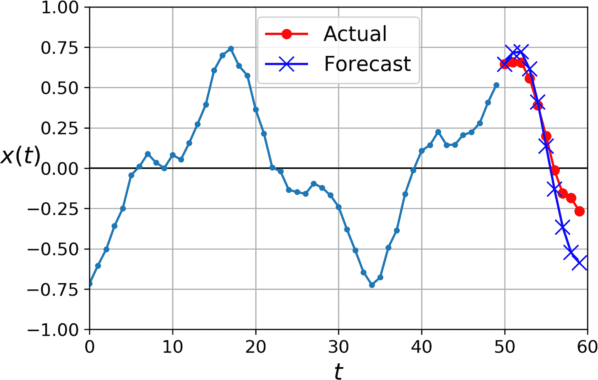

图 15-8 提前预测 10 步，每次 1 步

第二种方法是训练一个 RNN，一次性预测出 10 个值。还可以使用序列到向量模型，但输出的是 10 个值。但是，我们先需要修改向量，时期含有 10 个值：

```py
series = generate_time_series(10000, n_steps + 10)
X_train, Y_train = series[:7000, :n_steps], series[:7000, -10:, 0]
X_valid, Y_valid = series[7000:9000, :n_steps], series[7000:9000, -10:, 0]
X_test, Y_test = series[9000:, :n_steps], series[9000:, -10:, 0] 
```

然后使输出层有 10 个神经元：

```py
model = keras.models.Sequential([
    keras.layers.SimpleRNN(20, return_sequences=True, input_shape=[None, 1]),
    keras.layers.SimpleRNN(20),
    keras.layers.Dense(10)
]) 
```

训练好这个模型之后，就可以一次预测出后面的 10 个值了：

```py
Y_pred = model.predict(X_new) 
```

这个模型的效果不错：预测 10 个值的 MSE 值为 0.008。比线性模型强多了。但还有继续改善的空间，除了在最后的时间步用训练模型预测接下来的 10 个值，还可以在每个时间步预测接下来的 10 个值。换句话说，可以将这个序列到向量的 RNN 变成序列到序列的 RNN。这种方法的优势，是损失会包含 RNN 的每个时间步的输出项，不仅是最后时间步的输出。这意味着模型中会流动着更多的误差梯度，梯度不必只通过时间流动；还可以从输出流动。这样可以稳定和加速训练。

更加清楚一点，在时间步 0，模型输出一个包含时间步 1 到 10 的预测向量，在时间步 1，模型输出一个包含时间步 2 到 11 的预测向量，以此类推。因此每个目标必须是一个序列，其长度和输入序列长度相同，每个时间步包含一个 10 维向量。先准备目标序列：

```py
Y = np.empty((10000, n_steps, 10)) # each target is a sequence of 10D vectors
for step_ahead in range(1, 10 + 1):
    Y[:, :, step_ahead - 1] = series[:, step_ahead:step_ahead + n_steps, 0]
Y_train = Y[:7000]
Y_valid = Y[7000:9000]
Y_test = Y[9000:] 
```

> 笔记：目标要包含出现在输入中的值（`X_train` 和 `Y_train`有许多重复），听起来很奇怪。这不是作弊吗？其实不是：在每个时间步，模型只知道过去的时间步，不能向前看。这个模型被称为因果模型。

要将模型变成序列到序列的模型，必须给所有循环层（包括最后一个）设置`return_sequences=True`，还必须在每个时间步添加紧密输出层。出于这个目的，Keras 提供了`TimeDistributed`层：它将任意层（比如，紧密层）包装起来，然后在输入序列的每个时间步上使用。通过变形输入，将每个时间步处理为独立实例（即，将输入从`[批次大小, 时间步数, 输入维度]`变形为`[批次大小 × 时间步数, 输入维度]`；在这个例子中，因为前一`SimpleRNN`有 20 个神经元，输入的维度数是 20），这个层的效率很高。然后运行紧密层，最后将输出变形为序列（即，将输出从`[批次大小 × 时间步数, 输出维度]`变形为`[批次大小, 时间步数, 输出维度]`；在这个例子中，输出维度数是 10，因为紧密层有 10 个神经元）。下面是更新后的模型：

```py
model = keras.models.Sequential([
    keras.layers.SimpleRNN(20, return_sequences=True, input_shape=[None, 1]),
    keras.layers.SimpleRNN(20, return_sequences=True),
    keras.layers.TimeDistributed(keras.layers.Dense(10))
]) 
```

紧密层实际上是支持序列（和更高维度的输入）作为输入的：如同`TimeDistributed(Dense(…))`一样处理序列，意味着只应用在最后的输入维度上（所有时间步独立）。因此，因此可以将最后一层替换为`Dense(10)`。但为了能够清晰，我们还是使用`TimeDistributed(Dense(10))`，因为清楚的展示了紧密层独立应用在了每个时间上，并且模型会输出一个序列，不仅仅是一个单向量。

训练时需要所有输出，但预测和评估时，只需最后时间步的输出。因此尽管训练时依赖所有输出的 MSE，评估需要一个自定义指标，只计算最后一个时间步输出值的 MSE：

```py
def last_time_step_mse(Y_true, Y_pred):
    return keras.metrics.mean_squared_error(Y_true[:, -1], Y_pred[:, -1])

optimizer = keras.optimizers.Adam(lr=0.01)
model.compile(loss="mse", optimizer=optimizer, metrics=[last_time_step_mse]) 
```

得到的 MSE 值为 0.006，比前面的模型提高了 25%。可以将这个方法和第一个结合起来：先用这个 RNN 预测接下来的 10 个值，然后将结果和输入序列连起来，再用模型预测接下来的 10 个值，以此类推。使用这个方法，可以预测任意长度的序列。对长期预测可能不那么准确，但用来生成音乐和文字是足够的，第 16 章有例子。

> 提示：当预测时间序列时，最好给预测加上误差条。要这么做，一个高效的方法是用 MC 丢弃，第 11 章介绍过：给每个记忆单元添加一个 MC 丢弃层丢失部分输入和隐藏状态。训练之后，要预测新的时间序列，可以多次使用模型计算每一步预测值的平均值和标准差。

简单 RNN 在预测时间序列或处理其它类型序列时表现很好，但在长序列上表现不佳。接下来就探究其原因和解决方法。

## 处理长序列

在训练长序列的 RNN 模型时，必须运行许多时间步，展开的 RNN 变成了一个很深的网络。正如任何深度神经网络一样，它面临不稳定梯度问题（第 11 章讨论过），使训练无法停止，或训练不稳定。另外，当 RNN 处理长序列时，RNN 会逐渐忘掉序列的第一个输入。下面就来看看这两个问题，先是第一个问题。

### 应对不稳定梯度

很多之前讨论过的缓解不稳定梯度的技巧都可以应用在 RNN 中：好的参数初始化方式，更快的优化器，丢弃，等等。但是非饱和激活函数（如 ReLU）的帮助不大；事实上，它会导致 RNN 更加不稳定。为什么呢？假设梯度下降更新了权重，可以令第一个时间步的输出提高。因为每个时间步使用的权重相同，第二个时间步的输出也会提高，这样就会导致输出爆炸 —— 不饱和激活函数不能阻止这个问题。要降低爆炸风险，可以使用更小的学习率，更简单的方法是使用一个饱和激活函数，比如双曲正切函数（这就解释了为什么 tanh 是默认选项）。同样的道理，梯度本身也可能爆炸。如果观察到训练不稳定，可以监督梯度的大小（例如，使用 TensorBoard），看情况使用梯度裁剪。

另外，批归一化也没什么帮助。事实上，不能在时间步骤之间使用批归一化，只能在循环层之间使用。更加准确点，技术上可以将 BN 层添加到记忆单元上（后面会看到），这样就可以应用在每个时间步上了（既对输入使用，也对前一步的隐藏态使用）。但是，每个时间步用 BN 层相同，参数也相同，与输入和隐藏态的大小和偏移无关。在实践中，César Laurent 等人在 2015 年的[一篇论文](https://links.jianshu.com/go?to=https%3A%2F%2Fhoml.info%2Frnnbn)展示，这么做的效果不好：作者发现 BN 层只对输入有用，而对隐藏态没用。换句话说，在循环层之间使用 BN 层时，效果只有一点（即在图 15-7 中垂直使用），在循环层之内使用，效果不大（即，水平使用）。在 Keras 中，可以在每个循环层之前添加`BatchNormalization`层，但不要期待太高。

另一种归一化的形式效果好些：层归一化。它是由 Jimmy Lei Ba 等人在 2016 年的[一篇论文](https://links.jianshu.com/go?to=https%3A%2F%2Fhoml.info%2Flayernorm)中提出的：它跟批归一化很像，但不是在批次维度上做归一化，而是在特征维度上归一化。这么做的一个优势是可以独立对每个实例，实时计算所需的统计量。这还意味着训练和测试中的行为是一致的（这点和 BN 相反），且不需要使用指数移动平均来估计训练集中所有实例的特征统计。和 BN 一样，层归一化会学习每个输入的比例和偏移参数。在 RNN 中，层归一化通常用在输入和隐藏态的线型组合之后。

使用`tf.keras`在一个简单记忆单元中实现层归一化。要这么做，需要定义一个自定义记忆单元。就像一个常规层一样，`call()`接收两个参数：当前时间步的`inputs`和上一时间步的隐藏`states`。`states`是一个包含一个或多个张量的列表。在简单 RNN 单元中，`states`包含一个等于上一时间步输出的张量，但其它单元可能包含多个状态张量（比如`LSTMCell`有长期状态和短期状态）。单元还必须有一个`state_size`属性和一个`output_size`属性。在简单 RNN 中，这两个属性等于神经元的数量。下面的代码实现了一个自定义记忆单元，作用类似于`SimpleRNNCell`，但会在每个时间步做层归一化：

```py
class LNSimpleRNNCell(keras.layers.Layer):
    def __init__(self, units, activation="tanh", **kwargs):
        super().__init__(**kwargs)
        self.state_size = units
        self.output_size = units
        self.simple_rnn_cell = keras.layers.SimpleRNNCell(units,
                                                          activation=None)
        self.layer_norm = keras.layers.LayerNormalization()
        self.activation = keras.activations.get(activation)
    def call(self, inputs, states):
        outputs, new_states = self.simple_rnn_cell(inputs, states)
        norm_outputs = self.activation(self.layer_norm(outputs))
        return norm_outputs, [norm_outputs] 
```

代码不难。和其它自定义类一样，`LNSimpleRNNCell`继承自`keras.layers.Layer`。构造器接收单元的数量、激活函数、设置`state_size` 和`output_size`属性，创建一个没有激活函数的`SimpleRNNCell`（因为要在线性运算之后、激活函数之前运行层归一化）。然后构造器创建`LayerNormalization`层，最终拿到激活函数。`call()`方法先应用简单 RNN 单元，计算当前输入和上一隐藏态的线性组合，然后返回结果两次（事实上，在`SimpleRNNCell`中，输入等于隐藏状态：换句话说，`new_states[0]`等于`outputs`，因此可以放心地在剩下的`call()`中忽略`new_states`）。然后，`call()`应用层归一化，然后使用激活函数。最后，返回去输出两次（一次作为输出，一次作为新的隐藏态）。要使用这个自定义单元，需要做的是创建一个`keras.layers.RNN`层，传给其单元实例：

```py
model = keras.models.Sequential([
    keras.layers.RNN(LNSimpleRNNCell(20), return_sequences=True,
                     input_shape=[None, 1]),
    keras.layers.RNN(LNSimpleRNNCell(20), return_sequences=True),
    keras.layers.TimeDistributed(keras.layers.Dense(10))
]) 
```

相似地，可以创建一个自定义单元，在时间步之间应用丢弃。但有一个更简单的方法：Keras 提供的所有循环层（除了`keras.layers.RNN`）和单元都有一个`dropout`超参数和一个`recurrent_dropout`超参数：前者定义丢弃率，应用到所有输入上（每个时间步），后者定义丢弃率，应用到隐藏态上（也是每个时间步）。无需在 RNN 中创建自定义单元来应用丢弃。

有了这些方法，就可以减轻不稳定梯度问题，高效训练 RNN 了。下面来看如何处理短期记忆问题。

### 处理短期记忆问题

由于数据在 RNN 中流动时会经历转换，每个时间步都损失了一定信息。一定时间后，第一个输入实际上会在 RNN 的状态中消失。就像一个搅局者。比如《寻找尼莫》中的多莉想翻译一个长句：当她读完这句话时，就把开头忘了。为了解决这个问题，涌现出了各种带有长期记忆的单元。首先了解一下最流行的一种：长短时记忆神经单元 LSTM。

## LSTM 单元

长短时记忆单元在 1997 年[由 Sepp Hochreiter 和 Jürgen Schmidhuber 首次提出](https://links.jianshu.com/go?to=https%3A%2F%2Fgoo.gl%2Fj39AGv)，并在接下来的几年内经过 [Alex Graves](https://links.jianshu.com/go?to=https%3A%2F%2Fhoml.info%2Fgraves)、[Haşim Sak](https://links.jianshu.com/go?to=https%3A%2F%2Fhoml.info%2F94)、[Wojciech Zaremba](https://links.jianshu.com/go?to=https%3A%2F%2Fhoml.info%2F95) 等人的改进，逐渐完善。如果把 LSTM 单元看作一个黑盒，可以将其当做基本单元一样来使用，但 LSTM 单元比基本单元性能更好：收敛更快，能够感知数据的长时依赖。在 Keras 中，可以将`SimpleRNN`层，替换为`LSTM`层：

```py
model = keras.models.Sequential([
    keras.layers.LSTM(20, return_sequences=True, input_shape=[None, 1]),
    keras.layers.LSTM(20, return_sequences=True),
    keras.layers.TimeDistributed(keras.layers.Dense(10))
]) 
```

或者，可以使用通用的`keras.layers.RNN layer`，设置`LSTMCell`参数：

```py
model = keras.models.Sequential([
    keras.layers.RNN(keras.layers.LSTMCell(20), return_sequences=True,
                     input_shape=[None, 1]),
    keras.layers.RNN(keras.layers.LSTMCell(20), return_sequences=True),
    keras.layers.TimeDistributed(keras.layers.Dense(10))
]) 
```

但是，当在 GPU 运行时，LSTM 层使用了优化的实现（见第 19 章），所以更应该使用 LSTM 层（`RNN`大多用来自定义层）。

LSTM 单元的工作机制是什么呢？图 15-9 展示了 LSTM 单元的结构。

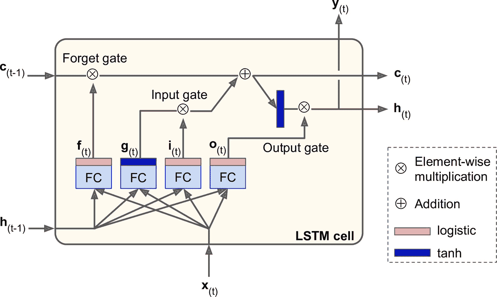

图 15-9 LSTM 单元

如果不观察黑箱的内部，LSTM 单元跟常规单元看起来差不多，除了 LSTM 单元的状态分成了两个向量：`h[t]`和`c[t]`（`c`代表 cell）。可以认为`h[t]`是短期记忆状态，`c[t]`是长期记忆状态。

现在打开黑箱。LSTM 单元的核心思想是它能从长期状态中学习该存储什么、丢掉什么、读取什么。当长期状态`c[t-1]`从左向右在网络中传播，它先经过遗忘门（forget gate），丢弃一些记忆，之后通过添加操作增加一些记忆（从输入门中选择一些记忆）。结果`c[t]`不经任何转换直接输出。因此，在每个时间步，都有一些记忆被抛弃，也有新的记忆添加进来。另外，添加操作之后，长时状态复制后经过 tanh 激活函数，然后结果被输出门过滤。得到短时状态`h[t]`（它等于这一时间步的单元输出，`y[t]`。接下来讨论新的记忆如何产生，门是如何工作的。

首先，当前的输入向量`x[t]`和前一时刻的短时状态`h[t-1]`作为输入，传给四个不同的全连接层，这四个全连接层有不同的目的：

*   输出`g[t]`的层是主要层。它的常规任务是分析当前的输入`x[t]`和前一时刻的短时状态`h[t-1]`。基本单元中与这种结构一样，直接输出了`h[t]`和`y[t]`。相反的，LSTM 单元中的该层的输出不会直接出去，儿是将最重要的部分保存在长期状态中（其余部分丢掉）。

*   其它三个全连接层被是门控制器（gate controller）。其采用 Logistic 作为激活函数，输出范围在 0 到 1 之间。可以看到，这三个层的输出提供给了逐元素乘法操作，当输入为 0 时门关闭，输出为 1 时门打开。具体讲：

    *   遗忘门（由`f[t]`控制）决定哪些长期记忆需要被删除；

    *   输入门（由`i[t]`控制） 决定哪部分`g[t]`应该被添加到长时状态中。

    *   输出门（由`o[t]`控制）决定长时状态的哪些部分要读取和输出为`h[t]`和`y[t]`。

总而言之，LSTM 单元能够学习识别重要输入（输入门的作用），存储进长时状态，并保存必要的时间（遗忘门功能），并在需要时提取出来。这解释了为什么 LSTM 单元能够如此成功地获取时间序列、长文本、录音等数据中的长期模式。

公式 15-3 总结了如何计算单元的长时状态，短时状态，和单个实例的在每个时间步的输出（小批次的公式和这个公式很像）。

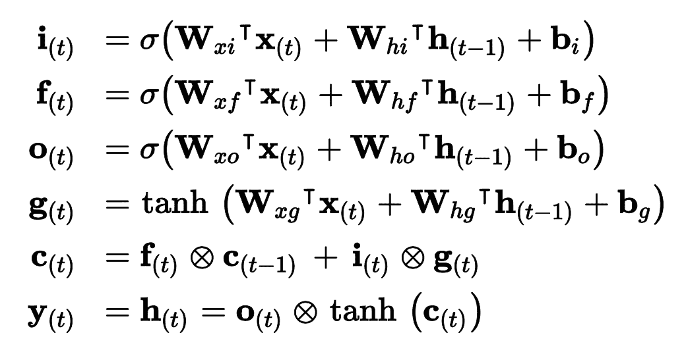

公式 15-3 LSTM 计算

在这个公式中，

*   `W[xi]`，`W[xf]`，`W[xo]`，`W[xg]`是四个全连接层连接输入向量`X[t]`的权重。

*   `W[hi]`，`W[hf]`，`W[ho]`，`W[hg]`是四个全连接层连接上一时刻的短时状态`h[t - 1]`的权重。

*   `b[i]`，`b[f]`，`b[o]`，`b[g]`是全连接层的四个偏置项。需要注意的是 TensorFlow 将`b[f]`初始化为全 1 向量，而非全 0。这样可以保证在训练状态开始时，忘掉所有东西。

### 窥孔连接

在基本 LSTM 单元中，门控制器只能观察当前输入`x[t]`和前一时刻的短时状态`h[t - 1]`。不妨让各个门控制器窥视一下长时状态，获取一些上下文信息。[该想法](https://links.jianshu.com/go?to=ftp.idsia.ch%2Fpub%2Fjuergen%2FTimeCount-IJCNN2000.pdf)由 Felix Gers 和 Jürgen Schmidhuber 在 2000 年提出。他们提出了一个 LSTM 的变体，带有叫做窥孔连接的额外连接：把前一时刻的长时状态`c[t - 1]`输入给遗忘门和输入门，当前时刻的长时状态`c[t]`输入给输出门。这么做时常可以提高性能，但不一定每次都能有效，也没有清晰的规律显示哪种任务适合添加窥孔连接。

Keras 中，`LSTM`层基于`keras.layers.LSTMCell`单元，后者目前还不支持窥孔。但是，试验性的`tf.keras.experimental.PeepholeLSTMCell`支持，所以可以创建一个`keras.layers.RNN`层，向构造器传入`PeepholeLSTMCell`。

LSTM 有多种其它变体，其中特别流行的是 GRU 单元。

### GRU 单元

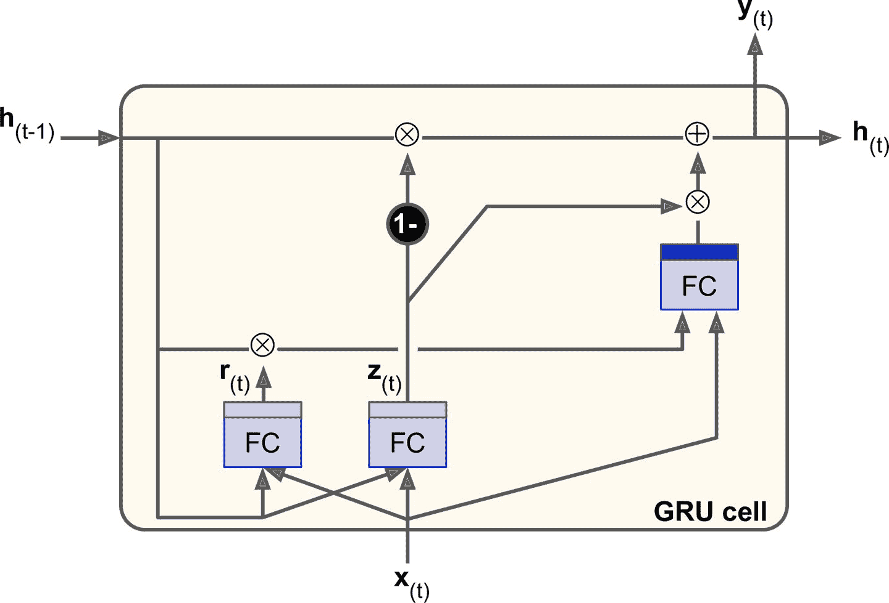

图 15-10 GRU 单元

门控循环单元（图 15-10）在 2014 年的 [Kyunghyun Cho 的论文](https://links.jianshu.com/go?to=https%3A%2F%2Farxiv.org%2Fpdf%2F1406.1078v3.pdf)中提出，并且此文也引入了前文所述的编码器-解码器网络。

GRU 单元是 LSTM 单元的简化版本，能实现同样的性能（这也说明了为什么它能越来越流行）。简化主要在一下几个方面：

*   长时状态和短时状态合并为一个向量`h[t]`。

*   用一个门控制器`z[t]`控制遗忘门和输入门。如果门控制器输出 1，则遗忘门打开（`= 1`），输入门关闭（`1 - 1 = 0`）。如果输出 0，则相反。换句话说，如果当有记忆要存储，那么就必须先在其存储位置删掉该处记忆。这构成了 LSTM 本身的常见变体。

*   GRU 单元取消了输出门，每个时间步输出全态向量。但是，增加了一个控制门`r[t]`来控制前一状态的哪些部分呈现给主层`g[t]`。

公式 15-4 总结了如何计算单元对单个实例在每个时间步的状态。

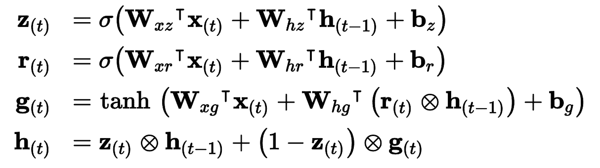

公式 15-4 GRU 计算

Keras 提供了`keras.layers.GRU`层（基于`keras.layers.GRUCell`记忆单元）；使用时，只需将`SimpleRNN`或`LSTM`替换为`GRU`。

LSTM 和 GRU 是 RNN 取得成功的主要原因之一。尽管它们相比于简单 RNN 可以处理更长的序列了，还是有一定程度的短时记忆，序列超过 100 时，比如音频、长时间序列或长序列，学习长时模式就很困难。应对的方法之一，是使用缩短输入序列，例如使用 1D 卷积层。

### 使用 1D 卷积层处理序列

在第 14 章中，我们使用 2D 卷积层，通过在图片上滑动几个小核（或过滤器），来产生多个 2D 特征映射（每个核产生一个）。相似的，1D 军几层在序列上滑动几个核，每个核可以产生一个 1D 特征映射。每个核能学到一个非常短序列模式（不会超过核的大小）。如果你是用 10 个核，则输出会包括 10 个 1 维的序列（长度相同），或者可以将输出当做一个 10 维的序列。这意味着，可以搭建一个由循环层和 1D 卷积层（或 1 维池化层）混合组成的神经网络。如果 1D 卷积层的步长是 1，填充为零，则输出序列的长度和输入序列相同。但如果使用`"valid"`填充，或大于 1 的步长，则输出序列会比输入序列短，所以一定要按照目标作出调整。例如，下面的模型和之前的一样，除了开头是一个步长为 2 的 1D 卷积层，用因子 2 对输入序列降采样。核大小比步长大，所以所有输入会用来计算层的输出，所以模型可以学到保存有用的信息、丢弃不重要信息。通过缩短序列，卷积层可以帮助 GRU 检测长模式。注意，必须裁剪目标中的前三个时间步（因为核大小是 4，卷积层的第一个输出是基于输入时间步 0 到 3），并用因子 2 对目标做降采样：

```py
model = keras.models.Sequential([
    keras.layers.Conv1D(filters=20, kernel_size=4, strides=2, padding="valid",
                        input_shape=[None, 1]),
    keras.layers.GRU(20, return_sequences=True),
    keras.layers.GRU(20, return_sequences=True),
    keras.layers.TimeDistributed(keras.layers.Dense(10))
])

model.compile(loss="mse", optimizer="adam", metrics=[last_time_step_mse])
history = model.fit(X_train, Y_train[:, 3::2], epochs=20,
                    validation_data=(X_valid, Y_valid[:, 3::2])) 
```

如果训练并评估这个模型，你会发现它是目前最好的模型。卷积层确实发挥了作用。事实上，可以只使用 1D 卷积层，不用循环层！

### WaveNet

在一篇 2016 年的[论文](https://links.jianshu.com/go?to=https%3A%2F%2Fhoml.info%2Fwavenet)中，Aaron van den Oord 和其它 DeepMind 的研究者，提出了一个名为 WaveNet 的架构。他们将 1D 卷积层叠起来，每一层膨胀率（如何将每个神经元的输入分开）变为 2 倍：第一个卷积层一次只观察两个时间步，，接下来的一层观察四个时间步（感受野是 4 个时间步的长度），下一层观察八个时间步，以此类推（见图 15-11）。用这种方式，底下的层学习短时模式，上面的层学习长时模式。得益于翻倍的膨胀率，这个网络可以非常高效地处理极长的序列。

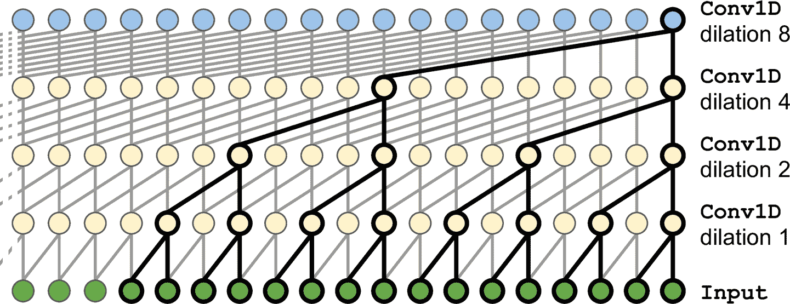

图 15-11 WaveNet 架构

在 WaveNet 论文中，作者叠了 10 个卷积层，膨胀率为 1, 2, 4, 8, …, 256, 512，然后又叠了一组 10 个相同的层（膨胀率还是 1, 2, 4, 8, …, 256, 512），然后又是 10 个相同的层。作者解释到，一摞这样的 10 个卷积层，就像一个超高效的核大小为 1024 的卷积层（只是更快、更强、参数更少），所以同样的结构叠了三次。他们还给输入序列左填充了一些 0，以满足每层的膨胀率，使序列长度不变。下面的代码实现了简化的 WaveNet，来处理前面的序列：

```py
model = keras.models.Sequential()
model.add(keras.layers.InputLayer(input_shape=[None, 1]))
for rate in (1, 2, 4, 8) * 2:
    model.add(keras.layers.Conv1D(filters=20, kernel_size=2, padding="causal",
                                  activation="relu", dilation_rate=rate))
model.add(keras.layers.Conv1D(filters=10, kernel_size=1))
model.compile(loss="mse", optimizer="adam", metrics=[last_time_step_mse])
history = model.fit(X_train, Y_train, epochs=20,
                    validation_data=(X_valid, Y_valid)) 
```

`Sequential`模型开头是一个输入层（比只在第一个层上设定`input_shape`简单的多）；然后是一个 1D 卷积层，使用`"causal"`填充：这可以保证卷积层在做预测时，不会窥视到未来值（等价于在输入序列的左边用零填充填充合适数量的 0）。然后添加相似的成对的层，膨胀率为 1、2、4、8，接着又是 1、2、4、8。最后，添加输出层：一个有 10 个大小为 1 的过滤器的卷积层，没有激活函数。得益于填充层，每个卷积层输出的序列长度都和输入序列一样，所以训练时的目标可以是完整序列：无需裁剪或降采样。

最后两个模型的序列预测结果最好！在 WaveNet 论文中，作者在多种音频任务（WaveNet 名字正是源于此）中，包括文本转语音任务（可以输出多种语言极为真实的语音），达到了顶尖的表现。他们还用这个模型生成音乐，每次生成一段音频。每段音频包含上万个时间步（LSTM 和 GRU 无法处理如此长的序列），这是相当了不起的。

第 16 章，我们会继续探索 RNN，会看到如何用 RNN 处理各种 NLP 任务。

## 练习

1.  你能说出序列到序列 RNN 的几个应用吗？序列到向量的应用？向量到序列的应用？

2.  RNN 层的输入要有多少维？每一维表示什么？输出呢？

3.  如果搭建深度序列到序列 RNN，哪些 RNN 层要设置`return_sequences=True`？序列到向量 RNN 又如何？

4.  假如有一个每日单变量时间序列，想预测接下来的七天。要使用什么 RNN 架构？

5.  训练 RNN 的困难是什么？如何应对？

6.  画出 LSTM 单元的架构图？

7.  为什么在 RNN 中使用 1D 卷积层？

8.  哪种神经网络架构可以用来分类视频？

9.  为 SketchRNN 数据集（TensorFlow Datasets 中有），训练一个分类模型。

10.  下载 [Bach chorales](https://links.jianshu.com/go?to=https%3A%2F%2Fhoml.info%2Fbach) 数据集，并解压。它含有 382 首巴赫作曲的赞美歌。每首的长度是 100 到 640 时间步，每个时间步包含 4 个整数，每个整数对应一个钢琴音符索引（除了 0，表示没有音符）。训练一个可以预测下一个时间步（四个音符）的模型，循环、卷积、或混合架构。然后使用这个模型来生成类似巴赫的音乐，每个时间一个音符：可以给模型一首赞美歌的开头，然后让其预测接下来的时间步，然后将输出加到输入上，再让模型继续预测。或者查看 [Google 的 Coconet 模型](https://links.jianshu.com/go?to=https%3A%2F%2Fhoml.info%2Fcoconet)，它是 Google 来做巴赫曲子的。

参考答案见附录 A。

