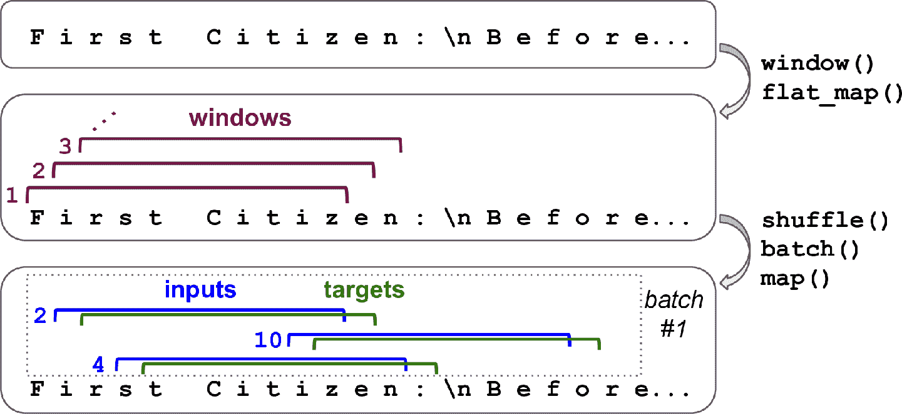
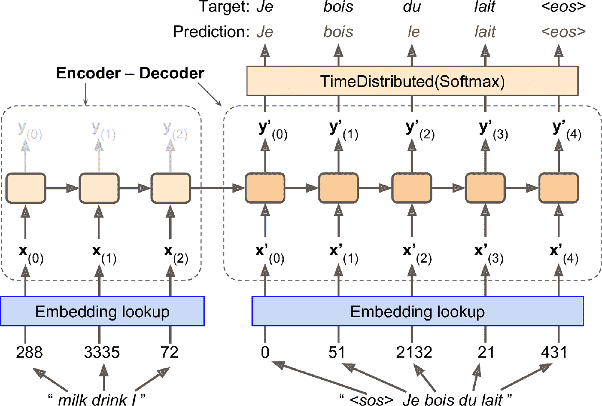
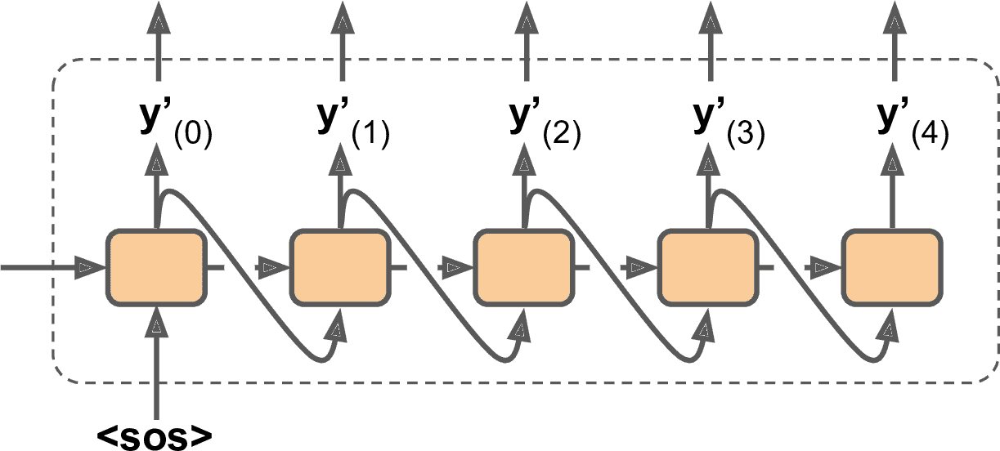
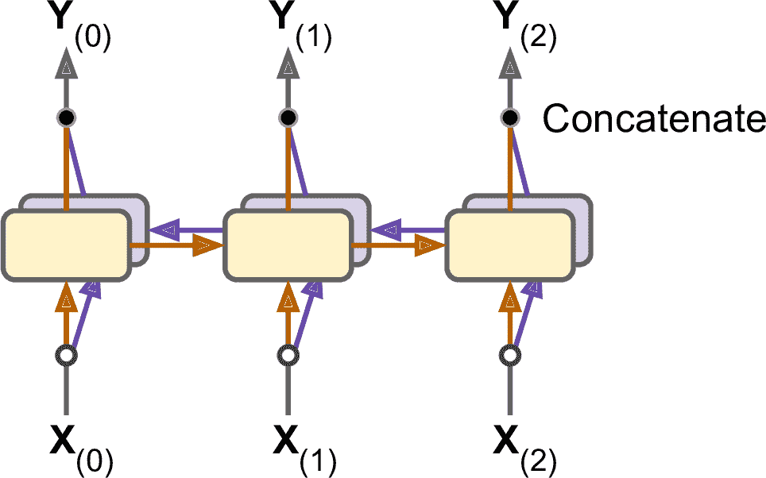
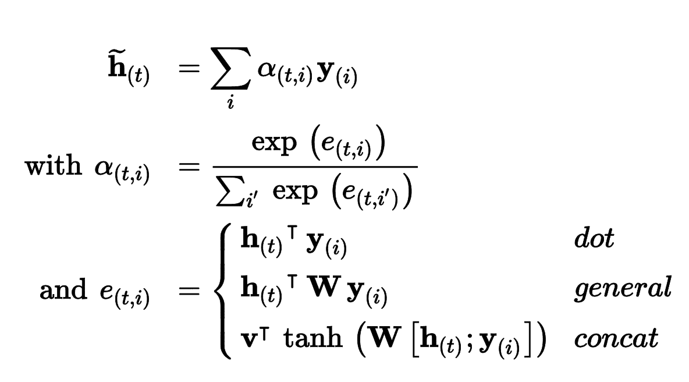
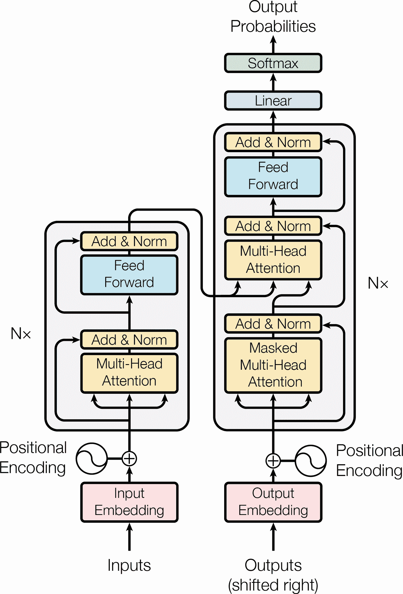
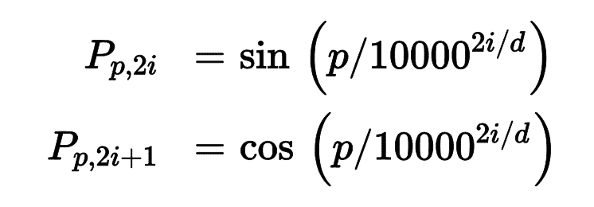
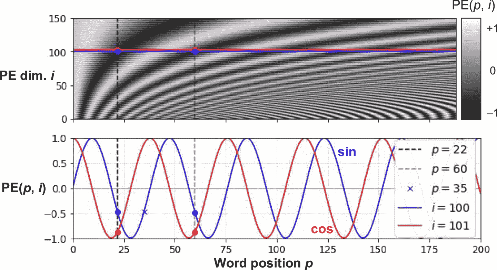
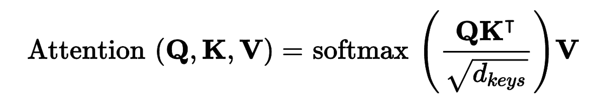
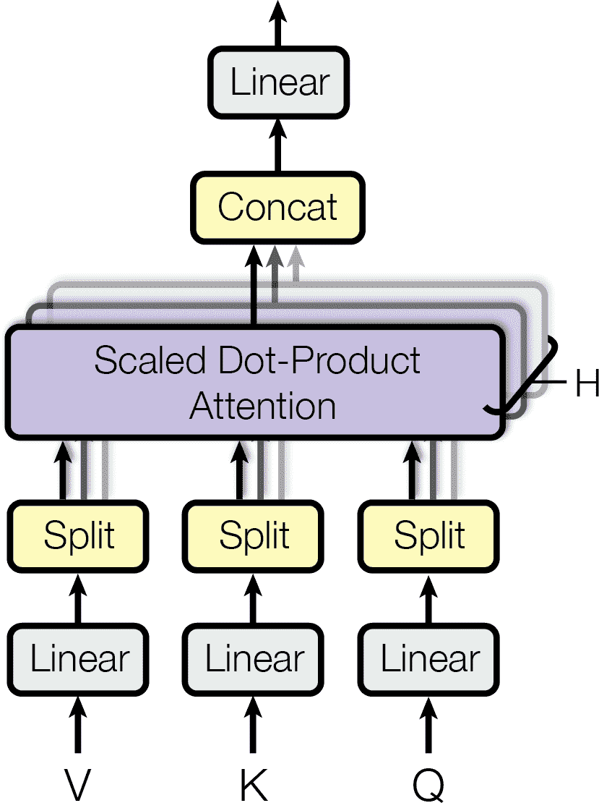

# 七、使用 RNN 和注意力机制进行自然语言处理

> 译者：[@SeanCheney](https://www.jianshu.com/u/130f76596b02)


当阿兰·图灵在 1950 年设计[图灵机](https://links.jianshu.com/go?to=http%3A%2F%2Fcogprints.org%2F499%2F1%2Fturing.html)时，他的目标是用人的智商来衡量机器。他本可以用其它方法来测试，比如看图识猫、下棋、作曲或逃离迷宫，但图灵选择了一个语言任务。更具体的，他设计了一个聊天机器人，试图迷惑对话者将其当做真人。这个测试有明显的缺陷：一套硬编码的规则可以愚弄粗心人（比如，机器可以针对一些关键词，做出预先定义的模糊响应；机器人可以假装开玩笑或喝醉；或者可以通过反问侥幸过关），忽略了人类的多方面的智力（比如非语言交流，比如面部表情，或是学习动手任务）。但图灵测试强调了一个事实，语言能力是智人最重要的认知能力。我们能创建一台可以读写自然语言的机器吗？

自然语言处理的常用方法是循环神经网络。所以接下来会从字符 RNN 开始（预测句子中出现的下一个字符），继续介绍 RNN，这可以让我们生成一些原生文本，在过程中，我们会学习如何在长序列上创建 TensorFlow Dataset。先使用的是无状态 RNN（每次迭代中学习文本中的随机部分），然后创建一个有状态 RNN（保留训练迭代之间的隐藏态，可以从断点继续，用这种方法学习长规律）。然后，我们会搭建一个 RNN，来做情感分析（例如，读取影评，提取评价者对电影的感情），这次是将句子当做词的序列来处理。然后会介绍用 RNN 如何搭建编码器-解码器架构，来做神经网络机器翻译（NMT）。我们会使用 TensorFlow Addons 项目中的 seq2seq API 。

本章的第二部分，会介绍注意力机制。正如其名字，这是一种可以选择输入指定部分，模型在每个时间步都得聚焦的神经网络组件。首先，会介绍如何使用注意力机制提升基于 RNN 的编码器-解码器架构的性能，然后会完全摒弃 RNN，介绍只使用注意力的架构，被称为 Transformer（转换器）。最后，会介绍 2018、2019 两年 NLP 领域的进展，包括强大的语言模型，比如 GPT-2 和 Bert，两者都是基于 Transformer 的。

先从一个简单有趣的模型开始，它能写出莎士比亚风格的文字。

## 使用 Character RNN 生成莎士比亚风格的文本

在 2015 年一篇著名的、名为《The Unreasonable Effectiveness of Recurrent Neural Networks》博客中，Andrej Karpathy 展示了如何训练 RNN，来预测句子中的下一个字符。这个 Char-RNN 可以用来生成小说，每次一个字符。下面是一段简短的、由 Char-RNN 模型（在莎士比亚全部著作上训练而成）生成的文本：

```py
PANDARUS:
Alas, I think he shall be come approached and the day
When little srain would be attain'd into being never fed,
And who is but a chain and subjects of his death,
I should not sleep. 
```

虽然文笔一般，但只是通过学习来预测一句话中的下一个字符，模型在单词、语法、断句等等方面做的很好。接下来一步一步搭建 Char-RNN，从创建数据集开始。

### 创建训练数据集

首先，使用 Keras 的`get_file()`函数，从 Andrej Karpathy 的 [Char-RNN 项目](https://links.jianshu.com/go?to=https%3A%2F%2Fgithub.com%2Fkarpathy%2Fchar-rnn)，下载所有莎士比亚的作品：

```py
shakespeare_url = "https://homl.info/shakespeare" # shortcut URL
filepath = keras.utils.get_file("shakespeare.txt", shakespeare_url)
with open(filepath) as f:
    shakespeare_text = f.read() 
```

然后，将每个字符编码为一个整数。方法之一是创建一个自定义预处理层，就像之前在第 13 章做的那样。但在这里，使用 Keras 的`Tokenizer`会更加简单。首先，将一个将分词器拟合到文本：分词器能从文本中发现所有的字符，并将所有字符映射到不同的字符 ID，映射从 1 开始（注意不是从 0 开始，0 是用来做遮挡的，后面会看到）：

```py
tokenizer = keras.preprocessing.text.Tokenizer(char_level=True)
tokenizer.fit_on_texts([shakespeare_text]) 
```

设置`char_level=True`，以得到字符级别的编码，而不是默认的单词级别的编码。这个分词器默认将所有文本转换成了小写（如果不想这样，可以设置`lower=False`）。现在分词器可以将一整句（或句子列表）编码为字符 ID 列表，这可以告诉我们文本中有多少个独立的字符，以及总字符数：

```py
>>> tokenizer.texts_to_sequences(["First"])
[[20, 6, 9, 8, 3]]
>>> tokenizer.sequences_to_texts([[20, 6, 9, 8, 3]])
['f i r s t']
>>> max_id = len(tokenizer.word_index) # number of distinct characters
>>> dataset_size = tokenizer.document_count # total number of characters 
```

现在对完整文本做编码，将每个字符都用 ID 来表示（减 1 使 ID 从 0 到 38，而不是 1 到 39）：

```py
[encoded] = np.array(tokenizer.texts_to_sequences([shakespeare_text])) - 1 
```

继续之前，需要将数据集分成训练集、验证集和测试集。不能大论字符，该怎么处理这种序列式的数据集呢？

### 如何切分序列数据集

避免训练集、验证集、测试集发生重合非常重要。例如，可以取 90% 的文本作为训练集，5% 作为验证集，5% 作为测试集。在这三个数据之间留出空隙，以避免段落重叠也是非常好的主意。

当处理时间序列时，通常按照时间切分：例如，可以将从 2000 到 2012 的数据作为训练集，2013 年到 2015 年作为验证集，2016 年到 2018 年作为测试集。但是，在另一些任务中，可以按照其它维度来切分，可以得到更长的时间周期进行训练。例如，10000 家公司从 2000 年到 2018 年的金融健康数据，可以按照不同公司来切分。但是，很可能其中一些公司是高度关联的（比如，经济领域的公司涨落相同），如果训练集和测试集中有关联的公司，则测试集的意义就不大，泛化误差会存在偏移。

因此，在时间维度上切分更加安全 —— 但这实际是默认 RNN 可以（在训练集）从过去学到的规律也适用于将来。换句话说，我们假设时间序列是静态的（至少是在一个较宽的区间内）。对于时间序列，这个假设是合理的（比如，化学反应就是这样，化学定理不会每天发生改变），但其它的就不是（例如，金融市场就不是静态的，一旦交易员发现规律并从中牟利，规律就会改变）。要保证时间序列确实是静态的，可以在验证集上画出模型随时间的误差：如果模型在验证集的前端表现优于后段，则时间序列可能就不够静态，最好是在一个更短的时间区间内训练。

总而言之，将时间序列切分成训练集、验证集和测试集不是简单的工作，怎么做要取决于具体的任务。

回到莎士比亚！这里将前 90% 的文本作为训练集（剩下的作为验证集和测试集），创建一个`tf.data.Dataset`，可以从这个集和一个个返回每个字符：

```py
train_size = dataset_size * 90 // 100
dataset = tf.data.Dataset.from_tensor_slices(encoded[:train_size]) 
```

### 将序列数据集切分成多个窗口

现在训练集包含一个单独的长序列，超过 100 万的任务，所以不能直接在这个训练集上训练神经网络：现在的 RNN 等同于一个有 100 万层的深度网络，只有一个超长的单实例来训练。所以，得使用数据集的`window()`方法，将这个长序列转化为许多小窗口文本。每个实例都是完整文本的相对短的子字符串，RNN 只在这些子字符串上展开。这被称为截断沿时间反向传播。调用`window()`方法创建一个短文本窗口的数据集：

```py
n_steps = 100
window_length = n_steps + 1 # target = input 向前移动 1 个字符
dataset = dataset.window(window_length, shift=1, drop_remainder=True) 
```

> 提示：可以调节`n_steps`：用短输入序列训练 RNN 更为简单，但肯定的是 RNN 学不到任何长度超过`n_steps`的规律，所以`n_steps`不要太短。

默认情况下，`window()`方法创建的窗口是不重叠的，但为了获得可能的最大训练集，我们设定`shift=1`，好让第一个窗口包含字符 0 到 100，第二个窗口包含字符 1 到 101，等等。为了确保所有窗口是准确的 101 个字符长度（为了不做填充而创建批次），设置`drop_remainder=True`（否则，最后的 100 个窗口会包含 100 个字符、99 个字符，一直到 1 个字符）。

`window()`方法创建了一个包含窗口的数据集，每个窗口也是数据集。这是一个嵌套的数据集，类似于列表的列表。当调用数据集方法处理（比如、打散或做批次）每个窗口时，这样会很方便。但是，不能直接使用嵌套数据集来训练，因为模型要的输入是张量，不是数据集。因此，必须调用`flat_map()`方法：它能将嵌套数据集转换成打平的数据集。例如，假设`{1, 2, 3}`表示包含张量 1、2、3 的序列。如果将嵌套数据集`{{1, 2}, {3, 4, 5, 6}}`打平，就会得到`{1, 2, 3, 4, 5, 6}`。另外，`flat_map()`方法可以接收函数作为参数，可以处理嵌套数据集的每个数据集。例如，如果将函数 `lambda ds: ds.batch(2)` 传递给 `flat_map()` ，它能将`{{1, 2}, {3, 4, 5, 6}}`转变为`{[1, 2], [3, 4], [5, 6]}`：这是一个张量大小为 2 的数据集。

有了这些知识，就可以打平数据集了：

```py
dataset = dataset.flat_map(lambda window: window.batch(window_length)) 
```

我们在每个窗口上调用了`batch(window_length)`：因为所有窗口都是这个长度，对于每个窗口，都能得到一个独立的张量。现在的数据集包含连续的窗口，每个有 101 个字符。因为梯度下降在训练集中的实例独立同分布时的效果最好，需要打散这些窗口。然后我们可以对窗口做批次，分割输入（前 100 个字符）和目标（最后一个字符）：

```py
batch_size = 32
dataset = dataset.shuffle(10000).batch(batch_size)
dataset = dataset.map(lambda windows: (windows[:, :-1], windows[:, 1:])) 
```

图 16-1 总结了数据集准备步骤（窗口长度是 11，不是 101，批次大小是 3，不是 32）。



图 16-1 准备打散窗口的数据集

第 13 章讨论过，类型输入特征通常都要编码，一般是独热编码或嵌入。这里，使用独热编码，因为独立字符不多（只有 39）：

```py
dataset = dataset.map(
    lambda X_batch, Y_batch: (tf.one_hot(X_batch, depth=max_id), Y_batch)) 
```

最后，加上预提取：

```py
dataset = dataset.prefetch(1) 
```

就是这样！准备数据集是最麻烦的部分。下面开始搭建模型。

### 搭建并训练 Char-RNN 模型

根据前面的 100 个字符预测下一个字符，可以使用一个 RNN，含有两个 GRU 层，每个 128 个单元，每个单元对输入（`dropout`）和隐藏态（`recurrent_dropout`）的丢弃率是 20%。如果需要的话，后面可以微调这些超参数。输出层是一个时间分布的紧密层，有 39 个单元（`max_id`），因为文本中有 39 个不同的字符，需要输出每个可能字符（在每个时间步）的概率。输出概率之后应为 1，所以使用 softmax 激活很熟。然后可以使用`"sparse_categorical_crossentropy"`损失和 Adam 优化器，编译模型。最后，就可以训练模型几个周期了（训练过程可能要几个小时，取决于硬件）：

```py
model = keras.models.Sequential([
    keras.layers.GRU(128, return_sequences=True, input_shape=[None, max_id],
                     dropout=0.2, recurrent_dropout=0.2),
    keras.layers.GRU(128, return_sequences=True,
                     dropout=0.2, recurrent_dropout=0.2),
    keras.layers.TimeDistributed(keras.layers.Dense(max_id,
                                                    activation="softmax"))
])
model.compile(loss="sparse_categorical_crossentropy", optimizer="Adam")
history = model.fit(dataset, epochs=20) 
```

### 使用 Char-RNN 模型

现在就有了可以预测莎士比亚要写的下一个人物的模型了。输入数据之前，先要像之前那样做预处理，因此写个小函数来做预处理：

```py
def preprocess(texts):
    X = np.array(tokenizer.texts_to_sequences(texts)) - 1
    return tf.one_hot(X, max_id) 
```

现在，用这个模型预测文本中的下一个字母：

```py
>>> X_new = preprocess(["How are yo"])
>>> Y_pred = model.predict_classes(X_new)
>>> tokenizer.sequences_to_texts(Y_pred + 1)[0][-1] # 1st sentence, last char
'u' 
```

预测成功！接下来用这个模型生成文本。

### 生成假莎士比亚文本

要使用 Char-RNN 生成新文本，我们可以给模型输入一些文本，让模型预测出下一个字母，将字母添加到文本的尾部，再将延长后的文本输入给模型，预测下一个字母，以此类推。但在实际中，这会导致相同的单词不断重复。相反的，可以使用`tf.random.categorical()`函数，随机挑选下一个字符，概率等同于估计概率。这样就能生成一些多样且有趣的文本。根据类的对数概率（logits），`categorical()`函数随机从类索引采样。为了对生成文本的多样性更可控，我们可以用一个称为“温度“的可调节的数来除以对数概率：温度接近 0，会利于高概率字符，而高温度会是所有字符概率相近。下面的`next_char()`函数使用这个方法，来挑选添加进文本中的字符：

```py
def next_char(text, temperature=1):
    X_new = preprocess([text])
    y_proba = model.predict(X_new)[0, -1:, :]
    rescaled_logits = tf.math.log(y_proba) / temperature
    char_id = tf.random.categorical(rescaled_logits, num_samples=1) + 1
    return tokenizer.sequences_to_texts(char_id.numpy())[0] 
```

然后，可以写一个小函数，重复调用`next_char()`：

```py
def complete_text(text, n_chars=50, temperature=1):
    for _ in range(n_chars):
        text += next_char(text, temperature)
    return text 
```

现在就可以生成一些文本了！先尝试下不同的温度数：

```py
>>> print(complete_text("t", temperature=0.2))
the belly the great and who shall be the belly the
>>> print(complete_text("w", temperature=1))
thing? or why you gremio.
who make which the first
>>> print(complete_text("w", temperature=2))
th no cce:
yeolg-hormer firi. a play asks.
fol rusb 
```

显然，当温度数接近 1 时，我们的莎士比亚模型效果最好。为了生成更有信服力的文字，可以尝试用更多`GRU`层、每层更多的神经元、更长的训练时间，添加正则（例如，可以在`GRU`层中设置`recurrent_dropout=0.3`）。另外，模型不能学习长度超过`n_steps`（只有 100 个字符）的规律。你可以使用更大的窗口，但也会让训练更为困难，甚至 LSTM 和 GRU 单元也不能处理长序列。另外，还可以使用有状态 RNN。

### 有状态 RNN

到目前为止，我们只使用了无状态 RNN：在每个训练迭代中，模型从全是 0 的隐藏状态开始训练，然后在每个时间步更新其状态，在最后一个时间步，隐藏态就被丢掉，以后再也不用了。如果让 RNN 保留这个状态，供下一个训练批次使用如何呢？这么做的话，尽管反向传播只在短序列传播，模型也可以学到长时规律。这被称为有状态 RNN。

首先，有状态 RNN 只在前一批次的序列离开，后一批次中的对应输入序列开始的情况下才有意义。所以第一件要做的事情是使用序列且没有重叠的输入序列（而不是用来训练无状态 RNN 时的打散和重叠的序列）。当创建`Dataset`时，调用`window()`必须使用`shift=n_steps`（而不是`shift=1`）。另外，不能使用`shuffle()`方法。但是，准备有状态 RNN 数据集的批次会麻烦些。事实上，如果调用`batch(32)`，32 个连续的窗口会放到一个相同的批次中，后面的批次不会接着这些窗口。第一个批次含有窗口 1 到 32，第二个批次批次含有窗口 33 到 64，因此每个批次中的第一个窗口（窗口 1 和 33），它们是不连续的。最简单办法是使用只包含一个窗口的“批次”：

```py
dataset = tf.data.Dataset.from_tensor_slices(encoded[:train_size])
dataset = dataset.window(window_length, shift=n_steps, drop_remainder=True)
dataset = dataset.flat_map(lambda window: window.batch(window_length))
dataset = dataset.batch(1)
dataset = dataset.map(lambda windows: (windows[:, :-1], windows[:, 1:]))
dataset = dataset.map(
    lambda X_batch, Y_batch: (tf.one_hot(X_batch, depth=max_id), Y_batch))
dataset = dataset.prefetch(1) 
```

图 16-2 展示了处理的第一步。


图 16-2 为有状态 RNN 准备连续序列片段的数据集

做批次虽然麻烦，但可以实现。例如，我们可以将莎士比亚作品切分成 32 段等长的文本，每个做成一个连续序列的数据集，最后使用`tf.train.Dataset.zip(datasets).map(lambda *windows: tf.stack(windows))`来创建合适的连续批次，批次中的`n`输入序列紧跟着`n`结束的地方（笔记本中有完整代码）。

现在创建有状态 RNN。首先，创建每个循环层时需要设置`stateful=True`。第二，有状态 RNN 需要知道批次大小（因为要为批次中的输入序列保存状态），所以要在第一层中设置`batch_input_shape`参数。不用指定第二个维度，因为不限制序列的长度：

```py
model = keras.models.Sequential([
    keras.layers.GRU(128, return_sequences=True, stateful=True,
                     dropout=0.2, recurrent_dropout=0.2,
                     batch_input_shape=[batch_size, None, max_id]),
    keras.layers.GRU(128, return_sequences=True, stateful=True,
                     dropout=0.2, recurrent_dropout=0.2),
    keras.layers.TimeDistributed(keras.layers.Dense(max_id,
                                                    activation="softmax"))
]) 
```

在每个周期之后，回到文本开头之前，需要重设状态。要这么做，可以使用一个小调回：

```py
class ResetStatesCallback(keras.callbacks.Callback):
    def on_epoch_begin(self, epoch, logs):
        self.model.reset_states() 
```

现在可以编译、训练模型了（周期数更多，是因为每个周期比之前变短了，每个批次只有一个实例）：

```py
model.compile(loss="sparse_categorical_crossentropy", optimizer="Adam")
model.fit(dataset, epochs=50, callbacks=[ResetStatesCallback()]) 
```

> 提示：训练好模型之后，只能预测训练时相同大小的批次。为了避免这个限制，可以创建一个相同的无状态模型，将有状态模型的参数复制到里面。

创建了一个字符层面的模型，接下来看看词层面的模型，并做一个常见的自然语言处理任务：情感分析。我们会学习使用遮掩来处理变化长度的序列。

## 情感分析

如果说 MNIST 是计算机视觉的“hello world”，那么 IMDb 影评数据集就是自然语言处理的“hello world”：这个数据集包含 50000 条英文影评，25000 条用于训练，25000 条用于测试，是从 IMDb 网站提取的，并带有影评标签，负（0）或正（1）。和 MNIST 一样，IMDb 影评数据集的流行是有原因的：笔记本电脑上就可以跑起来，不会耗时太长，也具有一定挑战。Keras 提供了一个简单的函数加载数据集：

```py
>>> (X_train, y_train), (X_test, y_test) = keras.datasets.imdb.load_data()
>>> X_train[0][:10]
[1, 14, 22, 16, 43, 530, 973, 1622, 1385, 65] 
```

影评在哪里？可以看到，数据集已经经过预处理了：`X_train`包括列表形式的影评，每条都是整数 NumPy 数组，每个整数代表一个词。所有标点符号都被去掉了，单词转换为小写，用空格隔开，最后用频次建立索引（小整数对应常见词）。整数 0、1、2 是特殊的：它们表示填充标记、序列开始（SSS）标记、和未知单词。如果想看到影评，可以如下解码：

```py
>>> word_index = keras.datasets.imdb.get_word_index()
>>> id_to_word = {id_ + 3: word for word, id_ in word_index.items()}
>>> for id_, token in enumerate(("<pad>", "<sos>", "<unk>")):
...     id_to_word[id_] = token
...
>>> " ".join([id_to_word[id_] for id_ in X_train[0][:10]])
'<sos> this film was just brilliant casting location scenery story' 
```

在真实的项目中，必须要自己预处理文本。你可以使用前面用过的`Tokenizer`，但要设置`char_level=False`（其实是默认的）。当编码单词时，`Tokenizer`会过滤掉许多字符，包括多数标点符号、换行符、制表符（可以通过`filters`参数控制）。最重要的，`Tokenizer`使用空格确定单词的边界。这对于英语和其它用空格隔开单词的语言是行得通的，但并不是所有语言都有空格。中文不使用空格，越南语甚至在单词里也有空格，德语经常将几个单词不用空格连在一起。就算在英语中，空格也不总是标记文本的最好方法：比如 San Francisco 或#ILoveDeepLearning。

幸好，有更好的方法。Taku Kudo 在 [2018 年的一篇论文](https://links.jianshu.com/go?to=https%3A%2F%2Fhoml.info%2Fsubword)中介绍了一种无监督学习方法，在亚词层面分词和取消分词文本，与所属语言独立，空格和其它字符等同处理。使用这种方法，就算模型碰到一个之前没见过的单词，模型还是能猜出它的意思。例如，模型在训练期间没见过单词`smartest`，但学过`est`词尾是最的意思，然后就可以推断`smartest`的意思。Google 的 [*SentencePiece*](https://links.jianshu.com/go?to=https%3A%2F%2Fgithub.com%2Fgoogle%2Fsentencepiece) 项目提供了开源实现，见 Taku Kudo 和 John Richardson 的[论文](https://links.jianshu.com/go?to=https%3A%2F%2Fhoml.info%2Fsentencepiece)。

另一种方法，是 Rico Sennrich 在更早的[论文](https://links.jianshu.com/go?to=https%3A%2F%2Fhoml.info%2Frarewords)中提出的，探索了其它创建亚单词编码的方法（比如，使用字节对编码）。最后同样重要的，TensorFlow 团队在 2019 年提出了[`TF.Text`](https://links.jianshu.com/go?to=https%3A%2F%2Fhoml.info%2Ftftext)库，它实现了多种分词策略，包括 [WordPiece](https://links.jianshu.com/go?to=https%3A%2F%2Fhoml.info%2Fwordpiece)（字节对编码的变种）。

如果你想将模型部署到移动设备或网页中，又不想每次都写一个不同的预处理函数，最好只使用 TensorFlow 运算，它可以融进模型中。看看怎么做。首先，使用 TensorFlow Datasets 加载原始 IMDb 评论，为文本（字节串）：

```py
import tensorflow_datasets as tfds

datasets, info = tfds.load("imdb_reviews", as_supervised=True, with_info=True)
train_size = info.splits["train"].num_examples 
```

然后，写预处理函数：

```py
def preprocess(X_batch, y_batch):
    X_batch = tf.strings.substr(X_batch, 0, 300)
    X_batch = tf.strings.regex_replace(X_batch, b"<br\\s*/?>", b" ")
    X_batch = tf.strings.regex_replace(X_batch, b"[^a-zA-Z']", b" ")
    X_batch = tf.strings.split(X_batch)
    return X_batch.to_tensor(default_value=b"<pad>"), y_batch 
```

预处理函数先裁剪影评，只保留前 300 个字符：这么做可以加速训练，并且不会过多影响性能，因为大多数时候只要看前一两句话，就能判断是正面或侧面的了。然后使用正则表达式替换`<br />`标签为空格，然后将所有非字母字符替换为空格。例如，文本`"Well, I can't<br />"`变成`"Well I can't"`。最后，`preprocess()`函数用空格分隔影评，返回一个嵌套张量，然后将嵌套张量转变为紧密张量，给所有影评填充上`"<pad>"`，使其长度相等。

然后，构建词典。这需要使用`preprocess()`函数再次处理训练集，并使用`Counter`统计每个单词的出现次数：

```py
from collections import Counter
vocabulary = Counter()
for X_batch, y_batch in datasets["train"].batch(32).map(preprocess):
    for review in X_batch:
        vocabulary.update(list(review.numpy())) 
```

看看最常见的词有哪些：

```py
>>> vocabulary.most_common()[:3]
[(b'<pad>', 215797), (b'the', 61137), (b'a', 38564)] 
```

但是，并不需要让模型知道词典中的所有词，所以裁剪词典，只保留 10000 个最常见的词：

```py
vocab_size = 10000
truncated_vocabulary = [
    word for word, count in vocabulary.most_common()[:vocab_size]] 
```

现在需要加上预处理步骤将每个单词替换为单词 ID（即它在词典中的索引）。就像第 13 章那样，创建一张查找表，使用 1000 个未登录词（oov）桶：

```py
words = tf.constant(truncated_vocabulary)
word_ids = tf.range(len(truncated_vocabulary), dtype=tf.int64)
vocab_init = tf.lookup.KeyValueTensorInitializer(words, word_ids)
num_oov_buckets = 1000
table = tf.lookup.StaticVocabularyTable(vocab_init, num_oov_buckets) 
```

用这个词表查找几个单词的 ID：

```py
>>> table.lookup(tf.constant([b"This movie was faaaaaantastic".split()]))
<tf.Tensor: [...], dtype=int64, numpy=array([[   22,    12,    11, 10054]])> 
```

因为`this`、`movie`、`was`是在词表中的，所以它们的 ID 小于 10000，而`faaaaaantastic`不在词表中，所以将其映射到一个 oov 桶，其 ID 大于或等于 10000。

> 提示：TF Transform 提供了一些实用的函数来处理词典。例如，`tft.compute_and_apply_vocabulary()`函数：它可以遍历数据集，找到所有不同的词，创建词典，还能生成 TF 运算，利用词典编码每个单词。

现在，可以创建最终的训练集。对影评做批次，使用`preprocess()`将其转换为词的短序列，然后使用一个简单的`encode_words()`函数，利用创建的词表来编码这些词，最后预提取下一个批次：

```py
def encode_words(X_batch, y_batch):
    return table.lookup(X_batch), y_batch

train_set = datasets["train"].batch(32).map(preprocess)
train_set = train_set.map(encode_words).prefetch(1) 
```

最后，创建模型并训练：

```py
embed_size = 128
model = keras.models.Sequential([
    keras.layers.Embedding(vocab_size + num_oov_buckets, embed_size,
                           input_shape=[None]),
    keras.layers.GRU(128, return_sequences=True),
    keras.layers.GRU(128),
    keras.layers.Dense(1, activation="sigmoid")
])

model.compile(loss="binary_crossentropy", optimizer="Adam",
              metrics=["accuracy"])
history = model.fit(train_set, epochs=5) 
```

第一个层是一个嵌入层，它将所有单词 ID 变为嵌入。每有一个单词 ID（`vocab_size + num_oov_buckets`），嵌入矩阵就有一行，每有一个嵌入维度，嵌入矩阵就有一列（这个例子使用了 128 个维度，这是一个可调的超参数）。模型输入是 2D 张量，形状为`[批次大小, 时间步]`，嵌入层的输出是一个 3D 张量，形状为`[批次大小, 时间步, 嵌入大小]`。

模型剩下的部分就很简单了：有两个`GRU`层，第二个只返回最后时间步的输出。输出层只有一个神经元，使用 sigmoid 激活函数，输出评论是正或负的概率。然后编译模型，利用前面准备的数据集来训练几个周期。

### 遮掩

在训练过程中，模型会学习到填充标记要被忽略掉。但这其实是已知的。为什么不告诉模型直接忽略填充标记，将精力集中在真正重要的数据中呢？只需一步就好：创建嵌入层时加上`mask_zero=True`。这意味着填充标记（其 ID 为 0）可以被接下来的所有层忽略。

其中的原理，是嵌入层创建了一个等于`K.not_equal(inputs, 0)`（其中`K = keras.backend`）遮掩张量：这是一个布尔张量，形状和输入相同，只要词 ID 有 0，它就等于`False`，否则为`True`。模型自动将这个遮掩张量向前传递给所有层，只要时间维度保留着。所以在例子中，尽管两个`GRU`都接收到了遮掩张量，但第二个`GRU`层不返回序列（只返回最后一个时间步），遮掩张量不会传递到紧密层。每个层处理遮掩的方式不同，但通常会忽略被遮掩的时间步（遮掩为`False`的时间步）。例如，当循环神经层碰到被遮掩的时间步时，就只是从前一时间步复制输出而已。如果遮掩张量一直传递到输出（输出为序列的模型），则遮掩也会作用到损失上，所以遮掩时间步不会贡献到损失上（它们的损失为 0）。

> 警告：基于英伟达的 cuDNN 库，`LSTM`层和`GRU`层针对 GPU 有优化实现。但是，这个实现不支持遮挡。如果你的模型使用了遮挡，则这些曾会回滚到（更慢的）默认实现。注意优化实现还需要使用几个超参数的默认值：`activation`、`recurrent_activation`、`recurrent_dropout`、`unroll`、`use_bias`、`reset_after`。

所有接收遮挡的层必须支持遮挡（否则会抛出异常）。包括所有的循环层、`TimeDistributed`层和其它层。所有支持遮挡的层必须有等于`True`的属性`supports_masking`。如果想实现自定义的支持遮挡的层，应该给`call()`方法添加`mask`参数。另外，要在构造器中设定`self.supports_masking = True`。如果第一个层不是嵌入层，可以使用`keras.layers.Masking`层：它设置遮挡为`K.any(K.not_equal(inputs, 0), axis=-1)`，意思是最后一维都是 0 的时间步，会被后续层遮挡。

对于`Sequential`模型，使用遮挡层，并自动向前传递遮挡是最佳的。但复杂模型上不能这么做，比如将`Conv1D`层与循环层混合使用时。对这种情况，需要使用函数式 API 或子类化 API 显式计算遮挡张量，然后将其传给需要的层。例如，下面的模型等价于前一个模型，除了使用函数式 API 手动处理遮挡张量：

```py
K = keras.backend
inputs = keras.layers.Input(shape=[None])
mask = keras.layers.Lambda(lambda inputs: K.not_equal(inputs, 0))(inputs)
z = keras.layers.Embedding(vocab_size + num_oov_buckets, embed_size)(inputs)
z = keras.layers.GRU(128, return_sequences=True)(z, mask=mask)
z = keras.layers.GRU(128)(z, mask=mask)
outputs = keras.layers.Dense(1, activation="sigmoid")(z)
model = keras.Model(inputs=[inputs], outputs=[outputs]) 
```

训练几个周期之后，这个模型的表现就相当不错了。如果使用`TensorBoard()`调回，可以可视化 TensorBoard 中的嵌入是怎么学习的：可以看到`awesome`和`amazing`这样的词渐渐聚集于嵌入空间的一边，而`awful`、`terrible`这样的词聚集到另一边。一些词可能不会像预期那样是正面的，比如`good`，可能所有负面评论含有`not good`。模型只基于 25000 个词就能学会词嵌入，让人印象深刻。如果训练集有几十亿的规模，效果就更好了。但可惜没有，但可以利用在其它大语料（比如，维基百科文章）上训练的嵌入，就算不是影评也可以？毕竟，`amazing`这个词在哪种语境的意思都差不多。另外，甚至嵌入是在其它任务上训练的，也可能有益于情感分析：因为`awesome`和`amazing`有相似的意思，即使对于其它任务（比如，预测句子中的下一个词），它们也倾向于在嵌入空间聚集，所以对情感分析也是有用的。所以看看能否重复利用预训练好的词嵌入。

### 复用预训练的词嵌入

在 TensorFlow Hub 上可以非常方便的找到可以复用的预训练模型组件。这些模型组件被称为模块。只需浏览 [TF Hub 仓库](https://links.jianshu.com/go?to=https%3A%2F%2Ftfhub.dev%2F)，找到需要的模型，复制代码到自己的项目中就行，模块可以总动下载下来，包含预训练权重，到自己的模型中。

例如，在情感分析模型中使用`nnlm-en-dim50`句子嵌入模块，版本 1：

```py
import tensorflow_hub as hub

model = keras.Sequential([
    hub.KerasLayer("https://tfhub.dev/google/tf2-preview/nnlm-en-dim50/1",
                   dtype=tf.string, input_shape=[], output_shape=[50]),
    keras.layers.Dense(128, activation="relu"),
    keras.layers.Dense(1, activation="sigmoid")
])
model.compile(loss="binary_crossentropy", optimizer="Adam",
              metrics=["accuracy"]) 
```

`hub.KerasLayer`从给定的 URL 下载模块。这个特殊的模块是“句子编码器”：它接收字符串作为输入，将每句话编码为一个独立向量（这个例子中是 50 维度的向量）。在内部，它将字符串解析（空格分隔），然后使用预训练（训练语料是 Google News 7B，一共有 70 亿个词）的嵌入矩阵来嵌入每个词。然后计算所有词嵌入的平均值，结果是句子嵌入。我们接着可以添加两个简单的紧密层来创建一个出色的情感分析模型。默认，`hub.KerasLayer`是不可训练的，但创建时可以设定`trainable=True`，就可以针对自己的任务微调了。

> 警告：不是所有的 TF Hub 模块都支持 TensorFlow 2。

然后，就可以加载 IMDb 影评数据集了，不需要预处理（但要做批次和预提取），直接训练模型就成：

```py
datasets, info = tfds.load("imdb_reviews", as_supervised=True, with_info=True)
train_size = info.splits["train"].num_examples
batch_size = 32
train_set = datasets["train"].batch(batch_size).prefetch(1)
history = model.fit(train_set, epochs=5) 
```

注意到，TF Hub 模块的 URL 的末尾指定了是模型的版本 1。版本号可以保证当有新的模型版本发布时，不会破坏自己的模型。如果在浏览器中输入这个 URL，能看到这个模块的文档。TF Hub 会默认将下载文件缓存到系统的临时目录。你可能想将文件存储到固定目录，以免每次系统清洗后都要下载。要这么做的话，设置环境变量`TFHUB_CACHE_DIR`就成（比如，`os.environ["TFHUB_CACHE_DIR"] = "./my_tfhub_cache"`）。

截至目前，我们学习了时间序列、用 Char-RNN 生成文本、用 RNN 做情感分析、训练自己的词嵌入或复用预训练词嵌入。接下来看看另一个重要的 NLP 任务：神经网络机器翻译（NMT），我们先使用纯粹的编码器-解码器模型，然后使用注意力机制，最后看看 Transformer 架构。

## 用编码器-解码器做机器翻译

看一个简单的[神经网络机器翻译模型](https://links.jianshu.com/go?to=https%3A%2F%2Fhoml.info%2F103)，它能将英语翻译为法语（见图 16-3）。

简而言之，英语句子输入进编码器，解码器输出法语。注意，法语翻译也作为解码器的输入，但向后退一步。换句话说，解码器将前一步的输出再作为输入（不用管它输出什么）。对于第一个词，给它加上一个序列开始（SOS）标记，序列结尾加上序列结束（EOS）标记。

英语句子在输入给编码器之前，先做了翻转。例如，`I drink milk`翻转为`milk drink I`。这样能保证英语句子的第一个词是最后一个输入给编码器的，通常也是解码器要翻译的第一个词。

每个单词首先用它的 ID 来表示（例如，288 代表`milk`）。然后，嵌入层返回单词嵌入。单词嵌入才是输入给编码器和解码器的。



图 16-3 一个简单的机器翻译模型

在每一步，解码器输出一个输出词典中每个单词的分数，然后 softmax 层将分数变为概率。例如，在第一步，`Je`的概率可能为 20%，`Tu`的概率可能为 1%，等等。概率最高的词作为输出。这特别像一个常规分类任务，所以可以用`"sparse_categorical_crossentropy"`损失训练模型，跟前面的 Char-RNN 差不多。

在做推断时，没有目标语句输入进解码器。相反的，只是输入解码器前一步的输出，见图 16-4（这需要一个嵌入查找表，图中没有展示）。



图 16-4 在推断时，将前一步的输出作为输入

好了，现在知道整体的大概了。但要实现模型的话，还有几个细节要处理：

*   目前假定所有（编码器和解码器的）输入序列的长度固定。但很显然句子长度是变化的。因为常规张量的形状固定，它们只含有相同长度的句子。可以用遮挡来处理；但如果句子的长度非常不同，就不能像之前情感分析那样截断（因为想要的是完整句子的翻译）。可以将句子放进长度相近的桶里（一个桶放 1 个词到 6 个词的句子，一个桶放 7 个词到 12 个词的句子，等等），给短句子加填充，使同一个桶中的句子长度相同（见`tf.data.experimental.bucket_by_sequence_length()`函数）。例如，`I drink milk`变为`<pad> <pad> <pad> milk drink I`。

*   要忽略所有在 EOS 标记后面的输出，这些输出不能影响损失（遮挡起来）。例如，如果模型输出`Je bois du lait <eos> oui`，忽略最后一个词对损失的影响。

*   如果输出词典比较大（这个例子就是这样），输出每个词的概率会非常慢。如果目标词典有 50000 个发语词，则解码器要输出 50000 维的向量，在这个向量上计算 softmax 非常耗时。一个方法是只查看模型对正确词和非正确词采样的对数概率输出，然后根据这些对数概率计算一个大概的损失。这个采样 softmax 方法是 [Sébastien Jean 在 2015 年提出的](https://links.jianshu.com/go?to=https%3A%2F%2Fhoml.info%2F104)。在 TensorFlow 中，你可以在训练时使用`tf.nn.sampled_softmax_loss()`，在推断时使用常规 softmax 函数（推断时不能使用采样 softmax，因为需要知道目标）。

TensorFlow Addons 项目涵盖了许多序列到序列的工具，可以创建准生产的编码器-解码器。例如，下面的代码创建了一个基本的编码器-解码器模型，相似于图 16-3：

```py
import tensorflow_addons as tfa

encoder_inputs = keras.layers.Input(shape=[None], dtype=np.int32)
decoder_inputs = keras.layers.Input(shape=[None], dtype=np.int32)
sequence_lengths = keras.layers.Input(shape=[], dtype=np.int32)

embeddings = keras.layers.Embedding(vocab_size, embed_size)
encoder_embeddings = embeddings(encoder_inputs)
decoder_embeddings = embeddings(decoder_inputs)

encoder = keras.layers.LSTM(512, return_state=True)
encoder_outputs, state_h, state_c = encoder(encoder_embeddings)
encoder_state = [state_h, state_c]

sampler = tfa.seq2seq.sampler.TrainingSampler()

decoder_cell = keras.layers.LSTMCell(512)
output_layer = keras.layers.Dense(vocab_size)
decoder = tfa.seq2seq.basic_decoder.BasicDecoder(decoder_cell, sampler,
                                                 output_layer=output_layer)
final_outputs, final_state, final_sequence_lengths = decoder(
    decoder_embeddings, initial_state=encoder_state,
    sequence_length=sequence_lengths)
Y_proba = tf.nn.softmax(final_outputs.rnn_output)

model = keras.Model(inputs=[encoder_inputs, decoder_inputs, sequence_lengths],
                    outputs=[Y_proba]) 
```

这个代码很简单，但有几点要注意。首先，创建`LSTM`层时，设置`return_state=True`，以便得到最终隐藏态，并将其传给解码器。因为使用的是 LSTM 单元，它实际返回两个隐藏态（短时和长时）。`TrainingSampler`是 TensorFlow Addons 中几个可用的采样器之一：它的作用是在每一步告诉解码器，前一步的输出是什么。在推断时，采样器是实际输出的标记嵌入。在训练时，是前一个目标标记的嵌入：这就是为什么使用`TrainingSampler`的原因。在实际中，一个好方法是，一开始用目标在前一时间步的嵌入训练，然后逐渐过渡到实际标记在前一步的输出。这个方法是 Samy Bengio 在 [2015 年的一篇论文](https://links.jianshu.com/go?to=https%3A%2F%2Fhoml.info%2Fscheduledsampling)中提出的。`ScheduledEmbeddingTrainingSampler`可以随机从目标或实际输出挑选，你可以在训练中逐渐调整概率。

### 双向 RNN

在每个时间步，常规循环层在产生输出前，只会查看过去和当下的输入。换句话说，循环层是遵循因果关系的，它不能查看未来。这样的 RNN 在预测时间序列时是合理的，但对于许多 NLP 任务，比如机器翻译，在编码给定词时，最好看看后面的词是什么。比如，对于这几个短语`the Queen of the United Kingdom`、`the queen of hearts`、`the queen bee`：要正确编码`queen`，需要向前看。要实现的话，可以对于相同的输入运行两个循环层，一个从左往右读，一个从右往左读。然后将每个时间步的输出结合，通常是连起来。这被称为双向循环层（见图 16-5）。

要在 Keras 中实现双向循环层，可以在`keras.layers.Bidirectional`层中包一个循环层。例如，下面的代码创建了一个双向`GRU`层：

```py
keras.layers.Bidirectional(keras.layers.GRU(10, return_sequences=True)) 
```

> 笔记：`Bidirectional`层会创建一个`GRU`层的复制（但方向相反），会运行两个层，并将输出连起来。因此`GRU`层有 10 个神经元，`Bidirectional`层在每个时间步会输出 20 个值。



图 16-5 双向循环层

### 集束搜索

假设你用编码器-解码器模型将法语`Comment vas-tu?`翻译为英语。正确的翻译应该是`How are you?`，但得到的结果是`How will you?`。查看训练集，发现许多句子，比如`Comment vas-tu jouer?`翻译成了`How will you play?`。所以模型看到`Comment vas`之后，将其翻译为`How will`并不那么荒唐。但在这个例子中，这就是一个错误，并且模型还不能返回修改，模型只能尽全力完成句子。如果每步都是最大贪心地输出结果，只能得到次优解。如何能让模型返回到之前的错误并改错呢？最常用的方法之一，是使用集束搜索：它跟踪`k`个最大概率的句子列表，在每个解码器步骤延长一个词，然后再关注其中`k`个最大概率的句子。参数`k`被称为集束宽度。

例如，假设使用宽度为 3 的集束搜索，用模型来翻译句子`Comment vas-tu?`。在第一个解码步骤，模型会输出每个可能词的估计概率。假设前 3 个词的估计概率是`How`（估计概率是 75%）、`What`（3%）、`You`（1%）。这是目前的句子列表。然后，创建三个模型的复制，预测每个句子的下一个词。第一个模型会预测`How`后面的词，假设结果是 36% 为`will`、32% 为`are`、16% 为`do`，等等。注意，这是条件概率。第二个模型会预测`What`后面的词：50% 为`are`，等等。假设词典有 10000 个词，每个模型会输出 10000 个概率。

然后，计算 30000 个含有两个词的句子的概率。将条件概率相乘。例如，`How will`的概率是`75% × 36% = 27%`。计算完 30000 个概率之后，只保留概率最大的 3 个。假设是`How will`（27%）、`How are`（24%）、`How do`（12%）。现在`How will`的概率最大，但`How are`并没有被删掉。

接着，重复同样的过程：用三个模型预测这三个句子的接下来的词，再计算 30000 个含有三个词的句子的概率。假设前三名是`How are you`（10%）、`How do you`（8%）、`How will you`（2%）。再下一步的前三名是`How do you do`（7%）、`How are you <eos>`（6%）、`How are you doing`（3%）。注意，`How will`被淘汰了。没有使用额外的训练，只是在使用层面做了改动，就提高了模型的性能。

TensorFlow Addons 可以很容易实现集束搜索：

```py
beam_width = 10
decoder = tfa.seq2seq.beam_search_decoder.BeamSearchDecoder(
    cell=decoder_cell, beam_width=beam_width, output_layer=output_layer)
decoder_initial_state = tfa.seq2seq.beam_search_decoder.tile_batch(
    encoder_state, multiplier=beam_width)
outputs, _, _ = decoder(
    embedding_decoder, start_tokens=start_tokens, end_token=end_token,
    initial_state=decoder_initial_state) 
```

首先创建`BeamSearchDecoder`，它包装所有的解码器的克隆（这个例子中有 10 个）。然后给每个解码器克隆创建一个编码器的最终状态的复制，然后将状态传给解码器，加上开始和结束标记。

有了这些，就能得到不错的短句的翻译了（如果使用预训练词嵌入，效果更好）。但是这个模型翻译长句子的效果很糟。这又是 RNN 的短时记忆问题。注意力机制的出现，解决了这一问题。

## 注意力机制

图 16-3 中，从`milk`到`lait`的路径非常长。这意味着这个单词的表征（还包括其它词），在真正使用之前，要经过许多步骤。能让这个路径短点吗？

这是 Dzmitry Bahdanau 在 2014 年的突破性[论文](https://links.jianshu.com/go?to=https%3A%2F%2Fhoml.info%2Fattention)中的核心想法。他们引入了一种方法，可以让解码器在每个时间步关注特别的（被编码器编码的）词。例如，在解码器需要输出单词`lait`的时间步，解码器会将注意力关注在单词`milk`上。这意味着从输入词到其翻译结果的路径变的短得多了，所以 RNN 的短时记忆的限制就减轻了很多。注意力机制革新了神经网络机器翻译（和 NLP 的常见任务），特别是对于长句子（超过 30 个词），带来了非凡的进步。

图 16-6 展示了注意力机制的架构（稍微简化过，后面会说明）。左边是编码器和解码器。不是将编码器的最终隐藏态传给解码器（其实是传了，但图中没有展示），而是将所有的输出传给解码器。在每个时间步，解码器的记忆单元计算所有这些输出的加权和：这样可以确定这一步关注哪个词。权重`α[t,i]`是第`i`个编码器输出在第`t`解码器时间步的权重。例如，如果权重`α[3, 2]`比`α[3, 0]`和`α[3, 1]`大得多，则解码器会用更多注意力关注词 2（`milk`），至少是在这个时间步。剩下的解码器就和之前一样工作：在每个时间步，记忆单元接收输入，加上上一个时间步的隐藏态，最后（这一步图上没有画出）加上上一个时间步的目标词（或推断时，上一个时间步的输出）。


图 16-6 使用了注意力模型的编码器-解码器结构

权重`α[t,i]`是从哪里来的呢？其实很简单：是用一种小型的、被称为对齐模型（或注意力层）的神经网络生成的，注意力层与模型的其余部分联合训练。对齐模型展示在图的右边：一开始是一个时间分布紧密层，其中有一个神经元，它接收所有编码器的输出，加上解码器的上一个隐藏态（即`h[2]`）。这个层输出对每个编码器输出，输出一个分数（或能量）（例如，`e[3, 2]`）：这个分数衡量每个输出和解码器上一个隐藏态的对齐程度。最后，所有分数经过一个 softmax 层，得到每个编码器输出的最终权重（例如，`α[3, 2]`）。给定解码器时间步的所有权重相加等于 1（因为 softmax 层不是时间分布的）。这个注意力机制称为 Bahdanau 注意力。因为它将编码器输出和解码器的上一隐藏态连了起来，也被称为连接注意力（或相加注意力）。

> 笔记：如果输入句子有`n`个单词，假设输出也是这么多单词，则要计算`n^2`个权重。幸好，平方计算的复杂度不高，因为即使是特别长的句子，也不会有数千个单词。

另一个常见的注意力机制是不久之后，由 Minh-Thang Luong 在 2015 年的[论文](https://links.jianshu.com/go?to=https%3A%2F%2Fhoml.info%2Fluongattention)中提出的。因为注意力机制的目标是衡量编码器的输出，和解码器上一隐藏态的相似度，Minh-Thang Luong 提出，只要计算这两个向量的点积，因为点积是有效衡量相似度的手段，并且计算起来很快。要计算的话，两个向量的维度必须相同。这被称为 Luong 注意力，或相乘注意力。和 Bahdanau 注意力一样，点积的结果是一个分数，所有分数（在特定的解码器时间步）通过 softmax 层，得到最终权重。Luong 提出的另一个简化方法是使用解码器在当前时间步的隐藏态，而不是上一时间步，然后使用注意力机制的输出（标记为`h_hat[t]`），直接计算解码器的预测（而不是计算解码器的当前隐藏态）。他还提出了一个点击的变体，编码器的输出先做线性变换（即，时间分布紧密层不加偏置项），再做点积。这被称为“通用”点积方法。作者比较了点积方盒和连接注意力机制（加上一个缩放参数 v），观察到点积方法的变体表现的更好。因为这个原因，如今连接注意力很少使用了。公式 16-1 总结了这三种注意力机制。



公式 16-1 注意力机制

使用 TensorFlow Addons 将 Luong 注意力添加到编码器-解码器模型的方法如下：

```py
attention_mechanism = tfa.seq2seq.attention_wrapper.LuongAttention(
    units, encoder_state, memory_sequence_length=encoder_sequence_length)
attention_decoder_cell = tfa.seq2seq.attention_wrapper.AttentionWrapper(
    decoder_cell, attention_mechanism, attention_layer_size=n_units) 
```

只是将解码器单元包装进`AttentionWrapper`，然后使用了想用的注意力机制（这里用的是 Luong 注意力）。

### 视觉注意力

注意力机制如今应用的非常广泛。最先用途之一是利用视觉注意力生成图片标题：卷积神经网络首先处理图片，生成一些特征映射，然后用带有注意力机制的解码器 RNN 来生成标题，每次生成一个词。在每个解码器时间步（每个词），解码器使用注意力模型聚焦于图片的一部分。例如，对于图 16-7，模型生成的标题是“一个女人正在公园里扔飞盘”，可以看到解码器要输出单词“飞盘”时，注意力关注的图片的部分：显然，注意力大部分聚焦于飞盘。


图 16-7 视觉注意力：输入图片（左）和模型输出“飞盘”时模型的关注点（右）

> 解释性
> 
> 注意力机制的的一个额外的优点，是它更容易使人明白是什么让模型产生输出。这被称为可解释性。当模型犯错时，可解释性非常有帮助：例如，如果一张狗在雪中行走的图，被打上了“狼在雪中行走”的标签，你就可以回去查看当模型输出“狼”时，模型聚焦于什么。你可能看到模型不仅关注于狗，还关注于雪地，暗示了一种可能的解释：可能模型判断是根据有没有很多雪，来判断是狗还是狼。然后可以通过用更多没有雪的狼的图片进行训练，来修复模型。这个例子来自于 Marco Tulio Ribeiro 在 2016 年的[论文](https://links.jianshu.com/go?to=https%3A%2F%2Fhoml.info%2Fexplainclass)，他们使用了不同的可解释性：局部围绕分类器的预测，来学习解释性模型。
> 
> 在一些应用中，可解释性不仅是调试模型的工具，而是正当的需求（比如一个判断是否进行放贷的需求）。

注意力机制如此强大，以至于只需要注意力机制就能创建出色的模型。

### Attention Is All You Need：Transformer 架构

在 2017 年一篇突破性[论文](https://links.jianshu.com/go?to=https%3A%2F%2Fhoml.info%2Ftransformer)中，谷歌的研究者提出了：Attention Is All You Need（只要注意力）。他们创建了一种被称为 Transformer（转换器）的架构，它极大的提升了 NMT 的性能，并且没有使用任何循环或卷积层，只用了注意力机制（加上嵌入层、紧密层、归一化层，和一些其它组件）。这个架构的另一个优点，是训练的更快，且更容易并行运行，花费的时间和精力比之前的模型少得多。

Transformer 架构见图 16-8。



图 16-8 Transformer 架构

一起看下这个架构：

*   图的左边和以前一样是编码器，接收的输入是一个批次的句子，表征为序列化的单词 ID（输入的形状是`[批次大小, 最大输入句子长度]`），每个单词表征为 512 维（所以编码器的输出形状是`[批次大小, 最大输入句子长度, 512]`）。注意，编码器的头部叠加了`N`次（论文中，`N=6`）。

*   架构的右边是解码器。在训练中，它接收目标句子作为输入（也是表征为序列化的单词 ID），向右偏移一个时间步（即，在起点插入一个 SOS 标记）。它还接收编码器的输出（即，来自左边的箭头）。注意，解码器的头部也重叠了`N`次，编码器的最终输出，传入给解码器重叠层中的每一个部分。和以前一样，在每个时间步，解码器输出每个下一个可能词的概率（输出形状是`[批次大小, 最大输出句子长度, 词典长度]`）。

*   在推断时，解码器不能接收目标，所以输入的是前面的输出词（起点用 SOS 标记）。因此模型需要重复被调用，每一轮预测一个词（预测出来的词在下一轮输入给解码器，直到输出 EOS 标记）。

*   仔细观察下，可以看到其实你已经熟悉其中大部分组件了：两个嵌入层，`5 × N`个跳连接，每个后面是一个归一化层，`2 × N`个“前馈”模块（由两个紧密层组成（第一个使用 ReLU 激活函数，第二个不使用激活函数），输出层是使用 softmax 激活函数的紧密层）。所有这些层都是时间分布的，因此每个词是独立处理的。但是一次只看一个词，该如何翻译句子呢？这时就要用到新组件了：

    *   编码器的多头注意力层，编码每个词与句子中其它词的关系，对更相关的词付出更多注意力。例如，输出句子`They welcomed the Queen of the United Kingdom`中的词`Queen`的层的输出，会取决于句子中的所有词，但更多注意力会在`United`和`Kingdom`上。这个注意力机制被称为自注意力（句子对自身注意）。后面会讨论它的原理。解码器的遮挡多头注意力层做的事情一样，但每个词只关注它前面的词。最后，解码器的上层多头注意力层，是解码器用于在输入句子上付出注意力的。例如，当解码器要输出`Queen`的翻译时，解码器会对输入句子中的`Queen`这个词注意更多。

    *   位置嵌入是紧密向量（类似词嵌入），表示词在句子中的位置。第`n`个位置嵌入，添加到每个句子中的第`n`个词上。这可以让模型知道每个词的位置，这是因为多头注意力层不考虑词的顺序或位置，它只看关系。因为所有其它层都是时间分布的，它们不知道每个词的（相对或绝对）位置。显然，相对或绝对的词的位置非常重要，因此需要将位置信息以某种方式告诉 Transformer，位置嵌入是行之有效的方法。

下面逐一仔细介绍 Transformer 中的新组件，从位置嵌入开始。

### 位置嵌入

位置嵌入是一个紧密向量，它对词在句子中的位置进行编码：第`i`个位置嵌入添加到句子中的第`i`个词。模型可以学习这些位置嵌入，但在论文中，作者倾向使用固定位置嵌入，用不同频率的正弦和余弦函数来定义。公式 16-2 定义了位置嵌入矩阵`P`，见图 16-9 的底部（做过转置），其中`P[p, i]`是单词在句子的第`p`个位置的第`i`个嵌入的组件。



公式 16-2 正弦/余弦位置嵌入



图 16-9 正弦/余弦位置嵌入矩阵（经过转置，上），关注`i`的两个值（下）

这个方法的效果和学习过的位置嵌入相同，但可以拓展到任意长度的句子上，这是它受欢迎的原因。给词嵌入加上位置嵌入之后，模型剩下的部分就可以访问每个词在句子中的绝对位置了，因为每个值都有一个独立的位置嵌入（比如，句子中第 22 个位置的词的位置嵌入，表示为图 16-9 中的左下方的垂直虚线，可以看到位置嵌入对这个位置是一对一的）。另外，振动函数（正弦和余弦）选择也可以让模型学到相对位置。例如，相隔 38 个位置的词（例如，在位置`p=22`和`p=60`）总是在嵌入维度`i=100`和`i=101`有相同的位置嵌入值，见图 16-9。这解释了对于每个频率，为什么需要正弦和余弦两个函数：如果只使用正弦（蓝线，`i=100`），模型不能区分位置`p=25`和`p=35`（叉子标记）。

TensorFlow 中没有`PositionalEmbedding`层，但创建很容易。出于效率的考量，在构造器中先计算出位置嵌入（因此需要知道最大句子长度，`max_steps`，每个词表征的维度，`max_dims`）。然后调用`call()`方法裁剪嵌入矩阵，变成输入的大小，然后添加到输入上。因为创建位置嵌入矩阵时，添加了一个大小为 1 的维度，广播机制可以确保位置矩阵添加到输入中的每个句子上：

```py
class PositionalEncoding(keras.layers.Layer):
    def __init__(self, max_steps, max_dims, dtype=tf.float32, **kwargs):
        super().__init__(dtype=dtype, **kwargs)
        if max_dims % 2 == 1: max_dims += 1 # max_dims must be even
        p, i = np.meshgrid(np.arange(max_steps), np.arange(max_dims // 2))
        pos_emb = np.empty((1, max_steps, max_dims))
        pos_emb[0, :, ::2] = np.sin(p / 10000**(2 * i / max_dims)).T
        pos_emb[0, :, 1::2] = np.cos(p / 10000**(2 * i / max_dims)).T
        self.positional_embedding = tf.constant(pos_emb.astype(self.dtype))
    def call(self, inputs):
        shape = tf.shape(inputs)
        return inputs + self.positional_embedding[:, :shape[-2], :shape[-1]] 
```

然后可以创建 Transformer 的前几层：

```py
embed_size = 512; max_steps = 500; vocab_size = 10000
encoder_inputs = keras.layers.Input(shape=[None], dtype=np.int32)
decoder_inputs = keras.layers.Input(shape=[None], dtype=np.int32)
embeddings = keras.layers.Embedding(vocab_size, embed_size)
encoder_embeddings = embeddings(encoder_inputs)
decoder_embeddings = embeddings(decoder_inputs)
positional_encoding = PositionalEncoding(max_steps, max_dims=embed_size)
encoder_in = positional_encoding(encoder_embeddings)
decoder_in = positional_encoding(decoder_embeddings) 
```

接下来看看 Transformer 的核心：多头注意力层。

### 多头注意力

要搞懂多头注意力层的原理，必须先搞懂收缩点积注意力层（Scaled Dot-Product Attention），多头注意力是基于它的。假设编码器分析输入句子`They played chess`，编码器分析出`They`是主语，`played`是动词，然后用词的表征编码这些信息。假设解码器已经翻译了主语，接下来要翻译动词。要这么做的话，它需要从输入句子取动词。这有点像查询字典：编码器创建了字典`{"subject": "They", "verb": "played", …}`，解码器想查找键`verb`对应的值是什么。但是，模型没有离散的标记来表示键（比如`subject`或`verb`）；它只有这些（训练中学到的）信息的向量化表征所以用来查询的键，不会完美对应前面字典中的键。解决的方法是计算查询词和键的相似度，然后用 softmax 函数计算概率权重。如果表示动词的键和查询词很相似，则键的权重会接近于 1。然后模型可以计算对应值的加权和，如果`verb`键的权重接近 1，则加权和会接近于词`played`的表征。总而言之，可以将整个过程当做字典查询。Transformer 使用点积做相似度计算，和 Luong 注意力一样。实际上，公式和 Luong 注意力一样，除了有缩放参数，见公式 16-3，是向量的形式。



公式 16-3 缩放点积注意力

在这个公式中：

*   `Q`矩阵每行是一个查询词。它的形状是`[n_queries, d_keys]`，`n_queries`是查询数，`d_keys`是每次查询和每个键的维度数。

*   `K`矩阵每行是一个键。它的形状是`[n_keys, d_keys]`，`n_keys`是键和值的数量。

*   `V`矩阵每行是一个值。它的形状是`[n_keys, d_values]`，`d_values`是每个值的数。

*   `Q K^T`的形状是`[n_queries, n_keys]`：它包含这每个查询/键对的相似分数。softmax 函数的输出有相同的形状，且所有行的和是 1。最终的输出形状是`[n_queries, d_values]`，每行代表一个查询结果（值的加权和）。

*   缩放因子缩小了相似度分数，防止 softmax 函数饱和（饱和会导致梯度变小）。

*   在计算 softmax 之前，通过添加一些非常大的负值，到对应的相似度分上，可以遮挡一些键值对。这在遮挡多头机制层中很有用。

在编码器中，这个公式应用到批次中的每个句子，`Q`、`K`、`V`等于输入句中的词列表（所以，句子中的每个词会和相同句中的每个词比较，包括自身）。相似的，在解码器的遮挡注意力层中，这个公式会应用到批次中每个目标句上，但要用遮挡，防止每个词和后面的词比较（因为在推断时，解码器只能访问已经输出的词，所以训练时要遮挡后面的输出标记）。在解码器的上边的注意力层，键`K`矩阵和值`V`矩阵是斌吗器生成的此列表，查询`Q`矩阵是解码器生成的词列表。

`keras.layers.Attention`层实现了缩放点积注意力，它的输入是`Q`、`K`、`V`，除此之外，还有一个批次维度（第一个维度）。

> 提示：在 TensorFlow 中，如果`A`和`B`是两个维度大于 2 的张量 —— 比如，分别是`[2, 3, 4, 5]`和`[2, 3, 5, 6]` —— 则`then tf.matmul(A, B)`会将这两个张量当做`2 × 3`的数组，每个单元都是一个矩阵，它会乘以对应的矩阵。`A`中第`i`行、第`j`列的矩阵，会乘以`B`的第`i`行、第`j`列的矩阵。因为`2 × 3`矩阵乘以`2 × 3`矩阵，结果是`2 × 3`矩阵，所以`tf.matmul(A, B)`的结果数组的形状是`[2, 3, 4, 6]`。

如果忽略跳连接、归一化层、前馈块，且这是缩放点积注意力，不是多头注意力，则 Transformer 可以如下实现：

```py
Z = encoder_in
for N in range(6):
    Z = keras.layers.Attention(use_scale=True)([Z, Z])

encoder_outputs = Z
Z = decoder_in
for N in range(6):
    Z = keras.layers.Attention(use_scale=True, causal=True)([Z, Z])
    Z = keras.layers.Attention(use_scale=True)([Z, encoder_outputs])

outputs = keras.layers.TimeDistributed(
    keras.layers.Dense(vocab_size, activation="softmax"))(Z) 
```

`use_scale=True`参数可以让层学会如何缩小相似度分数。这是和 Transformer 的一个区别，后者总是用相同的因子（）缩小相似度分数。`causal=True`参数，可以让注意力层的每个输出标记只注意前面的输出标记。

下面来看看多头注意力层是什么？它的架构见图 16-10。



图 16-10 多头注意力层架构

可以看到，它包括一组缩放点积注意力层，每个前面有一个值、键、查询的线性变换（即，时间分布紧密层，没有激活函数）。所有输出简单连接起来，再通过一个最终的线性变换。为什么这么做？这个架构的背后意图是什么？考虑前面讨论过的单词`played`。编码器可以将它是动词的信息做编码。同时，词表征还包含它在文本中的位置（得益于位置嵌入），除此之外，可能还包括了其它有用的信息，比如时态。总之，词表征编码了词的许多特性。如果只用一个缩放点积注意力层，则只有一次机会来查询所有这些特性。这就是为什么多头注意力层使用了多个不同的值、键、查询的线性变换：这可以让模型将词表征投影到不同的亚空间，每个关注于词特性的一个子集。也许一个线性层将词表征投影到一个亚空间，其中的信息是该词是个动词，另一个线性层会提取它是一个过去式，等等。然后缩放点积注意力做查询操作，最后将所有结果串起来，在投射到原始空间。

在写作本书时，TensorFlow 2 还没有`Transformer`类或`MultiHeadAttention`类。但是，可以查看 TensorFlow 的这个教程：[创建语言理解的 Transformer 模型](https://links.jianshu.com/go?to=https%3A%2F%2Fhoml.info%2Ftransformertuto)。另外，TF Hub 团队正向 TensorFlow 2 移植基于 Transformer 的模块，很快就可以用了。同时，我希望我向你展示了自己实现 Transformer 并不难，这是一个很好的练习！

## 语言模型的最新进展

2018 年被称为“NLP 的 ImageNet 时刻”：成果惊人，产生了越来越大的基于 LSTM 和 Transformer、且在大数据集上训练过的架构。建议你看看下面的论文，都是 2018 年发表的：

*   Matthew Peters 的 [ELMo 论文](https://links.jianshu.com/go?to=https%3A%2F%2Fhoml.info%2Felmo)，介绍了语言模型的嵌入（Embeddings from Language Models (ELMo)）：学习深度双向语言模型的内部状态，得到的上下文词嵌入。例如，词`Queen`在`Queen of the United Kingdom`和`queen bee`中的嵌入不同。

*   Jeremy Howard 和 Sebastian Ruder 的 [ULMFiT 论文](https://links.jianshu.com/go?to=https%3A%2F%2Fhoml.info%2Fulmfit)，介绍了无监督预训练对 NLP 的有效性：作者用海量语料，使用自监督学习（即，从数据自动生成标签）训练了一个 LSTM 语言模型，然后在各种任务上微调模型。他们的模型在六个文本分类任务上取得了优异的结果（将误差率降低了 18-24%）。另外，他们证明，通过在 100 个标签样本上微调预训练模型，可以达到在 10000 个样本上训练的效果。

*   Alec Radford 和其他 OpenAI 人员的 [GPT 论文](https://links.jianshu.com/go?to=https%3A%2F%2Fhoml.info%2Fgpt)，也展示了无监督训练的有效性，但他们使用的是类似 Transformer 的架构。作者预训练了一个庞大但简单的架构，由 12 个 Transformer 模块组成（只使用了遮挡多头注意力机制），也是用自监督训练的。然后在多个语言任务上微调，只对每个任务做了小调整。任务种类很杂：包括文本分类、衔接（句子 A 是否跟着句子 B），相似度（例如，`Nice weather today`和`It is sunny`很像），还有问答（通过阅读几段文字，让模型来回答多选题）。几个月之后，在 2019 年的二月，Alec Radford、Jeffrey Wu 和其它 OpenAI 的人员发表了 [GPT-2 论文](https://links.jianshu.com/go?to=https%3A%2F%2Fhoml.info%2Fgpt2)，介绍了一个相似的架构，但是更大（超过 15 亿参数），他们展示了这个架构可以在多个任务上取得优异的表现，且不需要微调。这被称为零次学习（zero-shot learning (ZSL)）。[这个页面](https://links.jianshu.com/go?to=https%3A%2F%2Fgithub.com%2Fopenai%2Fgpt-2)上是一个 GPT-2 模型的带有预训练权重的小型版本，“只有”1.17 亿个参数。

*   Jacob Devlin 和其它 Google 人员的 [BERT 论文](https://links.jianshu.com/go?to=https%3A%2F%2Fhoml.info%2Fbert)，也证明了在海量语料上做自监督预训练的有效性，使用的是类似 GPT 的架构，但用的是无遮挡多头注意力层（类似 Transformer 的编码器）。这意味着模型实际是双向的这就是 BERT（Bidirectional Encoder Representations from Transformers）中的 B 的含义。最重要的，作者提出了两个预训练任务，用以测试模型能力：

    遮挡语言模型（MLM）
    句子中的词有 15 的概率被遮挡。训练模型来预测被遮挡的词。例如，如果原句是`She had fun at the birthday party`，模型的输入是`She <mask> fun at the <mask> party`，让模型来预测`had`和`birthday`（忽略其它输出）。更加准确些，每个选出的单词有 80% 的概率被遮挡，10% 的概率被替换为随机词（降低预训练和微调的差异，因为模型在微调时看不到`<mask>`标记），10% 的概率不变（使模型偏向正确答案）。

    预测下一句（NSP）
    训练模型预测两句话是否是连续的。例如，模型可以预测`The dog sleeps`和`It snores loudly`是连续的，但是`The dog sleeps`和`The Earth orbits the Sun`是不连续的。这是一个有挑战的任务，可以在微调任务，比如问答和衔接上，极大提高模型的性能。

可以看到，2018 年和 2019 年的创新是亚词层面的分词，从 LSTM 转向 Transformer，使用自监督学习预训练语言模型，做细微的架构变动（或不变动）来微调模型。因为进展非常快，每人说得清明年流行的是什么。如今，流行的是 Transformer，但明天可能是 CNN（Maha Elbayad 在 [2018 年的论文](https://links.jianshu.com/go?to=https%3A%2F%2Fhoml.info%2Fpervasiveattention)，使用了遮挡的 2D 卷积层来做序列到序列任务）。如果卷土重来的话，也有可能是 RNN（例如，Shuai Li 在 [2018 年的论文](https://links.jianshu.com/go?to=https%3A%2F%2Fhoml.info%2Findrnn)展示了，通过让给定 RNN 层中的单元彼此独立，可以训练出更深的 RNN，能学习更长的序列）。

下一章，我们会学习用自编码器，以无监督的方式学习深度表征，并用生成对抗网络生成图片及其它内容！

## 练习

1.  有状态 RNN 和无状态 RNN 相比，优点和缺点是什么？

2.  为什么使用编码器-解码器 RNN，而不是普通的序列到序列 RNN，来做自动翻译？

3.  如何处理长度可变的输入序列？长度可变的输出序列怎么处理？

4.  什么是集束搜索，为什么要用集束搜索？可以用什么工具实现集束搜索？

5.  什么是注意力机制？用处是什么？

6.  Transformer 架构中最重要的层是什么？它的目的是什么？

7.  什么时候需要使用采样 softmax？

8.  Hochreiter 和 Schmidhuber 在关于 LSTM 的[论文](https://links.jianshu.com/go?to=https%3A%2F%2Fhoml.info%2F93)中使用了嵌入 Reber 语法。这是一种人工的语法，用来生成字符串，比如`BPBTSXXVPSEPE`。查看 Jenny Orr 对它的[介绍](https://links.jianshu.com/go?to=https%3A%2F%2Fhoml.info%2F108)。选择一个嵌入 Reber 语法（比如 Jenny Orr 的论文中展示的），然后训练一个 RNN 来判断字符串是否符合语法。你需要先写一个函数来生成训练批次，其中 50% 符合语法，50% 不符合语法。

9.  训练一个编码器-解码器模型，它可以将日期字符串从一个格式变为另一个格式（例如，从`April 22, 2019`变为`2019-04-22`）。

10.  阅读 TensorFlow 的[《Neural Machine Translation with Attention tutorial》](https://links.jianshu.com/go?to=https%3A%2F%2Fhoml.info%2Fnmttuto)。

11.  使用一个最近的语言模型（比如，BERT），来生成一段更具信服力的莎士比亚文字。

参考答案见附录 A。
