# 九、强化学习

> 译者：[@SeanCheney](https://www.jianshu.com/u/130f76596b02)

强化学习（RL）如今是机器学习的一大令人激动的领域，也是最老的领域之一。自从 1950 年被发明出来后，它被用于一些有趣的应用，尤其是在游戏（例如 TD-Gammon，一个西洋双陆棋程序）和机器控制领域，但是从未弄出什么大新闻。直到 2013 年一个革命性的发展：来自英国的研究者发起了 Deepmind 项目，这个项目可以学习去玩任何从头开始的 Atari 游戏，在多数游戏中，比人类玩的还好，它仅使用像素作为输入而没有使用游戏规则的任何先验知识。这是一系列令人惊叹的壮举中的第一个，并在 2016 年 3 月以他们的系统 AlphaGo 战胜了世界围棋冠军李世石而告终。从未有程序能勉强打败这个游戏的大师，更不用说世界冠军了。今天，RL 的整个领域正在沸腾着新的想法，其都具有广泛的应用范围。DeepMind 在 2014 被谷歌以超过 5 亿美元收购。

DeepMind 是怎么做到的呢？事后看来，原理似乎相当简单：他们将深度学习运用到强化学习领域，结果却超越了他们最疯狂的设想。在本章中，我们将首先解释强化学习是什么，以及它擅长于什么，然后我们将介绍两个在深度强化学习领域最重要的技术：策略梯度和深度 Q 网络（DQN），包括讨论马尔可夫决策过程（MDP）。我们将使用这些技术来训练一个模型来平衡移动车上的杆子；然后，我会介绍 TF-Agents 库，这个库利用先进的算法，可以大大简化创建 RL 系统，然后我们会用这个系统来玩 Breakout，一个著名的 Atari 游戏。本章最后，会介绍强化学习领域的最新进展。

## 学习优化奖励

在强化学习中，智能体在环境（environment）中观察（observation）并且做出决策（action），随后它会得到奖励（reward）。它的目标是去学习如何行动能最大化**期望奖励**。如果你不在意拟人化的话，可以认为正奖励是愉快，负奖励是痛苦（这样的话奖励一词就有点误导了）。总之，智能体在环境中行动，并且在实验和错误中去学习最大化它的愉快，最小化它的痛苦。

这是一个相当广泛的设置，可以适用于各种各样的任务。以下是几个例子（详见图 16-1）：

1.  智能体可以是控制一个机器人的程序。在此例中，环境就是真实的世界，智能体通过许多的传感器例如摄像机或者触觉传感器来观察，它可以通过给电机发送信号来行动。它可以被编程设置为如果到达了目的地就得到正奖励，如果浪费时间，或者走错方向，或摔倒了就得到负奖励。

2.  智能体可以是控制 Ms.Pac-Man 的程序。在此例中，环境是 Atari 游戏的模拟器，行为是 9 个操纵杆位（上下左右中间等等），观察是屏幕，回报就是游戏点数。

3.  相似地，智能体也可以是棋盘游戏的程序，例如围棋。

4.  智能体也可以不用去控制一个实体（或虚拟的）去移动。例如它可以是一个智能恒温器，当它调整到目标温度以节能时会得到正奖励，当人们需要自己去调节温度时它会得到负奖励，所以智能体必须学会预见人们的需要。

5.  智能体也可以去观测股票市场价格以实时决定买卖。奖励的依据为挣钱或者赔钱。

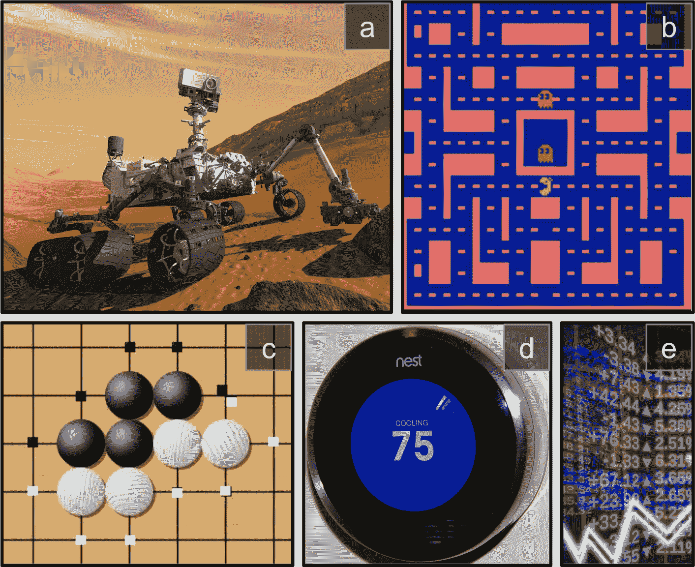

图 18-1 强化学习案例：（a）行走机器人，（b）Ms.Pac-Man 游戏，（c）围棋玩家，（d）恒温器，（e）自动交易员

其实没有正奖励也是可以的，例如智能体在迷宫内移动，它每分每秒都得到一个负奖励，所以它要尽可能快的找到出口！还有很多适合强化学习的领域，例如自动驾驶汽车，推荐系统，在网页上放广告，或者控制一个图像分类系统让它明白它应该关注于什么。

## 策略搜索

智能体用于改变行为的算法称为策略。例如，策略可以是一个把观测当输入，行为当做输出的神经网络（见图 16-2）。

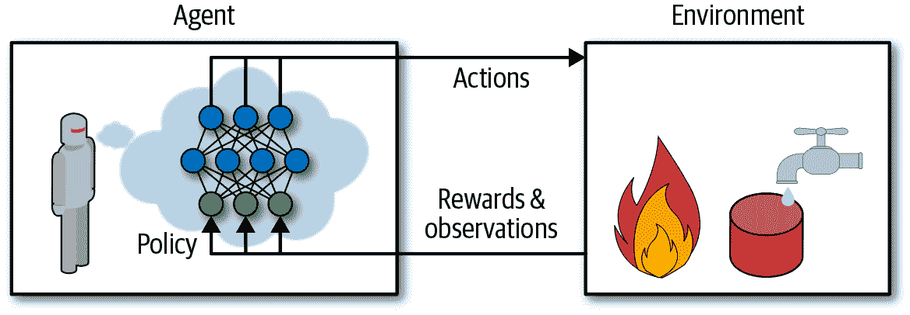

图 18-2 用神经网络策略做加强学习

这个策略可以是你能想到的任何算法，它甚至可以是非确定性的。事实上，在某些任务中，策略根本不必观察环境！举个例子，例如，考虑一个真空吸尘器，它的奖励是在 30 分钟内捡起的灰尘数量。它的策略可以是每秒以概率`p`向前移动，或者以概率`1-p`随机地向左或向右旋转。旋转角度将是`-r`和`+r`之间的随机角度，因为该策略涉及一些随机性，所以称为随机策略。机器人将有一个不确定的轨迹，它保证它最终会到达任何可以到达的地方，并捡起所有的灰尘。问题是：30 分钟后它会捡起多少灰尘？

怎么训练这样的机器人？你能调整的策略参数只有两个：概率`p`和角度范围`r`。一个想法是这些参数尝试许多不同的值，并选择执行最佳的组合（见图 18-3）。这是一个策略搜索的例子，在这种情况下使用暴力方法。然而，当策略空间太大（通常情况下），以这样的方式找到一组好的参数就像是大海捞针。

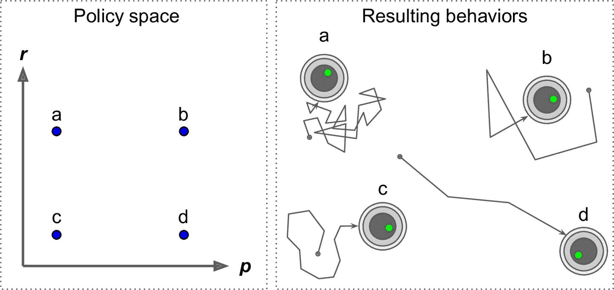

图 18-3 策略空间中的四个点以及机器人的对应行为

另一种搜寻策略空间的方法是遗传算法。例如你可以随机创造一个包含 100 个策略的第一代基因，随后杀死 80 个糟糕的策略，随后让 20 个幸存策略繁衍 4 代。一个后代只是它父辈基因的复制品加上一些随机变异。幸存的策略加上他们的后代共同构成了第二代。你可以继续以这种方式迭代代，直到找到一个好的策略。

另一种方法是使用优化技术，通过评估奖励关于策略参数的梯度，然后通过跟随梯度向更高的奖励（梯度上升）调整这些参数。这种方法被称为策略梯度（policy gradient, PG），我们将在本章后面详细讨论。例如，回到真空吸尘器机器人，你可以稍微增加概率 P 并评估这是否增加了机器人在 30 分钟内拾起的灰尘的量；如果确实增加了，就相对应增加`p`，否则减少`p`。我们将使用 Tensorflow 来实现 PG 算法，但是在这之前我们需要为智能体创造一个生存的环境，所以现在是介绍 OpenAI Gym 的时候了。

## OpenAI Gym 介绍

强化学习的一个挑战是，为了训练对象，首先需要有一个工作环境。如果你想设计一个可以学习 Atari 游戏的程序，你需要一个 Atari 游戏模拟器。如果你想设计一个步行机器人，那么环境就是真实的世界，你可以直接在这个环境中训练你的机器人，但是这有其局限性：如果机器人从悬崖上掉下来，你不能仅仅点击“撤消”。你也不能加快时间；增加更多的计算能力不会让机器人移动得更快。一般来说，同时训练 1000 个机器人是非常昂贵的。简而言之，训练在现实世界中是困难和缓慢的，所以你通常需要一个模拟环境，至少需要引导训练。例如，你可以使用 PyBullet 或 MuJoCo 来做 3D 物理模拟。

OpenAI Gym 是一个工具包，它提供各种各样的模拟环境（Atari 游戏，棋盘游戏，2D 和 3D 物理模拟等等），所以你可以训练，比较，或开发新的 RL 算法。

安装之前，如果你是用虚拟环境创建的独立的环境，需要先激活：

```py
$ cd $ML_PATH                # 工作目录 (e.g., $HOME/ml)
$ source my_env/bin/activate # Linux or MacOS
$ .\my_env\Scripts\activate  # Windows 
```

接下来安装 OpenAI gym。可通过`pip`安装：

```py
$ python3 -m pip install --upgrade gym 
```

取决于系统，你可能还要安装 Mesa OpenGL Utility（GLU）库（比如，在 Ubuntu 18.04 上，你需要运行`apt install libglu1-mesa`）。这个库用来渲染第一个环境。接着，打开一个 Python 终端或 Jupyter 笔记本，用`make()`创建一个环境：

```py
>>> import gym
>>> env = gym.make("CartPole-v1")
>>> obs = env.reset()
>>> obs
array([-0.01258566, -0.00156614,  0.04207708, -0.00180545]) 
```

这里创建了一个 CartPole 环境。这是一个 2D 模拟，其中推车可以被左右加速，以平衡放置在它上面的平衡杆（见图 18-4）。你可以用`gym.envs.registry.all()`获得所有可用的环境。在创建环境之后，需要使用`reset()`初始化。这会返回第一个观察结果。观察取决于环境的类型。对于 CartPole 环境，每个观测是包含四个浮点数的 1D Numpy 向量：这些浮点数代表推车的水平位置（0.0 为中心）、速度（正是右）、杆的角度（0.0 为垂直）及角速度（正为顺时针）。

用`render()`方法展示环境（见图 18-4）。在 Windows 上，这需要安装 X Server，比如 VcXsrv 或 Xming：

```py
>>> env.render()
True 
```

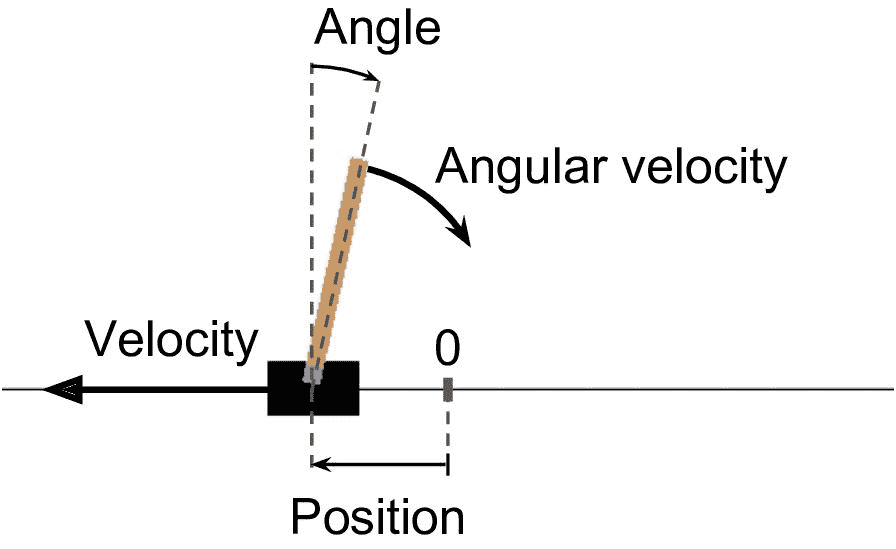

图 18-4 CartPole 环境

> 提示：如果你在使用无头服务器（即，没有显示器），比如云上的虚拟机，渲染就会失败。解决的唯一方法是使用假 X server，比如 Xvfb 或 Xdummy。例如，装好 Xvfb 之后（Ubuntu 或 Debian 上运行`apt install xvfb`），用这条命令启动 Python：`xvfb-run -s "-screen 0 1400x900x24" python3`。或者，安装 Xvfb 和[`pyvirtualdisplay` 库](https://links.jianshu.com/go?to=https%3A%2F%2Fhoml.info%2Fpyvd)（这个库包装了 Xvfb），在程序启动处运行`pyvirtualdisplay.Display(visible=0, size=(1400, 900)).start()`。

如果你想让`render()`让图像以一个 Numpy 数组格式返回，可以将`mode`参数设置为`rgb_array`（注意，这个环境会渲染环境到屏幕上）：

```py
>>> img = env.render(mode="rgb_array") 
>>> img.shape  # height, width, channels (3=RGB) 
(800, 1200, 3) 
```

询问环境，可以采取的可能行动：

```py
>>> env.action_space
Discrete(2) 
```

`Discrete(2)`的意思是可能的行动是整数 0 和 1，表示向左（0）或向右（1）加速。其它的环境可能有其它离散的行动，或其它种类的行动（例如，连续性行动）。因为棍子是向右偏的（`obs[2] > 0`），让车子向右加速：

```py
>>> action = 1  # accelerate right
>>> obs, reward, done, info = env.step(action)
>>> obs
array([-0.01261699,  0.19292789,  0.04204097, -0.28092127])
>>> reward
1.0
>>> done
False
>>> info
{} 
```

`step()`方法执行给定的动作并返回四个值：

`obs`:

这是新的观测，小车现在正在向右走（`obs[1]>0`，注：当前速度为正，向右为正）。平衡杆仍然向右倾斜（`obs[2]>0`），但是他的角速度现在为负（`obs[3]<0`），所以它在下一步后可能会向左倾斜。

`reward`：

在这个环境中，无论你做什么，每一步都会得到 1.0 奖励，所以游戏的目标就是尽可能长的运行。

`done`：

当游戏结束时这个值会为`True`。当平衡杆倾斜太多、或越过屏幕、或超过 200 步时会发生这种情况。之后，必须重新设置环境才能重新使用。

`info`：

该字典可以在其他环境中提供额外信息用于调试或训练。例如，在一些游戏中，可以指示智能体还剩多少条命。

> 提示：使用完环境后，应当调用它的`close()`方法释放资源。

让我们硬编码一个简单的策略，当杆向左倾斜时向左边加速，当杆向右倾斜时加速向右边加速。我们使用这个策略来获得超过 500 步的平均回报：

```py
def basic_policy(obs):
    angle = obs[2]
    return 0 if angle < 0 else 1

totals = []
for episode in range(500):
    episode_rewards = 0
    obs = env.reset()
    for step in range(200):
        action = basic_policy(obs)
        obs, reward, done, info = env.step(action)
        episode_rewards += reward
        if done:
            break
    totals.append(episode_rewards) 
```

这段代码不难。让我们看看结果：

```py
>>> import numpy as np
>>> np.mean(totals), np.std(totals), np.min(totals), np.max(totals)
(41.718, 8.858356280936096, 24.0, 68.0) 
```

即使有 500 次尝试，这一策略从未使平衡杆在超过 68 个连续的步骤里保持直立。结果太好。如果你看一下 Juyter 笔记本中的模拟，你会发现，推车越来越强烈地左右摆动，直到平衡杆倾斜过度。让我们看看神经网络是否能提出更好的策略。

## 神经网络策略

让我们创建一个神经网络策略。就像之前我们编码的策略一样，这个神经网络将把观察作为输入，输出要执行的动作。更确切地说，它将估计每个动作的概率，然后我们将根据估计的概率随机地选择一个动作（见图 18-5）。在 CartPole 环境中，只有两种可能的动作（左或右），所以我们只需要一个输出神经元。它将输出动作 0（左）的概率`p`，动作 1（右）的概率显然将是`1 - p`。例如，如果它输出 0.7，那么我们将以 70% 的概率选择动作 0，以 30% 的概率选择动作 1。

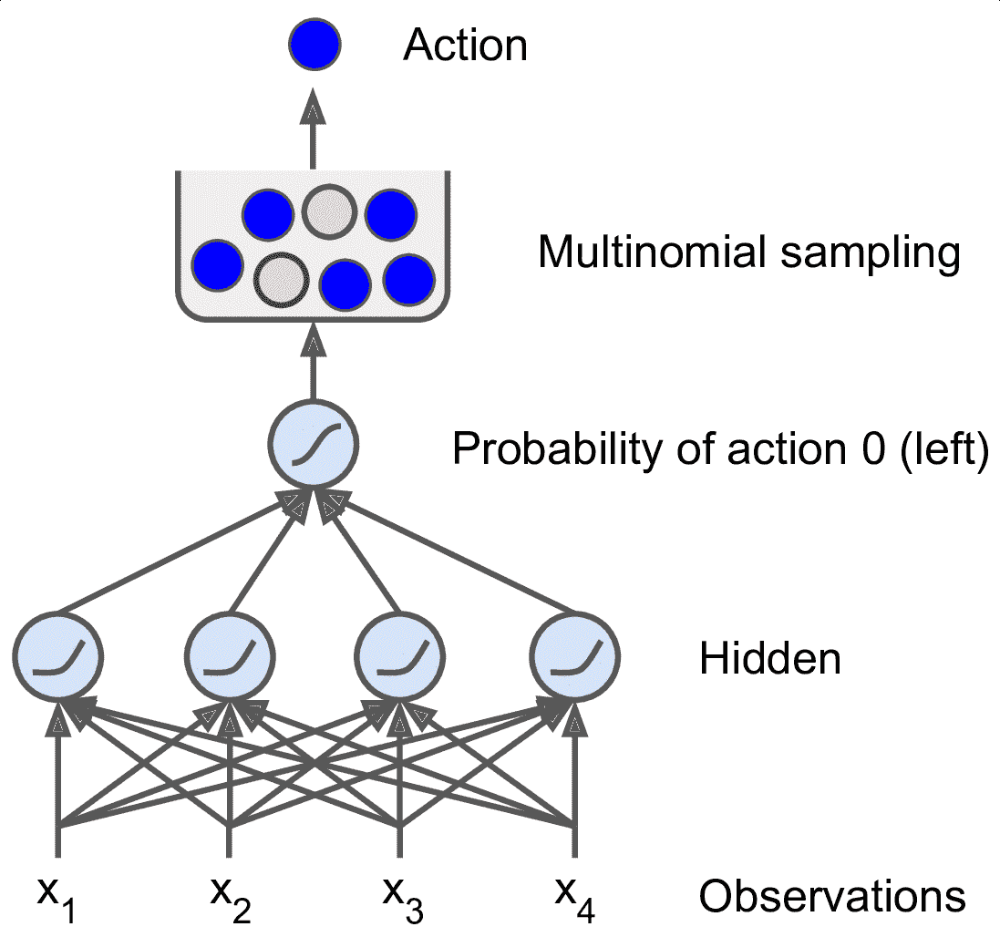

图 18-5 神经网络策略

你可能奇怪为什么我们根据神经网络给出的概率来选择随机的动作，而不是选择最高分数的动作。这种方法使智能体在**探索新的行为**和**利用那些已知可行的行动**之间找到正确的平衡。举个类比：假设你第一次去餐馆，所有的菜看起来同样吸引人，所以你随机挑选一个。如果菜好吃，你可以增加下一次点它的概率，但是你不应该把这个概率提高到 100%，否则你将永远不会尝试其他菜肴，其中一些甚至比你尝试的更好。

还要注意，在这个特定的环境中，过去的动作和观察可以被放心地忽略，因为每个观察都包含环境的完整状态。如果有一些隐藏状态，那么你也需要考虑过去的行为和观察。例如，如果环境仅仅揭示了推车的位置，而不是它的速度，那么你不仅要考虑当前的观测，还要考虑先前的观测，以便估计当前的速度。另一个例子是当观测是有噪声的的，在这种情况下，通常你想用过去的观察来估计最可能的当前状态。因此，CartPole 问题是简单的；观测是无噪声的，而且它们包含环境的全状态。

下面是用`tf.keras`创建这个神经网络策略的代码：

```py
import tensorflow as tf
from tensorflow import keras

n_inputs = 4 # == env.observation_space.shape[0]

model = keras.models.Sequential([
    keras.layers.Dense(5, activation="elu", input_shape=[n_inputs]),
    keras.layers.Dense(1, activation="sigmoid"),
]) 
```

在导入之后，我们使用`Sequential`模型定义策略网络。输入的数量是观测空间的大小（在 CartPole 的情况下是 4 个），我们只有 5 个隐藏单元，并且我们只有 1 个输出概率（向左的概率），所以输出层只需一个使用 sigmoid 的神经元就成。如果超过两个动作，每个动作就要有一个神经元，然后使用 softmax 激活函数。

好了，现在我们有一个可以观察和输出动作的神经网络了，那我们怎么训练它呢？

## 评价行为：信用分配问题

如果我们知道每一步的最佳动作，我们可以像通常一样训练神经网络，通过最小化估计概率和目标概率之间的交叉熵。这只是通常的监督学习。然而，在强化学习中，智能体获得的指导的唯一途径是通过奖励，奖励通常是稀疏的和延迟的。例如，如果智能体在 100 个步骤内设法平衡杆，它怎么知道它采取的 100 个行动中的哪一个是好的，哪些是坏的？它所知道的是，在最后一次行动之后，杆子坠落了，但最后一次行动肯定不是负全责的。这被称为信用分配问题：当智能体得到奖励时，很难知道哪些行为应该被信任（或责备）。如果一只狗在表现优秀几小时后才得到奖励，它会明白它做对了什么吗？

为了解决这个问题，一个通常的策略是基于这个动作后得分的总和来评估这个个动作，通常在每个步骤中应用衰减因子`r`。例如（见图 18-6），如果一个智能体决定连续三次向右，在第一步之后得到 +10 奖励，第二步后得到 0，最后在第三步之后得到 -50，然后假设我们使用衰减率`r=0.8`，那么第一个动作将得到`10 +r×0 + r2×(-50)=-22`的分数。如果衰减率接近 0，那么与即时奖励相比，未来的奖励不会有多大意义。相反，如果衰减率接近 1，那么对未来的奖励几乎等于即时回报。典型的衰减率通常从 0.9 到 0.99 之间。如果衰减率为 0.95，那么未来 13 步的奖励大约是即时奖励的一半（`0.9513×0.5`），而当衰减率为 0.99，未来 69 步的奖励是即时奖励的一半。在 CartPole 环境下，行为具有相当短期的影响，因此选择 0.95 的折扣率是合理的。

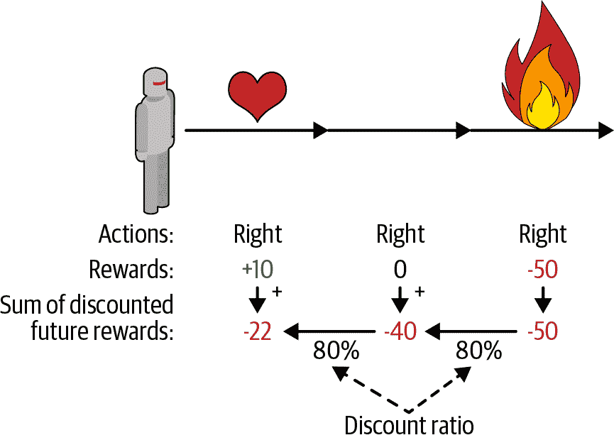

图 18-6 计算行动的回报：未来衰减求和

当然，一个好的动作可能会紧跟着一串坏动作，这些动作会导致平衡杆迅速下降，从而导致一个好的动作得到一个低分数（类似的，一个好行动者有时会在一部烂片中扮演主角）。然而，如果我们花足够多的时间来训练游戏，平均下来好的行为会得到比坏的更好的分数。因此，为了获得相当可靠的动作分数，我们必须运行很多次并将所有动作分数归一化（通过减去平均值并除以标准偏差）。之后，我们可以合理地假设消极得分的行为是坏的，而积极得分的行为是好的。现在我们有一个方法来评估每一个动作，我们已经准备好使用策略梯度来训练我们的第一个智能体。让我们看看如何做。

## 策略梯度

正如前面所讨论的，PG 算法通过遵循更高回报的梯度来优化策略参数。一种流行的 PG 算法，称为增强算法，在 1929 由 Ronald Williams 提出。这是一个常见的变体：

1.  首先，让神经网络策略玩几次游戏，并在每一步计算梯度，这使得智能体更可能选择行为，但不应用这些梯度。

2.  运行几次后，计算每个动作的得分（使用前面段落中描述的方法）。

3.  如果一个动作的分数是正的，这意味着动作是好的，可应用较早计算的梯度，以便将来有更大的的概率选择这个动作。但是，如果分数是负的，这意味着动作是坏的，要应用相反梯度来使得这个动作在将来采取的可能性更低。我们的方法就是简单地将每个梯度向量乘以相应的动作得分。

4.  最后，计算所有得到的梯度向量的平均值，并使用它来执行梯度下降步骤。

让我们使用`tf.keras`实现这个算法。我们将训练我们早先建立的神经网络策略，让它学会平衡车上的平衡杆。首先，需要一个能执行一步的函数。假定做出的动作都是对的，激素亲戚损失和梯度（梯度会保存一会，根据动作的结果再对其修改）：

```py
def play_one_step(env, obs, model, loss_fn):
    with tf.GradientTape() as tape:
        left_proba = model(obs[np.newaxis])
        action = (tf.random.uniform([1, 1]) > left_proba)
        y_target = tf.constant([[1.]]) - tf.cast(action, tf.float32)
        loss = tf.reduce_mean(loss_fn(y_target, left_proba))
    grads = tape.gradient(loss, model.trainable_variables)
    obs, reward, done, info = env.step(int(action[0, 0].numpy()))
    return obs, reward, done, grads 
```

逐行看代码：

*   在`GradientTape`代码块内，先调用模型，传入一个观察（将观察变形为包含单个实例的批次）。输出是向左的概率。

*   然后，选取一个 0 到 1 之间的浮点数，检查是否大于`left_proba`。概率为`left_proba`时，`action`是`False`；概率为`1-left_proba`时，`action`是`True`。当将这个布尔值转变为数字时，动作是 0（左）或 1（右）及对应的概率。

*   接着，定义向左的目标概率：1 减去动作（浮点值）。如果动作是 0（左），则向左的目标概率等于 1。如果动作是 1（右），则目标概率等于 0。

*   然后使用损失函数计算损失，使用记录器计算模型可训练变量的损失梯度。这些梯度会在后面应用前，根据动作的结果做微调。

*   最后，执行选择的动作，无论是否结束，返回新的观察、奖励，和刚刚计算的梯度。

现在，创建另一个函数基于`play_one_step()`的多次执行函数，返回所有奖励和每个周期和步骤的梯度：

```py
def play_multiple_episodes(env, n_episodes, n_max_steps, model, loss_fn):
    all_rewards = []
    all_grads = []
    for episode in range(n_episodes):
        current_rewards = []
        current_grads = []
        obs = env.reset()
        for step in range(n_max_steps):
            obs, reward, done, grads = play_one_step(env, obs, model, loss_fn)
            current_rewards.append(reward)
            current_grads.append(grads)
            if done:
                break
        all_rewards.append(current_rewards)
        all_grads.append(current_grads)
    return all_rewards, all_grads 
```

这段代码返回了奖励列表（每个周期一个奖励列表，每个步骤一个奖励），还有一个梯度列表（每个周期一个梯度列表，每个步骤一个梯度元组，每个元组每个变脸有一个梯度张量）。

算法会使用`play_multiple_episodes()`函数，多次执行游戏（比如，10 次），然后会检查所有奖励，做衰减，然后归一化。要这么做，需要多个函数：第一个计算每个步骤的未来衰减奖励的和，第二个归一化所有这些衰减奖励（减去平均值，除以标准差）：

```py
def discount_rewards(rewards, discount_factor):
    discounted = np.array(rewards)
    for step in range(len(rewards) - 2, -1, -1):
        discounted[step] += discounted[step + 1] * discount_factor
    return discounted

def discount_and_normalize_rewards(all_rewards, discount_factor):
    all_discounted_rewards = [discount_rewards(rewards, discount_factor)
                              for rewards in all_rewards]
    flat_rewards = np.concatenate(all_discounted_rewards)
    reward_mean = flat_rewards.mean()
    reward_std = flat_rewards.std()
    return [(discounted_rewards - reward_mean) / reward_std
            for discounted_rewards in all_discounted_rewards] 
```

检测其是否有效：

```py
>>> discount_rewards([10, 0, -50], discount_factor=0.8)
array([-22, -40, -50])
>>> discount_and_normalize_rewards([[10, 0, -50], [10, 20]],
...                                discount_factor=0.8)
...
[array([-0.28435071, -0.86597718, -1.18910299]),
 array([1.26665318, 1.0727777 ])] 
```

调用`discount_rewards()`，返回了我们想要的结果（见图 18-6）。可以确认函数`discount_and_normalize_rewards()`返回了每个周期每个步骤的归一化的行动的结果。可以看到，第一个周期的表现比第二个周期的表现糟糕，所以归一化的结果都是负的；第一个周期中的动作都是不好的，而第二个周期中的动作被认为是好的。

可以准备运行算法了！现在定义超参数。运行 150 个训练迭代，每次迭代完成 10 次周期，每个周期最多 200 个步骤。衰减因子是 0.95：

```py
n_iterations = 150
n_episodes_per_update = 10
n_max_steps = 200
discount_factor = 0.95 
```

还需要一个优化器和损失函数。优化器用普通的 Adam 就成，学习率用 0.01，因为是二元分类器，使用二元交叉熵损失函数：

```py
optimizer = keras.optimizers.Adam(lr=0.01)
loss_fn = keras.losses.binary_crossentropy 
```

接下来创建和运行训练循环。

```py
for iteration in range(n_iterations):
    all_rewards, all_grads = play_multiple_episodes(
        env, n_episodes_per_update, n_max_steps, model, loss_fn)
    all_final_rewards = discount_and_normalize_rewards(all_rewards,
                                                       discount_factor)
    all_mean_grads = []
    for var_index in range(len(model.trainable_variables)):
        mean_grads = tf.reduce_mean(
            [final_reward * all_grads[episode_index][step][var_index]
             for episode_index, final_rewards in enumerate(all_final_rewards)
                 for step, final_reward in enumerate(final_rewards)], axis=0)
        all_mean_grads.append(mean_grads)
    optimizer.apply_gradients(zip(all_mean_grads, model.trainable_variables)) 
```

逐行看下代码：

*   在每次训练迭代，循环调用`play_multiple_episodes()`，这个函数玩 10 次游戏，返回每个周期和步骤的奖励和梯度。

*   然后调用`discount_and_normalize_rewards()`计算每个动作的归一化结果（代码中是`final_reward`）。这样可以测量每个动作的好坏结果。

*   接着，循环每个可训练变量，计算每个变量的梯度加权平均，权重是`final_reward`。

*   最后，将这些平均梯度应用于优化器：微调模型的变量。

就是这样。这段代码可以训练神经网络策略，模型可以学习保持棍子的平衡（可以尝试笔记本中的“策略梯度”部分）。每个周期的平均奖励会非常接近 200（200 是环境默认的最大值）。成功！

> 提示：研究人员试图找到一种即使当智能体最初对环境一无所知时也能很好工作的算法。然而，除非你正在写论文，否则你应该尽可能多地将先前的知识注入到智能体中，因为它会极大地加速训练。例如，因为知道棍子要尽量垂直，你可以添加与棍子角度成正比的负奖励。这可以让奖励不那么分散，是训练加速。此外，如果你已经有一个相当好的策略，你可以训练神经网络模仿它，然后使用策略梯度来改进它。

尽管它相对简单，但是该算法是非常强大的。你可以用它来解决更难的问题，而不仅仅是平衡一辆手推车上的平衡杆。事实上，因为样本不足，必须多次玩游戏，才能取得更大进展。但这个算法是更强大算法的基础，比如演员评论家算法（后面会介绍）。

现在我们来看看另一个流行的算法族。与 PG 算法直接尝试优化策略以增加奖励相反，我们现在看的算法不那么直接：智能体学习去估计每个状态的未来衰减奖励的期望总和，或者在每个状态中的每个行为未来衰减奖励的期望和。然后，使用这些知识来决定如何行动。为了理解这些算法，我们必须首先介绍马尔可夫决策过程（MDP）。

## 马尔可夫决策过程

在二十世纪初，数学家 Andrey Markov 研究了没有记忆的随机过程，称为马尔可夫链。这样的过程具有固定数量的状态，并且在每个步骤中随机地从一个状态演化到另一个状态。它从状态`S`演变为状态`S'`的概率是固定的，它只依赖于`(S, S')`对，而不是依赖于过去的状态（系统没有记忆）。

图 18-7 展示了一个具有四个状态的马尔可夫链的例子。假设该过程从状态`S0`开始，并且在下一步骤中有 70% 的概率保持在该状态不变中。最终，它必然离开那个状态，并且永远不会回来，因为没有其他状态回到`S0`。如果它进入状态`S1`，那么它很可能会进入状态`S2`（90% 的概率），然后立即回到状态`S1`（以 100% 的概率）。它可以在这两个状态之间交替多次，但最终它会落入状态`S3`并永远留在那里（这是一个终端状态）。马尔可夫链可以有非常不同的动力学，它们在热力学、化学、统计学等方面有着广泛的应用。

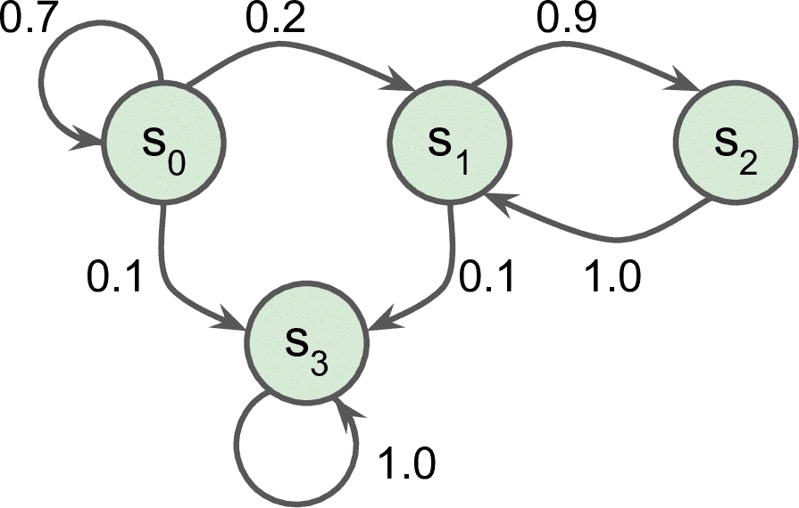

图 18-7 马尔科夫链案例

马尔可夫决策过程最初是在 20 世纪 50 年代由 Richard Bellman [描述](https://links.jianshu.com/go?to=https%3A%2F%2Fhoml.info%2F133)的。它们类似于马尔可夫链，但有一个不同：在状态转移的每一步中，一个智能体可以选择几种可能的动作中的一个，并且过渡概率取决于所选择的动作。此外，一些状态过渡返回一些奖励（正或负），智能体的目标是找到一个策略，随着时间的推移将最大限度地提高奖励。

例如，图 18-8 中所示的 MDP 在每个步骤中具有三个状态（用圆圈表示）和三个可能的离散动作（用菱形表示）。

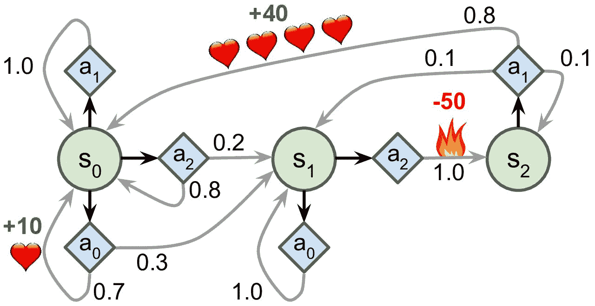

图 18-8 马尔科夫决策过程案例

如果从状态`S0`开始，可以在动作`A0`、`A1`或`A2`之间进行选择。如果它选择动作`A1`，它就保持在状态`S0`中，并且没有任何奖励。因此，如果愿意的话，它可以决定永远呆在那里。但是，如果它选择动作`A0`，它有 70% 的概率获得 +10 奖励，并保持在状态`S0`。然后，它可以一次又一次地尝试获得尽可能多的奖励。但它将在状态`S1`中结束这样的行为。在状态`S1`中，它只有两种可能的动作：`A0`或`A2`。它可以通过反复选择动作`A0`来选择停留，或者它可以选择动作`A2`移动到状态`S2`并得到 -50 奖励。在状态`S2`中，除了采取行动`A1`之外，别无选择，这将最有可能引导它回到状态`S0`，在途中获得 +40 的奖励。通过观察这个 MDP，你能猜出哪一个策略会随着时间的推移而获得最大的回报吗？在状态`S0`中，`A0`是最好的选择，在状态`S2`中，智能体别无选择，只能采取行动`A1`，但是在状态`S1`中，智能体否应该保持不动（`A0`）或通过火（`A2`），这是不明确的。

贝尔曼找到了一种估计任何状态`S`的最佳状态值的方法，记作`V(s)`，它是智能体在其采取最佳行为达到状态`s`后所有衰减未来奖励的总和的平均期望。他证明，如果智能体的行为最佳，那么就适用于贝尔曼最优性公式（见公式 18-1）。这个递归公式表示，如果智能体最优地运行，那么当前状态的最优值等于在采取一个最优动作之后平均得到的奖励，加上该动作可能导致的所有可能的下一个状态的期望最优值。

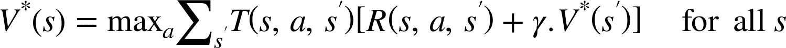

公式 18-1 贝尔曼最优性公式

其中：

*   `T(s, a, s′)`为智能体选择动作`a`时从状态`s`到状态`s'`的概率。例如，图 18-8 中，`T(s2, a1, s0) = 0.8`。

*   `R(s, a, s′)`为智能体选择以动作`a`从状态`s`到状态`s'`的过程中得到的奖励。例如图 18-8 中，`R(s2, a1, s0) = +40`。

*   `γ`为衰减率。

这个等式直接引出了一种算法，该算法可以精确估计每个可能状态的最优状态值：首先将所有状态值估计初始化为零，然后用数值迭代算法迭代更新它们（见公式 18-2）。一个显著的结果是，给定足够的时间，这些估计保证收敛到最优状态值，对应于最优策略。


公式 18-2 数值迭代算法

在这个公式中，`V[k](s)`是在`k`次算法迭代对状态`s`的估计。

> 笔记：该算法是动态规划的一个例子，它将了一个复杂的问题（在这种情况下，估计潜在的未来衰减奖励的总和）变为可处理的子问题，可以迭代地处理（在这种情况下，找到最大化平均报酬与下一个衰减状态值的和的动作）

了解最佳状态值可能是有用的，特别是评估策略，但它没有明确地告诉智能体要做什么。幸运的是，贝尔曼发现了一种非常类似的算法来估计最优状态-动作值（*state-action values*），通常称为 Q 值。状态行动`(S, A)`对的最优 Q 值，记为`Q*(s, a)`，是智能体在到达状态`S`，然后选择动作`A`之后平均衰减未来奖励的期望的总和。但是在它看到这个动作的结果之前，假设它在该动作之后的动作是最优的。

下面是它的工作原理：再次，通过初始化所有的 Q 值估计为零，然后使用 Q 值迭代算法更新它们（参见公式 18-3）。

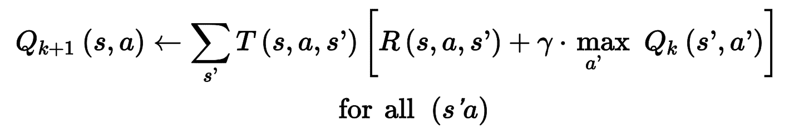

公式 18-3 Q 值迭代算法

一旦你有了最佳的 Q 值，定义最优的策略`π*(s)`，就没什么作用了：当智能体处于状态`S`时，它应该选择具有最高 Q 值的动作，用于该状态：

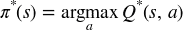

让我们把这个算法应用到图 18-8 所示的 MDP 中。首先，我们需要定义 MDP：

```py
transition_probabilities = [ # shape=[s, a, s']
        [[0.7, 0.3, 0.0], [1.0, 0.0, 0.0], [0.8, 0.2, 0.0]],
        [[0.0, 1.0, 0.0], None, [0.0, 0.0, 1.0]],
        [None, [0.8, 0.1, 0.1], None]]
rewards = [ # shape=[s, a, s']
        [[+10, 0, 0], [0, 0, 0], [0, 0, 0]],
        [[0, 0, 0], [0, 0, 0], [0, 0, -50]],
        [[0, 0, 0], [+40, 0, 0], [0, 0, 0]]]
possible_actions = [[0, 1, 2], [0, 2], [1]] 
```

例如，要想知道经过动作`a1`，从`s2`到`s0`的过渡概率，我们需要查询`transition_probabilities[2][1][0]`（等于 0.8）。相似的，要得到奖励，需要查询`rewards[2][1][0]`（等于 +40）。要得到`s2`的可能的动作，需要查询`possible_actions[2]`（结果是`a1`）。然后，必须将 Q 值初始化为 0（对于不可能的动作，Q 值设为`–∞`）：

```py
Q_values = np.full((3, 3), -np.inf) # -np.inf for impossible actions
for state, actions in enumerate(possible_actions):
    Q_values[state, actions] = 0.0  # for all possible actions 
```

现在运行 Q 值迭代算法。它反复对 Q 值的每个状态和可能的动作应用公式 18-3：

```py
gamma = 0.90 # the discount factor

for iteration in range(50):
    Q_prev = Q_values.copy()
    for s in range(3):
        for a in possible_actions[s]:
            Q_values[s, a] = np.sum([
                    transition_probabilities[s][a][sp]
                    * (rewards[s][a][sp] + gamma * np.max(Q_prev[sp]))
                for sp in range(3)]) 
```

Q 值的结果如下：

```py
>>> Q_values
array([[18.91891892, 17.02702702, 13.62162162],
       [ 0\.        ,        -inf, -4.87971488],
       [       -inf, 50.13365013,        -inf]]) 
```

例如，当智能体处于状态`s0`，选择动作`a1`，衰减未来奖励的期望和大约是 17.0。

对于每个状态，查询拥有最高 Q 值的动作：

```py
>>> np.argmax(Q_values, axis=1) # optimal action for each state
array([0, 0, 1]) 
```

这样就得到了衰减因子等于 0.9 时，这个 MDP 的最佳策略是什么：状态`s0`时选择动作`a0`；在状态`s1`时选择动作`a0`；在状态`s2`时选择动作`a1`。有趣的是，如果将衰减因子提高到 0.95，最佳策略发生了改变：在状态`s1`时，最佳动作变为`a2`（通过火！）。道理很明显，如果未来期望越高，忍受当前的痛苦是值得的。

## 时间差分学习

具有离散动作的强化学习问题通常可以被建模为马尔可夫决策过程，但是智能体最初不知道转移概率是什么（它不知道`T(s, a, s′)`），并且它不知道奖励会是什么（它不知道`R(s, a, s′)`）。它必须经历每一个状态和每一次转变并且至少知道一次奖励，并且如果要对转移概率进行合理的估计，就必须经历多次。

时间差分学习（TD 学习）算法与数值迭代算法非常类似，但考虑到智能体仅具有 MDP 的部分知识。一般来说，我们假设智能体最初只知道可能的状态和动作，没有更多了。智能体使用探索策略，例如，纯粹的随机策略来探索 MDP，并且随着它的发展，TD 学习算法基于实际观察到的转换和奖励来更新状态值的估计（见公式 18-4）。

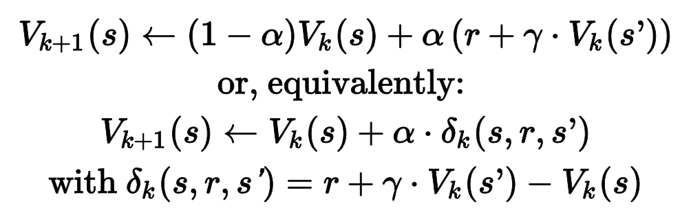

公式 18-4 TD 学习算法

在这个公式中：

*   `α`是学习率（例如 0.01）。

*   `r + γ · Vk(s′)`被称为 TD 目标。

*   `δk(s, r, s′)`被称为 TD 误差。

公式的第一种形式的更为准确的表达，是使用：

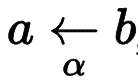

它的意思是`ak+1 ← (1 – α) · ak + α ·bk`，公式 18-4 的第一行可以重写为：

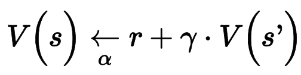

> 提示：TD 学习和随机梯度下降有许多相似点，特别是 TD 学习每次只处理一个样本。另外，和随机梯度下降一样，如果逐渐降低学习率，是能做到收敛的（否则，会在最佳 Q 值附近反复跳跃）。

对于每个状态`S`，该算法只跟踪智能体离开该状态时立即获得的奖励的平均值，再加上它期望稍后得到的奖励（假设它的行为最佳）。

## Q 学习

类似地，Q 学习算法是 Q 值迭代算法的改编版本，其适应转移概率和回报在初始未知的情况（见公式 18-5）。Q 学习通过观察智能体玩游戏，逐渐提高 Q 值的估计。一旦有了准确（或接近）的 Q 值估计，则选择具有最高 Q 值的动作（即，贪婪策略）。

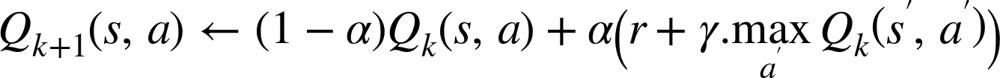

公式 18-5 Q 学习算法

对于每一个状态动作对`(s,a)`，该算法跟踪智能体在以动作`A`离开状态`S`时获得的即时奖励平均值`R`，加上它期望稍后得到的奖励。由于目标策略将最优地运行，所以我们取下一状态的 Q 值估计的最大值。

以下是如何实现 Q 学习算法。首先，需要让一个智能体探索环境。要这么做的话，我们需要一个步骤函数，好让智能体执行一个动作，并返回结果状态和奖励：

```py
def step(state, action):
    probas = transition_probabilities[state][action]
    next_state = np.random.choice([0, 1, 2], p=probas)
    reward = rewards[state][action][next_state]
    return next_state, reward 
```

现在，实现智能体的探索策略。因为状态空间很小，使用简单随机策略就可以。如果长时间运行算法，智能体会多次访问每个状态，也会多次尝试每个可能的动作：

```py
def exploration_policy(state):
    return np.random.choice(possible_actions[state]) 
```

然后，和之前一样初始化 Q 值，使用学习率递降的方式运行 Q 学习算法（使用第 11 章介绍过的指数调度算法）：

```py
alpha0 = 0.05 # initial learning rate
decay = 0.005 # learning rate decay
gamma = 0.90 # discount factor
state = 0 # initial state

for iteration in range(10000):
    action = exploration_policy(state)
    next_state, reward = step(state, action)
    next_value = np.max(Q_values[next_state])
    alpha = alpha0 / (1 + iteration * decay)
    Q_values[state, action] *= 1 - alpha
    Q_values[state, action] += alpha * (reward + gamma * next_value)
    state = next_state 
```

算法会覆盖最优 Q 值，但会经历多次迭代，可能有许多超参数调节。见图 18-9，Q 值迭代算法（左）覆盖速度很快，只用了不到 20 次迭代，而 Q 学习算法（右）用了 8000 次迭代才覆盖完。很明显，不知道过渡概率或奖励，使得找到最佳策略显著变难！

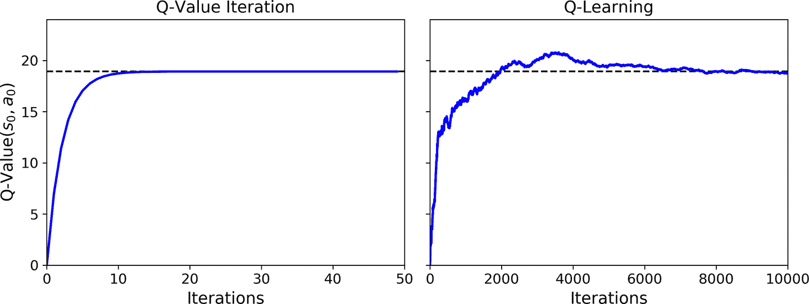

图 18-9 Q 值迭代算法（左）对比 Q 学习算法（右）

Q 学习被称为离线策略算法，因为正在训练的策略不是正在执行的策略：在前面的例子中，被执行的策略（探索策略）是完全随机的，而训练的算法总会选择具有最高 Q 值的动作。相反的，策略梯度下降算法是在线算法：使用训练的策略探索世界。令人惊讶的是，该算法能够通过观察智能体的随机行为（例如当你的老师是一个醉猴子时，学习打高尔夫球）学习最佳策略。我们能做得更好吗？

### 探索策略

当然，只有在探索策略充分探索 MDP 的情况下，Q 学习才能起作用。尽管一个纯粹的随机策略保证最终访问每一个状态和每个转换多次，但可能需要很长的时间这样做。因此，一个更好的选择是使用 ε 贪婪策略：在每个步骤中，它以概率`ε`随机地或以概率为`1-ε`贪婪地选择具有最高 Q 值的动作。ε 贪婪策略的优点（与完全随机策略相比）是，它将花费越来越多的时间来探索环境中有趣的部分，因为 Q 值估计越来越好，同时仍花费一些时间访问 MDP 的未知区域。以`ε`为很高的值（例如，1）开始，然后逐渐减小它（例如，下降到 0.05）是很常见的。

或者，不依赖于探索的可能性，另一种方法是鼓励探索策略来尝试它以前没有尝试过的行动。这可以被实现为加到 Q 值估计的奖励，如公式 18-6 所示。

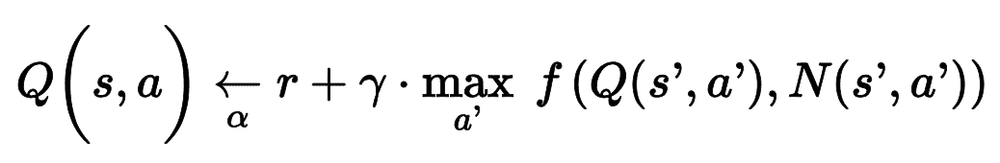

公式 18-6 使用探索函数的 Q 学习

在这个公式中：

*   `N(s′, a′)`计算了在状态`s`时选择动作`a`的次数

*   `f(Q, N)`是一个探索函数，例如`f(Q, N) = Q + κ/(1 + N)`，其中`κ`是一个好奇超参数，它测量智能体被吸引到未知状态的程度。

### 近似 Q 学习和深度 Q 学习

Q 学习的主要问题是，它不能很好地扩展到具有许多状态和动作的大（甚至中等）的 MDP。例如，假如你想用 Q 学习来训练一个智能体去玩 Ms. Pac-Man（图 18-1）。Ms. Pac-Man 可以吃超过 150 粒粒子，每一粒都可以存在或不存在（即已经吃过）。因此，可能状态的数目大于`21^50 ≈ 10^45`。空间大小比地球的的总原子数要多得多，所以你绝对无法追踪每一个 Q 值的估计值。

解决方案是找到一个函数`Q[θ](s,a)`，使用可管理数量的参数（根据向量θ）来近似 Q 值。这被称为近似 Q 学习。多年来，人们都是手工在状态中提取并线性组合特征（例如，最近的鬼的距离，它们的方向等）来估计 Q 值，但在 2013 年， DeepMind 表明使用深度神经网络可以工作得更好，特别是对于复杂的问题。它不需要任何特征工程。用于估计 Q 值的 DNN 被称为深度 Q 网络（DQN），并且使用近似 Q 学习的 DQN 被称为深度 Q 学习。

如何训练 DQN 呢？这里用 DQN 在给定的状态动作对`(s,a)`，来估计 Q 值。感谢贝尔曼，我们知道这个近似 Q 值要接近在状态`s`执行动作`a`的奖励`r`，加上之前的衰减奖励。要估计未来衰减奖励的和，我们只需在下一个状态`s'`，对于所有可能的动作`a'`执行 DQN。针对每个可能的动作，获得了近似的 Q 值。然后挑选最高的，并做衰减，就得到了未来衰减奖励的和。通过将奖励`r`和未来衰减奖励估计相加，得到了状态动作对`(s, a)`的目标 Q 值`y(s, a)`，见公式 18-7。

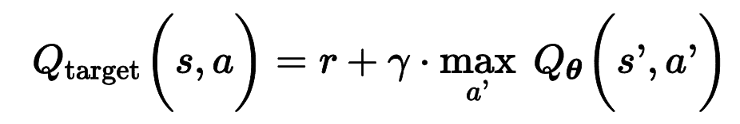

公式 18-7 目标 Q 值

有了这个目标 Q 值，可以使用梯度下降运行一步训练算法。具体地，要最小化 Q 值`Q(s, a)`和目标 Q 值的平方根方差（或使用 Huber 损失降低算法对大误差的敏感度）。这就是基础的深度 Q 学习算法。下面用其处理平衡车问题。

## 实现深度 Q 学习

首先需要的是一个深度 Q 网络。理论上，需要一个输入是状态-动作对、输出是近似 Q 值的神经网络，但在实际中，使用输入是状态、输出是每个可能动作的近似 Q 值的神经网络，会更加高效。要处理 CartPole 环境，我们不需要非常复杂的神经网络；只要几个隐藏层就够了：

```py
env = gym.make("CartPole-v0")
input_shape = [4] # == env.observation_space.shape
n_outputs = 2 # == env.action_space.n

model = keras.models.Sequential([
    keras.layers.Dense(32, activation="elu", input_shape=input_shape),
    keras.layers.Dense(32, activation="elu"),
    keras.layers.Dense(n_outputs)
]) 
```

使用这个 DQN 选择一个动作，选择 Q 值最大的动作。要保证智能体探索环境，使用的是ε 贪婪策略（即，选择概率为ε的随机动作）：

```py
def epsilon_greedy_policy(state, epsilon=0):
    if np.random.rand() < epsilon:
        return np.random.randint(2)
    else:
        Q_values = model.predict(state[np.newaxis])
        return np.argmax(Q_values[0]) 
```

不仅只根据最新的经验训练 DQN，将所有经验存储在接力缓存（或接力记忆）中，每次训练迭代，从中随机采样一个批次。这样可以降低训练批次中的经验相关性，可以极大的提高训练效果。如下，使用双端列表实现：

```py
from collections import deque

replay_buffer = deque(maxlen=2000) 
```

> 提示：双端列表是一个链表，每个元素指向后一个和前一个元素。插入和删除元素都非常快，但双端列表越长，随机访问越慢。如果需要一个非常大的接力缓存，可以使用环状缓存；见笔记本中的`Deque vs Rotating List`章节。

每个经验包含五个元素：状态，智能体选择的动作，奖励，下一个状态，一个知识是否结束的布尔值（`done`）。需要一个小函数从接力缓存随机采样。返回的是五个 NumPy 数组，对应五个经验：

```py
def sample_experiences(batch_size):
    indices = np.random.randint(len(replay_buffer), size=batch_size)
    batch = [replay_buffer[index] for index in indices]
    states, actions, rewards, next_states, dones = [
        np.array([experience[field_index] for experience in batch])
        for field_index in range(5)]
    return states, actions, rewards, next_states, dones 
```

再创建一个使用ε 贪婪策略的单次玩游戏函数，然后将结果经验存储在接力缓存中：

```py
def play_one_step(env, state, epsilon):
    action = epsilon_greedy_policy(state, epsilon)
    next_state, reward, done, info = env.step(action)
    replay_buffer.append((state, action, reward, next_state, done))
    return next_state, reward, done, info 
```

最后，再创建最后一个批次采样函数，用单次梯度下降训练这个 DQN：

```py
batch_size = 32
discount_factor = 0.95
optimizer = keras.optimizers.Adam(lr=1e-3)
loss_fn = keras.losses.mean_squared_error

def training_step(batch_size):
    experiences = sample_experiences(batch_size)
    states, actions, rewards, next_states, dones = experiences
    next_Q_values = model.predict(next_states)
    max_next_Q_values = np.max(next_Q_values, axis=1)
    target_Q_values = (rewards +
                       (1 - dones) * discount_factor * max_next_Q_values)
    mask = tf.one_hot(actions, n_outputs)
    with tf.GradientTape() as tape:
        all_Q_values = model(states)
        Q_values = tf.reduce_sum(all_Q_values * mask, axis=1, keepdims=True)
        loss = tf.reduce_mean(loss_fn(target_Q_values, Q_values))
    grads = tape.gradient(loss, model.trainable_variables)
    optimizer.apply_gradients(zip(grads, model.trainable_variables)) 
```

逐行看下代码：

*   首先定义一些超参数，并创建优化器和损失函数。

*   然后创建`training_step()`函数。先采样经验批次，然后使用 DQN 预测每个可能动作的每个经验的下一状态的 Q 值。因为假定智能体采取最佳行动，所以只保留下一状态的最大 Q 值。接着，我们使用公式 18-7 计算每个经验的状态-动作对的目标 Q 值。

*   接着，使用 DQN 计算每个有经验的状态-动作对的 Q 值。但是，DQN 还会输出其它可能动作的 Q 值，不仅是智能体选择的动作。所以，必须遮掩不需要的 Q 值。`tf.one_hot()`函数可以方便地将动作下标的数组转别为掩码。例如，如果前三个经验分别包含动作 1，1，0，则掩码会以`[[0, 1], [0, 1], [1, 0],...]`开头。然后将 DQN 的输出乘以这个掩码，就可以排除所有不需要的 Q 值。然后，按列求和，去除所有的零，只保留有经验的状态-动作对的 Q 值。得到张量`Q_values`，包含批次中每个经验的预测的 Q 值。

*   然后，计算损失：即有经验的状态-动作对的目标 Q 值和预测 Q 值的均方误差。

*   最后，对可训练变量，用梯度下降步骤减小损失。

这是最难的部分。现在，训练模型就简单了：

```py
for episode in range(600):
    obs = env.reset()
    for step in range(200):
        epsilon = max(1 - episode / 500, 0.01)
        obs, reward, done, info = play_one_step(env, obs, epsilon)
        if done:
            break
    if episode > 50:
        training_step(batch_size) 
```

跑 600 次游戏，每次最多 200 步。在每一步，先计算 ε 贪婪策略的`epsilon`值：这个值在 500 个周期内，从 1 线性降到 0.01。然后调用`play_one_step()`函数，用 ε 贪婪策略挑选动作，然后执行并在接力缓存中记录经验。如果周期结束，就退出循环。最后，如果超过了 50 个周期，就调用`training_step()`函数，用从接力缓存取出的批次样本训练模型。玩 50 个周期，而不训练的原因是给接力缓存一些时间来填充（如果等待的不够久，则接力缓存中的样本散度太小）。像上面这样，我们就实现了深度 Q 学习算法。

图 18-10 展示了智能体在每个周期获得的总奖励。

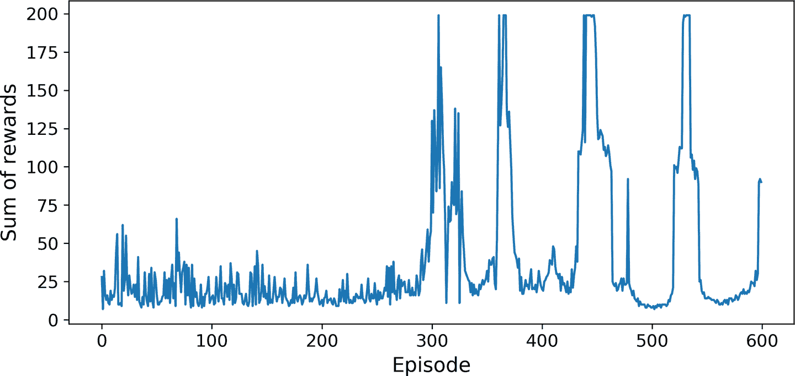

图 18-10 深度 Q 学习算法的学习曲线

可以看到，在前 300 个周期，算法的进步不大（部分是因为ε在一开始时非常高），然后表现突然提升到了 200（环境最高值）。这说明算法效果不错，并且比策略梯度算法快得多！但仅仅几个周期之后，性能就骤降到了 25。这被称为“灾难性遗忘”，这是所有 RL 算法都面临的大问题：随着智能体探索环境，不断更新策略，但是在环境的一部分学到的内容可能和之前学到的内容相悖。经验是关联的，学习环境不断改变 —— 这不利于梯度下降！如果增加接力缓存的大小，可以减轻这个问题。但真实的情况是，强化学习很难：训练通常不稳定，需要尝试许多超参数值和随机种子。例如，如果改变每层神经元的数量，从 32 到 30 或 34，模型表现不会超过 100（DQN 只有一个隐藏层时，可能更稳定）。

> 笔记：强化学习非常困难，很大程度是因为训练的不稳定性，以及巨大的超参数和随机种子的不稳定性。就像 Andrej Karpathy 说的：“监督学习自己就能工作，强化学习被迫工作”。你需要时间、耐心、毅力，还有一点运气。这是为什么强化学习不是常用的深度学习算法的原因。除了 AlphaGo 和 Atari 游戏，还有一些其它应用：例如，Google 使用 RL 优化数据中心的费用，也用于一些机器人应用的超参数调节，和推荐系统。

你可能想为什么我们不画出损失。事实证明损失不是模型表现的好指标。就算损失下降，智能体的表现也可能更糟（例如，智能体困在了环境中，则 DQN 开始对区域过拟合）。相反的，损失可能变大，但智能体表现不错（例如，如果 DQN 知道 Q 值，就能提高预测的质量，智能体就能表现得更好，得到更多奖励，但因为 DQN 还设置了更大的目标，所以误差增加了）。

我们现在学的基本的深度 Q 学习算法，在玩 Atari 时太不稳定。DeepMind 是怎么做的呢？他们调节了算法。

## 深度 Q 学习的变体

下面看几个深度 Q 学习算法的变体，它们不仅训练稳定而且很快。

### 固定 Q 值目标

在基本的深度 Q 学习算法中，模型不仅做预测还自己设置目标。有点像一只狗追自己的尾巴。反馈循环使得网络不稳定：会发生分叉、摇摆、冻结，等等。要解决问题，DeepMind 在 2013 年的论文中使用了两个 DQN，而不是一个：第一个是在线模型，它在每一步进行学习，并移动智能体；另一个是目标模型只定义目标。目标模型只是在线模型的克隆：

```py
target = keras.models.clone_model(model)
target.set_weights(model.get_weights()) 
```

然后，在`training_step()`函数中，只需要变动一行，使用目标模型计算接下来状态的 Q 值：

```py
next_Q_values = target.predict(next_states) 
```

最后，在训练循环中，必须每隔一段周期（比如，每 50 个周期），将在线模型的权重复制到目标模型中：

```py
if episode % 50 == 0:
    target.set_weights(model.get_weights()) 
```

因为目标模型更新的没有在线模型频繁，Q 值目标更加稳定，前面讨论反馈循环减弱了。这个方法是 DeepMind 在 2013 年的论文中提出的方法之一，可以让智能体从零学习 Atari 游戏。要稳定训练，他们使用的学习率是 0.00025，很小，每隔 10000 步才更新目标模型，接力缓存的大小是 1 百万。并且`epsilon`降低的很慢，用 1 百万步从 1 降到 0.1，他们让算法运行了 5000 万步。

本章后面会用这些超参数，使用 TF-Agents 库训练 DQN 智能体来玩 Breakout。在此之前，再看另一个性能更好的 DQN 变体。

### 双 DQN

在 [2015 年的论文](https://links.jianshu.com/go?to=https%3A%2F%2Fhoml.info%2Fdoubledqn)中，DeepMind 调节了他们的 DQN 算法，提高了性能，也稳定化了训练。他们称这个变体为双 DQN。算法更新的原因，是观察到目标网络倾向于高估 Q 值。事实上，假设所有动作都一样好：目标模型预测的 Q 值应该一样，但因为是估计值，其中一些可能存在更大的几率。目标模型会选择最大的 Q 值，最大的 Q 值要比平均 Q 值稍大，就像高估真正的 Q 值（就像在测量池塘深度时，测量随机水波的最高峰）。要修正这个问题，他们提出使用在线模型，而不是目标模型，来选择下一状态的最佳动作，只用目标模型估计这些最佳动作的 Q 值。下面是改善后的`training_step()`函数：

```py
def training_step(batch_size):
    experiences = sample_experiences(batch_size)
    states, actions, rewards, next_states, dones = experiences
    next_Q_values = model.predict(next_states)
    best_next_actions = np.argmax(next_Q_values, axis=1)
    next_mask = tf.one_hot(best_next_actions, n_outputs).numpy()
    next_best_Q_values = (target.predict(next_states) * next_mask).sum(axis=1)
    target_Q_values = (rewards +
                       (1 - dones) * discount_factor * next_best_Q_values)
    mask = tf.one_hot(actions, n_outputs)
    [...] # the rest is the same as earlier 
```

几个月之后，人们又提出了另一个改进的 DQN 算法。

### 优先经验接力

除了均匀地从接力缓存采样经验，如果更频繁地采样重要经验如何呢？这个主意被称为重要性采样（importance sampling，IS）或优先经验接力（prioritized experience replay，PER），是在 [2015 年的论文中](https://links.jianshu.com/go?to=https%3A%2F%2Fhoml.info%2Fprioreplay)由 DeepMind 发表的。

更具体的，可以导致快速学习成果的经验被称为重要经验。但如何估计呢？一个可行的方法是测量 TD 误差的大小`δ = r + γ·V(s′) – V(s)`。大 TD 误差说明过`(s, r, s′)`很值得学习。当经验记录在接力缓存中，它的重要性被设为非常大的值，保证可以快速采样。但是，一旦被采样（以及每次采样时），就计算 RD 误差`δ`，这个经验的优先度设为`p = |δ|`（加上一个小常数，保证每个经验的采样概率不是零）。采样优先度为`p`的概率`P`正比于`p[ζ]`，`ζ`是调整采样贪婪度的超参数：当`ζ=0`时，就是均匀采样，`ζ=1`时，就是完全的重要性采样。在论文中，作者使用的是`ζ=0.6`，最优值取决于任务。

但有一点要注意，因为样本偏向重要经验，必须要在训练时，根据重要性降低经验的重要性，否则模型会对重要经验过拟合。更加清楚的讲，重要经验采样更频繁，但训练时的权重要小。要这么做，将每个经验的训练权重定义为`w = (n P)^(–β)`，`n`是接力缓存的经验数，`β`是平衡重要性偏向的超参数（0 是不偏向，1 是完全偏向）。在论文中，作者一开始使用的是`β=0.4`，在训练结束，提高到了`β=1`。最佳值取决于任务，如果你提高了一个，也要提高其它的值。

接下来是最后一个重要的 DQN 算法的变体。

### 决斗 DQN

决斗 DQN 算法（DDQN，不要与双 DQN 混淆）是 DeepMind 在另一篇 [2015 年的论文](https://links.jianshu.com/go?to=https%3A%2F%2Fhoml.info%2Fddqn)中提出的。要明白原理，首先状态-动作对`(s, a)`的 Q 值，可以表示为`Q(s, a) = V(s) + A(s, a)`，其中`V(s)`是状态`s`的值，`A(s, a)`是状态`s`采取行动`a`的结果。另外，状态的值等于状态最佳动作`a*`的 Q 值（因为最优策略会选最佳动作），因此`V(s) = Q(s, a*)`，即`A(s, a*) = 0`。在决斗 DQN 中，模型估计状态值和每个动作的结果。因为最佳动作的结果是 0，模型减去最大预测结果。下面是一个简单的决斗 DQN，用函数式 API 实现：

```py
K = keras.backend
input_states = keras.layers.Input(shape=[4])
hidden1 = keras.layers.Dense(32, activation="elu")(input_states)
hidden2 = keras.layers.Dense(32, activation="elu")(hidden1)
state_values = keras.layers.Dense(1)(hidden2)
raw_advantages = keras.layers.Dense(n_outputs)(hidden2)
advantages = raw_advantages - K.max(raw_advantages, axis=1, keepdims=True)
Q_values = state_values + advantages
model = keras.Model(inputs=[input_states], outputs=[Q_values]) 
```

算法的其余部分和之前一样。事实上，你可以创建一个双决斗 DQN，并结合优先经验队列！更为一般地，许多 RL 方法都可以结合起来，就像 DeepMind 在 [2017 年的论文](https://links.jianshu.com/go?to=https%3A%2F%2Fhoml.info%2Frainbow)展示的。论文的作者将六个不同的方法结合起来，训练了一个智能体，称为“彩虹”，表现很好。

不过，要实现所有这些方法，进行调试、微调，并且训练模型需要很多工作。因此，不要重新草轮子，最好的方法是复用可扩展的、使用效果好的库，比如 TF-Agents。

## TF-Agents 库

[TF-Agents 库](https://links.jianshu.com/go?to=https%3A%2F%2Fgithub.com%2Ftensorflow%2Fagents)是基于 TensorFlow 实现的强化学习库，Google 开发并在 2018 年开源。和 OpenAI Gym 一样，它提供了许多现成的环境（包括了 OpenAI Gym 环境的包装），还支持 PyBullet 库（用于 3D 物理模拟），DeepMind 的 DM 控制库（基于 MuJoCo 的物理引擎），Unity 的 ML-Agents 库（模拟了许多 3D 环境）。它还使用了许多 RL 算法，包括 REINFORCE、DQN、DDQN，和各种 RL 组件，比如高效接力缓存和指标。TF-Agents 速度快、可扩展、便于使用、可自定义：你可以创建自己的环境和神经网络，可以对任意组件自定义。在这一节，我们使用 TF-Agents 训练一个智能体玩 Breakout，一个有名的 Atari 游戏（见图 18-11），使用的是 DQN 算法（可以换成任何你想用的算法）。

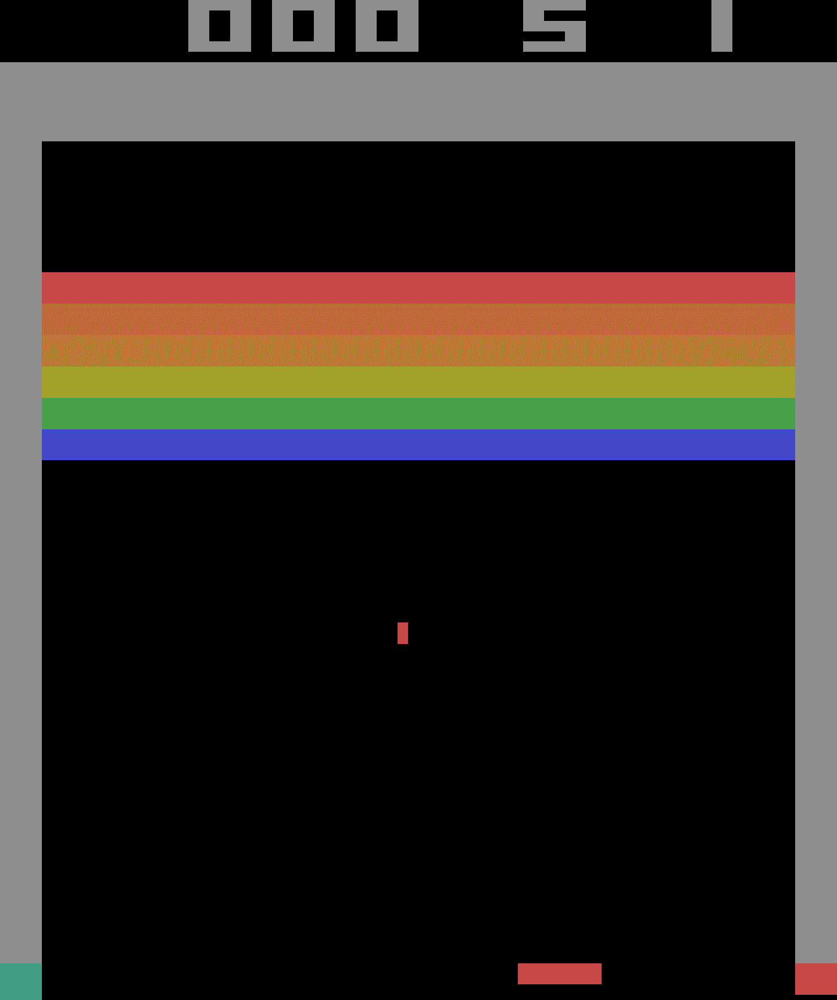

图 18-11 Breakout 游戏

### 安装 TF-Agents

先安装 TF-Agents 。可以使用 PIP 安装（如果使用的是虚拟环境，一定要先激活；如果不激活，要使用选项`--user`，或用管理员权限）：

```py
$ python3 -m pip install --upgrade tf-agents 
```

> 警告：写作本书时，TF-Agents 还很新，每天都有新进展，因此 API 可能会和现在有所不同 —— 但大体相同。如果代码不能运行，我会更新 Jupyter 笔记本。

然后，创建一个 TF-Agents 包装了 OpenAI GGym 的 Breakout 的环境。要这么做，需要先安装 OpenAI Gym 的 Atari 依赖：

```py
$ python3 -m pip install --upgrade 'gym[atari]' 
```

这条命令安装了`atari-py`，这是 Arcade 学习环境的 Python 接口，这个学习环境是基于 Atari 2600 模拟器 Stella。

### TF-Agents 环境

如果一切正常，就能引入 TF-Agents，创建 Breakout 环境了：

```py
>>> from tf_agents.environments import suite_gym
>>> env = suite_gym.load("Breakout-v4")
>>> env
<tf_agents.environments.wrappers.TimeLimit at 0x10c523c18> 
```

这是 OpenAI Gym 环境的包装，可以通过属性`gym`访问：

```py
>>> env.gym
<gym.envs.atari.atari_env.AtariEnv at 0x24dcab940> 
```

TF-Agents 环境和 OpenAI Gym 环境非常相似，但有些差别。首先，`reset()`方法不返回观察；返回的是`TimeStep`对象，它包装了观察，和一些其它信息：

```py
>>> env.reset()
TimeStep(step_type=array(0, dtype=int32),
         reward=array(0., dtype=float32),
         discount=array(1., dtype=float32),
         observation=array([[[0., 0., 0.], [0., 0., 0.],...]]], dtype=float32)) 
```

`step()`方法返回的也是`TimeStep`对象：

```py
>>> env.step(1) # Fire
TimeStep(step_type=array(1, dtype=int32),
         reward=array(0., dtype=float32),
         discount=array(1., dtype=float32),
         observation=array([[[0., 0., 0.], [0., 0., 0.],...]]], dtype=float32)) 
```

属性`reward`和`observation`是奖励和观察，与 OpenAI Gym 相同（除了`reward`表示为 NumPy 数组）。对于周期的第一个时间步，属性`step_type`等于 0，1 是中间步，2 后最后一步。可以调用时间步的`is_last()`方法，检测是否是最后一步。最后，`discount`属性指明了在这个时间步的衰减率。在这个例子中的值等于 1，所以没有任何衰减。可以通过在加载环境时设置`discount`参数，定义衰减因子。

> 笔记：在任何时候，你可以通过调用方法`current_time_step() method.`访问环境的当前时间步。

### 环境配置

TF-Agents 环境提供了配置，包括观察、动作、时间步，以及它们的形状、数据类型、名字，还有最小值和最大值：

```py
>>> env.observation_spec()
BoundedArraySpec(shape=(210, 160, 3), dtype=dtype('float32'), name=None,
                 minimum=[[[0\. 0\. 0.], [0\. 0\. 0.],...]],
                 maximum=[[[255., 255., 255.], [255., 255., 255.], ...]])
>>> env.action_spec()
BoundedArraySpec(shape=(), dtype=dtype('int64'), name=None,
                 minimum=0, maximum=3)
>>> env.time_step_spec()
TimeStep(step_type=ArraySpec(shape=(), dtype=dtype('int32'), name='step_type'),
         reward=ArraySpec(shape=(), dtype=dtype('float32'), name='reward'),
         discount=BoundedArraySpec(shape=(), ..., minimum=0.0, maximum=1.0),
         observation=BoundedArraySpec(shape=(210, 160, 3), ...)) 
```

可以看到，观察就是 Atari 屏幕的截图，用形状是`[210, 160, 3]`的 NumPy 数组表示。要渲染环境，可以调用`env.render(mode="human")`，如果想用 NumPy 数组的形式返回图片，可以调用`env.render(mode="rgb_array")`（与 OpenAI Gym 不同，这是默认模式）。

有四个可能的动作。Gym 的 Atari 环境有另一个方法，可以知道每个动作对应什么：

```py
>>> env.gym.get_action_meanings()
['NOOP', 'FIRE', 'RIGHT', 'LEFT'] 
```

> 提示：配置是配置类的一个实例，可以是嵌套列表、字典。如果配置是嵌套的，则配置对象必须匹配配置的嵌套结构。例如，如果观察配置是 `{"sensors": ArraySpec(shape=[2]), "camera": ArraySpec(shape=[100, 100])}` ，有效观察应该是 `{"sensors": np.array([1.5, 3.5]), "camera": np.array(...)}`。`tf.nest`包提供了工具处理嵌套结构（即，`nests`）。

观察结果很大，所以需要做降采样，并转换成灰度。这样可以加速训练，减少内存使用。要这么做，要使用环境包装器。

### 环境包装器和 Atari 预处理

TF-Agents 在`tf_agents.environments.wrappers`中，提供了一些环境包装器。正如名字，它们可以包装环境，转发每个调用，还可以添加其它功能。以下是一些常见的包装器：

`ActionClipWrapper`

*   根据动作配置裁剪动作。

`ActionDiscretizeWrapper`

*   将连续动作空间量化到离散的动作空间。例如，如果原始环境的动作空间是 -1.0 到 +1.0 的连续范围，但是如果想用算法支持离散的动作空间，比如 DQN，就可以用`discrete_env = ActionDiscretizeWrapper(env, num_actions=5)`包装环境，新的`discrete_env`有离散的可能动作空间：0、1、2、3、4。这些动作对应原始环境的动作 -1.0、-0.5、0.0、0.5、1.0。

`ActionRepeat`

*   将每个动作重复`n`次，并积累奖励。在许多环境中，这么做可以显著加速训练。

`RunStats`

*   记录环境数据，比如步骤数和周期数。

`TimeLimit`

*   超过最大的时间步数，则中断环境。

`VideoWrapper`

*   记录环境的视频。

要创建包装环境，需要先创建一个包装器，将包装过的环境传递给构造器。例如，下面的代码将一个环境包装在`ActionRepeat`中，让每个动作重复四次：

```py
from tf_agents.environments.wrappers import ActionRepeat

repeating_env = ActionRepeat(env, times=4) 
```

OpenAI Gym 在`gym.wrappers`中有一些环境包装器。但它们是用来包装 Gym 环境，不是 TF-Agents 环境，所以要使用的话，必须用 Gym 包装器包装 Gym 环境，再用 TF-Agents 包装器再包装起来。`suite_gym.wrap_env()`函数可以实现，只要传入 Gym 环境和 Gym 包装器列表，和/或 TF-Agents 包装器的列表。另外，`suite_gym.load()`函数既能创建 Gym 环境，如果传入包装器，也能做包装。每个包装器在包装时没有参数，所以如果想设置参数，必须传入`lambda`。例如，下面的代码创建了一个 Breakout 环境，每个周期最多运行 10000 步，每个动作重复四次：

```py
from gym.wrappers import TimeLimit

limited_repeating_env = suite_gym.load(
    "Breakout-v4",
    gym_env_wrappers=[lambda env: TimeLimit(env, max_episode_steps=10000)],
    env_wrappers=[lambda env: ActionRepeat(env, times=4)]) 
```

对于 Atari 环境，大多数论文使用了标准预处理步骤，TF-Agents 提供了便捷的`AtariPreprocessing`包装器做预处理。以下是支持的预处理：

灰度和降采样

*   将观察转换为灰度，并降采样（默认是`84 × 84`像素）

最大池化

*   游戏的最后两帧使用`1 × 1`过滤器做最大池化。是为了去除闪烁点。

跳帧

*   智能体每隔`n`个帧做一次观察（默认是 4），对于每一帧，动作都要重复几次，并收集所有的奖励。这么做可以有效加速游戏，因为奖励延迟降低，训练也加速了。

丢命损失

在某些游戏中，奖励是基于得分的，所以智能体死掉的话，不会立即受到惩罚。一种方法是当死掉时，立即结束游戏。这种做法有些争议，所以默认是关掉的。

因为默认 Atari 环境已经应用了随机跳帧和最大池化，我们需要加载原生不跳帧的变体，`BreakoutNoFrameskip-v4`。另外，从 Breakout 游戏中的一帧并不能知道球的方向和速度，这会使得智能体很难玩好游戏（除非这是一个 RNN 智能体，它可以在步骤之间保存状态）。应对方法之一是使用一个环境包装器，沿着每个频道维度，将多个帧叠起来做输出。`FrameStack4`包装器实现了这个策略，返回四个帧的栈式结果。下面就创建一个包装过的 Atari 环境。

```py
from tf_agents.environments import suite_atari
from tf_agents.environments.atari_preprocessing import AtariPreprocessing
from tf_agents.environments.atari_wrappers import FrameStack4

max_episode_steps = 27000 # <=> 108k ALE frames since 1 step = 4 frames
environment_name = "BreakoutNoFrameskip-v4"

env = suite_atari.load(
    environment_name,
    max_episode_steps=max_episode_steps,
    gym_env_wrappers=[AtariPreprocessing, FrameStack4]) 
```

预处理的结果展示在图 18-12 中。可以看到解析度更低了，但足够玩游戏了。另外，帧沿着频道维度叠起来，所以红色表示的是三步之前到现在的帧，绿色是从两步之前，蓝色是前一帧，粉色是当前帧。根据这一帧的观察，智能体可以看到球是像左下角移动的，所以应该继续将板子向左移动（和前面一步相同）。


图 18-12 预处理 Breakout 观察

最后，可以将环境包装进`TFPyEnvironment`：

```py
from tf_agents.environments.tf_py_environment import TFPyEnvironment

tf_env = TFPyEnvironment(env) 
```

这样就能在 TensorFlow 图中使用这个环境（在底层，这个类使用的是`tf.py_function()`，这可以让图调用任何 Python 代码）。有了`TFPyEnvironment`类，TF-Agents 支持纯 Python 环境和基于 TensorFlow 环境。更为一般的，TF-Agents 支持并提供了纯 Python 和基于 TensorFlow 的组件（智能体，接力缓存，指标，等等）。

有了 Breakout 环境，预处理和 TensorFlow 支持，我们必须创建 DQN 智能体，和其它要训练的组件。下面看看系统架构。

### 训练架构

TF-Agents 训练程序通常分为两个并行运行的部分，见图 18-13：左边，driver 使用收集策略探索环境选择动作，并收集轨迹（即，经验），将轨迹发送给观测器，观测器将轨迹存储到接力缓存中；右边，智能体从接力缓存中取出轨迹批次，然后训练网络。总而言之，左边的部分探索环境、收集轨迹，右边的部分学习更新收集策略。

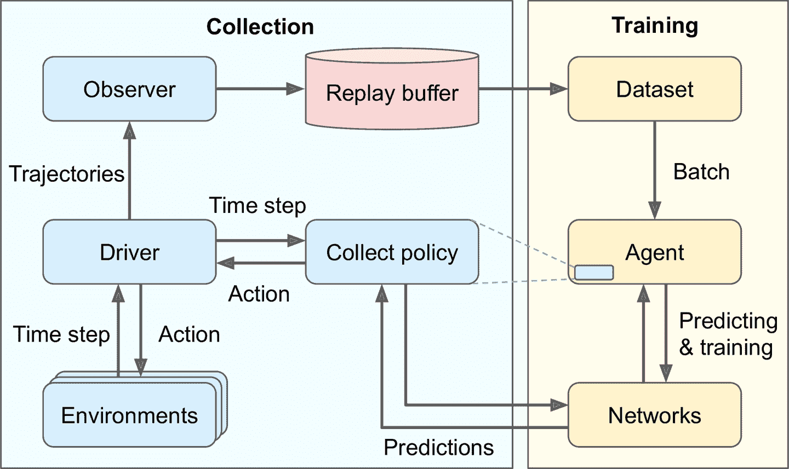

图 18-13 一个典型的 TF-Agents 训练架构

这张图有些疑惑点，回答如下：

*   为什么使用多个环境呢？这是为了让驱动并行探索多个环境的复制，发挥 CPU、GPU 的能力，给训练算法提供低关联的轨迹。

*   什么是轨迹？这是从一个时间步向下一个时间步过渡的简洁表征，或是一连串连续的从时间步`n`到时间步`n+t`的过渡。驱动收集的轨迹传给观测器，再将其存入接力缓存，接着再被采样用来训练。

*   为什么需要观测器？驱动不能直接保存轨迹吗？事实上，驱动可以直接保存轨迹，但这么做的话，会使得架构不够灵活。例如，如果不想使用接力缓存，该怎么做呢？如果想用轨迹做一些其它事情，比如计算指标，该怎么做呢？事实上，观测器是使用轨迹作为参数的任意函数。可以用观测器将轨迹存入接力缓存，或保存为 TFRecord 文件，或计算指标，或其它事情。另外，可以将多个观测器传给驱动，广播轨迹。

> 提示：尽管这个架构是最常见的，但是可以尽情自定义，可以更换成自己的组件。事实上，除非是研究新的 RL 算法，更适合使用自定义的环境来做自己的任务。要这么做，需要创建一个自定义类，继承自`tf_agents.environments.py_environment`包的`PyEnvironment`类，并重写一些方法，比如`action_spec()`、`observation_spec()`、`_reset()`、`_step()`（见笔记本的章节 Creating a Custom TF_Agents Environment）。

现在创建好了所有组件：先是深度 Q 网络，然后是 DQN 智能体（负责创建收集策略），然后是接力缓存和观测器，一些训练指标，驱动，最后是数据集。有了所有组件之后，先用一些轨迹填充接力缓存，然后运行主训练循环。因此，从创建深度 Q 网络开始。

### 创建深度 Q 网络

TF-Agents 库在`tf_agents.networks`包和子包中提供了许多网络。我们使用`tf_agents.networks.q_network.QNetwork`类：

```py
from tf_agents.networks.q_network import QNetwork

preprocessing_layer = keras.layers.Lambda(
                          lambda obs: tf.cast(obs, np.float32) / 255.)
conv_layer_params=[(32, (8, 8), 4), (64, (4, 4), 2), (64, (3, 3), 1)]
fc_layer_params=[512]

q_net = QNetwork(
    tf_env.observation_spec(),
    tf_env.action_spec(),
    preprocessing_layers=preprocessing_layer,
    conv_layer_params=conv_layer_params,
    fc_layer_params=fc_layer_params) 
```

这个`QNetwork`的输入是观察，每个动作输出一个 Q 值，所以必须给出观察和动作的配置。先是预处理层：一个`lambda`层将观察转换为 32 位浮点数，并做归一化（范围落到 0.0 和 1.0 之间）。观察包含无符号字节，占用空间是 32 位浮点数的四分之一，这就是为什么不在前面将观察转换为 32 位浮点数；我们要节省接力缓存的内存空间。接着，网络使用三个卷积层：第一个有 32 个`8 × 8`过滤器，步长是 4，第二个有 64 个`8 × 8`过滤器，步长是 2，第三个层有 64 个`8 × 8`的过滤器，步长为 1。最后，使用一个有 512 个神经元的紧密层，然后是一个有 4 个神经元的紧密输出层，输出是 Q 值（每个动作一个 Q 值）。所有卷积层和除了输出层的紧密层使用 ReLU 激活函数（可以通过设置参数`activation_fn`改变）。输出层不使用激活函数。

`QNetwork`的底层包含两个部分：一个处理观察的编码网络，和一个输出 Q 值的输出层。TF-Agent 的`EncodingNetwork`类实现了多种智能体都使用了的神经网络架构（见图 18-14）。

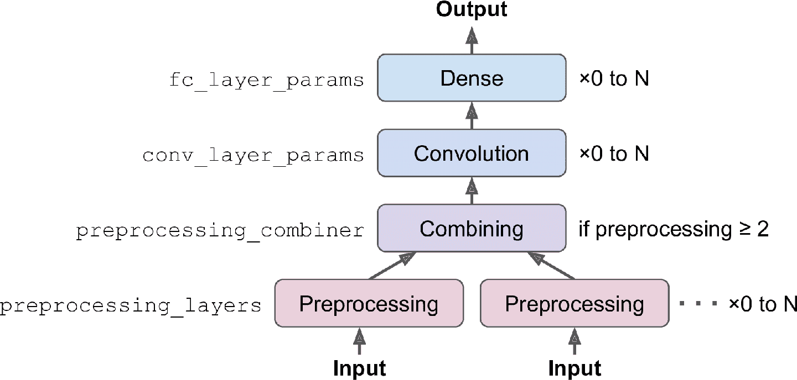

图 18-14 编码网络架构

可能有一个或多个输入。例如，如果每个观察包括传感器数据加上摄像头图片，就有两个输入。每个输入可能需要一些预处理步骤，你可以通过`preprocessing_layers`参数指定 Keras 层列表，每个输入有一个预处理层，网络会将层应用到每个对应的输入上（如果输入需要多个预处理层，可以传入一个完整模型，因为 Keras 模型也可以用作层）。如果有两个或更多输入，必须通过参数`preprocessing_combiner`传入其它层，将预处理层的输出合并成一个输出。

然后，编码层会顺序应用一列卷积层，只要指定参数`conv_layer_params`。这是一个包含 3 个元组的列表（每个卷积层一个元组），指明过滤器的数量、核大小，步长。卷积层之后，如果设置参数`fc_layer_params`，编码网络可以应用一串紧密层：参数`fc_layer_params`是一个列表，包含每个紧密层的神经元数。另外，通过参数`dropout_layer_params`，还可以传入丢弃率列表（每个紧密层一个），给每个紧密成设置丢弃。`QNetwork`将编码网络的输出传入给紧密输出层（每个动作一个神经元）。

> 笔记：`QNetwork`类非常灵活，可以创建许多不同的架构，如果需要更多的灵活性，还以通过创建自己的类：扩展类`tf_agents.networks.Network`，像常规自定义 Keras 层一样实现。`tf_agents.networks.Network`类是`keras.layers.Layer`类的子类，前者添加了一些智能体需要的功能，比如创建网络的浅复制（即，只复制架构，不复制权重）。例如，`DQNAgent`使用这个功能创建在线模型。

有了 DQN，接下来创建 DQN 智能体。

### 创建 DQN 智能体

利用`tf_agents​.agents`包和它的子包，TF-Agents 库实现了多种类型的智能体。我们使用类`tf_agents.agents​.dqn.dqn_agent.DqnAgent`：

```py
from tf_agents.agents.dqn.dqn_agent import DqnAgent

train_step = tf.Variable(0)
update_period = 4 # train the model every 4 steps
optimizer = keras.optimizers.RMSprop(lr=2.5e-4, rho=0.95, momentum=0.0,
                                     epsilon=0.00001, centered=True)
epsilon_fn = keras.optimizers.schedules.PolynomialDecay(
    initial_learning_rate=1.0, # initial ε
    decay_steps=250000 // update_period, # <=> 1,000,000 ALE frames
    end_learning_rate=0.01) # final ε
agent = DqnAgent(tf_env.time_step_spec(),
                 tf_env.action_spec(),
                 q_network=q_net,
                 optimizer=optimizer,
                 target_update_period=2000, # <=> 32,000 ALE frames
                 td_errors_loss_fn=keras.losses.Huber(reduction="none"),
                 gamma=0.99, # discount factor
                 train_step_counter=train_step,
                 epsilon_greedy=lambda: epsilon_fn(train_step))
agent.initialize() 
```

逐行看下代码：

*   首先创建计算训练步骤数的变量。

*   然后创建优化器，使用 2015 DQN 论文相同的超参数。

*   接着，创建对象`PolynomialDecay`，根据当前的训练步骤（用于降低学习率，也可以是其它值），用于计算 ε 贪婪收集策略的`ε`值。在 100 万 ALE 帧内（等于 250000 步骤，因为跳帧周期等于 4），将`ε`值从 1 降到 0.01（也是 2015 DQN 论文的用值）。另外，每隔 4 步（即，16 个 ALE 帧），所以`ε`值是在 62500 个训练步内下降的。

*   然后创建`DQNAgent`，传入时间步和动作配置、`QNetwork`、优化器、目标模型更新间的训练步骤数、损失函数、衰减率、变量`train_step`、返回ε值的函数（不接受参数，这就是为什么使用匿名函数传入`train_step`的原因）。注意，损失函数对每个实例返回一个误差，不是平均误差，所以要设置`reduction="none"`。

*   最后，启动智能体。

然后，创建接力缓存和观测器。

### 创建接力缓存和观测器

TF-Agents 库在`tf_agents.replay_buffers`包实现了多种接力缓存。一些是用纯 Python 写的（模块名开头是`py_`），其它是基于 TensorFlow 的（开头是`tf_`）。我们使用`tf_agents.replay_buffers.tf_uniform_replay_buffer`包追踪的`TFUniformReplayBuffer`类。它实现了高效均匀采样的接力缓存：

```py
from tf_agents.replay_buffers import tf_uniform_replay_buffer

replay_buffer = tf_uniform_replay_buffer.TFUniformReplayBuffer(
    data_spec=agent.collect_data_spec,
    batch_size=tf_env.batch_size,
    max_length=1000000) 
```

看一下这些参数：

`data_spec`

*   数据的配置会存储在接力缓存中。DQN 智能体知道收集数据什么样，通过属性`collect_data_spec`做数据配置。

`batch_size`

*   轨迹数量添加到每个步骤。在这个例子中，轨迹数是 1，因为驱动每个步骤执行一个动作收集一个轨迹。如果环境是一个批次化的环境（环境在每个时间步接收批次动作，返回批次观察），则驱动必须在每个时间步保存批次的轨迹。因为使用的是 TensorFlow 接力缓存，需要知道批次大小（创建计算图）。批次化环境的一个例子是`ParallelPyEnvironment`（出自包`tf_agents.environments.parallel_py_environment`）：用独立进程并行运行多个环境（对于相同的动作和观察配置，进程可以不同），每个步骤接收批次化的动作，并在环境中执行（每个环境一个动作），然后返回所有观察结果。

`max_length`

*   接力缓存的最大大小。我们创建一个可以存储 100 万个轨迹的接力缓存（和 2015 DQN 论文一样）。这需要不少内存。

> 提示：当存储两个连续的轨迹，它们包含两个连续的观察，每个观察有四个帧（因为包装器是`FrameStack4`），但是第二个观察中的三个帧是多余的（第一个观察中已经存在了）。换句话说，使用的内存大小是必须的四倍。要避免这个问题，可以使用包`tf_agents.replay_buffers.py_hashed_replay_buffer`的`PyHashedReplayBuffer`：它能沿着观察的最后一个轴对存储的轨迹去重。

现在创建向接力缓存写入轨迹的观测器。观测器就是一个接收轨迹参数的函数（或是调用对象），所以可以直接使用方法`add_method()`（绑定`replay_buffer`对象）作为观测器：

```py
replay_buffer_observer = replay_buffer.add_batch 
```

如果想创建自己的观测器，可以一个包含参数`trajectory`的函数。如果必须有状态，可以写一个包含方法`__call__(self, trajectory)`的类。例如，下面是一个每次调用，计数器都会加 1 的观测器（除了轨迹表示周期间的边界，不算成一步），每隔 100 次累加，显示总数（`\r`和`end=""`保证展示的计数器处于一条线）。

```py
class ShowProgress:
    def __init__(self, total):
        self.counter = 0
        self.total = total
    def __call__(self, trajectory):
        if not trajectory.is_boundary():
            self.counter += 1
        if self.counter % 100 == 0:
            print("\r{}/{}".format(self.counter, self.total), end="") 
```

接下来创建一些训练指标。

### 创建训练指标

TF-Agents 库再`tf_agents.metrics`包中实现了几个 RL 指标，一些是基于纯 Python 的，一些是基于 TensorFlow 的。创建一些指标统计周期数、步骤数、周期的平均数、平均周期长度：

```py
from tf_agents.metrics import tf_metrics

train_metrics = [
    tf_metrics.NumberOfEpisodes(),
    tf_metrics.EnvironmentSteps(),
    tf_metrics.AverageReturnMetric(),
    tf_metrics.AverageEpisodeLengthMetric(),
] 
```

> 笔记：训练或实现策略时，对奖励做衰减是合理的，这是为了平衡当前奖励与未来奖励的平衡。但是，当周期结束时，可以通过对所有未衰减的奖励求和来做评估。出于这个原因，`AverageReturnMetric`计算了每个周期未衰减奖励的和，并追踪平均值。

任何时候，可以调用`result()`方法获取指标（例如，`train_metrics[0].result()`）。或者，可以调用`log_metrics(train_metrics)`记录所有指标（这个函数位于`tf_agents.eval.metric_utils`包）：

```py
>>> from tf_agents.eval.metric_utils import log_metrics
>>> import logging
>>> logging.get_logger().set_level(logging.INFO)
>>> log_metrics(train_metrics)
[...]
NumberOfEpisodes = 0
EnvironmentSteps = 0
AverageReturn = 0.0
AverageEpisodeLength = 0.0 
```

接下来创建收集驱动。

### 创建收集驱动

正如图 18-13，驱动是使用给定策略探索环境的对象，收集经验，并广播给 observer。在每一步，发生的事情如下：

*   驱动将当前时间步传给收集策略，收集策略使用时间步选择动作，并返回包含动作的动作步对象。

*   驱动然后将动作传给环境，环境返回下一个时间步。

*   最后，驱动创建一个轨迹对象表示过渡，并广播给所有观察。

一些策略，比如 RNN 策略，是有状态的：策略根据给定的时间步和内部状态选择动作。有状态策略在动作步返回自己的状态，驱动会在下一个时间步将这个状态返回给策略。另外，驱动将策略状态保存到轨迹中（在字段`policy_info`中）：当智能体采样一条轨迹，它必须设置策略的状态设为采样时间步时的状态。

另外，就像前面讨论的，环境可能是批次化的环境，这种情况下，驱动将批次化的时间步传给策略（即，时间步对象包含批次观察、批次步骤类型、批次奖励、批次衰减，这四个批次的大小相同）。驱动还传递前一批次的策略状态。然后，策略返回去批次动作步，包含着批次动作和批次策略状态。最后，驱动创建批次化轨迹（即，轨迹包含批次步骤类型、批次观察、批次动作、批次奖励，更一般地，每个轨迹属性一个批次，所有批次大小相同）。

有两个主要的驱动类：`DynamicStepDriver`和`DynamicEpisodeDriver`。第一个收集给定数量步骤的经验，第二个收集给定数量周期数的经验。我们想收集每个训练迭代的四个步骤的经验（正如 2015 DQN 论文），所以创建一个`DynamicStepDriver`：

```py
from tf_agents.drivers.dynamic_step_driver import DynamicStepDriver

collect_driver = DynamicStepDriver(
    tf_env,
    agent.collect_policy,
    observers=[replay_buffer_observer] + training_metrics,
    num_steps=update_period) # collect 4 steps for each training iteration 
```

传入环境、智能体的收集策略、观测器列表（包括接力缓存观测器和训练指标），最后是要运行的步骤数（这个例子中是 4）。现在可以调用方法`run()`来运行，但最好先用纯随机策略收集的经验先填充接力缓存。要这么做，可以使用类`RandomTFPolicy`创建第二个驱动，运行 20000 步这个策略（等于 80000 个模拟帧，正如 2015 DQN 论文）。可以用`ShowProgress`观测器展示进展：

```py
from tf_agents.policies.random_tf_policy import RandomTFPolicy

initial_collect_policy = RandomTFPolicy(tf_env.time_step_spec(),
                                        tf_env.action_spec())
init_driver = DynamicStepDriver(
    tf_env,
    initial_collect_policy,
    observers=[replay_buffer.add_batch, ShowProgress(20000)],
    num_steps=20000) # <=> 80,000 ALE frames
final_time_step, final_policy_state = init_driver.run() 
```

快要能运行训练循环了。只需要最后一个组件：数据集。

### 创建数据集

要从接力缓存采样批次的轨迹，可以调用`get_next()`方法。这返回了轨迹的批次，还返回了含有样本 id 和采样概率的`BufferInfo`对象（可能对有些算法有用，比如 PER）。例如，下面的代码采样了一个包含两条轨迹的批次（子周期），每个包含三个连续步。这些子周期见图 18-15（每行包含一个周期的三个连续步）：

```py
>>> trajectories, buffer_info = replay_buffer.get_next(
...     sample_batch_size=2, num_steps=3)
...
>>> trajectories._fields
('step_type', 'observation', 'action', 'policy_info',
 'next_step_type', 'reward', 'discount')
>>> trajectories.observation.shape
TensorShape([2, 3, 84, 84, 4])
>>> trajectories.step_type.numpy()
array([[1, 1, 1],
       [1, 1, 1]], dtype=int32) 
```

`trajectories`对象是一个命名元组，有 7 个字段。每个字段包含一个张量，前两个维度是 2 和 3（因为有两条轨迹，每个三个时间步）。这解释了为什么`observation`字段的形状是`[2, 3, 84, 84, 4]`：这是两条轨迹，每条轨迹三个时间步，每步的观察是`84 × 84 × 4`。相似的，`step_type`张量的形状是`[2, 3]`：在这个例子中，两条轨迹包含三个连续步骤，步骤是在周期的中部，（类型是`1, 1, 1`）。在第二条轨迹中，看不到第一个观察中左下方的球，在接下来的两个观察中，球消失了，所以智能体会死，但周期不会马上结束，因为还剩几条命。


图 18-15 包含三个连续步骤的两条轨迹

每条轨迹是连续时间步和动作步的简洁表征，初衷是为了避免繁琐，怎么做呢？见图 18-16，过渡`n`由时间步`n`、动作步`n`、时间步`n+1`组成，而过渡`n+1`由时间步`n+1`、动作步`n+1`、时间步`n+2`。如果将这两个过渡直接存入接力缓存，时间步` `是重复的。为了避免重复，第`n`个轨迹步只包括时间步`n`的类型和观察（不是奖励和衰减），不包括时间步` `的观察（但是，不包括下一个时间步类型的复制）。

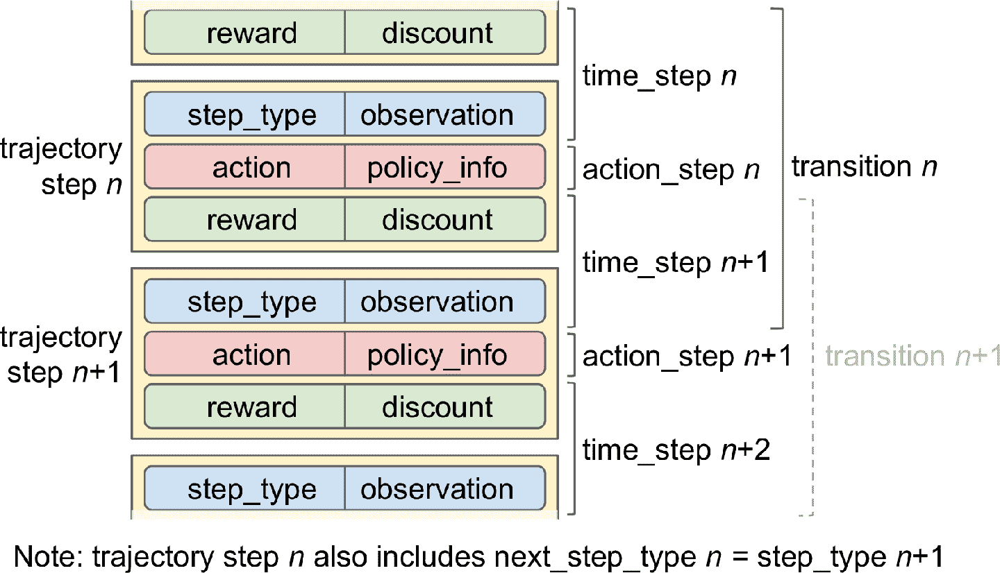

图 18-16 轨迹，过渡，时间步和动作步

因此，如果有批次轨迹，每个轨迹有`t+1`步骤（从时间步`n`到时间步`n+t`），包含从时间步`n`到时间步`n+t`的所有数据，但没有奖励和时间步`n`的衰减（但包括时间步`n+t+1`的奖励和衰减）。这表示`t`过渡（`n`到`n + 1`, `n + 1`到`n + 2`，…，`n + t – 1`到`n + t`）

模块`tf_agents.trajectories.trajectory`中的函数`to_transition()`将批次化的轨迹转变为包含批次`time_step`、`action_step`、`next_time_step`的列表。注意，第二个维度是 2，而不是 3，这是因为`t + 1`个时间步之间有`t`个过渡：

```py
>>> from tf_agents.trajectories.trajectory import to_transition
>>> time_steps, action_steps, next_time_steps = to_transition(trajectories)
>>> time_steps.observation.shape
TensorShape([2, 2, 84, 84, 4]) # 3 time steps = 2 transitions 
```

> 笔记：采样的轨迹可能会将两个（或多个）周期重叠！这种情况下，会包含边界过渡，意味着过渡的`step_type`等于 2（结束），`next_step_type`等于 0（开始）。当然，TF-Agents 可以妥善处理这些轨迹（例如，通过在碰到边界时重新设置策略状态）。轨迹的方法`is_boundary()`返回只是每一步是否是边界的张量。

对于主训练循环，不使用`get_next()`，而是用`tf.data.Dataset`。这样，就能借助 Data API 的高效（并行计算和预提取）。要这么做，可以调用接力缓存的`as_dataset()`方法：

```py
dataset = replay_buffer.as_dataset(
    sample_batch_size=64,
    num_steps=2,
    num_parallel_calls=3).prefetch(3) 
```

在每个训练步骤，提取包含 64 条轨迹的批次（和 2015 DQN 论文一样），每条轨迹有两步（即，2 步为 1 个完整过渡，包括下一步的观察）。这个数据集能并行处理三条轨迹，预提取三条轨迹。

> 笔记：对于策略算法，比如策略梯度，每个经验只需采样一次，训练完就可以丢掉。在这个例子中，你还可以使用一个接力缓存，但使用接力缓存的`gather_all()`方法，在每个训练迭代获取轨迹张量，训练完，再动过`clear()`方法清空接力缓存。

有了所有组件之后，就可以训练模型了。

### 创建训练循环

要加速训练，将主函数转换为 TensorFlow 函数。可以使用函数`tf_agents.utils.common.function()`，它包装了`tf.function()`，还有一些其它选项：

```py
from tf_agents.utils.common import function

collect_driver.run = function(collect_driver.run)
agent.train = function(agent.train) 
```

写一个小函数，可以`n_iterations`次运行主训练循环：

```py
def train_agent(n_iterations):
    time_step = None
    policy_state = agent.collect_policy.get_initial_state(tf_env.batch_size)
    iterator = iter(dataset)
    for iteration in range(n_iterations):
        time_step, policy_state = collect_driver.run(time_step, policy_state)
        trajectories, buffer_info = next(iterator)
        train_loss = agent.train(trajectories)
        print("\r{} loss:{:.5f}".format(
            iteration, train_loss.loss.numpy()), end="")
        if iteration % 1000 == 0:
            log_metrics(train_metrics) 
```

这个函数先向收集策略询问初始状态（给定环境批次大小，这个例子中是 1）。因为策略是无状态的，返回的是空元组（所以可以写成`policy_state = ()`）。然后，创建一个数据集的迭代器，并运行训练循环。在每个迭代，调用驱动的`run()`方法，传入当前的时间步（最初是`None`）和当前的策略状态。运行收集策略，收集四步的经验，将收集到的轨迹广播给接力缓存和指标。然后，从数据集采样一个批次轨迹，传给智能体的`train()`方法。返回对象`train_loss`，可能根据智能体的类型有变动。接着，展示迭代数和训练损失，每隔 1000 次迭代，输出所有指标的日志。现在可以调用`train_agent()`做一些迭代，智能体就能逐渐学会玩 Breakout 了。

```py
train_agent(10000000) 
```

训练需要大量算力和极大的耐心（根据硬件，可能需要几个小时甚至几天），可能还需要用不同的随机种子多次运行，以得到更好的结果，但是训练完成后，智能体在玩 Breakout 就比人厉害了。你还可以在其它 Atari 游戏上训练这个 DQN 智能体：智能体对于大多数动作游戏都可以超越人的表现，但是智能体对长故事线游戏不擅长。

## 流行 RL 算法概览

本章结束前，快速浏览一些流行的 RL 算法：

演员评论家算法

*   将策略梯度和深度 Q 网络结合而成 RL 算法族。演员评论家智能体包含两个神经网络：一个策略网络和一个 DQN。用智能体的经验正常训练 DQN。与常规 PG 相比，策略网络的学习有所不同：智能体（演员）依赖 DQN（评论家）估计的动作值。就像运动员（智能体）在教练（DQN）的帮助下学习。

异步优势演员评论家算法（A3C）

*   这是 DeepMind 在 2016 年推出的重要的演员评论家算法的变体，其中多个智能体并行学习，探索环境的不同复制。每隔一段间隔，每个智能体异步更新主网权重，然后从网络拉取最新权重。每个智能体都对网络产生共现，也从其它智能体学习。另外，DQN 不估计 Q 值，而是估计每个动作的优势，这样可以稳定训练。

优势演员评论家算法（A2C）

*   A3C 算法的变体，去除了异步。所有模型更新是同步的，所以梯度更新倾向于大批次，可以让模型更好地利用 GPU。

软演员评论家算法（SAC）

*   Tuomas Haarnoja 和其它 UC Berkeley 研究员在 2018 年提出的演员评论家变体。这个算法不仅学习奖励，还最大化其动作的熵。换句话说，在尽可能获取更多奖励的同时，尽量不可预测。这样可以鼓励智能体探索环境，可以加速训练。在 DQN 的估计不好时，可以避免重复执行相同的动作。这个算法采样非常高效（与前面的算法相反，前者采样慢）。TF-Agents 中有 SAC。

近似策略优化（PPO）

*   基于 A2C 的算法，它能裁剪函数的损失，避免过量权重更新（会导致训练不稳定）。PPO 是信任区域策略优化（TRPO）的简化版本，作者是 John Schulman 和其它 OpenAI 研究员。OpenAI 在 2019 年四月弄了个大新闻，他们用基于 PPO 的 OpenAI Five 打败了多人游戏 Dota2 的世界冠军。TF-Agents 中有 PPO。

基于好奇探索

*   RL 算法中反复出现的问题是奖励过于稀疏，这使得学习太慢且低效。Deepak Pathak 和其它 UC Berkeley 的研究员提出了解决方法：忽略奖励，让智能体极度好奇地探索环境？奖励变为了智能体的一部分，而不是来自环境。相似的，让孩子变得更好奇，比纯粹的奖励孩子，能取得更好的结果。怎么实现呢？智能体不断地预测动作的结果，并探索结果不匹配预测的环境。换句话说，智能体想得到惊喜。如果结果是可预测的（枯燥），智能体就去其它地方。但是，如果结果不可预测，智能体发现无法控制结果，也会变得无聊。只用好奇心，作者成功地训练智能体玩电子游戏：即使智能体失败不会受惩罚，游戏也会结束，智能体是玩腻了。

这一章学习了许多主题：策略梯度、马尔科夫链、马尔科夫决策过程、Q 学习、近似 Q 学习、深度 Q 学习及其变体（固定 Q 值目标、双 DQN、决斗 DQN、优先经验接力）。还讨论了如何使用 TF-Agents 训练智能体，最后浏览了一些流行的算法。强化学习是一个庞大且令人兴奋的领域，每天都有新主意和新算法冒出来，希望这章能激发你的好奇心！

## 练习

1.  如何定义强化学习？它与传统的监督和非监督学习有什么不同？

2.  你能想到什么本章没有提到过的强化学习的应用？环境是什么？智能体是什么？什么是可能的动作，什么是奖励？

3.  什么是衰减率？如果你修改了衰减率那最优策略会变化吗？

4.  如何测量强化学习智能体的表现？

5.  什么是信用分配问题？它怎么出现的？怎么解决？

6.  使用接力缓存的目的是什么？

7.  什么是 off 策略 RL 算法？

8.  使用策略梯度处理 OpenAI gym 的“LunarLander-v2” 环境。需要安装`Box2D`依赖（`python3 -m pip install gym[box2d]`）。

9.  用任何可行的算法，使用 TF-Agents 训练可以达到人类水平的可以玩 SpaceInvaders-v4 的智能体。

10.  如果你有大约 100 美元备用，你可以购买 Raspberry Pi 3 再加上一些便宜的机器人组件，在 Pi 上安装 TensorFlow，然后让我们嗨起来~！举个例子，看看 Lukas Biewald 的这个[有趣的帖子](https://links.jianshu.com/go?to=https%3A%2F%2Fhoml.info%2F2)，或者看看 GoPiGo 或 BrickPi。从简单目标开始，比如让机器人转向最亮的角度（如果有光传感器）或最近的物体（如果有声呐传感器），并移动。然后可以使用深度学习：比如，如果机器人有摄像头，可以实现目标检测算法，检测人并向人移动。还可以利用 RL 算法让智能体自己学习使用马达达到目的。

参考答案见附录 A。
