# 十、规模化训练和部署 TensorFlow 模型

> 译者：[@SeanCheney](https://www.jianshu.com/u/130f76596b02)


有了能做出惊人预测的模型之后，要做什么呢？当然是部署生产了。这只要用模型运行一批数据就成，可能需要写一个脚本让模型每夜都跑着。但是，现实通常会更复杂。系统基础组件都可能需要这个模型用于实时数据，这种情况需要将模型包装成网络服务：这样的话，任何组件都可以通过 REST API 询问模型。随着时间的推移，你需要用新数据重新训练模型，更新生产版本。必须处理好模型版本，平稳地过渡到新版本，碰到问题的话需要回滚，也许要并行运行多个版本做 AB 测试。如果产品很成功，你的服务可能每秒会有大量查询，系统必须提升负载能力。提升负载能力的方法之一，是使用 TF Serving，通过自己的硬件或通过云服务，比如 Google Cloud API 平台。TF Serving 能高效服务化模型，优雅处理模型过渡，等等。如果使用云平台，还能获得其它功能，比如强大的监督工具。

另外，如果有很多训练数据和计算密集型模型，则训练时间可能很长。如果产品需要快速迭代，这么长的训练时间是不可接受的（例如，新闻推荐系统总是推荐上个星期的新闻）。更重要的，过长的训练时间会让你没有时间试验新想法。在机器学习中（其它领域也是），很难提前知道哪个想法有效，所以应该尽量多、尽量快尝试。加速训练的方法之一是使用 GPU 或 TPU。要进一步加快，可以在多个机器上训练，每台机器上都有硬件加速。TensorFlow 的 Distribution Strategies API 可以轻松实现多机训练。

本章我们会介绍如何部署模型，先是 TF Serving，然后是 Google Cloud AI 平台。还会快速浏览如何将模型部署到移动 app、嵌入式设备和网页应用上。最后，会讨论如何用 GPU 加速训练、使用 Distribution Strategies API 做多机训练。

## TensorFlow 模型服务化

训练好 TensorFlow 模型之后，就可以在 Python 代码中使用了：如果是`tf.keras`模型，调用`predict()`模型就成。但随着基础架构扩张，最好是将模型包装在服务中，它的唯一目的是做预测，其它组件查询就成（比如使用 REST 或 gRPC API）。这样就将模型和其它组件解耦，可以方便地切换模型或扩展服务（独立于其它组件），做 AB 测试，确保所有组件都是依赖同一个模型版本。还可以简化测试和开发，等等。可以使用任何技术做微服务（例如，使用 Flask），但有了 TF Serving，为什么还要重复造轮子呢？

### 使用 TensorFlow Serving

TF Serving 是一个非常高效，经过实战检测的模型服务，是用 C++ 写成的。可以支持高负载，服务多个模型版本，并监督模型仓库，自动部署最新版本，等等（见 19-1）。

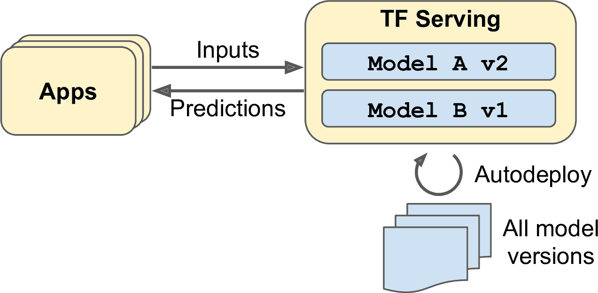

图 19-1 TF Serving 可以服务多个多个模型，并自动部署每个模型的最新版本

假设你已经用`tf.keras`训练了一个 MNIST 模型，要将模型部署到 TF Serving。第一件事是输出模型到 TensorFlow 的 SavedModel 格式。

### 输出 SavedModel

TensorFlow 提供了简便的函数`tf.saved_model.save()`，将模型输出为 SavedModel 格式。只需传入模型，配置名字、版本号，这个函数就能保存模型的计算图和权重：

```py
model = keras.models.Sequential([...])
model.compile([...])
history = model.fit([...])

model_version = "0001"
model_name = "my_mnist_model"
model_path = os.path.join(model_name, model_version)
tf.saved_model.save(model, model_path) 
```

通常将预处理层包含在最终模型里，这样部署在生产中，就能接收真实数据。这样可以避免在应用中单独做预处理。将预处理和模型绑定，还能防止两者不匹配。

> 警告：因为 SavedModel 保存了计算图，所以只支持基于 TensorFlow 运算的模型，不支持`tf.py_function()`运算（它包装了任意 Python 代码）。也不支持动态`tf.keras`模型（见附录 G），因为这些模型不能转换成计算图。动态模型需要用其它工具（例如，Flask）服务化。

SavedModel 表示了模型版本。它被保存为一个包含`saved_model.pb`文件的目录，它定义了计算图（表示为序列化协议缓存），变量子目录包含了变量值。对于含有大量权重的模型，这些变量值可能分割在多个文件中。SavedModel 还有一个`assets`子目录，包含着其余数据，比如词典文件、类名、一些模型的样本实例。目录结构如下（这个例子中，没有使用`assets`）：

```py
my_mnist_model
└── 0001
    ├── assets
    ├── saved_model.pb
    └── variables
        ├── variables.data-00000-of-00001
        └── variables.index 
```

可以使用函数`tf.saved_model.load()`加载 SavedModel。但是，返回的对象不是 Keras 模型：是 SavedModel，包括计算图和变量值。可以像函数一样做预测（输入是张量，还要设置参数`training`，通常设为`False`）：

```py
saved_model = tf.saved_model.load(model_path)
y_pred = saved_model(X_new, training=False) 
```

另外，可以将 SavedModel 的预测函数包装进 Keras 模型：

```py
inputs = keras.layers.Input(shape=...)
outputs = saved_model(inputs, training=False)
model = keras.models.Model(inputs=[inputs], outputs=[outputs])
y_pred = model.predict(X_new) 
```

TensorFlow 还有一个命令行工具`saved_model_cli`，用于检查 SavedModel：

```py
$ export ML_PATH="$HOME/ml" # point to this project, wherever it is
$ cd $ML_PATH
$ saved_model_cli show --dir my_mnist_model/0001 --all
MetaGraphDef with tag-set: 'serve' contains the following SignatureDefs:
signature_def['__saved_model_init_op']:
  [...]

signature_def['serving_default']:
  The given SavedModel SignatureDef contains the following input(s):
    inputs['flatten_input'] tensor_info:
        dtype: DT_FLOAT
        shape: (-1, 28, 28)
        name: serving_default_flatten_input:0
  The given SavedModel SignatureDef contains the following output(s):
    outputs['dense_1'] tensor_info:
        dtype: DT_FLOAT
        shape: (-1, 10)
        name: StatefulPartitionedCall:0
  Method name is: tensorflow/serving/predict 
```

SavedModel 包含一个或多个元图。元图是计算图加上了函数签名定义（包括输入、输出名，类型和形状）。每个元图可以用一组标签做标识。例如，可以用一个元图包含所有的计算图，包括训练运算（例如，这个元图的标签是`"train"`）。但是，当你将`tf.keras`模型传给函数`tf.saved_model.save()`，默认存储的是一个简化的 SavedModel：保存一个元图，标签是`"serve"`，包含两个签名定义，一个初始化函数（`__saved_model_init_op`）和一个默认的服务函数（`serving_default`）。保存`tf.keras`模型时，默认服务函数对应模型的`call()`函数。

`saved_model_cli`也可以用来做预测（用于测试，不是生产）。假设有一个 NumPy 数组（`X_new`），包含三张用于预测的手写数字图片。首先将其输出为 NumPy 的`npy`格式：

```py
np.save("my_mnist_tests.npy", X_new) 
```

然后，如下使用`saved_model_cli`命令：

```py
$ saved_model_cli run --dir my_mnist_model/0001 --tag_set serve \
                      --signature_def serving_default \
                      --inputs flatten_input=my_mnist_tests.npy
[...] Result for output key dense_1:
[[1.1739199e-04 1.1239604e-07 6.0210604e-04 [...] 3.9471846e-04]
 [1.2294615e-03 2.9207937e-05 9.8599273e-01 [...] 1.1113169e-07]
 [6.4066830e-05 9.6359509e-01 9.0598064e-03 [...] 4.2495009e-04]] 
```

输出包含 3 个实例的 10 个类的概率。现在有了可以工作的 SavedModel，下一步是安装 TF Serving。

### 安装 TensorFlow Serving

有多种方式安装 TF Serving：使用 Docker 镜像、使用系统的包管理器、从源代码安装，等等。我们使用 Docker 安装的方法，这是 TensorFlow 团队高度推荐的方法，不仅安装容易，不会扰乱系统，性能也很好。需要先安装 Docker。然后下载官方 TF Serving 的 Docker 镜像：

```py
$ docker pull tensorflow/serving 
```

创建一个 Docker 容器运行镜像：

```py
$ docker run -it --rm -p 8500:8500 -p 8501:8501 \
             -v "$ML_PATH/my_mnist_model:/models/my_mnist_model" \
             -e MODEL_NAME=my_mnist_model \
             tensorflow/serving
[...]
2019-06-01 [...] loaded servable version {name: my_mnist_model version: 1}
2019-06-01 [...] Running gRPC ModelServer at 0.0.0.0:8500 ...
2019-06-01 [...] Exporting HTTP/REST API at:localhost:8501 ...
[evhttp_server.cc : 237] RAW: Entering the event loop ... 
```

这样，TF Serving 就运行起来了。它加载了 MNIST 模型（版本 1），通过 gRPC（端口 8500）和 REST（端口 8501）运行。下面是命令行选项的含义：

`-it`

使容器可交互（`Ctrl-C`关闭），展示服务器的输出。

`--rm`

停止时删除容器。但不删除镜像。

`-p 8500:8500`

将 Docker 引擎将主机的 TCP 端口 8500 转发到容器的 TCP 端口 8500。默认时，TF Serving 使用这个端口服务 gRPC API。

`-p 8501:8501`

将 Docker 引擎将主机的 TCP 端口 8501 转发到容器的 TCP 端口 8501。默认时，TF Serving 使用这个端口服务 REST API。

`-v "$ML_PATH/my_mnist_model:/models/my_mnist_model"`

使主机的`$ML_PATH/my_mnist_model`路径对容器的路径`/models/mnist_model`开放。在 Windows 上，可能需要将`/`替换为`\`。

`-e MODEL_NAME=my_mnist_model`

将容器的`MODEL_NAME`环境变量，让 TF Serving 知道要服务哪个模型。默认时，它会在路径`/models`查询，并会自动服务最新版本。

`tensorflow/serving`

镜像名。

现在回到 Python 查询服务，先使用 REST API，然后使用 gRPC API。

### 用 REST API 查询 TF Serving

先创建查询。必须包含想要调用的函数签名的名字，和输入数据：

```py
import json

input_data_json = json.dumps({
    "signature_name": "serving_default",
    "instances": X_new.tolist(),
}) 
```

注意，json 格式是 100% 基于文本的，因此`X_new`NumPy 数组要转换为 Python 列表，然后 json 格式化：

```py
>>> input_data_json
'{"signature_name": "serving_default", "instances": [[[0.0, 0.0, 0.0, [...]
0.3294117647058824, 0.725490196078431, [...very long], 0.0, 0.0, 0.0, 0.0]]]}' 
```

通过发送 HTTP POST 请求，将数据发送给 TF Serving。使用`requests`就成：

```py
import requests

SERVER_URL = 'http://localhost:8501/v1/models/my_mnist_model:predict'
response = requests.post(SERVER_URL, data=input_data_json)
response.raise_for_status() # raise an exception in case of error
response = response.json() 
```

响应是一个字典，唯一的键是`"predictions"`，它对应的值是预测列表。这是一个 Python 列表，将其转换为 NumPy 数组，小数点保留两位：

```py
>>> y_proba = np.array(response["predictions"])
>>> y_proba.round(2)
array([[0\.  , 0\.  , 0\.  , 0\.  , 0\.  , 0\.  , 0\.  , 1\.  , 0\.  , 0\.  ],
       [0\.  , 0\.  , 0.99, 0.01, 0\.  , 0\.  , 0\.  , 0\.  , 0\.  , 0\.  ],
       [0\.  , 0.96, 0.01, 0\.  , 0\.  , 0\.  , 0\.  , 0.01, 0.01, 0\.  ]]) 
```

现在就有预测了。模型 100% 肯定第一张图是类 7，99% 肯定第二张图是类 2，96% 肯定第三章图是类 1。

REST API 既优雅又简单，当输入输出数据不大时，可以工作的很好。另外，客户端无需其它依赖就能做 REST 请求，其它协议不一定成。但是，REST 是基于 JSON 的，JSON 又是基于文本的，很冗长。例如，必须将 NumPy 数组转换为 Python 列表，每个浮点数都转换成了字符串。这样效率很低，序列化/反序列化很费时，负载大小也高：浮点数要表示为 15 个字符，32 位浮点数要超过 120 比特。这样在传输大 NumPy 数组时，会造成高延迟和高带宽消耗。所以转而使用 gRPC。

> 提示：当传输大量数据时，（如果客户端支持）最好使用 gRPC API，因为它是基于压缩二进制格式和高效通信协议（基于 HTTP/2 框架）。

### 用 gRPC API 查询 TF Serving

gRPC API 的输入是序列化的`PredictRequest`协议缓存，输出是序列化的`PredictResponse`协议缓存。这些协议缓存是`tensorflow-serving-api`库的一部分（通过 PIP 安装）。首先，创建请求：

```py
from tensorflow_serving.apis.predict_pb2 import PredictRequest

request = PredictRequest()
request.model_spec.name = model_name
request.model_spec.signature_name = "serving_default"
input_name = model.input_names[0]
request.inputs[input_name].CopyFrom(tf.make_tensor_proto(X_new)) 
```

这段代码创建了`PredictRequest`协议缓存，填充了需求字段，包括模型名（之前定义的），想要调用的函数签名，最后是输入数据，形式是`Tensor`协议缓存。`tf.make_tensor_proto()`函数创建了一个基于给定张量或 NumPy 数组（`X_new`）的`Tensor`协议缓存。接着，向服务器发送请求，得到响应（需要用 PIP 安装`grpcio`库）：

```py
import grpc
from tensorflow_serving.apis import prediction_service_pb2_grpc

channel = grpc.insecure_channel('localhost:8500')
predict_service = prediction_service_pb2_grpc.PredictionServiceStub(channel)
response = predict_service.Predict(request, timeout=10.0) 
```

这段代码很简单：引入包之后，创建一个 gRPC 通信通道，主机是`localhost`，端口是 8500，然后用这个通道创建 gRPC 服务，并发送请求，超时时间是 10 秒（因为是同步的，收到响应前是阻塞的）。在这个例子中，通道是不安全的（没有加密和认证），但 gRPC 和 TensorFlow Serving 也支持 SSL/TLS 安全通道。

然后，将`PredictResponse`协议缓存转换为张量：

```py
output_name = model.output_names[0]
outputs_proto = response.outputs[output_name]
y_proba = tf.make_ndarray(outputs_proto) 
```

如果运行这段代码，打印`y_proba.numpy().round(2)`。会得到和之前完全相同的结果。

### 部署新模型版本

现在创建一个新版本模型，将 SavedModel 输出到路径`my_mnist_model/0002`：

```py
model = keras.models.Sequential([...])
model.compile([...])
history = model.fit([...])

model_version = "0002"
model_name = "my_mnist_model"
model_path = os.path.join(model_name, model_version)
tf.saved_model.save(model, model_path) 
```

每隔一段时间（可配置），TensorFlow Serving 会检查新的模型版本。如果找到新版本，会自动过渡：默认的，会用上一个模型回复挂起的请求，用新版本模型处理新请求。挂起请求都答复后，前一模型版本就不加载了。可以在 TensorFlow 日志中查看：

```py
[...]
reserved resources to load servable {name: my_mnist_model version: 2}
[...]
Reading SavedModel from: /models/my_mnist_model/0002
Reading meta graph with tags { serve }
Successfully loaded servable version {name: my_mnist_model version: 2}
Quiescing servable version {name: my_mnist_model version: 1}
Done quiescing servable version {name: my_mnist_model version: 1}
Unloading servable version {name: my_mnist_model version: 1} 
```

这个方法提供了平滑的过渡，但会使用很多内存（尤其是 GPU 内存，这是最大的限制）。在这个例子中，可以配置 TF Serving，用前一模型版本处理所有挂起的请求，再加载使用新模型版本。这样配置可以防止在同一时刻加载，但会中断服务一小段时间。

可以看到，TF Serving 使部署新模型变得很简单。另外，如果发现版本 2 效果不如预期，只要删除路径`my_mnist_model/0002 directory`就能滚回到版本 1。

> 提示：TF Serving 的另一个功能是自动批次化，要使用的话，可以在启动时使用选项`--enable_batching`。当 TF Serving 在短时间内收到多个请求时（延迟是可配置的），可以自动做批次化，然后再使用模型。这样能利用 GPU 提升性能。模型返回预测之后，TF Serving 会将每个预测返回给正确的客户端。通过提高批次延迟（见选项`--batching_parameters_file`），可以获得更高的吞吐量。

如果每秒想做尽量多的查询，可以将 TF Serving 部署在多个服务器上，并对查询做负载均衡（见图 19-2）。这需要将 TF Serving 容器部署在多个服务器上。一种方法是使用 Kubernetes，这是一个开源工具，用于在多个服务器上做容器编排。如果你不想购买、维护、升级所有机器，可以使用云平台比如亚马逊 AWS、Microsoft Azure、Google Cloud Platform、IBM 云、阿里云、Oracle 云，或其它 Platform-as-a-Service (PaaS)。管理所有虚拟机、做容器编排（就算有 Kubernetes 的帮助），处理 TF Serving 配置、微调和监控，也是件很耗时的工作。幸好，一些服务提供商可以帮你完成所有工作。本章我们会使用 Google Cloud AI Platform，因为它是唯一带有 TPU 的平台，支持 TensorFlow 2，还有其它 AI 服务（比如，AutoML、Vision API、Natural Language API），也是我最熟悉的。也存在其它服务提供商，比如 Amazon AWS SageMaker 和 Microsoft AI Platform，它们也支持 TensorFlow 模型。

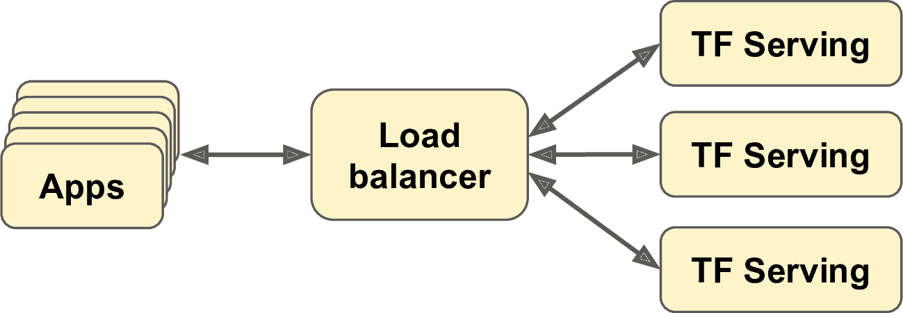

图 19-2 用负载均衡提升 TF Serving

现在，在云上部署 MNIST 模型。

### 在 GCP AI 上创建预测服务

在部署模型之前，有一些设置要做：

1.  登录 Google 账户，到 [Google Cloud Platform (GCP) 控制台](https://links.jianshu.com/go?to=https%3A%2F%2Fconsole.cloud.google.com%2F)（见图 19-3）。如果没有 Google 账户，需要创建一个。

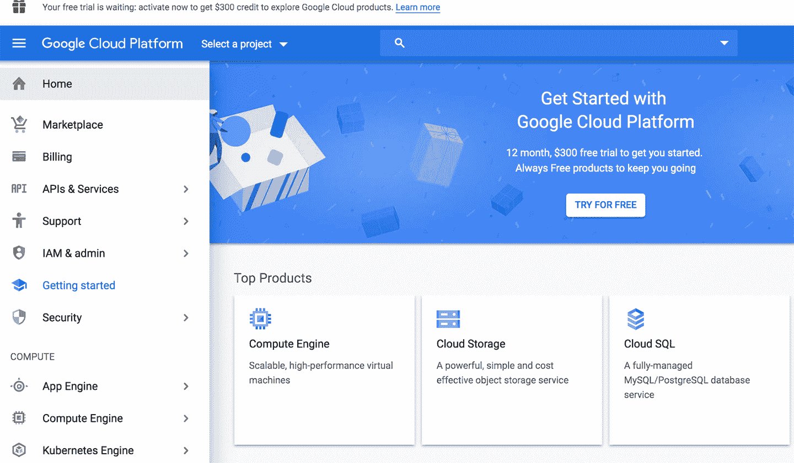

图 19-3 Google Cloud Platform 控制台

2.  如果是第一次使用 GCP，需要阅读、同意条款。写作本书时，新用户可以免费试用，包括价值 300 美元的 GCP 点数，可以使用 12 个月。本章只需一点点 GCP 点数就够。选择试用之后，需要创建支付信息，需要输入信用卡账号：这只是为了验证（避免人们薅羊毛），不必支付。根据需求，激活升级账户。

3.  如果不能用试用账户，就得掏钱了 T_T。

4.  GCP 中的每个资源都属于一个项目。包括所有的虚拟机，存储的文件，和运行的训练任务。创建账户时，GCP 会自动给你创建一个项目，名字是`My First Project`。可以在项目设置改名。在导航栏选择`IAM & admin → Settings`，改名，然后保存。项目有一个唯一 ID 和数字。创建项目时，可以选择项目 ID，选好 ID 后后面就不能修改了。项目数字是自动生成的，不能修改。如果你想创建一个新项目，点击`New Project`，输入项目 ID。

> 警告：不用时一定注意关掉所有服务，否则跑几天或几个月，可能花费巨大。

5.  有了 GCP 账户和支付信息之后，就可以使用服务了。首先需要的 Google Cloud Storage (GCS)：用来存储 SavedModels，训练数据，等等。在导航栏，选择`Storage → Browser`。所有的文件会存入一个或多个 bucket 中。点击`Create Bucket`，选择 bucket 名（可能需要先激活 Storage API）。GCS 对 bucket 使用了单一全局的命名空间，所以像`machine-learning`这样的名字，可能用不了。确保 bucket 名符合 DNS 命名规则，因为 bucket 名会用到 DNS 记录中。另外，bucket 名是公开的，不要放私人信息。通常用域名或公司名作为前缀，保证唯一性，或使用随机数字作为名字。选择存放 bucket 的地方，其它选项用默认就行。然后点击`Create`。

6.  上传之前创建的`my_mnist_model`（包括一个或多个版本）到 bucket 中。要这么做，在 GCS Browser，点击 bucket，拖动`my_mnist_model`文件夹到 bucket 中（见图 19-4）。另外，可以点击`Upload folder`，选在要上传的`my_mnist_model`文件夹。默认时，SavedModel 最大是 250MB，可以请求更大的值。

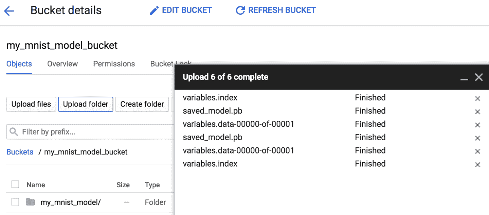

图 19-4 上传 SavedModel 到 Google Cloud Storage

7.  配置 AI Platform（以前的名字是 ML Engine），让 AI Platform 知道要使用哪个模型和版本。在导航栏，下滚到`Artificial Intelligence`，点击`AI Platform → Models`。点击`Activate API`（可能需要几分钟），然后点击`Create model`。填写模型细节说明（见图 19-5），点击创建。

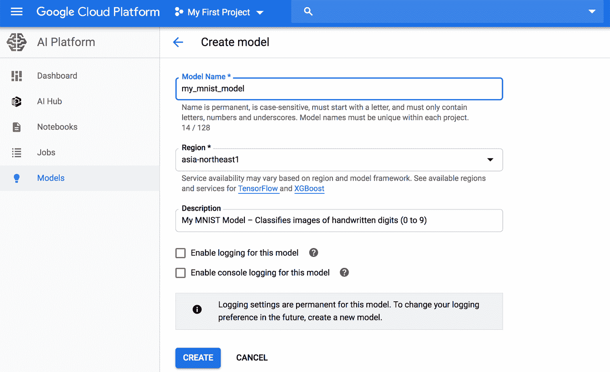

图 19-5 在 Google Cloud AI Platform 创建新模型

8.  AI Platform 有了模型，需要创建模型版本。在模型列表中，点击创建的模型，然后点击`Create version`，填入版本细节说明（见图 19-6）：设置名字，说明，Python 版本（3.5 或以上），框架（TensorFlow），框架版本（2.0，或 1.13），ML 运行时版本（2.0，或 1.13），机器类型（选择`Single core CPU`），模型的 GCS 路径（真实版本文件夹的完整路径，比如，`gs://my-mnist-model-bucket/my_mnist_model/0002/`），扩展（选择`automatic`），TF Serving 容器的最小运行数（留空就成）。然后点击`Save`。

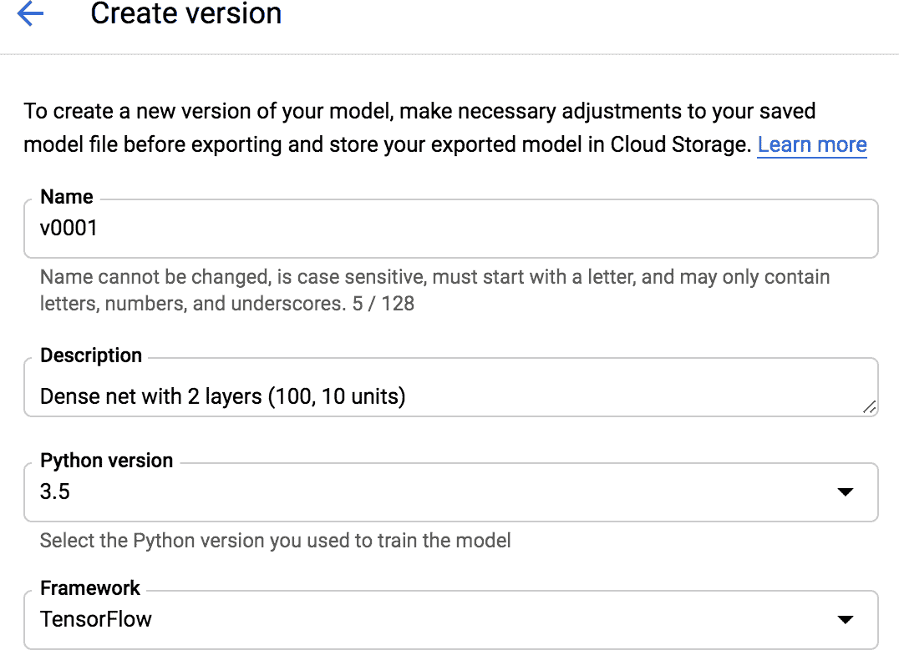

图 19-6 在 Google Cloud AI Platform 上创建一个新模型版本

恭喜，这样就将第一个模型部署在云上了。因为选择的是自动扩展，当每秒查询数上升时，AI Platform 会启动更多 TF Serving 容器，并会对查询做负载均衡。如果 QPS 下降，就会关闭容器。所以花费直接和 QPS 关联（还和选择的机器类型和存储在 GCS 的数据量有关）。这个定价机制特别适合偶尔使用的用户，有使用波峰的服务，也适合初创企业。

> 笔记：如果不使用预测服务，AI Platform 会停止所有容器。这意味着，只用支付存储费用就成（每月每 GB 几美分）。当查询服务时，AI Platform 会启动 TF Serving 容器，启动需要几秒钟。如果延迟太长，可以将最小容器数设为 1。当然，这样花费会高。

现在查询预测服务。

### 使用预测服务

在底层，AI Platform 就是运行 TF Serving，所以原理上，如果知道要查询的 url，可以使用之前的代码。就是有一个问题：GCP 还负责加密和认证。加密是基于 SSL/TLS，认证是基于标记：每次请求必须向服务端发送秘密认证。所以在代码使用预测服务（或其它 GCP 服务）之前，必需要有标记。后面会讲如果获取标记，首先配置认证，使应用获得 GCP 的响应访问权限。有两种认证方法：

*   应用（即，客户端）可以用 Google 登录和密码信息做认证。使用密码，可以让应用获得 GCP 的同等权限。另外，不能将密码部署在应用中，否则会被盗。总之，不要选择这种方法，它只使用极少场合（例如，当应用需要访问用户的 GCP 账户）。

*   客户端代码可以用 service account 验证。这个账户代表一个应用，不是用户。权限十分有限。推荐这种方法。

因此，给应用创建一个服务账户：在导航栏，逐次`IAM & admin → Service accounts`，点击`Create Service Account`，填表（服务账户名、ID、描述），点击创建（见图 19-7）。然后，给这个账户一些访问权限。选择`ML Engine Developer`角色：这可以让服务账户做预测，没其它另外权限。或者，可以给服务账户添加用户访问权限（当 GCP 用户属于组织时很常用，可以让组织内的其它用户部署基于服务账户的应用，或者管理服务账户）、接着，点击`Create Key`，输出私钥，选择 JSON，点击`Create`。这样就能下载 JSON 格式的私钥了。

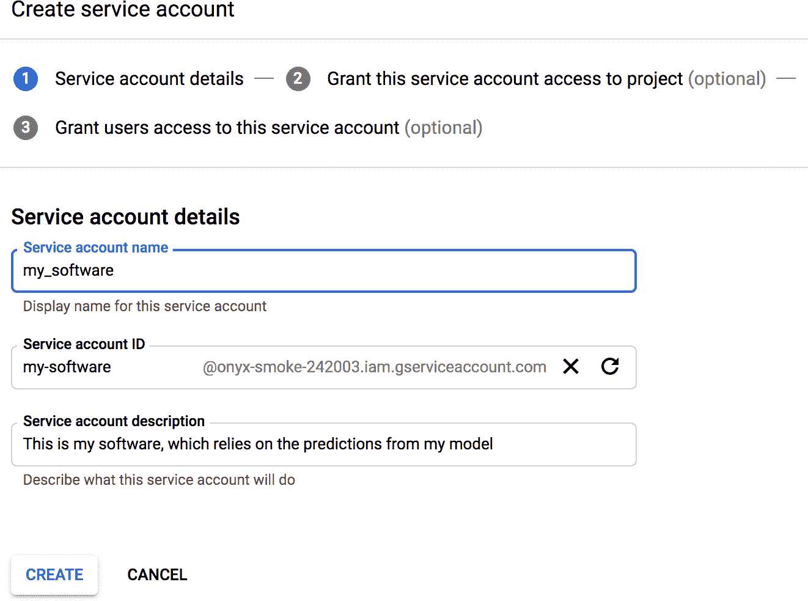

图 19-7 在 Google IAM 中创建一个新的服务账户

现在写一个小脚本来查询预测服务。Google 提供了几个库，用于简化服务访问：

Google API Client Library

*   基于 [*OAuth 2.0*](https://links.jianshu.com/go?to=https%3A%2F%2Foauth.net%2F) 和 REST。可以使用所有 GCP 服务，包括 AI Platform。可以用 PIP 安装：库名叫做`google-api-python-client`。

Google Cloud Client Libraries

*   稍高级的库：每个负责一个特别的服务，比如 GCS、Google BigQuery、Google Cloud Natural Language、Google Cloud Vision。所有这些库都可以用 PIP 安装（比如，GCS 客户端库是`google-cloud-storage`）。如果有可用的客户端库，最好不用 Google API 客户端，因为前者性能更好。

在写作本书的时候，AI Platform 还没有客户端库，所以我们使用 Google API 客户端库。这需要使用服务账户的私钥；设定`GOOGLE_APPLICATION_CREDENTIALS`环境参数就成，可以在启动脚本之前，或在如下的脚本中：

```py
import os

os.environ["GOOGLE_APPLICATION_CREDENTIALS"] = "my_service_account_key.json" 
```

> 笔记：如果将应用部署到 Google Cloud Engine (GCE)的虚拟机上，或 Google Cloud Kubernetes Engine 的容器中，或 Google Cloud App Engine 的网页应用上，或者 Google Cloud Functions 的微服务，如果没有设置`GOOGLE_APPLICATION_CREDENTIALS`环境参数，会使用默认的服务账户（比如，如果在 GCE 上运行应用，就用默认 GCE 服务账户）。

然后，必须创建一个包装了预测服务访问的资源对象：

```py
import googleapiclient.discovery

project_id = "onyx-smoke-242003" # change this to your project ID
model_id = "my_mnist_model"
model_path = "projects/{}/models/{}".format(project_id, model_id)
ml_resource = googleapiclient.discovery.build("ml", "v1").projects() 
```

可以将`/versions/0001`（或其它版本号），追加到`model_path`，指定想要查询的版本：这么做可以用来 A/B 测试，或在推广前在小范围用户做试验。然后，写一个小函数，使用资源对象调用预测服务，获取预测结果：

```py
def predict(X):
    input_data_json = {"signature_name": "serving_default",
                       "instances": X.tolist()}
    request = ml_resource.predict(name=model_path, body=input_data_json)
    response = request.execute()
    if "error" in response:
        raise RuntimeError(response["error"])
    return np.array([pred[output_name] for pred in response["predictions"]]) 
```

这个函数接收包含图片的 NumPy 数组，然后准备成字典，客户端库再将其转换为 JSON 格式。然后准备预测请求，并执行；如果响应有错误，就抛出异常；没有错误的话，就提取出每个实例的预测结果，绑定成 NumPy 数组。如下：

```py
>>> Y_probas = predict(X_new)
>>> np.round(Y_probas, 2)
array([[0\.  , 0\.  , 0\.  , 0\.  , 0\.  , 0\.  , 0\.  , 1\.  , 0\.  , 0\.  ],
       [0\.  , 0\.  , 0.99, 0.01, 0\.  , 0\.  , 0\.  , 0\.  , 0\.  , 0\.  ],
       [0\.  , 0.96, 0.01, 0\.  , 0\.  , 0\.  , 0\.  , 0.01, 0.01, 0\.  ]]) 
```

现在，就在云上部署好预测服务了，可以根据 QPS 自动扩展，可以从任何地方安全访问。另外，如果不使用的话，就基本不产生费用：只要每月对每个 GB 支付几美分。可以用 [Google Stackdriver](https://links.jianshu.com/go?to=https%3A%2F%2Fcloud.google.com%2Fstackdriver%2F) 获得详细日志。

如果将模型部署到移动 app，或嵌入式设备，该怎么做呢？

## 将模型嵌入到移动或嵌入式设备

如果需要将模型部署到移动或嵌入式设备上，大模型的下载时间太长，占用内存和 CPU 太多，这会是 app 响应太慢，设备发热，消耗电量。要避免这种情况，要使用对移动设备友好、轻量、高效的模型，但又不牺牲太多准确度。[TFLite](https://links.jianshu.com/go?to=https%3A%2F%2Ftensorflow.org%2Flite) 库提供了一些部署到移动设备和嵌入式设备的 app 的工具，有三个主要目标：

*   减小模型大小，缩短下载时间，降低占用内存。

*   降低每次预测的计算量，减少延迟、电量消耗和发热。

*   针对设备具体限制调整模型。

要降低模型大小，TFLite 的模型转换器可以将 SavedModel 转换为基于 [FlatBuffers](https://links.jianshu.com/go?to=https%3A%2F%2Fgoogle.github.io%2Fflatbuffers%2F) 的轻量格式。这是一种高效的跨平台序列化库（有点类似协议缓存），最初是 Google 开发用于游戏的。FlatBuffers 可以直接加载进内存，无需预处理：这样可以减少加载时间和内存占用。一旦模型加载到了移动或嵌入设备上，TFLite 解释器会执行它并做预测。下面的代码将 SavedModel 转换成了 FlatBuffer，并存为了`.tflite`文件：

```py
converter = tf.lite.TFLiteConverter.from_saved_model(saved_model_path)
tflite_model = converter.convert()
with open("converted_model.tflite", "wb") as f:
    f.write(tflite_model) 
```

> 提示：还可以使用`from_keras_model()`将`tf.keras`模型直接转变为 FlatBuffer。

转换器还优化了模型，做了压缩，降低了延迟。删减了所有预测用不到的运算（比如训练运算），并优化了可能的计算；例如，`3×a + 4×a + 5×a`被压缩为`(3 + 4 + 5)×a`。还将可能的运算融合。例如，批归一化作为加法和乘法融合到了前一层。要想知道 TFLite 能优化到什么程度，下载[一个预训练 TFLite 模型](https://links.jianshu.com/go?to=https%3A%2F%2Fhoml.info%2Flitemodels)，解压缩，然后打开 [Netron 图可视化工具](https://links.jianshu.com/go?to=https%3A%2F%2Flutzroeder.github.io%2Fnetron%2F)，然后上传`.pb`文件，查看原始模型。这是一个庞大复杂的图。接着，打开优化过的`.tflite`模型，并查看。

另一种减小模型的（不是使用更小的神经网络架构）方法是使用更小的位宽（bit-width）：例如，如果使用半浮点（16 位），而不是常规浮点（32 位），模型大小就能减小到一半，准确率会下降一点。另外，训练会更快，GPU 内存使用只有一半。

TFLite 的转换器可以做的更好，可以将模型的权重量化变为小数点固定的 8 位整数。相比为 32 位浮点数，可以将模型大小减为四分之一。最简单的方法是后训练量化：在训练之后做量化，使用对称量化方法。找到最大绝对权重值，m，然后将浮点范围`-m`到`+m`固定到固定浮点（整数）范围 -127 到 127。例如（见图 19-8），如果权重范围是 -1.5 到 +0.8，则字节-127、0.0、+127 对应的是 -1.5、0、+1.5。使用对称量化时，0.0 总是映射到 0（另外，字节值 +68 到 +127 不会使用，因为超过了最大对应的浮点数 +0.8）。

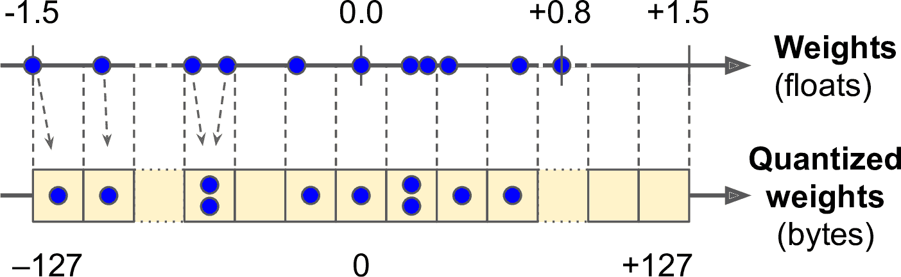

图 19-8 从 32 位浮点数到 8 位整数，使用对称量化

要使用后训练量化，只要在调用`convert()`前，将`OPTIMIZE_FOR_SIZE`添加到转换器优化的列表中：

```py
converter.optimizations = [tf.lite.Optimize.OPTIMIZE_FOR_SIZE] 
```

这种方法可以极大地减小模型，下载和存储更快。但是，运行时量化过的权重会转换为浮点数（复原的浮点数与原始的不同，但偏差不大）。为了避免总是重新计算，缓存复原的浮点数，所以并没有减少内存使用。计算速度没有降低。

降低延迟和能量消耗的最高效的方法也是量化激活函数，让计算只用整数进行，没有浮点数运算。就算使用相同的位宽（例如，32 位整数，而不是 32 位浮点数），整数使用更少的 CPU 循环，耗能更少，热量更低。如果你还降低了位宽（例如，降到 8 位整数），速度提升会更多。另外，一些神经网络加速设备（比如边缘 TPU），只能处理整数，因此全量化权重和激活函数是必须的。后训练处理就成；需要校准步骤找到激活的最大绝对值，所以需要给 TFLite 提供一个训练样本，模型就能处理数据，并测量量化需要的激活数据（这一步很快）。

量化最主要的问题是准确率的损失：等同于给权重和激活添加了噪音。如果准确率下降太多，则需要使用*伪量化*。这意味着，给模型添加假量化运算，使模型忽略训练中的量化噪音；最终的权重会对量化更鲁棒。另外，校准步骤可以在训练中自动进行，可以简化整个过程。

解释过了 TFLite 的核心概念，但要真正给移动 app 或嵌入式程序写代码需要另外一本书。幸好，可以看这本书[《TinyML: Machine Learning with TensorFlow on Arduino and Ultra-Low Power Micro-Controllers》](https://links.jianshu.com/go?to=https%3A%2F%2Fhoml.info%2Ftinyml)，作者是 Pete Warden，他是 TFLite 团队 leader，另一位作者是 Daniel Situnayake。

> 浏览器中的 TensorFlow
> 如果想在网站中使用模型，让用户直接在浏览器中使用，该怎么做呢？使用场景很多，如下：
> 
> *   用户连接是间断或缓慢的，所以在客户端一侧直接运行模型，可以让网站更可靠。
> *   如果想最快的获得响应（比如，在线游戏）。在客户端做查询肯定能降低延迟，使网站响应更快。
> *   当网站服务是基于一些用户隐私数据时，在客户端做预测可以使用户数据不出用户机器，可以保护隐私。
> 
> 对于所有这些情况，可以将模型输出为特殊格式，用 [TensorFlow.js js 库](https://links.jianshu.com/go?to=https%3A%2F%2Ftensorflow.org%2Fjs)来加载。这个库可以用模型直接在用户的浏览器运行。TensorFlow.js 项目包括工具`tensorflowjs_converter`，它可以将 SavedModel 或 Keras 模型文件转换为 TensorFlow.js Layers 格式：这是一个路径包含了一组二进制格式的共享权重文件，和文件`model.json`，它描述了模型架构和稳重文件的链接。这个格式经过优化，可以快速在网页上下载。用户可以用 TensorFlow.js 库下载模型并做预测。下面的代码片段是个例子：
> 
> ```py
> import * as tf from '@tensorflow/tfjs';
> const model = await tf.loadLayersModel('https://example.com/tfjs/model.json');
> const image = tf.fromPixels(webcamElement);
> const prediction = model.predict(image); 
> ```
> 
> TensorFlow.js 也是需要一本书来讲解。可以参考[《Practical Deep Learning for Cloud, Mobile, and Edge》](https://links.jianshu.com/go?to=https%3A%2F%2Fhoml.info%2Ftfjsbook)

接下来，来学习使用 GPU 加速计算。

## 使用 GPU 加速计算

第 11 章，我们讨论了几种可以提高训练速度的方法：更好的权重初始化、批归一化、优化器，等等。但即使用了这些方法，在单机上用单 CPU 训练庞大的神经网络，仍需要几天甚至几周。

本节，我们会使用 GPU 加速训练，还会学习如何将计算分布在多台设备上，包括 CPU 和多 GPU 设备（见图 19-9）。本章后面还会讨论在多台服务器做分布式计算。

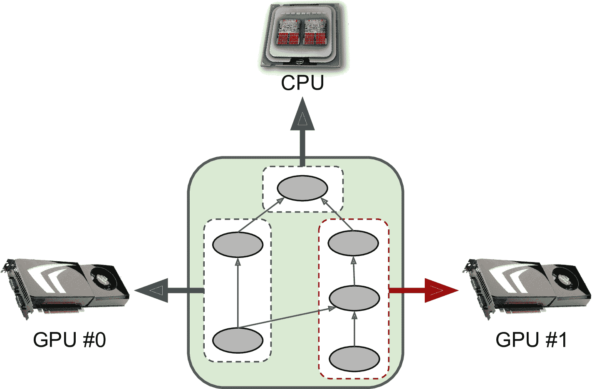

图 19-9 在多台设备上并行执行 TensorFlow 计算图

有了 GPU，可以将几天几周的训练，减少到几分钟或几小时。这样不仅能节省大量时间，还可以试验更多模型，用新数据重新训练模型。

> 提示：给电脑加上一块 GPU 显卡，通常可以提升性能。事实上，对于大多数情况，这样就足够了：根本不需要多台机器。例如，因为网络通信延迟，单台机器加 GPU 比多台机器加八块 GPU 同样快。相似的，使用一块强大的 GPU 通常比极快性能一般的 GPU 要强。

首先，就是弄一块 GPU。有两种方法：要么自己买一块 GPU，或者使用装有 GPU 的云虚拟机。我们使用第一种方法。

### 买 GPU

如果想买一快 GPU 显卡，最好花点时间研究下。Tim Dettmers 写了一篇[博客](https://links.jianshu.com/go?to=https%3A%2F%2Fhoml.info%2F66)帮你选择，并且他经常更新：建议仔细读读。写作本书时，TensorFlow 只支持 [Nvidia 显卡，且 CUDA 3.5+](https://links.jianshu.com/go?to=https%3A%2F%2Fhoml.info%2Fcudagpus)（也支持 Google TPU），后面可能会支持更多厂家。另外，尽管 TCP 现在只在 GCP 上可用，以后可能会开售 TPU 卡。总之，查阅 TensorFlow 文档查看支持什么设备。

如果买了 Nvidia 显卡，需要安装驱动和库。包括 CUDA 库，可以让开发者使用支持 CUDA 的 GPU 做各种运算（不仅是图形加速），还有 CUDA 深度神经网络库（cuDNN），一个 GPU 加速库。cuDNN 提供了常见 DNN 计算的优化实现，比如激活层、归一化、前向和反向卷积、池化。它是 Nvidia 的深度学习 SDK 的一部分（要创建 Nvidia 开发者账户才能下载）。TensorFlow 使用 CUDA 和 cuDNN 控制 GPU 加速计算（见图 19-10）。

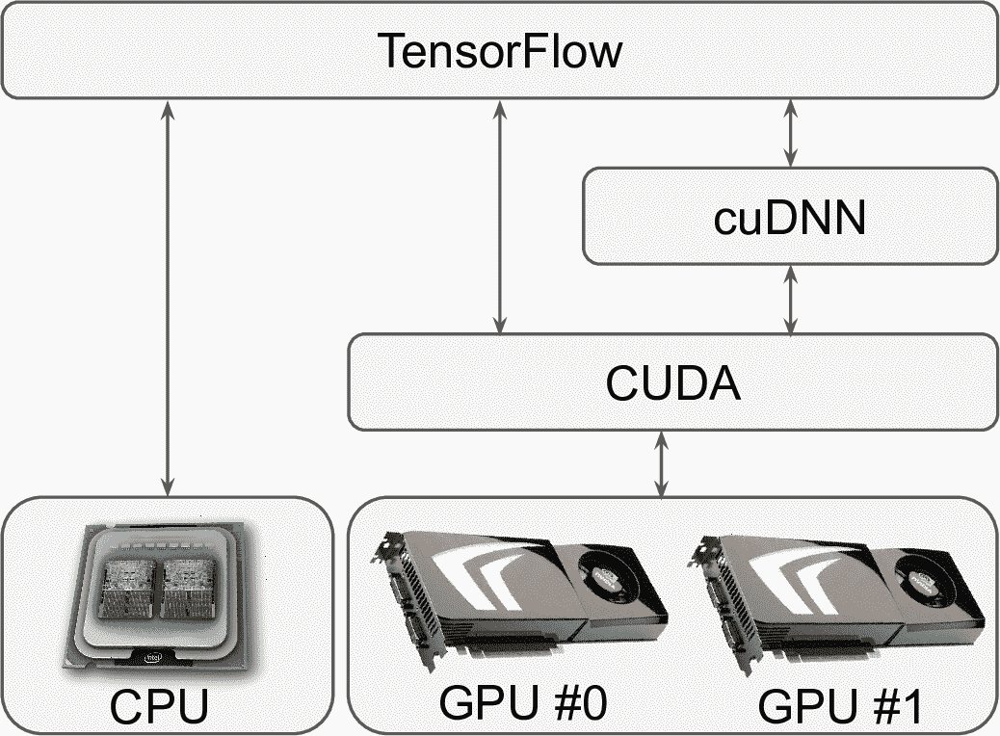

图 19-10 TensorFlow 使用 CUDA 和 cuDNN 控制 GPU，加速 DNN

安装好 GPU 和需要的库之后，可以使用`nvidia-smi`命令检测 CUDA 是否正确安装好，和每块卡的运行：

```py
$ nvidia-smi
Sun Jun  2 10:05:22 2019
+-----------------------------------------------------------------------------+
| NVIDIA-SMI 418.67       Driver Version: 410.79       CUDA Version: 10.0     |
|-------------------------------+----------------------+----------------------+
| GPU  Name        Persistence-M| Bus-Id        Disp.A | Volatile Uncorr. ECC |
| Fan  Temp  Perf  Pwr:Usage/Cap|         Memory-Usage | GPU-Util  Compute M. |
|===============================+======================+======================|
|   0  Tesla T4            Off  | 00000000:00:04.0 Off |                    0 |
| N/A   61C    P8    17W /  70W |      0MiB / 15079MiB |      0%      Default |
+-------------------------------+----------------------+----------------------+

+-----------------------------------------------------------------------------+
| Processes:                                                       GPU Memory |
|  GPU       PID   Type   Process name                             Usage      |
|=============================================================================|
|  No running processes found                                                 |
+-----------------------------------------------------------------------------+ 
```

写作本书时，你还需要安装 GPU 版本的 TensorFlow（即，`tensorflow-gpu`库）；但是，趋势是将 CPU 版本和 GPU 版本合二为一，所以记得查看文档。因为安装每个库又长又容易出错，TensorFlow 还提供了一个 Docker 镜像，里面都装好了。但是为了让 Docker 容器能访问 GPU，还需要在主机上安装 Nvidia 驱动。

要检测 TensorFlow 是否连接 GPU，如下检测：

```py
>>> import tensorflow as tf
>>> tf.test.is_gpu_available()
True
>>> tf.test.gpu_device_name()
'/device:GPU:0'
>>> tf.config.experimental.list_physical_devices(device_type='GPU')
[PhysicalDevice(name='/physical_device:GPU:0', device_type='GPU')] 
```

`is_gpu_available()`检测是否有可用的 GPU。函数`gpu_device_name()`给了第一个 GPU 名字：默认时，运算就运行在这块 GPU 上。函数`list_physical_devices()`返回了可用 GPU 设备的列表（这个例子中只有一个）。

现在，如果你不想花费时间和钱在 GPU 上，就使用云上的 GPU VM。

### 使用带有 GPU 的虚拟机

所有主流的云平台都提供 GPU 虚拟机，一些预先配置了驱动和库（包括 TensorFlow）。Google Cloud Platform 使用了各种 GPU 额度：没有 Google 认证，不能创建 GPU 虚拟机。默认时，GPU 额度是 0，所以使用不了 GPU 虚拟机。因此，第一件事是请求更高的额度。在 GCP 控制台，在导航栏`IAM & admin → Quotas`。点击`Metric`。点击`None`，解锁所有地点，然后搜索 GPU，选择 GPU（所有区域），查看对应的额度。如果额度是 0（或额度不足），则查看旁边的框，点击`Edit quotas`。填入需求的信息，点击`Submit request`。可能需要几个小时（活几天），额度请求才能被处理。默认时，每个区域每种 GPU 类型有 GPU 的额度。可以请求提高这些额度：点击`Metric`，选择`None`，解锁所有指标，搜索 GPU，选择想要的 GPU 类型（比如，NVIDIA P4 GPUs）。然后点击`Location`，点击`None`解锁所有指标，点击想要的地点；选择相邻的框，点击`Edit quotas`，发出请求。

GPU 额度请求通过后，就可以使用 Google Cloud AI Platform 的深度学习虚拟机镜像创建带有 GPU 的虚拟机了：到[这里](https://links.jianshu.com/go?to=https%3A%2F%2Fhoml.info%2Fdlvm)，点击`View Console`，然后点击`Launch on Compute Engine`，填写虚拟机配置表。注意一些地区没有全类型的 GPU，一些地区则没有 GPU（改变地区查看）。框架一定要选 TensorFlow 2.0，并要勾选`Install NVIDIA GPU driver automatically on first startup`。最好勾选`Enable access to JupyterLab via URL instead of SSH`：这可以在 GPU VM 上运行 Jupyter 笔记本。创建好 VM 之后，下滑导航栏到`Artificial Intelligence`，点击`AI Platform → Notebooks`。笔记本实例出现在列表中（可能需要几分钟，点击`Refresh`刷新），点击链接`Open JupyterLab`。这样就能再 VM 上打开 JupyterLab，并连接浏览器了。你可以在 VM 上创建笔记本，运行任意代码，并享受 GPU 加速。

如果你想快速测试或与同事分享笔记本，最好使用 Colaboratory。

### Colaboratory

使用 GPU VM 最简单便宜的方法是使用 Colaboratory（或 Colab）。它是免费的，在[这个页面](https://links.jianshu.com/go?to=https%3A%2F%2Fcolab.research.google.com%2F)上创建 Python 3 笔记本就成：这会在 Google Drive 上创建一个 Jupyter 笔记本（或者打开 GitHub、Google Drive 上的笔记本，或上传自己的笔记本）。Colab 的用户界面和 Jupyter 笔记本很像，除了还能像普通 Google 文档一样分享，还有一些其它细微差别（比如，通过代码加特殊注释，你可以创建的方便小工具）。

当你打开 Colab 笔记本，它是在一个免费的 Google VM 上运行，被称为 Colab Runtime。Runtime 默认是只有 CPU 的，但可以到`Runtime → Change runtime type`，在`Hardware accelerator`下拉栏选取 GPU，然后点击保存。事实上，你还可以选取 TPU（没错，可以免费试用 TPU）。

如果用同一个 Runtime 类型运行多个 Colab 笔记本（见图 19-11），笔记本会使用相同的 Colab Runtime。如果一个笔记本写入了文件，其它笔记本就能读取这个文件。如果运行黑客的文件，可能读取隐私数据。密码也会泄露给黑客。另外，如果你在 Colab Runtime 安装一个库，其它笔记本也会有这个库。缺点是库的版本必须相同。

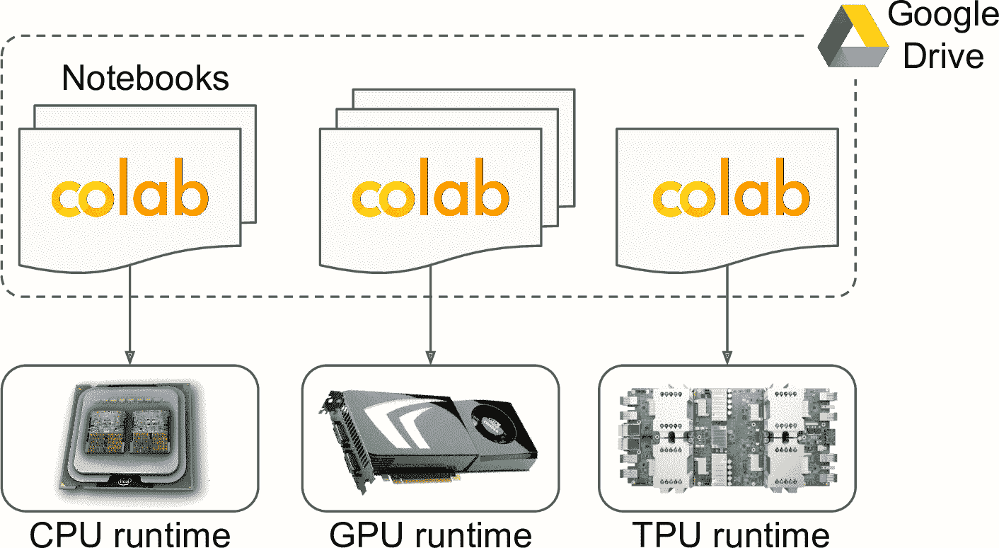

图 19-11 Colab Runtime 和笔记本

Colab 也有一些限制：就像 FAQ 写到，Colaboratory 的目的是交互使用，长时间背景的计算，尤其是在 GPU 上的，会被停掉。不要用 Colab 做加密货币挖矿。如果一定时间没有用（~30 分钟），网页界面就会自动断开连接。当你重新连接 Colab Runtime，可能就重置了，所以一定记着下载重要数据。即使从来没有断开连接，Colab Runtime 会自动在 12 个小时后断开连接，因为它不是用来做长时间运行的。尽管有这些限制，它仍是一个绝好的测试工具，可以快速获取结果，和同事协作。

### 管理 GPU 内存

TensorFlow 默认会在第一次计算时，使用可用 GPU 的所有内存。这么做是为了限制 GPU 内存碎片化。如果启动第二个 TensorFlow 程序（或任意需要 GPU 的程序），就会很快消耗掉所有内存。这种情况很少见，因为大部分时候是只跑一个 TensorFlow 程序：训练脚本，TF Serving 节点，或 Jupyter 笔记本。如果因为某种原因（比如，用同一台机器训练两个不同的模型）要跑多个程序，需要根据进程平分 GPU 内存。

如果机器上有多块 GPU，解决方法是分配给每个进程。要这么做，可以设定`CUDA_VISIBLE_DEVICES`环境变量，让每个进程只看到对应的 GPU。还要设置`CUDA_DEVICE_ORDER`环境变量为`PCI_BUS_ID`，保证每个 ID 对应到相同的 GPU 卡。你可以启动两个程序，给每个程序分配一个 GPU，在两个独立的终端执行下面的命令：

```py
$ CUDA_DEVICE_ORDER=PCI_BUS_ID CUDA_VISIBLE_DEVICES=0,1 python3 program_1.py
# and in another terminal:
$ CUDA_DEVICE_ORDER=PCI_BUS_ID CUDA_VISIBLE_DEVICES=3,2 python3 program_2.py 
```

程序 1 能看到 GPU 卡 0 和 1，`/gpu:0` 和 `/gpu:1`。程序 2 只能看到 GPU 卡 2 和 3，`/gpu:1` 和 `/gpu:0`（注意顺序）。一切工作正常（见图 19-12）。当然，还可以用 Python 定义这些环境变量，`os.environ["CUDA_DEVICE_ORDER"]`和`os.environ["CUDA_VISIBLE_DEVICES"]`，只要使用 TensorFlow 前这么做就成。

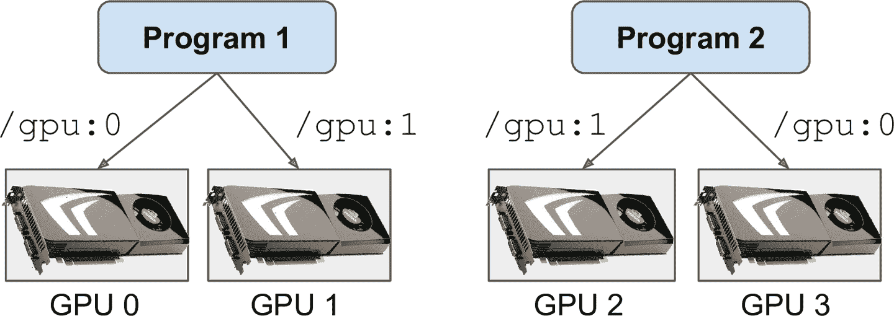

图 19-12 每个程序有两个 GPU

另一个方法是告诉 TensorFlow 使用具体量的 GPU 内存。这必须在引入 TensorFlow 之后就这么做。例如，要让 TensorFlow 只使用每个 GPU 的 2G 内存，你必须创建虚拟 GPU 设备（也被称为逻辑 GPU 设备）每个物理 GPU 设备的内存限制为 2G（即，2048MB）:

```py
for gpu in tf.config.experimental.list_physical_devices("GPU"):
    tf.config.experimental.set_virtual_device_configuration(
        gpu,
        [tf.config.experimental.VirtualDeviceConfiguration(memory_limit=2048)]) 
```

现在（假设有 4 个 GPU，每个最少 4GB）两个程序就可以并行运行了，每个都使用这四个 GPU（见图 19-13）。


图 19-13 每个程序都可以使用 4 个 GPU，每个 GPU 使用 2GB

如果两个程序都运行时使用`nvidia-smi`命令，可以看到每个进程用了 2GB 的 GPU 内存：

```py
$ nvidia-smi
[...]
+-----------------------------------------------------------------------------+
| Processes:                                                       GPU Memory |
|  GPU       PID   Type   Process name                             Usage      |
|=============================================================================|
|    0      2373      C   /usr/bin/python3                            2241MiB |
|    0      2533      C   /usr/bin/python3                            2241MiB |
|    1      2373      C   /usr/bin/python3                            2241MiB |
|    1      2533      C   /usr/bin/python3                            2241MiB |
[...] 
```

另一种方法是让 TensorFlow 只在需要内存时再使用（必须在引入 TensorFlow 后就这么做）：

```py
for gpu in tf.config.experimental.list_physical_devices("GPU"):
    tf.config.experimental.set_memory_growth(gpu, True) 
```

另一种这么做的方法是设置环境变量`TF_FORCE_GPU_ALLOW_GROWTH`为`true`。这么设置后，TensorFlow 不会释放获取的内存（避免内存碎片化），直到程序结束。这种方法无法保证确定的行为（比如，一个程序内存超标会导致另一个程序崩溃），所以在生产中，最好使用前面的方法。但是，有时这个方法是有用的：例如，当用机器运行多个 Jupyter 笔记本，其中一些使用 TensorFlow。这就是为什么在 Colab Runtime 中将环境变量`TF_FORCE_GPU_ALLOW_GROWTH`设为`true`。

最后，在某些情况下，你可能想将 GPU 分为两个或多个虚拟 GPU —— 例如，如果你想测试一个分发算法。下面的代码将第一个 GPU 分成了两个虚拟 GPU，每个有 2GB（必须引入 TensorFlow 之后就这么做）：

```py
physical_gpus = tf.config.experimental.list_physical_devices("GPU")
tf.config.experimental.set_virtual_device_configuration(
    physical_gpus[0],
    [tf.config.experimental.VirtualDeviceConfiguration(memory_limit=2048),
     tf.config.experimental.VirtualDeviceConfiguration(memory_limit=2048)]) 
```

这两个虚拟 GPU 被称为`/gpu:0` 和 `/gpu:1`，可以像真正独立的 GPU 一样做运算和变量。下面来看 TensorFlow 如何确定安置变量和执行运算。

### 在设备上安置运算和变量

TensorFlow [白皮书](https://links.jianshu.com/go?to=https%3A%2F%2Fhoml.info%2F67)介绍了一种友好的动态安置器算法，可以自动在多个可用设备上部署运算，可以测量计算时间，输入输出张量的大小，每个设备的可用内存，传入传出设备的通信延迟，用户提示。但在实际中，这个算法不怎么高效，所以 TensorFlow 团队放弃了动态安置器。

但是，`tf.keras`和`tf.data`通常可以很好地安置运算和变量（例如，在 GPU 上做计算，CPU 上做预处理）。如果想要更多的控制，还可以手动在每个设备上安置运算和变量：

*   将预处理运算放到 CPU 上，将神经网络运算放到 GPU 上。

*   GPU 的通信带宽通常不高，所以要避免 GPU 的不必要的数据传输。

*   给机器添加更多 CPU 内存通常简单又便宜，但 GPU 内存通常是焊接上去的：是昂贵且有限的，所以如果变量在训练中用不到，一定要放到 CPU 上（例如，数据集通常属于 CPU）。

默认下，所有变量和运算会安置在第一块 GPU 上（`/gpu:0`），除了没有 GPU 核的变量和运算：这些要放到 CPU 上（`/cpu:0`）。张量或变量的属性`device`告诉了它所在的设备：

```py
>>> a = tf.Variable(42.0)
>>> a.device
'/job:localhost/replica:0/task:0/device:GPU:0'
>>> b = tf.Variable(42)
>>> b.device
'/job:localhost/replica:0/task:0/device:CPU:0' 
```

现在，可以放心地忽略前缀`/job:localhost/replica:0/task:0`（它可以让你在使用 TensorFlow 集群时，在其它机器上安置运算；本章后面会讨论工作、复制和任务）。可以看到，第一个变量放到 GPU 0 上，这是默认设备。但是，第二个变量放到 CPU 上：这是因为整数变量（或整数张量运算）没有 GPU 核。

如果想把运算放到另一台非默认设备上，使用`tf.device()`上下文：

```py
>>> with tf.device("/cpu:0"):
...     c = tf.Variable(42.0)
...
>>> c.device
'/job:localhost/replica:0/task:0/device:CPU:0' 
```

> 笔记：CPU 总是被当做单独的设备（`/cpu:0`），即使你的电脑有多个 CPU 核。如果有多线程核，任意安置在 CPU 上的运算都可以并行运行。

如果在不存在设备或没有核的设备安置运算和变量，就会抛出异常。但是，在某些情况下，你可能只想用 CPU；例如，如果程序可以在 CPU 和 GPU 上运行，可以让 TensorFlow 在只有 CPU 的机器上忽略`tf.device("/gpu:*")`。要这么做，在引入 TensorFlow 后，可以调用`tf.config.set_soft_device_placement(True)`：安置请求失败时，TensorFlow 会返回默认的安置规则（即，如果有 GPU 和，默认就是 GPU 0，否则就是 CPU 0）。

TensorFlow 是如何在多台设备上执行这些运算的呢？

### 在多台设备上并行执行

第 12 章介绍过，使用 TF Functions 的好处之一是并行运算。当 TensorFlow 运行 TF 函数时，它先分析计算图，找到需要计算的运算，统计需要的依赖。TensorFlow 接着将每个零依赖的运算（即，每个源运算）添加到运行设备的计算队列（见图 19-14）。计算好一个运算后，每个运算的依赖计数器就被删掉。当运算的依赖计数器为零时，就被推进设备的计算队列。TensorFlow 评估完所有需要的节点后，就返回输出。

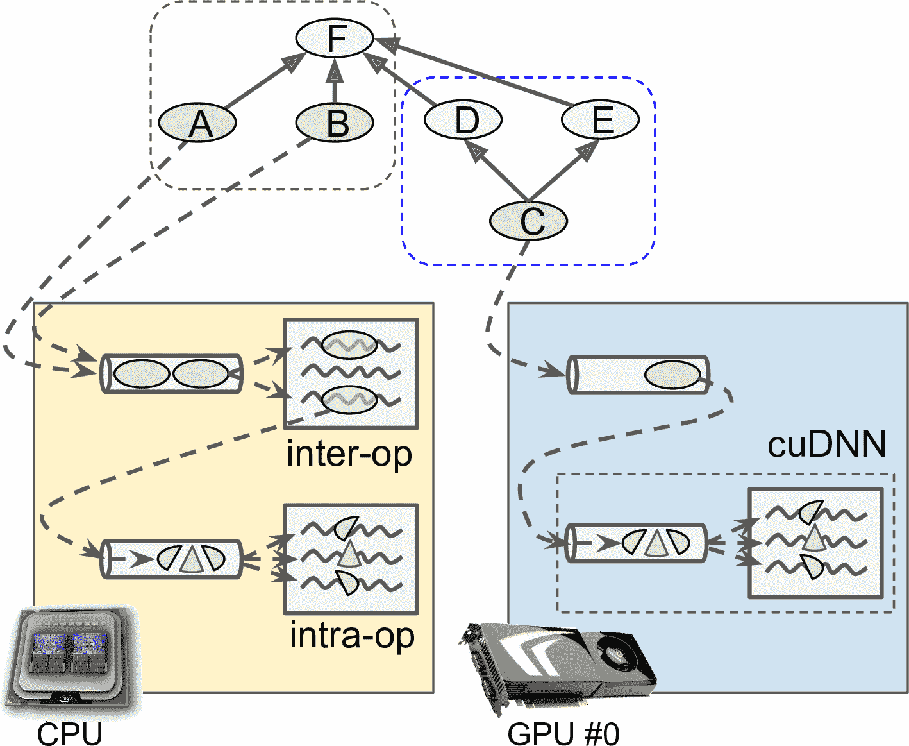

图 19-14 TensorFlow 计算图的并行执行

CPU 评估队列的运算被发送给称为`inter-op`的线程池。如果 CPU 有多个核，这些运算能高效并行计算。一些运算有多线程 CPU 核：这些核被分成多个子运算，放到另一个计算队列中，发到第二个被称为`intra-op`的线程池（多核 CPU 核共享）。总之，多个运算和自运算可以用不同的 CPU 核并行计算。

对于 GPU，事情简单一些。GPU 计算队列中的运算是顺序计算的。但是，大多数运算有多线程 GPU 核，使用 TensorFlow 依赖的库实现，比如 CUDA 和 cuDNN。这些实现有其自己的线程池，通常会用尽可能多的 GPU 线程（这就是为什么不需要`inter-op`线程池：每个运算已经使用 GPU 线程了）。

例如，见图 19-14，运算`A`、`B`、`C`是源运算，所以可以立即执行。运算`A`和`B`在 CPU 上，所以发到 CPU 计算队列，然后发到`inter-op`线程池，然后立即并行执行。运算`A`有多线程核：计算分成三个部分，在`intra-op`线程池内并行执行。运算`C`进入 GPU 0 的计算队列，在这个例子中，它的 GPU 核使用 cuDNN，它管理自己的`intra-op`线程池，在多个 GPU 线程计算。假设`C`最先完成。`D`和`E`的依赖计数器下降为 0，两个运算都推到 GPU 0 的计算队列，顺序执行。`C`只计算一次，即使`D`和`E`依赖它。假设`B`第二个结束。`F`的依赖计数器从 4 降到 3，因为不是 0，所以霉运运行。当`A`、`D`、`E`都完成，`F`的依赖计数器降到 0，被推到 CPU 的计算队列并计算。最后，TensorFlow 返回输出。

TensorFlow 的另一个奇妙的地方是当 TF 函数修改静态资源时，比如变量：它能确保执行顺序匹配代码顺序，即使不存在明确的依赖。例如，如果 TF 函数包含`v.assign_add(1)`，后面是`v.assign(v * 2)`，TensorFlow 会保证是按照这个顺序执行。

> 提示：通过调用`tf.config.threading.set_inter_op_parallelism_threads()`，可以控制`inter-op`线程池的线程数。要设置`intra-op`的线程数，使用`tf.config.threading.set_intra_op_parallelism_threads()`。如果不想让 TensorFlow 占用所有的 CPU 核，或是只想单线程，就可以这么设置。

有了上面这些知识，就可以利用 GPU 在任何设备上做任何运算了。下面是可以做的事：

*   在独自的 GPU 上，并行训练几个模型：给每个模型写一个训练脚本，并行训练，设置`CUDA_DEVICE_ORDER`和`CUDA_VISIBLE_DEVICES`，让每个脚本只看到一个 GPU。这么做很适合超参数调节，因为可以用不同的超参数并行训练。如果一台电脑有两个 GPU，单 GPU 可以一小时训练一个模型，两个 GPU 就可以训练两个模型。

*   在单 GPU 上训练模型，在 CPU 上并行做预处理，用数据集的`prefetch()`方法，给 GPU 提前准备批次数据。

*   如果模型接收两张图片作为输入，用两个 CNN 做处理，将不同的 CNN 放到不同的 GPU 上会更快。

*   创建高效的集成学习：将不同训练好的模型放到不同的 GPU 上，使预测更快，得到最后的预测结果。

如果想用多个 GPU 训练一个模型该怎么做呢？

## 在多台设备上训练模型

有两种方法可以利用多台设备训练单一模型：模型并行，将模型分成多台设备上的子部分；和数据并行，模型复制在多台设备上，每个模型用数据的一部分训练。下面来看这两种方法。

### 模型并行

前面我们都是在单一设备上训练单一神经网络。如果想在多台设备上训练一个神经网络，该怎么做呢？这需要将模型分成独立的部分，在不同的设备上运行。但是，模型并行有点麻烦，且取决于神经网络的架构。对于全连接网络，这种方法就没有什么提升（见图 19-15）。直观上，一种容易的分割的方法是将模型的每一层放到不同的设备上，但是这样行不通，因为每层都要等待前一层的输出，才能计算。所以或许可以垂直分割 —— 例如，每层的左边放在一台设备上，右边放到另一台设备上。这样好了一点，两个部分能并行工作了，但是每层还需要另一半的输出，所以设备间的交叉通信量很大（见虚线）。这就抵消了并行计算的好处，因为通信太慢（尤其是 GPU 在不同机器上）。

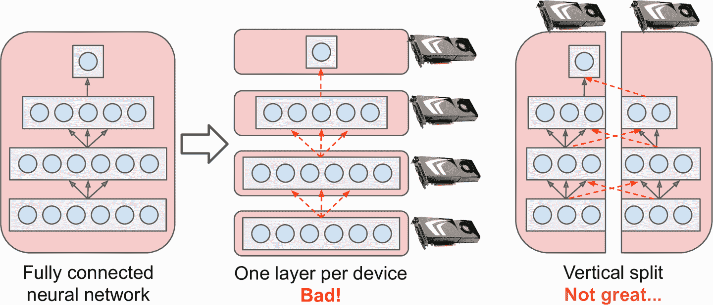

图 19-15 分割全连接神经网络

一些神经网络架构，比如卷积神经网络，包括浅层的部分连接层，更容易分割在不同设备上（见图 19-16）。

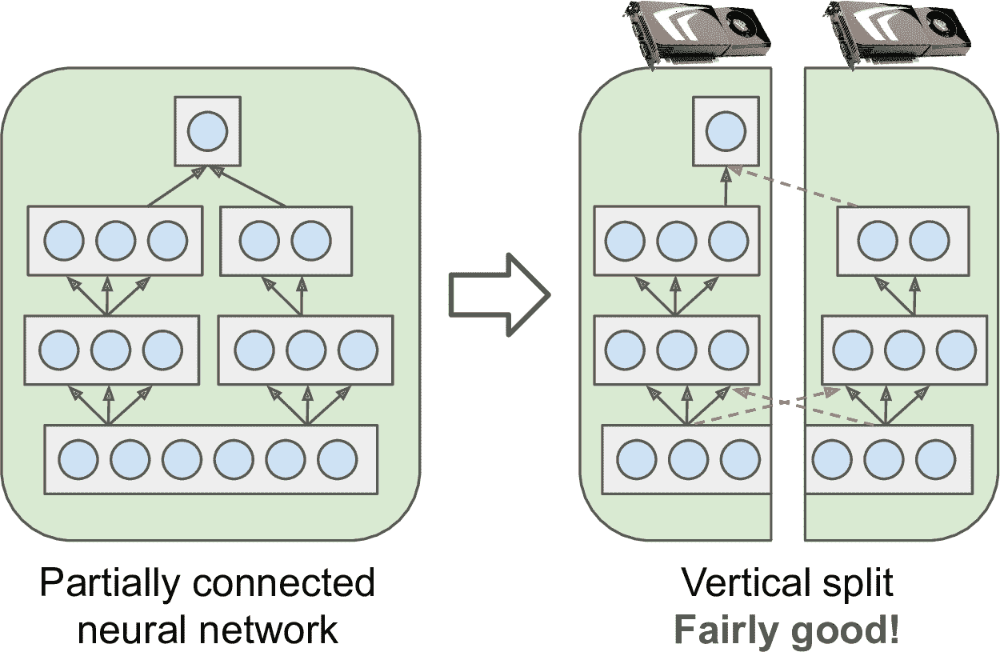

图 19-16 分割部分连接神经网络

深度循环神经网络更容易分割在多个 GPU 上。如果水平分割，将每层放到不同设备上，输入要处理的序列，在第一个时间步，只有一台设备是激活的（计算序列的第一个值），在第二步，两个设备激活（第二层处理第一层的输出，同时，第一层处理第二个值），随着信号传播到输出层，所有设备就同时激活了（图 19-17）。这么做，仍然有设备间通信，但因为每个神经元相对复杂，并行运行多个神经元的好处（原理上）超过了通信损失。但是，在实际中，将一摞 LSTM 运行在一个 GPU 上会更快。

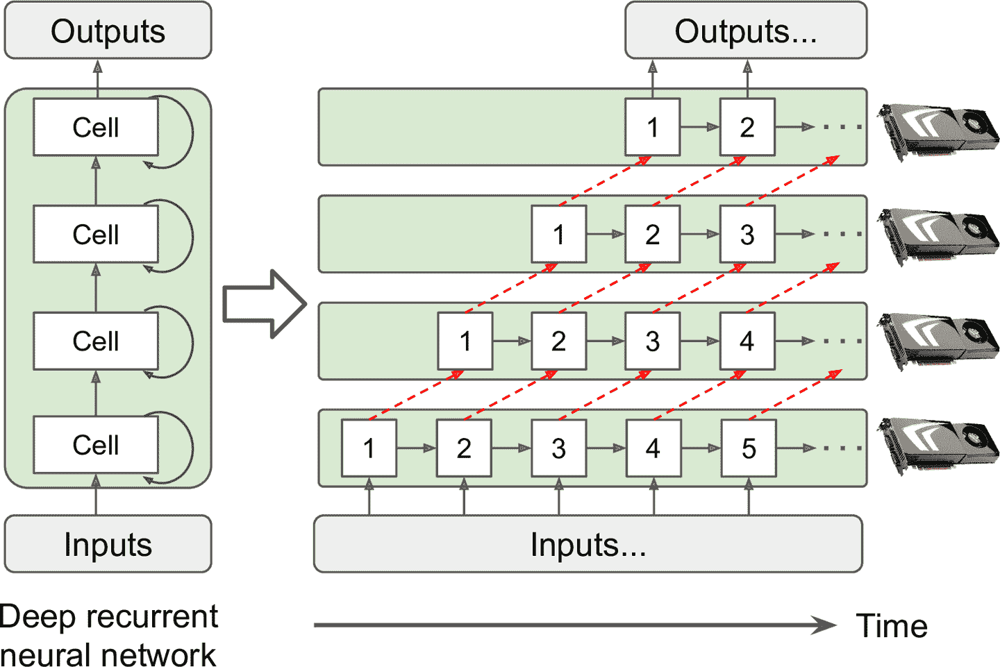

图 19-17 分割深度循环网络

总之，模型并行可以提高计算，训练一些类型的神经网络，但不是所有的，还需要特殊处理和调节，比如保证通信尽量在计算量大的机器内。下面来看更为简单高效的数据并行。

### 数据并行

另一种并行训练神经网络的方法，是将神经网络复制到每个设备上，同时训练每个复制，使用不同的训练批次。每个模型复制的计算的梯度被平均，结果用来更新模型参数。这种方法叫做数据并行。这种方法有许多变种，我们看看其中一些重要的。

#### 使用镜像策略做数据并行

可能最简单的方法是所有 GPU 上的模型参数完全镜像，参数更新也一样。这么做，所有模型复制是完全一样的。这被称为镜像策略，很高效，尤其是使用一台机器时（见图 19-18）。

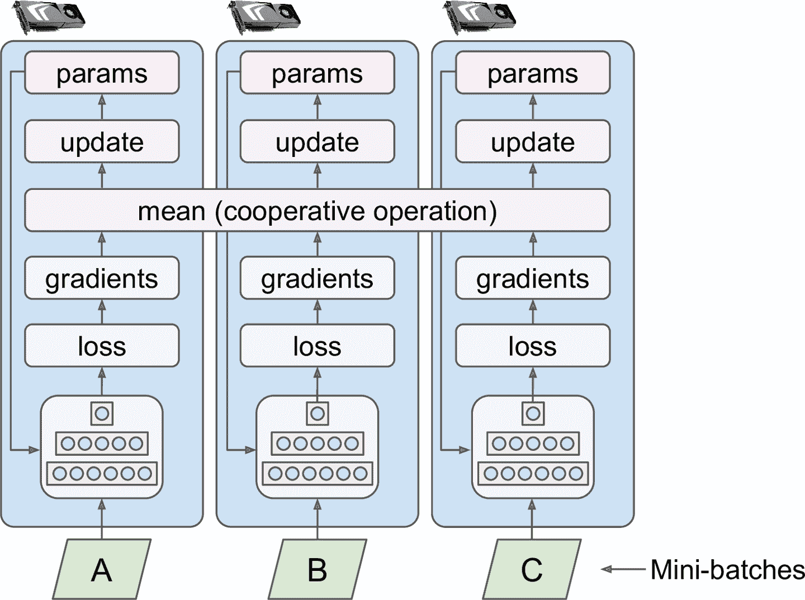

图 19-18 用镜像策略做数据并行

这种方法的麻烦之处是如何高效计算所有 GPU 的平均梯度，并将梯度分不到所有 GPU 上。这可以使用 AllReduce 算法，这是一种用多个节点齐心协力做 reduce 运算（比如，计算平均值，总和，最大值）的算法，还能让所有节点获得相同的最终结果。幸好，这个算法是现成的。

#### 集中参数数据并行

另一种方法是将模型参数存储在做计算的 GPU（称为工作器）的外部，例如放在 CPU 上（见图 19-19）。在分布式环境中，可以将所有参数放到一个或多个只有 CPU 的服务器上（称为参数服务器），它的唯一作用是存储和更新参数。

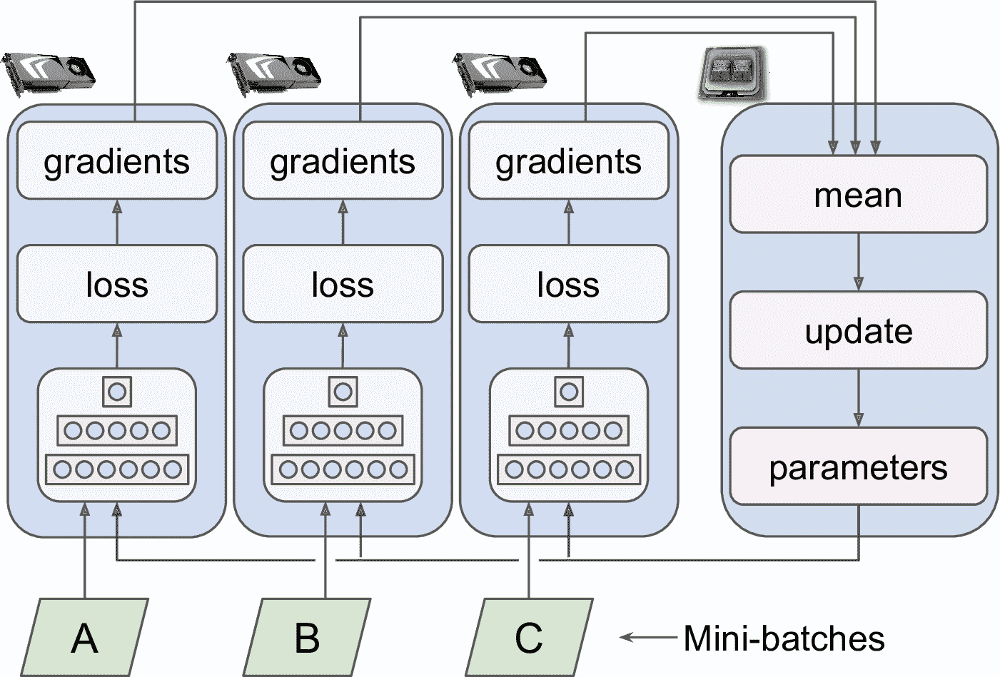

图 19-19 集中参数数据并行

镜像策略数据并行只能使用同步参数更新，而集中数据并行可以使用同步和异步更新两种方法。看看这两种方法的优点和缺点。

##### *同步更新*

同步更新中，累加器必须等待所有梯度都可用了，才计算平均梯度，再将其传给优化器，更新模型参数。当模型复制计算完梯度后，它必须等待参数更新，才能处理下一个批次。缺点是一些设备可能比一些设备慢，所以其它设备必须等待。另外，参数要同时复制到每台设备上（应用梯度之后），可能会饱和参数服务器的带宽。

> 提示：要降低每步的等待时间，可以忽略速度慢的模型复制的梯度（大概~10%）。例如，可以运行 20 个模型复制，只累加最快的 18 个，最慢的 2 个忽略。参数更新好后，前 18 个复制就能立即工作，不用等待 2 个最慢的。这样的设置被描述为 18 个复制加 2 个闲置复制。

##### *异步更新*

异步更新中，每当复制计算完了梯度，它就立即用其更新模型参数。没有累加过程（去掉了图 19-19 中的平均步骤），没有同步。模型复制彼此独立工作。因为无需等待，这种方法每分钟可以运行更多训练步。另外，尽管参数仍然需要复制到每台设备上，都是每台设备在不同时间进行的，带宽饱和风险降低了。

异步更新的数据并行是不错的方法，因为简单易行，没有同步延迟，对带宽的更佳利用。当模型复制根据一些参数值完成了梯度计算，这些参数会被其它复制更新几次（如果有`N`个复制，平均时`N-1`次），且不能保证计算好的梯度指向正确的方向（见图 19-20）。如果梯度过期，被称为陈旧梯度：它们会减慢收敛，引入噪音和抖动（学习曲线可能包含暂时的震动），或者会使训练算法发散。

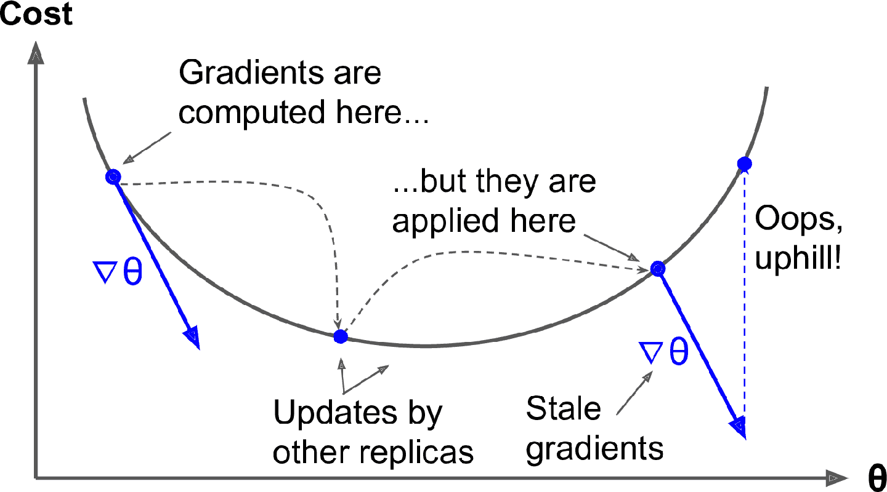

图 19-20 使用异步更新时会导致陈旧梯度

有几种方法可以减少陈旧梯度的坏处：

*   降低学习率。

*   丢弃陈旧梯度或使其变小。

*   调整批次大小。

*   只用一个复制进行前几个周期（被称为热身阶段）。陈旧梯度在训练初始阶段的破坏最大，当梯度很大且没有落入损失函数的山谷时，不同的复制会将参数推向不同方向。

[Google Brain 团队在 2016 年发表了一篇论文](https://links.jianshu.com/go?to=https%3A%2F%2Fhoml.info%2F68)，测量了几种方法，发现用闲置复制的同步更新比异步更新更加高效，收敛更快，模型效果更好。但是，这仍是一个活跃的研究领域，所以不要排除异步更新。

#### 带宽饱和

无论使用同步还是异步更新，集中式参数都需要模型复制和参数模型在每个训练步开始阶段的通信，以及在训练步的后期和梯度在其它方向的通信。相似的，在使用镜像策略时，每个 GPU 生成的梯度需要和其它 GPU 分享。想好，总是存在临界点，添加额外的 GPU 不能提高性能，因为 GPU 内存数据通信的坏处抵消了计算负载的降低。超过这点，添加更多 GPU 反而使带宽更糟，会减慢训练。

> 提示：对于一些相对小、用大训练数据训练得到的模型，最好用单机大内存带宽单 GPU 训练。

带宽饱和对于大紧密模型更加严重，因为有许多参数和梯度要传输。对于小模型和大的系数模型，不那么严重（但没怎么利用并行计算），大多数参数是 0，可以高效计算。Jeff Dean，Google Brain 的发起者和领导，指明用 50 个 GPU 分布计算紧密模型，可以加速 25-40 倍；用 500 个 GPU 训练系数模型，可以加速 300 倍。可以看到，稀疏模型扩展更好。下面是一些具体例子：

*   神经机器翻译：8 个 GPU，加速 6 倍

*   Inception/ImageNet：50 个 GPU，加速 32 倍

*   RankBrain：500 个 GPU，加速 300 倍

紧密模型使用几十块 GPU，稀疏模型使用几百块 GPU，就达到了带宽瓶颈。许多研究都在研究这个问题（使用对等架构，而不是集中式架构，做模型压缩，优化通信时间和内容，等等），接下来几年，神经网络并行计算会取得很多成果。

同时，为了解决饱和问题，最好使用一些强大的 GPU，而不是大量一般的 GPU，最好将 GPU 集中在有内网的服务器中。还可以将浮点数精度从 32 位（`tf.float32`）降到 16 位（`tf.bfloat16`）。这可以减少一般的数据传输量，通常不会影响收敛和性能。最后，如果使用集中参数，可以将参数切片到多台参数服务器上：增加参数服务器可以降低网络负载，降低贷款饱和的风险。

下面就用多个 GPU 训练模型。

### 使用 Distribution Strategies API 做规模训练

许多模型都可以用单一 GPU 或 CPU 来训练。但如果训练太慢，可以将其分布到同一台机器上的多个 GPU 上。如果还是太慢，可以换成更强大的 GPU，或添加更多的 GPU。如果模型要做重计算（比如大矩阵乘法），强大的 GPU 算的更快，你还可以尝试 Google Cloud AI Platform 的 TPU，它运行这种模型通常更快。如果加不了 GPU，也使不了 TPU（例如，TPU 没有提升，或你想使用自己的硬件架构），则你可以尝试在多台服务器上训练，每台都有多个 GPU（如果这还不成，最后一种方法是添加并行模型，但需要更多尝试）。本节，我们会学习如何规模化训练模型，从单机多 GPU 开始（或 TPU），然后是多机多 GPU。

幸好，TensorFlow 有一个非常简单的 API 做这项工作：Distribution Strategies API。要用多个 GPU 训练 Keras 模型（先用单机），用镜像策略的数据并行，创建一个对象`MirroredStrategy`，调用它的`scope()`方法，获取分布上下文，在上下文中包装模型的创建和编译。然后正常调用模型的`fit()`方法：

```py
distribution = tf.distribute.MirroredStrategy()

with distribution.scope():
    mirrored_model = tf.keras.Sequential([...])
    mirrored_model.compile([...])

batch_size = 100 # must be divisible by the number of replicas
history = mirrored_model.fit(X_train, y_train, epochs=10) 
```

在底层，`tf.keras`是分布式的，所以在这个`MirroredStrategy`上下文中，它知道要复制所有变量和运算到可用的 GPU 上。`fit()`方法，可以自动对所有模型复制分割训练批次，所以批次大小要可以被模型复制的数量整除。就是这样。比用一个 GPU，这么训练会快很多，而且代码变动很少。

训练好模型后，就可以做预测了：调用`predict()`方法，就能自动在模型复制上分割批次，并行做预测（批次大小要能被模型复制的数量整除）。如果调用模型的`save()`方法，会像常规模型那样保存。所以加载时，在单设备上（默认是 GPU 0，如果没有 GPU，就是 CPU），就和常规模型一样。如果想加载模型，并在可用设备上运行，必须在分布上下文中调用`keras.models.load_model()`：

```py
with distribution.scope():
    mirrored_model = keras.models.load_model("my_mnist_model.h5") 
```

如果只想使用 GPU 设备的一部分，可以将列表传给`MirroredStrategy`的构造器：

```py
distribution = tf.distribute.MirroredStrategy(["/gpu:0", "/gpu:1"]) 
```

默认时，`MirroredStrategy`类使用 NVIDIA Collective Communications 库（NCCL）做 AllReduce 平均值运算，但可以设置`tf.distribute.HierarchicalCopyAllReduce`类的实例，或`tf.distribute.ReductionToOneDevice`类的实例的`cross_device_ops`参数，换其它的库。默认的 NCCL 是基于类`tf.distribute.NcclAllReduce`，它通常很快，但一来 GPU 的数量和类型，所以也可以试试其它选项。

如果想用集中参数的数据并行，将`MirroredStrategy`替换为`CentralStorageStrategy`：

```py
distribution = tf.distribute.experimental.CentralStorageStrategy() 
```

你还可以设置`compute_devices`，指定作为工作器的设备（默认会使用所有的 GPU），还可以通过设置`parameter_device`，指定存储参数的设备（默认使用 CPU，或 GPU，如果只有一个 GPU 的话）。

下面看看如何用 TensorFlow 集群训练模型。

### 用 TensorFlow 集群训练模型

TensorFlow 集群是一组并行运行的 TensorFlow 进程，通常是在不同机器上，彼此通信完成工作 —— 例如，训练或执行神经网络。集群中的每个 TF 进程被称为任务（task），或 TF 服务器。它有 IP 地址，端口和类型（也被称为角色（role）或工作（job））。类型可以是`"worker"`、`"chief"`、`"ps"`（参数服务器（parameter server））、`"evaluator"`：

*   每个工作器执行计算，通常是在有一个或多个 GPU 的机器上。

*   `chief`也做计算，也做其它工作，比如写 TensorBoard 日志或存储检查点。集群中只有一个`chief`。如果没有指定`chief`，第一个工作器就是`chief`。

*   参数服务器只保留变量值的轨迹，通常是在只有 CPU 的机器上。这个类型的任务只使用`ParameterServerStrategy`。

*   评估器只做评估。

要启动 TensorFlow 集群，必须先指定。要定义每个任务的 IP 地址，TCP 端口，类型。例如，下面的集群配置定义了集群有三种任务（两个工作器一个参数服务器，见图 19-21）。集群配置是一个字典，每个工作一个键，值是任务地址（`IP:port`）列表：

```py
cluster_spec = {
    "worker": [
        "machine-a.example.com:2222",  # /job:worker/task:0
        "machine-b.example.com:2222"   # /job:worker/task:1
    ],
    "ps": ["machine-a.example.com:2221"] # /job:ps/task:0
} 
```

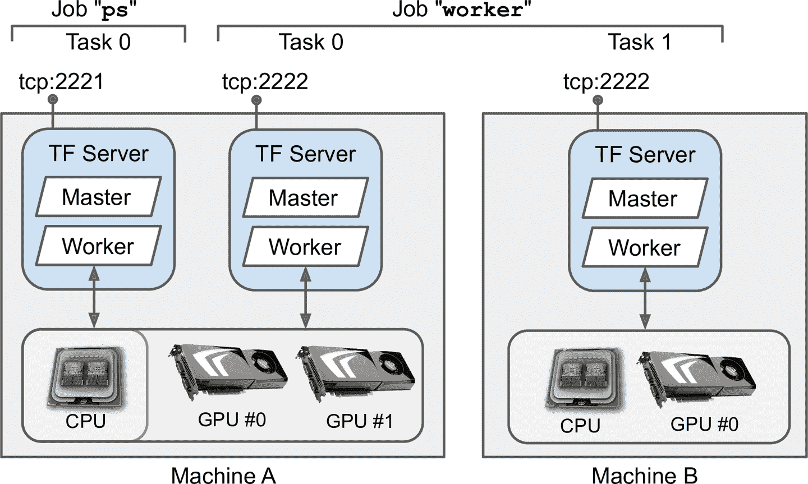

图 19-21 TensorFlow 集群

通常，每台机器只有一个任务，但这个例子说明，如果愿意，可以在一台机器上部署多个任务（如果有相同的 GPU，要确保 GPU 内存分配好）。

> 警告：默认，集群中的每个任务都可能与其它任务通信，所以要配置好防火墙确保这些机器端口的通信（如果每台机器用相同的端口，就简单一些）。

启动任务时，必须将集群配置给它，还要告诉它类型和索引（例如，工作器 0）。配置最简单的方法（集群配置和当前任务的类型和索引）是在启动 TensorFlow 前，设置环境变量`TF_CONFIG`。这是一个 JSON 编码的字典，包含集群配置（在键`"cluster"`下）、类型、任务索引（在键`"task"`下）。例如。下面的环境变量`TF_CONFIG`使用了刚才定义的集群，启动的任务是第一个工作器：

```py
import os
import json

os.environ["TF_CONFIG"] = json.dumps({
    "cluster": cluster_spec,
    "task": {"type": "worker", "index": 0}
}) 
```

> 提示：通常要在 Python 外面定义环境变量`TF_CONFIG`，代码不用包含当前任务的类型和索引（这样可以让所有工作器使用相同的代码）。

现在用集群训练一个模型。先用镜像策略。首先，给每个任务设定环境参数`TF_CONFIG`。因为没有参数服务器（去除集群配置中的`ps`键），所以通常每台机器只有一个工作器。还要保证每个任务的索引不同。最后，在每个工作器上运行下面的训练代码：

```py
distribution = tf.distribute.experimental.MultiWorkerMirroredStrategy()

with distribution.scope():
    mirrored_model = tf.keras.Sequential([...])
    mirrored_model.compile([...])

batch_size = 100 # must be divisible by the number of replicas
history = mirrored_model.fit(X_train, y_train, epochs=10) 
```

这就是前面用的代码，只是这次我们使用的是`MultiWorkerMirroredStrategy`（未来版本中，`MirroredStrategy`可能既处理单机又处理多机）。当在第一个工作器上运行脚本时，它会阻塞所有 AllReduce 步骤，最后一个工作器启动后，训练就开始了。可以看到工作器以相同的速度前进（因为每步使用的同步）。

你可以从两个 AllReduce 实现选择做分布策略：基于 gRPC 的 AllReduce 算法用于网络通信，和 NCCL 实现。最佳算法取决于工作器的数量、GPU 的数量和类型和网络。默认，TensorFlow 会选择最佳算法，但是如果想强制使用某种算法，将`CollectiveCommunication.RING`或`CollectiveCommunication.NCCL`（出自`tf.distribute.experimental`）传给策略构造器。

如果想用带有参数服务器的异步数据并行，可以将策略变为`ParameterServerStrategy`，添加一个或多个参数服务器，给每个任务配置`TF_CONFIG`。尽管工作器是异步的，每个工作器的复制是同步工作的。

最后，如果你能用 Google Cloud 的 TPU，可以如下创建`TPUStrategy`：

```py
resolver = tf.distribute.cluster_resolver.TPUClusterResolver()
tf.tpu.experimental.initialize_tpu_system(resolver)
tpu_strategy = tf.distribute.experimental.TPUStrategy(resolver) 
```

> 提示：如果是研究员，可以免费试用 TPU，见[这里](https://links.jianshu.com/go?to=https%3A%2F%2Ftensorflow.org%2Ftfrc)。

现在就可以在多机多 GPU 训练模型了。如果想训练一个大模型，需要多个 GPU 多台服务器，要么买机器，要么买云虚拟机。云服务更便宜，

### 在 Google Cloud AI Platform 上训练大任务

如果你想用 Google AI Platform，可以用相同的代码部署训练任务，平台会管理 GPU VM。

要启动任务，你需要命令行工具`gcloud`，它属于 [Google Cloud SDK](https://links.jianshu.com/go?to=https%3A%2F%2Fcloud.google.com%2Fsdk%2F)。可以在自己的机器上安装 SDK，或在 GCP 上使用 Google Cloud Shell。这是可以在浏览器中使用的终端；运行在免费的 Linux VM（Debian）上，SDK 已经安装配置好了。Cloud Shell 可以在 GCP 上任何地方使用：只要点击页面右上的图标 Activate Cloud Shell（见图 19-22）。


图 19-22 启动 Google Cloud Shell

如果想在自己机器上安装 SDK，需要运行`gcloud init`启动：需要登录 GCP 准许权限，选择想要的 GCP 项目，还有想运行的地区。`gcloud`命令可以使用 GCP 所有功能。不用每次访问网页接口，可以写脚本开启或停止虚拟机、部署模型或做任意 GCP 动作。

运行训练任务之前，你需要写训练代码，和之前的分布设置一样（例如，使用`ParameterServerStrategy`）。AI 平台会为每个 VM 设置`TF_CONFIG`。做好之后，就可以在 TF 集群部署运行了，命令行如下：

```py
$ gcloud ai-platform jobs submit training my_job_20190531_164700 \
    --region asia-southeast1 \
    --scale-tier PREMIUM_1 \
    --runtime-version 2.0 \
    --python-version 3.5 \
    --package-path /my_project/src/trainer \
    --module-name trainer.task \
    --staging-bucket gs://my-staging-bucket \
    --job-dir gs://my-mnist-model-bucket/trained_model \
    --
    --my-extra-argument1 foo --my-extra-argument2 bar 
```

浏览这些选项。命令行启动名为`my_job_20190531_164700`的训练任务，地区是`asia-southeast1`，级别是`PREMIUM_1`：对应 20 个工作器和 11 个参数服务器（查看[其它等级](https://links.jianshu.com/go?to=https%3A%2F%2Fhoml.info%2Fscaletiers)
）。所有 VM 基于 AI Platform 的 2.0 运行时（VM 配置包括 TensorFlow 2.0 和其它包）和 Python 3.5。训练代码位于字典`/my_project/src/trainer`，命令`gcloud`会自动绑定 PIP 包，并上传到 GCS 的`gs://my-staging-bucket`。然后，AI Platform 会启动几个 VM，部署这些包，运行`trainer.task`模块。最后，参数`--job-dir`和其它参数（即，分隔符`--`后面的参数）会传给训练程序：主任务会使用参数`--job-dir`在 GCS 上保存模型，在这个例子中，是在`gs://my-mnist-model-bucket/trained_model`。就是这样。在 GCP 控制台中，你可以打开导航栏，下滑到`Artificial Intelligence`，打开`AI Platform → Jobs`。可以看到在运行的任务，如果点击，可以看到图展示了每个任务的 CPU、GPU 和 RAM。点击`View Logs`，可以使用 Stackdriver 查看详细日志。

> 笔记：如果将训练数据放到 GCS 上，可以创建`tf.data.TextLineDataset`或`tf.data.TFRecordDataset`来访问：用 GCS 路径作为文件名（例如，`gs://my-data-bucket/my_data_001.csv`）。这些数据集依赖包`tf.io.gfile`访问文件：支持本地文件和 GCS 文件（要保证服务账号可以使用 GCS）。

如果想探索几个超参数的值，可以用参数指定超参数值，执行多个任务。但是，日过想探索许多超参数，最好使用 AI Platform 的超参数调节服务。

### 在 AI Platform 上做黑盒超参数调节

AI Platform 提供了强大的贝叶斯优化超参数调节服务，称为 [Google Vizier](https://links.jianshu.com/go?to=https%3A%2F%2Fhoml.info%2Fvizier)。要使用，创建任务时要传入 YAML 配置文件（`--config tuning.yaml`）。例如，可能如下：

```py
trainingInput:
  hyperparameters:
    goal: MAXIMIZE
    hyperparameterMetricTag: accuracy
    maxTrials: 10
    maxParallelTrials: 2
    params:
      - parameterName: n_layers
        type: INTEGER
        minValue: 10
        maxValue: 100
        scaleType: UNIT_LINEAR_SCALE
      - parameterName: momentum
        type: DOUBLE
        minValue: 0.1
        maxValue: 1.0
        scaleType: UNIT_LOG_SCALE 
```

它告诉 AI Platform，我们的目的是最大化指标`"accuracy"`，任务会做最多 10 次试验（每次试验都从零开始训练），最多并行运行 2 个试验。我们想调节两个超参数：`n_layers`（10 到 100 间的整数），和`momentum`（0.1 和 1.0 之间的浮点数）。参数`scaleType`指明了先验：`UNIT_LINEAR_SCALE`是扁平先验（即，没有先验偏好），`UNIT_LOG_SCALE`的先验是最优值靠近最大值（其它可能的先验是`UNIT_REVERSE_LOG_SCALE`，最佳值靠近最小值）。

`n_layers`和`momentum`参数会作为命令行参数传给训练代码。问题是训练代码如何将指标传回给 AI Platform，以便决定下一个试验使用什么超参数？AI Platform 会监督输出目录（通过`--job-dir`指定）的每个包含指标`"accuracy"`概括的事件文件（或是其它`hyperparameterMetricTag`指定的名字），读取这些值。训练代码使用`TensorBoard()`调回，就可以开始了。

任务完成后，每次试验中使用的超参数值和结果准确率会显示在任务的输出中（在`AI Platform → Jobs page`）。

> 笔记：AI Platform 还可以用于在大量数据上执行模型：每个工作器从 GCS 读取部分数据，做预测，并保存在 GCS 上。

现在就可以用各种分布策略规模化创建先进的神经网络架构了，可以用自己的机器，也可以用云 —— 还可以用高效贝叶斯优化微调超参数。

## 练习

1.  SavedModel 包含什么？如何检查内容？

2.  什么时候使用 TF Serving？它有什么特点？可以用什么工具部署 TF Serving？

3.  如何在多个 TF Serving 实例上部署模型？

4.  为什么使用 gRPC API 而不是 REST API，查询 TF Serving 模型？

5.  在移动和嵌入设备上运行，TFLite 减小模型的大小有什么方法？

6.  什么是伪量化训练，有什么用？

7.  什么是模型并行和数据并行？为什么推荐后者？

8.  在多台服务器上训练模型时，可以使用什么分布策略？如何进行选择？

9.  训练模型（或任意模型），部署到 TF Serving 或 Google Cloud AI Platform 上。写客户端代码，用 REST API 或 gRPC API 做查询。更新模型，部署新版本。客户端现在查询新版本。回滚到第一个版本。

10.  用一台机器多个 GPU、`MirroredStrategy`策略，训练模型（如果没有 GPU，可以使用带有 GPU 的 Colaboratory，创建两个虚拟 GPU）。再用`CentralStorageStrategy`训练一次，比较训练时间。

11.  在 Google Cloud AI Platform 训练一个小模型，使用黑盒超参数调节。

参考答案见附录 A。
