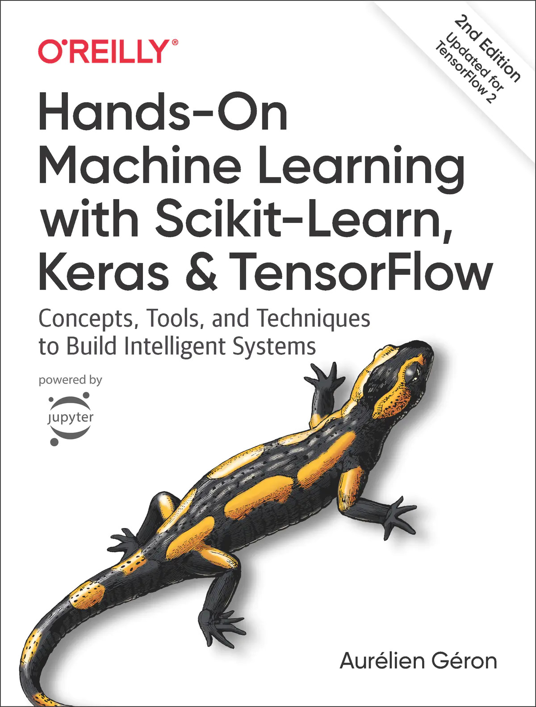

# TensorFlow 机器学习实用指南第二版



> 协议：[CC BY-NC-SA 4.0](http://creativecommons.org/licenses/by-nc-sa/4.0/)
>
> 节选自[《Sklearn 与 TensorFlow 机器学习实用指南第二版》](https://github.com/apachecn/hands-on-ml-2e-zh)
> 
> 懦夫才用磁带备份，真男人把重要的东西传到 FTP，然后世界会帮他备份。——林纳斯·托瓦兹

* [在线阅读](https://hands1ml.apachecn.org/)
* [ApacheCN 面试求职交流群 724187166](https://jq.qq.com/?_wv=1027&k=54ujcL3)
* [ApacheCN 学习资源](http://www.apachecn.org/)
* [利用 Python 进行数据分析 第二版](https://github.com/apachecn/pyda-2e-zh)

## 编译

```
npm install -g gitbook-cli          # 安装 gitbook
gitbook fetch 3.2.3                 # 安装 gitbook 子版本
gitbook install                     # 安装必要的插件
gitbook <build|pdf|epub|mobi>       # 编译 HTML/PDF/EPUB/MOBI
```


## 下载

### Docker

```
docker pull apachecn0/hands-on-ml-2e-zh
docker run -tid -p <port>:80 apachecn0/hands-on-ml-2e-zh
# 访问 http://localhost:{port} 查看文档
```

### PYPI

```
pip install hands-on-ml-2e-zh
hands-on-ml-2e-zh <port>
# 访问 http://localhost:{port} 查看文档
```

### NPM

```
npm install -g handson-ml-2e-zh
handson-ml-2e-zh <port>
# 访问 http://localhost:{port} 查看文档
```
